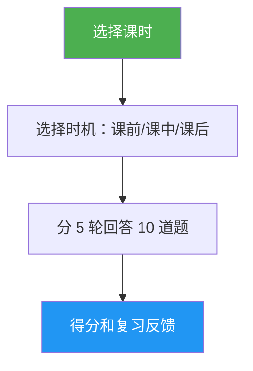

# 课时测验

> 互动测验，通过 10 道题测试您对特定 Claude Code 课时的理解，提供逐题反馈和有针对性的复习指导。

## 亮点

- 每课时 10 道题，混合概念理解和实践应用
- 覆盖全部 10 个课时（01-斜线命令 到 10-CLI）
- 三种时机模式：课前预测、进度检查或掌握验证
- 逐题反馈，包含正确答案和解释
- 有针对性的复习建议，指向特定课时章节
- `references/question-bank.md` 中涵盖所有课时的 100 道题库

## 使用时机

| 输入这个... | 技能将... |
|---|---|
| "quiz me on hooks" | 运行 10 道关于第 06 课：Hooks 的测验 |
| "lesson quiz 03" | 测试您对第 03 课：Skills 的掌握情况 |
| "do I understand MCP" | 评估您对第 05 课：MCP 的理解程度 |
| "practice quiz" | 让您选择课时，然后进行测验 |

## 工作原理



## 用法

```
/lesson-quiz [课时名称或编号]
```

示例：
```
/lesson-quiz hooks
/lesson-quiz 03
/lesson-quiz advanced-features
/lesson-quiz           # （提示选择课时）
```

## 输出

### 得分报告
- 满分 10 分的总分，以及等级（已掌握 / 熟练 / 进步中 / 入门）
- 按题目类别（概念型 vs. 实践型）分类的得分

### 逐题反馈
对于每道答错的题：
- 您的答案 vs. 正确答案
- 正确答案为何正确的解释
- 需要复习的课时特定章节

### 时机感知指导
- **课前预测**：建立基线，突出学习时需要重点关注的领域
- **课中**：识别您已掌握的内容和需要重温的内容
- **课后**：确认掌握情况或找出剩余的知识缺口

## 资源

| 路径 | 描述 |
|---|---|
| `references/question-bank.md` | 100 道预编写题目（每课时 10 道），包含答案、解释和复习指引 |
