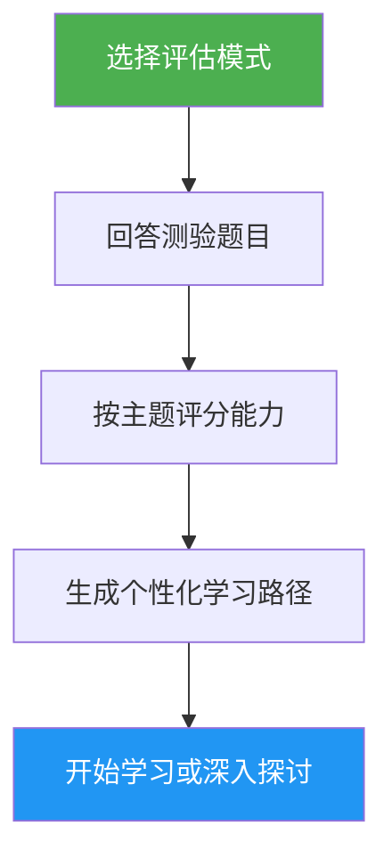

# 自我评估与学习路径顾问

> 全面的 Claude Code 能力评估，评估 10 个功能领域，识别技能差距，并生成个性化学习路径以帮助您提升。

## 亮点

- 两种评估模式：快速评估（8 题，2 分钟）和深度评估（5 轮，5 分钟）
- 评估 10 个功能领域：斜线命令、记忆、技能、Hooks、MCP、子代理、检查点、高级功能、插件、CLI
- 按主题评分，包含掌握等级（无 / 基础 / 熟练）
- 具有依赖感知优先级的差距分析
- 包含具体练习和成功标准的个性化学习路径
- 后续行动：开始学习、深入探讨、实践项目或重新评估

## 使用时机

| 输入这个... | 技能将... |
|---|---|
| "assess my level" | 运行评估测验并确定您的水平 |
| "where should I start" | 评估您的经验并建议起点 |
| "check my skills" | 在所有 10 个领域生成详细的技能画像 |
| "what should I learn next" | 识别差距并构建优先学习路径 |

## 工作原理



## 评估模式

### 快速评估（约 2 分钟）
- 2 轮 8 道是/否经验题
- 确定总体水平：初学者 / 中级 / 高级
- 列出带教程链接的具体差距
- 适合：首次使用者、快速检查

### 深度评估（约 5 分钟）
- 5 轮题目，覆盖 10 个功能领域（每轮 2 个主题）
- 按主题评分（每个 0-2 分，共 20 分）
- 包含优势领域、优先差距和复习项的掌握表
- 具有阶段和时间估算的依赖感知学习路径
- 结合差距主题的推荐实践项目
- 适合：希望提升的有经验用户、定期技能回顾

## 用法

```
/self-assessment
```

## 输出

### 技能画像表
显示每个主题的得分、掌握等级和状态（学习 / 复习 / 已掌握）。

### 个性化学习路径
- 根据依赖顺序分阶段组织
- 每个主题包含：教程链接、重点领域、关键练习、成功标准
- 根据已掌握的主题调整时间估算
- 结合多个差距领域的实践项目

### 后续行动
查看结果后，选择：
- 从有指导的练习开始学习第一个差距教程
- 深入探讨特定差距领域
- 设置一个涵盖您差距的实践项目
- 以不同评估模式重新评估
