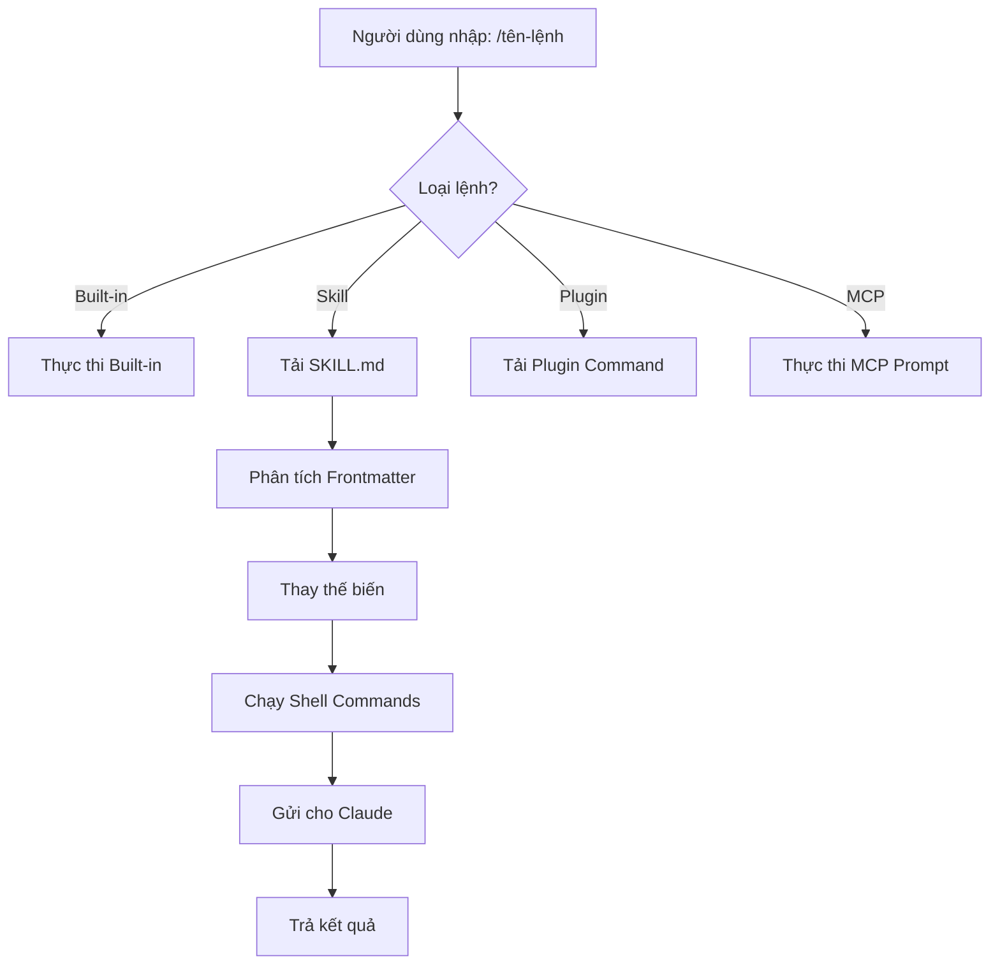
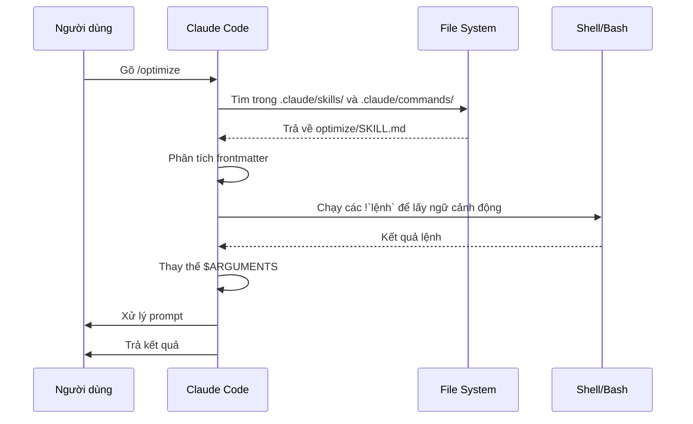

<picture>
  <source media="(prefers-color-scheme: dark)" srcset="../resources/logos/claude-howto-logo-dark.svg">
  
</picture>

# Slash Commands

## Tổng quan

Slash commands là các lệnh tắt để điều khiển hành vi của Claude trong một phiên làm việc. Chúng có một số loại:

- **Lệnh tích hợp sẵn (Built-in)**: Do Claude Code cung cấp (`/help`, `/clear`, `/model`)
- **Skills**: Lệnh do người dùng tự tạo dưới dạng file `SKILL.md` (`/optimize`, `/pr`)
- **Lệnh từ Plugin**: Lệnh từ các plugin đã cài (`/frontend-design:frontend-design`)
- **MCP prompts**: Lệnh từ MCP server (`/mcp__github__list_prs`)

> **Ghi chú**: Custom slash commands đã được hợp nhất vào skills. Các file trong `.claude/commands/` vẫn hoạt động, nhưng skills (`.claude/skills/`) là cách tiếp cận được khuyến nghị hiện nay. Cả hai đều tạo ra lệnh `/tên-lệnh`. Xem [Hướng dẫn Skills](../03-skills/) để tham khảo đầy đủ.

---

## Tham khảo lệnh tích hợp sẵn

Lệnh tích hợp sẵn là phím tắt cho các thao tác phổ biến. Hiện có **hơn 55 lệnh tích hợp** và **5 skill đi kèm**. Gõ `/` trong Claude Code để xem danh sách đầy đủ, hoặc gõ `/` kèm chữ cái để lọc.

| Lệnh | Mục đích |
|------|---------|
| `/add-dir <đường-dẫn>` | Thêm thư mục làm việc |
| `/agents` | Quản lý cấu hình agent |
| `/branch [tên]` | Tách conversation sang phiên mới (bí danh: `/fork`). Lưu ý: `/fork` đổi tên thành `/branch` từ v2.1.77 |
| `/btw <câu-hỏi>` | Đặt câu hỏi nhanh không lưu vào lịch sử |
| `/chrome` | Cấu hình tích hợp Chrome browser |
| `/clear` | Xóa conversation (bí danh: `/reset`, `/new`) |
| `/color [màu\|default]` | Đặt màu thanh prompt |
| `/compact [hướng-dẫn]` | Nén conversation với hướng dẫn tùy chọn |
| `/config` | Mở Settings (bí danh: `/settings`) |
| `/context` | Hiển thị mức sử dụng context dạng lưới màu |
| `/copy [N]` | Copy phản hồi của assistant vào clipboard; `w` ghi ra file |
| `/cost` | Hiện thống kê sử dụng token |
| `/desktop` | Tiếp tục trong Desktop app (bí danh: `/app`) |
| `/diff` | Xem diff tương tác cho các thay đổi chưa commit |
| `/doctor` | Chẩn đoán tình trạng cài đặt |
| `/effort [low\|medium\|high\|max\|auto]` | Đặt mức nỗ lực. `max` yêu cầu Opus 4.6 |
| `/exit` | Thoát REPL (bí danh: `/quit`) |
| `/export [tên-file]` | Xuất conversation hiện tại ra file hoặc clipboard |
| `/extra-usage` | Cấu hình extra usage cho rate limits |
| `/fast [on\|off]` | Bật/tắt fast mode |
| `/feedback` | Gửi phản hồi (bí danh: `/bug`) |
| `/help` | Hiển thị trợ giúp |
| `/hooks` | Xem cấu hình hook |
| `/ide` | Quản lý tích hợp IDE |
| `/init` | Khởi tạo `CLAUDE.md`. Đặt `CLAUDE_CODE_NEW_INIT=true` để dùng luồng tương tác |
| `/insights` | Tạo báo cáo phân tích phiên làm việc |
| `/install-github-app` | Thiết lập GitHub Actions app |
| `/install-slack-app` | Cài Slack app |
| `/keybindings` | Mở cấu hình phím tắt |
| `/login` | Chuyển tài khoản Anthropic |
| `/logout` | Đăng xuất khỏi tài khoản Anthropic |
| `/mcp` | Quản lý MCP server và OAuth |
| `/memory` | Chỉnh sửa `CLAUDE.md`, bật/tắt auto-memory |
| `/mobile` | QR code cho mobile app (bí danh: `/ios`, `/android`) |
| `/model [model]` | Chọn model với mũi tên trái/phải để chỉnh effort |
| `/passes` | Chia sẻ một tuần miễn phí Claude Code |
| `/permissions` | Xem/cập nhật quyền (bí danh: `/allowed-tools`) |
| `/plan [mô-tả]` | Vào planning mode |
| `/plugin` | Quản lý plugin |
| `/pr-comments [PR]` | Lấy comments của GitHub PR |
| `/privacy-settings` | Cài đặt quyền riêng tư (chỉ Pro/Max) |
| `/release-notes` | Xem changelog |
| `/reload-plugins` | Tải lại các plugin đang hoạt động |
| `/remote-control` | Điều khiển từ xa qua claude.ai (bí danh: `/rc`) |
| `/remote-env` | Cấu hình môi trường remote mặc định |
| `/rename [tên]` | Đổi tên phiên làm việc |
| `/resume [phiên]` | Tiếp tục conversation (bí danh: `/continue`) |
| `/review` | **Đã lỗi thời** — hãy cài plugin `code-review` thay thế |
| `/rewind` | Tua lại conversation và/hoặc code (bí danh: `/checkpoint`) |
| `/sandbox` | Bật/tắt sandbox mode |
| `/schedule [mô-tả]` | Tạo/quản lý tác vụ theo lịch |
| `/security-review` | Phân tích branch để tìm lỗ hổng bảo mật |
| `/skills` | Liệt kê các skill đang có |
| `/stats` | Trực quan hóa lượng dùng theo ngày, phiên, chuỗi ngày |
| `/status` | Hiện phiên bản, model, tài khoản |
| `/statusline` | Cấu hình thanh trạng thái |
| `/tasks` | Liệt kê/quản lý background task |
| `/terminal-setup` | Cấu hình phím tắt terminal |
| `/theme` | Đổi theme màu sắc |
| `/vim` | Bật/tắt chế độ Vim/Normal |
| `/voice` | Bật/tắt voice dictation push-to-talk |

### Skills đi kèm sẵn

Các skill này đi kèm với Claude Code và được gọi như slash command:

| Skill | Mục đích |
|-------|---------|
| `/batch <hướng-dẫn>` | Điều phối thay đổi song song quy mô lớn dùng worktrees |
| `/claude-api` | Tải tham khảo Claude API cho ngôn ngữ dự án |
| `/debug [mô-tả]` | Bật debug logging |
| `/loop [khoảng-thời-gian] <prompt>` | Chạy prompt lặp lại theo khoảng thời gian |
| `/simplify [trọng-tâm]` | Review các file đã thay đổi về chất lượng code |

### Lệnh đã lỗi thời

| Lệnh | Trạng thái |
|------|-----------|
| `/review` | Đã lỗi thời — thay bằng plugin `code-review` |
| `/output-style` | Đã lỗi thời từ v2.1.73 |
| `/fork` | Đổi tên thành `/branch` (bí danh vẫn hoạt động, v2.1.77) |

### Thay đổi gần đây

- `/fork` đổi tên thành `/branch`, `/fork` được giữ làm bí danh (v2.1.77)
- `/output-style` đã lỗi thời (v2.1.73)
- `/review` lỗi thời, thay bằng plugin `code-review`
- Thêm lệnh `/effort` với level `max` yêu cầu Opus 4.6
- Thêm lệnh `/voice` cho voice dictation push-to-talk
- Thêm lệnh `/schedule` để tạo/quản lý tác vụ theo lịch
- Thêm lệnh `/color` để tùy chỉnh màu thanh prompt
- Bộ chọn `/model` hiện hiển thị nhãn dễ đọc (ví dụ: "Sonnet 4.6") thay vì model ID thô
- `/resume` hỗ trợ bí danh `/continue`
- MCP prompts có thể dùng dưới dạng lệnh `/mcp__<server>__<prompt>` (xem [MCP Prompts as Commands](#mcp-prompts-dưới-dạng-lệnh))

---

## Lệnh tùy chỉnh (nay là Skills)

Custom slash commands đã được **hợp nhất vào skills**. Cả hai cách đều tạo lệnh có thể gọi bằng `/tên-lệnh`:

| Cách | Vị trí | Trạng thái |
|------|--------|-----------|
| **Skills (Khuyến nghị)** | `.claude/skills/<tên>/SKILL.md` | Tiêu chuẩn hiện tại |
| **Legacy Commands** | `.claude/commands/<tên>.md` | Vẫn hoạt động |

Nếu một skill và một command có cùng tên, **skill được ưu tiên hơn**. Ví dụ: khi cả `.claude/commands/review.md` và `.claude/skills/review/SKILL.md` cùng tồn tại, phiên bản skill sẽ được dùng.

### Lộ trình chuyển đổi

Các file `.claude/commands/` hiện tại vẫn hoạt động bình thường. Để chuyển sang skills:

**Trước (Command):**
```
.claude/commands/optimize.md
```

**Sau (Skill):**
```
.claude/skills/optimize/SKILL.md
```

### Tại sao dùng Skills?

Skills có thêm nhiều tính năng so với legacy commands:

- **Cấu trúc thư mục**: Đóng gói scripts, templates và file tham khảo
- **Auto-invocation**: Claude có thể tự kích hoạt skill khi phù hợp (không cần gọi tay)
- **Kiểm soát cách gọi**: Chọn ai được gọi — người dùng, Claude, hoặc cả hai
- **Chạy trong subagent**: Chạy skill trong context riêng biệt với `context: fork`
- **Tải thông tin dần**: Chỉ tải thêm file khi cần

### Tạo lệnh tùy chỉnh dưới dạng Skill

Tạo một thư mục với file `SKILL.md`:

```bash
mkdir -p .claude/skills/my-command
```

**File:** `.claude/skills/my-command/SKILL.md`

```yaml
---
name: my-command
description: Lệnh này làm gì và khi nào dùng
---

# My Command

Hướng dẫn cho Claude thực hiện khi lệnh này được gọi.

1. Bước đầu tiên
2. Bước thứ hai
3. Bước thứ ba
```

### Tham khảo Frontmatter

> **Ghi chú**: Frontmatter là phần cấu hình ở đầu file, nằm giữa hai dấu `---`. Đây là nơi bạn định nghĩa tên lệnh, mô tả và các tùy chọn.

| Trường | Mục đích | Mặc định |
|--------|---------|---------|
| `name` | Tên lệnh (thành `/tên`) | Tên thư mục |
| `description` | Mô tả ngắn (giúp Claude biết khi nào nên dùng) | Đoạn văn đầu tiên |
| `argument-hint` | Tham số dự kiến để auto-completion | Không có |
| `allowed-tools` | Các tool lệnh được dùng không cần xin phép | Kế thừa |
| `model` | Model cụ thể để dùng | Kế thừa |
| `disable-model-invocation` | Nếu `true`, chỉ người dùng mới gọi được (Claude không tự gọi) | `false` |
| `user-invocable` | Nếu `false`, ẩn khỏi menu `/` | `true` |
| `context` | Đặt thành `fork` để chạy trong subagent riêng biệt | Không có |
| `agent` | Loại agent khi dùng `context: fork` | `general-purpose` |
| `hooks` | Hook riêng cho skill (PreToolUse, PostToolUse, Stop) | Không có |

### Tham số (Arguments)

Lệnh có thể nhận tham số truyền vào:

**Tất cả tham số với `$ARGUMENTS`:**

```yaml
---
name: fix-issue
description: Sửa một GitHub issue theo số
---

Fix issue #$ARGUMENTS theo chuẩn code của chúng ta
```

Dùng: `/fix-issue 123` → `$ARGUMENTS` trở thành "123"

**Từng tham số riêng lẻ với `$0`, `$1`, v.v.:**

```yaml
---
name: review-pr
description: Review một PR với mức độ ưu tiên
---

Review PR #$0 với mức ưu tiên $1
```

Dùng: `/review-pr 456 high` → `$0`="456", `$1`="high"

### Ngữ cảnh động với Shell Commands

Thực thi lệnh bash trước prompt bằng cách dùng `` !`lệnh` ``:

```yaml
---
name: commit
description: Tạo git commit với ngữ cảnh từ repository
allowed-tools: Bash(git *)
---

## Ngữ cảnh hiện tại

- Git status: !`git status`
- Git diff: !`git diff HEAD`
- Branch hiện tại: !`git branch --show-current`
- Commit gần đây: !`git log --oneline -5`

## Nhiệm vụ

Dựa trên các thay đổi trên, tạo một git commit phù hợp.
```

> **Tại sao dùng `!`lệnh``?** Đây là cách để skill tự động lấy thông tin mới nhất từ hệ thống trước khi gửi cho Claude — thay vì phải tự nhập tay mỗi lần.

### Tham chiếu file

Đưa nội dung file vào prompt bằng `@`:

```markdown
Review cài đặt trong @src/utils/helpers.js
So sánh @src/old-version.js với @src/new-version.js
```

---

## Lệnh từ Plugin

Plugin có thể cung cấp lệnh tùy chỉnh:

```
/tên-plugin:tên-lệnh
```

Hoặc chỉ `/tên-lệnh` khi không có xung đột tên.

**Ví dụ:**
```bash
/frontend-design:frontend-design
/commit-commands:commit
```

---

## MCP Prompts dưới dạng lệnh

MCP server có thể cung cấp prompts dưới dạng slash command:

```
/mcp__<tên-server>__<tên-prompt> [tham-số]
```

**Ví dụ:**
```bash
/mcp__github__list_prs
/mcp__github__pr_review 456
/mcp__jira__create_issue "Tiêu đề bug" high
```

### Cú pháp quyền MCP

Kiểm soát quyền truy cập MCP server trong cài đặt permissions:

- `mcp__github` — Truy cập toàn bộ GitHub MCP server
- `mcp__github__*` — Truy cập wildcard tất cả tool
- `mcp__github__get_issue` — Truy cập một tool cụ thể

---

## Kiến trúc lệnh



## Vòng đời của lệnh



---

## Các lệnh mẫu trong thư mục này

Các lệnh mẫu dưới đây có thể được cài dưới dạng skill hoặc legacy command.

### 1. `/optimize` — Tối ưu code

Phân tích code để tìm vấn đề hiệu năng, memory leak và cơ hội tối ưu.

**Cách dùng:**
```
/optimize
[Dán code của bạn vào]
```

### 2. `/pr` — Chuẩn bị Pull Request

Hướng dẫn qua checklist chuẩn bị PR bao gồm linting, testing và định dạng commit.

**Cách dùng:**
```
/pr
```

### 3. `/generate-api-docs` — Tạo tài liệu API

Tự động tạo tài liệu API đầy đủ từ source code.

**Cách dùng:**
```
/generate-api-docs
```

### 4. `/commit` — Git commit với ngữ cảnh

Tạo git commit với ngữ cảnh được lấy tự động từ repository.

**Cách dùng:**
```
/commit [thông-điệp-tùy-chọn]
```

### 5. `/push-all` — Stage, Commit và Push

Stage tất cả thay đổi, tạo commit và push lên remote với các kiểm tra an toàn.

**Cách dùng:**
```
/push-all
```

**Kiểm tra an toàn tự động:**
- Secrets: `.env*`, `*.key`, `*.pem`, `credentials.json`
- API Keys: Phát hiện key thật so với placeholder
- File lớn: `>10MB` mà không có Git LFS
- Build artifacts: `node_modules/`, `dist/`, `__pycache__/`

### 6. `/doc-refactor` — Tái cấu trúc tài liệu

Tái cấu trúc tài liệu dự án cho rõ ràng và dễ tiếp cận hơn.

**Cách dùng:**
```
/doc-refactor
```

### 7. `/setup-ci-cd` — Thiết lập CI/CD Pipeline

Triển khai pre-commit hooks và GitHub Actions cho đảm bảo chất lượng.

**Cách dùng:**
```
/setup-ci-cd
```

### 8. `/unit-test-expand` — Mở rộng test coverage

Tăng test coverage bằng cách nhắm vào các nhánh chưa được test và edge case.

**Cách dùng:**
```
/unit-test-expand
```

---

## Cài đặt

### Dưới dạng Skills (Khuyến nghị)

Copy vào thư mục skills:

```bash
# Tạo thư mục skills
mkdir -p .claude/skills

# Với mỗi file lệnh, tạo thư mục skill tương ứng
for cmd in optimize pr commit; do
  mkdir -p .claude/skills/$cmd
  cp 01-slash-commands/$cmd.md .claude/skills/$cmd/SKILL.md
done
```

### Dưới dạng Legacy Commands

Copy vào thư mục commands:

```bash
# Cho toàn dự án (cả team)
mkdir -p .claude/commands
cp 01-slash-commands/*.md .claude/commands/

# Cho cá nhân
mkdir -p ~/.claude/commands
cp 01-slash-commands/*.md ~/.claude/commands/
```

---

## Tự tạo lệnh của riêng bạn

### Template Skill (Khuyến nghị)

Tạo `.claude/skills/my-command/SKILL.md`:

```yaml
---
name: my-command
description: Lệnh này làm gì. Dùng khi [điều kiện kích hoạt].
argument-hint: [tham-số-tùy-chọn]
allowed-tools: Bash(npm *), Read, Grep
---

# Tiêu đề lệnh

## Ngữ cảnh

- Branch hiện tại: !`git branch --show-current`
- File liên quan: @package.json

## Hướng dẫn

1. Bước đầu tiên
2. Bước thứ hai với tham số: $ARGUMENTS
3. Bước thứ ba

## Định dạng output

- Cách định dạng kết quả trả về
- Cần bao gồm những gì
```

### Lệnh chỉ dành cho người dùng (Không tự kích hoạt)

Dành cho lệnh có side effect mà Claude không nên tự kích hoạt:

```yaml
---
name: deploy
description: Deploy lên production
disable-model-invocation: true
allowed-tools: Bash(npm *), Bash(git *)
---

Deploy ứng dụng lên production:

1. Chạy tests
2. Build ứng dụng
3. Push lên deployment target
4. Xác nhận deployment thành công
```

---

## Thực hành tốt nhất

| Nên làm | Không nên làm |
|---------|--------------|
| Đặt tên rõ ràng, hướng hành động | Tạo lệnh cho tác vụ chỉ dùng một lần |
| Viết `description` kèm điều kiện kích hoạt | Đưa logic phức tạp vào lệnh |
| Giữ lệnh tập trung vào một nhiệm vụ | Hardcode thông tin nhạy cảm |
| Dùng `disable-model-invocation` cho lệnh có side effect | Bỏ qua trường description |
| Dùng `!` để lấy ngữ cảnh động | Giả định Claude đã biết trạng thái hiện tại |
| Tổ chức file liên quan vào thư mục skill | Nhồi mọi thứ vào một file |

---

## Xử lý sự cố

### Lệnh không tìm thấy

**Giải pháp:**
- Kiểm tra file có tại `.claude/skills/<tên>/SKILL.md` hoặc `.claude/commands/<tên>.md` không
- Xác nhận trường `name` trong frontmatter khớp với tên lệnh mong đợi
- Khởi động lại phiên Claude Code
- Chạy `/help` để xem danh sách lệnh có sẵn

### Lệnh không thực thi như mong đợi

**Giải pháp:**
- Thêm hướng dẫn cụ thể hơn
- Đưa ví dụ vào file skill
- Kiểm tra `allowed-tools` nếu dùng bash commands
- Thử với input đơn giản trước

### Xung đột Skill vs Command

Nếu cả hai cùng tên, **skill được ưu tiên hơn**. Xóa một hoặc đổi tên.

---

## Hướng dẫn liên quan

- **[Skills](../03-skills/)** — Tham khảo đầy đủ về skills (khả năng tự kích hoạt)
- **[Memory](../02-memory/)** — Ngữ cảnh lâu dài với CLAUDE.md
- **[Subagents](../04-subagents/)** — AI agent được ủy quyền
- **[Plugins](../07-plugins/)** — Bộ lệnh đóng gói sẵn
- **[Hooks](../06-hooks/)** — Tự động hóa theo sự kiện

## Tài nguyên bổ sung

- [Tài liệu Interactive Mode chính thức](https://code.claude.com/docs/en/interactive-mode) — Tham khảo lệnh tích hợp sẵn
- [Tài liệu Skills chính thức](https://code.claude.com/docs/en/skills) — Tham khảo skills đầy đủ
- [CLI Reference](https://code.claude.com/docs/en/cli-reference) — Tùy chọn command-line

---

*Thuộc chuỗi hướng dẫn [Claude How To](../)*

---

> **Ghi chú cho bản dịch tiếng Việt:** Bản gốc tiếng Anh luôn là nguồn chính xác nhất: [README.md](README.md).
