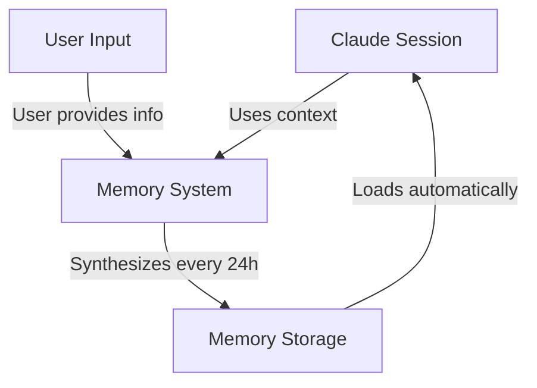
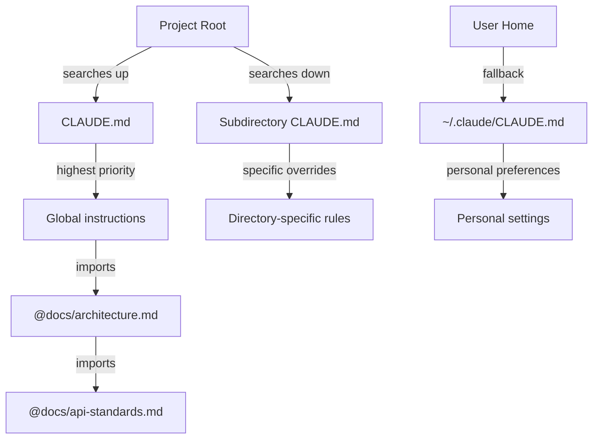
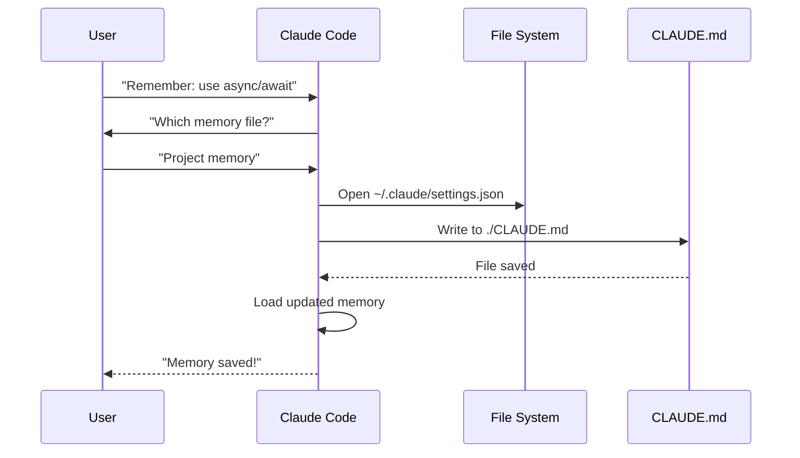

# Memory Guide

Memory enables Claude to retain context across sessions and conversations. It exists in two forms: automatic synthesis in claude.ai, and filesystem-based CLAUDE.md in Claude Code.

## Overview

Memory in Claude Code provides persistent context that carries across multiple sessions and conversations. Unlike temporary context windows, memory files allow you to:

- Share project standards across your team
- Store personal development preferences
- Maintain directory-specific rules and configurations
- Import external documentation
- Version control memory as part of your project

The memory system operates at multiple levels, from global personal preferences down to specific subdirectories, allowing for fine-grained control over what Claude remembers and how it applies that knowledge.

## Memory Commands Quick Reference

| Command | Purpose | Usage | When to Use |
|---------|---------|-------|-------------|
| `/init` | Initialize project memory | `/init` | Starting new project, first-time CLAUDE.md setup |
| `/memory` | Edit memory files in editor | `/memory` | Extensive updates, reorganization, reviewing content |
| `#` prefix | Quick single-line memory add | `# Your rule here` | Adding quick rules during conversation |
| `# new rule into memory` | Explicit memory addition | `# new rule into memory<br/>Your detailed rule` | Adding complex multi-line rules |
| `# remember this` | Natural language memory | `# remember this<br/>Your instruction` | Conversational memory updates |
| `@path/to/file` | Import external content | `@README.md` or `@docs/api.md` | Referencing existing documentation in CLAUDE.md |

## Quick Start: Initializing Memory

### The `/init` Command

The `/init` command is the fastest way to set up project memory in Claude Code. It initializes a CLAUDE.md file with foundational project documentation.

**Usage:**

```bash
/init
```

**What it does:**

- Creates a new CLAUDE.md file in your project (typically at `./CLAUDE.md` or `./.claude/CLAUDE.md`)
- Establishes project conventions and guidelines
- Sets up the foundation for context persistence across sessions
- Provides a template structure for documenting your project standards

**When to use `/init`:**

- Starting a new project with Claude Code
- Establishing team coding standards and conventions
- Creating documentation about your codebase structure
- Setting up memory hierarchy for collaborative development

**Example workflow:**

```markdown
# In your project directory
/init

# Claude creates CLAUDE.md with structure like:
# Project Configuration
## Project Overview
- Name: Your Project
- Tech Stack: [Your technologies]
- Team Size: [Number of developers]

## Development Standards
- Code style preferences
- Testing requirements
- Git workflow conventions
```

### Quick Memory Updates with `#`

You can quickly add information to memory during any conversation by starting your message with `#`:

**Syntax:**

```markdown
# Your memory rule or instruction here
```

**Examples:**

```markdown
# Always use TypeScript strict mode in this project

# Prefer async/await over promise chains

# Run npm test before every commit

# Use kebab-case for file names
```

**How it works:**

1. Start your message with `#` followed by your rule
2. Claude recognizes this as a memory update request
3. Claude asks which memory file to update (project or personal)
4. The rule is added to the appropriate CLAUDE.md file
5. Future sessions automatically load this context

**Alternative patterns:**

```markdown
# new rule into memory
Always validate user input with Zod schemas

# remember this
Use semantic versioning for all releases

# add to memory
Database migrations must be reversible
```

### The `/memory` Command

The `/memory` command provides direct access to edit your CLAUDE.md memory files within Claude Code sessions. It opens your memory files in your system editor for comprehensive editing.

**Usage:**

```bash
/memory
```

**What it does:**

- Opens your memory files in your system's default editor
- Allows you to make extensive additions, modifications, and reorganizations
- Provides direct access to all memory files in the hierarchy
- Enables you to manage persistent context across sessions

**When to use `/memory`:**

- Reviewing existing memory content
- Making extensive updates to project standards
- Reorganizing memory structure
- Adding detailed documentation or guidelines
- Maintaining and updating memory as your project evolves

**Comparison: `/memory` vs `/init`**

| Aspect | `/memory` | `/init` |
|--------|-----------|---------|
| **Purpose** | Edit existing memory files | Initialize new CLAUDE.md |
| **When to use** | Update/modify project context | Begin new projects |
| **Action** | Opens editor for changes | Generates starter template |
| **Workflow** | Ongoing maintenance | One-time setup |

**Example workflow:**

```markdown
# Open memory for editing
/memory

# Claude presents options:
# 1. Enterprise Policy Memory
# 2. Project Memory (./CLAUDE.md)
# 3. User Memory (~/.claude/CLAUDE.md)
# 4. Local Project Memory

# Choose option 2 (Project Memory)
# Your default editor opens with ./CLAUDE.md content

# Make changes, save, and close editor
# Claude automatically reloads the updated memory
```

**Using Memory Imports:**

CLAUDE.md files support the `@path/to/file` syntax to include external content:

```markdown
# Project Documentation
See @README.md for project overview
See @package.json for available npm commands
See @docs/architecture.md for system design
```

**Import features:**

- Supports both relative and absolute paths
- Enables recursive nesting up to 5 levels deep
- Helps avoid duplication by referencing existing documentation
- Automatically includes referenced content in Claude's context

## Memory Architecture

Memory in Claude Code follows a hierarchical system where different scopes serve different purposes:



## Memory Hierarchy in Claude Code

Claude Code uses a four-tier hierarchical memory system. Memory files are automatically loaded when Claude Code launches, with higher-level files taking precedence.

**Complete Memory Hierarchy (in order of precedence):**

1. **Enterprise Policy** - Organization-wide instructions
   - macOS: `/Library/Application Support/ClaudeCode/CLAUDE.md`
   - Linux: `/etc/claude-code/CLAUDE.md`
   - Windows: `C:\ProgramData\ClaudeCode\CLAUDE.md`

2. **Project Memory** - Team-shared context (version controlled)
   - `./.claude/CLAUDE.md` or `./CLAUDE.md` (in repository root)

3. **User Memory** - Personal preferences
   - `~/.claude/CLAUDE.md`

4. **Local Project Memory** - Personal project-specific preferences (deprecated)
   - `./CLAUDE.local.md`

**Memory Discovery Behavior:**

Claude searches for memory files in this order, with earlier locations taking precedence:



## Memory Locations Table

| Location | Scope | Priority | Shared | Access | Best For |
|----------|-------|----------|--------|--------|----------|
| `/Library/Application Support/ClaudeCode/CLAUDE.md` (macOS) | Enterprise | Highest | Organization | System | Company-wide policies |
| `/etc/claude-code/CLAUDE.md` (Linux) | Enterprise | Highest | Organization | System | Organization standards |
| `C:\ProgramData\ClaudeCode\CLAUDE.md` (Windows) | Enterprise | Highest | Organization | System | Corporate guidelines |
| `./CLAUDE.md` | Project | High | Team | Git | Team standards, shared architecture |
| `./.claude/CLAUDE.md` | Project | High | Team | Git | Alternative project location |
| `./subdir/CLAUDE.md` | Directory | Medium | Team | Git | Directory-specific rules |
| `~/.claude/CLAUDE.md` | Personal | Low | Individual | Filesystem | Personal preferences |
| `./CLAUDE.local.md` | Project Local | Deprecated | Individual | Git (ignored) | Personal project notes (deprecated) |

## Memory Update Lifecycle

Here's how memory updates flow through your Claude Code sessions:



## Practical Examples

### Example 1: Project Memory Structure

**File:** `./CLAUDE.md`

```markdown
# Project Configuration

## Project Overview
- **Name**: E-commerce Platform
- **Tech Stack**: Node.js, PostgreSQL, React 18, Docker
- **Team Size**: 5 developers
- **Deadline**: Q4 2025

## Architecture
@docs/architecture.md
@docs/api-standards.md
@docs/database-schema.md

## Development Standards

### Code Style
- Use Prettier for formatting
- Use ESLint with airbnb config
- Maximum line length: 100 characters
- Use 2-space indentation

### Naming Conventions
- **Files**: kebab-case (user-controller.js)
- **Classes**: PascalCase (UserService)
- **Functions/Variables**: camelCase (getUserById)
- **Constants**: UPPER_SNAKE_CASE (API_BASE_URL)
- **Database Tables**: snake_case (user_accounts)

### Git Workflow
- Branch names: `feature/description` or `fix/description`
- Commit messages: Follow conventional commits
- PR required before merge
- All CI/CD checks must pass
- Minimum 1 approval required

### Testing Requirements
- Minimum 80% code coverage
- All critical paths must have tests
- Use Jest for unit tests
- Use Cypress for E2E tests
- Test filenames: `*.test.ts` or `*.spec.ts`

### API Standards
- RESTful endpoints only
- JSON request/response
- Use HTTP status codes correctly
- Version API endpoints: `/api/v1/`
- Document all endpoints with examples

### Database
- Use migrations for schema changes
- Never hardcode credentials
- Use connection pooling
- Enable query logging in development
- Regular backups required

### Deployment
- Docker-based deployment
- Kubernetes orchestration
- Blue-green deployment strategy
- Automatic rollback on failure
- Database migrations run before deploy

## Common Commands

| Command | Purpose |
|---------|---------|
| `npm run dev` | Start development server |
| `npm test` | Run test suite |
| `npm run lint` | Check code style |
| `npm run build` | Build for production |
| `npm run migrate` | Run database migrations |

## Team Contacts
- Tech Lead: Sarah Chen (@sarah.chen)
- Product Manager: Mike Johnson (@mike.j)
- DevOps: Alex Kim (@alex.k)

## Known Issues & Workarounds
- PostgreSQL connection pooling limited to 20 during peak hours
- Workaround: Implement query queuing
- Safari 14 compatibility issues with async generators
- Workaround: Use Babel transpiler

## Related Projects
- Analytics Dashboard: `/projects/analytics`
- Mobile App: `/projects/mobile`
- Admin Panel: `/projects/admin`
```

### Example 2: Directory-Specific Memory

**File:** `./src/api/CLAUDE.md`

```markdown
# API Module Standards

This file overrides root CLAUDE.md for everything in /src/api/

## API-Specific Standards

### Request Validation
- Use Zod for schema validation
- Always validate input
- Return 400 with validation errors
- Include field-level error details

### Authentication
- All endpoints require JWT token
- Token in Authorization header
- Token expires after 24 hours
- Implement refresh token mechanism

### Response Format

All responses must follow this structure:

```json
{
  "success": true,
  "data": { /* actual data */ },
  "timestamp": "2025-11-06T10:30:00Z",
  "version": "1.0"
}
```

Error responses:
```json
{
  "success": false,
  "error": {
    "code": "VALIDATION_ERROR",
    "message": "User message",
    "details": { /* field errors */ }
  },
  "timestamp": "2025-11-06T10:30:00Z"
}
```

### Pagination
- Use cursor-based pagination (not offset)
- Include `hasMore` boolean
- Limit max page size to 100
- Default page size: 20

### Rate Limiting
- 1000 requests per hour for authenticated users
- 100 requests per hour for public endpoints
- Return 429 when exceeded
- Include retry-after header

### Caching
- Use Redis for session caching
- Cache duration: 5 minutes default
- Invalidate on write operations
- Tag cache keys with resource type
```

### Example 3: Personal Memory

**File:** `~/.claude/CLAUDE.md`

```markdown
# My Development Preferences

## About Me
- **Experience Level**: 8 years full-stack development
- **Preferred Languages**: TypeScript, Python
- **Communication Style**: Direct, with examples
- **Learning Style**: Visual diagrams with code

## Code Preferences

### Error Handling
I prefer explicit error handling with try-catch blocks and meaningful error messages.
Avoid generic errors. Always log errors for debugging.

### Comments
Use comments for WHY, not WHAT. Code should be self-documenting.
Comments should explain business logic or non-obvious decisions.

### Testing
I prefer TDD (test-driven development).
Write tests first, then implementation.
Focus on behavior, not implementation details.

### Architecture
I prefer modular, loosely-coupled design.
Use dependency injection for testability.
Separate concerns (Controllers, Services, Repositories).

## Debugging Preferences
- Use console.log with prefix: `[DEBUG]`
- Include context: function name, relevant variables
- Use stack traces when available
- Always include timestamps in logs

## Communication
- Explain complex concepts with diagrams
- Show concrete examples before explaining theory
- Include before/after code snippets
- Summarize key points at the end

## Project Organization
I organize my projects as:

   project/
   ├── src/
   │   ├── api/
   │   ├── services/
   │   ├── models/
   │   └── utils/
   ├── tests/
   ├── docs/
   └── docker/

## Tooling
- **IDE**: VS Code with vim keybindings
- **Terminal**: Zsh with Oh-My-Zsh
- **Format**: Prettier (100 char line length)
- **Linter**: ESLint with airbnb config
- **Test Framework**: Jest with React Testing Library
```

_My Test_
Ask Claude to save a new rule


Claude has not save the rule because I did not have any `Claude.md` file anywhere. Then asked Claude to confirm the location.


### Example 4: Memory Update During Session

You can add new rules to memory during an active Claude Code session. There are two ways to do this:

#### Method 1: Direct Request

```markdown
User: Remember that I prefer using React hooks instead of class components
     for all new components.

Claude: I'm adding that to your memory. Which memory file should this go in?
        1. Project memory (./CLAUDE.md)
        2. Personal memory (~/.claude/CLAUDE.md)

User: Project memory

Claude: ✅ Memory saved!

Added to ./CLAUDE.md:
---

### Component Development
- Use functional components with React Hooks
- Prefer hooks over class components
- Custom hooks for reusable logic
- Use useCallback for event handlers
- Use useMemo for expensive computations
```

#### Method 2: Using "# new rule into memory" Pattern

You can also use the explicit pattern "# new rule into memory" to trigger memory updates:

```markdown
User: # new rule into memory
      Always validate user input with Zod schemas before processing.

Claude: I'm saving this rule to memory. Which memory file should I use?
        1. Project memory (./CLAUDE.md)
        2. Personal memory (~/.claude/CLAUDE.md)

User: Project memory

Claude: ✅ Memory saved!

Added to ./CLAUDE.md:
---

### Input Validation
- Always validate user input with Zod schemas before processing
- Define schemas at the top of each API handler file
- Return 400 status with validation errors
```

#### Tips for Adding Memory

- Be specific and actionable in your rules
- Group related rules together under a section header
- Update existing sections instead of duplicating content
- Choose the appropriate memory scope (project vs. personal)

## Memory Features Comparison

| Feature | Claude Web/Desktop | Claude Code (CLAUDE.md) |
|---------|-------------------|------------------------|
| Auto-synthesis | ✅ Every 24h | ❌ Manual |
| Cross-project | ✅ Shared | ❌ Project-specific |
| Team access | ✅ Shared projects | ✅ Git-tracked |
| Searchable | ✅ Built-in | ✅ Through `/memory` |
| Editable | ✅ In-chat | ✅ Direct file edit |
| Import/Export | ✅ Yes | ✅ Copy/paste |
| Persistent | ✅ 24h+ | ✅ Indefinite |

### Memory in Claude Web/Desktop

#### Memory Synthesis Timeline


**Example Memory Summary:**

```markdown
## Claude's Memory of User

### Professional Background
- Senior full-stack developer with 8 years experience
- Focus on TypeScript/Node.js backends and React frontends
- Active open source contributor
- Interested in AI and machine learning

### Project Context
- Currently building e-commerce platform
- Tech stack: Node.js, PostgreSQL, React 18, Docker
- Working with team of 5 developers
- Using CI/CD and blue-green deployments

### Communication Preferences
- Prefers direct, concise explanations
- Likes visual diagrams and examples
- Appreciates code snippets
- Explains business logic in comments

### Current Goals
- Improve API performance
- Increase test coverage to 90%
- Implement caching strategy
- Document architecture
```

## Best Practices

### Do's - What To Include

- **Be specific and detailed**: Use clear, detailed instructions rather than vague guidance
  - ✅ Good: "Use 2-space indentation for all JavaScript files"
  - ❌ Avoid: "Follow best practices"

- **Keep organized**: Structure memory files with clear markdown sections and headings

- **Use appropriate hierarchy levels**:
  - **Enterprise memory**: Company-wide policies, security standards, compliance requirements
  - **Project memory**: Team standards, architecture, coding conventions (commit to git)
  - **User memory**: Personal preferences, communication style, tooling choices
  - **Directory memory**: Module-specific rules and overrides

- **Leverage imports**: Use `@path/to/file` syntax to reference existing documentation
  - Supports up to 5 levels of recursive nesting
  - Avoids duplication across memory files
  - Example: `See @README.md for project overview`

- **Document frequent commands**: Include commands you use repeatedly to save time

- **Version control project memory**: Commit project-level CLAUDE.md files to git for team benefit

- **Review periodically**: Update memory regularly as projects evolve and requirements change

- **Provide concrete examples**: Include code snippets and specific scenarios

### Don'ts - What To Avoid

- **Don't store secrets**: Never include API keys, passwords, tokens, or credentials

- **Don't include sensitive data**: No PII, private information, or proprietary secrets

- **Don't duplicate content**: Use imports (`@path`) to reference existing documentation instead

- **Don't be vague**: Avoid generic statements like "follow best practices" or "write good code"

- **Don't make it too long**: Keep individual memory files focused and under 500 lines

- **Don't over-organize**: Use hierarchy strategically; don't create excessive subdirectory overrides

- **Don't forget to update**: Stale memory can cause confusion and outdated practices

- **Don't exceed nesting limits**: Memory imports support up to 5 levels of nesting

### Memory Management Tips

**Choose the right memory level:**

| Use Case | Memory Level | Rationale |
|----------|-------------|-----------|
| Company security policy | Enterprise | Applies to all projects organization-wide |
| Team code style guide | Project | Shared with team via git |
| Your preferred editor shortcuts | User | Personal preference, not shared |
| API module standards | Directory | Specific to that module only |

**Quick update workflow:**

1. For single rules: Use `#` prefix in conversation
2. For multiple changes: Use `/memory` to open editor
3. For initial setup: Use `/init` to create template

**Import best practices:**

```markdown
# Good: Reference existing docs
@README.md
@docs/architecture.md
@package.json

# Avoid: Copying content that exists elsewhere
# Instead of copying README content into CLAUDE.md, just import it
```

## Installation Instructions

### Setup Project Memory

#### Method 1: Using `/init` Command (Recommended)

The fastest way to set up project memory:

1. **Navigate to your project directory:**
   ```bash
   cd /path/to/your/project
   ```

2. **Run the init command in Claude Code:**
   ```bash
   /init
   ```

3. **Claude will create and populate CLAUDE.md** with a template structure

4. **Customize the generated file** to match your project needs

5. **Commit to git:**
   ```bash
   git add CLAUDE.md
   git commit -m "Initialize project memory with /init"
   ```

#### Method 2: Manual Creation

If you prefer manual setup:

1. **Create a CLAUDE.md in your project root:**
   ```bash
   cd /path/to/your/project
   touch CLAUDE.md
   ```

2. **Add project standards:**
   ```bash
   cat > CLAUDE.md << 'EOF'
   # Project Configuration

   ## Project Overview
   - **Name**: Your Project Name
   - **Tech Stack**: List your technologies
   - **Team Size**: Number of developers

   ## Development Standards
   - Your coding standards
   - Naming conventions
   - Testing requirements
   EOF
   ```

3. **Commit to git:**
   ```bash
   git add CLAUDE.md
   git commit -m "Add project memory configuration"
   ```

#### Method 3: Quick Updates with `#`

Once CLAUDE.md exists, add rules quickly during conversations:

```markdown
# Use semantic versioning for all releases

# Always run tests before committing

# Prefer composition over inheritance
```

Claude will prompt you to choose which memory file to update.

### Setup Personal Memory

1. **Create ~/.claude directory:**
   ```bash
   mkdir -p ~/.claude
   ```

2. **Create personal CLAUDE.md:**
   ```bash
   touch ~/.claude/CLAUDE.md
   ```

3. **Add your preferences:**
   ```bash
   cat > ~/.claude/CLAUDE.md << 'EOF'
   # My Development Preferences

   ## About Me
   - Experience Level: [Your level]
   - Preferred Languages: [Your languages]
   - Communication Style: [Your style]

   ## Code Preferences
   - [Your preferences]
   EOF
   ```

### Setup Directory-Specific Memory

1. **Create memory for specific directories:**
   ```bash
   mkdir -p /path/to/directory/.claude
   touch /path/to/directory/CLAUDE.md
   ```

2. **Add directory-specific rules:**
   ```bash
   cat > /path/to/directory/CLAUDE.md << 'EOF'
   # [Directory Name] Standards

   This file overrides root CLAUDE.md for this directory.

   ## [Specific Standards]
   EOF
   ```

3. **Commit to version control:**
   ```bash
   git add /path/to/directory/CLAUDE.md
   git commit -m "Add [directory] memory configuration"
   ```

### Verify Setup

1. **Check memory locations:**
   ```bash
   # Project root memory
   ls -la ./CLAUDE.md

   # Personal memory
   ls -la ~/.claude/CLAUDE.md
   ```

2. **Claude Code will automatically load** these files when starting a session

3. **Test with Claude Code** by starting a new session in your project

## Official Documentation

This guide is based on official Claude Code documentation. For the most up-to-date information, refer to:

- **[Memory Documentation](https://code.claude.com/docs/en/memory.md)** - Complete memory system reference
- **[Slash Commands Reference](https://code.claude.com/docs/en/slash-commands.md)** - All built-in commands including `/init` and `/memory`
- **[Quickstart Guide](https://code.claude.com/docs/en/quickstart.md)** - Getting started with Claude Code
- **[Documentation Map](https://code.claude.com/docs/en/claude_code_docs_map.md)** - Complete documentation index

### Key Technical Details from Official Docs

**Memory Loading:**

- All memory files are automatically loaded when Claude Code launches
- Claude traverses upward from the current working directory to discover CLAUDE.md files
- Subtree files are discovered and loaded contextually when accessing those directories

**Import Syntax:**

- Use `@path/to/file` to include external content
- Supports both relative and absolute paths
- Recursive nesting supported up to 5 levels deep
- Automatically includes referenced content in Claude's context

**Memory Hierarchy Precedence:**

1. Enterprise Policy (highest precedence)
2. Project Memory
3. User Memory
4. Local Project Memory (deprecated, lowest precedence)

## Related Concepts Links

### Core Memory Concepts
- [CLAUDE.md File Format Guide](./examples/)
- [Memory Examples](./examples/)
- [Memory Hierarchy](./examples/)

### Integration Points
- [MCP Protocol](../05-mcp/) - Live data access alongside memory
- [Slash Commands](../01-slash-commands/) - Session-specific shortcuts
- [Skills](../03-skills/) - Automated workflows with memory context

### Best Practices
- [Code Organization](./examples/)
- [Team Collaboration](./examples/)
- [Documentation Strategy](./examples/)

### Related Claude Features
- [Claude Web Memory](https://claude.ai) - Automatic synthesis
- [File Imports](./examples/) - Reference external documentation
- [File Context](../01-context-window/) - Current session context
