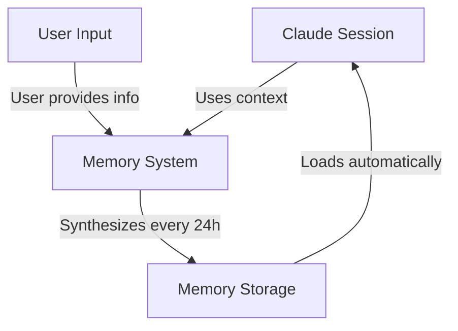
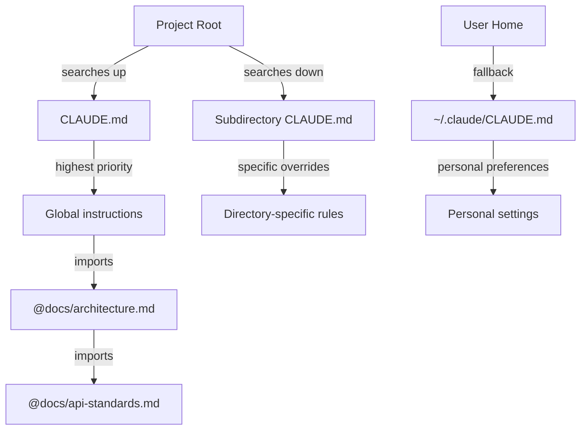
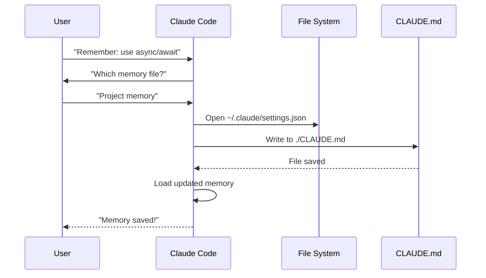
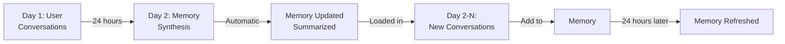

# Memory Guide

Memory enables Claude to retain context across sessions and conversations. It exists in two forms: automatic synthesis in claude.ai, and filesystem-based CLAUDE.md in Claude Code.

## Overview

Memory in Claude Code provides persistent context that carries across multiple sessions and conversations. Unlike temporary context windows, memory files allow you to:

- Share project standards across your team
- Store personal development preferences
- Maintain directory-specific rules and configurations
- Import external documentation
- Version control memory as part of your project

The memory system operates at multiple levels, from global personal preferences down to specific subdirectories, allowing for fine-grained control over what Claude remembers and how it applies that knowledge.

## Memory Architecture

Memory in Claude Code follows a hierarchical system where different scopes serve different purposes:



## Memory Hierarchy in Claude Code

Claude searches for memory files in this order, with earlier locations taking precedence:



## Memory Locations Table

| Location | Scope | Priority | Shared | Access | Best For |
|----------|-------|----------|--------|--------|----------|
| `./CLAUDE.md` | Project | High | Team | Git | Team standards, shared architecture |
| `./.claude/CLAUDE.md` | Project | High | Team | Git | Alternative project location |
| `./subdir/CLAUDE.md` | Directory | Medium | Team | Git | Directory-specific rules |
| `~/.claude/CLAUDE.md` | Personal | Low | Individual | Filesystem | Personal preferences |
| `~/.claude/my-project.md` | Personal | Low | Individual | Import | Project-specific personal notes |

## Memory Update Lifecycle

Here's how memory updates flow through your Claude Code sessions:



## Practical Examples

### Example 1: Project Memory Structure

**File:** `./CLAUDE.md`

```markdown
# Project Configuration

## Project Overview
- **Name**: E-commerce Platform
- **Tech Stack**: Node.js, PostgreSQL, React 18, Docker
- **Team Size**: 5 developers
- **Deadline**: Q4 2025

## Architecture
@docs/architecture.md
@docs/api-standards.md
@docs/database-schema.md

## Development Standards

### Code Style
- Use Prettier for formatting
- Use ESLint with airbnb config
- Maximum line length: 100 characters
- Use 2-space indentation

### Naming Conventions
- **Files**: kebab-case (user-controller.js)
- **Classes**: PascalCase (UserService)
- **Functions/Variables**: camelCase (getUserById)
- **Constants**: UPPER_SNAKE_CASE (API_BASE_URL)
- **Database Tables**: snake_case (user_accounts)

### Git Workflow
- Branch names: `feature/description` or `fix/description`
- Commit messages: Follow conventional commits
- PR required before merge
- All CI/CD checks must pass
- Minimum 1 approval required

### Testing Requirements
- Minimum 80% code coverage
- All critical paths must have tests
- Use Jest for unit tests
- Use Cypress for E2E tests
- Test filenames: `*.test.ts` or `*.spec.ts`

### API Standards
- RESTful endpoints only
- JSON request/response
- Use HTTP status codes correctly
- Version API endpoints: `/api/v1/`
- Document all endpoints with examples

### Database
- Use migrations for schema changes
- Never hardcode credentials
- Use connection pooling
- Enable query logging in development
- Regular backups required

### Deployment
- Docker-based deployment
- Kubernetes orchestration
- Blue-green deployment strategy
- Automatic rollback on failure
- Database migrations run before deploy

## Common Commands

| Command | Purpose |
|---------|---------|
| `npm run dev` | Start development server |
| `npm test` | Run test suite |
| `npm run lint` | Check code style |
| `npm run build` | Build for production |
| `npm run migrate` | Run database migrations |

## Team Contacts
- Tech Lead: Sarah Chen (@sarah.chen)
- Product Manager: Mike Johnson (@mike.j)
- DevOps: Alex Kim (@alex.k)

## Known Issues & Workarounds
- PostgreSQL connection pooling limited to 20 during peak hours
- Workaround: Implement query queuing
- Safari 14 compatibility issues with async generators
- Workaround: Use Babel transpiler

## Related Projects
- Analytics Dashboard: `/projects/analytics`
- Mobile App: `/projects/mobile`
- Admin Panel: `/projects/admin`
```

### Example 2: Directory-Specific Memory

**File:** `./src/api/CLAUDE.md`

```markdown
# API Module Standards

This file overrides root CLAUDE.md for everything in /src/api/

## API-Specific Standards

### Request Validation
- Use Zod for schema validation
- Always validate input
- Return 400 with validation errors
- Include field-level error details

### Authentication
- All endpoints require JWT token
- Token in Authorization header
- Token expires after 24 hours
- Implement refresh token mechanism

### Response Format

All responses must follow this structure:

```json
{
  "success": true,
  "data": { /* actual data */ },
  "timestamp": "2025-11-06T10:30:00Z",
  "version": "1.0"
}
```

Error responses:
```json
{
  "success": false,
  "error": {
    "code": "VALIDATION_ERROR",
    "message": "User message",
    "details": { /* field errors */ }
  },
  "timestamp": "2025-11-06T10:30:00Z"
}
```

### Pagination
- Use cursor-based pagination (not offset)
- Include `hasMore` boolean
- Limit max page size to 100
- Default page size: 20

### Rate Limiting
- 1000 requests per hour for authenticated users
- 100 requests per hour for public endpoints
- Return 429 when exceeded
- Include retry-after header

### Caching
- Use Redis for session caching
- Cache duration: 5 minutes default
- Invalidate on write operations
- Tag cache keys with resource type
```

### Example 3: Personal Memory

**File:** `~/.claude/CLAUDE.md`

```markdown
# My Development Preferences

## About Me
- **Experience Level**: 8 years full-stack development
- **Preferred Languages**: TypeScript, Python
- **Communication Style**: Direct, with examples
- **Learning Style**: Visual diagrams with code

## Code Preferences

### Error Handling
I prefer explicit error handling with try-catch blocks and meaningful error messages.
Avoid generic errors. Always log errors for debugging.

### Comments
Use comments for WHY, not WHAT. Code should be self-documenting.
Comments should explain business logic or non-obvious decisions.

### Testing
I prefer TDD (test-driven development).
Write tests first, then implementation.
Focus on behavior, not implementation details.

### Architecture
I prefer modular, loosely-coupled design.
Use dependency injection for testability.
Separate concerns (Controllers, Services, Repositories).

## Debugging Preferences
- Use console.log with prefix: `[DEBUG]`
- Include context: function name, relevant variables
- Use stack traces when available
- Always include timestamps in logs

## Communication
- Explain complex concepts with diagrams
- Show concrete examples before explaining theory
- Include before/after code snippets
- Summarize key points at the end

## Project Organization
I organize my projects as:

   project/
   ├── src/
   │   ├── api/
   │   ├── services/
   │   ├── models/
   │   └── utils/
   ├── tests/
   ├── docs/
   └── docker/

## Tooling
- **IDE**: VS Code with vim keybindings
- **Terminal**: Zsh with Oh-My-Zsh
- **Format**: Prettier (100 char line length)
- **Linter**: ESLint with airbnb config
- **Test Framework**: Jest with React Testing Library
```

_My Test_
Ask Claude to save a new rule


Claude has not save the rule because I did not have any `Claude.md` file anywhere. Then asked Claude to confirm the location.


### Example 4: Memory Update During Session

**Session Interaction:**

```markdown
User: Remember that I prefer using React hooks instead of class components
     for all new components.

Claude: I'm adding that to your memory. Which memory file should this go in?
        1. Project memory (./CLAUDE.md)
        2. Personal memory (~/.claude/CLAUDE.md)

User: Project memory

Claude: ✅ Memory saved!

Added to ./CLAUDE.md:
---

### Component Development
- Use functional components with React Hooks
- Prefer hooks over class components
- Custom hooks for reusable logic
- Use useCallback for event handlers
- Use useMemo for expensive computations
```

## Memory Features Comparison

| Feature | Claude Web/Desktop | Claude Code (CLAUDE.md) |
|---------|-------------------|------------------------|
| Auto-synthesis | ✅ Every 24h | ❌ Manual |
| Cross-project | ✅ Shared | ❌ Project-specific |
| Team access | ✅ Shared projects | ✅ Git-tracked |
| Searchable | ✅ Built-in | ✅ Through `/memory` |
| Editable | ✅ In-chat | ✅ Direct file edit |
| Import/Export | ✅ Yes | ✅ Copy/paste |
| Persistent | ✅ 24h+ | ✅ Indefinite |

### Memory in Claude Web/Desktop

#### Memory Synthesis Timeline



**Example Memory Summary:**

```markdown
## Claude's Memory of User

### Professional Background
- Senior full-stack developer with 8 years experience
- Focus on TypeScript/Node.js backends and React frontends
- Active open source contributor
- Interested in AI and machine learning

### Project Context
- Currently building e-commerce platform
- Tech stack: Node.js, PostgreSQL, React 18, Docker
- Working with team of 5 developers
- Using CI/CD and blue-green deployments

### Communication Preferences
- Prefers direct, concise explanations
- Likes visual diagrams and examples
- Appreciates code snippets
- Explains business logic in comments

### Current Goals
- Improve API performance
- Increase test coverage to 90%
- Implement caching strategy
- Document architecture
```

## Best Practices

### Do's - What To Include

- **Keep organized**: Structure memory files with clear sections
- **Keep up-to-date**: Review and update memory regularly as standards change
- **Use project memory for**: Team standards, architecture, coding conventions
- **Use personal memory for**: Preferences, communication style, tooling choices
- **Use directory memory for**: Module-specific rules and overrides
- **Version control**: Commit CLAUDE.md files to git for team benefit
- **Import docs**: Reference external files with @docs/file.md syntax
- **Be specific**: Provide concrete examples and clear expectations

### Don'ts - What To Avoid

- **Don't store secrets**: Never include API keys, passwords, or credentials
- **Don't duplicate**: Avoid repeating content across memory files
- **Don't create too many**: Keep subdirectory overrides minimal and focused
- **Don't make it too long**: Keep memory files under 500 lines
- **Don't include sensitive data**: No PII, private information, or proprietary secrets
- **Don't forget to update**: Memory becomes stale if not maintained
- **Don't over-organize**: Use hierarchy strategically, not excessively

## Installation Instructions

### Setup Project Memory

1. **Create a CLAUDE.md in your project root:**
   ```bash
   cd /path/to/your/project
   touch CLAUDE.md
   ```

2. **Add project standards:**
   ```bash
   cat > CLAUDE.md << 'EOF'
   # Project Configuration

   ## Project Overview
   - **Name**: Your Project Name
   - **Tech Stack**: List your technologies
   - **Team Size**: Number of developers

   ## Development Standards
   - Your coding standards
   - Naming conventions
   - Testing requirements
   EOF
   ```

3. **Commit to git:**
   ```bash
   git add CLAUDE.md
   git commit -m "Add project memory configuration"
   ```

### Setup Personal Memory

1. **Create ~/.claude directory:**
   ```bash
   mkdir -p ~/.claude
   ```

2. **Create personal CLAUDE.md:**
   ```bash
   touch ~/.claude/CLAUDE.md
   ```

3. **Add your preferences:**
   ```bash
   cat > ~/.claude/CLAUDE.md << 'EOF'
   # My Development Preferences

   ## About Me
   - Experience Level: [Your level]
   - Preferred Languages: [Your languages]
   - Communication Style: [Your style]

   ## Code Preferences
   - [Your preferences]
   EOF
   ```

### Setup Directory-Specific Memory

1. **Create memory for specific directories:**
   ```bash
   mkdir -p /path/to/directory/.claude
   touch /path/to/directory/CLAUDE.md
   ```

2. **Add directory-specific rules:**
   ```bash
   cat > /path/to/directory/CLAUDE.md << 'EOF'
   # [Directory Name] Standards

   This file overrides root CLAUDE.md for this directory.

   ## [Specific Standards]
   EOF
   ```

3. **Commit to version control:**
   ```bash
   git add /path/to/directory/CLAUDE.md
   git commit -m "Add [directory] memory configuration"
   ```

### Verify Setup

1. **Check memory locations:**
   ```bash
   # Project root memory
   ls -la ./CLAUDE.md

   # Personal memory
   ls -la ~/.claude/CLAUDE.md
   ```

2. **Claude Code will automatically load** these files when starting a session

3. **Test with Claude Code** by starting a new session in your project

## Related Concepts Links

### Core Memory Concepts
- [CLAUDE.md File Format Guide](./examples/)
- [Memory Examples](./examples/)
- [Memory Hierarchy](./examples/)

### Integration Points
- [MCP Protocol](../05-mcp/) - Live data access alongside memory
- [Slash Commands](../01-slash-commands/) - Session-specific shortcuts
- [Skills](../03-skills/) - Automated workflows with memory context

### Best Practices
- [Code Organization](./examples/)
- [Team Collaboration](./examples/)
- [Documentation Strategy](./examples/)

### Related Claude Features
- [Claude Web Memory](https://claude.ai) - Automatic synthesis
- [File Imports](./examples/) - Reference external documentation
- [File Context](../01-context-window/) - Current session context
