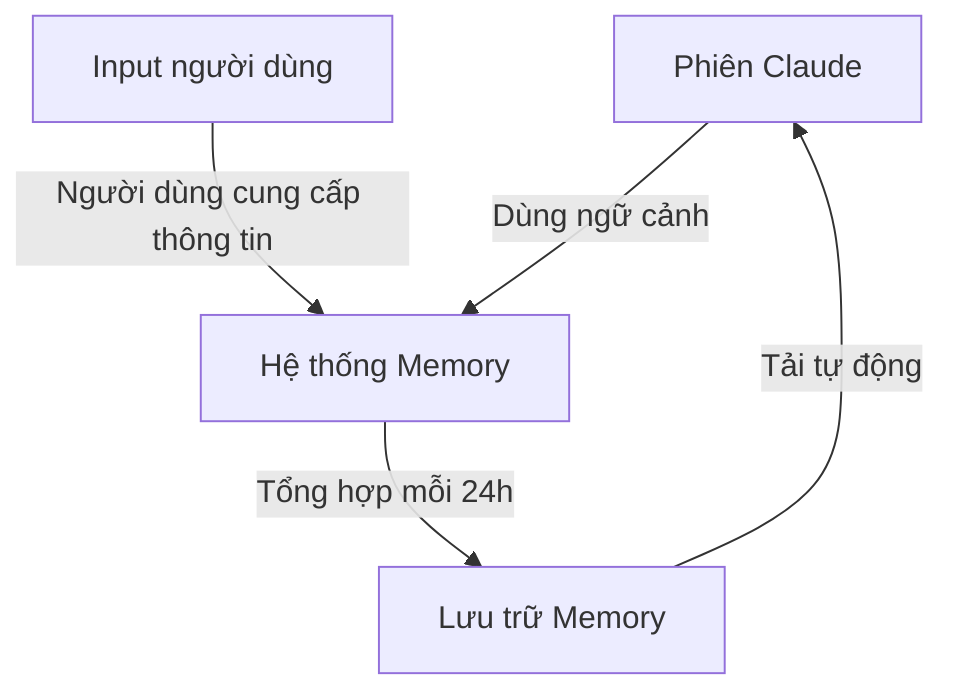
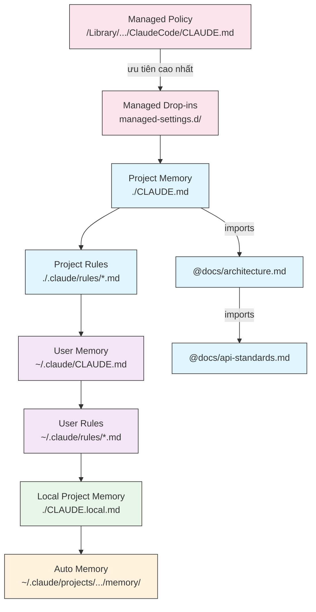
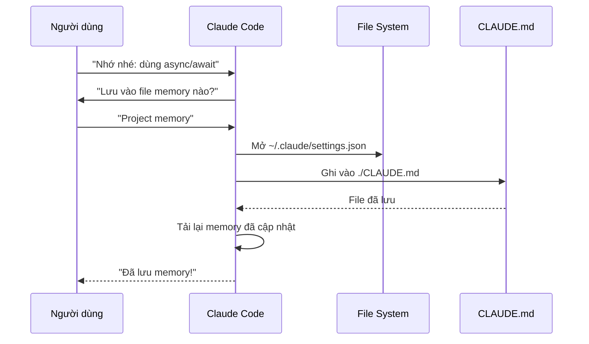
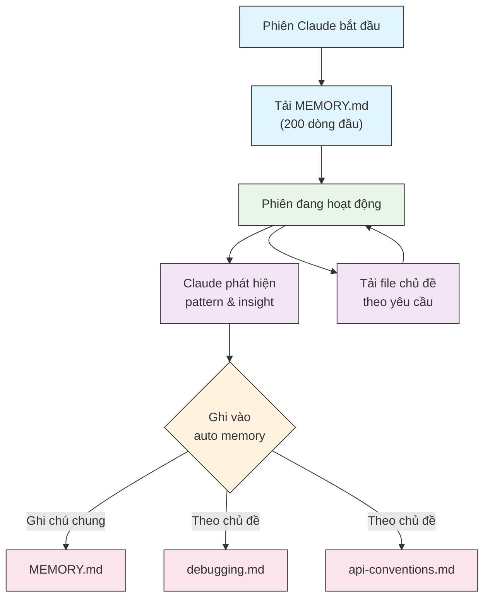

<picture>
  <source media="(prefers-color-scheme: dark)" srcset="../resources/logos/claude-howto-logo-dark.svg">
  
</picture>

# Hướng dẫn Memory

Memory cho phép Claude lưu giữ ngữ cảnh giữa các phiên và cuộc hội thoại. Nó tồn tại dưới hai hình thức: tự động tổng hợp trong claude.ai, và dựa trên file CLAUDE.md trong Claude Code.

---

## Tổng quan

Memory trong Claude Code cung cấp ngữ cảnh lâu dài được duy trì qua nhiều phiên và cuộc hội thoại. Khác với context window tạm thời, các file memory cho phép bạn:

- Chia sẻ chuẩn dự án trong toàn team
- Lưu trữ tùy chỉnh phát triển cá nhân
- Duy trì quy tắc và cấu hình riêng cho từng thư mục
- Import tài liệu bên ngoài vào ngữ cảnh
- Quản lý phiên bản memory như một phần của dự án

Hệ thống memory hoạt động theo nhiều cấp — từ tùy chỉnh cá nhân toàn cục xuống đến các thư mục con cụ thể — cho phép kiểm soát chi tiết những gì Claude nhớ và cách áp dụng kiến thức đó.

---

## Tham khảo nhanh lệnh Memory

| Lệnh | Mục đích | Cách dùng | Khi nào dùng |
|------|---------|-----------|-------------|
| `/init` | Khởi tạo project memory | `/init` | Bắt đầu dự án mới, lần đầu tạo CLAUDE.md |
| `/memory` | Chỉnh sửa file memory trong editor | `/memory` | Cập nhật lớn, tái tổ chức, xem nội dung |
| Tiền tố `#` | Thêm nhanh một dòng vào memory | `# Quy tắc của bạn ở đây` | Thêm quy tắc nhanh trong lúc chat |
| `# new rule into memory` | Thêm memory tường minh | `# new rule into memory`<br/>Quy tắc chi tiết | Thêm quy tắc nhiều dòng phức tạp |
| `# remember this` | Memory bằng ngôn ngữ tự nhiên | `# remember this`<br/>Hướng dẫn | Cập nhật memory kiểu hội thoại |
| `@path/to/file` | Import nội dung bên ngoài | `@README.md` hoặc `@docs/api.md` | Tham chiếu tài liệu đã có vào CLAUDE.md |

---

## Bắt đầu nhanh: Khởi tạo Memory

### Lệnh `/init`

Lệnh `/init` là cách nhanh nhất để thiết lập project memory trong Claude Code. Nó tạo file CLAUDE.md với tài liệu nền tảng của dự án.

**Cách dùng:**

```bash
/init
```

**Nó làm gì:**

- Tạo file CLAUDE.md mới trong dự án (thường tại `./CLAUDE.md` hoặc `./.claude/CLAUDE.md`)
- Thiết lập quy ước và hướng dẫn dự án
- Tạo nền tảng cho việc duy trì ngữ cảnh xuyên phiên
- Cung cấp cấu trúc template để ghi lại chuẩn dự án

**Chế độ tương tác nâng cao:** Đặt `CLAUDE_CODE_NEW_INIT=true` để bật luồng tương tác nhiều giai đoạn, hướng dẫn bạn từng bước thiết lập dự án:

```bash
CLAUDE_CODE_NEW_INIT=true claude
/init
```

**Khi nào dùng `/init`:**

- Bắt đầu dự án mới với Claude Code
- Thiết lập chuẩn code và quy ước cho team
- Tạo tài liệu về cấu trúc codebase
- Thiết lập phân cấp memory cho phát triển cộng tác

---

### Cập nhật memory nhanh với `#`

Bạn có thể thêm thông tin vào memory trong bất kỳ cuộc hội thoại nào bằng cách bắt đầu tin nhắn với `#`:

**Cú pháp:**

```markdown
# Quy tắc hoặc hướng dẫn memory của bạn
```

**Ví dụ:**

```markdown
# Luôn dùng TypeScript strict mode trong dự án này

# Ưu tiên async/await thay vì promise chains

# Chạy npm test trước mỗi commit

# Dùng kebab-case cho tên file
```

**Cách hoạt động:**

1. Bắt đầu tin nhắn với `#` kèm quy tắc của bạn
2. Claude nhận ra đây là yêu cầu cập nhật memory
3. Claude hỏi bạn muốn cập nhật file memory nào (project hay personal)
4. Quy tắc được thêm vào file CLAUDE.md phù hợp
5. Các phiên sau tự động tải ngữ cảnh này

**Các cách viết thay thế:**

```markdown
# new rule into memory
Luôn validate user input với Zod schemas

# remember this
Dùng semantic versioning cho tất cả releases

# add to memory
Database migrations phải có thể hoàn tác
```

---

### Lệnh `/memory`

Lệnh `/memory` cho phép truy cập trực tiếp để chỉnh sửa các file CLAUDE.md trong phiên Claude Code. Nó mở file memory trong editor hệ thống để chỉnh sửa toàn diện.

**Cách dùng:**

```bash
/memory
```

**Nó làm gì:**

- Mở file memory trong editor mặc định của hệ thống
- Cho phép thêm, sửa đổi và tái tổ chức nội dung lớn
- Truy cập trực tiếp tất cả file memory trong phân cấp
- Quản lý ngữ cảnh lâu dài xuyên phiên

**Khi nào dùng `/memory`:**

- Xem nội dung memory hiện tại
- Cập nhật lớn cho chuẩn dự án
- Tái tổ chức cấu trúc memory
- Thêm tài liệu hoặc hướng dẫn chi tiết
- Duy trì và cập nhật memory khi dự án phát triển

**So sánh: `/memory` vs `/init`**

| Khía cạnh | `/memory` | `/init` |
|-----------|-----------|---------|
| **Mục đích** | Chỉnh sửa file memory đã có | Khởi tạo CLAUDE.md mới |
| **Khi nào dùng** | Cập nhật/chỉnh sửa ngữ cảnh | Bắt đầu dự án mới |
| **Hành động** | Mở editor để thay đổi | Tạo template ban đầu |
| **Workflow** | Bảo trì liên tục | Thiết lập một lần |

**Ví dụ workflow:**

```markdown
# Mở memory để chỉnh sửa
/memory

# Claude hiển thị các lựa chọn:
# 1. Managed Policy Memory
# 2. Project Memory (./CLAUDE.md)
# 3. User Memory (~/.claude/CLAUDE.md)
# 4. Local Project Memory

# Chọn tùy chọn 2 (Project Memory)
# Editor mặc định mở với nội dung ./CLAUDE.md

# Thực hiện thay đổi, lưu và đóng editor
# Claude tự động tải lại memory đã cập nhật
```

**Dùng Memory Imports:**

File CLAUDE.md hỗ trợ cú pháp `@path/to/file` để đưa nội dung bên ngoài vào:

```markdown
# Tài liệu dự án
Xem @README.md để có tổng quan dự án
Xem @package.json để biết các lệnh npm có sẵn
Xem @docs/architecture.md để hiểu thiết kế hệ thống

# Import từ thư mục home bằng đường dẫn tuyệt đối
@~/.claude/my-project-instructions.md
```

**Tính năng import:**

- Hỗ trợ cả đường dẫn tương đối và tuyệt đối
- Import đệ quy được hỗ trợ với độ sâu tối đa 5 cấp
- Import lần đầu từ vị trí bên ngoài sẽ hiện hộp thoại phê duyệt để bảo mật
- Cú pháp `@` không được đánh giá bên trong code block (an toàn khi dùng làm ví dụ)
- Giúp tránh trùng lặp bằng cách tham chiếu tài liệu đã có
- Tự động đưa nội dung được tham chiếu vào ngữ cảnh của Claude

---

## Kiến trúc Memory

Memory trong Claude Code theo hệ thống phân cấp, mỗi cấp phục vụ mục đích khác nhau:



---

## Phân cấp Memory trong Claude Code

Claude Code dùng hệ thống memory phân cấp nhiều tầng. Các file memory được tải tự động khi Claude Code khởi động, file cấp cao hơn được ưu tiên hơn.

**Phân cấp Memory đầy đủ (theo thứ tự ưu tiên):**

1. **Managed Policy** — Hướng dẫn toàn tổ chức
   - macOS: `/Library/Application Support/ClaudeCode/CLAUDE.md`
   - Linux/WSL: `/etc/claude-code/CLAUDE.md`
   - Windows: `C:\Program Files\ClaudeCode\CLAUDE.md`

2. **Managed Drop-ins** — File policy ghép theo alphabet (v2.1.83+)
   - Thư mục `managed-settings.d/` bên cạnh file CLAUDE.md chính sách
   - Các file được ghép theo thứ tự alphabet để quản lý policy dạng module

3. **Project Memory** — Ngữ cảnh chia sẻ cho team (có version control)
   - `./.claude/CLAUDE.md` hoặc `./CLAUDE.md` (trong thư mục gốc repository)

4. **Project Rules** — Quy tắc dự án theo chủ đề, dạng module
   - `./.claude/rules/*.md`

5. **User Memory** — Tùy chỉnh cá nhân (tất cả dự án)
   - `~/.claude/CLAUDE.md`

6. **User-Level Rules** — Quy tắc cá nhân (tất cả dự án)
   - `~/.claude/rules/*.md`

7. **Local Project Memory** — Tùy chỉnh cá nhân riêng cho dự án
   - `./CLAUDE.local.md`

> **Ghi chú**: `CLAUDE.local.md` không được đề cập trong [tài liệu chính thức](https://code.claude.com/docs/en/memory) tính đến tháng 3/2026. Nó vẫn có thể hoạt động như tính năng cũ. Với dự án mới, nên dùng `~/.claude/CLAUDE.md` (cấp người dùng) hoặc `.claude/rules/` (cấp dự án, phân vùng theo đường dẫn) thay thế.

8. **Auto Memory** — Ghi chú và học hỏi tự động của Claude
   - `~/.claude/projects/<project>/memory/`

**Cách Claude tìm kiếm file Memory:**

Claude tìm file memory theo thứ tự này, vị trí đầu tiên có ưu tiên cao hơn:



---

## Loại trừ CLAUDE.md với `claudeMdExcludes`

Trong các monorepo lớn, một số file CLAUDE.md có thể không liên quan đến công việc hiện tại. Cài đặt `claudeMdExcludes` cho phép bỏ qua các file CLAUDE.md cụ thể để chúng không được tải vào ngữ cảnh:

```jsonc
// Trong ~/.claude/settings.json hoặc .claude/settings.json
{
  "claudeMdExcludes": [
    "packages/legacy-app/CLAUDE.md",
    "vendors/**/CLAUDE.md"
  ]
}
```

Pattern được so khớp với đường dẫn tương đối từ thư mục gốc dự án. Đặc biệt hữu ích cho:

- Monorepo với nhiều sub-project, chỉ một số liên quan đến công việc hiện tại
- Repository chứa file CLAUDE.md của thư viện hoặc bên thứ ba
- Giảm nhiễu trong context window của Claude bằng cách loại trừ hướng dẫn cũ hoặc không liên quan

---

## Phân cấp File Settings

Các cài đặt Claude Code (bao gồm `autoMemoryDirectory`, `claudeMdExcludes` và các cấu hình khác) được giải quyết từ phân cấp năm cấp, cấp cao hơn được ưu tiên hơn:

| Cấp | Vị trí | Phạm vi |
|-----|--------|---------|
| 1 (Cao nhất) | Managed policy (cấp hệ thống) | Áp dụng bắt buộc toàn tổ chức |
| 2 | `managed-settings.d/` (v2.1.83+) | Drop-in policy dạng module, ghép theo alphabet |
| 3 | `~/.claude/settings.json` | Tùy chỉnh người dùng |
| 4 | `.claude/settings.json` | Cấp dự án (commit vào git) |
| 5 (Thấp nhất) | `.claude/settings.local.json` | Ghi đè cục bộ (git-ignored) |

**Cấu hình theo nền tảng (v2.1.51+):**

Cài đặt cũng có thể được cấu hình qua:
- **macOS**: File Property list (plist)
- **Windows**: Windows Registry

Các cơ chế native này được đọc cùng với file JSON settings và tuân theo cùng quy tắc ưu tiên.

---

## Hệ thống Rules dạng Module

Tạo rules có tổ chức, theo đường dẫn cụ thể bằng cấu trúc thư mục `.claude/rules/`. Rules có thể được định nghĩa ở cả cấp dự án và cấp người dùng:

```
your-project/
├── .claude/
│   ├── CLAUDE.md
│   └── rules/
│       ├── code-style.md
│       ├── testing.md
│       ├── security.md
│       └── api/                  # Hỗ trợ thư mục con
│           ├── conventions.md
│           └── validation.md

~/.claude/
├── CLAUDE.md
└── rules/                        # Rules cấp người dùng (tất cả dự án)
    ├── personal-style.md
    └── preferred-patterns.md
```

Rules được tìm kiếm đệ quy trong thư mục `rules/`, bao gồm cả thư mục con. Rules cấp người dùng tại `~/.claude/rules/` được tải trước rules cấp dự án, cho phép đặt mặc định cá nhân mà dự án có thể ghi đè.

### Rules theo đường dẫn với YAML Frontmatter

Định nghĩa rules chỉ áp dụng cho các đường dẫn file cụ thể:

```markdown
---
paths: src/api/**/*.ts
---

# Quy tắc phát triển API

- Tất cả API endpoint phải có validation input
- Dùng Zod để validate schema
- Ghi lại tất cả parameters và kiểu response
- Bao gồm xử lý lỗi cho tất cả thao tác
```

**Ví dụ Glob Pattern:**

- `**/*.ts` — Tất cả file TypeScript
- `src/**/*` — Tất cả file trong src/
- `src/**/*.{ts,tsx}` — Nhiều extension
- `{src,lib}/**/*.ts, tests/**/*.test.ts` — Nhiều pattern

### Thư mục con và Symlinks

Rules trong `.claude/rules/` hỗ trợ hai tính năng tổ chức:

- **Thư mục con**: Rules được tìm kiếm đệ quy, bạn có thể tổ chức theo chủ đề (ví dụ: `rules/api/`, `rules/testing/`, `rules/security/`)
- **Symlinks**: Hỗ trợ symlink để chia sẻ rules giữa nhiều dự án. Ví dụ: bạn có thể symlink một file rule từ vị trí trung tâm vào thư mục `.claude/rules/` của từng dự án

---

## Bảng vị trí Memory

| Vị trí | Phạm vi | Ưu tiên | Chia sẻ | Truy cập | Phù hợp nhất |
|--------|---------|---------|---------|---------|-------------|
| `/Library/Application Support/ClaudeCode/CLAUDE.md` (macOS) | Managed Policy | 1 (Cao nhất) | Tổ chức | Hệ thống | Chính sách toàn công ty |
| `/etc/claude-code/CLAUDE.md` (Linux/WSL) | Managed Policy | 1 (Cao nhất) | Tổ chức | Hệ thống | Chuẩn tổ chức |
| `C:\Program Files\ClaudeCode\CLAUDE.md` (Windows) | Managed Policy | 1 (Cao nhất) | Tổ chức | Hệ thống | Hướng dẫn doanh nghiệp |
| `managed-settings.d/*.md` (cùng vị trí với policy) | Managed Drop-ins | 1.5 | Tổ chức | Hệ thống | File policy dạng module (v2.1.83+) |
| `./CLAUDE.md` hoặc `./.claude/CLAUDE.md` | Project Memory | 2 | Team | Git | Chuẩn team, kiến trúc chung |
| `./.claude/rules/*.md` | Project Rules | 3 | Team | Git | Rules theo đường dẫn, dạng module |
| `~/.claude/CLAUDE.md` | User Memory | 4 | Cá nhân | Filesystem | Tùy chỉnh cá nhân (tất cả dự án) |
| `~/.claude/rules/*.md` | User Rules | 5 | Cá nhân | Filesystem | Rules cá nhân (tất cả dự án) |
| `./CLAUDE.local.md` | Project Local | 6 | Cá nhân | Git (ignored) | Tùy chỉnh cá nhân riêng cho dự án |
| `~/.claude/projects/<project>/memory/` | Auto Memory | 7 (Thấp nhất) | Cá nhân | Filesystem | Ghi chú và học hỏi tự động của Claude |

---

## Vòng đời cập nhật Memory

Đây là cách các cập nhật memory di chuyển qua các phiên Claude Code:



---

## Auto Memory

Auto memory là thư mục lâu dài nơi Claude tự động ghi lại những gì học được, các pattern và insight trong quá trình làm việc với dự án. Khác với file CLAUDE.md do bạn viết và duy trì thủ công, auto memory được Claude tự ghi trong các phiên làm việc.

> **Hiểu đơn giản**: CLAUDE.md là "notepad" bạn viết cho Claude đọc. Auto Memory là "nhật ký" Claude tự ghi lại những gì nó học được từ dự án của bạn.

### Cách Auto Memory hoạt động

- **Vị trí**: `~/.claude/projects/<project>/memory/`
- **Điểm vào**: `MEMORY.md` là file chính trong thư mục auto memory
- **File theo chủ đề**: Các file bổ sung tùy chọn cho chủ đề cụ thể (ví dụ: `debugging.md`, `api-conventions.md`)
- **Cách tải**: 200 dòng đầu của `MEMORY.md` được tải vào system prompt khi bắt đầu phiên. File theo chủ đề được tải theo yêu cầu, không tải khi khởi động
- **Đọc/ghi**: Claude đọc và ghi file memory trong phiên khi phát hiện pattern và kiến thức riêng của dự án

### Kiến trúc Auto Memory



### Cấu trúc thư mục Auto Memory

```
~/.claude/projects/<project>/memory/
├── MEMORY.md              # Điểm vào (200 dòng đầu tải khi khởi động)
├── debugging.md           # File chủ đề (tải theo yêu cầu)
├── api-conventions.md     # File chủ đề (tải theo yêu cầu)
└── testing-patterns.md    # File chủ đề (tải theo yêu cầu)
```

### Yêu cầu phiên bản

Auto memory yêu cầu **Claude Code v2.1.59 trở lên**. Nếu đang dùng phiên bản cũ hơn, hãy nâng cấp trước:

```bash
npm install -g @anthropic-ai/claude-code@latest
```

### Thư mục Auto Memory tùy chỉnh

Mặc định, auto memory được lưu tại `~/.claude/projects/<project>/memory/`. Bạn có thể đổi vị trí này bằng cài đặt `autoMemoryDirectory` (có từ **v2.1.74**):

```jsonc
// Trong ~/.claude/settings.json hoặc .claude/settings.local.json (chỉ settings người dùng/local)
{
  "autoMemoryDirectory": "/path/to/custom/memory/directory"
}
```

> **Ghi chú**: `autoMemoryDirectory` chỉ có thể đặt trong settings cấp người dùng (`~/.claude/settings.json`) hoặc local (`.claude/settings.local.json`), không đặt trong settings dự án hoặc managed policy.

Hữu ích khi bạn muốn:
- Lưu auto memory ở vị trí chia sẻ hoặc đồng bộ
- Tách auto memory khỏi thư mục cấu hình Claude mặc định
- Dùng đường dẫn riêng cho dự án ngoài phân cấp mặc định

### Chia sẻ Worktree và Repository

Tất cả worktree và thư mục con trong cùng một git repository chia sẻ một thư mục auto memory duy nhất. Điều này nghĩa là chuyển đổi giữa các worktree hoặc làm việc trong các thư mục con khác nhau của cùng một repo đều đọc và ghi vào cùng một file memory.

### Memory của Subagent

Subagent (được tạo qua tool Task hoặc thực thi song song) có thể có ngữ cảnh memory riêng. Dùng trường `memory` trong frontmatter của định nghĩa subagent để chỉ định phạm vi memory nào cần tải:

```yaml
memory: user      # Chỉ tải memory cấp người dùng
memory: project   # Chỉ tải memory cấp dự án
memory: local     # Chỉ tải memory local
```

Điều này cho phép subagent hoạt động với ngữ cảnh tập trung thay vì kế thừa toàn bộ phân cấp memory.

### Kiểm soát Auto Memory

Auto memory có thể kiểm soát qua biến môi trường `CLAUDE_CODE_DISABLE_AUTO_MEMORY`:

| Giá trị | Hành vi |
|---------|---------|
| `0` | Bật auto memory **bắt buộc** |
| `1` | Tắt auto memory **bắt buộc** |
| *(không đặt)* | Hành vi mặc định (auto memory được bật) |

```bash
# Tắt auto memory cho một phiên
CLAUDE_CODE_DISABLE_AUTO_MEMORY=1 claude

# Bật auto memory rõ ràng
CLAUDE_CODE_DISABLE_AUTO_MEMORY=0 claude
```

---

## Thêm thư mục với `--add-dir`

Flag `--add-dir` cho phép Claude Code tải file CLAUDE.md từ các thư mục bổ sung ngoài thư mục làm việc hiện tại. Hữu ích cho monorepo hoặc setup đa dự án khi ngữ cảnh từ thư mục khác cũng có liên quan.

Để bật tính năng này, đặt biến môi trường:

```bash
CLAUDE_CODE_ADDITIONAL_DIRECTORIES_CLAUDE_MD=1
```

Sau đó khởi động Claude Code với flag:

```bash
claude --add-dir /path/to/other/project
```

Claude sẽ tải CLAUDE.md từ thư mục bổ sung đó cùng với các file memory từ thư mục làm việc hiện tại.

---

## Ví dụ thực tế

### Ví dụ 1: Cấu trúc Project Memory

**File:** `./CLAUDE.md`

```markdown
# Cấu hình dự án

## Tổng quan dự án
- **Tên**: Nền tảng E-commerce
- **Tech Stack**: Node.js, PostgreSQL, React 18, Docker
- **Quy mô team**: 5 lập trình viên
- **Deadline**: Q4 2025

## Kiến trúc
@docs/architecture.md
@docs/api-standards.md
@docs/database-schema.md

## Chuẩn phát triển

### Phong cách code
- Dùng Prettier để format
- Dùng ESLint với config airbnb
- Độ dài dòng tối đa: 100 ký tự
- Thụt lề 2 khoảng trắng

### Quy ước đặt tên
- **File**: kebab-case (user-controller.js)
- **Class**: PascalCase (UserService)
- **Hàm/Biến**: camelCase (getUserById)
- **Hằng số**: UPPER_SNAKE_CASE (API_BASE_URL)
- **Bảng Database**: snake_case (user_accounts)

### Git Workflow
- Tên branch: `feature/mô-tả` hoặc `fix/mô-tả`
- Commit message: Theo conventional commits
- Bắt buộc PR trước khi merge
- Tất cả CI/CD checks phải pass
- Tối thiểu 1 approval

### Yêu cầu kiểm thử
- Tối thiểu 80% code coverage
- Tất cả luồng quan trọng phải có test
- Dùng Jest cho unit test
- Dùng Cypress cho E2E test
- Tên file test: `*.test.ts` hoặc `*.spec.ts`
```

### Ví dụ 2: Memory theo thư mục

**File:** `./src/api/CLAUDE.md`

```markdown
# Chuẩn Module API

File này ghi đè root CLAUDE.md cho mọi thứ trong /src/api/

## Chuẩn riêng cho API

### Validation Request
- Dùng Zod để validate schema
- Luôn validate input
- Trả về 400 kèm lỗi validation
- Bao gồm chi tiết lỗi theo từng field

### Xác thực
- Tất cả endpoint yêu cầu JWT token
- Token trong Authorization header
- Token hết hạn sau 24 giờ
- Triển khai cơ chế refresh token
```

### Ví dụ 3: Personal Memory

**File:** `~/.claude/CLAUDE.md`

```markdown
# Tùy chỉnh phát triển của tôi

## Về tôi
- **Trình độ**: 8 năm kinh nghiệm full-stack
- **Ngôn ngữ ưa thích**: TypeScript, Python
- **Phong cách giao tiếp**: Trực tiếp, có ví dụ
- **Cách học**: Sơ đồ trực quan kèm code

## Tùy chỉnh code

### Xử lý lỗi
Tôi ưa thích xử lý lỗi rõ ràng với try-catch và thông báo lỗi có ý nghĩa.
Tránh lỗi chung chung. Luôn log lỗi để debug.

### Bình luận
Dùng comment để giải thích TẠI SAO, không phải LÀM GÌ. Code phải tự giải thích được.

### Kiểm thử
Tôi ưa thích TDD (test-driven development).
Viết test trước, sau đó mới implement.
```

### Ví dụ 4: Cập nhật Memory trong phiên làm việc

Bạn có thể thêm quy tắc mới vào memory trong phiên Claude Code đang hoạt động:

#### Cách 1: Yêu cầu trực tiếp

```markdown
Người dùng: Nhớ rằng tôi ưa dùng React hooks thay vì class components
           cho tất cả component mới.

Claude: Tôi đang thêm vào memory. Lưu vào file memory nào?
        1. Project memory (./CLAUDE.md)
        2. Personal memory (~/.claude/CLAUDE.md)

Người dùng: Project memory

Claude: ✅ Đã lưu memory!

Đã thêm vào ./CLAUDE.md:
---

### Phát triển Component
- Dùng functional components với React Hooks
- Ưu tiên hooks hơn class components
- Custom hooks cho logic tái sử dụng
```

#### Cách 2: Dùng pattern "# new rule into memory"

```markdown
Người dùng: # new rule into memory
            Luôn validate user input với Zod schemas trước khi xử lý.

Claude: Tôi đang lưu quy tắc này. Dùng file memory nào?
        1. Project memory (./CLAUDE.md)
        2. Personal memory (~/.claude/CLAUDE.md)

Người dùng: Project memory

Claude: ✅ Đã lưu memory!
```

#### Mẹo khi thêm Memory

- Viết quy tắc cụ thể và có thể hành động được
- Nhóm các quy tắc liên quan dưới cùng một tiêu đề section
- Cập nhật section hiện có thay vì tạo nội dung trùng lặp
- Chọn phạm vi memory phù hợp (project hay personal)

---

## So sánh tính năng Memory

| Tính năng | Claude Web/Desktop | Claude Code (CLAUDE.md) |
|-----------|-------------------|------------------------|
| Tự động tổng hợp | ✅ Mỗi 24h | ❌ Thủ công |
| Xuyên dự án | ✅ Dùng chung | ❌ Riêng từng dự án |
| Truy cập team | ✅ Dự án chia sẻ | ✅ Theo dõi qua Git |
| Tìm kiếm | ✅ Tích hợp sẵn | ✅ Qua `/memory` |
| Chỉnh sửa được | ✅ Trong chat | ✅ Chỉnh sửa file trực tiếp |
| Import/Export | ✅ Có | ✅ Copy/paste |
| Lâu dài | ✅ 24h+ | ✅ Vô thời hạn |

---

## Thực hành tốt nhất

### Nên làm — Những gì nên đưa vào

- **Cụ thể và chi tiết**: Dùng hướng dẫn rõ ràng thay vì mơ hồ
  - ✅ Tốt: "Dùng thụt lề 2 khoảng trắng cho tất cả file JavaScript"
  - ❌ Tránh: "Tuân theo best practices"

- **Có tổ chức**: Cấu trúc file memory với sections và tiêu đề markdown rõ ràng

- **Dùng đúng cấp phân cấp**:
  - **Managed policy**: Chính sách toàn công ty, chuẩn bảo mật, yêu cầu tuân thủ
  - **Project memory**: Chuẩn team, kiến trúc, quy ước code (commit vào git)
  - **User memory**: Tùy chỉnh cá nhân, phong cách giao tiếp, lựa chọn công cụ
  - **Directory memory**: Quy tắc và ghi đè riêng cho module đó

- **Tận dụng imports**: Dùng cú pháp `@path/to/file` để tham chiếu tài liệu đã có
  - Hỗ trợ đến 5 cấp lồng nhau đệ quy
  - Tránh trùng lặp giữa các file memory
  - Ví dụ: `Xem @README.md để có tổng quan dự án`

- **Ghi lại lệnh hay dùng**: Bao gồm các lệnh bạn dùng thường xuyên để tiết kiệm thời gian

- **Version control project memory**: Commit file CLAUDE.md cấp dự án vào git để cả team cùng hưởng lợi

- **Xem lại định kỳ**: Cập nhật memory thường xuyên khi dự án phát triển và yêu cầu thay đổi

- **Cung cấp ví dụ cụ thể**: Bao gồm đoạn code và tình huống cụ thể

### Không nên làm — Những gì cần tránh

- **Không lưu secrets**: Không bao giờ đưa API key, mật khẩu, token hay thông tin đăng nhập vào

- **Không đưa dữ liệu nhạy cảm**: Không có PII, thông tin riêng tư hay bí mật độc quyền

- **Không trùng lặp nội dung**: Dùng import (`@path`) để tham chiếu tài liệu thay vì sao chép

- **Không mơ hồ**: Tránh phát biểu chung chung như "tuân theo best practices" hay "viết code tốt"

- **Không quá dài**: Giữ file memory riêng lẻ tập trung và dưới 500 dòng

- **Không tổ chức quá mức**: Dùng phân cấp có chiến lược; không tạo quá nhiều ghi đè thư mục con

- **Không quên cập nhật**: Memory cũ có thể gây nhầm lẫn và thực hành lỗi thời

- **Không vượt giới hạn lồng nhau**: Import memory hỗ trợ tối đa 5 cấp lồng nhau

---

## Hướng dẫn cài đặt

### Thiết lập Project Memory

#### Cách 1: Dùng lệnh `/init` (Khuyến nghị)

1. **Điều hướng đến thư mục dự án:**
   ```bash
   cd /path/to/your/project
   ```

2. **Chạy lệnh init trong Claude Code:**
   ```bash
   /init
   ```

3. **Claude tạo và điền vào CLAUDE.md** với cấu trúc template

4. **Tùy chỉnh file đã tạo** cho phù hợp với dự án của bạn

5. **Commit vào git:**
   ```bash
   git add CLAUDE.md
   git commit -m "Initialize project memory with /init"
   ```

#### Cách 2: Tạo thủ công

1. **Tạo CLAUDE.md trong thư mục gốc dự án:**
   ```bash
   cd /path/to/your/project
   touch CLAUDE.md
   ```

2. **Thêm chuẩn dự án và commit:**
   ```bash
   git add CLAUDE.md
   git commit -m "Add project memory configuration"
   ```

#### Cách 3: Cập nhật nhanh với `#`

Khi CLAUDE.md đã tồn tại, thêm quy tắc nhanh trong lúc chat:

```markdown
# Dùng semantic versioning cho tất cả releases

# Luôn chạy test trước khi commit

# Ưa thích composition hơn inheritance
```

Claude sẽ hỏi bạn muốn cập nhật file memory nào.

### Thiết lập Personal Memory

```bash
# Tạo thư mục .claude
mkdir -p ~/.claude

# Tạo personal CLAUDE.md
touch ~/.claude/CLAUDE.md

# Thêm tùy chỉnh của bạn vào file
```

### Thiết lập Memory theo thư mục

```bash
# Tạo memory cho thư mục cụ thể
mkdir -p /path/to/directory/.claude
touch /path/to/directory/CLAUDE.md

# Commit vào version control
git add /path/to/directory/CLAUDE.md
git commit -m "Add [directory] memory configuration"
```

### Xác nhận thiết lập

```bash
# Kiểm tra vị trí memory
ls -la ./CLAUDE.md           # Project memory
ls -la ~/.claude/CLAUDE.md   # Personal memory
```

Claude Code sẽ tự động tải các file này khi bắt đầu phiên mới.

---

## Tài liệu chính thức

- **[Memory Documentation](https://code.claude.com/docs/en/memory)** — Tham khảo đầy đủ hệ thống memory
- **[Slash Commands Reference](https://code.claude.com/docs/en/interactive-mode)** — Tất cả lệnh tích hợp bao gồm `/init` và `/memory`
- **[CLI Reference](https://code.claude.com/docs/en/cli-reference)** — Tài liệu command-line interface

---

## Điểm tích hợp liên quan

- [MCP Protocol](../05-mcp/) — Truy cập dữ liệu thời gian thực bên cạnh memory
- [Slash Commands](../01-slash-commands/) — Phím tắt riêng cho phiên
- [Skills](../03-skills/) — Workflow tự động với ngữ cảnh memory

---

*Thuộc chuỗi hướng dẫn [Claude How To](../)*

---

> **Ghi chú cho bản dịch tiếng Việt:** Bản gốc tiếng Anh luôn là nguồn chính xác nhất: [README.md](README.md).
