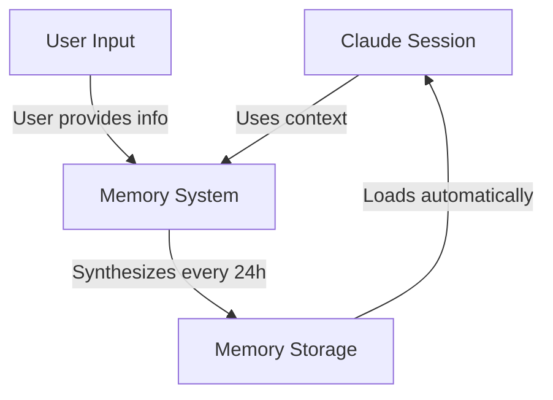
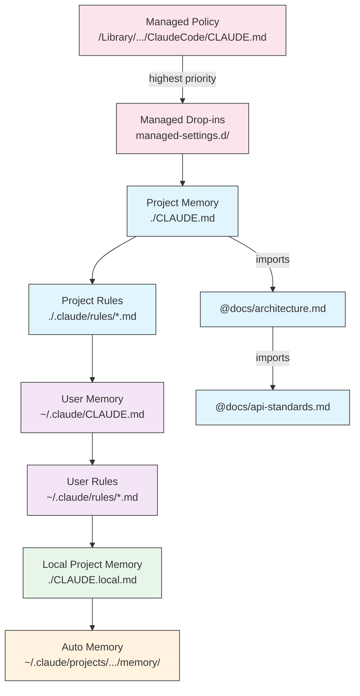
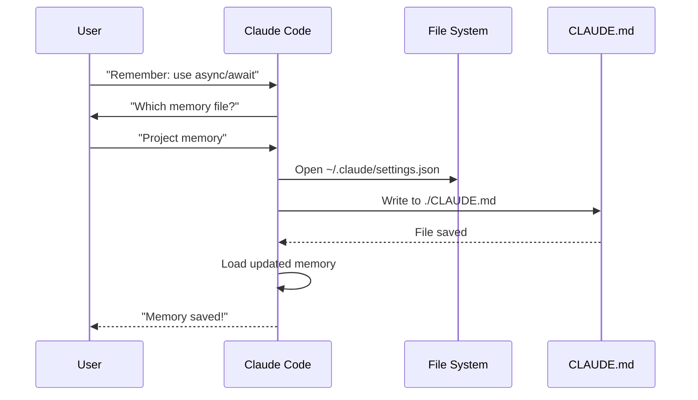
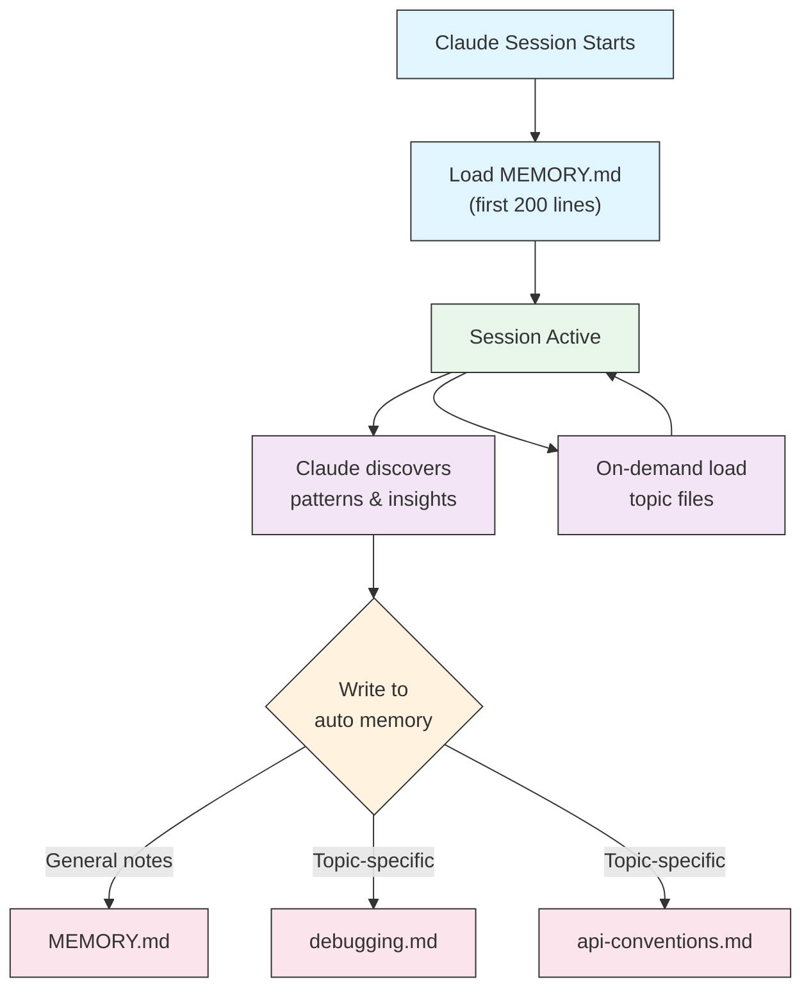

<picture>
  <source media="(prefers-color-scheme: dark)" srcset="../resources/logos/claude-howto-logo-dark.svg">
  
</picture>

# Memory Guide

Memory 让 Claude 能在多个会话与对话之间保留上下文。它主要有两种形式：`claude.ai` 的自动综合记忆，以及 Claude Code 中基于文件系统的 `CLAUDE.md` 记忆。

## Overview

Claude Code 的 Memory 提供跨会话持久上下文。与临时上下文窗口不同，memory 文件允许你：

- 在团队内共享项目标准
- 保存个人开发偏好
- 维护目录级规则与配置
- 引入外部文档
- 将 memory 纳入项目版本控制

这套 memory 系统支持多层级，从全局个人偏好到具体子目录规则，帮助你精细控制 Claude 记住什么、以及如何应用这些信息。

## Memory Commands Quick Reference

| Command | Purpose | Usage | When to Use |
|---------|---------|-------|-------------|
| `/init` | 初始化项目 memory | `/init` | 新项目起步、首次创建 CLAUDE.md |
| `/memory` | 在编辑器中编辑 memory 文件 | `/memory` | 大幅更新、内容重组、集中审阅 |
| `#` 前缀 | 快速新增单行 memory | `# Your rule here` | 在对话中快速补规则 |
| `# new rule into memory` | 显式新增 memory | `# new rule into memory<br/>Your detailed rule` | 增加复杂多行规则 |
| `# remember this` | 自然语言方式写 memory | `# remember this<br/>Your instruction` | 以对话方式更新记忆 |
| `@path/to/file` | 引入外部内容 | `@README.md` 或 `@docs/api.md` | 在 CLAUDE.md 引用现有文档 |

## Quick Start: Initializing Memory

### The `/init` Command

`/init` 是在 Claude Code 中建立项目 memory 的最快方式。它会初始化一个包含基础项目说明的 `CLAUDE.md`。

**Usage:**

```bash
/init
```

**What it does:**

- 在项目中创建新的 `CLAUDE.md`（通常位于 `./CLAUDE.md` 或 `./.claude/CLAUDE.md`）
- 建立项目约定与指导原则
- 搭建跨会话上下文持久化基础
- 提供记录项目标准的模板结构

**Enhanced interactive mode:** 设置 `CLAUDE_CODE_NEW_INIT=true` 可启用多阶段交互式流程，逐步引导你完成初始化：

```bash
CLAUDE_CODE_NEW_INIT=true claude
/init
```

**When to use `/init`:**

- 新项目开始使用 Claude Code
- 建立团队编码规范与协作约定
- 为代码库结构补充基础文档
- 为协作开发建立 memory 层次

**Example workflow:**

```markdown
# In your project directory
/init

# Claude creates CLAUDE.md with structure like:
# Project Configuration
## Project Overview
- Name: Your Project
- Tech Stack: [Your technologies]
- Team Size: [Number of developers]

## Development Standards
- Code style preferences
- Testing requirements
- Git workflow conventions
```

### Quick Memory Updates with `#`

你可以在任意对话中通过 `#` 开头快速写入 memory：

**Syntax:**

```markdown
# Your memory rule or instruction here
```

**Examples:**

```markdown
# Always use TypeScript strict mode in this project

# Prefer async/await over promise chains

# Run npm test before every commit

# Use kebab-case for file names
```

**How it works:**

1. 以 `#` 开头输入规则
2. Claude 识别为 memory 更新请求
3. Claude 询问写入哪个 memory 文件（项目或个人）
4. 规则被写入对应 `CLAUDE.md`
5. 后续会话自动加载

**Alternative patterns:**

```markdown
# new rule into memory
Always validate user input with Zod schemas

# remember this
Use semantic versioning for all releases

# add to memory
Database migrations must be reversible
```

### The `/memory` Command

`/memory` 用于直接编辑 `CLAUDE.md` memory 文件。它会在会话中调用系统编辑器，便于你做更完整的维护。

**Usage:**

```bash
/memory
```

**What it does:**

- 在系统默认编辑器中打开 memory 文件
- 支持批量新增、修改、重组
- 提供对层级中所有 memory 文件的直接访问
- 便于持续维护跨会话上下文

**When to use `/memory`:**

- 审阅已有 memory 内容
- 大幅更新项目标准
- 重组 memory 结构
- 补充详细规范与指南
- 随项目演进持续维护

**Comparison: `/memory` vs `/init`**

| Aspect | `/memory` | `/init` |
|--------|-----------|---------|
| **Purpose** | 编辑已有 memory 文件 | 初始化新 CLAUDE.md |
| **When to use** | 更新/维护项目上下文 | 新项目起步 |
| **Action** | 打开编辑器进行编辑 | 生成初始模板 |
| **Workflow** | 持续维护 | 一次性初始化 |

**Example workflow:**

```markdown
# Open memory for editing
/memory

# Claude presents options:
# 1. Managed Policy Memory
# 2. Project Memory (./CLAUDE.md)
# 3. User Memory (~/.claude/CLAUDE.md)
# 4. Local Project Memory

# Choose option 2 (Project Memory)
# Your default editor opens with ./CLAUDE.md content

# Make changes, save, and close editor
# Claude automatically reloads the updated memory
```

**Using Memory Imports:**

`CLAUDE.md` 支持 `@path/to/file` 语法引入外部内容：

```markdown
# Project Documentation
See @README.md for project overview
See @package.json for available npm commands
See @docs/architecture.md for system design

# Import from home directory using absolute path
@~/.claude/my-project-instructions.md
```

**Import features:**

- 支持相对路径与绝对路径（如 `@docs/api.md` 或 `@~/.claude/my-project-instructions.md`）
- 支持递归导入，最大深度 5
- 首次导入外部位置时会触发安全确认
- 在 markdown 行内代码或代码块中不会执行 import 指令（可安全用于示例说明）
- 通过引用减少重复文档
- 被引用内容会自动加入 Claude 上下文

## Memory Architecture

Claude Code 的 memory 按层级组织，不同作用域承担不同职责：



## Memory Hierarchy in Claude Code

Claude Code 使用多层级 memory 体系。Claude 启动时会自动加载 memory 文件，且高层级优先。

**Complete Memory Hierarchy (in order of precedence):**

1. **Managed Policy** - 组织级统一指令
   - macOS: `/Library/Application Support/ClaudeCode/CLAUDE.md`
   - Linux/WSL: `/etc/claude-code/CLAUDE.md`
   - Windows: `C:\Program Files\ClaudeCode\CLAUDE.md`

2. **Managed Drop-ins** - 按字母顺序合并的策略文件（v2.1.83+）
   - 与 managed policy 同级目录下的 `managed-settings.d/`
   - 文件按字母顺序合并，便于策略模块化管理

3. **Project Memory** - 团队共享上下文（建议纳入版本控制）
   - `./.claude/CLAUDE.md` 或 `./CLAUDE.md`（仓库根目录）

4. **Project Rules** - 模块化、主题化项目规则
   - `./.claude/rules/*.md`

5. **User Memory** - 个人偏好（跨项目）
   - `~/.claude/CLAUDE.md`

6. **User-Level Rules** - 个人规则（跨项目）
   - `~/.claude/rules/*.md`

7. **Local Project Memory** - 个人项目级偏好
   - `./CLAUDE.local.md`

> **Note**: 截至 2026 年 3 月，官方文档中未明确提及 `CLAUDE.local.md`。它可能仍可作为历史兼容特性使用。新项目建议优先考虑 `~/.claude/CLAUDE.md`（用户级）或 `.claude/rules/`（项目级、路径作用域）。

8. **Auto Memory** - Claude 自动记录的笔记与学习
   - `~/.claude/projects/<project>/memory/`

**Memory Discovery Behavior:**

Claude 按如下顺序查找并加载 memory 文件，前者优先级更高：



## Excluding CLAUDE.md Files with `claudeMdExcludes`

在大型 monorepo 中，某些 CLAUDE.md 可能与当前工作无关。你可以通过 `claudeMdExcludes` 排除这些文件，避免被加载进上下文：

```jsonc
// In ~/.claude/settings.json or .claude/settings.json
{
  "claudeMdExcludes": [
    "packages/legacy-app/CLAUDE.md",
    "vendors/**/CLAUDE.md"
  ]
}
```

模式是相对项目根目录匹配的，尤其适用于：

- 含多个子项目的 monorepo（仅部分相关）
- 含 vendor/第三方 CLAUDE.md 的仓库
- 减少无关/陈旧规则对上下文窗口的噪音

## Settings File Hierarchy

Claude Code 设置（含 `autoMemoryDirectory`、`claudeMdExcludes` 等）遵循五层优先级，越高层越优先：

| Level | Location | Scope |
|-------|----------|-------|
| 1 (Highest) | Managed policy (system-level) | 组织级强制策略 |
| 2 | `managed-settings.d/` (v2.1.83+) | 模块化策略文件，按字母合并 |
| 3 | `~/.claude/settings.json` | 用户级偏好 |
| 4 | `.claude/settings.json` | 项目级配置（可提交到 git） |
| 5 (Lowest) | `.claude/settings.local.json` | 本地覆盖（通常 git-ignore） |

**Platform-specific configuration (v2.1.51+):**

设置也可通过平台原生机制配置：
- **macOS**: Property list (plist) files
- **Windows**: Windows Registry

这些平台原生配置会与 JSON 设置一起读取，并遵循同样优先级规则。

## Modular Rules System

使用 `.claude/rules/` 可组织路径级、模块化规则。规则既可定义在项目级，也可定义在用户级：

```text
your-project/
├── .claude/
│   ├── CLAUDE.md
│   └── rules/
│       ├── code-style.md
│       ├── testing.md
│       ├── security.md
│       └── api/                  # Subdirectories supported
│           ├── conventions.md
│           └── validation.md

~/.claude/
├── CLAUDE.md
└── rules/                        # User-level rules (all projects)
    ├── personal-style.md
    └── preferred-patterns.md
```

`rules/` 目录内支持递归发现（包含子目录）。`~/.claude/rules/` 的用户级规则会先于项目级规则加载，从而形成“个人默认 + 项目覆盖”的机制。

### Path-Specific Rules with YAML Frontmatter

你可以通过 frontmatter 限定规则仅作用于特定路径：

```markdown
---
paths: src/api/**/*.ts
---

# API Development Rules

- All API endpoints must include input validation
- Use Zod for schema validation
- Document all parameters and response types
- Include error handling for all operations
```

**Glob Pattern Examples:**

- `**/*.ts` - 所有 TypeScript 文件
- `src/**/*` - `src/` 下所有文件
- `src/**/*.{ts,tsx}` - 多扩展名匹配
- `{src,lib}/**/*.ts, tests/**/*.test.ts` - 多模式组合

### Subdirectories and Symlinks

`.claude/rules/` 支持两类组织能力：

- **Subdirectories**：递归发现规则，可按主题分目录（如 `rules/api/`、`rules/testing/`、`rules/security/`）
- **Symlinks**：支持符号链接，方便跨项目共享规则（例如将统一规则文件链接到多个项目的 `.claude/rules/`）

## Memory Locations Table

| Location | Scope | Priority | Shared | Access | Best For |
|----------|-------|----------|--------|--------|----------|
| `/Library/Application Support/ClaudeCode/CLAUDE.md` (macOS) | Managed Policy | 1 (Highest) | Organization | System | 公司级统一策略 |
| `/etc/claude-code/CLAUDE.md` (Linux/WSL) | Managed Policy | 1 (Highest) | Organization | System | 组织级标准 |
| `C:\Program Files\ClaudeCode\CLAUDE.md` (Windows) | Managed Policy | 1 (Highest) | Organization | System | 企业规范 |
| `managed-settings.d/*.md` (alongside policy) | Managed Drop-ins | 1.5 | Organization | System | 策略模块拆分（v2.1.83+） |
| `./CLAUDE.md` or `./.claude/CLAUDE.md` | Project Memory | 2 | Team | Git | 团队标准、共享架构 |
| `./.claude/rules/*.md` | Project Rules | 3 | Team | Git | 路径级、模块化规则 |
| `~/.claude/CLAUDE.md` | User Memory | 4 | Individual | Filesystem | 个人偏好（跨项目） |
| `~/.claude/rules/*.md` | User Rules | 5 | Individual | Filesystem | 个人规则（跨项目） |
| `./CLAUDE.local.md` | Project Local | 6 | Individual | Git (ignored) | 个人项目级偏好 |
| `~/.claude/projects/<project>/memory/` | Auto Memory | 7 (Lowest) | Individual | Filesystem | Claude 自动沉淀的经验与笔记 |

## Memory Update Lifecycle

下面是 memory 更新在会话中的流转过程：



## Auto Memory

Auto memory 是一个持久目录，Claude 会在与你协作过程中自动记录学习结果、模式和洞察。与手工维护的 `CLAUDE.md` 不同，auto memory 由 Claude 在会话中自动写入。

### How Auto Memory Works

- **Location**: `~/.claude/projects/<project>/memory/`
- **Entrypoint**: `MEMORY.md` 是 auto memory 主入口文件
- **Topic files**: 可选主题文件（如 `debugging.md`、`api-conventions.md`）
- **Loading behavior**: 会话启动时加载 `MEMORY.md` 前 200 行；主题文件按需加载
- **Read/write**: Claude 会在会话中读写 memory 文件，持续沉淀项目知识

### Auto Memory Architecture



### Auto Memory Directory Structure

```text
~/.claude/projects/<project>/memory/
├── MEMORY.md              # Entrypoint (first 200 lines loaded at startup)
├── debugging.md           # Topic file (loaded on demand)
├── api-conventions.md     # Topic file (loaded on demand)
└── testing-patterns.md    # Topic file (loaded on demand)
```

### Version Requirement

Auto memory 需要 **Claude Code v2.1.59 及以上**。如版本较旧，请先升级：

```bash
npm install -g @anthropic-ai/claude-code@latest
```

### Custom Auto Memory Directory

默认路径是 `~/.claude/projects/<project>/memory/`。你可以通过 `autoMemoryDirectory`（**v2.1.74** 起支持）更改位置：

```jsonc
// In ~/.claude/settings.json or .claude/settings.local.json (user/local settings only)
{
  "autoMemoryDirectory": "/path/to/custom/memory/directory"
}
```

> **Note**: `autoMemoryDirectory` 仅可在用户级（`~/.claude/settings.json`）或本地设置（`.claude/settings.local.json`）中配置，不能在项目级或托管策略级配置。

这在以下场景很有用：

- 将 auto memory 放在共享或同步目录
- 与默认 Claude 配置目录分离
- 使用项目外部的自定义路径

### Worktree and Repository Sharing

同一 git 仓库下的所有 worktree 与子目录共享同一个 auto memory 目录。也就是说，在同一仓库切换 worktree 或子目录时，读写的是同一组 memory 文件。

### Subagent Memory

子代理（例如通过 Task 或并行执行产生）也可以有自己的 memory 上下文。你可在子代理定义的 frontmatter 中使用 `memory` 字段指定加载范围：

```yaml
memory: user      # Load user-level memory only
memory: project   # Load project-level memory only
memory: local     # Load local memory only
```

这样子代理可在聚焦上下文中工作，而不是继承完整 memory 层级。

### Controlling Auto Memory

可通过环境变量 `CLAUDE_CODE_DISABLE_AUTO_MEMORY` 控制 auto memory：

| Value | Behavior |
|-------|----------|
| `0` | 强制开启 auto memory |
| `1` | 强制关闭 auto memory |
| *(unset)* | 默认行为（开启） |

```bash
# Disable auto memory for a session
CLAUDE_CODE_DISABLE_AUTO_MEMORY=1 claude

# Force auto memory on explicitly
CLAUDE_CODE_DISABLE_AUTO_MEMORY=0 claude
```

## Additional Directories with `--add-dir`

`--add-dir` 允许 Claude Code 从当前目录之外的额外目录加载 CLAUDE.md。这对 monorepo 或多项目协作很有用。

启用方式：

```bash
CLAUDE_CODE_ADDITIONAL_DIRECTORIES_CLAUDE_MD=1
```

随后使用：

```bash
claude --add-dir /path/to/other/project
```

Claude 会同时加载当前目录和额外目录中的 memory 文件。

## Practical Examples

### Example 1: Project Memory Structure

**File:** `./CLAUDE.md`

```markdown
# Project Configuration

## Project Overview
- **Name**: E-commerce Platform
- **Tech Stack**: Node.js, PostgreSQL, React 18, Docker
- **Team Size**: 5 developers
- **Deadline**: Q4 2025

## Architecture
@docs/architecture.md
@docs/api-standards.md
@docs/database-schema.md

## Development Standards

### Code Style
- Use Prettier for formatting
- Use ESLint with airbnb config
- Maximum line length: 100 characters
- Use 2-space indentation

### Naming Conventions
- **Files**: kebab-case (user-controller.js)
- **Classes**: PascalCase (UserService)
- **Functions/Variables**: camelCase (getUserById)
- **Constants**: UPPER_SNAKE_CASE (API_BASE_URL)
- **Database Tables**: snake_case (user_accounts)

### Git Workflow
- Branch names: `feature/description` or `fix/description`
- Commit messages: Follow conventional commits
- PR required before merge
- All CI/CD checks must pass
- Minimum 1 approval required

### Testing Requirements
- Minimum 80% code coverage
- All critical paths must have tests
- Use Jest for unit tests
- Use Cypress for E2E tests
- Test filenames: `*.test.ts` or `*.spec.ts`

### API Standards
- RESTful endpoints only
- JSON request/response
- Use HTTP status codes correctly
- Version API endpoints: `/api/v1/`
- Document all endpoints with examples

### Database
- Use migrations for schema changes
- Never hardcode credentials
- Use connection pooling
- Enable query logging in development
- Regular backups required

### Deployment
- Docker-based deployment
- Kubernetes orchestration
- Blue-green deployment strategy
- Automatic rollback on failure
- Database migrations run before deploy

## Common Commands

| Command | Purpose |
|---------|---------|
| `npm run dev` | Start development server |
| `npm test` | Run test suite |
| `npm run lint` | Check code style |
| `npm run build` | Build for production |
| `npm run migrate` | Run database migrations |

## Team Contacts
- Tech Lead: Sarah Chen (@sarah.chen)
- Product Manager: Mike Johnson (@mike.j)
- DevOps: Alex Kim (@alex.k)

## Known Issues & Workarounds
- PostgreSQL connection pooling limited to 20 during peak hours
- Workaround: Implement query queuing
- Safari 14 compatibility issues with async generators
- Workaround: Use Babel transpiler

## Related Projects
- Analytics Dashboard: `/projects/analytics`
- Mobile App: `/projects/mobile`
- Admin Panel: `/projects/admin`
```

### Example 2: Directory-Specific Memory

**File:** `./src/api/CLAUDE.md`

```markdown
# API Module Standards

This file overrides root CLAUDE.md for everything in /src/api/

## API-Specific Standards

### Request Validation
- Use Zod for schema validation
- Always validate input
- Return 400 with validation errors
- Include field-level error details

### Authentication
- All endpoints require JWT token
- Token in Authorization header
- Token expires after 24 hours
- Implement refresh token mechanism

### Response Format

All responses must follow this structure:

```json
{
  "success": true,
  "data": { /* actual data */ },
  "timestamp": "2025-11-06T10:30:00Z",
  "version": "1.0"
}
```

Error responses:
```json
{
  "success": false,
  "error": {
    "code": "VALIDATION_ERROR",
    "message": "User message",
    "details": { /* field errors */ }
  },
  "timestamp": "2025-11-06T10:30:00Z"
}
```

### Pagination
- Use cursor-based pagination (not offset)
- Include `hasMore` boolean
- Limit max page size to 100
- Default page size: 20

### Rate Limiting
- 1000 requests per hour for authenticated users
- 100 requests per hour for public endpoints
- Return 429 when exceeded
- Include retry-after header

### Caching
- Use Redis for session caching
- Cache duration: 5 minutes default
- Invalidate on write operations
- Tag cache keys with resource type
```

### Example 3: Personal Memory

**File:** `~/.claude/CLAUDE.md`

```markdown
# My Development Preferences

## About Me
- **Experience Level**: 8 years full-stack development
- **Preferred Languages**: TypeScript, Python
- **Communication Style**: Direct, with examples
- **Learning Style**: Visual diagrams with code

## Code Preferences

### Error Handling
I prefer explicit error handling with try-catch blocks and meaningful error messages.
Avoid generic errors. Always log errors for debugging.

### Comments
Use comments for WHY, not WHAT. Code should be self-documenting.
Comments should explain business logic or non-obvious decisions.

### Testing
I prefer TDD (test-driven development).
Write tests first, then implementation.
Focus on behavior, not implementation details.

### Architecture
I prefer modular, loosely-coupled design.
Use dependency injection for testability.
Separate concerns (Controllers, Services, Repositories).

## Debugging Preferences
- Use console.log with prefix: `[DEBUG]`
- Include context: function name, relevant variables
- Use stack traces when available
- Always include timestamps in logs

## Communication
- Explain complex concepts with diagrams
- Show concrete examples before explaining theory
- Include before/after code snippets
- Summarize key points at the end

## Project Organization
I organize my projects as:

   project/
   ├── src/
   │   ├── api/
   │   ├── services/
   │   ├── models/
   │   └── utils/
   ├── tests/
   ├── docs/
   └── docker/

## Tooling
- **IDE**: VS Code with vim keybindings
- **Terminal**: Zsh with Oh-My-Zsh
- **Format**: Prettier (100 char line length)
- **Linter**: ESLint with airbnb config
- **Test Framework**: Jest with React Testing Library
```

_My Test_
Ask Claude to save a new rule


Claude has not save the rule because I did not have any `Claude.md` file anywhere. Then asked Claude to confirm the location.


### Example 4: Memory Update During Session

在活跃会话中你也可以动态追加 memory 规则，主要有两种方式：

#### Method 1: Direct Request

```markdown
User: Remember that I prefer using React hooks instead of class components
     for all new components.

Claude: I'm adding that to your memory. Which memory file should this go in?
        1. Project memory (./CLAUDE.md)
        2. Personal memory (~/.claude/CLAUDE.md)

User: Project memory

Claude: ✅ Memory saved!

Added to ./CLAUDE.md:
---

### Component Development
- Use functional components with React Hooks
- Prefer hooks over class components
- Custom hooks for reusable logic
- Use useCallback for event handlers
- Use useMemo for expensive computations
```

#### Method 2: Using "# new rule into memory" Pattern

也可以使用显式触发模式：

```markdown
User: # new rule into memory
      Always validate user input with Zod schemas before processing.

Claude: I'm saving this rule to memory. Which memory file should I use?
        1. Project memory (./CLAUDE.md)
        2. Personal memory (~/.claude/CLAUDE.md)

User: Project memory

Claude: ✅ Memory saved!

Added to ./CLAUDE.md:
---

### Input Validation
- Always validate user input with Zod schemas before processing
- Define schemas at the top of each API handler file
- Return 400 status with validation errors
```

#### Tips for Adding Memory

- 规则要具体、可执行
- 相近规则放在同一节标题下
- 优先更新已有章节，避免重复内容
- 选择正确作用域（项目 vs 个人）

## Memory Features Comparison

| Feature | Claude Web/Desktop | Claude Code (CLAUDE.md) |
|---------|-------------------|------------------------|
| Auto-synthesis | ✅ Every 24h | ❌ Manual |
| Cross-project | ✅ Shared | ❌ Project-specific |
| Team access | ✅ Shared projects | ✅ Git-tracked |
| Searchable | ✅ Built-in | ✅ Through `/memory` |
| Editable | ✅ In-chat | ✅ Direct file edit |
| Import/Export | ✅ Yes | ✅ Copy/paste |
| Persistent | ✅ 24h+ | ✅ Indefinite |

### Memory in Claude Web/Desktop

#### Memory Synthesis Timeline


**Example Memory Summary:**

```markdown
## Claude's Memory of User

### Professional Background
- Senior full-stack developer with 8 years experience
- Focus on TypeScript/Node.js backends and React frontends
- Active open source contributor
- Interested in AI and machine learning

### Project Context
- Currently building e-commerce platform
- Tech stack: Node.js, PostgreSQL, React 18, Docker
- Working with team of 5 developers
- Using CI/CD and blue-green deployments

### Communication Preferences
- Prefers direct, concise explanations
- Likes visual diagrams and examples
- Appreciates code snippets
- Explains business logic in comments

### Current Goals
- Improve API performance
- Increase test coverage to 90%
- Implement caching strategy
- Document architecture
```

## Best Practices

### Do's - What To Include

- **Be specific and detailed**：使用清晰、具体的规则，避免空泛描述
  - ✅ Good: "Use 2-space indentation for all JavaScript files"
  - ❌ Avoid: "Follow best practices"

- **Keep organized**：使用明确的 markdown 标题结构

- **Use appropriate hierarchy levels**：
  - **Managed policy**：公司级政策、安全与合规要求
  - **Project memory**：团队标准、架构、编码约定（建议提交 git）
  - **User memory**：个人偏好、沟通风格、工具习惯
  - **Directory memory**：模块级规则与覆盖

- **Leverage imports**：通过 `@path/to/file` 引用已有文档
  - 支持最多 5 层递归
  - 避免跨文件重复内容
  - 示例：`See @README.md for project overview`

- **Document frequent commands**：记录高频命令提升效率

- **Version control project memory**：将项目 memory 纳入版本控制，利于团队协作

- **Review periodically**：随着项目变化定期更新 memory

- **Provide concrete examples**：提供代码片段和具体场景

### Don'ts - What To Avoid

- **Don't store secrets**：不要写入 API key、密码、token、凭据
- **Don't include sensitive data**：不要写入 PII 或专有敏感信息
- **Don't duplicate content**：不要重复拷贝，优先使用 `@path` 引用
- **Don't be vague**：避免“follow best practices”这类宽泛描述
- **Don't make it too long**：单个 memory 文件尽量聚焦且控制在 500 行以内
- **Don't over-organize**：避免过度层级化与无意义覆盖
- **Don't forget to update**：陈旧 memory 会带来误导
- **Don't exceed nesting limits**：import 递归最多 5 层

### Memory Management Tips

**Choose the right memory level:**

| Use Case | Memory Level | Rationale |
|----------|-------------|-----------|
| Company security policy | Managed Policy | 组织内所有项目统一生效 |
| Team code style guide | Project | 团队共享并可随仓库版本管理 |
| Your preferred editor shortcuts | User | 个人偏好，不需共享 |
| API module standards | Directory | 仅作用于特定模块 |

**Quick update workflow:**

1. 单条规则：对话中用 `#`
2. 多处更新：使用 `/memory` 打开编辑器
3. 初次搭建：使用 `/init`

**Import best practices:**

```markdown
# Good: Reference existing docs
@README.md
@docs/architecture.md
@package.json

# Avoid: Copying content that exists elsewhere
# Instead of copying README content into CLAUDE.md, just import it
```

## Installation Instructions

### Setup Project Memory

#### Method 1: Using `/init` Command (Recommended)

最快搭建方式：

1. **进入项目目录：**
   ```bash
   cd /path/to/your/project
   ```

2. **在 Claude Code 中执行：**
   ```bash
   /init
   ```

3. **Claude 自动创建并填充 CLAUDE.md**（含模板结构）

4. **按项目实际情况修改模板内容**

5. **提交到 git：**
   ```bash
   git add CLAUDE.md
   git commit -m "Initialize project memory with /init"
   ```

#### Method 2: Manual Creation

如果你偏好手工创建：

1. **在项目根创建 CLAUDE.md：**
   ```bash
   cd /path/to/your/project
   touch CLAUDE.md
   ```

2. **补充项目标准：**
   ```bash
   cat > CLAUDE.md << 'EOF'
   # Project Configuration

   ## Project Overview
   - **Name**: Your Project Name
   - **Tech Stack**: List your technologies
   - **Team Size**: Number of developers

   ## Development Standards
   - Your coding standards
   - Naming conventions
   - Testing requirements
   EOF
   ```

3. **提交到 git：**
   ```bash
   git add CLAUDE.md
   git commit -m "Add project memory configuration"
   ```

#### Method 3: Quick Updates with `#`

当 CLAUDE.md 已存在后，可在对话中快速追加：

```markdown
# Use semantic versioning for all releases

# Always run tests before committing

# Prefer composition over inheritance
```

Claude 会提示你选择写入哪个 memory 文件。

### Setup Personal Memory

1. **创建 `~/.claude` 目录：**
   ```bash
   mkdir -p ~/.claude
   ```

2. **创建个人 CLAUDE.md：**
   ```bash
   touch ~/.claude/CLAUDE.md
   ```

3. **写入个人偏好：**
   ```bash
   cat > ~/.claude/CLAUDE.md << 'EOF'
   # My Development Preferences

   ## About Me
   - Experience Level: [Your level]
   - Preferred Languages: [Your languages]
   - Communication Style: [Your style]

   ## Code Preferences
   - [Your preferences]
   EOF
   ```

### Setup Directory-Specific Memory

1. **为特定目录创建 memory：**
   ```bash
   mkdir -p /path/to/directory/.claude
   touch /path/to/directory/CLAUDE.md
   ```

2. **添加目录规则：**
   ```bash
   cat > /path/to/directory/CLAUDE.md << 'EOF'
   # [Directory Name] Standards

   This file overrides root CLAUDE.md for this directory.

   ## [Specific Standards]
   EOF
   ```

3. **提交到版本控制：**
   ```bash
   git add /path/to/directory/CLAUDE.md
   git commit -m "Add [directory] memory configuration"
   ```

### Verify Setup

1. **检查 memory 文件位置：**
   ```bash
   # Project root memory
   ls -la ./CLAUDE.md

   # Personal memory
   ls -la ~/.claude/CLAUDE.md
   ```

2. **Claude Code 启动会自动加载**这些文件

3. **开启新会话做验证**

## Official Documentation

如需最新信息，请参考 Claude Code 官方文档：

- **[Memory Documentation](https://code.claude.com/docs/en/memory)** - Memory 系统完整说明
- **[Slash Commands Reference](https://code.claude.com/docs/en/interactive-mode)** - 包含 `/init` 与 `/memory` 在内的命令参考
- **[CLI Reference](https://code.claude.com/docs/en/cli-reference)** - CLI 参数与行为

### Key Technical Details from Official Docs

**Memory Loading:**

- Claude Code 启动时会自动加载 memory 文件
- Claude 会从当前工作目录向上遍历发现 CLAUDE.md
- 子树目录中的 memory 文件会在进入相关路径时按上下文加载

**Import Syntax:**

- 使用 `@path/to/file` 引入外部内容（如 `@~/.claude/my-project-instructions.md`）
- 支持相对路径与绝对路径
- 支持递归导入，最大深度为 5
- 首次导入外部文件会触发批准对话框
- 在 markdown 行内代码或代码块中不会执行 import
- 引入内容会自动纳入 Claude 上下文

**Memory Hierarchy Precedence:**

1. Managed Policy（最高优先级）
2. Managed Drop-ins（`managed-settings.d/`，v2.1.83+）
3. Project Memory
4. Project Rules（`.claude/rules/`）
5. User Memory
6. User-Level Rules（`~/.claude/rules/`）
7. Local Project Memory
8. Auto Memory（最低优先级）

## Related Concepts Links

### Integration Points
- [MCP Protocol](../05-mcp/) - 与 memory 配合使用的实时数据访问
- [Slash Commands](../01-slash-commands/) - 会话内快捷命令
- [Skills](../03-skills/) - 结合 memory 上下文的自动化工作流

### Related Claude Features
- [Claude Web Memory](https://claude.ai) - 自动综合记忆
- [Official Memory Docs](https://code.claude.com/docs/en/memory) - Anthropic 官方文档
