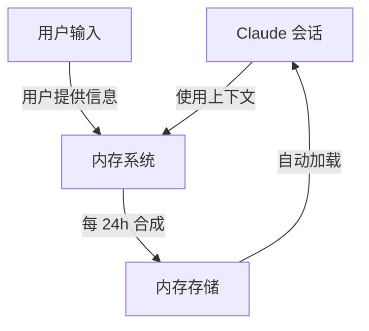
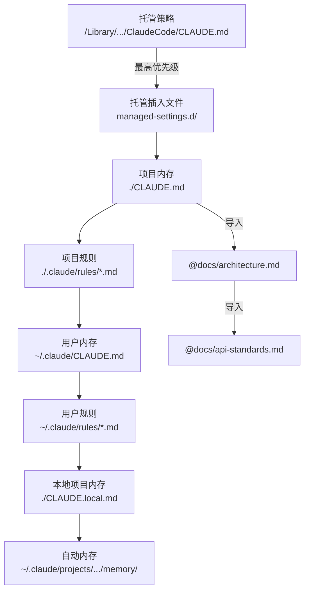
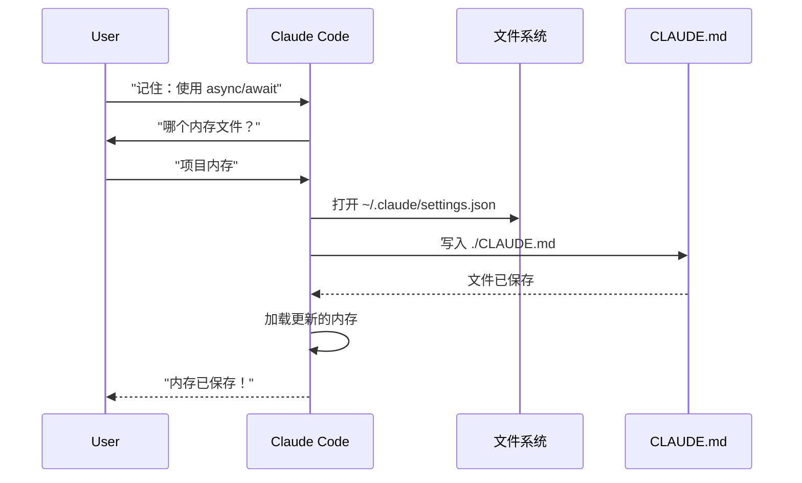
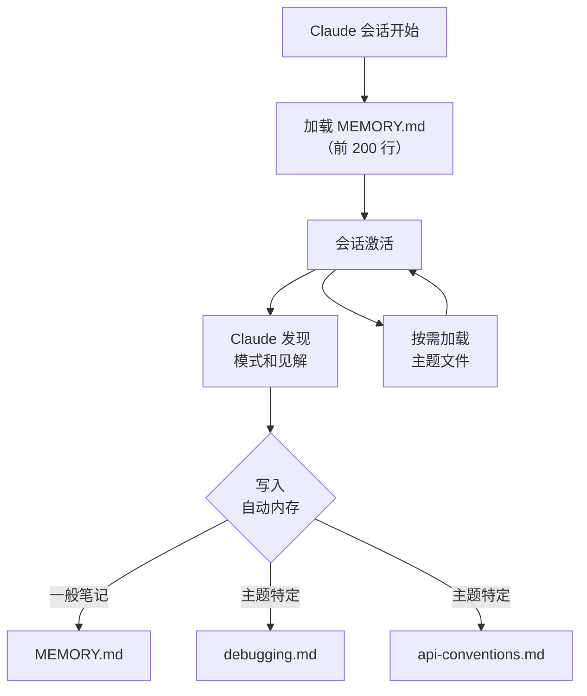

<picture>
  <source media="(prefers-color-scheme: dark)" srcset="../resources/logos/claude-howto-logo-dark.svg">
  
</picture>

# 内存指南

内存使 Claude 能够在会话和对话之间保留上下文。它以两种形式存在：claude.ai 中的自动合成，以及 Claude Code 中基于文件系统的 CLAUDE.md。

## 概述

Claude Code 中的内存提供了跨多个会话和对话持续存在的持久上下文。与临时上下文窗口不同，内存文件允许您：

- 在团队中共享项目标准
- 存储个人开发偏好
- 维护目录特定的规则和配置
- 导入外部文档
- 将内存作为项目的一部分进行版本控制

内存系统在多个层次上运行，从全局个人偏好到特定子目录，允许对 Claude 记住的内容以及如何应用这些知识进行细粒度控制。

## 内存命令快速参考

| 命令 | 用途 | 用法 | 何时使用 |
|------|------|------|---------|
| `/init` | 初始化项目内存 | `/init` | 启动新项目，首次 CLAUDE.md 设置 |
| `/memory` | 在编辑器中编辑内存文件 | `/memory` | 大量更新、重组、审查内容 |
| `#` 前缀 | 快速单行内存添加 | `# 您的规则` | 在对话中添加快速规则 |
| `# new rule into memory` | 明确的内存添加 | `# new rule into memory<br/>您的详细规则` | 添加复杂的多行规则 |
| `# remember this` | 自然语言内存 | `# remember this<br/>您的指令` | 对话式内存更新 |
| `@path/to/file` | 导入外部内容 | `@README.md` 或 `@docs/api.md` | 在 CLAUDE.md 中引用现有文档 |

## 快速入门：初始化内存

### `/init` 命令

`/init` 命令是在 Claude Code 中设置项目内存的最快方式。它使用基础项目文档初始化 CLAUDE.md 文件。

**用法：**

```bash
/init
```

**功能：**

- 在您的项目中创建新的 CLAUDE.md 文件（通常在 `./CLAUDE.md` 或 `./.claude/CLAUDE.md`）
- 建立项目约定和指南
- 为跨会话的上下文持久性奠定基础
- 提供记录项目标准的模板结构

**增强交互模式：** 设置 `CLAUDE_CODE_NEW_INIT=true` 启用多阶段交互流程，逐步引导您完成项目设置：

```bash
CLAUDE_CODE_NEW_INIT=true claude
/init
```

**何时使用 `/init`：**

- 使用 Claude Code 启动新项目
- 建立团队编码标准和约定
- 创建关于代码库结构的文档
- 为协作开发设置内存层次结构

**示例工作流：**

```markdown
# 在您的项目目录中
/init

# Claude 创建结构如下的 CLAUDE.md：
# 项目配置
## 项目概述
- 名称：您的项目
- 技术栈：[您的技术]
- 团队规模：[开发者数量]

## 开发标准
- 代码风格偏好
- 测试要求
- Git 工作流约定
```

### 使用 `#` 快速更新内存

您可以在任何对话中通过以 `#` 开头的消息快速向内存添加信息：

**语法：**

```markdown
# 您的内存规则或指令
```

**示例：**

```markdown
# 在此项目中始终使用 TypeScript 严格模式

# 优先使用 async/await 而非 promise 链

# 每次提交前运行 npm test

# 使用 kebab-case 命名文件
```

**工作原理：**

1. 以 `#` 开头您的消息，后跟您的规则
2. Claude 将此识别为内存更新请求
3. Claude 询问更新哪个内存文件（项目或个人）
4. 规则被添加到相应的 CLAUDE.md 文件
5. 未来的会话自动加载此上下文

**替代模式：**

```markdown
# new rule into memory
始终使用 Zod 模式验证用户输入

# remember this
所有版本使用语义版本控制

# add to memory
数据库迁移必须可回滚
```

### `/memory` 命令

`/memory` 命令在 Claude Code 会话中提供直接访问编辑 CLAUDE.md 内存文件的途径。它在系统编辑器中打开内存文件以进行全面编辑。

**用法：**

```bash
/memory
```

**功能：**

- 在系统默认编辑器中打开内存文件
- 允许进行大量添加、修改和重组
- 提供对层次结构中所有内存文件的直接访问
- 使您能够管理跨会话的持久上下文

**何时使用 `/memory`：**

- 审查现有内存内容
- 对项目标准进行大量更新
- 重组内存结构
- 添加详细的文档或指南
- 随着项目发展维护和更新内存

**对比：`/memory` vs `/init`**

| 方面 | `/memory` | `/init` |
|------|-----------|---------|
| **用途** | 编辑现有内存文件 | 初始化新的 CLAUDE.md |
| **何时使用** | 更新/修改项目上下文 | 开始新项目 |
| **操作** | 打开编辑器进行变更 | 生成入门模板 |
| **工作流** | 持续维护 | 一次性设置 |

**示例工作流：**

```markdown
# 打开内存进行编辑
/memory

# Claude 提供选项：
# 1. 托管策略内存
# 2. 项目内存（./CLAUDE.md）
# 3. 用户内存（~/.claude/CLAUDE.md）
# 4. 本地项目内存

# 选择选项 2（项目内存）
# 默认编辑器打开 ./CLAUDE.md 内容

# 进行变更，保存并关闭编辑器
# Claude 自动重新加载更新的内存
```

**使用内存导入：**

CLAUDE.md 文件支持 `@path/to/file` 语法来包含外部内容：

```markdown
# 项目文档
查看 @README.md 获取项目概述
查看 @package.json 获取可用的 npm 命令
查看 @docs/architecture.md 获取系统设计

# 使用绝对路径从主目录导入
@~/.claude/my-project-instructions.md
```

**导入功能：**

- 支持相对和绝对路径（例如 `@docs/api.md` 或 `@~/.claude/my-project-instructions.md`）
- 支持最大深度为 5 的递归导入
- 首次从外部位置导入会触发安全审批对话框
- 导入指令在 markdown 代码跨度或代码块内不被评估（因此在示例中记录它们是安全的）
- 通过引用现有文档帮助避免重复
- 自动在 Claude 的上下文中包含引用的内容

## 内存架构

Claude Code 中的内存遵循分层系统，不同范围服务于不同目的：



## Claude Code 中的内存层次结构

Claude Code 使用多层分层内存系统。内存文件在 Claude Code 启动时自动加载，优先级较高的位置优先。

**完整内存层次结构（按优先级顺序）：**

1. **托管策略** - 组织范围的指令
   - macOS：`/Library/Application Support/ClaudeCode/CLAUDE.md`
   - Linux/WSL：`/etc/claude-code/CLAUDE.md`
   - Windows：`C:\Program Files\ClaudeCode\CLAUDE.md`

2. **托管插入文件** - 按字母顺序合并的策略文件（v2.1.83+）
   - 位于托管策略 CLAUDE.md 旁边的 `managed-settings.d/` 目录
   - 文件按字母顺序合并以进行模块化策略管理

3. **项目内存** - 团队共享上下文（版本控制）
   - `./.claude/CLAUDE.md` 或 `./CLAUDE.md`（在仓库根目录）

4. **项目规则** - 模块化、主题特定的项目指令
   - `./.claude/rules/*.md`

5. **用户内存** - 个人偏好（所有项目）
   - `~/.claude/CLAUDE.md`

6. **用户级规则** - 个人规则（所有项目）
   - `~/.claude/rules/*.md`

7. **本地项目内存** - 个人项目特定偏好
   - `./CLAUDE.local.md`

> **注意**：截至 2026 年 3 月，`CLAUDE.local.md` 未在[官方文档](https://code.claude.com/docs/en/memory)中提及。它可能仍作为遗留功能工作。对于新项目，考虑改用 `~/.claude/CLAUDE.md`（用户级）或 `.claude/rules/`（项目级，路径范围）。

8. **自动内存** - Claude 的自动笔记和学习
   - `~/.claude/projects/<project>/memory/`

**内存发现行为：**

Claude 按此顺序搜索内存文件，较早的位置优先：



## 使用 `claudeMdExcludes` 排除 CLAUDE.md 文件

在大型 monorepo 中，某些 CLAUDE.md 文件可能与您当前的工作无关。`claudeMdExcludes` 设置允许您跳过特定的 CLAUDE.md 文件，使其不加载到上下文中：

```jsonc
// 在 ~/.claude/settings.json 或 .claude/settings.json 中
{
  "claudeMdExcludes": [
    "packages/legacy-app/CLAUDE.md",
    "vendors/**/CLAUDE.md"
  ]
}
```

模式与相对于项目根目录的路径匹配。这对以下情况特别有用：

- 具有许多子项目的 monorepo，其中只有部分相关
- 包含供应商或第三方 CLAUDE.md 文件的仓库
- 通过排除过时或不相关的指令来减少 Claude 上下文窗口中的噪音

## 设置文件层次结构

Claude Code 设置（包括 `autoMemoryDirectory`、`claudeMdExcludes` 和其他配置）从五级层次结构解析，优先级较高的层级优先：

| 级别 | 位置 | 范围 |
|------|------|------|
| 1（最高） | 托管策略（系统级） | 组织范围的强制执行 |
| 2 | `managed-settings.d/`（v2.1.83+） | 模块化策略插入文件，按字母顺序合并 |
| 3 | `~/.claude/settings.json` | 用户偏好 |
| 4 | `.claude/settings.json` | 项目级（提交到 git） |
| 5（最低） | `.claude/settings.local.json` | 本地覆盖（git 忽略） |

**平台特定配置（v2.1.51+）：**

设置也可以通过以下方式配置：
- **macOS**：属性列表（plist）文件
- **Windows**：Windows 注册表

这些平台原生机制与 JSON 设置文件并列读取，遵循相同的优先级规则。

## 模块化规则系统

使用 `.claude/rules/` 目录结构创建有组织的、路径特定的规则。规则可以在项目级和用户级定义：

```
your-project/
├── .claude/
│   ├── CLAUDE.md
│   └── rules/
│       ├── code-style.md
│       ├── testing.md
│       ├── security.md
│       └── api/                  # 支持子目录
│           ├── conventions.md
│           └── validation.md

~/.claude/
├── CLAUDE.md
└── rules/                        # 用户级规则（所有项目）
    ├── personal-style.md
    └── preferred-patterns.md
```

规则在 `rules/` 目录（包括任何子目录）中递归发现。`~/.claude/rules/` 处的用户级规则在项目级规则之前加载，允许项目可以覆盖的个人默认值。

### 带 YAML Frontmatter 的路径特定规则

定义仅适用于特定文件路径的规则：

```markdown
---
paths: src/api/**/*.ts
---

# API 开发规则

- 所有 API 端点必须包含输入验证
- 使用 Zod 进行模式验证
- 记录所有参数和响应类型
- 为所有操作包含错误处理
```

**Glob 模式示例：**

- `**/*.ts` - 所有 TypeScript 文件
- `src/**/*` - src/ 下的所有文件
- `src/**/*.{ts,tsx}` - 多个扩展名
- `{src,lib}/**/*.ts, tests/**/*.test.ts` - 多个模式

### 子目录和符号链接

`.claude/rules/` 中的规则支持两种组织功能：

- **子目录**：规则被递归发现，因此您可以将它们组织到基于主题的文件夹中（例如 `rules/api/`、`rules/testing/`、`rules/security/`）
- **符号链接**：支持符号链接以在多个项目间共享规则。例如，您可以从中心位置将共享规则文件符号链接到每个项目的 `.claude/rules/` 目录

## 内存位置表

| 位置 | 范围 | 优先级 | 共享 | 访问 | 最适合 |
|------|------|--------|------|------|--------|
| `/Library/Application Support/ClaudeCode/CLAUDE.md`（macOS） | 托管策略 | 1（最高） | 组织 | 系统 | 公司范围的策略 |
| `/etc/claude-code/CLAUDE.md`（Linux/WSL） | 托管策略 | 1（最高） | 组织 | 系统 | 组织标准 |
| `C:\Program Files\ClaudeCode\CLAUDE.md`（Windows） | 托管策略 | 1（最高） | 组织 | 系统 | 企业指南 |
| `managed-settings.d/*.md`（位于策略旁边） | 托管插入文件 | 1.5 | 组织 | 系统 | 模块化策略文件（v2.1.83+） |
| `./CLAUDE.md` 或 `./.claude/CLAUDE.md` | 项目内存 | 2 | 团队 | Git | 团队标准、共享架构 |
| `./.claude/rules/*.md` | 项目规则 | 3 | 团队 | Git | 路径特定、模块化规则 |
| `~/.claude/CLAUDE.md` | 用户内存 | 4 | 个人 | 文件系统 | 个人偏好（所有项目） |
| `~/.claude/rules/*.md` | 用户规则 | 5 | 个人 | 文件系统 | 个人规则（所有项目） |
| `./CLAUDE.local.md` | 项目本地 | 6 | 个人 | Git（忽略） | 个人项目特定偏好 |
| `~/.claude/projects/<project>/memory/` | 自动内存 | 7（最低） | 个人 | 文件系统 | Claude 的自动笔记和学习 |

## 内存更新生命周期

以下是内存更新在 Claude Code 会话中的流程：



## 自动内存

自动内存是一个持久目录，Claude 在与您的项目工作时自动记录学习、模式和见解。与您手动编写和维护的 CLAUDE.md 文件不同，自动内存由 Claude 本身在会话期间写入。

### 自动内存的工作原理

- **位置**：`~/.claude/projects/<project>/memory/`
- **入口点**：`MEMORY.md` 作为自动内存目录中的主文件
- **主题文件**：特定主题的可选附加文件（例如 `debugging.md`、`api-conventions.md`）
- **加载行为**：`MEMORY.md` 的前 200 行在会话开始时加载到系统提示中。主题文件按需加载，而不是在启动时加载。
- **读写**：Claude 在会话期间发现模式和项目特定知识时读取和写入内存文件

### 自动内存架构



### 自动内存目录结构

```
~/.claude/projects/<project>/memory/
├── MEMORY.md              # 入口点（启动时加载前 200 行）
├── debugging.md           # 主题文件（按需加载）
├── api-conventions.md     # 主题文件（按需加载）
└── testing-patterns.md    # 主题文件（按需加载）
```

### 版本要求

自动内存需要 **Claude Code v2.1.59 或更高版本**。如果您使用的是旧版本，请先升级：

```bash
npm install -g @anthropic-ai/claude-code@latest
```

### 自定义自动内存目录

默认情况下，自动内存存储在 `~/.claude/projects/<project>/memory/`。您可以使用 `autoMemoryDirectory` 设置（**v2.1.74** 起可用）更改此位置：

```jsonc
// 在 ~/.claude/settings.json 或 .claude/settings.local.json 中（仅用户/本地设置）
{
  "autoMemoryDirectory": "/path/to/custom/memory/directory"
}
```

> **注意**：`autoMemoryDirectory` 只能在用户级（`~/.claude/settings.json`）或本地设置（`.claude/settings.local.json`）中设置，不能在项目或托管策略设置中设置。

这在以下情况下很有用：

- 将自动内存存储在共享或同步位置
- 将自动内存与默认 Claude 配置目录分开
- 在默认层次结构之外使用项目特定路径

### Worktree 和仓库共享

同一 git 仓库中的所有 worktree 和子目录共享单个自动内存目录。这意味着在 worktree 之间切换或在同一仓库的不同子目录中工作将读取和写入相同的内存文件。

### 子代理内存

子代理（通过 Task 或并行执行等工具生成）可以有自己的内存上下文。在子代理定义中使用 `memory` frontmatter 字段指定要加载哪些内存范围：

```yaml
memory: user      # 只加载用户级内存
memory: project   # 只加载项目级内存
memory: local     # 只加载本地内存
```

这允许子代理在聚焦的上下文中操作，而不是继承完整的内存层次结构。

### 控制自动内存

可以通过 `CLAUDE_CODE_DISABLE_AUTO_MEMORY` 环境变量控制自动内存：

| 值 | 行为 |
|----|------|
| `0` | 强制自动内存**开启** |
| `1` | 强制自动内存**关闭** |
| *（未设置）* | 默认行为（自动内存已启用） |

```bash
# 为会话禁用自动内存
CLAUDE_CODE_DISABLE_AUTO_MEMORY=1 claude

# 明确强制自动内存开启
CLAUDE_CODE_DISABLE_AUTO_MEMORY=0 claude
```

## 使用 `--add-dir` 的附加目录

`--add-dir` 标志允许 Claude Code 从当前工作目录之外的附加目录加载 CLAUDE.md 文件。这对于上下文来自其他目录相关的 monorepo 或多项目设置很有用。

要启用此功能，请设置环境变量：

```bash
CLAUDE_CODE_ADDITIONAL_DIRECTORIES_CLAUDE_MD=1
```

然后使用该标志启动 Claude Code：

```bash
claude --add-dir /path/to/other/project
```

Claude 将从指定的附加目录加载 CLAUDE.md，与当前工作目录的内存文件一起。

## 实际示例

### 示例 1：项目内存结构

**文件：** `./CLAUDE.md`

```markdown
# 项目配置

## 项目概述
- **名称**：电子商务平台
- **技术栈**：Node.js、PostgreSQL、React 18、Docker
- **团队规模**：5 名开发者
- **截止日期**：2025 年第四季度

## 架构
@docs/architecture.md
@docs/api-standards.md
@docs/database-schema.md

## 开发标准

### 代码风格
- 使用 Prettier 进行格式化
- 使用带 airbnb 配置的 ESLint
- 最大行长：100 个字符
- 使用 2 个空格缩进

### 命名约定
- **文件**：kebab-case（user-controller.js）
- **类**：PascalCase（UserService）
- **函数/变量**：camelCase（getUserById）
- **常量**：UPPER_SNAKE_CASE（API_BASE_URL）
- **数据库表**：snake_case（user_accounts）

### Git 工作流
- 分支名称：`feature/description` 或 `fix/description`
- 提交消息：遵循约定式提交
- 合并前需要 PR
- 所有 CI/CD 检查必须通过
- 至少需要 1 个批准

### 测试要求
- 最低 80% 代码覆盖率
- 所有关键路径必须有测试
- 使用 Jest 进行单元测试
- 使用 Cypress 进行 E2E 测试
- 测试文件名：`*.test.ts` 或 `*.spec.ts`

### API 标准
- 仅 RESTful 端点
- JSON 请求/响应
- 正确使用 HTTP 状态码
- API 端点版本控制：`/api/v1/`
- 用示例记录所有端点

### 数据库
- 使用迁移进行模式变更
- 永远不硬编码凭证
- 使用连接池
- 在开发中启用查询日志
- 需要定期备份

### 部署
- 基于 Docker 的部署
- Kubernetes 编排
- 蓝绿部署策略
- 失败时自动回滚
- 数据库迁移在部署前运行

## 常用命令

| 命令 | 用途 |
|------|------|
| `npm run dev` | 启动开发服务器 |
| `npm test` | 运行测试套件 |
| `npm run lint` | 检查代码风格 |
| `npm run build` | 生产构建 |
| `npm run migrate` | 运行数据库迁移 |

## 团队联系人
- 技术负责人：Sarah Chen (@sarah.chen)
- 产品经理：Mike Johnson (@mike.j)
- DevOps：Alex Kim (@alex.k)

## 已知问题和解决方法
- PostgreSQL 连接池在高峰时段限制为 20
- 解决方法：实现查询队列
- Safari 14 的 async generators 兼容性问题
- 解决方法：使用 Babel 编译器
```

### 示例 2：目录特定内存

**文件：** `./src/api/CLAUDE.md`

```markdown
# API 模块标准

此文件覆盖 /src/api/ 中所有内容的根 CLAUDE.md

## API 特定标准

### 请求验证
- 使用 Zod 进行模式验证
- 始终验证输入
- 返回带验证错误的 400
- 包含字段级错误详情

### 认证
- 所有端点需要 JWT token
- Authorization 头中的 token
- Token 24 小时后过期
- 实现刷新 token 机制

### 响应格式

所有响应必须遵循此结构：

```json
{
  "success": true,
  "data": { /* 实际数据 */ },
  "timestamp": "2025-11-06T10:30:00Z",
  "version": "1.0"
}
```

错误响应：
```json
{
  "success": false,
  "error": {
    "code": "VALIDATION_ERROR",
    "message": "用户消息",
    "details": { /* 字段错误 */ }
  },
  "timestamp": "2025-11-06T10:30:00Z"
}
```

### 分页
- 使用基于游标的分页（不是偏移量）
- 包含 `hasMore` 布尔值
- 将最大页面大小限制为 100
- 默认页面大小：20

### 速率限制
- 已认证用户每小时 1000 次请求
- 公共端点每小时 100 次请求
- 超出时返回 429
- 包含 retry-after 头
```

### 示例 3：个人内存

**文件：** `~/.claude/CLAUDE.md`

```markdown
# 我的开发偏好

## 关于我
- **经验级别**：8 年全栈开发
- **首选语言**：TypeScript、Python
- **沟通风格**：直接，带示例
- **学习风格**：带代码的视觉图表

## 代码偏好

### 错误处理
我偏好使用带有意义错误消息的 try-catch 块进行显式错误处理。
避免通用错误。始终记录错误以便调试。

### 注释
注释用于解释为什么，而不是什么。代码应该自文档化。
注释应该解释业务逻辑或非显而易见的决策。

### 测试
我偏好 TDD（测试驱动开发）。
先写测试，然后实现。
关注行为，而不是实现细节。

### 架构
我偏好模块化、松耦合的设计。
使用依赖注入以提高可测试性。
分离关注点（控制器、服务、仓库）。

## 调试偏好
- 使用带前缀的 console.log：`[DEBUG]`
- 包含上下文：函数名、相关变量
- 可用时使用堆栈跟踪
- 在日志中始终包含时间戳

## 沟通
- 用图表解释复杂概念
- 在解释理论之前展示具体示例
- 包含前后代码片段
- 最后总结要点
```

### 示例 4：会话期间的内存更新

您可以在活动的 Claude Code 会话期间向内存添加新规则。有两种方式：

#### 方法 1：直接请求

```markdown
用户：记住我更喜欢对所有新组件使用 React hooks 而非类组件。

Claude：我将其添加到您的内存中。应该放在哪个内存文件中？
       1. 项目内存（./CLAUDE.md）
       2. 个人内存（~/.claude/CLAUDE.md）

用户：项目内存

Claude：✅ 内存已保存！

已添加到 ./CLAUDE.md：
---

### 组件开发
- 使用带 React Hooks 的函数式组件
- 优先使用 hooks 而非类组件
- 可复用逻辑使用自定义 hooks
- 事件处理器使用 useCallback
- 昂贵计算使用 useMemo
```

#### 方法 2：使用 "# new rule into memory" 模式

您也可以使用显式模式 "# new rule into memory" 触发内存更新：

```markdown
用户：# new rule into memory
     处理前始终使用 Zod 模式验证用户输入。

Claude：我将此规则保存到内存中。应该使用哪个内存文件？
       1. 项目内存（./CLAUDE.md）
       2. 个人内存（~/.claude/CLAUDE.md）

用户：项目内存

Claude：✅ 内存已保存！

已添加到 ./CLAUDE.md：
---

### 输入验证
- 处理前始终使用 Zod 模式验证用户输入
- 在每个 API 处理器文件顶部定义模式
- 返回 400 状态和验证错误
```

#### 添加内存的提示

- 在您的规则中具体且可操作
- 在章节标题下将相关规则分组
- 更新现有章节而不是重复内容
- 选择适当的内存范围（项目 vs. 个人）

## 内存功能对比

| 功能 | Claude 网页/桌面 | Claude Code（CLAUDE.md） |
|------|----------------|------------------------|
| 自动合成 | ✅ 每 24h | ❌ 手动 |
| 跨项目 | ✅ 共享 | ❌ 项目特定 |
| 团队访问 | ✅ 共享项目 | ✅ Git 跟踪 |
| 可搜索 | ✅ 内置 | ✅ 通过 `/memory` |
| 可编辑 | ✅ 聊天内 | ✅ 直接文件编辑 |
| 导入/导出 | ✅ 是 | ✅ 复制/粘贴 |
| 持久 | ✅ 24h+ | ✅ 无限期 |

## 最佳实践

### 应该做 - 要包含的内容

- **具体且详细**：使用清晰、详细的指令而非模糊的指导
  - ✅ 好："对所有 JavaScript 文件使用 2 个空格缩进"
  - ❌ 避免："遵循最佳实践"

- **保持组织**：使用清晰的 markdown 章节和标题结构内存文件

- **使用适当的层次级别**：
  - **托管策略**：公司范围的策略、安全标准、合规要求
  - **项目内存**：团队标准、架构、编码约定（提交到 git）
  - **用户内存**：个人偏好、沟通风格、工具选择
  - **目录内存**：模块特定规则和覆盖

- **利用导入**：使用 `@path/to/file` 语法引用现有文档
  - 支持最多 5 级递归嵌套
  - 避免内存文件间的重复
  - 示例：`查看 @README.md 获取项目概述`

- **记录常用命令**：包含您重复使用的命令以节省时间

- **版本控制项目内存**：将项目级 CLAUDE.md 文件提交到 git 以供团队受益

- **定期审查**：随着项目发展和需求变化定期更新内存

- **提供具体示例**：包含代码片段和特定场景

### 不应该做 - 要避免的内容

- **不要存储密钥**：永远不要包含 API 密钥、密码、token 或凭证

- **不要包含敏感数据**：没有 PII、私人信息或专有密钥

- **不要重复内容**：使用导入（`@path`）引用现有文档

- **不要模糊**：避免"遵循最佳实践"或"编写好代码"等通用声明

- **不要太长**：将单个内存文件专注保持在 500 行以内

- **不要过度组织**：策略性地使用层次结构；不要创建过多的子目录覆盖

- **不要忘记更新**：过时的内存可能导致混乱和过时的实践

- **不要超过嵌套限制**：内存导入支持最多 5 级嵌套

## 安装说明

### 设置项目内存

#### 方法 1：使用 `/init` 命令（推荐）

设置项目内存的最快方式：

1. **导航到您的项目目录：**
   ```bash
   cd /path/to/your/project
   ```

2. **在 Claude Code 中运行 init 命令：**
   ```bash
   /init
   ```

3. **Claude 将创建并填充 CLAUDE.md**，使用模板结构

4. **自定义生成的文件**以匹配您的项目需求

5. **提交到 git：**
   ```bash
   git add CLAUDE.md
   git commit -m "使用 /init 初始化项目内存"
   ```

#### 方法 2：手动创建

如果您更喜欢手动设置：

1. **在项目根目录创建 CLAUDE.md：**
   ```bash
   cd /path/to/your/project
   touch CLAUDE.md
   ```

2. **添加项目标准：**
   ```bash
   cat > CLAUDE.md << 'EOF'
   # 项目配置

   ## 项目概述
   - **名称**：您的项目名称
   - **技术栈**：列出您的技术
   - **团队规模**：开发者数量

   ## 开发标准
   - 您的编码标准
   - 命名约定
   - 测试要求
   EOF
   ```

3. **提交到 git：**
   ```bash
   git add CLAUDE.md
   git commit -m "添加项目内存配置"
   ```

#### 方法 3：使用 `#` 快速更新

一旦 CLAUDE.md 存在，在对话中快速添加规则：

```markdown
# 所有版本使用语义版本控制

# 提交前始终运行测试

# 优先使用组合而非继承
```

Claude 将提示您选择更新哪个内存文件。

### 设置个人内存

1. **创建 ~/.claude 目录：**
   ```bash
   mkdir -p ~/.claude
   ```

2. **创建个人 CLAUDE.md：**
   ```bash
   touch ~/.claude/CLAUDE.md
   ```

3. **添加您的偏好：**
   ```bash
   cat > ~/.claude/CLAUDE.md << 'EOF'
   # 我的开发偏好

   ## 关于我
   - 经验级别：[您的级别]
   - 首选语言：[您的语言]
   - 沟通风格：[您的风格]

   ## 代码偏好
   - [您的偏好]
   EOF
   ```

### 设置目录特定内存

1. **为特定目录创建内存：**
   ```bash
   mkdir -p /path/to/directory/.claude
   touch /path/to/directory/CLAUDE.md
   ```

2. **添加目录特定规则：**
   ```bash
   cat > /path/to/directory/CLAUDE.md << 'EOF'
   # [目录名称] 标准

   此文件覆盖此目录的根 CLAUDE.md。

   ## [特定标准]
   EOF
   ```

3. **提交到版本控制：**
   ```bash
   git add /path/to/directory/CLAUDE.md
   git commit -m "添加 [目录] 内存配置"
   ```

### 验证设置

1. **检查内存位置：**
   ```bash
   # 项目根内存
   ls -la ./CLAUDE.md

   # 个人内存
   ls -la ~/.claude/CLAUDE.md
   ```

2. **Claude Code 将在启动会话时自动加载**这些文件

3. **使用 Claude Code 测试**，在项目中启动新会话

## 官方文档

有关最新信息，请参考官方 Claude Code 文档：

- **[内存文档](https://code.claude.com/docs/en/memory)** - 完整内存系统参考
- **[斜杠命令参考](https://code.claude.com/docs/en/interactive-mode)** - 所有内置命令包括 `/init` 和 `/memory`
- **[CLI 参考](https://code.claude.com/docs/en/cli-reference)** - 命令行接口文档

## 相关概念链接

### 集成点
- [MCP 协议](../05-mcp/) - 与内存并存的实时数据访问
- [斜杠命令](../01-slash-commands/) - 会话特定快捷方式
- [技能](../03-skills/) - 带内存上下文的自动化工作流

### 相关 Claude 功能
- [Claude 网页内存](https://claude.ai) - 自动合成
- [官方内存文档](https://code.claude.com/docs/en/memory) - Anthropic 文档
