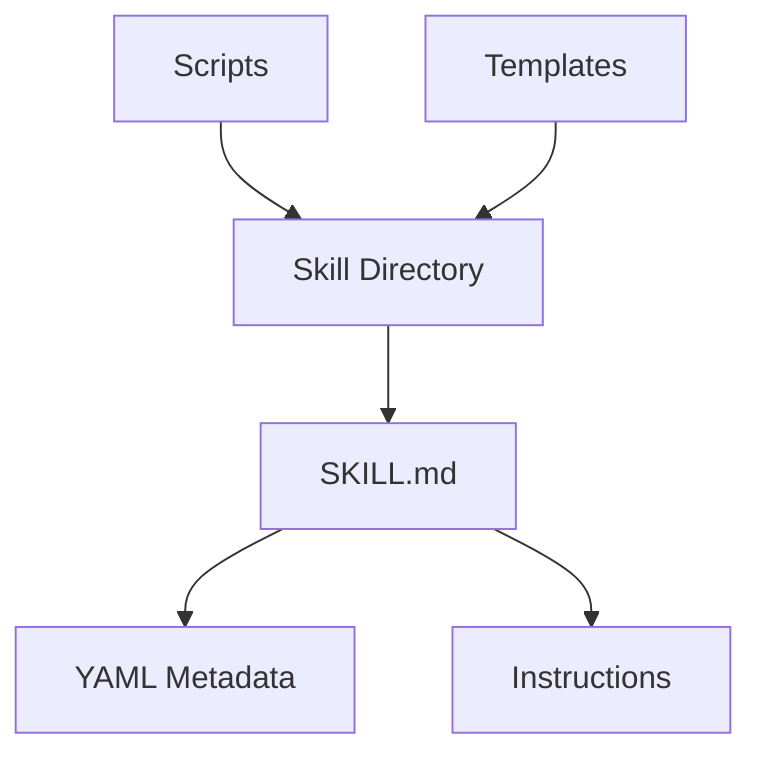
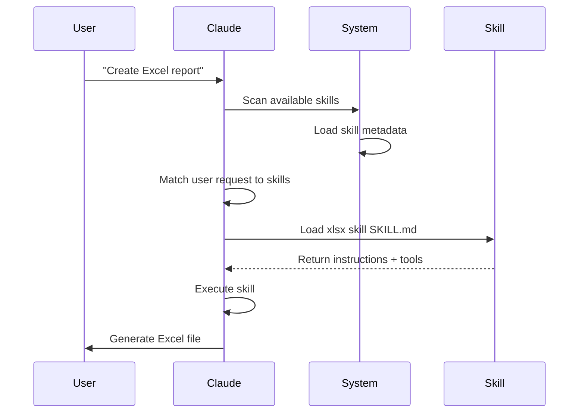
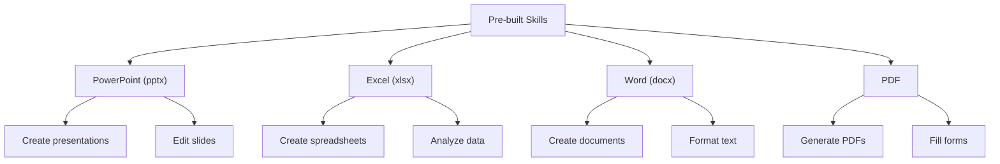
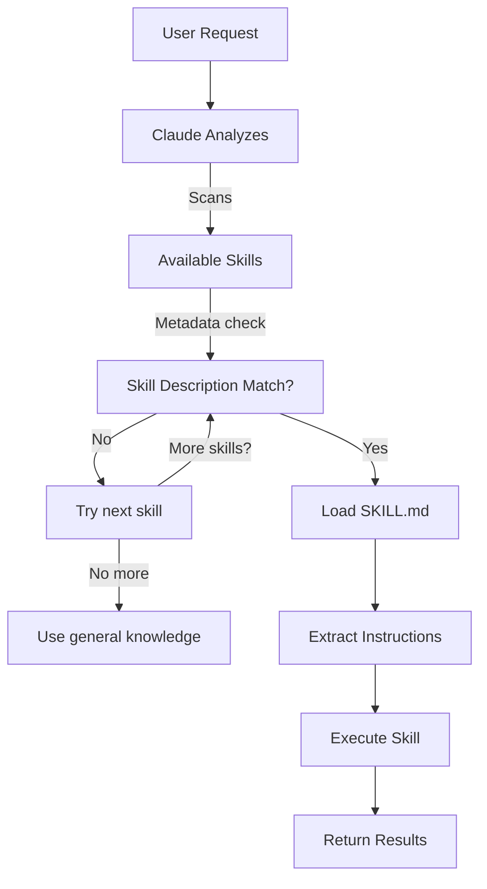
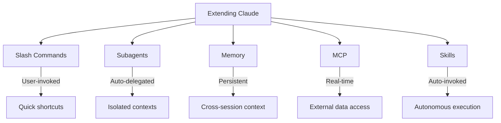

# Agent Skills Guide

Agent Skills are reusable, model-invoked capabilities packaged as folders containing instructions, scripts, and resources. Claude automatically detects and uses relevant skills.

## Overview

Agent Skills enable you to:
- **Package domain expertise** - Encapsulate specialized knowledge and processes
- **Ensure consistency** - Apply standardized approaches across all projects
- **Enable automation** - Let Claude automatically invoke skills when needed
- **Scale workflows** - Reuse skills across multiple projects and teams
- **Maintain quality** - Embed best practices directly into your workflow

Skills are discovered automatically based on user requests and skill metadata, making them seamless to use without explicit commands.

## Skill Architecture



## Skill Loading Process



## Skill Types & Locations Table

| Type | Location | Scope | Shared | Sync | Best For |
|------|----------|-------|--------|------|----------|
| Pre-built | Built-in | Global | All users | Auto | Document creation |
| Personal | `~/.claude/skills/` | Individual | No | Manual | Personal automation |
| Project | `.claude/skills/` | Team | Yes | Git | Team standards |
| Plugin | Via plugin install | Varies | Depends | Auto | Integrated features |

## Pre-built Skills



## Practical Examples

### Example 1: Custom Code Review Skill

**Directory Structure:**

```
~/.claude/skills/code-review/
├── SKILL.md
├── templates/
│   ├── review-checklist.md
│   └── finding-template.md
└── scripts/
    ├── analyze-metrics.py
    └── compare-complexity.py
```

**File:** `~/.claude/skills/code-review/SKILL.md`

```yaml
---
name: Code Review Specialist
description: Comprehensive code review with security, performance, and quality analysis
version: "1.0.0"
tags:
  - code-review
  - quality
  - security
when_to_use: When users ask to review code, analyze code quality, or evaluate pull requests
---

# Code Review Skill

This skill provides comprehensive code review capabilities focusing on:

1. **Security Analysis**
   - Authentication/authorization issues
   - Data exposure risks
   - Injection vulnerabilities
   - Cryptographic weaknesses
   - Sensitive data logging

2. **Performance Review**
   - Algorithm efficiency (Big O analysis)
   - Memory optimization
   - Database query optimization
   - Caching opportunities
   - Concurrency issues

3. **Code Quality**
   - SOLID principles
   - Design patterns
   - Naming conventions
   - Documentation
   - Test coverage

4. **Maintainability**
   - Code readability
   - Function size (should be < 50 lines)
   - Cyclomatic complexity
   - Dependency management
   - Type safety

## Review Template

For each piece of code reviewed, provide:

### Summary
- Overall quality assessment (1-5)
- Key findings count
- Recommended priority areas

### Critical Issues (if any)
- **Issue**: Clear description
- **Location**: File and line number
- **Impact**: Why this matters
- **Severity**: Critical/High/Medium
- **Fix**: Code example

### Findings by Category

#### Security (if issues found)
List security vulnerabilities with examples

#### Performance (if issues found)
List performance problems with complexity analysis

#### Quality (if issues found)
List code quality issues with refactoring suggestions

#### Maintainability (if issues found)
List maintainability problems with improvements
```

**Python Script:** `~/.claude/skills/code-review/scripts/analyze-metrics.py`

```python
#!/usr/bin/env python3
import re
import sys

def analyze_code_metrics(code):
    """Analyze code for common metrics."""

    # Count functions
    functions = len(re.findall(r'^def\s+\w+', code, re.MULTILINE))

    # Count classes
    classes = len(re.findall(r'^class\s+\w+', code, re.MULTILINE))

    # Average line length
    lines = code.split('\n')
    avg_length = sum(len(l) for l in lines) / len(lines) if lines else 0

    # Estimate complexity
    complexity = len(re.findall(r'\b(if|elif|else|for|while|and|or)\b', code))

    return {
        'functions': functions,
        'classes': classes,
        'avg_line_length': avg_length,
        'complexity_score': complexity
    }

if __name__ == '__main__':
    with open(sys.argv[1], 'r') as f:
        code = f.read()
    metrics = analyze_code_metrics(code)
    for key, value in metrics.items():
        print(f"{key}: {value:.2f}")
```

**Python Script:** `~/.claude/skills/code-review/scripts/compare-complexity.py`

```python
#!/usr/bin/env python3
"""
Compare cyclomatic complexity of code before and after changes.
Helps identify if refactoring actually simplifies code structure.
"""

import re
import sys
from typing import Dict, Tuple

class ComplexityAnalyzer:
    """Analyze code complexity metrics."""

    def __init__(self, code: str):
        self.code = code
        self.lines = code.split('\n')

    def calculate_cyclomatic_complexity(self) -> int:
        """
        Calculate cyclomatic complexity using McCabe's method.
        Count decision points: if, elif, else, for, while, except, and, or
        """
        complexity = 1  # Base complexity

        # Count decision points
        decision_patterns = [
            r'\bif\b',
            r'\belif\b',
            r'\bfor\b',
            r'\bwhile\b',
            r'\bexcept\b',
            r'\band\b(?!$)',
            r'\bor\b(?!$)'
        ]

        for pattern in decision_patterns:
            matches = re.findall(pattern, self.code)
            complexity += len(matches)

        return complexity

    def calculate_cognitive_complexity(self) -> int:
        """
        Calculate cognitive complexity - how hard is it to understand?
        Based on nesting depth and control flow.
        """
        cognitive = 0
        nesting_depth = 0

        for line in self.lines:
            # Track nesting depth
            if re.search(r'^\s*(if|for|while|def|class|try)\b', line):
                nesting_depth += 1
                cognitive += nesting_depth
            elif re.search(r'^\s*(elif|else|except|finally)\b', line):
                cognitive += nesting_depth

            # Reduce nesting when unindenting
            if line and not line[0].isspace():
                nesting_depth = 0

        return cognitive

    def calculate_maintainability_index(self) -> float:
        """
        Maintainability Index ranges from 0-100.
        > 85: Excellent
        > 65: Good
        > 50: Fair
        < 50: Poor
        """
        lines = len(self.lines)
        cyclomatic = self.calculate_cyclomatic_complexity()
        cognitive = self.calculate_cognitive_complexity()

        # Simplified MI calculation
        mi = 171 - 5.2 * (cyclomatic / lines) - 0.23 * (cognitive) - 16.2 * (lines / 1000)

        return max(0, min(100, mi))

    def get_complexity_report(self) -> Dict:
        """Generate comprehensive complexity report."""
        return {
            'cyclomatic_complexity': self.calculate_cyclomatic_complexity(),
            'cognitive_complexity': self.calculate_cognitive_complexity(),
            'maintainability_index': round(self.calculate_maintainability_index(), 2),
            'lines_of_code': len(self.lines),
            'avg_line_length': round(sum(len(l) for l in self.lines) / len(self.lines), 2) if self.lines else 0
        }


def compare_files(before_file: str, after_file: str) -> None:
    """Compare complexity metrics between two code versions."""

    with open(before_file, 'r') as f:
        before_code = f.read()

    with open(after_file, 'r') as f:
        after_code = f.read()

    before_analyzer = ComplexityAnalyzer(before_code)
    after_analyzer = ComplexityAnalyzer(after_code)

    before_metrics = before_analyzer.get_complexity_report()
    after_metrics = after_analyzer.get_complexity_report()

    print("=" * 60)
    print("CODE COMPLEXITY COMPARISON")
    print("=" * 60)

    print("\nBEFORE:")
    print(f"  Cyclomatic Complexity:    {before_metrics['cyclomatic_complexity']}")
    print(f"  Cognitive Complexity:     {before_metrics['cognitive_complexity']}")
    print(f"  Maintainability Index:    {before_metrics['maintainability_index']}")
    print(f"  Lines of Code:            {before_metrics['lines_of_code']}")
    print(f"  Avg Line Length:          {before_metrics['avg_line_length']}")

    print("\nAFTER:")
    print(f"  Cyclomatic Complexity:    {after_metrics['cyclomatic_complexity']}")
    print(f"  Cognitive Complexity:     {after_metrics['cognitive_complexity']}")
    print(f"  Maintainability Index:    {after_metrics['maintainability_index']}")
    print(f"  Lines of Code:            {after_metrics['lines_of_code']}")
    print(f"  Avg Line Length:          {after_metrics['avg_line_length']}")

    print("\nCHANGES:")
    cyclomatic_change = after_metrics['cyclomatic_complexity'] - before_metrics['cyclomatic_complexity']
    cognitive_change = after_metrics['cognitive_complexity'] - before_metrics['cognitive_complexity']
    mi_change = after_metrics['maintainability_index'] - before_metrics['maintainability_index']
    loc_change = after_metrics['lines_of_code'] - before_metrics['lines_of_code']

    print(f"  Cyclomatic Complexity:    {cyclomatic_change:+d}")
    print(f"  Cognitive Complexity:     {cognitive_change:+d}")
    print(f"  Maintainability Index:    {mi_change:+.2f}")
    print(f"  Lines of Code:            {loc_change:+d}")

    print("\nASSESSMENT:")
    if mi_change > 0:
        print("  Code is MORE maintainable")
    elif mi_change < 0:
        print("  Code is LESS maintainable")
    else:
        print("  Maintainability unchanged")

    if cyclomatic_change < 0:
        print("  Complexity DECREASED")
    elif cyclomatic_change > 0:
        print("  Complexity INCREASED")
    else:
        print("  Complexity unchanged")

    print("=" * 60)


if __name__ == '__main__':
    if len(sys.argv) != 3:
        print("Usage: python compare-complexity.py <before_file> <after_file>")
        sys.exit(1)

    compare_files(sys.argv[1], sys.argv[2])
```

**Template:** `~/.claude/skills/code-review/templates/review-checklist.md`

```markdown
# Code Review Checklist

## Security Checklist
- [ ] No hardcoded credentials or secrets
- [ ] Input validation on all user inputs
- [ ] SQL injection prevention (parameterized queries)
- [ ] CSRF protection on state-changing operations
- [ ] XSS prevention with proper escaping
- [ ] Authentication checks on protected endpoints
- [ ] Authorization checks on resources
- [ ] Secure password hashing (bcrypt, argon2)
- [ ] No sensitive data in logs
- [ ] HTTPS enforced

## Performance Checklist
- [ ] No N+1 queries
- [ ] Appropriate use of indexes
- [ ] Caching implemented where beneficial
- [ ] No blocking operations on main thread
- [ ] Async/await used correctly
- [ ] Large datasets paginated
- [ ] Database connections pooled
- [ ] Regular expressions optimized
- [ ] No unnecessary object creation
- [ ] Memory leaks prevented

## Quality Checklist
- [ ] Functions < 50 lines
- [ ] Clear variable naming
- [ ] No duplicate code
- [ ] Proper error handling
- [ ] Comments explain WHY, not WHAT
- [ ] No console.logs in production
- [ ] Type checking (TypeScript/JSDoc)
- [ ] SOLID principles followed
- [ ] Design patterns applied correctly
- [ ] Self-documenting code

## Testing Checklist
- [ ] Unit tests written
- [ ] Edge cases covered
- [ ] Error scenarios tested
- [ ] Integration tests present
- [ ] Coverage > 80%
- [ ] No flaky tests
- [ ] Mock external dependencies
- [ ] Clear test names
```

**Template:** `~/.claude/skills/code-review/templates/finding-template.md`

```markdown
# Code Review Finding Template

Use this template when documenting each issue found during code review.

---

## Issue: [TITLE]

### Severity
- [ ] Critical (blocks deployment)
- [ ] High (should fix before merge)
- [ ] Medium (should fix soon)
- [ ] Low (nice to have)

### Category
- [ ] Security
- [ ] Performance
- [ ] Code Quality
- [ ] Maintainability
- [ ] Testing
- [ ] Design Pattern
- [ ] Documentation

### Location
**File:** `src/components/UserCard.tsx`

**Lines:** 45-52

**Function/Method:** `renderUserDetails()`

### Issue Description

**What:** Describe what the issue is.

**Why it matters:** Explain the impact and why this needs to be fixed.

**Current behavior:** Show the problematic code or behavior.

**Expected behavior:** Describe what should happen instead.

### Code Example

#### Current (Problematic)

```typescript
// Shows the N+1 query problem
const users = fetchUsers();
users.forEach(user => {
  const posts = fetchUserPosts(user.id); // Query per user!
  renderUserPosts(posts);
});
```

#### Suggested Fix

```typescript
// Optimized with JOIN query
const usersWithPosts = fetchUsersWithPosts();
usersWithPosts.forEach(({ user, posts }) => {
  renderUserPosts(posts);
});
```

### Impact Analysis

| Aspect | Impact | Severity |
|--------|--------|----------|
| Performance | 100+ queries for 20 users | High |
| User Experience | Slow page load | High |
| Scalability | Breaks at scale | Critical |
| Maintainability | Hard to debug | Medium |

### Related Issues

- Similar issue in `AdminUserList.tsx` line 120
- Related PR: #456
- Related issue: #789

### Additional Resources

- [N+1 Query Problem](https://en.wikipedia.org/wiki/N%2B1_problem)
- [Database Join Documentation](https://docs.example.com/joins)
- [Performance Optimization Guide](./docs/performance.md)

### Reviewer Notes

- This is a common pattern in this codebase
- Consider adding this to the code style guide
- Might be worth creating a helper function

### Author Response (for feedback)

*To be filled by the code author:*

- [ ] Fix implemented in commit: `abc123`
- [ ] Fix status: Complete / In Progress / Needs Discussion
- [ ] Questions or concerns: (describe)

---

## Finding Statistics (for Reviewer)

When reviewing multiple findings, track:

- **Total Issues Found:** X
- **Critical:** X
- **High:** X
- **Medium:** X
- **Low:** X

**Recommendation:** Approve / Request Changes / Needs Discussion

**Overall Code Quality:** 1-5 stars
```

**Usage Example:**

```markdown
User: Review this React component code

Claude: I'll conduct a comprehensive code review using my Code Review Skill.

[Loads SKILL.md]
[Analyzes code against checklist]
[Runs Python metrics script]
[Applies templates]

## Code Review Results

### Summary
Quality Score: 3.5/5
Key Findings: 7 items
Priority Areas: Performance optimization, error handling

### Critical Issues: 1

**Issue**: N+1 Query Problem
**Location**: UserComponent.tsx, lines 45-52
**Impact**: Renders 100+ database queries for list of 20 users
**Severity**: High
**Fix**:
```javascript
// Before: N+1 queries
const users = fetchUsers();
users.forEach(user => fetchUserPosts(user.id)); // 20+ queries

// After: Single query with JOIN
const users = fetchUsersWithPosts(); // 1 query
```

### Performance Findings
- Missing pagination on large lists
- Recommendation: Use React.memo() for items
- Database query: Could be optimized with index

### Quality Findings
- Function in line 20 is 127 lines (max: 50)
- Missing error boundary
- Props should have TypeScript types
```

### Example 2: Brand Voice Skill

**Directory Structure:**

```
.claude/skills/brand-voice/
├── SKILL.md
├── brand-guidelines.md
├── tone-examples.md
└── templates/
    ├── email-template.txt
    ├── social-post-template.txt
    └── blog-post-template.md
```

**File:** `.claude/skills/brand-voice/SKILL.md`

```md
---
name: Brand Voice Consistency
description: Ensure all communication matches brand voice and tone guidelines
tags:
  - brand
  - writing
  - consistency
when_to_use: When creating marketing copy, customer communications, or public-facing content
---

# Brand Voice Skill

## Overview
This skill ensures all communications maintain consistent brand voice, tone, and messaging.

## Brand Identity

### Mission
Help teams automate their development workflows with AI

### Values
- **Simplicity**: Make complex things simple
- **Reliability**: Rock-solid execution
- **Empowerment**: Enable human creativity

### Tone of Voice
- **Friendly but professional** - approachable without being casual
- **Clear and concise** - avoid jargon, explain technical concepts simply
- **Confident** - we know what we're doing
- **Empathetic** - understand user needs and pain points

## Writing Guidelines

### Do's
- Use "you" when addressing readers
- Use active voice: "Claude generates reports" not "Reports are generated by Claude"
- Start with value proposition
- Use concrete examples
- Keep sentences under 20 words
- Use lists for clarity
- Include calls-to-action

### Don'ts
- Don't use corporate jargon
- Don't patronize or oversimplify
- Don't use "we believe" or "we think"
- Don't use ALL CAPS except for emphasis
- Don't create walls of text
- Don't assume technical knowledge

## Vocabulary

### Preferred Terms
- Claude (not "the Claude AI")
- Code generation (not "auto-coding")
- Agent (not "bot")
- Streamline (not "revolutionize")
- Integrate (not "synergize")

### Avoid Terms
- "Cutting-edge" (overused)
- "Game-changer" (vague)
- "Leverage" (corporate-speak)
- "Utilize" (use "use")
- "Paradigm shift" (unclear)

**Good Example:**
"Claude automates your code review process. Instead of manually checking each PR, Claude reviews security, performance, and quality—saving your team hours every week."

Why it works: Clear value, specific benefits, action-oriented

**Bad Example:**
"Claude leverages cutting-edge AI to provide comprehensive software development solutions."

Why it doesn't work: Vague, corporate jargon, no specific value

```

**Template:** `email-template.txt`

```
Subject: [Clear, benefit-driven subject]

Hi [Name],

[Opening: What's the value for them]

[Body: How it works / What they'll get]

[Specific example or benefit]

[Call to action: Clear next step]

Best regards,
[Name]
```

**Template:** `social-post-template.txt`

```
[Hook: Grab attention in first line]
[2-3 lines: Value or interesting fact]
[Call to action: Link, question, or engagement]
[Emoji: 1-2 max for visual interest]
```

**File:** `tone-examples.md`

```markdown
Exciting announcement:
"Save 8 hours per week on code reviews. Claude reviews your PRs automatically."

Empathetic support:
"We know deployments can be stressful. Claude handles testing so you don't have to worry."

Confident product feature:
"Claude doesn't just suggest code. It understands your architecture and maintains consistency."

Educational blog post:
"Let's explore how agents improve code review workflows. Here's what we learned..."
```

### Example 3: Documentation Generator Skill

**File:** `.claude/skills/doc-generator/SKILL.md`

```md
---
name: API Documentation Generator
description: Generate comprehensive, accurate API documentation from source code
version: "1.0.0"
tags:
  - documentation
  - api
  - automation
when_to_use: When creating or updating API documentation
---

# API Documentation Generator Skill

## Generates

- OpenAPI/Swagger specifications
- API endpoint documentation
- SDK usage examples
- Integration guides
- Error code references
- Authentication guides

## Documentation Structure

### For Each Endpoint
<document>
## GET /api/v1/users/:id

### Description
Brief explanation of what this endpoint does

### Parameters

| Name | Type | Required | Description |
|------|------|----------|-------------|
| id | string | Yes | User ID |

### Response
**200 Success**

{
  "id": "usr_123",
  "name": "John Doe",
  "email": "john@example.com",
  "created_at": "2025-01-15T10:30:00Z"
}

**404 Not Found**

{
  "error": "USER_NOT_FOUND",
  "message": "User does not exist"
}

### Examples

**cURL**
curl -X GET "https://api.example.com/api/v1/users/usr_123" \
  -H "Authorization: Bearer YOUR_TOKEN"

**JavaScript**
const user = await fetch('/api/v1/users/usr_123', {
  headers: { 'Authorization': 'Bearer token' }
}).then(r => r.json());

**Python**
response = requests.get(
    'https://api.example.com/api/v1/users/usr_123',
    headers={'Authorization': 'Bearer token'}
)
user = response.json()
</document>
```
**Python Script:** `.claude/skills/doc-generator/scripts/generate-docs.py`

```python
#!/usr/bin/env python3
import ast
import json
from typing import Dict, List

class APIDocExtractor(ast.NodeVisitor):
    """Extract API documentation from Python source code."""

    def __init__(self):
        self.endpoints = []

    def visit_FunctionDef(self, node):
        """Extract function documentation."""
        if node.name.startswith('get_') or node.name.startswith('post_'):
            doc = ast.get_docstring(node)
            endpoint = {
                'name': node.name,
                'docstring': doc,
                'params': [arg.arg for arg in node.args.args],
                'returns': self._extract_return_type(node)
            }
            self.endpoints.append(endpoint)
        self.generic_visit(node)

    def _extract_return_type(self, node):
        """Extract return type from function annotation."""
        if node.returns:
            return ast.unparse(node.returns)
        return "Any"

def generate_markdown_docs(endpoints: List[Dict]) -> str:
    """Generate markdown documentation from endpoints."""
    docs = "# API Documentation\n\n"

    for endpoint in endpoints:
        docs += f"## {endpoint['name']}\n\n"
        docs += f"{endpoint['docstring']}\n\n"
        docs += f"**Parameters**: {', '.join(endpoint['params'])}\n\n"
        docs += f"**Returns**: {endpoint['returns']}\n\n"
        docs += "---\n\n"

    return docs

if __name__ == '__main__':
    import sys
    with open(sys.argv[1], 'r') as f:
        tree = ast.parse(f.read())

    extractor = APIDocExtractor()
    extractor.visit(tree)

    markdown = generate_markdown_docs(extractor.endpoints)
    print(markdown)
```

## Skill Discovery & Invocation



## Skill vs Other Features



## Best Practices

### Do's
- Use clear, descriptive names
- Include comprehensive instructions
- Add concrete examples
- Document when to use the skill
- Package related scripts and templates
- Test with real scenarios
- Include YAML metadata in SKILL.md
- Organize skills by domain/purpose
- Version your skills
- Document dependencies

### Don'ts
- Don't create skills for one-time tasks
- Don't duplicate existing functionality
- Don't make skills too broad
- Don't forget metadata in SKILL.md
- Don't skip examples
- Don't assume Claude knows skill context
- Don't create circular dependencies
- Don't ignore performance implications

## Installation Instructions

### For Personal Skills

Copy skill folders to your personal skills directory:

```bash
# Copy individual skill
cp -r code-review ~/.claude/skills/

# Copy all skills
cp -r * ~/.claude/skills/

# Make scripts executable
chmod +x ~/.claude/skills/code-review/scripts/*.py
```

### For Project Skills

Copy skill folders to your project skills directory to share with team:

```bash
# Copy individual skill to project
cp -r code-review /path/to/project/.claude/skills/

# Copy all skills
cp -r * /path/to/project/.claude/skills/

# Commit to version control
git add .claude/skills/
git commit -m "Add project skills"
```

### Verifying Installation

After copying skills:

1. Check that SKILL.md exists in each skill directory
2. Verify scripts have proper permissions: `ls -l ~/.claude/skills/code-review/scripts/`
3. Test skill invocation with a sample request

### Creating Custom Skills

1. Create skill directory structure
2. Write SKILL.md with metadata and instructions
3. Add scripts and templates as needed
4. Test by copying to skills directory
5. Refine based on usage

## Related Concepts Links

- **Slash Commands** - User-initiated shortcuts for specific tasks
- **Subagents** - Delegated AI agents for task distribution
- **Memory** - Persistent context across conversation sessions
- **MCP (Model Context Protocol)** - Real-time access to external data sources
- **Claude Code** - AI CLI for automated development workflows
- **Skill Metadata** - YAML frontmatter that defines skill activation rules
