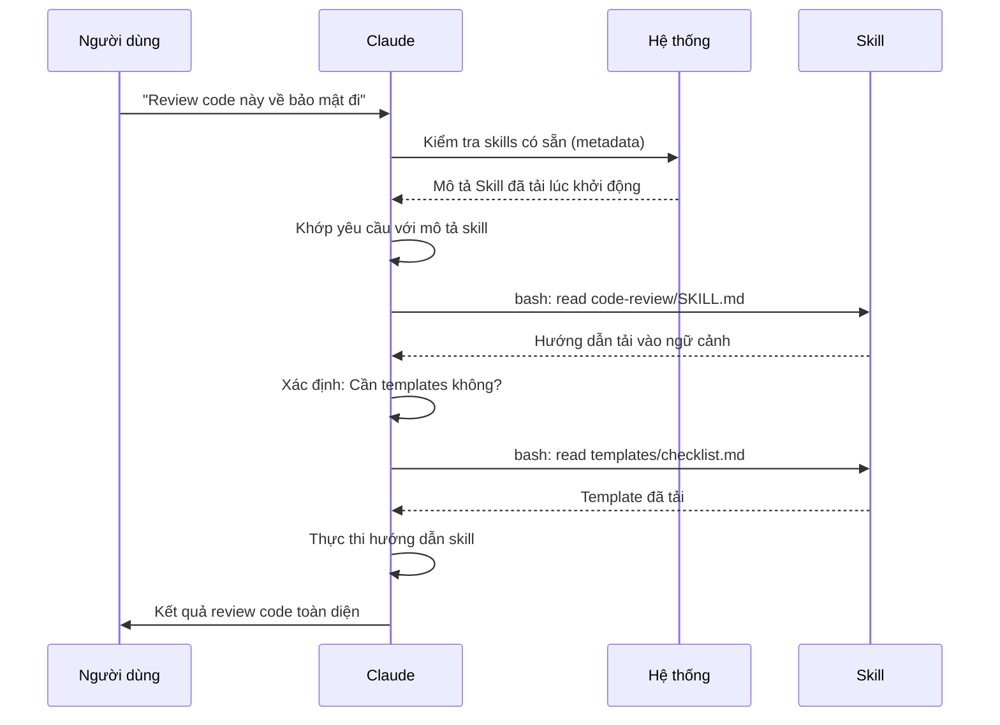

<picture>
  <source media="(prefers-color-scheme: dark)" srcset="../resources/logos/claude-howto-logo-dark.svg">
  
</picture>

# Hướng dẫn Agent Skills

Agent Skills (kỹ năng tác nhân) là các khả năng có thể tái sử dụng, lưu trữ trên filesystem, giúp mở rộng chức năng của Claude. Chúng đóng gói chuyên môn theo lĩnh vực, quy trình làm việc và các thực hành tốt nhất thành các thành phần có thể khám phá tự động mà Claude tự nhận ra khi cần.

## Tổng quan

**Agent Skills** là các khả năng dạng module, biến đổi các tác nhân đa năng thành chuyên gia. Khác với prompts (hướng dẫn cấp hội thoại cho các tác vụ một lần), Skills được tải theo nhu cầu và loại bỏ việc phải cung cấp hướng dẫn lặp đi lặp lại qua nhiều cuộc hội thoại.

### Lợi ích chính

- **Chuyên môn hóa Claude**: Điều chỉnh khả năng cho các tác vụ theo lĩnh vực cụ thể
- **Giảm lặp lại**: Tạo một lần, dùng tự động qua nhiều hội thoại
- **Kết hợp khả năng**: Ghép nhiều Skills để xây dựng quy trình phức tạp
- **Mở rộng quy mô**: Tái sử dụng skills qua nhiều dự án và nhóm
- **Duy trì chất lượng**: Nhúng trực tiếp các thực hành tốt nhất vào quy trình làm việc

Skills tuân theo tiêu chuẩn mở [Agent Skills](https://agentskills.io), hoạt động trên nhiều công cụ AI. Claude Code mở rộng tiêu chuẩn này với các tính năng bổ sung như kiểm soát gọi skill, thực thi subagent và chèn ngữ cảnh động.

> **Lưu ý**: Slash commands tùy chỉnh đã được tích hợp vào skills. Các file `.claude/commands/` vẫn hoạt động và hỗ trợ các trường frontmatter tương tự. Skills được khuyến nghị cho việc phát triển mới. Khi cả hai tồn tại cùng đường dẫn (ví dụ: `.claude/commands/review.md` và `.claude/skills/review/SKILL.md`), skill sẽ được ưu tiên.

## Cách Skills hoạt động: Tiết lộ dần dần (Progressive Disclosure)

Skills sử dụng kiến trúc **tiết lộ dần dần** — Claude tải thông tin theo từng giai đoạn khi cần, thay vì tiêu thụ ngữ cảnh ngay từ đầu. Điều này cho phép quản lý ngữ cảnh hiệu quả trong khi vẫn duy trì khả năng mở rộng không giới hạn.

### Ba cấp độ tải

```mermaid
graph TB
    subgraph "Cấp 1: Metadata (Luôn tải)"
        A["YAML Frontmatter"]
        A1["~100 tokens mỗi skill"]
        A2["name + description"]
    end

    subgraph "Cấp 2: Hướng dẫn (Khi được kích hoạt)"
        B["Nội dung SKILL.md"]
        B1["Dưới 5k tokens"]
        B2["Quy trình & hướng dẫn"]
    end

    subgraph "Cấp 3: Tài nguyên (Khi cần)
        C["File đi kèm"]
        C1["Thực tế không giới hạn"]
        C2["Scripts, templates, docs"]
    end

    A --> B
    B --> C
```

| Cấp độ | Khi nào tải | Chi phí token | Nội dung |
|--------|------------|--------------|---------|
| **Cấp 1: Metadata** | Luôn luôn (lúc khởi động) | ~100 tokens mỗi Skill | `name` và `description` từ YAML frontmatter |
| **Cấp 2: Hướng dẫn** | Khi Skill được kích hoạt | Dưới 5k tokens | Nội dung SKILL.md với hướng dẫn |
| **Cấp 3+: Tài nguyên** | Khi cần | Thực tế không giới hạn | File đi kèm được thực thi qua bash mà không tải nội dung vào ngữ cảnh |

Điều này có nghĩa bạn có thể cài nhiều Skills mà không tốn ngữ cảnh — Claude chỉ biết mỗi Skill tồn tại và khi nào dùng nó cho đến khi thực sự được kích hoạt.

## Quy trình tải Skill



## Loại & Vị trí Skills

| Loại | Vị trí | Phạm vi | Chia sẻ được | Tốt nhất cho |
|------|--------|---------|-------------|------------|
| **Enterprise** | Cài đặt quản lý | Tất cả user tổ chức | Có | Tiêu chuẩn toàn tổ chức |
| **Cá nhân** | `~/.claude/skills/<tên-skill>/SKILL.md` | Cá nhân | Không | Quy trình cá nhân |
| **Dự án** | `.claude/skills/<tên-skill>/SKILL.md` | Nhóm | Có (qua git) | Tiêu chuẩn nhóm |
| **Plugin** | `<plugin>/skills/<tên-skill>/SKILL.md` | Nơi được bật | Tùy | Đi kèm với plugins |

Khi skills có cùng tên ở nhiều cấp, vị trí ưu tiên cao hơn thắng: **enterprise > cá nhân > dự án**. Plugin skills dùng namespace `tên-plugin:tên-skill`, nên không thể xung đột.

### Khám phá tự động

**Thư mục lồng nhau**: Khi bạn làm việc với file trong thư mục con, Claude Code tự động khám phá skills từ các thư mục `.claude/skills/` lồng nhau. Ví dụ, nếu bạn đang chỉnh sửa file trong `packages/frontend/`, Claude Code cũng tìm skills trong `packages/frontend/.claude/skills/`. Hỗ trợ cấu trúc monorepo nơi các package có skills riêng.

**Thư mục `--add-dir`**: Skills từ các thư mục được thêm qua `--add-dir` được tải tự động với phát hiện thay đổi trực tiếp. Mọi chỉnh sửa file skill trong các thư mục đó có hiệu lực ngay mà không cần khởi động lại Claude Code.

**Ngân sách mô tả**: Mô tả Skill (metadata Cấp 1) bị giới hạn ở **2% cửa sổ ngữ cảnh** (dự phòng: **16.000 ký tự**). Nếu bạn cài nhiều skills, một số có thể bị loại trừ. Chạy `/context` để kiểm tra cảnh báo. Ghi đè ngân sách bằng biến môi trường `SLASH_COMMAND_TOOL_CHAR_BUDGET`.

## Tạo Skills tùy chỉnh

### Cấu trúc thư mục cơ bản

```
my-skill/
├── SKILL.md           # Hướng dẫn chính (bắt buộc)
├── template.md        # Template để Claude điền vào
├── examples/
│   └── sample.md      # Ví dụ output thể hiện định dạng mong đợi
└── scripts/
    └── validate.sh    # Script Claude có thể thực thi
```

### Định dạng SKILL.md

```yaml
---
name: tên-skill-của-bạn
description: Mô tả ngắn gọn Skill này làm gì và khi nào dùng
---

# Tên Skill của bạn

## Hướng dẫn
Cung cấp hướng dẫn rõ ràng, từng bước cho Claude.

## Ví dụ
Hiển thị các ví dụ cụ thể về cách dùng Skill này.
```

### Các trường bắt buộc

- **name**: chỉ chữ thường, số, dấu gạch ngang (tối đa 64 ký tự). Không được chứa "anthropic" hoặc "claude".
- **description**: Skill làm gì VÀ khi nào dùng (tối đa 1024 ký tự). Đây là yếu tố quan trọng để Claude biết khi nào kích hoạt skill.

### Các trường frontmatter tùy chọn

```yaml
---
name: my-skill
description: Skill này làm gì và khi nào dùng
argument-hint: "[tên-file] [định-dạng]"      # Gợi ý cho autocomplete
disable-model-invocation: true              # Chỉ user mới có thể gọi
user-invocable: false                       # Ẩn khỏi menu slash
allowed-tools: Read, Grep, Glob             # Giới hạn quyền truy cập tool
model: opus                                 # Model cụ thể để dùng
effort: high                                # Ghi đè mức effort (low, medium, high, max)
context: fork                               # Chạy trong subagent riêng biệt
agent: Explore                              # Loại agent (với context: fork)
shell: bash                                 # Shell cho lệnh: bash (mặc định) hoặc powershell
hooks:                                      # Hooks theo phạm vi skill
  PreToolUse:
    - matcher: "Bash"
      hooks:
        - type: command
          command: "./scripts/validate.sh"
---
```

| Trường | Mô tả |
|--------|-------|
| `name` | Chỉ chữ thường, số, dấu gạch ngang (tối đa 64 ký tự). Không được chứa "anthropic" hoặc "claude". |
| `description` | Skill làm gì VÀ khi nào dùng (tối đa 1024 ký tự). Quan trọng cho việc tự khớp khi gọi tự động. |
| `argument-hint` | Gợi ý hiển thị trong menu autocomplete `/` (ví dụ: `"[tên-file] [định-dạng]"`). |
| `disable-model-invocation` | `true` = chỉ user có thể gọi qua `/tên`. Claude sẽ không bao giờ tự gọi. |
| `user-invocable` | `false` = ẩn khỏi menu `/`. Chỉ Claude có thể tự động gọi. |
| `allowed-tools` | Danh sách tools (cách nhau bằng dấu phẩy) mà skill có thể dùng mà không cần xin phép. |
| `model` | Ghi đè model khi skill đang chạy (ví dụ: `opus`, `sonnet`). |
| `effort` | Ghi đè mức effort khi skill chạy: `low`, `medium`, `high`, hoặc `max`. |
| `context` | `fork` để chạy skill trong ngữ cảnh subagent riêng với cửa sổ ngữ cảnh của nó. |
| `agent` | Loại subagent khi `context: fork` (ví dụ: `Explore`, `Plan`, `general-purpose`). |
| `shell` | Shell dùng cho thay thế lệnh `` !`command` `` và scripts: `bash` (mặc định) hoặc `powershell`. |
| `hooks` | Hooks theo phạm vi vòng đời skill này (cùng định dạng với hooks toàn cục). |

## Loại nội dung Skill

Skills có thể chứa hai loại nội dung, phù hợp với các mục đích khác nhau:

### Nội dung tham chiếu (Reference Content)

Thêm kiến thức Claude áp dụng vào công việc hiện tại — quy ước, pattern, hướng dẫn phong cách, kiến thức lĩnh vực. Chạy nội tuyến trong ngữ cảnh hội thoại.

```yaml
---
name: api-conventions
description: Các mẫu thiết kế API cho codebase này
---

Khi viết API endpoints:
- Dùng quy ước đặt tên RESTful
- Trả về định dạng lỗi nhất quán
- Bao gồm xác thực request
```

### Nội dung tác vụ (Task Content)

Hướng dẫn từng bước cho các hành động cụ thể. Thường được gọi trực tiếp với `/tên-skill`.

```yaml
---
name: deploy
description: Deploy ứng dụng lên production
context: fork
disable-model-invocation: true
---

Deploy ứng dụng:
1. Chạy test suite
2. Build ứng dụng
3. Push lên deployment target
```

## Kiểm soát cách gọi Skill

Mặc định, cả bạn và Claude đều có thể gọi bất kỳ skill nào. Hai trường frontmatter kiểm soát ba chế độ gọi:

| Frontmatter | Bạn có thể gọi | Claude có thể gọi |
|---|---|---|
| (mặc định) | Có | Có |
| `disable-model-invocation: true` | Có | Không |
| `user-invocable: false` | Không | Có |

**Dùng `disable-model-invocation: true`** cho các quy trình có tác dụng phụ: `/commit`, `/deploy`, `/send-slack-message`. Bạn không muốn Claude tự quyết định deploy chỉ vì code trông có vẻ sẵn sàng.

**Dùng `user-invocable: false`** cho kiến thức nền không phải là lệnh có nghĩa. Skill `legacy-system-context` giải thích cách hoạt động của hệ thống cũ — hữu ích cho Claude, nhưng không phải hành động có nghĩa cho user.

## Thay thế chuỗi (String Substitutions)

Skills hỗ trợ các giá trị động được giải quyết trước khi nội dung skill đến Claude:

| Biến | Mô tả |
|------|-------|
| `$ARGUMENTS` | Tất cả đối số truyền khi gọi skill |
| `$ARGUMENTS[N]` hoặc `$N` | Truy cập đối số cụ thể theo chỉ số (bắt đầu từ 0) |
| `${CLAUDE_SESSION_ID}` | ID phiên hiện tại |
| `${CLAUDE_SKILL_DIR}` | Thư mục chứa file SKILL.md của skill |
| `` !`lệnh` `` | Chèn ngữ cảnh động — chạy lệnh shell và đưa output vào nội tuyến |

**Ví dụ:**

```yaml
---
name: fix-issue
description: Sửa một GitHub issue
---

Sửa GitHub issue $ARGUMENTS theo tiêu chuẩn coding của chúng ta.
1. Đọc mô tả issue
2. Triển khai bản sửa lỗi
3. Viết tests
4. Tạo commit
```

Chạy `/fix-issue 123` sẽ thay thế `$ARGUMENTS` bằng `123`.

## Chèn ngữ cảnh động

Cú pháp `` !`lệnh` `` chạy lệnh shell trước khi nội dung skill được gửi đến Claude:

```yaml
---
name: pr-summary
description: Tóm tắt các thay đổi trong một pull request
context: fork
agent: Explore
---

## Ngữ cảnh pull request
- PR diff: !`gh pr diff`
- PR comments: !`gh pr view --comments`
- File đã thay đổi: !`gh pr diff --name-only`

## Nhiệm vụ của bạn
Tóm tắt pull request này...
```

Lệnh thực thi ngay lập tức; Claude chỉ thấy output cuối cùng. Mặc định, lệnh chạy trong `bash`. Đặt `shell: powershell` trong frontmatter để dùng PowerShell.

## Chạy Skills trong Subagents

Thêm `context: fork` để chạy skill trong ngữ cảnh subagent riêng biệt. Nội dung skill trở thành tác vụ cho một subagent chuyên dụng với cửa sổ ngữ cảnh riêng, giữ cho hội thoại chính gọn gàng.

Trường `agent` chỉ định loại agent nào sẽ dùng:

| Loại Agent | Tốt nhất cho |
|---|---|
| `Explore` | Nghiên cứu chỉ đọc, phân tích codebase |
| `Plan` | Tạo kế hoạch triển khai |
| `general-purpose` | Các tác vụ rộng cần tất cả tools |
| Custom agents | Các agent chuyên biệt trong cấu hình của bạn |

**Ví dụ frontmatter:**

```yaml
---
context: fork
agent: Explore
---
```

**Ví dụ skill đầy đủ:**

```yaml
---
name: deep-research
description: Nghiên cứu một chủ đề kỹ lưỡng
context: fork
agent: Explore
---

Nghiên cứu $ARGUMENTS kỹ lưỡng:
1. Tìm các file liên quan bằng Glob và Grep
2. Đọc và phân tích code
3. Tóm tắt kết quả với tham chiếu file cụ thể
```

## Ví dụ thực tế

### Ví dụ 1: Skill Review Code

**Cấu trúc thư mục:**

```
~/.claude/skills/code-review/
├── SKILL.md
├── templates/
│   ├── review-checklist.md
│   └── finding-template.md
└── scripts/
    ├── analyze-metrics.py
    └── compare-complexity.py
```

**File:** `~/.claude/skills/code-review/SKILL.md`

```yaml
---
name: code-review-specialist
description: Review code toàn diện với phân tích bảo mật, hiệu năng và chất lượng. Dùng khi user yêu cầu review code, phân tích chất lượng code, đánh giá pull requests, hoặc đề cập đến code review, phân tích bảo mật, hoặc tối ưu hiệu năng.
---

# Skill Review Code

Skill này cung cấp khả năng review code toàn diện tập trung vào:

1. **Phân tích bảo mật**
   - Vấn đề xác thực/ủy quyền
   - Rủi ro lộ dữ liệu
   - Lỗ hổng injection
   - Điểm yếu mật mã

2. **Review hiệu năng**
   - Hiệu quả thuật toán (phân tích Big O)
   - Tối ưu bộ nhớ
   - Tối ưu truy vấn database
   - Cơ hội caching

3. **Chất lượng code**
   - Nguyên tắc SOLID
   - Design patterns
   - Quy ước đặt tên
   - Độ phủ test

4. **Khả năng bảo trì**
   - Khả năng đọc code
   - Kích thước hàm (nên < 50 dòng)
   - Độ phức tạp Cyclomatic
   - Type safety

## Template Review

Với mỗi đoạn code được review, cung cấp:

### Tóm tắt
- Đánh giá chất lượng tổng thể (1-5)
- Số lượng phát hiện chính
- Các khu vực ưu tiên được đề xuất

### Vấn đề nghiêm trọng (nếu có)
- **Vấn đề**: Mô tả rõ ràng
- **Vị trí**: File và số dòng
- **Tác động**: Tại sao điều này quan trọng
- **Mức độ**: Critical/High/Medium
- **Cách sửa**: Ví dụ code

Để xem checklist chi tiết, xem [templates/review-checklist.md](templates/review-checklist.md).
```

### Ví dụ 2: Skill Trực quan hóa Codebase

Một skill tạo ra các visualization HTML tương tác:

**Cấu trúc thư mục:**

```
~/.claude/skills/codebase-visualizer/
├── SKILL.md
└── scripts/
    └── visualize.py
```

**File:** `~/.claude/skills/codebase-visualizer/SKILL.md`

```yaml
---
name: codebase-visualizer
description: Tạo visualization cây thư mục tương tác có thể thu gọn cho codebase của bạn. Dùng khi khám phá repo mới, tìm hiểu cấu trúc dự án, hoặc xác định file lớn.
allowed-tools: Bash(python *)
---

# Codebase Visualizer

Tạo cây HTML tương tác hiển thị cấu trúc file dự án.

## Cách dùng

Chạy script visualization từ thư mục gốc dự án:

```bash
python ~/.claude/skills/codebase-visualizer/scripts/visualize.py .
```

Lệnh này tạo `codebase-map.html` và mở trong trình duyệt mặc định.

## Visualization hiển thị gì

- **Thư mục có thể thu gọn**: Click vào folder để mở rộng/thu gọn
- **Kích thước file**: Hiển thị bên cạnh mỗi file
- **Màu sắc**: Màu khác nhau cho các loại file khác nhau
- **Tổng kích thước thư mục**: Hiển thị kích thước tổng của mỗi folder
```

Script Python đi kèm xử lý phần nặng trong khi Claude quản lý việc điều phối.

### Ví dụ 3: Skill Deploy (Chỉ User gọi)

```yaml
---
name: deploy
description: Deploy ứng dụng lên production
disable-model-invocation: true
allowed-tools: Bash(npm *), Bash(git *)
---

Deploy $ARGUMENTS lên production:

1. Chạy test suite: `npm test`
2. Build ứng dụng: `npm run build`
3. Push lên deployment target
4. Xác minh deployment thành công
5. Báo cáo trạng thái deployment
```

### Ví dụ 4: Skill Giọng nói thương hiệu (Kiến thức nền)

```yaml
---
name: brand-voice
description: Đảm bảo tất cả giao tiếp phù hợp với hướng dẫn giọng nói và tông điệu thương hiệu. Dùng khi tạo nội dung marketing, giao tiếp khách hàng, hoặc nội dung công khai.
user-invocable: false
---

## Tông điệu giọng nói
- **Thân thiện nhưng chuyên nghiệp** - dễ tiếp cận mà không cần bình thường hóa
- **Rõ ràng và súc tích** - tránh biệt ngữ
- **Tự tin** - chúng ta biết mình đang làm gì
- **Đồng cảm** - hiểu nhu cầu user

## Hướng dẫn viết
- Dùng "bạn" khi xưng hô với người đọc
- Dùng giọng chủ động
- Giữ câu dưới 20 từ
- Bắt đầu bằng đề xuất giá trị

Để xem templates, xem [templates/](templates/).
```

### Ví dụ 5: Skill Tạo CLAUDE.md

```yaml
---
name: claude-md
description: Tạo hoặc cập nhật file CLAUDE.md theo các thực hành tốt nhất để AI agent onboarding tối ưu. Dùng khi user đề cập đến CLAUDE.md, tài liệu dự án, hoặc AI onboarding.
---

## Nguyên tắc cốt lõi

**LLMs không có trạng thái**: CLAUDE.md là file duy nhất được tự động đưa vào mọi hội thoại.

### Quy tắc vàng

1. **Ít hơn là tốt hơn**: Giữ dưới 300 dòng (tốt nhất dưới 100)
2. **Áp dụng chung**: Chỉ bao gồm thông tin liên quan đến MỌI phiên
3. **Đừng dùng Claude làm Linter**: Dùng các công cụ xác định thay thế
4. **Không bao giờ tự động tạo**: Soạn thủ công với sự cân nhắc kỹ lưỡng

## Các phần thiết yếu

- **Tên dự án**: Mô tả ngắn một dòng
- **Tech Stack**: Ngôn ngữ chính, frameworks, database
- **Lệnh phát triển**: Install, test, build
- **Quy ước quan trọng**: Chỉ các quy ước không hiển nhiên, có tác động cao
- **Vấn đề đã biết / Bẫy**: Những thứ hay gây nhầm lẫn cho developer
```

### Ví dụ 6: Skill Tái cấu trúc với Scripts

**Cấu trúc thư mục:**

```
refactor/
├── SKILL.md
├── references/
│   ├── code-smells.md
│   └── refactoring-catalog.md
├── templates/
│   └── refactoring-plan.md
└── scripts/
    ├── analyze-complexity.py
    └── detect-smells.py
```

**File:** `refactor/SKILL.md`

```yaml
---
name: code-refactor
description: Tái cấu trúc code có hệ thống dựa trên phương pháp của Martin Fowler. Dùng khi user yêu cầu tái cấu trúc code, cải thiện cấu trúc code, giảm nợ kỹ thuật, hoặc loại bỏ code smells.
---

# Skill Tái cấu trúc Code

Cách tiếp cận theo giai đoạn nhấn mạnh các thay đổi an toàn, tăng dần được backup bởi tests.

## Quy trình

Giai đoạn 1: Nghiên cứu & Phân tích → Giai đoạn 2: Đánh giá độ phủ Test →
Giai đoạn 3: Xác định Code Smell → Giai đoạn 4: Tạo Kế hoạch Tái cấu trúc →
Giai đoạn 5: Triển khai tăng dần → Giai đoạn 6: Review & Lặp lại

## Nguyên tắc cốt lõi

1. **Bảo toàn hành vi**: Hành vi bên ngoài phải không thay đổi
2. **Bước nhỏ**: Thực hiện các thay đổi nhỏ, có thể kiểm tra
3. **Hướng test**: Tests là lưới an toàn
4. **Liên tục**: Tái cấu trúc là quá trình liên tục, không phải một lần

Để xem catalog code smell, xem [references/code-smells.md](references/code-smells.md).
Để xem kỹ thuật tái cấu trúc, xem [references/refactoring-catalog.md](references/refactoring-catalog.md).
```

## File hỗ trợ

Skills có thể bao gồm nhiều file trong thư mục của chúng ngoài `SKILL.md`. Các file hỗ trợ này (templates, ví dụ, scripts, tài liệu tham chiếu) giúp file skill chính gọn gàng trong khi cung cấp cho Claude các tài nguyên bổ sung có thể tải khi cần.

```
my-skill/
├── SKILL.md              # Hướng dẫn chính (bắt buộc, giữ dưới 500 dòng)
├── templates/            # Templates để Claude điền vào
│   └── output-format.md
├── examples/             # Ví dụ output thể hiện định dạng mong đợi
│   └── sample-output.md
├── references/           # Kiến thức lĩnh vực và đặc tả
│   └── api-spec.md
└── scripts/              # Scripts Claude có thể thực thi
    └── validate.sh
```

Hướng dẫn cho file hỗ trợ:

- Giữ `SKILL.md` dưới **500 dòng**. Chuyển tài liệu tham chiếu chi tiết, ví dụ lớn và đặc tả sang file riêng.
- Tham chiếu file bổ sung từ `SKILL.md` bằng **đường dẫn tương đối** (ví dụ: `[Tham chiếu API](references/api-spec.md)`).
- File hỗ trợ được tải ở Cấp 3 (khi cần), nên chúng không tiêu thụ ngữ cảnh cho đến khi Claude thực sự đọc chúng.

## Quản lý Skills

### Xem Skills có sẵn

Hỏi Claude trực tiếp:
```
Skills nào đang có sẵn?
```

Hoặc kiểm tra filesystem:
```bash
# Liệt kê Skills cá nhân
ls ~/.claude/skills/

# Liệt kê Skills dự án
ls .claude/skills/
```

### Kiểm tra một Skill

Hai cách kiểm tra:

**Để Claude tự kích hoạt** bằng cách yêu cầu điều gì đó khớp với mô tả:
```
Bạn có thể review code này về vấn đề bảo mật không?
```

**Hoặc gọi trực tiếp** với tên skill:
```
/code-review src/auth/login.ts
```

### Cập nhật một Skill

Chỉnh sửa file `SKILL.md` trực tiếp. Thay đổi có hiệu lực khi khởi động Claude Code tiếp theo.

```bash
# Skill cá nhân
code ~/.claude/skills/my-skill/SKILL.md

# Skill dự án
code .claude/skills/my-skill/SKILL.md
```

### Giới hạn quyền truy cập Skill của Claude

Ba cách kiểm soát skills nào Claude có thể gọi:

**Tắt tất cả skills** trong `/permissions`:
```
# Thêm vào quy tắc từ chối:
Skill
```

**Cho phép hoặc từ chối skills cụ thể**:
```
# Chỉ cho phép skills cụ thể
Skill(commit)
Skill(review-pr *)

# Từ chối skills cụ thể
Skill(deploy *)
```

**Ẩn skills riêng lẻ** bằng cách thêm `disable-model-invocation: true` vào frontmatter của chúng.

## Thực hành tốt nhất

### 1. Làm cho mô tả cụ thể

- **Kém (mơ hồ)**: "Giúp với tài liệu"
- **Tốt (cụ thể)**: "Trích xuất văn bản và bảng từ file PDF, điền form, ghép tài liệu. Dùng khi làm việc với file PDF hoặc khi user đề cập đến PDFs, forms, hoặc trích xuất tài liệu."

### 2. Giữ Skills tập trung

- Một Skill = một khả năng
- ✅ "Điền form PDF"
- ❌ "Xử lý tài liệu" (quá rộng)

### 3. Bao gồm từ kích hoạt

Thêm từ khóa trong mô tả khớp với yêu cầu user:
```yaml
description: Phân tích bảng tính Excel, tạo pivot tables, vẽ biểu đồ. Dùng khi làm việc với file Excel, bảng tính, hoặc file .xlsx.
```

### 4. Giữ SKILL.md dưới 500 dòng

Chuyển tài liệu tham chiếu chi tiết sang file riêng mà Claude tải khi cần.

### 5. Tham chiếu file hỗ trợ

```markdown
## Tài nguyên bổ sung

- Để xem chi tiết API đầy đủ, xem [reference.md](reference.md)
- Để xem ví dụ sử dụng, xem [examples.md](examples.md)
```

### Nên làm

- Dùng tên rõ ràng, mô tả
- Bao gồm hướng dẫn toàn diện
- Thêm ví dụ cụ thể
- Đóng gói scripts và templates liên quan
- Kiểm tra với các tình huống thực tế
- Ghi lại dependencies

### Không nên làm

- Đừng tạo skills cho tác vụ một lần
- Đừng nhân đôi chức năng hiện có
- Đừng làm skills quá rộng
- Đừng bỏ qua trường description
- Đừng cài skills từ nguồn không tin cậy mà không kiểm tra

## Xử lý sự cố

### Tham chiếu nhanh

| Vấn đề | Giải pháp |
|--------|---------|
| Claude không dùng Skill | Làm mô tả cụ thể hơn với các từ kích hoạt |
| File skill không tìm thấy | Kiểm tra đường dẫn: `~/.claude/skills/tên/SKILL.md` |
| Lỗi YAML | Kiểm tra dấu `---`, thụt lề, không dùng tabs |
| Skills xung đột | Dùng từ kích hoạt riêng biệt trong mô tả |
| Scripts không chạy | Kiểm tra quyền: `chmod +x scripts/*.py` |
| Claude không thấy tất cả skills | Quá nhiều skills; kiểm tra `/context` để xem cảnh báo |

### Skill không kích hoạt

Nếu Claude không dùng skill khi bạn mong đợi:

1. Kiểm tra mô tả có bao gồm từ khóa user sẽ tự nhiên nói không
2. Xác minh skill xuất hiện khi hỏi "Skills nào đang có sẵn?"
3. Thử diễn đạt lại yêu cầu để khớp với mô tả
4. Gọi trực tiếp với `/tên-skill` để kiểm tra

### Skill kích hoạt quá thường xuyên

Nếu Claude dùng skill khi bạn không muốn:

1. Làm mô tả cụ thể hơn
2. Thêm `disable-model-invocation: true` để chỉ gọi thủ công

### Claude không thấy tất cả Skills

Mô tả Skill được tải ở **2% cửa sổ ngữ cảnh** (dự phòng: **16.000 ký tự**). Chạy `/context` để kiểm tra cảnh báo về skills bị loại trừ. Ghi đè ngân sách bằng biến môi trường `SLASH_COMMAND_TOOL_CHAR_BUDGET`.

## Cân nhắc bảo mật

**Chỉ dùng Skills từ nguồn tin cậy.** Skills cung cấp cho Claude khả năng qua hướng dẫn và code — một Skill độc hại có thể hướng Claude gọi tools hoặc thực thi code theo cách có hại.

**Cân nhắc bảo mật chính:**

- **Kiểm tra kỹ**: Review tất cả file trong thư mục Skill
- **Nguồn bên ngoài có rủi ro**: Skills lấy dữ liệu từ URL bên ngoài có thể bị xâm phạm
- **Lạm dụng tool**: Skills độc hại có thể gọi tools theo cách có hại
- **Xử lý như cài phần mềm**: Chỉ dùng Skills từ nguồn tin cậy

## Skills vs Các tính năng khác

| Tính năng | Cách gọi | Tốt nhất cho |
|-----------|----------|------------|
| **Skills** | Tự động hoặc `/tên` | Chuyên môn có thể tái sử dụng, quy trình |
| **Slash Commands** | User gọi `/tên` | Phím tắt nhanh (đã tích hợp vào skills) |
| **Subagents** | Tự động ủy quyền | Thực thi tác vụ riêng biệt |
| **Memory (CLAUDE.md)** | Luôn tải | Ngữ cảnh dự án liên tục |
| **MCP** | Thời gian thực | Truy cập dữ liệu/dịch vụ bên ngoài |
| **Hooks** | Theo sự kiện | Tác dụng phụ tự động |

## Skills đi kèm sẵn

Claude Code đi kèm với một số skills tích hợp sẵn luôn có sẵn mà không cần cài đặt:

| Skill | Mô tả |
|-------|-------|
| `/simplify` | Review các file đã thay đổi về tái sử dụng, chất lượng và hiệu quả; tạo 3 agent review song song |
| `/batch <hướng dẫn>` | Điều phối các thay đổi song song quy mô lớn qua codebase dùng git worktrees |
| `/debug [mô tả]` | Xử lý sự cố phiên hiện tại bằng cách đọc debug log |
| `/loop [khoảng thời gian] <prompt>` | Chạy prompt lặp lại theo khoảng thời gian (ví dụ: `/loop 5m kiểm tra deploy`) |
| `/claude-api` | Tải tài liệu tham chiếu Claude API/SDK; tự động kích hoạt khi import `anthropic`/`@anthropic-ai/sdk` |

Các skills này có sẵn ngay và không cần cài đặt hay cấu hình. Chúng tuân theo cùng định dạng SKILL.md như skills tùy chỉnh.

## Chia sẻ Skills

### Skills dự án (Chia sẻ nhóm)

1. Tạo Skill trong `.claude/skills/`
2. Commit lên git
3. Thành viên nhóm pull thay đổi — Skills có sẵn ngay

### Skills cá nhân

```bash
# Sao chép vào thư mục cá nhân
cp -r my-skill ~/.claude/skills/

# Làm scripts có thể thực thi
chmod +x ~/.claude/skills/my-skill/scripts/*.py
```

### Phân phối qua Plugin

Đóng gói skills trong thư mục `skills/` của plugin để phân phối rộng hơn.

## Tài nguyên bổ sung

- [Tài liệu Skills chính thức](https://code.claude.com/docs/en/skills)
- [Blog kiến trúc Agent Skills](https://claude.com/blog/equipping-agents-for-the-real-world-with-agent-skills)
- [Kho Skills](https://github.com/luongnv89/skills) - Bộ sưu tập skills sẵn dùng
- [Hướng dẫn Slash Commands](../01-slash-commands/) - Phím tắt do user khởi động
- [Hướng dẫn Subagents](../04-subagents/) - Các AI agent được ủy quyền
- [Hướng dẫn Memory](../02-memory/) - Ngữ cảnh liên tục
- [MCP (Model Context Protocol)](../05-mcp/) - Dữ liệu bên ngoài thời gian thực
- [Hướng dẫn Hooks](../06-hooks/) - Tự động hóa theo sự kiện
