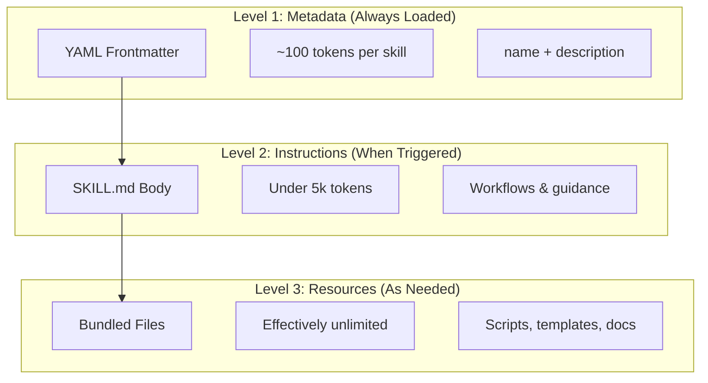
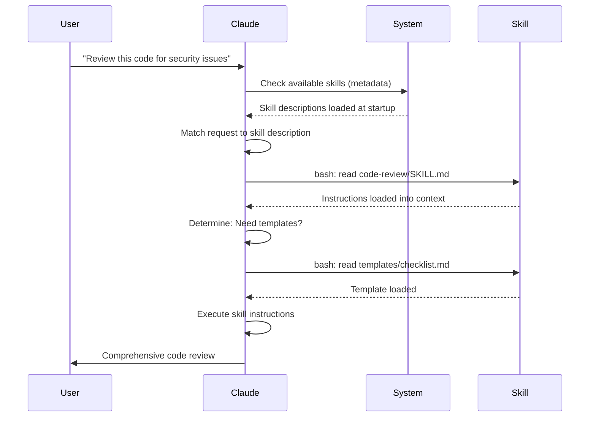

<picture>
  <source media="(prefers-color-scheme: dark)" srcset="../resources/logos/claude-howto-logo-dark.svg">
  
</picture>

# Agent Skills Guide

Agent Skills 是可复用、基于文件系统的能力模块，用于扩展 Claude 的功能。它把领域知识、工作流和最佳实践打包成可发现组件，让 Claude 在匹配场景下自动使用。

## Overview

**Agent Skills** 是一种模块化能力机制，可把通用 agent 转化为领域专家。与 prompts（单次对话级指令）不同，Skills 按需加载，避免你在多个会话中重复提供同样指引。

### Key Benefits

- **Specialize Claude**：为特定领域任务定制能力
- **Reduce repetition**：写一次，跨会话自动复用
- **Compose capabilities**：组合多个 Skills 构建复杂工作流
- **Scale workflows**：跨项目、跨团队共享流程
- **Maintain quality**：把最佳实践直接嵌入执行路径

Skills 遵循 [Agent Skills](https://agentskills.io) 开放标准，可用于多种 AI 工具。Claude Code 在标准之上扩展了调用控制、subagent 执行、动态上下文注入等能力。

> **Note**：自定义 slash commands 已并入 skills。`.claude/commands/` 仍可使用，并支持相同 frontmatter 字段。新开发建议使用 skills。若同名路径同时存在（如 `.claude/commands/review.md` 与 `.claude/skills/review/SKILL.md`），skill 优先。

## How Skills Work: Progressive Disclosure

Skills 采用 **progressive disclosure（渐进披露）** 架构：Claude 按需分阶段加载信息，而不是一次性吃满上下文。这样既节省上下文，又可无限扩展。

### Three Levels of Loading



| Level | When Loaded | Token Cost | Content |
|-------|------------|------------|---------|
| **Level 1: Metadata** | 始终（启动时） | 每个 skill 约 100 tokens | YAML frontmatter 的 `name` 与 `description` |
| **Level 2: Instructions** | skill 被触发时 | 小于 5k tokens | SKILL.md 主体说明与步骤 |
| **Level 3+: Resources** | 需要时 | 近似无限 | 通过 bash 执行/读取的附带文件（不提前进上下文） |

这意味着你可以安装很多 skills 而几乎不增加启动上下文成本——Claude 只在触发时才加载详细内容。

## Skill Loading Process



## Skill Types & Locations

| Type | Location | Scope | Shared | Best For |
|------|----------|-------|--------|----------|
| **Enterprise** | Managed settings | 全组织 | Yes | 组织级统一规范 |
| **Personal** | `~/.claude/skills/<skill-name>/SKILL.md` | 个人 | No | 个人工作流 |
| **Project** | `.claude/skills/<skill-name>/SKILL.md` | 团队 | Yes（通过 git） | 团队规范 |
| **Plugin** | `<plugin>/skills/<skill-name>/SKILL.md` | 插件启用范围 | Depends | 插件打包分发 |

同名 skill 冲突时按优先级：**enterprise > personal > project**。插件 skill 使用 `plugin-name:skill-name` 命名空间，因此不会冲突。

### Automatic Discovery

**嵌套目录发现**：当你在子目录工作时，Claude Code 会自动发现该子目录下的 `.claude/skills/`。例如编辑 `packages/frontend/` 内文件时，也会扫描 `packages/frontend/.claude/skills/`，非常适合 monorepo。

**`--add-dir` 目录**：通过 `--add-dir` 增加的目录中的 skills 也会自动加载，并支持实时变更生效，无需重启 Claude Code。

**Description budget**：Level 1 metadata（描述）预算上限为 **上下文窗口的 2%**（兜底 **16,000 字符**）。如果安装技能过多，部分可能被排除。可运行 `/context` 查看警告，并通过环境变量 `SLASH_COMMAND_TOOL_CHAR_BUDGET` 覆盖预算。

## Creating Custom Skills

### Basic Directory Structure

```text
my-skill/
├── SKILL.md           # 主指令（必需）
├── template.md        # 供 Claude 填充的模板
├── examples/
│   └── sample.md      # 期望输出示例
└── scripts/
    └── validate.sh    # Claude 可执行脚本
```

### SKILL.md Format

```yaml
---
name: your-skill-name
description: Brief description of what this Skill does and when to use it
---

# Your Skill Name

## Instructions
Provide clear, step-by-step guidance for Claude.

## Examples
Show concrete examples of using this Skill.
```

### Required Fields

- **name**：仅小写字母、数字、连字符（最长 64 字符）。不能包含 `anthropic` 或 `claude`。
- **description**：说明 skill 做什么 + 何时使用（最长 1024 字符）。这是 Claude 自动匹配触发的关键字段。

### Optional Frontmatter Fields

```yaml
---
name: my-skill
description: What this skill does and when to use it
argument-hint: "[filename] [format]"        # 自动补全提示
disable-model-invocation: true              # 仅用户可调用
user-invocable: false                       # 从 slash 菜单隐藏
allowed-tools: Read, Grep, Glob             # 工具白名单
model: opus                                 # 指定模型
effort: high                                # 覆盖 effort（low, medium, high, max）
context: fork                               # 在隔离 subagent 中运行
agent: Explore                              # 指定 agent 类型（需配合 context: fork）
shell: bash                                 # 命令 shell：bash（默认）或 powershell
hooks:                                      # skill 作用域 hooks
  PreToolUse:
    - matcher: "Bash"
      hooks:
        - type: command
          command: "./scripts/validate.sh"
---
```

| Field | Description |
|-------|-------------|
| `name` | 仅小写字母、数字、连字符（≤64）。不能含 `anthropic` 或 `claude`。 |
| `description` | 说明用途与触发时机（≤1024）。自动调用匹配核心字段。 |
| `argument-hint` | `/` 自动补全菜单中的参数提示（如 `"[filename] [format]"`）。 |
| `disable-model-invocation` | `true` = 仅用户可 `/name` 调用，Claude 不会自动触发。 |
| `user-invocable` | `false` = 从 `/` 菜单隐藏，仅 Claude 自动调用。 |
| `allowed-tools` | 该 skill 可免确认使用的工具列表（逗号分隔）。 |
| `model` | skill 运行期间模型覆盖（如 `opus`、`sonnet`）。 |
| `effort` | skill 运行期间 effort 覆盖：`low`、`medium`、`high`、`max`。 |
| `context` | `fork` 表示在独立 subagent context 运行。 |
| `agent` | `context: fork` 时的 subagent 类型（如 `Explore`、`Plan`、`general-purpose`）。 |
| `shell` | `!`command`` 与脚本执行 shell：`bash`（默认）或 `powershell`。 |
| `hooks` | skill 生命周期内生效的 hooks（格式同全局 hooks）。 |

## Skill Content Types

Skills 通常包含两类内容：

### Reference Content

为当前任务注入规范知识（约定、风格、领域规则等），以内联方式影响当前对话。

```yaml
---
name: api-conventions
description: API design patterns for this codebase
---

When writing API endpoints:
- Use RESTful naming conventions
- Return consistent error formats
- Include request validation
```

### Task Content

面向具体动作的步骤化指令，常通过 `/skill-name` 显式触发。

```yaml
---
name: deploy
description: Deploy the application to production
context: fork
disable-model-invocation: true
---

Deploy the application:
1. Run the test suite
2. Build the application
3. Push to the deployment target
```

## Controlling Skill Invocation

默认情况下，你和 Claude 都可以调用 skill。通过两个 frontmatter 字段组合出三种模式：

| Frontmatter | You can invoke | Claude can invoke |
|---|---|---|
| (default) | Yes | Yes |
| `disable-model-invocation: true` | Yes | No |
| `user-invocable: false` | No | Yes |

**`disable-model-invocation: true`** 适合有副作用的流程：如 `/commit`、`/deploy`、`/send-slack-message`，避免 Claude 自动触发高风险动作。

**`user-invocable: false`** 适合背景知识技能：如 `legacy-system-context` 仅用于补充系统背景，不适合作为用户命令。

## String Substitutions

Skills 支持在内容送入 Claude 前进行动态替换：

| Variable | Description |
|----------|-------------|
| `$ARGUMENTS` | 调用 skill 时传入的全部参数 |
| `$ARGUMENTS[N]` 或 `$N` | 获取指定位置参数（0-based） |
| `${CLAUDE_SESSION_ID}` | 当前会话 ID |
| `${CLAUDE_SKILL_DIR}` | skill 所在目录（SKILL.md 路径） |
| `` !`command` `` | 动态上下文注入：先执行 shell 命令并内联输出 |

**Example:**

```yaml
---
name: fix-issue
description: Fix a GitHub issue
---

Fix GitHub issue $ARGUMENTS following our coding standards.
1. Read the issue description
2. Implement the fix
3. Write tests
4. Create a commit
```

执行 `/fix-issue 123` 时，`$ARGUMENTS` 会被替换为 `123`。

## Injecting Dynamic Context

`` !`command` `` 语法会在 skill 内容发送给 Claude 前先执行命令：

```yaml
---
name: pr-summary
description: Summarize changes in a pull request
context: fork
agent: Explore
---

## Pull request context
- PR diff: !`gh pr diff`
- PR comments: !`gh pr view --comments`
- Changed files: !`gh pr diff --name-only`

## Your task
Summarize this pull request...
```

命令会立即执行；Claude 看到的是执行结果。默认 shell 为 `bash`，可在 frontmatter 指定 `shell: powershell`。

## Running Skills in Subagents

添加 `context: fork` 可让 skill 在隔离 subagent context 中运行。skill 内容会成为专属 subagent 任务，使用独立上下文窗口，不污染主会话。

`agent` 字段决定使用哪种 agent：

| Agent Type | Best For |
|---|---|
| `Explore` | 只读调研、代码库分析 |
| `Plan` | 生成实施计划 |
| `general-purpose` | 需要全工具的通用任务 |
| Custom agents | 你在配置中定义的专用 agents |

**Example frontmatter:**

```yaml
---
context: fork
agent: Explore
---
```

**Full skill example:**

```yaml
---
name: deep-research
description: Research a topic thoroughly
context: fork
agent: Explore
---

Research $ARGUMENTS thoroughly:
1. Find relevant files using Glob and Grep
2. Read and analyze the code
3. Summarize findings with specific file references
```

## Practical Examples

### Example 1: Code Review Skill

**Directory Structure:**

```text
~/.claude/skills/code-review/
├── SKILL.md
├── templates/
│   ├── review-checklist.md
│   └── finding-template.md
└── scripts/
    ├── analyze-metrics.py
    └── compare-complexity.py
```

**File:** `~/.claude/skills/code-review/SKILL.md`

```yaml
---
name: code-review-specialist
description: Comprehensive code review with security, performance, and quality analysis. Use when users ask to review code, analyze code quality, evaluate pull requests, or mention code review, security analysis, or performance optimization.
---

# Code Review Skill

This skill provides comprehensive code review capabilities focusing on:

1. **Security Analysis**
   - Authentication/authorization issues
   - Data exposure risks
   - Injection vulnerabilities
   - Cryptographic weaknesses

2. **Performance Review**
   - Algorithm efficiency (Big O analysis)
   - Memory optimization
   - Database query optimization
   - Caching opportunities

3. **Code Quality**
   - SOLID principles
   - Design patterns
   - Naming conventions
   - Test coverage

4. **Maintainability**
   - Code readability
   - Function size (should be < 50 lines)
   - Cyclomatic complexity
   - Type safety

## Review Template

For each piece of code reviewed, provide:

### Summary
- Overall quality assessment (1-5)
- Key findings count
- Recommended priority areas

### Critical Issues (if any)
- **Issue**: Clear description
- **Location**: File and line number
- **Impact**: Why this matters
- **Severity**: Critical/High/Medium
- **Fix**: Code example

For detailed checklists, see [templates/review-checklist.md](templates/review-checklist.md).
```

### Example 2: Codebase Visualizer Skill

生成交互式 HTML 代码树可视化：

**Directory Structure:**

```text
~/.claude/skills/codebase-visualizer/
├── SKILL.md
└── scripts/
    └── visualize.py
```

**File:** `~/.claude/skills/codebase-visualizer/SKILL.md`

```yaml
---
name: codebase-visualizer
description: Generate an interactive collapsible tree visualization of your codebase. Use when exploring a new repo, understanding project structure, or identifying large files.
allowed-tools: Bash(python *)
---

# Codebase Visualizer

Generate an interactive HTML tree view showing your project's file structure.

## Usage

Run the visualization script from your project root:

```bash
python ~/.claude/skills/codebase-visualizer/scripts/visualize.py .
```

This creates `codebase-map.html` and opens it in your default browser.

## What the visualization shows

- **Collapsible directories**: Click folders to expand/collapse
- **File sizes**: Displayed next to each file
- **Colors**: Different colors for different file types
- **Directory totals**: Shows aggregate size of each folder
```

这里由 Python 脚本做重活，Claude 负责编排。

### Example 3: Deploy Skill (User-Invoked Only)

```yaml
---
name: deploy
description: Deploy the application to production
disable-model-invocation: true
allowed-tools: Bash(npm *), Bash(git *)
---

Deploy $ARGUMENTS to production:

1. Run the test suite: `npm test`
2. Build the application: `npm run build`
3. Push to the deployment target
4. Verify the deployment succeeded
5. Report deployment status
```

### Example 4: Brand Voice Skill (Background Knowledge)

```yaml
---
name: brand-voice
description: Ensure all communication matches brand voice and tone guidelines. Use when creating marketing copy, customer communications, or public-facing content.
user-invocable: false
---

## Tone of Voice
- **Friendly but professional** - approachable without being casual
- **Clear and concise** - avoid jargon
- **Confident** - we know what we're doing
- **Empathetic** - understand user needs

## Writing Guidelines
- Use "you" when addressing readers
- Use active voice
- Keep sentences under 20 words
- Start with value proposition

For templates, see [templates/](templates/).
```

### Example 5: CLAUDE.md Generator Skill

```yaml
---
name: claude-md
description: Create or update CLAUDE.md files following best practices for optimal AI agent onboarding. Use when users mention CLAUDE.md, project documentation, or AI onboarding.
---

## Core Principles

**LLMs are stateless**: CLAUDE.md is the only file automatically included in every conversation.

### The Golden Rules

1. **Less is More**: Keep under 300 lines (ideally under 100)
2. **Universal Applicability**: Only include information relevant to EVERY session
3. **Don't Use Claude as a Linter**: Use deterministic tools instead
4. **Never Auto-Generate**: Craft it manually with careful consideration

## Essential Sections

- **Project Name**: Brief one-line description
- **Tech Stack**: Primary language, frameworks, database
- **Development Commands**: Install, test, build commands
- **Critical Conventions**: Only non-obvious, high-impact conventions
- **Known Issues / Gotchas**: Things that trip up developers
```

### Example 6: Refactoring Skill with Scripts

**Directory Structure:**

```text
refactor/
├── SKILL.md
├── references/
│   ├── code-smells.md
│   └── refactoring-catalog.md
├── templates/
│   └── refactoring-plan.md
└── scripts/
    ├── analyze-complexity.py
    └── detect-smells.py
```

**File:** `refactor/SKILL.md`

```yaml
---
name: code-refactor
description: Systematic code refactoring based on Martin Fowler's methodology. Use when users ask to refactor code, improve code structure, reduce technical debt, or eliminate code smells.
---

# Code Refactoring Skill

A phased approach emphasizing safe, incremental changes backed by tests.

## Workflow

Phase 1: Research & Analysis → Phase 2: Test Coverage Assessment →
Phase 3: Code Smell Identification → Phase 4: Refactoring Plan Creation →
Phase 5: Incremental Implementation → Phase 6: Review & Iteration

## Core Principles

1. **Behavior Preservation**: External behavior must remain unchanged
2. **Small Steps**: Make tiny, testable changes
3. **Test-Driven**: Tests are the safety net
4. **Continuous**: Refactoring is ongoing, not a one-time event

For code smell catalog, see [references/code-smells.md](references/code-smells.md).
For refactoring techniques, see [references/refactoring-catalog.md](references/refactoring-catalog.md).
```

## Supporting Files

除 `SKILL.md` 外，skill 目录可包含多种支持文件（模板、示例、脚本、参考文档）。这样可让主文件保持聚焦，而附加资源在需要时再加载。

```text
my-skill/
├── SKILL.md              # 主指令（必须，建议 < 500 行）
├── templates/            # 供 Claude 填充的模板
│   └── output-format.md
├── examples/             # 期望输出示例
│   └── sample-output.md
├── references/           # 领域知识与规范
│   └── api-spec.md
└── scripts/              # Claude 可执行脚本
    └── validate.sh
```

支持文件建议：

- `SKILL.md` 保持在 **500 行以内**。详尽参考资料、大示例、规格文档迁移到独立文件。
- 在 `SKILL.md` 中使用**相对路径**引用其他文件（如 `[API reference](references/api-spec.md)`）。
- 支持文件属于 Level 3 按需加载，不会在未读取时消耗上下文。

## Managing Skills

### Viewing Available Skills

直接询问 Claude：

```text
What Skills are available?
```

或在文件系统查看：

```bash
# List personal Skills
ls ~/.claude/skills/

# List project Skills
ls .claude/skills/
```

### Testing a Skill

两种方式：

**自动触发**：提问内容匹配 description。

```text
Can you help me review this code for security issues?
```

**显式触发**：直接调用 skill 名。

```text
/code-review src/auth/login.ts
```

### Updating a Skill

直接编辑 `SKILL.md`，下次 Claude Code 启动时生效。

```bash
# Personal Skill
code ~/.claude/skills/my-skill/SKILL.md

# Project Skill
code .claude/skills/my-skill/SKILL.md
```

### Restricting Claude's Skill Access

控制 Claude 可调用 skills 的三种方式：

**在 `/permissions` 禁用全部 skills**：

```text
# Add to deny rules:
Skill
```

**允许/拒绝指定 skills**：

```text
# Allow only specific skills
Skill(commit)
Skill(review-pr *)

# Deny specific skills
Skill(deploy *)
```

**隐藏单个 skill**：在 frontmatter 加 `disable-model-invocation: true`。

## Best Practices

### 1. Make Descriptions Specific

- **Bad（模糊）**：`Helps with documents`
- **Good（具体）**：`Extract text and tables from PDF files...`（明确能力 + 触发场景）

### 2. Keep Skills Focused

- 一个 skill 对应一个能力
- ✅ `PDF form filling`
- ❌ `Document processing`（过于宽泛）

### 3. Include Trigger Terms

在 description 中加入用户自然会说的关键词：

```yaml
description: Analyze Excel spreadsheets, generate pivot tables, create charts. Use when working with Excel files, spreadsheets, or .xlsx files.
```

### 4. Keep SKILL.md Under 500 Lines

细节资料拆到独立文件，按需加载。

### 5. Reference Supporting Files

```markdown
## Additional resources

- For complete API details, see [reference.md](reference.md)
- For usage examples, see [examples.md](examples.md)
```

### Do's

- 使用清晰、可辨识命名
- 指令足够完整
- 给出具体示例
- 打包脚本与模板
- 用真实场景测试
- 记录依赖

### Don'ts

- 不要为一次性任务建 skill
- 不要重复已有能力
- 不要把 skill 做得太泛
- 不要省略 description
- 不要在未审计情况下安装不可信来源 skills

## Troubleshooting

### Quick Reference

| Issue | Solution |
|-------|----------|
| Claude 不触发 skill | 让 description 更具体并加入触发词 |
| Skill 文件找不到 | 检查路径：`~/.claude/skills/name/SKILL.md` |
| YAML 报错 | 检查 `---`、缩进、禁用 tab |
| Skills 冲突 | 在 description 中使用更区分的触发词 |
| 脚本不执行 | 检查权限：`chmod +x scripts/*.py` |
| Claude 看不到全部 skills | 技能过多，运行 `/context` 看警告 |

### Skill Not Triggering

若预期未触发：

1. 检查 description 是否包含用户常见表达
2. 问 Claude “What skills are available?” 确认已加载
3. 重新表述请求，贴近 description
4. 用 `/skill-name` 直接触发验证

### Skill Triggers Too Often

若触发过于频繁：

1. 把 description 写得更具体
2. 加 `disable-model-invocation: true` 改为仅手动调用

### Claude Doesn't See All Skills

skill 描述加载预算是 **上下文窗口的 2%**（兜底 **16,000 字符**）。运行 `/context` 查看是否有 excluded warnings。可通过 `SLASH_COMMAND_TOOL_CHAR_BUDGET` 覆盖预算。

## Security Considerations

**仅使用可信来源的 Skills。** Skill 通过“指令 + 可执行资源”赋予 Claude 能力，恶意 skill 可诱导调用危险工具或执行危险代码。

**核心安全建议：**

- **全面审计**：检查 skill 目录全部文件
- **外部拉取高风险**：依赖外部 URL 可能被污染
- **工具滥用风险**：恶意 skill 可引导危险工具链
- **按安装软件标准对待**：仅使用可信来源

## Skills vs Other Features

| Feature | Invocation | Best For |
|---------|------------|----------|
| **Skills** | 自动或 `/name` | 可复用专业能力、工作流 |
| **Slash Commands** | 用户手动 `/name` | 快捷动作（已并入 skills） |
| **Subagents** | 自动委派 | 隔离上下文执行任务 |
| **Memory (CLAUDE.md)** | 始终加载 | 持久项目上下文 |
| **MCP** | 实时查询 | 外部数据/服务接入 |
| **Hooks** | 事件触发 | 自动化副作用执行 |

## Bundled Skills

Claude Code 自带若干开箱可用技能，无需安装：

| Skill | Description |
|-------|-------------|
| `/simplify` | 审查已改文件的复用性、质量与效率；并行拉起 3 个 review agents |
| `/batch <instruction>` | 基于 git worktrees 编排大规模并行修改 |
| `/debug [description]` | 读取 debug log 并排查当前会话问题 |
| `/loop [interval] <prompt>` | 按时间间隔重复执行 prompt（如 `/loop 5m check the deploy`） |
| `/claude-api` | 加载 Claude API/SDK 文档；检测 `anthropic`/`@anthropic-ai/sdk` 导入时可自动触发 |

这些内置 skills 与自定义 skills 使用相同 SKILL.md 格式。

## Sharing Skills

### Project Skills（团队共享）

1. 在 `.claude/skills/` 创建 skill
2. 提交到 git
3. 团队成员 pull 后即可使用

### Personal Skills

```bash
# 复制到个人目录
cp -r my-skill ~/.claude/skills/

# 赋予脚本执行权限
chmod +x ~/.claude/skills/my-skill/scripts/*.py
```

### Plugin Distribution

可将 skills 打包在 plugin 的 `skills/` 目录进行分发。

## Going Further: A Skill Collection and a Skill Manager

当你开始系统化构建 skills 时，两个东西非常关键：成熟 skill 库 + 管理工具。

**[luongnv89/skills](https://github.com/luongnv89/skills)** —— 一套可直接复用的技能集合，覆盖大量真实项目场景。比如 `logo-designer`（动态生成项目 logo）和 `ollama-optimizer`（按硬件调优本地 LLM）。

**[luongnv89/asm](https://github.com/luongnv89/asm)** —— Agent Skill Manager。用于 skill 开发、重复检测与测试。`asm link` 让你在任意项目中测试 skill，无需来回复制文件。

## Additional Resources

- [Official Skills Documentation](https://code.claude.com/docs/en/skills)
- [Agent Skills Architecture Blog](https://claude.com/blog/equipping-agents-for-the-real-world-with-agent-skills)
- [Skills Repository](https://github.com/luongnv89/skills) - 可直接使用的技能集合
- [Slash Commands Guide](../01-slash-commands/) - 用户触发快捷命令
- [Subagents Guide](../04-subagents/) - 委派式 AI agents
- [Memory Guide](../02-memory/) - 持久上下文
- [MCP (Model Context Protocol)](../05-mcp/) - 实时外部数据
- [Hooks Guide](../06-hooks/) - 事件驱动自动化
