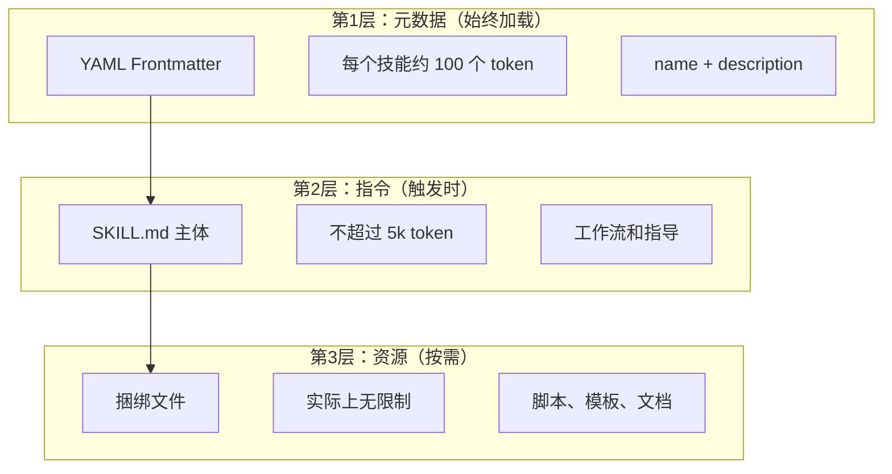
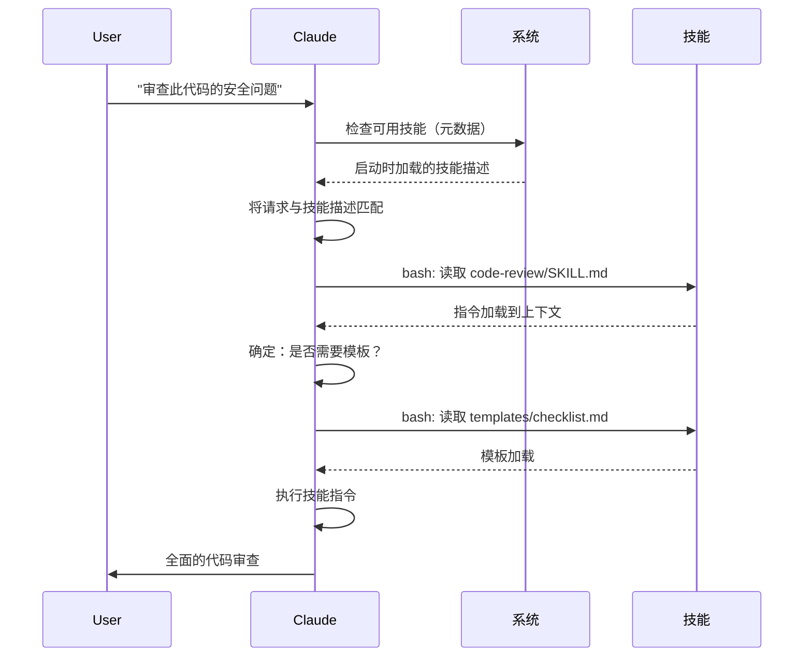

<picture>
  <source media="(prefers-color-scheme: dark)" srcset="../resources/logos/claude-howto-logo-dark.svg">
  
</picture>

# 代理技能指南

代理技能是可复用的、基于文件系统的能力，可扩展 Claude 的功能。它们将领域专属的专业知识、工作流和最佳实践打包成可发现的组件，Claude 在相关时会自动使用。

## 概述

**代理技能**是将通用代理转变为专家的模块化能力。与提示词（针对一次性任务的对话级指令）不同，技能按需加载，无需在多次对话中重复提供相同的指导。

### 主要优势

- **专业化 Claude**：针对领域特定任务定制能力
- **减少重复**：创建一次，跨对话自动使用
- **组合能力**：组合技能构建复杂工作流
- **扩展工作流**：在多个项目和团队中复用技能
- **保持质量**：将最佳实践直接嵌入工作流

技能遵循 [Agent Skills](https://agentskills.io) 开放标准，可跨多个 AI 工具使用。Claude Code 通过调用控制、子代理执行和动态上下文注入等附加功能对该标准进行了扩展。

> **注意**：自定义斜杠命令已合并到技能中。`.claude/commands/` 文件仍然有效，并支持相同的 frontmatter 字段。建议新开发使用技能。当相同路径（例如 `.claude/commands/review.md` 和 `.claude/skills/review/SKILL.md`）都存在时，技能优先。

## 技能的工作原理：渐进式披露

技能利用**渐进式披露**架构——Claude 根据需要分阶段加载信息，而不是预先占用上下文。这实现了高效的上下文管理，同时保持无限可扩展性。

### 三层加载



| 层级 | 加载时机 | Token 成本 | 内容 |
|------|---------|-----------|------|
| **第1层：元数据** | 始终（启动时） | 每个技能约 100 token | YAML frontmatter 中的 `name` 和 `description` |
| **第2层：指令** | 触发技能时 | 不超过 5k token | SKILL.md 主体，包含指令和指导 |
| **第3层+：资源** | 按需 | 实际上无限制 | 通过 bash 执行的捆绑文件，不将内容加载到上下文 |

这意味着您可以安装许多技能而不占用上下文——在实际触发之前，Claude 只知道每个技能存在及何时使用它。

## 技能加载过程



## 技能类型和位置

| 类型 | 位置 | 范围 | 共享 | 最适合 |
|------|------|------|------|--------|
| **企业级** | 托管设置 | 所有组织用户 | 是 | 组织范围标准 |
| **个人** | `~/.claude/skills/<skill-name>/SKILL.md` | 个人 | 否 | 个人工作流 |
| **项目** | `.claude/skills/<skill-name>/SKILL.md` | 团队 | 是（通过 git） | 团队标准 |
| **插件** | `<plugin>/skills/<skill-name>/SKILL.md` | 启用位置 | 取决于情况 | 与插件捆绑 |

当不同层级的技能共享相同名称时，优先级较高的位置优先：**企业 > 个人 > 项目**。插件技能使用 `plugin-name:skill-name` 命名空间，因此不会产生冲突。

### 自动发现

**嵌套目录**：当您处理子目录中的文件时，Claude Code 会自动发现嵌套 `.claude/skills/` 目录中的技能。例如，如果您在 `packages/frontend/` 中编辑文件，Claude Code 还会在 `packages/frontend/.claude/skills/` 中查找技能。这支持各包有自己技能的 monorepo 设置。

**`--add-dir` 目录**：通过 `--add-dir` 添加的目录中的技能会自动加载，并支持实时变更检测。对这些目录中技能文件的任何编辑都会立即生效，无需重启 Claude Code。

**描述预算**：技能描述（第1层元数据）上限为**上下文窗口的 2%**（回退：**16,000 个字符**）。如果安装了许多技能，部分可能被排除。运行 `/context` 查看警告。使用 `SLASH_COMMAND_TOOL_CHAR_BUDGET` 环境变量覆盖预算。

## 创建自定义技能

### 基本目录结构

```
my-skill/
├── SKILL.md           # 主要指令（必需）
├── template.md        # Claude 要填写的模板
├── examples/
│   └── sample.md      # 显示预期格式的示例输出
└── scripts/
    └── validate.sh    # Claude 可以执行的脚本
```

### SKILL.md 格式

```yaml
---
name: your-skill-name
description: 对此技能功能及何时使用的简短描述
---

# 您的技能名称

## 指令
为 Claude 提供清晰、逐步的指导。

## 示例
展示使用此技能的具体示例。
```

### 必需字段

- **name**：仅小写字母、数字、连字符（最多 64 个字符）。不能包含 "anthropic" 或 "claude"。
- **description**：技能的功能及何时使用（最多 1024 个字符）。这对 Claude 知道何时激活技能至关重要。

### 可选 Frontmatter 字段

```yaml
---
name: my-skill
description: 技能功能及何时使用
argument-hint: "[filename] [format]"        # 自动补全提示
disable-model-invocation: true              # 只有用户可以调用
user-invocable: false                       # 从斜杠菜单隐藏
allowed-tools: Read, Grep, Glob             # 限制工具访问
model: opus                                 # 使用特定模型
effort: high                                # 努力程度覆盖（low、medium、high、max）
context: fork                               # 在隔离子代理中运行
agent: Explore                              # 代理类型（与 context: fork 一起使用）
shell: bash                                 # 命令的 shell：bash（默认）或 powershell
hooks:                                      # 技能范围的钩子
  PreToolUse:
    - matcher: "Bash"
      hooks:
        - type: command
          command: "./scripts/validate.sh"
---
```

| 字段 | 描述 |
|------|------|
| `name` | 仅小写字母、数字、连字符（最多 64 字符）。不能包含 "anthropic" 或 "claude"。 |
| `description` | 技能的功能及何时使用（最多 1024 字符）。对自动调用匹配至关重要。 |
| `argument-hint` | 在 `/` 自动补全菜单中显示的提示（例如 `"[filename] [format]"`）。 |
| `disable-model-invocation` | `true` = 只有用户可以通过 `/name` 调用。Claude 永远不会自动调用。 |
| `user-invocable` | `false` = 从 `/` 菜单隐藏。只有 Claude 可以自动调用。 |
| `allowed-tools` | 技能可使用而无需权限提示的工具列表（逗号分隔）。 |
| `model` | 技能激活时的模型覆盖（例如 `opus`、`sonnet`）。 |
| `effort` | 技能激活时的努力程度覆盖：`low`、`medium`、`high` 或 `max`。 |
| `context` | `fork` 在具有独立上下文窗口的分叉子代理上下文中运行技能。 |
| `agent` | `context: fork` 时的子代理类型（例如 `Explore`、`Plan`、`general-purpose`）。 |
| `shell` | 用于 `!`command`` 替换和脚本的 shell：`bash`（默认）或 `powershell`。 |
| `hooks` | 限定于该技能生命周期的钩子（格式与全局钩子相同）。 |

## 技能内容类型

技能可以包含两种类型的内容，各适用于不同目的：

### 参考内容

添加 Claude 应用于当前工作的知识——约定、模式、风格指南、领域知识。与对话上下文内联运行。

```yaml
---
name: api-conventions
description: 此代码库的 API 设计模式
---

编写 API 端点时：
- 使用 RESTful 命名约定
- 返回一致的错误格式
- 包含请求验证
```

### 任务内容

特定操作的逐步指令。通常通过 `/skill-name` 直接调用。

```yaml
---
name: deploy
description: 将应用程序部署到生产环境
context: fork
disable-model-invocation: true
---

部署应用程序：
1. 运行测试套件
2. 构建应用程序
3. 推送到部署目标
```

## 控制技能调用

默认情况下，您和 Claude 都可以调用任何技能。两个 frontmatter 字段控制三种调用模式：

| Frontmatter | 您可以调用 | Claude 可以调用 |
|---|---|---|
| （默认） | 是 | 是 |
| `disable-model-invocation: true` | 是 | 否 |
| `user-invocable: false` | 否 | 是 |

**使用 `disable-model-invocation: true`** 用于有副作用的工作流：`/commit`、`/deploy`、`/send-slack-message`。您不希望 Claude 因为代码看起来准备好了就决定部署。

**使用 `user-invocable: false`** 用于不可操作为命令的背景知识。`legacy-system-context` 技能解释旧系统如何工作——对 Claude 有用，但对用户来说不是有意义的操作。

## 字符串替换

技能支持在技能内容到达 Claude 之前解析的动态值：

| 变量 | 描述 |
|------|------|
| `$ARGUMENTS` | 调用技能时传递的所有参数 |
| `$ARGUMENTS[N]` 或 `$N` | 按索引（从0开始）访问特定参数 |
| `${CLAUDE_SESSION_ID}` | 当前会话 ID |
| `${CLAUDE_SKILL_DIR}` | 包含技能 SKILL.md 文件的目录 |
| `` !`command` `` | 动态上下文注入——运行 shell 命令并内联输出 |

**示例：**

```yaml
---
name: fix-issue
description: 修复 GitHub Issue
---

按照我们的编码标准修复 GitHub issue $ARGUMENTS。
1. 读取 issue 描述
2. 实现修复
3. 编写测试
4. 创建提交
```

运行 `/fix-issue 123` 将 `$ARGUMENTS` 替换为 "123"。

## 注入动态上下文

`` !`command` `` 语法在技能内容发送到 Claude 之前运行 shell 命令：

```yaml
---
name: pr-summary
description: 汇总 pull request 中的变更
context: fork
agent: Explore
---

## Pull request 上下文
- PR 差异：!`gh pr diff`
- PR 评论：!`gh pr view --comments`
- 变更文件：!`gh pr diff --name-only`

## 您的任务
汇总此 pull request...
```

命令立即执行；Claude 只看到最终输出。默认情况下，命令在 `bash` 中运行。在 frontmatter 中设置 `shell: powershell` 改用 PowerShell。

## 在子代理中运行技能

添加 `context: fork` 以在隔离的子代理上下文中运行技能。技能内容成为具有独立上下文窗口的专用子代理的任务，保持主对话简洁。

`agent` 字段指定使用哪种代理类型：

| 代理类型 | 最适合 |
|---|---|
| `Explore` | 只读研究、代码库分析 |
| `Plan` | 创建实施计划 |
| `general-purpose` | 需要所有工具的广泛任务 |
| 自定义代理 | 配置中定义的专用代理 |

**示例 frontmatter：**

```yaml
---
context: fork
agent: Explore
---
```

**完整技能示例：**

```yaml
---
name: deep-research
description: 深入研究一个主题
context: fork
agent: Explore
---

深入研究 $ARGUMENTS：
1. 使用 Glob 和 Grep 查找相关文件
2. 阅读和分析代码
3. 用特定文件引用汇总发现
```

## 实际示例

### 示例 1：代码审查技能

**目录结构：**

```
~/.claude/skills/code-review/
├── SKILL.md
├── templates/
│   ├── review-checklist.md
│   └── finding-template.md
└── scripts/
    ├── analyze-metrics.py
    └── compare-complexity.py
```

**文件：** `~/.claude/skills/code-review/SKILL.md`

```yaml
---
name: code-review-specialist
description: 全面的代码审查，包含安全、性能和质量分析。当用户要求审查代码、分析代码质量、评估 pull request，或提到代码审查、安全分析或性能优化时使用。
---

# 代码审查技能

此技能提供全面的代码审查能力，重点关注：

1. **安全分析**
   - 认证/授权问题
   - 数据暴露风险
   - 注入漏洞
   - 加密弱点

2. **性能审查**
   - 算法效率（大 O 分析）
   - 内存优化
   - 数据库查询优化
   - 缓存机会

3. **代码质量**
   - SOLID 原则
   - 设计模式
   - 命名约定
   - 测试覆盖率

4. **可维护性**
   - 代码可读性
   - 函数大小（应 < 50 行）
   - 圈复杂度
   - 类型安全

## 审查模板

对于每段被审查的代码，提供：

### 摘要
- 整体质量评估（1-5）
- 关键发现数量
- 推荐优先处理的领域

### 严重问题（如有）
- **问题**：清晰描述
- **位置**：文件和行号
- **影响**：为什么重要
- **严重性**：严重/高/中
- **修复**：代码示例

有关详细清单，请参见 [templates/review-checklist.md](templates/review-checklist.md)。
```

### 示例 2：代码库可视化技能

生成交互式 HTML 可视化的技能：

**目录结构：**

```
~/.claude/skills/codebase-visualizer/
├── SKILL.md
└── scripts/
    └── visualize.py
```

**文件：** `~/.claude/skills/codebase-visualizer/SKILL.md`

```yaml
---
name: codebase-visualizer
description: 生成代码库的交互式可折叠树形可视化。在探索新 repo、了解项目结构或识别大文件时使用。
allowed-tools: Bash(python *)
---

# 代码库可视化器

生成显示项目文件结构的交互式 HTML 树形视图。

## 用法

从项目根目录运行可视化脚本：

```bash
python ~/.claude/skills/codebase-visualizer/scripts/visualize.py .
```

这将创建 `codebase-map.html` 并在默认浏览器中打开。

## 可视化内容

- **可折叠目录**：点击文件夹展开/折叠
- **文件大小**：显示在每个文件旁边
- **颜色**：不同文件类型使用不同颜色
- **目录总计**：显示每个文件夹的聚合大小
```

捆绑的 Python 脚本完成繁重工作，Claude 处理编排。

### 示例 3：部署技能（仅用户调用）

```yaml
---
name: deploy
description: 将应用程序部署到生产环境
disable-model-invocation: true
allowed-tools: Bash(npm *), Bash(git *)
---

将 $ARGUMENTS 部署到生产环境：

1. 运行测试套件：`npm test`
2. 构建应用程序：`npm run build`
3. 推送到部署目标
4. 验证部署成功
5. 报告部署状态
```

### 示例 4：品牌声音技能（背景知识）

```yaml
---
name: brand-voice
description: 确保所有沟通符合品牌声音和语气指南。在创建营销文案、客户沟通或公开内容时使用。
user-invocable: false
---

## 语气
- **友好而专业** - 平易近人但不随意
- **清晰简洁** - 避免行话
- **自信** - 我们知道我们在做什么
- **有同理心** - 理解用户需求

## 写作指南
- 称呼读者时使用"您"
- 使用主动语态
- 句子保持在 20 词以内
- 从价值主张开始

有关模板，请参见 [templates/](templates/)。
```

### 示例 5：CLAUDE.md 生成器技能

```yaml
---
name: claude-md
description: 遵循最佳实践创建或更新 CLAUDE.md 文件，以实现最佳 AI 代理入门。当用户提到 CLAUDE.md、项目文档或 AI 入门时使用。
---

## 核心原则

**LLM 是无状态的**：CLAUDE.md 是每次对话中自动包含的唯一文件。

### 黄金法则

1. **少即是多**：保持在 300 行以内（理想情况下 100 行以内）
2. **普遍适用性**：只包含与每次会话相关的信息
3. **不要将 Claude 用作 Linter**：改用确定性工具
4. **永远不要自动生成**：需要仔细考量，手动编写

## 必要章节

- **项目名称**：简短的一行描述
- **技术栈**：主要语言、框架、数据库
- **开发命令**：安装、测试、构建命令
- **关键约定**：只有非显而易见的、高影响的约定
- **已知问题/注意事项**：持续困扰开发者的问题
```

### 示例 6：带脚本的重构技能

**目录结构：**

```
refactor/
├── SKILL.md
├── references/
│   ├── code-smells.md
│   └── refactoring-catalog.md
├── templates/
│   └── refactoring-plan.md
└── scripts/
    ├── analyze-complexity.py
    └── detect-smells.py
```

**文件：** `refactor/SKILL.md`

```yaml
---
name: code-refactor
description: 基于 Martin Fowler 方法论的系统性代码重构。当用户要求重构代码、改善代码结构、减少技术债务或消除代码异味时使用。
---

# 代码重构技能

基于测试的安全、增量变更的分阶段方法。

## 工作流

第1阶段：研究与分析 → 第2阶段：测试覆盖率评估 →
第3阶段：代码异味识别 → 第4阶段：重构计划创建 →
第5阶段：增量实施 → 第6阶段：审查与迭代

## 核心原则

1. **行为保留**：外部行为必须保持不变
2. **小步推进**：做微小的、可测试的变更
3. **测试驱动**：测试是安全网
4. **持续进行**：重构是持续的过程，而非一次性事件

有关代码异味目录，请参见 [references/code-smells.md](references/code-smells.md)。
有关重构技术，请参见 [references/refactoring-catalog.md](references/refactoring-catalog.md)。
```

## 支持文件

技能可以在其目录中包含 `SKILL.md` 之外的多个文件。这些支持文件（模板、示例、脚本、参考文档）让您保持主技能文件专注，同时为 Claude 提供可按需加载的额外资源。

```
my-skill/
├── SKILL.md              # 主要指令（必需，保持在 500 行以内）
├── templates/            # Claude 要填写的模板
│   └── output-format.md
├── examples/             # 显示预期格式的示例输出
│   └── sample-output.md
├── references/           # 领域知识和规范
│   └── api-spec.md
└── scripts/              # Claude 可以执行的脚本
    └── validate.sh
```

支持文件的指南：

- 将 `SKILL.md` 保持在 **500 行**以内。将详细的参考材料、大型示例和规范移到单独的文件中。
- 从 `SKILL.md` 使用**相对路径**引用其他文件（例如 `[API 参考](references/api-spec.md)`）。
- 支持文件在第3层（按需）加载，因此在 Claude 实际读取之前不会占用上下文。

## 管理技能

### 查看可用技能

直接询问 Claude：
```
有哪些技能可用？
```

或检查文件系统：
```bash
# 列出个人技能
ls ~/.claude/skills/

# 列出项目技能
ls .claude/skills/
```

### 测试技能

两种测试方式：

**让 Claude 通过匹配描述的内容自动调用：**
```
您能帮我审查此代码的安全问题吗？
```

**或通过技能名称直接调用：**
```
/code-review src/auth/login.ts
```

### 更新技能

直接编辑 `SKILL.md` 文件。变更在下次 Claude Code 启动时生效。

```bash
# 个人技能
code ~/.claude/skills/my-skill/SKILL.md

# 项目技能
code .claude/skills/my-skill/SKILL.md
```

### 限制 Claude 的技能访问

三种控制 Claude 可以调用哪些技能的方式：

**在 `/permissions` 中禁用所有技能：**
```
# 添加到拒绝规则：
Skill
```

**允许或拒绝特定技能：**
```
# 只允许特定技能
Skill(commit)
Skill(review-pr *)

# 拒绝特定技能
Skill(deploy *)
```

**通过在 frontmatter 中添加 `disable-model-invocation: true` 隐藏单个技能。**

## 最佳实践

### 1. 使描述具体

- **差（模糊）**："帮助处理文档"
- **好（具体）**："从 PDF 文件中提取文本和表格，填写表单，合并文档。在处理 PDF 文件或用户提到 PDF、表单或文档提取时使用。"

### 2. 保持技能专注

- 一个技能 = 一种能力
- ✅ "PDF 表单填写"
- ❌ "文档处理"（太宽泛）

### 3. 包含触发词

在描述中添加与用户请求匹配的关键词：
```yaml
description: 分析 Excel 电子表格，生成数据透视表，创建图表。在处理 Excel 文件、电子表格或 .xlsx 文件时使用。
```

### 4. 将 SKILL.md 保持在 500 行以内

将详细的参考材料移至按需加载的单独文件。

### 5. 引用支持文件

```markdown
## 额外资源

- 有关完整 API 详情，请参见 [reference.md](reference.md)
- 有关使用示例，请参见 [examples.md](examples.md)
```

### 应该做

- 使用清晰、描述性的名称
- 包含全面的指令
- 添加具体示例
- 打包相关脚本和模板
- 用真实场景测试
- 记录依赖项

### 不应该做

- 不要为一次性任务创建技能
- 不要重复现有功能
- 不要使技能过于宽泛
- 不要跳过描述字段
- 不要安装来自不可信来源的技能而不审查

## 故障排除

### 快速参考

| 问题 | 解决方案 |
|------|---------|
| Claude 不使用技能 | 使用触发词使描述更具体 |
| 技能文件未找到 | 验证路径：`~/.claude/skills/name/SKILL.md` |
| YAML 错误 | 检查 `---` 标记、缩进、无制表符 |
| 技能冲突 | 在描述中使用不同的触发词 |
| 脚本未运行 | 检查权限：`chmod +x scripts/*.py` |
| Claude 看不到所有技能 | 技能太多；检查 `/context` 中的警告 |

### 技能不触发

如果 Claude 在预期时不使用您的技能：

1. 检查描述是否包含用户自然会说的关键词
2. 询问"有哪些技能可用？"验证技能是否出现
3. 尝试重新表述您的请求以匹配描述
4. 使用 `/skill-name` 直接调用进行测试

### 技能触发太频繁

如果 Claude 在您不想要的时候使用技能：

1. 使描述更具体
2. 添加 `disable-model-invocation: true` 仅限手动调用

### Claude 看不到所有技能

技能描述以**上下文窗口的 2%**（回退：**16,000 个字符**）加载。运行 `/context` 查看有关被排除技能的警告。使用 `SLASH_COMMAND_TOOL_CHAR_BUDGET` 环境变量覆盖预算。

## 安全注意事项

**只使用来自可信来源的技能。** 技能通过指令和代码为 Claude 提供能力——恶意技能可以指示 Claude 以有害方式调用工具或执行代码。

**关键安全注意事项：**

- **彻底审查**：审查技能目录中的所有文件
- **外部来源有风险**：从外部 URL 获取的技能可能被入侵
- **工具滥用**：恶意技能可以以有害方式调用工具
- **像安装软件一样对待**：只使用来自可信来源的技能

## 技能与其他功能

| 功能 | 调用 | 最适合 |
|------|------|--------|
| **技能** | 自动或 `/name` | 可复用的专业知识、工作流 |
| **斜杠命令** | 用户发起 `/name` | 快速快捷方式（已合并到技能） |
| **子代理** | 自动委托 | 隔离任务执行 |
| **内存（CLAUDE.md）** | 始终加载 | 持久项目上下文 |
| **MCP** | 实时 | 外部数据/服务访问 |
| **钩子** | 事件驱动 | 自动化副作用 |

## 捆绑技能

Claude Code 附带几个始终可用的内置技能，无需安装：

| 技能 | 描述 |
|------|------|
| `/simplify` | 审查变更文件的复用、质量和效率；生成 3 个并行审查代理 |
| `/batch <instruction>` | 使用 git worktree 在代码库中编排大规模并行变更 |
| `/debug [description]` | 通过读取调试日志排除当前会话故障 |
| `/loop [interval] <prompt>` | 按间隔重复运行提示词（例如 `/loop 5m check the deploy`） |
| `/claude-api` | 加载 Claude API/SDK 参考；在 `anthropic`/`@anthropic-ai/sdk` 导入时自动激活 |

这些技能开箱即用，无需安装或配置。它们遵循与自定义技能相同的 SKILL.md 格式。

## 共享技能

### 项目技能（团队共享）

1. 在 `.claude/skills/` 中创建技能
2. 提交到 git
3. 团队成员拉取变更——技能立即可用

### 个人技能

```bash
# 复制到个人目录
cp -r my-skill ~/.claude/skills/

# 使脚本可执行
chmod +x ~/.claude/skills/my-skill/scripts/*.py
```

### 插件分发

将技能打包在插件的 `skills/` 目录中以进行更广泛的分发。

## 进一步探索：技能集合和技能管理器

一旦您认真开始构建技能，两件事变得至关重要：一个经过验证的技能库和一个管理它们的工具。

**[luongnv89/skills](https://github.com/luongnv89/skills)** — 我在几乎所有项目中每天使用的技能集合。亮点包括 `logo-designer`（即时生成项目徽标）和 `ollama-optimizer`（为您的硬件调整本地 LLM 性能）。如果您想要开箱即用的技能，这是很好的起点。

**[luongnv89/asm](https://github.com/luongnv89/asm)** — 代理技能管理器。处理技能开发、重复检测和测试。`asm link` 命令让您在任何项目中测试技能，而无需复制文件——一旦您有超过少数技能，这是必不可少的。

## 额外资源

- [官方技能文档](https://code.claude.com/docs/en/skills)
- [代理技能架构博客](https://claude.com/blog/equipping-agents-for-the-real-world-with-agent-skills)
- [技能仓库](https://github.com/luongnv89/skills) - 即用型技能集合
- [斜杠命令指南](../01-slash-commands/) - 用户发起的快捷方式
- [子代理指南](../04-subagents/) - 委托的 AI 代理
- [内存指南](../02-memory/) - 持久上下文
- [MCP（模型上下文协议）](../05-mcp/) - 实时外部数据
- [钩子指南](../06-hooks/) - 事件驱动的自动化
