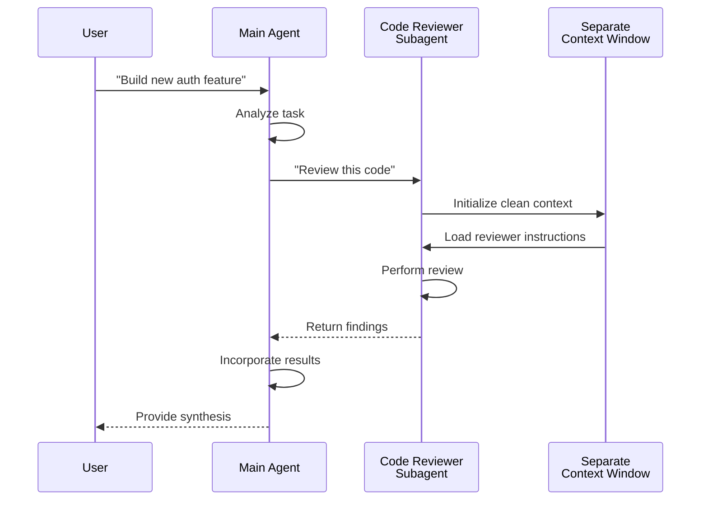
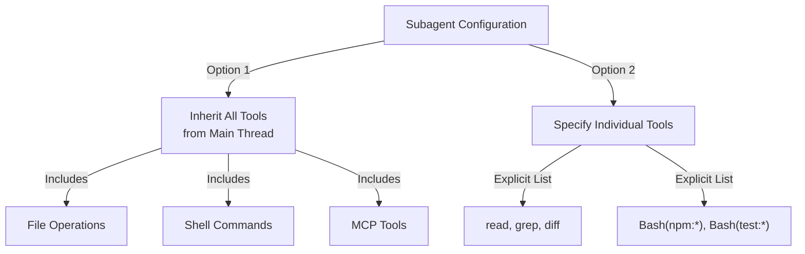
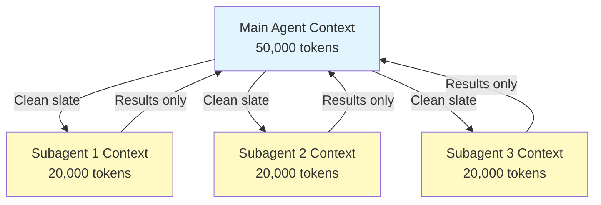
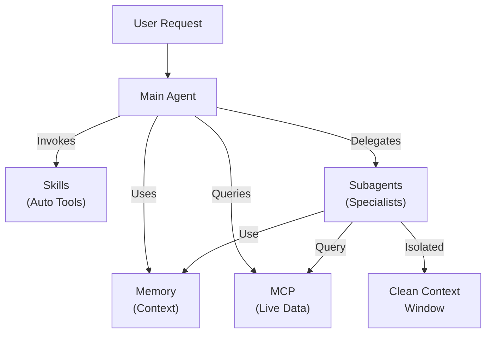

# Subagents - Complete Reference Guide

Subagents are specialized AI assistants with isolated context windows and customized system prompts. They enable delegated task execution while maintaining clean separation of concerns.

## Table of Contents

1. [Overview](#overview)
2. [Architecture](#architecture)
3. [Configuration](#configuration)
4. [Tool Access Hierarchy](#tool-access-hierarchy)
5. [Practical Examples](#practical-examples)
6. [Context Management](#context-management)
7. [When to Use Subagents](#when-to-use-subagents)
8. [Best Practices](#best-practices)
9. [Available Subagents in This Folder](#available-subagents-in-this-folder)
10. [Installation Instructions](#installation-instructions)
11. [Related Concepts](#related-concepts)

---

## Overview

Subagents enable delegated task execution in Claude Code by:

- Creating **isolated AI assistants** with separate context windows
- Providing **customized system prompts** for specialized expertise
- Enforcing **tool access control** to limit capabilities
- Preventing **context pollution** from complex tasks
- Enabling **parallel execution** of multiple specialized tasks

Each subagent operates independently with a clean slate, receiving only the specific context necessary for their task, then returning results to the main agent for synthesis.

### Key Benefits

- **Separation of Concerns** - Each agent focuses on their specialty
- **Clean Context** - No interference from unrelated information
- **Scalability** - Multiple agents work on different aspects simultaneously
- **Quality** - Specialized prompts improve output for domain-specific tasks
- **Control** - Granular tool permissions prevent unintended modifications

---

## Architecture

### High-Level Architecture

```mermaid
graph TB
    User["👤 User"]
    Main["🎯 Main Agent<br/>(Coordinator)"]
    Reviewer["🔍 Code Reviewer<br/>Subagent"]
    Tester["✅ Test Engineer<br/>Subagent"]
    Docs["📝 Documentation<br/>Subagent"]

    User -->|asks| Main
    Main -->|delegates| Reviewer
    Main -->|delegates| Tester
    Main -->|delegates| Docs
    Reviewer -->|returns result| Main
    Tester -->|returns result| Main
    Docs -->|returns result| Main
    Main -->|synthesizes| User
```



### Subagent Lifecycle



---

## Configuration

### Subagent Configuration Table

| Configuration | Type | Purpose | Example |
|---------------|------|---------|---------|
| `name` | String | Agent identifier | `code-reviewer` |
| `description` | String | Purpose & trigger terms | `Comprehensive code quality analysis` |
| `tools` | List/String | Allowed capabilities | `read, grep, diff, lint_runner` |
| `system_prompt` | Markdown | Behavioral instructions | Custom guidelines |

### Configuration File Format

Subagents are defined in YAML front matter followed by the system prompt:

```yaml
---
name: agent-name
description: Brief description of purpose
tools: read, grep, diff
---

# System Prompt (Markdown)

You are an expert in [domain]...
```

### Tool Configuration Options

**Option 1: Inherit All Tools from Main Thread**
```yaml
---
name: full-access-agent
description: Agent with all available tools
tools: *
---
```

**Option 2: Specify Individual Tools**
```yaml
---
name: limited-agent
description: Agent with specific tools only
tools: read, grep, diff
---
```

**Option 3: Conditional Tool Access**
```yaml
---
name: conditional-agent
description: Agent with filtered tool access
tools: read, bash(npm:*), bash(test:*)
---
```

---

## Tool Access Hierarchy



### Common Tool Combinations

**Code Review Agent**
```yaml
tools: read, grep, diff, lint_runner
```

**Implementation Agent**
```yaml
tools: read, write, bash, grep, edit, glob
```

**Documentation Agent**
```yaml
tools: read, write, grep
```

**Security Auditor**
```yaml
tools: read, grep
```

---

## Practical Examples

### Example 1: Complete Subagent Setup

#### Code Reviewer Subagent

**File**: `.claude/agents/code-reviewer.md`

```yaml
---
name: code-reviewer
description: Comprehensive code quality and maintainability analysis
tools: read, grep, diff, lint_runner
---

# Code Reviewer Agent

You are an expert code reviewer specializing in:
- Performance optimization
- Security vulnerabilities
- Code maintainability
- Testing coverage
- Design patterns

## Review Priorities (in order)

1. **Security Issues** - Authentication, authorization, data exposure
2. **Performance Problems** - O(n²) operations, memory leaks, inefficient queries
3. **Code Quality** - Readability, naming, documentation
4. **Test Coverage** - Missing tests, edge cases
5. **Design Patterns** - SOLID principles, architecture

## Review Output Format

For each issue:
- **Severity**: Critical / High / Medium / Low
- **Category**: Security / Performance / Quality / Testing / Design
- **Location**: File path and line number
- **Issue Description**: What's wrong and why
- **Suggested Fix**: Code example
- **Impact**: How this affects the system

## Example Review

### Issue: N+1 Query Problem
- **Severity**: High
- **Category**: Performance
- **Location**: src/user-service.ts:45
- **Issue**: Loop executes database query in each iteration
- **Fix**: Use JOIN or batch query
```

#### Test Engineer Subagent

**File**: `.claude/agents/test-engineer.md`

```yaml
---
name: test-engineer
description: Test strategy, coverage analysis, and automated testing
tools: read, write, bash, grep
---

# Test Engineer Agent

You are expert at:
- Writing comprehensive test suites
- Ensuring high code coverage (>80%)
- Testing edge cases and error scenarios
- Performance benchmarking
- Integration testing

## Testing Strategy

1. **Unit Tests** - Individual functions/methods
2. **Integration Tests** - Component interactions
3. **End-to-End Tests** - Complete workflows
4. **Edge Cases** - Boundary conditions
5. **Error Scenarios** - Failure handling

## Test Output Requirements

- Use Jest for JavaScript/TypeScript
- Include setup/teardown for each test
- Mock external dependencies
- Document test purpose
- Include performance assertions when relevant

## Coverage Requirements

- Minimum 80% code coverage
- 100% for critical paths
- Report missing coverage areas
```

#### Documentation Writer Subagent

**File**: `.claude/agents/documentation-writer.md`

```yaml
---
name: documentation-writer
description: Technical documentation, API docs, and user guides
tools: read, write, grep
---

# Documentation Writer Agent

You create:
- API documentation with examples
- User guides and tutorials
- Architecture documentation
- Changelog entries
- Code comment improvements

## Documentation Standards

1. **Clarity** - Use simple, clear language
2. **Examples** - Include practical code examples
3. **Completeness** - Cover all parameters and returns
4. **Structure** - Use consistent formatting
5. **Accuracy** - Verify against actual code

## Documentation Sections

### For APIs
- Description
- Parameters (with types)
- Returns (with types)
- Throws (possible errors)
- Examples (curl, JavaScript, Python)
- Related endpoints

### For Features
- Overview
- Prerequisites
- Step-by-step instructions
- Expected outcomes
- Troubleshooting
- Related topics
```

### Example 2: Subagent Delegation in Action

#### Scenario: Building a Payment Feature

**User Request**:
```
"Build a secure payment processing feature that integrates with Stripe"
```

**Main Agent Flow**:

1. **Planning Phase**
   - Understands requirements
   - Determines tasks needed
   - Plans architecture

2. **Delegates to Code Reviewer Subagent**
   - Task: "Review the payment processing implementation for security"
   - Context: Auth, API keys, token handling
   - Reviews for: SQL injection, key exposure, HTTPS enforcement

3. **Delegates to Test Engineer Subagent**
   - Task: "Create comprehensive tests for payment flows"
   - Context: Success scenarios, failures, edge cases
   - Creates tests for: Valid payments, declined cards, network failures, webhooks

4. **Delegates to Documentation Writer Subagent**
   - Task: "Document the payment API endpoints"
   - Context: Request/response schemas
   - Produces: API docs with curl examples, error codes

5. **Synthesis**
   - Main agent collects all outputs
   - Integrates findings
   - Returns complete solution to user

### Example 3: Tool Permission Scoping

#### Restrictive Setup - Limited to Specific Commands

**File**: `.claude/agents/secure-reviewer.md`

```yaml
---
name: secure-reviewer
description: Security-focused code review with minimal permissions
tools: read, grep
---

# Secure Code Reviewer

Reviews code for security vulnerabilities only.

This agent:
- ✅ Reads files to analyze
- ✅ Searches for patterns
- ❌ Cannot execute code
- ❌ Cannot modify files
- ❌ Cannot run tests

This ensures the reviewer doesn't accidentally break anything.
```

#### Extended Setup - All Tools for Implementation

**File**: `.claude/agents/implementation-agent.md`

```yaml
---
name: implementation-agent
description: Full implementation capabilities for feature development
tools: read, write, bash, grep, edit, glob
---

# Implementation Agent

Builds features from specifications.

This agent:
- ✅ Reads specifications
- ✅ Writes new code files
- ✅ Runs build commands
- ✅ Searches codebase
- ✅ Edits existing files
- ✅ Finds files matching patterns

Full capabilities for independent feature development.
```

---

## Context Management



### Key Points

- Each subagent gets a **fresh context window** without the main conversation history
- Only the **relevant context** is passed to the subagent for their specific task
- Results are **distilled** back to the main agent
- This prevents **context token exhaustion** on long projects

---

## When to Use Subagents

| Scenario | Use Subagent | Why |
|----------|--------------|-----|
| Complex feature with many steps | ✅ Yes | Separate concerns, prevent context pollution |
| Quick code review | ❌ No | Not necessary overhead |
| Parallel task execution | ✅ Yes | Each subagent has own context |
| Specialized expertise needed | ✅ Yes | Custom system prompts |
| Long-running analysis | ✅ Yes | Prevents main context exhaustion |
| Single task | ❌ No | Adds latency unnecessarily |

---

## Best Practices

### Design Principles

✅ **Do:**
- Create subagents for distinct specializations
- Use clear, focused system prompts
- Limit tools to what's necessary
- Design for isolation and independence
- Return structured results to main agent

❌ **Don't:**
- Create overlapping subagents with same roles
- Give subagents unnecessary tool access
- Use subagents for simple, single-step tasks
- Mix concerns in one subagent's prompt
- Forget to pass necessary context

### System Prompt Best Practices

1. **Be Specific About Role**
   ```
   You are an expert code reviewer specializing in [specific areas]
   ```

2. **Define Priorities Clearly**
   ```
   Review priorities (in order):
   1. Security Issues
   2. Performance Problems
   3. Code Quality
   ```

3. **Specify Output Format**
   ```
   For each issue provide: Severity, Category, Location, Description, Fix, Impact
   ```

4. **Set Expectations**
   ```
   Focus on issues that matter. Ignore formatting unless critical.
   ```

### Tool Access Strategy

1. **Start Restrictive**: Begin with only essential tools
2. **Expand Only When Needed**: Add tools as requirements demand
3. **Read-Only When Possible**: Use read/grep for analysis agents
4. **Sandboxed Execution**: Limit bash commands to specific patterns

---

## Available Subagents in This Folder

### 1. Code Reviewer (`code-reviewer.md`)

**Description**: Comprehensive code quality and maintainability analysis

**Tools**: read, grep, diff, lint_runner

**Specialization**:
- Security vulnerability detection
- Performance optimization identification
- Code maintainability assessment
- Test coverage analysis
- Design pattern evaluation

**Use When**: You need automated code reviews with focus on quality and security

**Example**: Review pull requests before merging

---

### 2. Test Engineer (`test-engineer.md`)

**Description**: Test strategy, coverage analysis, and automated testing

**Tools**: read, write, bash, grep

**Specialization**:
- Unit test creation
- Integration test design
- Edge case identification
- Coverage analysis (>80% target)
- Performance benchmarking

**Use When**: You need comprehensive test suite creation or coverage analysis

**Example**: Generate tests for a new feature with high coverage

---

### 3. Documentation Writer (`documentation-writer.md`)

**Description**: Technical documentation, API docs, and user guides

**Tools**: read, write, grep

**Specialization**:
- API endpoint documentation
- User guide creation
- Architecture documentation
- Code comment improvement
- Changelog generation

**Use When**: You need to create or update project documentation

**Example**: Generate complete API documentation from code

---

### 4. Secure Reviewer (`secure-reviewer.md`)

**Description**: Security-focused code review with minimal permissions

**Tools**: read, grep

**Specialization**:
- Security vulnerability detection
- Authentication/authorization issues
- Data exposure risks
- Injection attack identification
- Secure configuration verification

**Use When**: You need security audits without modification capabilities

**Example**: Security-only code review with read-only access

---

### 5. Implementation Agent (`implementation-agent.md`)

**Description**: Full implementation capabilities for feature development

**Tools**: read, write, bash, grep, edit, glob

**Specialization**:
- Feature implementation
- Code generation
- Build and test execution
- File operations
- Codebase modification

**Use When**: You need a subagent to implement features end-to-end

**Example**: Implement a complete feature from specification

---

## Installation Instructions

### Method 1: Copy to Project

Copy the agent files to your project's `.claude/agents/` directory:

```bash
# Navigate to your project
cd /path/to/your/project

# Create agents directory if it doesn't exist
mkdir -p .claude/agents

# Copy all agent files
cp /path/to/02-subagents/*.md .claude/agents/
```

### Method 2: Manual Setup

If you prefer to set up individually:

```bash
# Copy specific agents you need
cp 01-code-reviewer.md .claude/agents/code-reviewer.md
cp 02-test-engineer.md .claude/agents/test-engineer.md
cp 03-documentation-writer.md .claude/agents/documentation-writer.md
cp 04-secure-reviewer.md .claude/agents/secure-reviewer.md
cp 05-implementation-agent.md .claude/agents/implementation-agent.md
```

### Method 3: Create from Guide

Copy the configuration from this README and create new files in your `.claude/agents/` directory.

### Verification

After installation, verify the agents are recognized:

```bash
# List agents in Claude Code
/agents list

# Should show:
# - code-reviewer
# - test-engineer
# - documentation-writer
# - secure-reviewer
# - implementation-agent
```

---

## File Structure

```
project/
├── .claude/
│   └── agents/
│       ├── code-reviewer.md
│       ├── test-engineer.md
│       ├── documentation-writer.md
│       ├── secure-reviewer.md
│       └── implementation-agent.md
└── README.md
```

---

## Usage Example

### Delegating Work to Subagents

**User Request**:
```
"Build a new authentication feature"
```

**Main Agent Workflow**:

```markdown
Main Agent receives: "Build a new authentication feature"

1. Delegates to implementation-agent:
   "Implement JWT-based authentication with refresh tokens"

2. Delegates to code-reviewer:
   "Review the auth implementation for security issues"

3. Delegates to test-engineer:
   "Create comprehensive tests for auth flows"

4. Delegates to documentation-writer:
   "Document the authentication API"

5. Synthesis:
   Combines all results:
   - ✅ Implementation complete
   - ✅ Security reviewed
   - ✅ Tests created (85% coverage)
   - ✅ Documentation generated

   Returns to user: Complete authentication feature with all components
```

---

## Related Concepts

### Related Features

- **[Slash Commands](../01-slash-commands/)** - Quick user-invoked shortcuts
- **[Memory](../02-memory/)** - Persistent cross-session context
- **[MCP Protocol](../05-mcp/)** - Real-time external data access
- **[Skills](../03-skills/)** - Reusable autonomous capabilities
- **[Plugins](../07-plugins/)** - Bundled extension packages

### Comparison with Other Features

| Feature | User-Invoked | Auto-Invoked | Persistent | External Access | Isolated Context |
|---------|--------------|--------------|-----------|------------------|------------------|
| **Slash Commands** | ✅ Yes | ❌ No | ❌ No | ❌ No | ❌ No |
| **Subagents** | ❌ No | ✅ Yes | ❌ No | ❌ No | ✅ Yes |
| **Memory** | ❌ Auto | ✅ Auto | ✅ Yes | ❌ No | ❌ No |
| **MCP** | ❌ Auto | ✅ Yes | ❌ No | ✅ Yes | ❌ No |
| **Skills** | ❌ No | ✅ Yes | ❌ No | ❌ No | ❌ No |

### Integration Pattern



---

## Quick Reference

### Create a Custom Subagent

```yaml
---
name: my-specialist
description: What this agent does
tools: read, grep
---

# My Specialist Agent

You are specialized in [domain].

## Your Role

[Detailed role description]

## Guidelines

[Key guidelines and constraints]
```

### Delegate to a Subagent

```markdown
Main agent asks subagent:
"Please [task description] with focus on [specific goals]"

Context provided:
- Relevant code files
- Project context
- Specific requirements
```

### Subagent Returns

```markdown
Subagent provides:
- Analysis or implementation
- Structured findings
- Recommendations
- Code examples or output
```

---

## Resources

- [Claude Code Documentation](https://docs.claude.com/en/docs/claude-code/overview)
- [Subagents in Claude Concepts Guide](../claude_concepts_guide.md#subagents)
- [Skills Guide](../03-skills/)
- [Memory and Context](../02-memory/)

---

*Last updated: November 8, 2025*

*This guide covers complete subagent configuration, delegation patterns, and best practices for Claude Code.*
