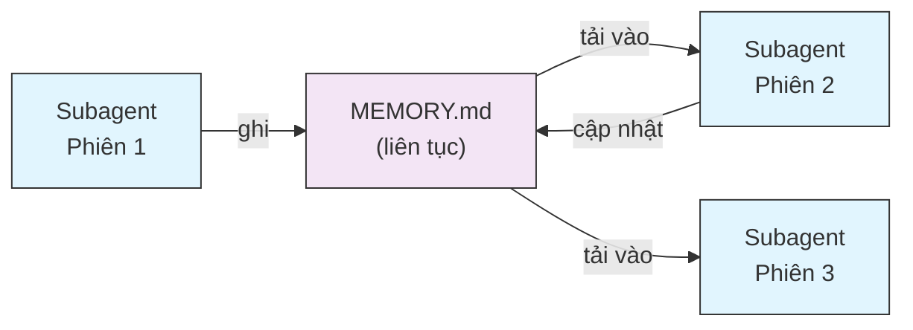
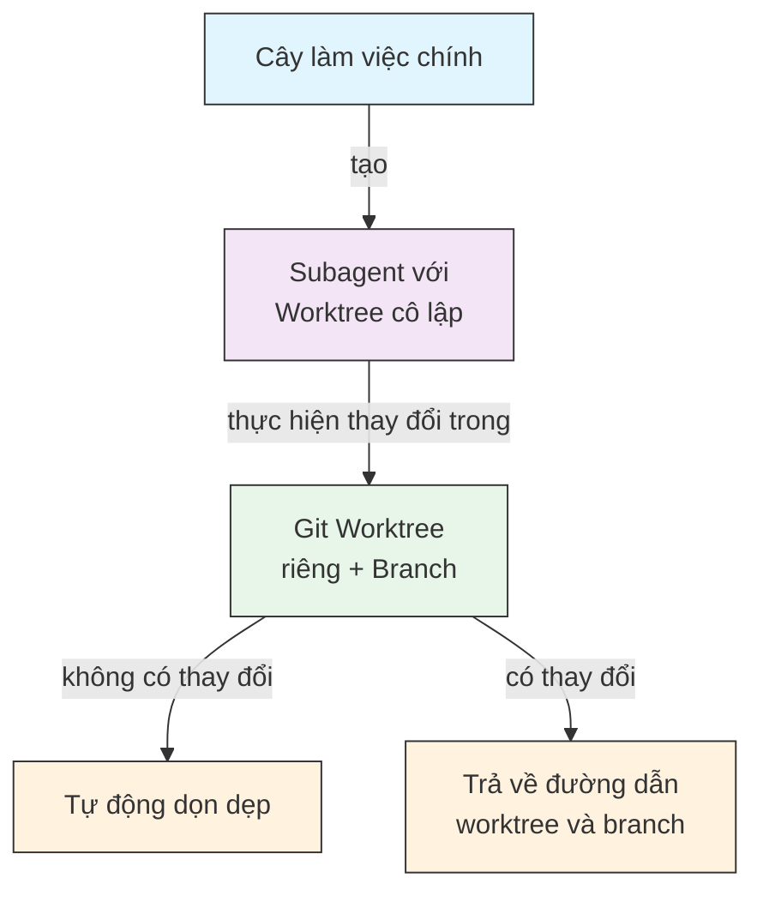
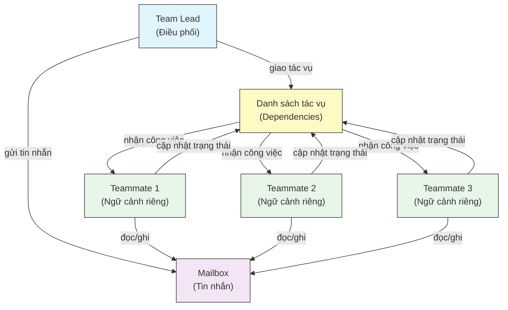
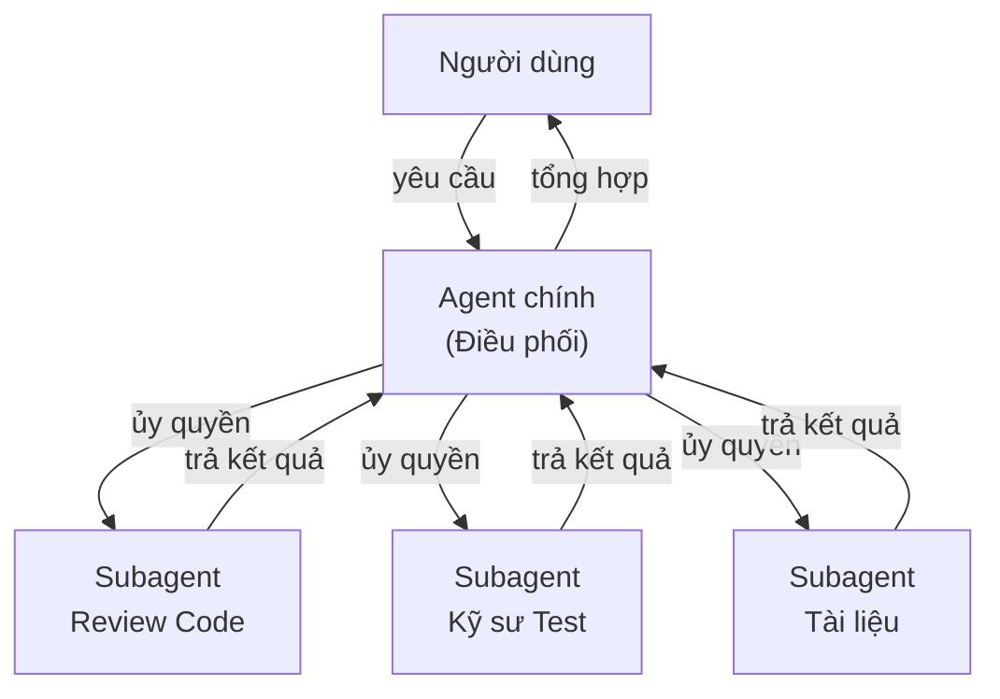
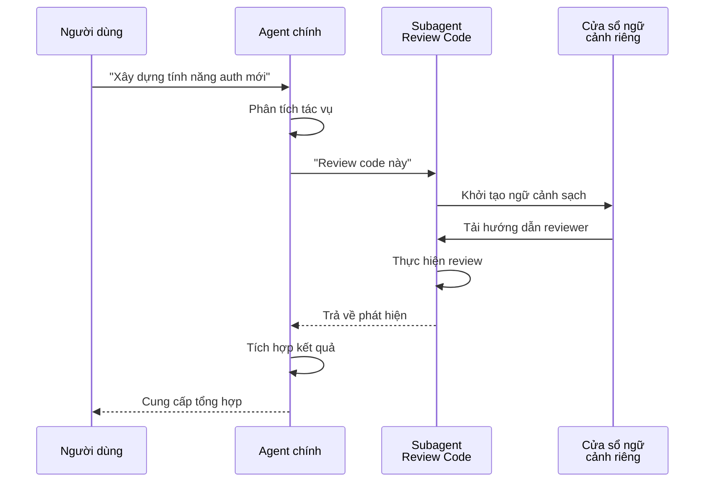
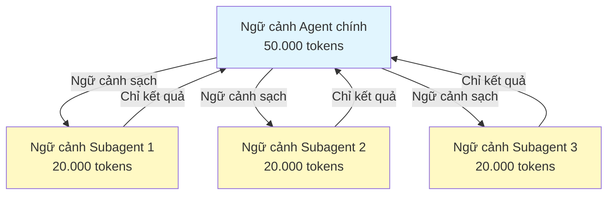
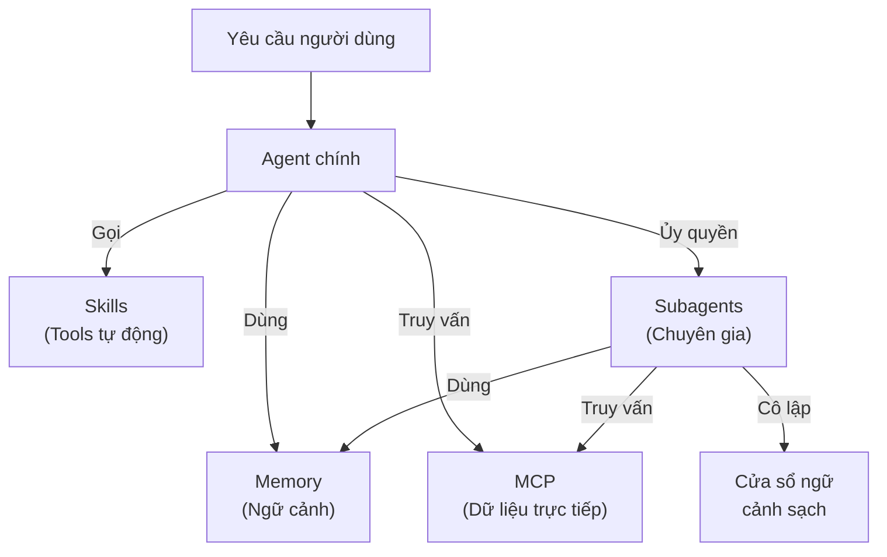

<picture>
  <source media="(prefers-color-scheme: dark)" srcset="../resources/logos/claude-howto-logo-dark.svg">
  
</picture>

# Subagents - Hướng dẫn tham chiếu đầy đủ

Subagents (tác nhân phụ) là các trợ lý AI chuyên biệt mà Claude Code có thể ủy quyền tác vụ. Mỗi subagent có một mục đích cụ thể, dùng cửa sổ ngữ cảnh riêng tách biệt với hội thoại chính, và có thể được cấu hình với các công cụ cụ thể và system prompt tùy chỉnh.

## Mục lục

1. [Tổng quan](#tổng-quan)
2. [Lợi ích chính](#lợi-ích-chính)
3. [Vị trí file](#vị-trí-file)
4. [Cấu hình](#cấu-hình)
5. [Subagents tích hợp sẵn](#subagents-tích-hợp-sẵn)
6. [Quản lý Subagents](#quản-lý-subagents)
7. [Dùng Subagents](#dùng-subagents)
8. [Agents có thể tiếp tục](#agents-có-thể-tiếp-tục)
9. [Kết nối Subagents](#kết-nối-subagents)
10. [Bộ nhớ liên tục cho Subagents](#bộ-nhớ-liên-tục-cho-subagents)
11. [Subagents nền](#subagents-nền)
12. [Cô lập Worktree](#cô-lập-worktree)
13. [Giới hạn Subagents có thể tạo](#giới-hạn-subagents-có-thể-tạo)
14. [Lệnh CLI `claude agents`](#lệnh-cli-claude-agents)
15. [Nhóm Agent (Thử nghiệm)](#nhóm-agent-thử-nghiệm)
16. [Bảo mật Subagent của Plugin](#bảo-mật-subagent-của-plugin)
17. [Kiến trúc](#kiến-trúc)
18. [Quản lý ngữ cảnh](#quản-lý-ngữ-cảnh)
19. [Khi nào dùng Subagents](#khi-nào-dùng-subagents)
20. [Thực hành tốt nhất](#thực-hành-tốt-nhất)
21. [Ví dụ Subagents trong thư mục này](#ví-dụ-subagents-trong-thư-mục-này)
22. [Hướng dẫn cài đặt](#hướng-dẫn-cài-đặt)
23. [Khái niệm liên quan](#khái-niệm-liên-quan)

---

## Tổng quan

Subagents cho phép thực thi tác vụ được ủy quyền trong Claude Code bằng cách:

- Tạo các **trợ lý AI cô lập** với cửa sổ ngữ cảnh riêng
- Cung cấp **system prompts tùy chỉnh** cho chuyên môn theo lĩnh vực
- Áp đặt **kiểm soát truy cập tool** để giới hạn khả năng
- Ngăn **ô nhiễm ngữ cảnh** từ các tác vụ phức tạp
- Cho phép **thực thi song song** nhiều tác vụ chuyên biệt

Mỗi subagent hoạt động độc lập với ngữ cảnh sạch, chỉ nhận ngữ cảnh cụ thể cần thiết cho tác vụ của chúng, sau đó trả kết quả về cho agent chính để tổng hợp.

**Bắt đầu nhanh**: Dùng lệnh `/agents` để tạo, xem, chỉnh sửa và quản lý subagents một cách tương tác.

---

## Lợi ích chính

| Lợi ích | Mô tả |
|---------|-------|
| **Bảo toàn ngữ cảnh** | Hoạt động trong ngữ cảnh riêng, ngăn ô nhiễm hội thoại chính |
| **Chuyên môn hóa** | Được tinh chỉnh cho các lĩnh vực cụ thể với tỷ lệ thành công cao hơn |
| **Có thể tái sử dụng** | Dùng qua các dự án khác nhau và chia sẻ với nhóm |
| **Quyền linh hoạt** | Mức truy cập tool khác nhau cho các loại subagent khác nhau |
| **Khả năng mở rộng** | Nhiều agent làm việc trên các khía cạnh khác nhau đồng thời |

---

## Vị trí file

File subagent có thể lưu ở nhiều vị trí với các phạm vi khác nhau:

| Ưu tiên | Loại | Vị trí | Phạm vi |
|---------|------|--------|---------|
| 1 (cao nhất) | **Định nghĩa qua CLI** | Qua cờ `--agents` (JSON) | Chỉ trong phiên |
| 2 | **Subagents dự án** | `.claude/agents/` | Dự án hiện tại |
| 3 | **Subagents người dùng** | `~/.claude/agents/` | Tất cả dự án |
| 4 (thấp nhất) | **Plugin agents** | Thư mục `agents/` của plugin | Qua plugins |

Khi có tên trùng lặp, nguồn có ưu tiên cao hơn sẽ thắng.

---

## Cấu hình

### Định dạng file

Subagents được định nghĩa trong YAML frontmatter theo sau là system prompt dạng markdown:

```yaml
---
name: tên-sub-agent-của-bạn
description: Mô tả khi nào subagent này nên được gọi
tools: tool1, tool2, tool3  # Tùy chọn - kế thừa tất cả tools nếu bỏ qua
disallowedTools: tool4  # Tùy chọn - tools bị từ chối rõ ràng
model: sonnet  # Tùy chọn - sonnet, opus, haiku, hoặc inherit
permissionMode: default  # Tùy chọn - chế độ quyền
maxTurns: 20  # Tùy chọn - giới hạn số lượt agentic
skills: skill1, skill2  # Tùy chọn - skills để tải trước vào ngữ cảnh
mcpServers: server1  # Tùy chọn - MCP servers để cung cấp
memory: user  # Tùy chọn - phạm vi bộ nhớ liên tục (user, project, local)
background: false  # Tùy chọn - chạy như tác vụ nền
effort: high  # Tùy chọn - mức effort lý luận (low, medium, high, max)
isolation: worktree  # Tùy chọn - cô lập git worktree
initialPrompt: "Bắt đầu bằng cách phân tích codebase"  # Tùy chọn - lượt đầu tiên tự động gửi
hooks:  # Tùy chọn - hooks theo phạm vi component
  PreToolUse:
    - matcher: "Bash"
      hooks:
        - type: command
          command: "./scripts/security-check.sh"
---

System prompt của subagent ở đây. Có thể nhiều đoạn văn
và nên định nghĩa rõ ràng vai trò, khả năng và cách tiếp cận
của subagent khi giải quyết vấn đề.
```

### Các trường cấu hình

| Trường | Bắt buộc | Mô tả |
|--------|----------|-------|
| `name` | Có | Định danh duy nhất (chữ thường và dấu gạch ngang) |
| `description` | Có | Mô tả ngôn ngữ tự nhiên về mục đích. Bao gồm "use PROACTIVELY" để khuyến khích gọi tự động |
| `tools` | Không | Danh sách tools cụ thể cách nhau bằng dấu phẩy. Bỏ qua để kế thừa tất cả tools. Hỗ trợ cú pháp `Agent(tên_agent)` để giới hạn subagents có thể tạo |
| `disallowedTools` | Không | Danh sách tools mà subagent không được dùng |
| `model` | Không | Model dùng: `sonnet`, `opus`, `haiku`, model ID đầy đủ, hoặc `inherit`. Mặc định theo model subagent đã cấu hình |
| `permissionMode` | Không | `default`, `acceptEdits`, `dontAsk`, `bypassPermissions`, `plan` |
| `maxTurns` | Không | Số lượt agentic tối đa subagent có thể thực hiện |
| `skills` | Không | Danh sách skills cách nhau bằng dấu phẩy để tải trước. Đưa nội dung skill đầy đủ vào ngữ cảnh subagent lúc khởi động |
| `mcpServers` | Không | MCP servers cung cấp cho subagent |
| `hooks` | Không | Hooks theo phạm vi component (PreToolUse, PostToolUse, Stop) |
| `memory` | Không | Phạm vi thư mục bộ nhớ liên tục: `user`, `project`, hoặc `local` |
| `background` | Không | Đặt `true` để luôn chạy subagent này như tác vụ nền |
| `effort` | Không | Mức effort lý luận: `low`, `medium`, `high`, hoặc `max` |
| `isolation` | Không | Đặt `worktree` để cho subagent git worktree riêng |
| `initialPrompt` | Không | Lượt đầu tiên tự động gửi khi subagent chạy như agent chính |

### Tùy chọn cấu hình Tool

**Tùy chọn 1: Kế thừa tất cả Tools (bỏ qua trường)**
```yaml
---
name: full-access-agent
description: Agent với tất cả tools có sẵn
---
```

**Tùy chọn 2: Chỉ định Tools cụ thể**
```yaml
---
name: limited-agent
description: Agent chỉ có tools cụ thể
tools: Read, Grep, Glob, Bash
---
```

**Tùy chọn 3: Truy cập Tool có điều kiện**
```yaml
---
name: conditional-agent
description: Agent với truy cập tool được lọc
tools: Read, Bash(npm:*), Bash(test:*)
---
```

### Cấu hình qua CLI

Định nghĩa subagents cho một phiên dùng cờ `--agents` với định dạng JSON:

```bash
claude --agents '{
  "code-reviewer": {
    "description": "Chuyên gia review code. Dùng chủ động sau khi thay đổi code.",
    "prompt": "Bạn là senior code reviewer. Tập trung vào chất lượng code, bảo mật và thực hành tốt nhất.",
    "tools": ["Read", "Grep", "Glob", "Bash"],
    "model": "sonnet"
  }
}'
```

**Định dạng JSON cho cờ `--agents`:**

```json
{
  "tên-agent": {
    "description": "Bắt buộc: khi nào gọi agent này",
    "prompt": "Bắt buộc: system prompt cho agent",
    "tools": ["Tùy", "chọn", "mảng", "tools"],
    "model": "tùy chọn: sonnet|opus|haiku"
  }
}
```

**Thứ tự ưu tiên của định nghĩa Agent:**

Định nghĩa agent được tải theo thứ tự ưu tiên này (khớp đầu tiên thắng):
1. **Định nghĩa qua CLI** - Cờ `--agents` (chỉ phiên, JSON)
2. **Cấp dự án** - `.claude/agents/` (dự án hiện tại)
3. **Cấp người dùng** - `~/.claude/agents/` (tất cả dự án)
4. **Cấp plugin** - Thư mục `agents/` của plugin

Điều này cho phép định nghĩa CLI ghi đè tất cả nguồn khác cho một phiên.

---

## Subagents tích hợp sẵn

Claude Code bao gồm một số subagent tích hợp luôn có sẵn:

| Agent | Model | Mục đích |
|-------|-------|---------|
| **general-purpose** | Kế thừa | Tác vụ phức tạp, nhiều bước |
| **Plan** | Kế thừa | Nghiên cứu cho chế độ plan |
| **Explore** | Haiku | Khám phá codebase chỉ đọc (quick/medium/very thorough) |
| **Bash** | Kế thừa | Lệnh terminal trong ngữ cảnh riêng |
| **statusline-setup** | Sonnet | Cấu hình status line |
| **Claude Code Guide** | Haiku | Trả lời câu hỏi về tính năng Claude Code |

### Subagent General-Purpose

| Thuộc tính | Giá trị |
|-----------|---------|
| **Model** | Kế thừa từ parent |
| **Tools** | Tất cả tools |
| **Mục đích** | Tác vụ nghiên cứu phức tạp, thao tác nhiều bước, sửa đổi code |

**Khi dùng**: Tác vụ cần cả khám phá và sửa đổi với lý luận phức tạp.

### Subagent Plan

| Thuộc tính | Giá trị |
|-----------|---------|
| **Model** | Kế thừa từ parent |
| **Tools** | Read, Glob, Grep, Bash |
| **Mục đích** | Tự động dùng trong chế độ plan để nghiên cứu codebase |

**Khi dùng**: Khi Claude cần hiểu codebase trước khi trình bày kế hoạch.

### Subagent Explore

| Thuộc tính | Giá trị |
|-----------|---------|
| **Model** | Haiku (nhanh, độ trễ thấp) |
| **Chế độ** | Chỉ đọc nghiêm ngặt |
| **Tools** | Glob, Grep, Read, Bash (chỉ lệnh đọc) |
| **Mục đích** | Tìm kiếm và phân tích codebase nhanh |

**Khi dùng**: Khi tìm kiếm/hiểu code mà không thực hiện thay đổi.

**Mức độ kỹ lưỡng** — Chỉ định độ sâu khám phá:
- **"quick"** — Tìm kiếm nhanh với khám phá tối thiểu, tốt để tìm pattern cụ thể
- **"medium"** — Khám phá vừa phải, cân bằng tốc độ và kỹ lưỡng, cách tiếp cận mặc định
- **"very thorough"** — Phân tích toàn diện qua nhiều vị trí và quy ước đặt tên, có thể mất lâu hơn

### Subagent Bash

| Thuộc tính | Giá trị |
|-----------|---------|
| **Model** | Kế thừa từ parent |
| **Tools** | Bash |
| **Mục đích** | Thực thi lệnh terminal trong cửa sổ ngữ cảnh riêng |

**Khi dùng**: Khi chạy lệnh shell được hưởng lợi từ ngữ cảnh cô lập.

### Subagent Statusline Setup

| Thuộc tính | Giá trị |
|-----------|---------|
| **Model** | Sonnet |
| **Tools** | Read, Write, Bash |
| **Mục đích** | Cấu hình hiển thị status line của Claude Code |

**Khi dùng**: Khi thiết lập hoặc tùy chỉnh status line.

### Subagent Claude Code Guide

| Thuộc tính | Giá trị |
|-----------|---------|
| **Model** | Haiku (nhanh, độ trễ thấp) |
| **Tools** | Chỉ đọc |
| **Mục đích** | Trả lời câu hỏi về tính năng và cách sử dụng Claude Code |

**Khi dùng**: Khi người dùng hỏi về cách Claude Code hoạt động hoặc cách dùng các tính năng cụ thể.

---

## Quản lý Subagents

### Dùng lệnh `/agents` (Khuyến nghị)

```bash
/agents
```

Cung cấp menu tương tác để:
- Xem tất cả subagents có sẵn (tích hợp sẵn, người dùng và dự án)
- Tạo subagents mới với hướng dẫn từng bước
- Chỉnh sửa subagents tùy chỉnh hiện có và quyền truy cập tool
- Xóa subagents tùy chỉnh
- Xem subagents nào đang hoạt động khi có trùng lặp

### Quản lý file trực tiếp

```bash
# Tạo subagent dự án
mkdir -p .claude/agents
cat > .claude/agents/test-runner.md << 'EOF'
---
name: test-runner
description: Dùng chủ động để chạy tests và sửa lỗi
---

Bạn là chuyên gia tự động hóa test. Khi thấy thay đổi code, hãy chủ động
chạy các tests phù hợp. Nếu tests thất bại, phân tích lỗi và sửa
trong khi bảo toàn ý định test ban đầu.
EOF

# Tạo subagent người dùng (có sẵn trong tất cả dự án)
mkdir -p ~/.claude/agents
```

---

## Dùng Subagents

### Ủy quyền tự động

Claude chủ động ủy quyền tác vụ dựa trên:
- Mô tả tác vụ trong yêu cầu của bạn
- Trường `description` trong cấu hình subagent
- Ngữ cảnh hiện tại và tools có sẵn

Để khuyến khích dùng chủ động, bao gồm "use PROACTIVELY" hoặc "MUST BE USED" trong trường `description`:

```yaml
---
name: code-reviewer
description: Chuyên gia review code. Use PROACTIVELY sau khi viết hoặc sửa đổi code.
---
```

### Gọi trực tiếp

Bạn có thể yêu cầu subagent cụ thể:

```
> Dùng subagent test-runner để sửa các tests thất bại
> Yêu cầu subagent code-reviewer xem xét các thay đổi gần đây của tôi
> Nhờ subagent debugger điều tra lỗi này
```

### Gọi qua @-Mention

Dùng tiền tố `@` để đảm bảo subagent cụ thể được gọi (bỏ qua các phương pháp ủy quyền tự động):

```
> @"code-reviewer (agent)" review module xác thực
```

### Agent cho toàn phiên

Chạy toàn bộ phiên dùng agent cụ thể làm agent chính:

```bash
# Qua cờ CLI
claude --agent code-reviewer

# Qua settings.json
{
  "agent": "code-reviewer"
}
```

### Liệt kê Agents có sẵn

Dùng lệnh `claude agents` để liệt kê tất cả agents đã cấu hình từ tất cả nguồn:

```bash
claude agents
```

---

## Agents có thể tiếp tục

Subagents có thể tiếp tục hội thoại trước với toàn bộ ngữ cảnh được lưu giữ:

```bash
# Gọi lần đầu
> Dùng agent code-analyzer để bắt đầu review module xác thực
# Trả về agentId: "abc123"

# Tiếp tục agent sau đó
> Tiếp tục agent abc123 và phân tích thêm logic ủy quyền
```

**Trường hợp dùng**:
- Nghiên cứu dài hạn qua nhiều phiên
- Cải thiện lặp lại mà không mất ngữ cảnh
- Quy trình nhiều bước duy trì ngữ cảnh

---

## Kết nối Subagents

Thực thi nhiều subagent theo trình tự:

```bash
> Đầu tiên dùng subagent code-analyzer để tìm vấn đề hiệu năng,
  sau đó dùng subagent optimizer để sửa chúng
```

Điều này cho phép các quy trình phức tạp trong đó đầu ra của một subagent được đưa vào subagent tiếp theo.

---

## Bộ nhớ liên tục cho Subagents

Trường `memory` cung cấp cho subagents một thư mục liên tục tồn tại qua các hội thoại. Điều này cho phép subagents xây dựng kiến thức theo thời gian, lưu trữ ghi chú, phát hiện và ngữ cảnh tồn tại giữa các phiên.

### Phạm vi bộ nhớ

| Phạm vi | Thư mục | Trường hợp dùng |
|---------|---------|----------------|
| `user` | `~/.claude/agent-memory/<tên>/` | Ghi chú và tùy chọn cá nhân qua tất cả dự án |
| `project` | `.claude/agent-memory/<tên>/` | Kiến thức theo dự án chia sẻ với nhóm |
| `local` | `.claude/agent-memory-local/<tên>/` | Kiến thức dự án cục bộ không commit vào version control |

### Cách hoạt động

- 200 dòng đầu tiên của `MEMORY.md` trong thư mục bộ nhớ tự động được tải vào system prompt của subagent
- Các tools `Read`, `Write` và `Edit` tự động được bật cho subagent để quản lý các file bộ nhớ
- Subagent có thể tạo thêm file trong thư mục bộ nhớ khi cần

### Ví dụ cấu hình

```yaml
---
name: researcher
memory: user
---

Bạn là trợ lý nghiên cứu. Dùng thư mục bộ nhớ để lưu phát hiện,
theo dõi tiến độ qua các phiên và tích lũy kiến thức theo thời gian.

Kiểm tra file MEMORY.md lúc bắt đầu mỗi phiên để nhớ lại ngữ cảnh trước.
```



---

## Subagents nền

Subagents có thể chạy nền, giải phóng hội thoại chính cho các tác vụ khác.

### Cấu hình

Đặt `background: true` trong frontmatter để luôn chạy subagent như tác vụ nền:

```yaml
---
name: long-runner
background: true
description: Thực hiện các tác vụ phân tích dài hạn ở nền
---
```

### Phím tắt

| Phím tắt | Hành động |
|----------|----------|
| `Ctrl+B` | Đưa tác vụ subagent đang chạy xuống nền |
| `Ctrl+F` | Dừng tất cả agents nền (nhấn hai lần để xác nhận) |

### Tắt tác vụ nền

Đặt biến môi trường để tắt hoàn toàn hỗ trợ tác vụ nền:

```bash
export CLAUDE_CODE_DISABLE_BACKGROUND_TASKS=1
```

---

## Cô lập Worktree

Cài đặt `isolation: worktree` cung cấp cho subagent git worktree riêng, cho phép thực hiện thay đổi độc lập mà không ảnh hưởng đến cây làm việc chính.

### Cấu hình

```yaml
---
name: feature-builder
isolation: worktree
description: Triển khai tính năng trong git worktree cô lập
tools: Read, Write, Edit, Bash, Grep, Glob
---
```

### Cách hoạt động



- Subagent hoạt động trong git worktree riêng trên branch riêng
- Nếu subagent không thực hiện thay đổi, worktree tự động được dọn dẹp
- Nếu có thay đổi, đường dẫn worktree và tên branch được trả về agent chính để review hoặc merge

---

## Giới hạn Subagents có thể tạo

Bạn có thể kiểm soát subagents nào một subagent được phép tạo ra bằng cú pháp `Agent(loại_agent)` trong trường `tools`. Điều này cung cấp cách whitelist các subagents cụ thể cho việc ủy quyền.

> **Lưu ý**: Trong v2.1.63, tool `Task` đã được đổi tên thành `Agent`. Các tham chiếu `Task(...)` hiện có vẫn hoạt động như aliases.

### Ví dụ

```yaml
---
name: coordinator
description: Phối hợp công việc giữa các agents chuyên biệt
tools: Agent(worker, researcher), Read, Bash
---

Bạn là agent điều phối. Bạn chỉ có thể ủy quyền công việc cho subagents "worker" và
"researcher". Dùng Read và Bash cho việc khám phá của bạn.
```

Trong ví dụ này, subagent `coordinator` chỉ có thể tạo các subagents `worker` và `researcher`. Không thể tạo subagents khác, dù chúng được định nghĩa ở nơi khác.

---

## Lệnh CLI `claude agents`

Lệnh `claude agents` liệt kê tất cả agents được cấu hình theo nhóm nguồn (tích hợp sẵn, cấp người dùng, cấp dự án):

```bash
claude agents
```

Lệnh này:
- Hiển thị tất cả agents có sẵn từ tất cả nguồn
- Nhóm agents theo vị trí nguồn
- Chỉ ra **ghi đè** khi một agent ở cấp ưu tiên cao hơn che khuất agent ở cấp thấp hơn (ví dụ: agent cấp dự án có cùng tên với agent cấp người dùng)

---

## Nhóm Agent (Thử nghiệm)

Agent Teams (Nhóm Agent) phối hợp nhiều instance Claude Code làm việc cùng nhau trên các tác vụ phức tạp. Khác với subagents (nhận tác vụ con được ủy quyền trả về kết quả), teammates làm việc độc lập với ngữ cảnh riêng và giao tiếp trực tiếp qua hệ thống mailbox chia sẻ.

> **Lưu ý**: Agent Teams là tính năng thử nghiệm và yêu cầu Claude Code v2.1.32+. Bật trước khi dùng.

### Subagents vs Agent Teams

| Khía cạnh | Subagents | Agent Teams |
|-----------|-----------|-------------|
| **Mô hình ủy quyền** | Parent ủy quyền tác vụ con, chờ kết quả | Team lead giao việc, teammates thực hiện độc lập |
| **Ngữ cảnh** | Ngữ cảnh sạch mỗi tác vụ, kết quả được chắt lọc về | Mỗi teammate duy trì ngữ cảnh liên tục riêng |
| **Phối hợp** | Tuần tự hoặc song song, được parent quản lý | Danh sách tác vụ chia sẻ với quản lý dependency tự động |
| **Giao tiếp** | Chỉ trả về giá trị | Nhắn tin giữa agent qua mailbox |
| **Tiếp tục phiên** | Được hỗ trợ | Không hỗ trợ với teammates in-process |
| **Tốt nhất cho** | Tác vụ con tập trung, được xác định rõ | Dự án đa file lớn cần công việc song song |

### Bật Agent Teams

Đặt biến môi trường hoặc thêm vào `settings.json`:

```bash
export CLAUDE_CODE_EXPERIMENTAL_AGENT_TEAMS=1
```

Hoặc trong `settings.json`:

```json
{
  "env": {
    "CLAUDE_CODE_EXPERIMENTAL_AGENT_TEAMS": "1"
  }
}
```

### Bắt đầu một nhóm

Khi đã bật, yêu cầu Claude làm việc với teammates trong prompt của bạn:

```
Người dùng: Xây dựng module xác thực. Dùng một nhóm — một teammate cho API endpoints,
             một cho database schema, và một cho test suite.
```

Claude sẽ tạo nhóm, giao tác vụ và phối hợp công việc tự động.

### Chế độ hiển thị

Kiểm soát cách hoạt động của teammate được hiển thị:

| Chế độ | Cờ | Mô tả |
|--------|----|----|
| **Auto** | `--teammate-mode auto` | Tự động chọn chế độ hiển thị tốt nhất cho terminal |
| **In-process** | `--teammate-mode in-process` | Hiển thị đầu ra teammate nội tuyến trong terminal hiện tại (mặc định) |
| **Split-panes** | `--teammate-mode tmux` | Mở mỗi teammate trong pane tmux hoặc iTerm2 riêng |

```bash
claude --teammate-mode tmux
```

Bạn cũng có thể đặt chế độ hiển thị trong `settings.json`:

```json
{
  "teammateMode": "tmux"
}
```

> **Lưu ý**: Chế độ split-pane yêu cầu tmux hoặc iTerm2. Không có sẵn trong VS Code terminal, Windows Terminal hoặc Ghostty.

### Điều hướng

Dùng `Shift+Down` để điều hướng giữa các teammates trong chế độ split-pane.

### Cấu hình nhóm

Cấu hình nhóm được lưu tại `~/.claude/teams/{tên-nhóm}/config.json`.

### Kiến trúc



**Các thành phần chính**:

- **Team Lead**: Phiên Claude Code chính tạo nhóm, giao tác vụ và điều phối
- **Danh sách tác vụ chia sẻ**: Danh sách tác vụ đồng bộ với theo dõi dependency tự động
- **Mailbox**: Hệ thống nhắn tin giữa agent cho teammates giao tiếp trạng thái và phối hợp
- **Teammates**: Các instance Claude Code độc lập, mỗi cái có cửa sổ ngữ cảnh riêng

### Giao việc và nhắn tin

Team lead chia công việc thành tác vụ và giao cho teammates. Danh sách tác vụ chia sẻ xử lý:

- **Quản lý dependency tự động** — tác vụ chờ các dependency hoàn thành
- **Theo dõi trạng thái** — teammates cập nhật trạng thái tác vụ khi làm việc
- **Nhắn tin giữa agent** — teammates gửi tin nhắn qua mailbox để phối hợp (ví dụ: "Schema database đã sẵn sàng, bạn có thể bắt đầu viết queries")

### Quy trình phê duyệt kế hoạch

Cho các tác vụ phức tạp, team lead tạo kế hoạch thực thi trước khi teammates bắt đầu làm việc. Người dùng review và phê duyệt kế hoạch, đảm bảo cách tiếp cận của nhóm phù hợp với kỳ vọng trước khi thực hiện bất kỳ thay đổi code nào.

### Sự kiện Hook cho nhóm

Agent Teams giới thiệu thêm hai [sự kiện hook](../06-hooks/):

| Sự kiện | Kích hoạt khi | Trường hợp dùng |
|---------|--------------|----------------|
| `TeammateIdle` | Teammate hoàn thành tác vụ hiện tại và không có công việc đang chờ | Kích hoạt thông báo, giao tác vụ tiếp theo |
| `TaskCompleted` | Tác vụ trong danh sách tác vụ chia sẻ được đánh dấu hoàn thành | Chạy xác thực, cập nhật dashboard, kết nối công việc phụ thuộc |

### Thực hành tốt nhất

- **Quy mô nhóm**: Giữ nhóm 3-5 teammates để phối hợp tối ưu
- **Kích thước tác vụ**: Chia công việc thành tác vụ mỗi tác vụ mất 5-15 phút — đủ nhỏ để song song hóa, đủ lớn để có nghĩa
- **Tránh xung đột file**: Giao các file hoặc thư mục khác nhau cho các teammates khác nhau để ngăn merge conflicts
- **Bắt đầu đơn giản**: Dùng chế độ in-process cho nhóm đầu tiên; chuyển sang split-panes khi đã quen
- **Mô tả tác vụ rõ ràng**: Cung cấp mô tả tác vụ cụ thể, có thể hành động để teammates có thể làm việc độc lập

### Giới hạn

- **Thử nghiệm**: Hành vi tính năng có thể thay đổi trong các bản phát hành tương lai
- **Không tiếp tục phiên**: Teammates in-process không thể tiếp tục sau khi phiên kết thúc
- **Một nhóm mỗi phiên**: Không thể tạo nhóm lồng nhau hoặc nhiều nhóm trong một phiên
- **Leadership cố định**: Vai trò team lead không thể chuyển cho teammate
- **Giới hạn split-pane**: Yêu cầu tmux/iTerm2; không có sẵn trong VS Code terminal, Windows Terminal hoặc Ghostty
- **Không có nhóm xuyên phiên**: Teammates chỉ tồn tại trong phiên hiện tại

> **Cảnh báo**: Agent Teams là tính năng thử nghiệm. Kiểm tra với công việc không quan trọng trước và giám sát phối hợp teammate cho hành vi không mong đợi.

---

## Bảo mật Subagent của Plugin

Subagents do plugin cung cấp có khả năng frontmatter bị giới hạn vì lý do bảo mật. Các trường sau **không được phép** trong định nghĩa subagent plugin:

- `hooks` — Không thể định nghĩa lifecycle hooks
- `mcpServers` — Không thể cấu hình MCP servers
- `permissionMode` — Không thể ghi đè cài đặt quyền

Điều này ngăn plugins leo thang đặc quyền hoặc thực thi lệnh tùy ý qua subagent hooks.

---

## Kiến trúc

### Kiến trúc tổng quan



### Vòng đời Subagent



---

## Quản lý ngữ cảnh



### Điểm chính

- Mỗi subagent nhận một **cửa sổ ngữ cảnh sạch** mà không có lịch sử hội thoại chính
- Chỉ **ngữ cảnh liên quan** được truyền cho subagent cho tác vụ cụ thể của chúng
- Kết quả được **chắt lọc** về agent chính
- Điều này ngăn **cạn kiệt token ngữ cảnh** trên các dự án dài

### Cân nhắc hiệu năng

- **Hiệu quả ngữ cảnh** — Agents bảo toàn ngữ cảnh chính, cho phép phiên dài hơn
- **Độ trễ** — Subagents bắt đầu với ngữ cảnh sạch và có thể thêm độ trễ khi thu thập ngữ cảnh ban đầu

### Hành vi chính

- **Không tạo lồng nhau** — Subagents không thể tạo subagents khác
- **Quyền nền** — Subagents nền tự động từ chối mọi quyền chưa được phê duyệt trước
- **Đưa xuống nền** — Nhấn `Ctrl+B` để đưa tác vụ đang chạy xuống nền
- **Transcripts** — Transcripts subagent lưu tại `~/.claude/projects/{dự_án}/{sessionId}/subagents/agent-{agentId}.jsonl`
- **Auto-compaction** — Ngữ cảnh subagent tự động compact ở ~95% dung lượng (ghi đè bằng biến môi trường `CLAUDE_AUTOCOMPACT_PCT_OVERRIDE`)

---

## Khi nào dùng Subagents

| Tình huống | Dùng Subagent | Lý do |
|-----------|--------------|-------|
| Tính năng phức tạp với nhiều bước | Có | Tách biệt quan tâm, ngăn ô nhiễm ngữ cảnh |
| Review code nhanh | Không | Chi phí không cần thiết |
| Thực thi tác vụ song song | Có | Mỗi subagent có ngữ cảnh riêng |
| Cần chuyên môn chuyên biệt | Có | System prompts tùy chỉnh |
| Phân tích dài hạn | Có | Ngăn cạn kiệt ngữ cảnh chính |
| Tác vụ đơn lẻ | Không | Thêm độ trễ không cần thiết |

---

## Thực hành tốt nhất

### Nguyên tắc thiết kế

**Nên làm:**
- Bắt đầu với agents do Claude tạo — Tạo subagent ban đầu với Claude, sau đó lặp lại để tùy chỉnh
- Thiết kế subagents tập trung — Trách nhiệm đơn, rõ ràng thay vì một làm tất cả
- Viết prompts chi tiết — Bao gồm hướng dẫn cụ thể, ví dụ và ràng buộc
- Giới hạn quyền truy cập tool — Chỉ cấp tools cần thiết cho mục đích của subagent
- Kiểm soát phiên bản — Commit subagents dự án vào version control để cộng tác nhóm

**Không nên làm:**
- Tạo subagents trùng lặp với cùng vai trò
- Cấp quyền truy cập tool không cần thiết cho subagents
- Dùng subagents cho tác vụ đơn giản, một bước
- Trộn lẫn nhiều quan tâm trong prompt của một subagent
- Quên truyền ngữ cảnh cần thiết

### Thực hành tốt nhất cho System Prompt

1. **Cụ thể về Vai trò**
   ```
   Bạn là chuyên gia code reviewer chuyên về [lĩnh vực cụ thể]
   ```

2. **Định nghĩa Ưu tiên rõ ràng**
   ```
   Ưu tiên review (theo thứ tự):
   1. Vấn đề bảo mật
   2. Vấn đề hiệu năng
   3. Chất lượng code
   ```

3. **Chỉ định Định dạng đầu ra**
   ```
   Với mỗi vấn đề cung cấp: Mức độ, Danh mục, Vị trí, Mô tả, Cách sửa, Tác động
   ```

4. **Bao gồm Các bước hành động**
   ```
   Khi được gọi:
   1. Chạy git diff để xem các thay đổi gần đây
   2. Tập trung vào các file đã sửa đổi
   3. Bắt đầu review ngay
   ```

### Chiến lược truy cập Tool

1. **Bắt đầu hạn chế**: Bắt đầu chỉ với tools thiết yếu
2. **Mở rộng chỉ khi cần**: Thêm tools khi yêu cầu đòi hỏi
3. **Chỉ đọc khi có thể**: Dùng Read/Grep cho agents phân tích
4. **Thực thi trong sandbox**: Giới hạn lệnh Bash theo pattern cụ thể

---

## Ví dụ Subagents trong thư mục này

Thư mục này chứa các subagent ví dụ sẵn dùng:

### 1. Code Reviewer (`code-reviewer.md`)

**Mục đích**: Phân tích chất lượng code và khả năng bảo trì toàn diện

**Tools**: Read, Grep, Glob, Bash

**Chuyên môn**:
- Phát hiện lỗ hổng bảo mật
- Xác định cơ hội tối ưu hiệu năng
- Đánh giá khả năng bảo trì code
- Phân tích độ phủ test

**Dùng khi**: Bạn cần review code tự động tập trung vào chất lượng và bảo mật

---

### 2. Test Engineer (`test-engineer.md`)

**Mục đích**: Chiến lược test, phân tích độ phủ và test tự động

**Tools**: Read, Write, Bash, Grep

**Chuyên môn**:
- Tạo unit test
- Thiết kế integration test
- Xác định edge case
- Phân tích độ phủ (mục tiêu >80%)

**Dùng khi**: Bạn cần tạo test suite toàn diện hoặc phân tích độ phủ

---

### 3. Documentation Writer (`documentation-writer.md`)

**Mục đích**: Tài liệu kỹ thuật, tài liệu API và hướng dẫn người dùng

**Tools**: Read, Write, Grep

**Chuyên môn**:
- Tài liệu API endpoint
- Tạo hướng dẫn người dùng
- Tài liệu kiến trúc
- Cải thiện comment code

**Dùng khi**: Bạn cần tạo hoặc cập nhật tài liệu dự án

---

### 4. Secure Reviewer (`secure-reviewer.md`)

**Mục đích**: Review code tập trung bảo mật với quyền tối thiểu

**Tools**: Read, Grep

**Chuyên môn**:
- Phát hiện lỗ hổng bảo mật
- Vấn đề xác thực/ủy quyền
- Rủi ro lộ dữ liệu
- Xác định tấn công injection

**Dùng khi**: Bạn cần kiểm tra bảo mật mà không có khả năng sửa đổi

---

### 5. Implementation Agent (`implementation-agent.md`)

**Mục đích**: Khả năng triển khai đầy đủ cho phát triển tính năng

**Tools**: Read, Write, Edit, Bash, Grep, Glob

**Chuyên môn**:
- Triển khai tính năng
- Tạo code
- Thực thi build và test
- Sửa đổi codebase

**Dùng khi**: Bạn cần subagent triển khai tính năng từ đầu đến cuối

---

### 6. Debugger (`debugger.md`)

**Mục đích**: Chuyên gia debug cho lỗi, test thất bại và hành vi không mong đợi

**Tools**: Read, Edit, Bash, Grep, Glob

**Chuyên môn**:
- Phân tích nguyên nhân gốc rễ
- Điều tra lỗi
- Giải quyết test thất bại
- Triển khai bản sửa lỗi tối thiểu

**Dùng khi**: Bạn gặp bugs, lỗi hoặc hành vi không mong đợi

---

### 7. Data Scientist (`data-scientist.md`)

**Mục đích**: Chuyên gia phân tích dữ liệu cho truy vấn SQL và thông tin dữ liệu

**Tools**: Bash, Read, Write

**Chuyên môn**:
- Tối ưu truy vấn SQL
- Thao tác BigQuery
- Phân tích và trực quan hóa dữ liệu
- Thông tin thống kê

**Dùng khi**: Bạn cần phân tích dữ liệu, truy vấn SQL hoặc thao tác BigQuery

---

## Hướng dẫn cài đặt

### Phương pháp 1: Dùng lệnh /agents (Khuyến nghị)

```bash
/agents
```

Sau đó:
1. Chọn 'Create New Agent'
2. Chọn cấp project hoặc cấp user
3. Mô tả subagent của bạn chi tiết
4. Chọn tools để cấp quyền (hoặc để trống để kế thừa tất cả)
5. Lưu và dùng

### Phương pháp 2: Sao chép vào dự án

Sao chép file agent vào thư mục `.claude/agents/` của dự án:

```bash
# Điều hướng đến dự án của bạn
cd /path/to/your/project

# Tạo thư mục agents nếu chưa có
mkdir -p .claude/agents

# Sao chép tất cả file agent từ thư mục này
cp /path/to/04-subagents/*.md .claude/agents/

# Xóa README (không cần trong .claude/agents)
rm .claude/agents/README.md
```

### Phương pháp 3: Sao chép vào thư mục người dùng

Cho agents có sẵn trong tất cả dự án:

```bash
# Tạo thư mục user agents
mkdir -p ~/.claude/agents

# Sao chép agents
cp /path/to/04-subagents/code-reviewer.md ~/.claude/agents/
cp /path/to/04-subagents/debugger.md ~/.claude/agents/
# ... sao chép các agents khác khi cần
```

### Xác minh

Sau khi cài đặt, xác minh agents được nhận diện:

```bash
/agents
```

Bạn sẽ thấy các agents đã cài đặt được liệt kê cùng với các agents tích hợp sẵn.

---

## Cấu trúc file

```
project/
├── .claude/
│   └── agents/
│       ├── code-reviewer.md
│       ├── test-engineer.md
│       ├── documentation-writer.md
│       ├── secure-reviewer.md
│       ├── implementation-agent.md
│       ├── debugger.md
│       └── data-scientist.md
└── ...
```

---

## Khái niệm liên quan

### Các tính năng liên quan

- **[Slash Commands](../01-slash-commands/)** - Phím tắt nhanh do người dùng gọi
- **[Memory](../02-memory/)** - Ngữ cảnh liên tục xuyên phiên
- **[Skills](../03-skills/)** - Khả năng tự chủ có thể tái sử dụng
- **[MCP Protocol](../05-mcp/)** - Truy cập dữ liệu bên ngoài thời gian thực
- **[Hooks](../06-hooks/)** - Tự động hóa lệnh shell theo sự kiện
- **[Plugins](../07-plugins/)** - Gói mở rộng tích hợp sẵn

### So sánh với các tính năng khác

| Tính năng | User gọi | Tự động gọi | Liên tục | Truy cập ngoài | Ngữ cảnh cô lập |
|-----------|----------|-------------|---------|----------------|----------------|
| **Slash Commands** | Có | Không | Không | Không | Không |
| **Subagents** | Có | Có | Không | Không | Có |
| **Memory** | Tự động | Tự động | Có | Không | Không |
| **MCP** | Tự động | Có | Không | Có | Không |
| **Skills** | Có | Có | Không | Không | Không |

### Pattern tích hợp



---

## Tài nguyên bổ sung

- [Tài liệu Subagents chính thức](https://code.claude.com/docs/en/sub-agents)
- [Tài liệu tham chiếu CLI](https://code.claude.com/docs/en/cli-reference) - Cờ `--agents` và các tùy chọn CLI khác
- [Hướng dẫn Plugins](../07-plugins/) - Để đóng gói agents với các tính năng khác
- [Hướng dẫn Skills](../03-skills/) - Cho các khả năng tự động gọi
- [Hướng dẫn Memory](../02-memory/) - Cho ngữ cảnh liên tục
- [Hướng dẫn Hooks](../06-hooks/) - Cho tự động hóa theo sự kiện

---

*Cập nhật lần cuối: Tháng 3 năm 2026*

*Hướng dẫn này bao gồm cấu hình subagent đầy đủ, các pattern ủy quyền và thực hành tốt nhất cho Claude Code.*
