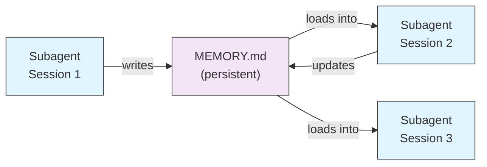
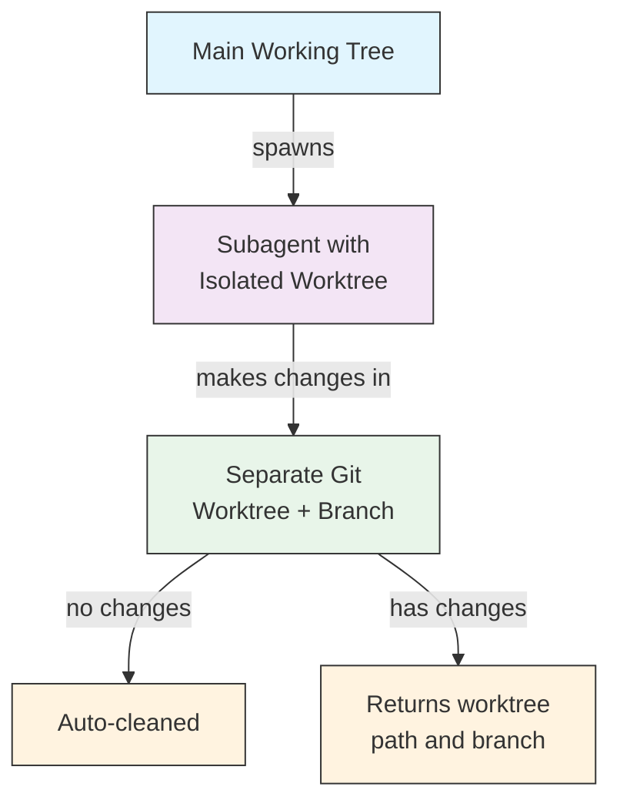
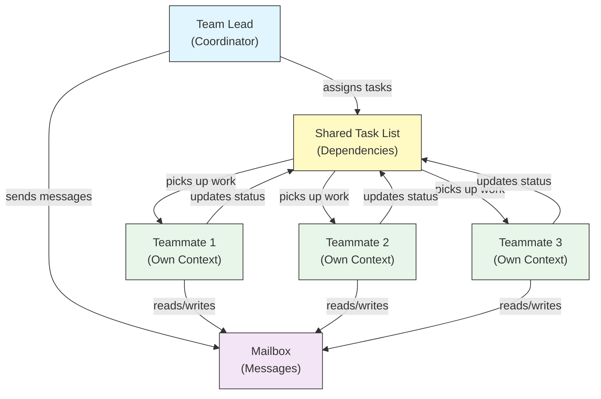
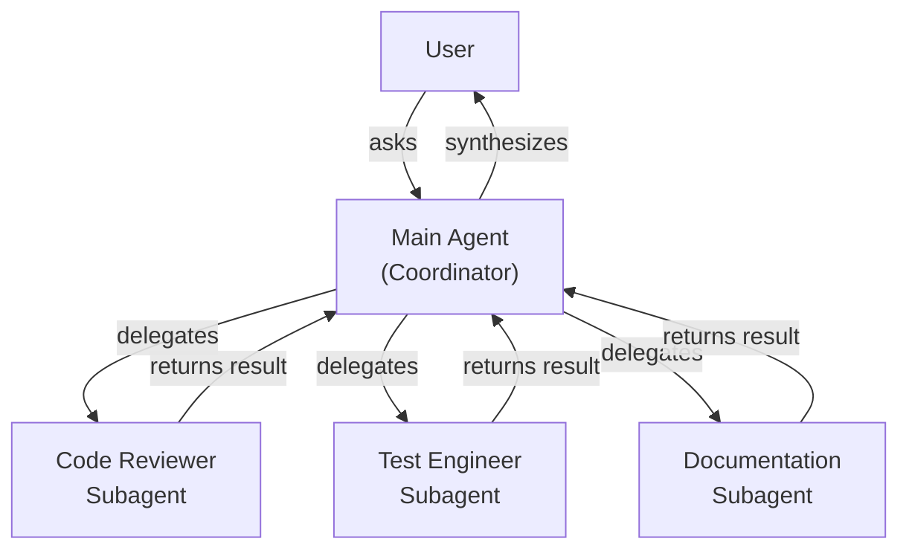
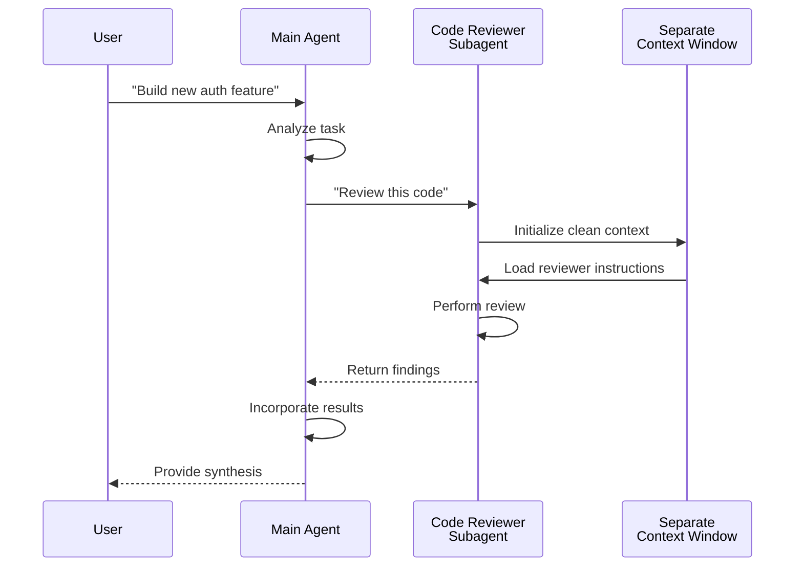
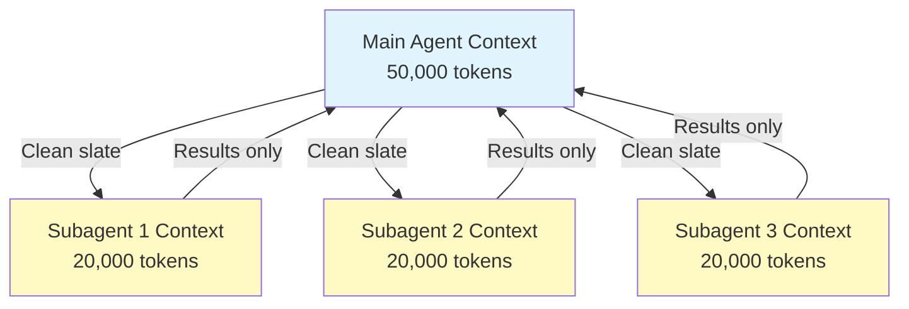
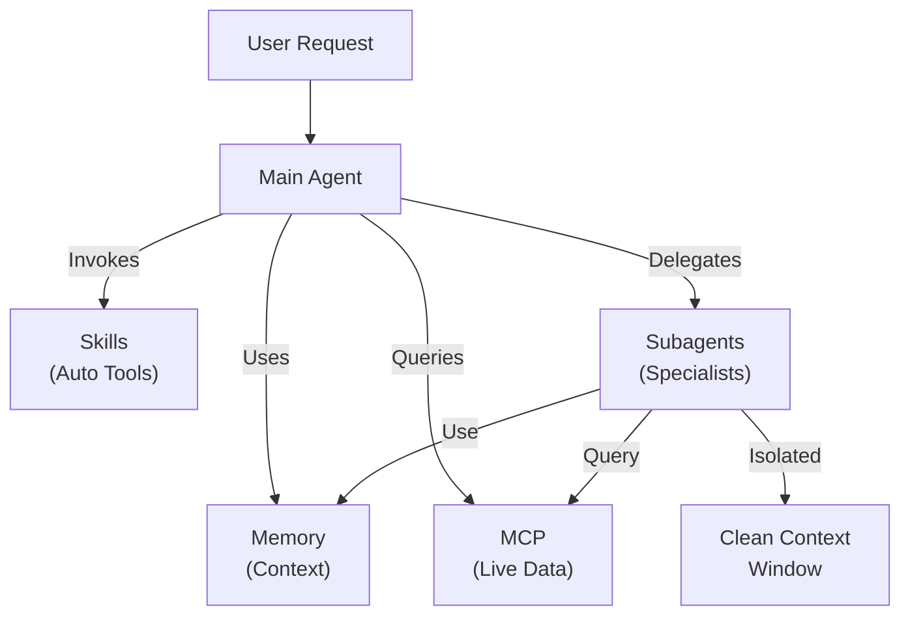

<picture>
  <source media="(prefers-color-scheme: dark)" srcset="../resources/logos/claude-howto-logo-dark.svg">
  
</picture>

# Subagents - Complete Reference Guide

Subagents 是 Claude Code 可委派的专用 AI 助手。每个 subagent 都有明确职责、独立于主对话的上下文窗口，并可配置专属工具权限与系统提示词。

## Table of Contents

1. [Overview](#overview)
2. [Key Benefits](#key-benefits)
3. [File Locations](#file-locations)
4. [Configuration](#configuration)
5. [Built-in Subagents](#built-in-subagents)
6. [Managing Subagents](#managing-subagents)
7. [Using Subagents](#using-subagents)
8. [Resumable Agents](#resumable-agents)
9. [Chaining Subagents](#chaining-subagents)
10. [Persistent Memory for Subagents](#persistent-memory-for-subagents)
11. [Background Subagents](#background-subagents)
12. [Worktree Isolation](#worktree-isolation)
13. [Restrict Spawnable Subagents](#restrict-spawnable-subagents)
14. [`claude agents` CLI Command](#claude-agents-cli-command)
15. [Agent Teams (Experimental)](#agent-teams-experimental)
16. [Plugin Subagent Security](#plugin-subagent-security)
17. [Architecture](#architecture)
18. [Context Management](#context-management)
19. [When to Use Subagents](#when-to-use-subagents)
20. [Best Practices](#best-practices)
21. [Example Subagents in This Folder](#example-subagents-in-this-folder)
22. [Installation Instructions](#installation-instructions)
23. [Related Concepts](#related-concepts)

---

## Overview

Subagents 通过以下方式支持 Claude Code 的任务委派执行：

- 创建**隔离 AI 助手**（独立上下文窗口）
- 提供**定制系统提示词**（专业化能力）
- 执行**工具访问控制**（限制能力边界）
- 防止复杂任务带来的**主上下文污染**
- 支持多个专门任务的**并行执行**

每个 subagent 都在干净上下文中独立工作，只接收完成任务所需的最小上下文，完成后将结果返回给主 agent 汇总。

**Quick Start**：使用 `/agents` 命令可交互地创建、查看、编辑和管理 subagents。

---

## Key Benefits

| Benefit | Description |
|---------|-------------|
| **Context preservation** | 在独立上下文中运行，避免主对话被污染 |
| **Specialized expertise** | 针对特定领域调优，成功率更高 |
| **Reusability** | 可跨项目复用，并可团队共享 |
| **Flexible permissions** | 不同 subagent 可配置不同工具权限 |
| **Scalability** | 多 agent 可同时处理不同任务面 |

---

## File Locations

Subagent 文件支持多位置存储，不同作用域与优先级如下：

| Priority | Type | Location | Scope |
|----------|------|----------|-------|
| 1（最高） | **CLI-defined** | 通过 `--agents`（JSON） | 当前会话 |
| 2 | **Project subagents** | `.claude/agents/` | 当前项目 |
| 3 | **User subagents** | `~/.claude/agents/` | 所有项目 |
| 4（最低） | **Plugin agents** | 插件 `agents/` 目录 | 插件启用范围 |

同名时，按更高优先级覆盖更低优先级。

---

## Configuration

### File Format

Subagent 使用 YAML frontmatter + Markdown 系统提示词定义：

```yaml
---
name: your-sub-agent-name
description: Description of when this subagent should be invoked
tools: tool1, tool2, tool3  # Optional - inherits all tools if omitted
disallowedTools: tool4  # Optional - explicitly disallowed tools
model: sonnet  # Optional - sonnet, opus, haiku, or inherit
permissionMode: default  # Optional - permission mode
maxTurns: 20  # Optional - limit agentic turns
skills: skill1, skill2  # Optional - skills to preload into context
mcpServers: server1  # Optional - MCP servers to make available
memory: user  # Optional - persistent memory scope (user, project, local)
background: false  # Optional - run as background task
effort: high  # Optional - reasoning effort (low, medium, high, max)
isolation: worktree  # Optional - git worktree isolation
initialPrompt: "Start by analyzing the codebase"  # Optional - auto-submitted first turn
hooks:  # Optional - component-scoped hooks
  PreToolUse:
    - matcher: "Bash"
      hooks:
        - type: command
          command: "./scripts/security-check.sh"
---

Your subagent's system prompt goes here. This can be multiple paragraphs
and should clearly define the subagent's role, capabilities, and approach
to solving problems.
```

### Configuration Fields

| Field | Required | Description |
|-------|----------|-------------|
| `name` | Yes | 唯一标识（小写字母 + 连字符） |
| `description` | Yes | 自然语言说明用途。可加入 `use PROACTIVELY` 提升自动调用概率 |
| `tools` | No | 逗号分隔工具列表；省略则继承全部。支持 `Agent(agent_name)` 限制可派生 subagents |
| `disallowedTools` | No | 显式禁止该 subagent 使用的工具 |
| `model` | No | 指定模型：`sonnet`、`opus`、`haiku`、完整模型 ID 或 `inherit` |
| `permissionMode` | No | `default`、`acceptEdits`、`dontAsk`、`bypassPermissions`、`plan` |
| `maxTurns` | No | subagent 可执行的最大 agentic turns |
| `skills` | No | 预加载 skills（逗号分隔）。启动时把完整 skill 内容注入上下文 |
| `mcpServers` | No | 该 subagent 可用的 MCP servers |
| `hooks` | No | 组件级 hooks（PreToolUse/PostToolUse/Stop） |
| `memory` | No | 持久内存目录范围：`user`、`project`、`local` |
| `background` | No | 设为 `true` 则默认后台运行 |
| `effort` | No | 推理强度：`low`、`medium`、`high`、`max` |
| `isolation` | No | 设为 `worktree`，为其分配独立 git worktree |
| `initialPrompt` | No | 当作为主 agent 运行时自动提交的第一轮 prompt |

### Tool Configuration Options

**Option 1: 继承所有工具（省略字段）**

```yaml
---
name: full-access-agent
description: Agent with all available tools
---
```

**Option 2: 指定工具**

```yaml
---
name: limited-agent
description: Agent with specific tools only
tools: Read, Grep, Glob, Bash
---
```

**Option 3: 条件工具访问**

```yaml
---
name: conditional-agent
description: Agent with filtered tool access
tools: Read, Bash(npm:*), Bash(test:*)
---
```

### CLI-Based Configuration

通过 `--agents` + JSON，可仅为当前会话定义 subagents：

```bash
claude --agents '{
  "code-reviewer": {
    "description": "Expert code reviewer. Use proactively after code changes.",
    "prompt": "You are a senior code reviewer. Focus on code quality, security, and best practices.",
    "tools": ["Read", "Grep", "Glob", "Bash"],
    "model": "sonnet"
  }
}'
```

**`--agents` JSON 格式：**

```json
{
  "agent-name": {
    "description": "Required: when to invoke this agent",
    "prompt": "Required: system prompt for the agent",
    "tools": ["Optional", "array", "of", "tools"],
    "model": "optional: sonnet|opus|haiku"
  }
}
```

**Agent 定义优先级：**

1. **CLI-defined** - `--agents`（当前会话）
2. **Project-level** - `.claude/agents/`
3. **User-level** - `~/.claude/agents/`
4. **Plugin-level** - 插件 `agents/` 目录

因此 CLI 定义可在单次会话中覆盖其余来源。

---

## Built-in Subagents

Claude Code 内置若干始终可用的 subagents：

| Agent | Model | Purpose |
|-------|-------|---------|
| **general-purpose** | Inherits | 复杂多步骤任务 |
| **Plan** | Inherits | plan mode 调研 |
| **Explore** | Haiku | 只读代码探索（quick/medium/very thorough） |
| **Bash** | Inherits | 独立上下文执行终端命令 |
| **statusline-setup** | Sonnet | 配置状态栏 |
| **Claude Code Guide** | Haiku | 回答 Claude Code 功能问题 |

### General-Purpose Subagent

| Property | Value |
|----------|-------|
| **Model** | 继承父 agent |
| **Tools** | 全工具 |
| **Purpose** | 复杂调研、多步骤操作、代码修改 |

**When used**：既要探索又要修改、并且推理复杂的任务。

### Plan Subagent

| Property | Value |
|----------|-------|
| **Model** | 继承父 agent |
| **Tools** | Read、Glob、Grep、Bash |
| **Purpose** | plan mode 下自动调研代码库 |

**When used**：Claude 在给出计划前需要理解代码库时。

### Explore Subagent

| Property | Value |
|----------|-------|
| **Model** | Haiku（低延迟） |
| **Mode** | 严格只读 |
| **Tools** | Glob、Grep、Read、Bash（仅只读命令） |
| **Purpose** | 快速搜索与分析代码库 |

**When used**：仅需要理解代码，不需要改动时。

**Thoroughness Levels**：
- **quick**：快速定位，最少探索
- **medium**：速度与完整性平衡（默认）
- **very thorough**：跨多处命名与路径做全面分析（更慢）

### Bash Subagent

| Property | Value |
|----------|-------|
| **Model** | 继承父 agent |
| **Tools** | Bash |
| **Purpose** | 在独立上下文执行终端命令 |

### Statusline Setup Subagent

| Property | Value |
|----------|-------|
| **Model** | Sonnet |
| **Tools** | Read、Write、Bash |
| **Purpose** | 配置 Claude Code 状态栏展示 |

### Claude Code Guide Subagent

| Property | Value |
|----------|-------|
| **Model** | Haiku（低延迟） |
| **Tools** | 只读 |
| **Purpose** | 回答 Claude Code 功能与用法问题 |

---

## Managing Subagents

### 使用 `/agents` 命令（推荐）

```bash
/agents
```

你可以在交互菜单中：
- 查看所有 subagents（内置 / 用户级 / 项目级）
- 引导式创建新 subagent
- 编辑已有 subagent 与工具权限
- 删除自定义 subagent
- 在重名覆盖场景下查看当前生效项

### 直接管理文件

```bash
# 创建项目级 subagent
mkdir -p .claude/agents
cat > .claude/agents/test-runner.md << 'EOF'
---
name: test-runner
description: Use proactively to run tests and fix failures
---

You are a test automation expert. When you see code changes, proactively
run the appropriate tests. If tests fail, analyze the failures and fix
them while preserving the original test intent.
EOF

# 创建用户级 subagent（所有项目可用）
mkdir -p ~/.claude/agents
```

---

## Using Subagents

### Automatic Delegation

Claude 会根据以下信息主动委派：
- 你的任务描述
- subagent 的 `description`
- 当前上下文与可用工具

若希望积极自动触发，可在 `description` 中加入 `use PROACTIVELY` 或 `MUST BE USED`：

```yaml
---
name: code-reviewer
description: Expert code review specialist. Use PROACTIVELY after writing or modifying code.
---
```

### Explicit Invocation

可显式要求指定 subagent：

```text
> Use the test-runner subagent to fix failing tests
> Have the code-reviewer subagent look at my recent changes
> Ask the debugger subagent to investigate this error
```

### @-Mention Invocation

通过 `@` 可强制指定 subagent（绕过自动委派启发式）：

```text
> @"code-reviewer (agent)" review the auth module
```

### Session-Wide Agent

可将整个会话切换为指定主 agent：

```bash
# CLI
claude --agent code-reviewer

# settings.json
{
  "agent": "code-reviewer"
}
```

### Listing Available Agents

```bash
claude agents
```

---

## Resumable Agents

Subagents 可恢复之前对话，并保留完整上下文：

```bash
# 初次调用
> Use the code-analyzer agent to start reviewing the authentication module
# 返回 agentId: "abc123"

# 后续恢复
> Resume agent abc123 and now analyze the authorization logic as well
```

**Use cases**：
- 跨会话长时间调研
- 多轮迭代不丢上下文
- 需要持续上下文的多步骤流程

---

## Chaining Subagents

可串联多个 subagents 顺序执行：

```bash
> First use the code-analyzer subagent to find performance issues,
  then use the optimizer subagent to fix them
```

适用于上游输出作为下游输入的复杂流水线。

---

## Persistent Memory for Subagents

`memory` 字段为 subagent 提供可跨会话持久化目录。这样 subagent 可以逐步积累笔记、发现和上下文。

### Memory Scopes

| Scope | Directory | Use Case |
|-------|-----------|----------|
| `user` | `~/.claude/agent-memory/<name>/` | 跨项目的个人偏好与长期笔记 |
| `project` | `.claude/agent-memory/<name>/` | 团队共享的项目知识 |
| `local` | `.claude/agent-memory-local/<name>/` | 本地私有项目知识（不进版本库） |

### How It Works

- 内存目录 `MEMORY.md` 的前 200 行会自动注入 subagent 系统提示词
- 会自动启用 `Read`、`Write`、`Edit` 以管理 memory 文件
- subagent 可在该目录创建更多辅助文件

### Example Configuration

```yaml
---
name: researcher
memory: user
---

You are a research assistant. Use your memory directory to store findings,
track progress across sessions, and build up knowledge over time.

Check your MEMORY.md file at the start of each session to recall previous context.
```



---

## Background Subagents

Subagent 可在后台运行，让主对话继续处理其他任务。

### Configuration

frontmatter 设置 `background: true`：

```yaml
---
name: long-runner
background: true
description: Performs long-running analysis tasks in the background
---
```

### Keyboard Shortcuts

| Shortcut | Action |
|----------|--------|
| `Ctrl+B` | 将当前运行中的 subagent 任务转入后台 |
| `Ctrl+F` | 终止所有后台 agents（连按两次确认） |

### Disabling Background Tasks

```bash
export CLAUDE_CODE_DISABLE_BACKGROUND_TASKS=1
```

---

## Worktree Isolation

`isolation: worktree` 会给 subagent 分配独立 git worktree，使其改动不影响主工作树。

### Configuration

```yaml
---
name: feature-builder
isolation: worktree
description: Implements features in an isolated git worktree
tools: Read, Write, Edit, Bash, Grep, Glob
---
```

### How It Works



- subagent 在独立分支 + worktree 中工作
- 若无改动，worktree 自动清理
- 若有改动，返回 worktree 路径与分支名供主 agent 审阅/合并

---

## Restrict Spawnable Subagents

可在 `tools` 中用 `Agent(agent_type)` 限制某个 subagent 只能派生指定子 agent（allowlist）。

> **Note**：在 v2.1.63 中，`Task` 工具改名为 `Agent`。旧的 `Task(...)` 仍可作为别名使用。

### Example

```yaml
---
name: coordinator
description: Coordinates work between specialized agents
tools: Agent(worker, researcher), Read, Bash
---

You are a coordinator agent. You can delegate work to the "worker" and
"researcher" subagents only. Use Read and Bash for your own exploration.
```

在该例中，`coordinator` 只能派生 `worker` 与 `researcher`，无法派生其他已定义 subagents。

---

## `claude agents` CLI Command

`claude agents` 会按来源分组列出所有已配置 agents（内置、用户级、项目级）：

```bash
claude agents
```

该命令会：
- 展示所有来源的可用 agents
- 按来源分组
- 标注覆盖关系（高优先级同名覆盖低优先级）

---

## Agent Teams (Experimental)

Agent Teams 用于多实例协作处理复杂任务。它与 subagents 的区别在于：subagents 是“委派子任务并返回结果”；teammates 则是“独立上下文并通过共享邮箱直接通信”。

> **Note**：Agent Teams 为实验特性，需 Claude Code v2.1.32+，并手动开启。

### Subagents vs Agent Teams

| Aspect | Subagents | Agent Teams |
|--------|-----------|-------------|
| **Delegation model** | 父 agent 委派并等待结果 | team lead 分配任务，teammates 独立执行 |
| **Context** | 每个子任务新上下文，结果蒸馏回主会话 | 每个 teammate 维护自己的持久上下文 |
| **Coordination** | 父 agent 管理串/并行 | 共享任务列表 + 自动依赖管理 |
| **Communication** | 仅返回值 | mailbox 跨 agent 消息通信 |
| **Session resumption** | 支持 | in-process teammates 不支持 |
| **Best for** | 聚焦、边界清晰子任务 | 大型多文件并行工程 |

### Enabling Agent Teams

```bash
export CLAUDE_CODE_EXPERIMENTAL_AGENT_TEAMS=1
```

或在 `settings.json`：

```json
{
  "env": {
    "CLAUDE_CODE_EXPERIMENTAL_AGENT_TEAMS": "1"
  }
}
```

### Starting a team

启用后，在 prompt 中直接要求团队协作：

```text
User: Build the authentication module. Use a team — one teammate for the API endpoints,
      one for the database schema, and one for the test suite.
```

Claude 会自动建队、分配任务并协调执行。

### Display modes

| Mode | Flag | Description |
|------|------|-------------|
| **Auto** | `--teammate-mode auto` | 自动选择适合终端的展示模式 |
| **In-process** | `--teammate-mode in-process` | 在当前终端内联显示（默认） |
| **Split-panes** | `--teammate-mode tmux` | 每个 teammate 在独立 tmux/iTerm2 pane 显示 |

```bash
claude --teammate-mode tmux
```

也可写入 `settings.json`：

```json
{
  "teammateMode": "tmux"
}
```

> **Note**：分屏模式依赖 tmux 或 iTerm2，不支持 VS Code terminal、Windows Terminal、Ghostty。

### Navigation

在 split-pane 模式下，可用 `Shift+Down` 在 teammates 间切换。

### Team Configuration

团队配置路径：`~/.claude/teams/{team-name}/config.json`。

### Architecture



**Key components**：

- **Team Lead**：主 Claude Code 会话，负责建队、分配与协调
- **Shared Task List**：同步任务列表，自动管理依赖
- **Mailbox**：跨 agent 状态通信与协作通道
- **Teammates**：独立 Claude Code 实例，各自拥有上下文窗口

### Task assignment and messaging

team lead 拆解任务并分配给 teammates，共享任务列表负责：

- **自动依赖管理**：任务等待前置依赖完成
- **状态跟踪**：teammates 实时更新任务状态
- **跨 agent 通信**：通过 mailbox 协调（如“schema 已就绪，可写查询”）

### Plan approval workflow

复杂任务下，team lead 会先产出执行计划，用户审批后再开始代码改动，确保执行方向一致。

### Hook events for teams

Agent Teams 额外引入两个 [hook events](../06-hooks/)：

| Event | Fires When | Use Case |
|-------|-----------|----------|
| `TeammateIdle` | 某 teammate 完成当前任务且无待办 | 触发通知、追加后续任务 |
| `TaskCompleted` | 共享任务列表中某任务标记完成 | 触发校验、更新看板、串联后续任务 |

### Best practices

- **团队规模**：建议 3–5 人，协调效率最佳
- **任务粒度**：每个任务 5–15 分钟最合适
- **避免文件冲突**：不同 teammate 尽量分配不同目录/文件
- **先易后难**：先用 in-process，熟悉后再切 split-panes
- **任务描述清晰**：具体、可执行，减少沟通成本

### Limitations

- **实验性**：行为可能在后续版本变化
- **不可恢复**：in-process teammates 会话结束后不可恢复
- **单会话单团队**：不支持嵌套或多团队并行
- **lead 固定**：团队领导角色不可转移
- **分屏限制**：需 tmux/iTerm2；不支持 VS Code terminal、Windows Terminal、Ghostty
- **不可跨会话**：teammates 仅存在于当前会话

> **Warning**：Agent Teams 为实验特性。建议先用于非关键任务，并观察协作稳定性。

---

## Plugin Subagent Security

出于安全考虑，插件提供的 subagent frontmatter 中以下字段**不允许**：

- `hooks`（不可定义生命周期 hooks）
- `mcpServers`（不可配置 MCP servers）
- `permissionMode`（不可覆盖权限模式）

这样可防止插件通过 subagent 升权或执行任意高风险命令。

---

## Architecture

### High-Level Architecture



### Subagent Lifecycle



---

## Context Management



### Key Points

- 每个 subagent 都是**全新上下文窗口**，不继承完整主对话历史
- 只传递其任务所需的**相关上下文**
- 回传给主 agent 的是**蒸馏后的结果**
- 可有效避免长期项目中的**上下文 token 枯竭**

### Performance Considerations

- **Context efficiency**：保护主上下文，支持更长会话
- **Latency**：subagent 冷启动需重新收集上下文，可能引入延迟

### Key Behaviors

- **禁止嵌套派生**：subagent 不能再派生 subagent
- **后台权限**：后台 subagent 对未预授权权限会自动拒绝
- **后台快捷键**：`Ctrl+B` 可将当前任务转后台
- **转录记录**：`~/.claude/projects/{project}/{sessionId}/subagents/agent-{agentId}.jsonl`
- **自动压缩**：subagent 上下文约在 95% 时自动 compact（可用 `CLAUDE_AUTOCOMPACT_PCT_OVERRIDE` 调整）

---

## When to Use Subagents

| Scenario | Use Subagent | Why |
|----------|--------------|-----|
| 复杂功能、多步骤 | Yes | 拆分关注点，防止上下文污染 |
| 快速代码 review | No | 额外开销不划算 |
| 并行执行多任务 | Yes | 每个 subagent 独立上下文 |
| 需要专门领域能力 | Yes | 自定义系统提示词 |
| 长时间分析任务 | Yes | 防止主上下文耗尽 |
| 单步简单任务 | No | 无谓增加延迟 |

---

## Best Practices

### Design Principles

**Do：**
- 先让 Claude 生成初版 agent，再迭代定制
- subagent 职责保持单一、清晰
- 系统提示词写具体（约束 + 示例 +步骤）
- 工具权限最小化，仅授予必要能力
- 项目级 subagents 纳入版本控制，便于协作

**Don't：**
- 不要创建职责重叠的 subagents
- 不要授予不必要工具权限
- 不要对简单单步任务使用 subagents
- 不要在一个 subagent prompt 中混合太多关注点
- 不要忘记传递必要上下文

### System Prompt Best Practices

1. **角色要具体**

```text
You are an expert code reviewer specializing in [specific areas]
```

2. **优先级明确**

```text
Review priorities (in order):
1. Security Issues
2. Performance Problems
3. Code Quality
```

3. **输出格式明确**

```text
For each issue provide: Severity, Category, Location, Description, Fix, Impact
```

4. **给出执行步骤**

```text
When invoked:
1. Run git diff to see recent changes
2. Focus on modified files
3. Begin review immediately
```

### Tool Access Strategy

1. **先收紧**：从最小必要工具开始
2. **按需扩展**：仅在确实需要时新增工具
3. **优先只读**：分析型 agent 尽量用 Read/Grep
4. **限制命令面**：Bash 使用特定模式白名单

---

## Example Subagents in This Folder

此目录包含可直接使用的示例 subagents：

### 1. Code Reviewer (`code-reviewer.md`)

**Purpose**：全面代码质量与可维护性分析  
**Tools**：Read、Grep、Glob、Bash  
**Specialization**：安全漏洞、性能瓶颈、可维护性、测试覆盖  
**Use When**：需要质量与安全导向的自动化 code review

---

### 2. Test Engineer (`test-engineer.md`)

**Purpose**：测试策略、覆盖率分析、自动化测试  
**Tools**：Read、Write、Bash、Grep  
**Specialization**：单测、集成测试、边界场景、覆盖率（目标 >80%）  
**Use When**：需要构建测试套件或分析覆盖率

---

### 3. Documentation Writer (`documentation-writer.md`)

**Purpose**：技术文档、API 文档、用户指南  
**Tools**：Read、Write、Grep  
**Specialization**：接口文档、用户指南、架构文档、注释优化  
**Use When**：需要创建或更新项目文档

---

### 4. Secure Reviewer (`secure-reviewer.md`)

**Purpose**：最小权限的安全审查  
**Tools**：Read、Grep  
**Specialization**：认证授权问题、数据暴露、注入风险等  
**Use When**：需要仅审计不改动的安全检查

---

### 5. Implementation Agent (`implementation-agent.md`)

**Purpose**：端到端功能实现  
**Tools**：Read、Write、Edit、Bash、Grep、Glob  
**Specialization**：功能开发、代码生成、构建与测试执行、代码改动  
**Use When**：需要由 subagent 完整实现需求

---

### 6. Debugger (`debugger.md`)

**Purpose**：错误与失败排查专家  
**Tools**：Read、Edit、Bash、Grep、Glob  
**Specialization**：根因分析、错误调查、测试失败修复、最小改动修复  
**Use When**：遇到 bug、报错或异常行为

---

### 7. Data Scientist (`data-scientist.md`)

**Purpose**：SQL 与数据分析专家  
**Tools**：Bash、Read、Write  
**Specialization**：SQL 优化、BigQuery、数据分析与可视化、统计洞察  
**Use When**：需要做数据分析、SQL 查询或 BigQuery 操作

---

## Installation Instructions

### Method 1: 使用 `/agents`（推荐）

```bash
/agents
```

然后：
1. 选择 `Create New Agent`
2. 选择 project-level 或 user-level
3. 详细描述 subagent 职责
4. 选择授予工具（或留空继承全部）
5. 保存并使用

### Method 2: 复制到项目目录

```bash
# 进入项目目录
cd /path/to/your/project

# 创建目录
mkdir -p .claude/agents

# 复制本目录所有 agent 文件
cp /path/to/04-subagents/*.md .claude/agents/

# 删除 README（.claude/agents 不需要）
rm .claude/agents/README.md
```

### Method 3: 复制到用户目录

```bash
# 创建用户级目录
mkdir -p ~/.claude/agents

# 复制需要的 agents
cp /path/to/04-subagents/code-reviewer.md ~/.claude/agents/
cp /path/to/04-subagents/debugger.md ~/.claude/agents/
# ... 其余按需复制
```

### Verification

安装后验证：

```bash
/agents
```

应看到你安装的 agents 与内置 agents 一起列出。

---

## File Structure

```text
project/
├── .claude/
│   └── agents/
│       ├── code-reviewer.md
│       ├── test-engineer.md
│       ├── documentation-writer.md
│       ├── secure-reviewer.md
│       ├── implementation-agent.md
│       ├── debugger.md
│       └── data-scientist.md
└── ...
```

---

## Related Concepts

### Related Features

- **[Slash Commands](../01-slash-commands/)** - 用户触发的快捷命令
- **[Memory](../02-memory/)** - 跨会话持久上下文
- **[Skills](../03-skills/)** - 可复用自动能力
- **[MCP Protocol](../05-mcp/)** - 实时外部数据访问
- **[Hooks](../06-hooks/)** - 事件驱动命令自动化
- **[Plugins](../07-plugins/)** - 打包扩展能力

### Comparison with Other Features

| Feature | User-Invoked | Auto-Invoked | Persistent | External Access | Isolated Context |
|---------|--------------|--------------|-----------|------------------|------------------|
| **Slash Commands** | Yes | No | No | No | No |
| **Subagents** | Yes | Yes | No | No | Yes |
| **Memory** | Auto | Auto | Yes | No | No |
| **MCP** | Auto | Yes | No | Yes | No |
| **Skills** | Yes | Yes | No | No | No |

### Integration Pattern



---

## Additional Resources

- [Official Subagents Documentation](https://code.claude.com/docs/en/sub-agents)
- [CLI Reference](https://code.claude.com/docs/en/cli-reference) - `--agents` 及其他 CLI 选项
- [Plugins Guide](../07-plugins/) - 打包 agents 与其他特性
- [Skills Guide](../03-skills/) - 自动调用能力
- [Memory Guide](../02-memory/) - 持久上下文
- [Hooks Guide](../06-hooks/) - 事件驱动自动化

---

*Last updated: March 2026*

*This guide covers complete subagent configuration, delegation patterns, and best practices for Claude Code.*
