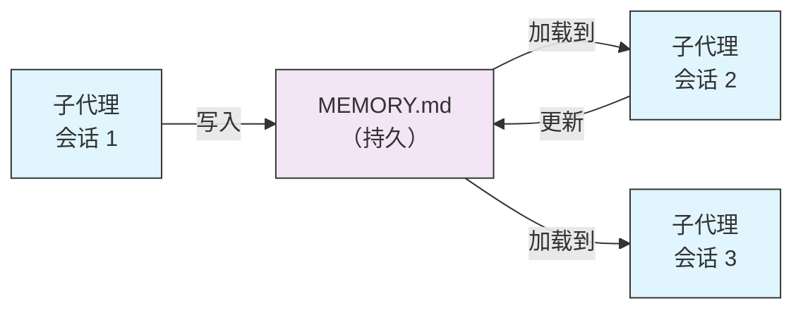
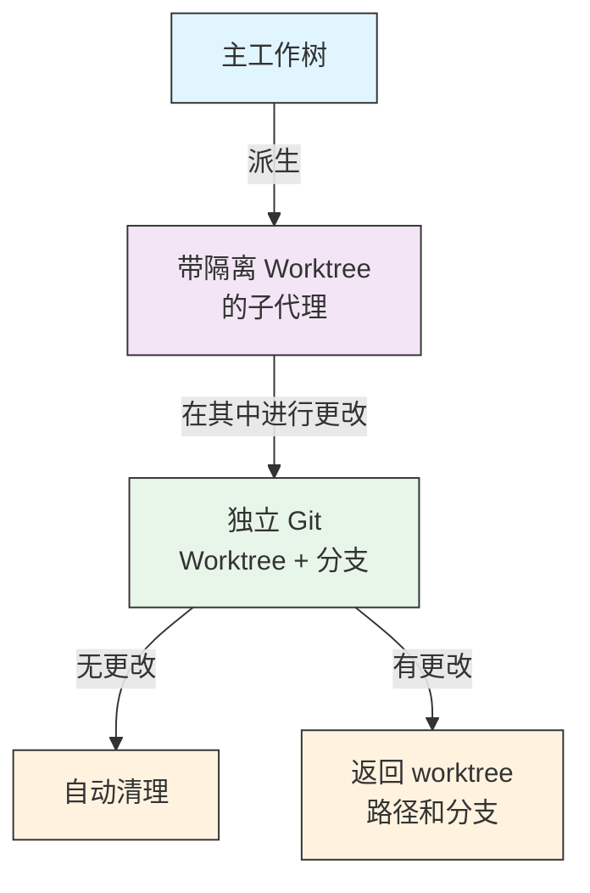
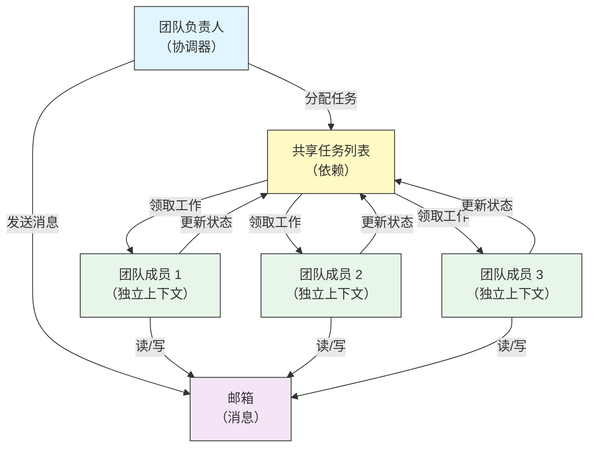
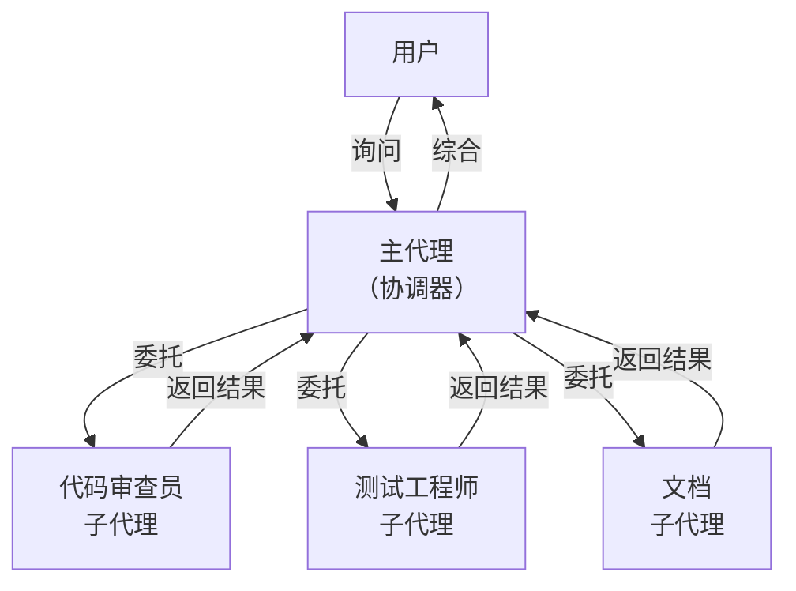
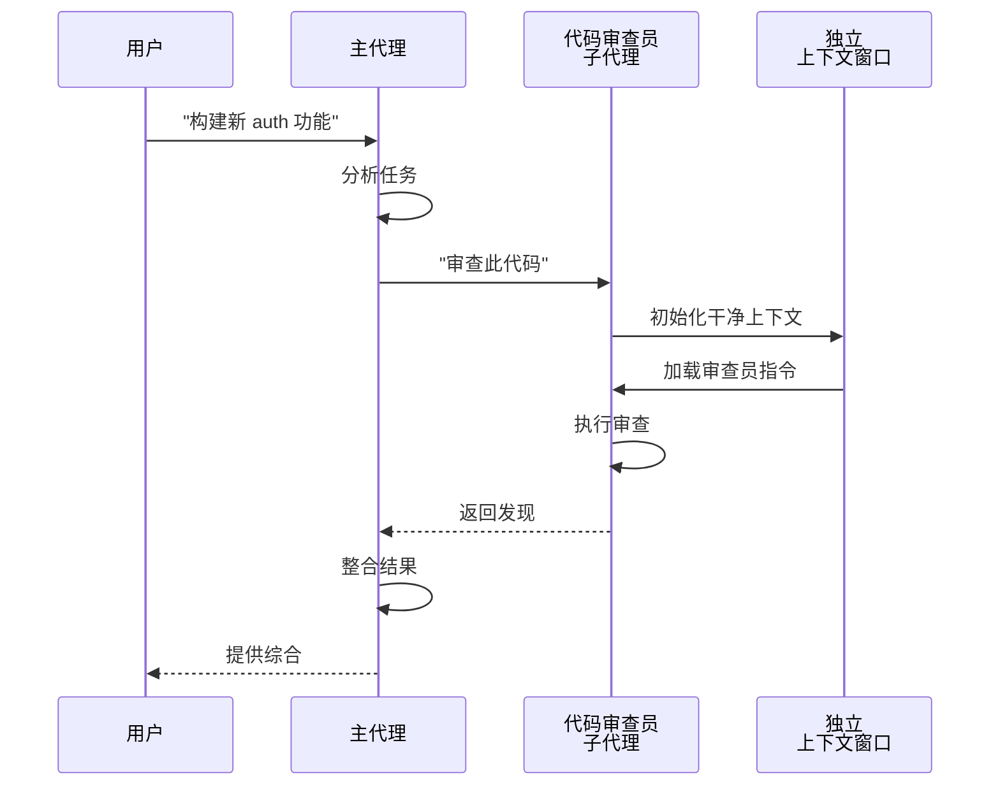
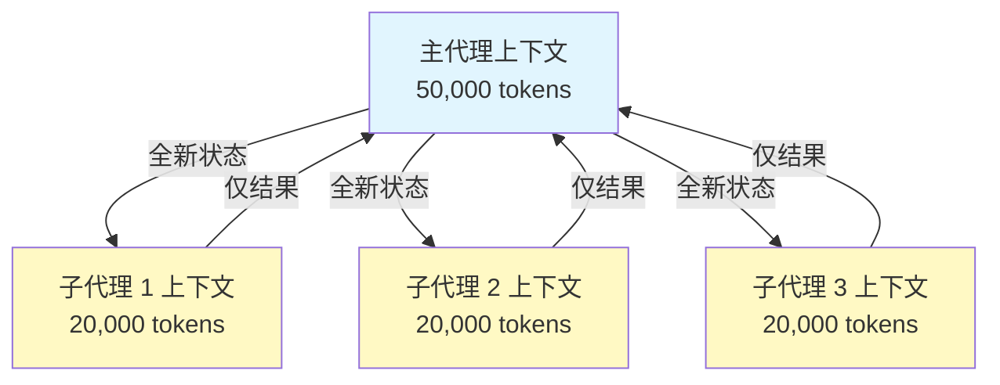
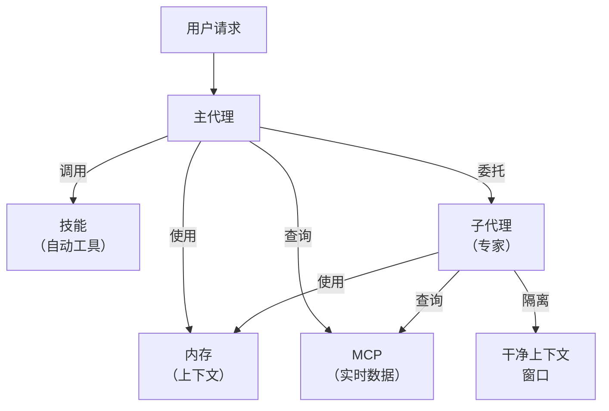

<picture>
  <source media="(prefers-color-scheme: dark)" srcset="../resources/logos/claude-howto-logo-dark.svg">
  
</picture>

# 子代理 - 完整参考指南

子代理是 Claude Code 可以委托任务的专用 AI 助手。每个子代理都有特定用途，使用独立于主对话的上下文窗口，并可以配置特定工具和自定义系统提示词。

## 目录

1. [概述](#概述)
2. [主要优势](#主要优势)
3. [文件位置](#文件位置)
4. [配置](#配置)
5. [内置子代理](#内置子代理)
6. [管理子代理](#管理子代理)
7. [使用子代理](#使用子代理)
8. [可恢复代理](#可恢复代理)
9. [链式子代理](#链式子代理)
10. [子代理的持久内存](#子代理的持久内存)
11. [后台子代理](#后台子代理)
12. [Worktree 隔离](#worktree-隔离)
13. [限制可派生子代理](#限制可派生子代理)
14. [`claude agents` CLI 命令](#claude-agents-cli-命令)
15. [代理团队（实验性）](#代理团队实验性)
16. [插件子代理安全](#插件子代理安全)
17. [架构](#架构)
18. [上下文管理](#上下文管理)
19. [何时使用子代理](#何时使用子代理)
20. [最佳实践](#最佳实践)
21. [本文件夹中的示例子代理](#本文件夹中的示例子代理)
22. [安装说明](#安装说明)
23. [相关概念](#相关概念)

---

## 概述

子代理通过以下方式在 Claude Code 中实现委托任务执行：

- 创建具有独立上下文窗口的**隔离 AI 助手**
- 为专业化专长提供**自定义系统提示词**
- 强制执行**工具访问控制**以限制能力
- 防止复杂任务造成的**上下文污染**
- 支持多个专业化任务的**并行执行**

每个子代理独立运行，从干净状态开始，只接收其任务所需的特定上下文，然后将结果返回给主代理进行综合。

**快速入门**：使用 `/agents` 命令以交互方式创建、查看、编辑和管理子代理。

---

## 主要优势

| 优势 | 描述 |
|------|------|
| **上下文保护** | 在独立上下文中运行，防止主对话的上下文污染 |
| **专业化专长** | 针对特定领域精调，成功率更高 |
| **可复用性** | 跨不同项目使用并与团队共享 |
| **灵活权限** | 不同子代理类型有不同的工具访问级别 |
| **可扩展性** | 多个代理同时处理不同方面 |

---

## 文件位置

子代理文件可以存储在多个位置，具有不同的作用域：

| 优先级 | 类型 | 位置 | 作用域 |
|--------|------|------|--------|
| 1（最高） | **CLI 定义** | 通过 `--agents` 标志（JSON） | 仅限会话 |
| 2 | **项目子代理** | `.claude/agents/` | 当前项目 |
| 3 | **用户子代理** | `~/.claude/agents/` | 所有项目 |
| 4（最低） | **插件代理** | 插件 `agents/` 目录 | 通过插件 |

存在重复名称时，高优先级来源优先。

---

## 配置

### 文件格式

子代理在 YAML frontmatter 中定义，后面是 markdown 格式的系统提示词：

```yaml
---
name: your-sub-agent-name
description: 何时调用此子代理的描述
tools: tool1, tool2, tool3  # 可选 - 省略时继承所有工具
disallowedTools: tool4  # 可选 - 明确禁止的工具
model: sonnet  # 可选 - sonnet、opus、haiku 或 inherit
permissionMode: default  # 可选 - 权限模式
maxTurns: 20  # 可选 - 限制代理轮次
skills: skill1, skill2  # 可选 - 预加载到上下文的技能
mcpServers: server1  # 可选 - 可用于子代理的 MCP 服务器
memory: user  # 可选 - 持久内存作用域（user、project、local）
background: false  # 可选 - 作为后台任务运行
effort: high  # 可选 - 推理努力程度（low、medium、high、max）
isolation: worktree  # 可选 - git worktree 隔离
initialPrompt: "从分析代码库开始"  # 可选 - 作为主代理运行时自动提交的第一轮
hooks:  # 可选 - 组件范围的钩子
  PreToolUse:
    - matcher: "Bash"
      hooks:
        - type: command
          command: "./scripts/security-check.sh"
---

子代理的系统提示词放在这里。可以是多个段落，
应清晰定义子代理的角色、能力和解决问题的方法。
```

### 配置字段

| 字段 | 必需 | 描述 |
|------|------|------|
| `name` | 是 | 唯一标识符（小写字母和连字符） |
| `description` | 是 | 用途的自然语言描述。包含"use PROACTIVELY"可鼓励自动调用 |
| `tools` | 否 | 特定工具的逗号分隔列表。省略则继承所有工具。支持 `Agent(agent_name)` 语法限制可派生的子代理 |
| `disallowedTools` | 否 | 子代理不得使用的工具的逗号分隔列表 |
| `model` | 否 | 使用的模型：`sonnet`、`opus`、`haiku`、完整模型 ID 或 `inherit`。默认为配置的子代理模型 |
| `permissionMode` | 否 | `default`、`acceptEdits`、`dontAsk`、`bypassPermissions`、`plan` |
| `maxTurns` | 否 | 子代理可以执行的最大代理轮次 |
| `skills` | 否 | 要预加载的技能逗号分隔列表。在启动时将完整技能内容注入子代理的上下文 |
| `mcpServers` | 否 | 可供子代理使用的 MCP 服务器 |
| `hooks` | 否 | 组件范围的钩子（PreToolUse、PostToolUse、Stop） |
| `memory` | 否 | 持久内存目录作用域：`user`、`project` 或 `local` |
| `background` | 否 | 设为 `true` 始终将此子代理作为后台任务运行 |
| `effort` | 否 | 推理努力程度：`low`、`medium`、`high` 或 `max` |
| `isolation` | 否 | 设为 `worktree` 为子代理提供独立的 git worktree |
| `initialPrompt` | 否 | 子代理作为主代理运行时自动提交的第一轮 |

### 工具配置选项

**选项 1：继承所有工具（省略该字段）**
```yaml
---
name: full-access-agent
description: 具有所有可用工具的代理
---
```

**选项 2：指定单个工具**
```yaml
---
name: limited-agent
description: 只有特定工具的代理
tools: Read, Grep, Glob, Bash
---
```

**选项 3：条件工具访问**
```yaml
---
name: conditional-agent
description: 具有过滤工具访问的代理
tools: Read, Bash(npm:*), Bash(test:*)
---
```

### 基于 CLI 的配置

使用 `--agents` 标志和 JSON 格式为单个会话定义子代理：

```bash
claude --agents '{
  "code-reviewer": {
    "description": "专家代码审查员。代码更改后主动使用。",
    "prompt": "你是一位高级代码审查员。专注于代码质量、安全性和最佳实践。",
    "tools": ["Read", "Grep", "Glob", "Bash"],
    "model": "sonnet"
  }
}'
```

**`--agents` 标志的 JSON 格式：**

```json
{
  "agent-name": {
    "description": "必需：何时调用此代理",
    "prompt": "必需：代理的系统提示词",
    "tools": ["可选", "工具", "数组"],
    "model": "可选: sonnet|opus|haiku"
  }
}
```

**代理定义优先级：**

代理定义按此优先级顺序加载（第一个匹配获胜）：
1. **CLI 定义** - `--agents` 标志（仅限会话，JSON）
2. **项目级** - `.claude/agents/`（当前项目）
3. **用户级** - `~/.claude/agents/`（所有项目）
4. **插件级** - 插件 `agents/` 目录

这允许 CLI 定义为单个会话覆盖所有其他来源。

---

## 内置子代理

Claude Code 包含几个始终可用的内置子代理：

| 代理 | 模型 | 用途 |
|------|------|------|
| **general-purpose** | 继承 | 复杂的多步骤任务 |
| **Plan** | 继承 | 计划模式的研究 |
| **Explore** | Haiku | 只读代码库探索（快速/中等/非常彻底） |
| **Bash** | 继承 | 在独立上下文中执行终端命令 |
| **statusline-setup** | Sonnet | 配置状态栏 |
| **Claude Code Guide** | Haiku | 回答 Claude Code 功能问题 |

### General-Purpose 子代理

| 属性 | 值 |
|------|-----|
| **模型** | 从父级继承 |
| **工具** | 所有工具 |
| **用途** | 复杂研究任务、多步骤操作、代码修改 |

**何时使用**：需要探索和修改以及复杂推理的任务。

### Plan 子代理

| 属性 | 值 |
|------|-----|
| **模型** | 从父级继承 |
| **工具** | Read、Glob、Grep、Bash |
| **用途** | 在计划模式中自动用于研究代码库 |

**何时使用**：当 Claude 需要在展示计划之前了解代码库时。

### Explore 子代理

| 属性 | 值 |
|------|-----|
| **模型** | Haiku（快速、低延迟） |
| **模式** | 严格只读 |
| **工具** | Glob、Grep、Read、Bash（仅只读命令） |
| **用途** | 快速代码库搜索和分析 |

**何时使用**：在不进行更改的情况下搜索/理解代码时。

**彻底程度级别** - 指定探索深度：
- **"quick"** - 快速搜索，探索最少，适合查找特定模式
- **"medium"** - 中等探索，速度和彻底性平衡，默认方式
- **"very thorough"** - 跨多个位置和命名约定的全面分析，可能需要更长时间

### Bash 子代理

| 属性 | 值 |
|------|-----|
| **模型** | 从父级继承 |
| **工具** | Bash |
| **用途** | 在独立上下文窗口中执行终端命令 |

**何时使用**：运行受益于隔离上下文的 shell 命令时。

### Statusline Setup 子代理

| 属性 | 值 |
|------|-----|
| **模型** | Sonnet |
| **工具** | Read、Write、Bash |
| **用途** | 配置 Claude Code 状态栏显示 |

**何时使用**：设置或自定义状态栏时。

### Claude Code Guide 子代理

| 属性 | 值 |
|------|-----|
| **模型** | Haiku（快速、低延迟） |
| **工具** | 只读 |
| **用途** | 回答有关 Claude Code 功能和使用方法的问题 |

**何时使用**：用户询问 Claude Code 如何工作或如何使用特定功能时。

---

## 管理子代理

### 使用 `/agents` 命令（推荐）

```bash
/agents
```

这提供了一个交互式菜单，可以：
- 查看所有可用子代理（内置、用户和项目）
- 通过引导式设置创建新子代理
- 编辑现有自定义子代理和工具访问
- 删除自定义子代理
- 查看当存在重复时哪些子代理处于活动状态

### 直接文件管理

```bash
# 创建项目子代理
mkdir -p .claude/agents
cat > .claude/agents/test-runner.md << 'EOF'
---
name: test-runner
description: 主动使用以运行测试并修复失败
---

你是一位测试自动化专家。当你看到代码更改时，主动
运行适当的测试。如果测试失败，分析失败原因并修复
它们，同时保持原始测试意图。
EOF

# 创建用户子代理（在所有项目中可用）
mkdir -p ~/.claude/agents
```

---

## 使用子代理

### 自动委托

Claude 根据以下内容主动委托任务：
- 请求中的任务描述
- 子代理配置中的 `description` 字段
- 当前上下文和可用工具

要鼓励主动使用，在 `description` 字段中包含"use PROACTIVELY"或"MUST BE USED"：

```yaml
---
name: code-reviewer
description: 专家代码审查专家。编写或修改代码后主动使用（use PROACTIVELY）。
---
```

### 明确调用

你可以明确请求特定子代理：

```
> 使用 test-runner 子代理修复失败的测试
> 让 code-reviewer 子代理查看我最近的更改
> 请 debugger 子代理调查此错误
```

### @-提及调用

使用 `@` 前缀保证调用特定子代理（绕过自动委托启发式）：

```
> @"code-reviewer (agent)" 审查 auth 模块
```

### 会话范围代理

使用特定代理作为主代理运行整个会话：

```bash
# 通过 CLI 标志
claude --agent code-reviewer

# 通过 settings.json
{
  "agent": "code-reviewer"
}
```

### 列出可用代理

使用 `claude agents` 命令列出所有来源的所有配置代理：

```bash
claude agents
```

---

## 可恢复代理

子代理可以在完整上下文保留的情况下继续之前的对话：

```bash
# 初始调用
> 使用 code-analyzer 代理开始审查 authentication 模块
# 返回 agentId："abc123"

# 稍后恢复代理
> 恢复代理 abc123，现在还要分析 authorization 逻辑
```

**使用场景**：
- 跨多个会话的长期研究
- 在不丢失上下文的情况下进行迭代改进
- 维护上下文的多步骤工作流

---

## 链式子代理

按顺序执行多个子代理：

```bash
> 首先使用 code-analyzer 子代理查找性能问题，
  然后使用 optimizer 子代理修复它们
```

这支持复杂工作流，其中一个子代理的输出可以作为另一个的输入。

---

## 子代理的持久内存

`memory` 字段为子代理提供跨对话持续的持久目录。这允许子代理随时间积累知识，存储在会话之间持续存在的笔记、发现和上下文。

### 内存作用域

| 作用域 | 目录 | 使用场景 |
|--------|------|---------|
| `user` | `~/.claude/agent-memory/<name>/` | 跨所有项目的个人笔记和偏好 |
| `project` | `.claude/agent-memory/<name>/` | 与团队共享的项目特定知识 |
| `local` | `.claude/agent-memory-local/<name>/` | 未提交到版本控制的本地项目知识 |

### 工作原理

- 内存目录中 `MEMORY.md` 的前 200 行自动加载到子代理的系统提示词中
- `Read`、`Write` 和 `Edit` 工具自动为子代理启用以管理其内存文件
- 子代理可以根据需要在其内存目录中创建额外文件

### 示例配置

```yaml
---
name: researcher
memory: user
---

你是一位研究助手。使用内存目录存储发现，
跨会话跟踪进度，并随时间积累知识。

在每次会话开始时检查你的 MEMORY.md 文件以回忆之前的上下文。
```



---

## 后台子代理

子代理可以在后台运行，释放主对话用于其他任务。

### 配置

在 frontmatter 中设置 `background: true`，始终将子代理作为后台任务运行：

```yaml
---
name: long-runner
background: true
description: 在后台执行长时间运行的分析任务
---
```

### 键盘快捷键

| 快捷键 | 操作 |
|--------|------|
| `Ctrl+B` | 将当前运行的子代理任务移到后台 |
| `Ctrl+F` | 终止所有后台代理（按两次确认） |

### 禁用后台任务

设置环境变量以完全禁用后台任务支持：

```bash
export CLAUDE_CODE_DISABLE_BACKGROUND_TASKS=1
```

---

## Worktree 隔离

`isolation: worktree` 设置为子代理提供独立的 git worktree，允许其独立进行更改而不影响主工作树。

### 配置

```yaml
---
name: feature-builder
isolation: worktree
description: 在隔离的 git worktree 中实现功能
tools: Read, Write, Edit, Bash, Grep, Glob
---
```

### 工作原理



- 子代理在独立分支上的 git worktree 中操作
- 如果子代理未做更改，worktree 将自动清理
- 如果存在更改，worktree 路径和分支名称将返回给主代理以供审查或合并

---

## 限制可派生子代理

你可以通过在 `tools` 字段中使用 `Agent(agent_type)` 语法来控制给定子代理允许派生哪些子代理。这提供了一种为委托设置特定子代理白名单的方法。

> **注意**：在 v2.1.63 中，`Task` 工具重命名为 `Agent`。现有的 `Task(...)` 引用仍然作为别名有效。

### 示例

```yaml
---
name: coordinator
description: 协调专业代理之间的工作
tools: Agent(worker, researcher), Read, Bash
---

你是一个协调器代理。你只能将工作委托给"worker"和
"researcher"子代理。使用 Read 和 Bash 进行自己的探索。
```

在此示例中，`coordinator` 子代理只能派生 `worker` 和 `researcher` 子代理。即使在其他地方定义了其他子代理，它也无法派生它们。

---

## `claude agents` CLI 命令

`claude agents` 命令列出按来源（内置、用户级、项目级）分组的所有配置代理：

```bash
claude agents
```

此命令：
- 显示所有来源的所有可用代理
- 按来源位置对代理分组
- 当较高优先级的代理覆盖较低级别的代理时显示**覆盖**提示（例如，与用户级代理同名的项目级代理）

---

## 代理团队（实验性）

代理团队协调多个 Claude Code 实例共同处理复杂任务。与子代理（委托的子任务返回结果）不同，团队成员独立工作，有自己的上下文，通过共享邮箱系统直接通信。

> **注意**：代理团队是实验性功能，需要 Claude Code v2.1.32+。使用前需先启用。

### 子代理与代理团队的比较

| 方面 | 子代理 | 代理团队 |
|------|--------|---------|
| **委托模型** | 父级委托子任务，等待结果 | 团队负责人分配工作，团队成员独立执行 |
| **上下文** | 每个子任务有新鲜上下文，结果提炼回来 | 每个团队成员维护自己的持久上下文 |
| **协调** | 顺序或并行，由父级管理 | 带自动依赖管理的共享任务列表 |
| **通信** | 仅返回值 | 通过邮箱进行代理间消息传递 |
| **会话恢复** | 支持 | 进程内团队成员不支持 |
| **最适合** | 有明确定义的专注子任务 | 需要并行工作的大型多文件项目 |

### 启用代理团队

设置环境变量或将其添加到 `settings.json`：

```bash
export CLAUDE_CODE_EXPERIMENTAL_AGENT_TEAMS=1
```

或在 `settings.json` 中：

```json
{
  "env": {
    "CLAUDE_CODE_EXPERIMENTAL_AGENT_TEAMS": "1"
  }
}
```

### 启动团队

启用后，在提示词中要求 Claude 与团队成员合作：

```
用户：构建 authentication 模块。使用团队——一个成员负责 API 端点，
      一个负责数据库模式，一个负责测试套件。
```

Claude 将自动创建团队、分配任务并协调工作。

### 显示模式

控制团队成员活动的显示方式：

| 模式 | 标志 | 描述 |
|------|------|------|
| **自动** | `--teammate-mode auto` | 自动为终端选择最佳显示模式 |
| **进程内** | `--teammate-mode in-process` | 在当前终端内联显示团队成员输出（默认） |
| **分屏** | `--teammate-mode tmux` | 在独立 tmux 或 iTerm2 窗格中打开每个团队成员 |

```bash
claude --teammate-mode tmux
```

也可以在 `settings.json` 中设置显示模式：

```json
{
  "teammateMode": "tmux"
}
```

> **注意**：分屏模式需要 tmux 或 iTerm2。不适用于 VS Code 终端、Windows Terminal 或 Ghostty。

### 导航

在分屏模式中使用 `Shift+Down` 在团队成员之间导航。

### 团队配置

团队配置存储在 `~/.claude/teams/{team-name}/config.json`。

### 架构



**关键组件**：

- **团队负责人**：创建团队、分配任务和协调的主 Claude Code 会话
- **共享任务列表**：具有自动依赖跟踪的任务同步列表
- **邮箱**：团队成员交流状态和协调的代理间消息系统
- **团队成员**：独立的 Claude Code 实例，各有自己的上下文窗口

### 任务分配和消息传递

团队负责人将工作分解为任务并分配给团队成员。共享任务列表处理：

- **自动依赖管理** — 任务等待其依赖完成
- **状态跟踪** — 团队成员在工作时更新任务状态
- **代理间消息传递** — 团队成员通过邮箱发送消息进行协调（例如"数据库模式已就绪，你可以开始编写查询了"）

### 计划审批工作流

对于复杂任务，团队负责人在团队成员开始工作之前创建执行计划。用户审查并批准计划，确保团队的方法在进行任何代码更改之前符合预期。

### 团队的钩子事件

代理团队引入了两个额外的[钩子事件](../06-hooks/)：

| 事件 | 触发时机 | 使用场景 |
|------|---------|---------|
| `TeammateIdle` | 团队成员完成当前任务且没有待处理工作时 | 触发通知、分配后续任务 |
| `TaskCompleted` | 共享任务列表中的任务标记为完成时 | 运行验证、更新仪表板、链式处理依赖工作 |

### 最佳实践

- **团队规模**：保持 3-5 名团队成员以实现最优协调
- **任务大小**：将工作分解为每个 5-15 分钟的任务——足够小以并行化，足够大以有意义
- **避免文件冲突**：将不同文件或目录分配给不同团队成员以防止合并冲突
- **从简单开始**：首次使用进程内模式；熟悉后切换到分屏模式
- **清晰的任务描述**：提供具体、可操作的任务描述，让团队成员能够独立工作

### 限制

- **实验性**：功能行为可能在未来版本中更改
- **无会话恢复**：进程内团队成员在会话结束后无法恢复
- **每个会话一个团队**：无法在单个会话中创建嵌套团队或多个团队
- **固定领导**：团队负责人角色无法转让给团队成员
- **分屏限制**：需要 tmux/iTerm2；不适用于 VS Code 终端、Windows Terminal 或 Ghostty
- **无跨会话团队**：团队成员仅存在于当前会话中

> **警告**：代理团队是实验性的。先用非关键工作进行测试，并监控团队成员的协调以防意外行为。

---

## 插件子代理安全

出于安全考虑，插件提供的子代理具有受限的 frontmatter 功能。以下字段在插件子代理定义中**不允许**：

- `hooks` - 不能定义生命周期钩子
- `mcpServers` - 不能配置 MCP 服务器
- `permissionMode` - 不能覆盖权限设置

这可以防止插件通过子代理钩子提升权限或执行任意命令。

---

## 架构

### 高级架构



### 子代理生命周期



---

## 上下文管理



### 关键点

- 每个子代理获得**全新的上下文窗口**，不含主对话历史
- 只有**相关上下文**传递给子代理用于其特定任务
- 结果**提炼**回主代理
- 这防止了长期项目中的**上下文 token 耗尽**

### 性能考虑

- **上下文效率** - 代理保护主上下文，支持更长的会话
- **延迟** - 子代理从干净状态开始，在收集初始上下文时可能增加延迟

### 关键行为

- **不支持嵌套派生** - 子代理无法派生其他子代理
- **后台权限** - 后台子代理自动拒绝任何未预先批准的权限
- **后台化** - 按 `Ctrl+B` 将当前运行的任务移到后台
- **转录** - 子代理转录存储在 `~/.claude/projects/{project}/{sessionId}/subagents/agent-{agentId}.jsonl`
- **自动压缩** - 子代理上下文在约 95% 容量时自动压缩（用 `CLAUDE_AUTOCOMPACT_PCT_OVERRIDE` 环境变量覆盖）

---

## 何时使用子代理

| 场景 | 使用子代理 | 原因 |
|------|-----------|------|
| 有很多步骤的复杂功能 | 是 | 分离关注点，防止上下文污染 |
| 快速代码审查 | 否 | 不必要的开销 |
| 并行任务执行 | 是 | 每个子代理有自己的上下文 |
| 需要专业化专长 | 是 | 自定义系统提示词 |
| 长时间运行的分析 | 是 | 防止主上下文耗尽 |
| 单一任务 | 否 | 不必要地增加延迟 |

---

## 最佳实践

### 设计原则

**应该做：**
- 从 Claude 生成代理开始 - 用 Claude 生成初始子代理，然后迭代定制
- 设计专注的子代理 - 单一、清晰的职责而非一个做所有事情
- 编写详细的提示词 - 包含具体指令、示例和约束
- 限制工具访问 - 只授予子代理用途所需的工具
- 版本控制 - 将项目子代理检入版本控制以供团队协作

**不应该做：**
- 创建具有相同角色的重叠子代理
- 给子代理不必要的工具访问
- 对简单的单步任务使用子代理
- 在一个子代理的提示词中混合关注点
- 忘记传递必要的上下文

### 系统提示词最佳实践

1. **明确定义角色**
   ```
   你是专门从事 [特定领域] 的专家代码审查员
   ```

2. **清晰定义优先级**
   ```
   审查优先级（按顺序）：
   1. 安全问题
   2. 性能问题
   3. 代码质量
   ```

3. **指定输出格式**
   ```
   对于每个问题提供：严重性、类别、位置、描述、修复、影响
   ```

4. **包含操作步骤**
   ```
   调用时：
   1. 运行 git diff 查看最近更改
   2. 专注于修改的文件
   3. 立即开始审查
   ```

### 工具访问策略

1. **从限制性开始**：只从基本工具开始
2. **仅在需要时扩展**：根据需求添加工具
3. **尽可能只读**：对分析代理使用 Read/Grep
4. **沙箱化执行**：将 Bash 命令限制为特定模式

---

## 本文件夹中的示例子代理

此文件夹包含即用型示例子代理：

### 1. 代码审查员（`code-reviewer.md`）

**用途**：全面的代码质量和可维护性分析

**工具**：Read、Grep、Glob、Bash

**专业化**：
- 安全漏洞检测
- 性能优化识别
- 代码可维护性评估
- 测试覆盖率分析

**何时使用**：需要专注于质量和安全的自动化代码审查时

---

### 2. 测试工程师（`test-engineer.md`）

**用途**：测试策略、覆盖率分析和自动化测试

**工具**：Read、Write、Bash、Grep

**专业化**：
- 单元测试创建
- 集成测试设计
- 边缘情况识别
- 覆盖率分析（>80% 目标）

**何时使用**：需要全面的测试套件创建或覆盖率分析时

---

### 3. 文档编写员（`documentation-writer.md`）

**用途**：技术文档、API 文档和用户指南

**工具**：Read、Write、Grep

**专业化**：
- API 端点文档
- 用户指南创建
- 架构文档
- 代码注释改进

**何时使用**：需要创建或更新项目文档时

---

### 4. 安全审查员（`secure-reviewer.md`）

**用途**：最小权限的安全专注代码审查

**工具**：Read、Grep

**专业化**：
- 安全漏洞检测
- 认证/授权问题
- 数据暴露风险
- 注入攻击识别

**何时使用**：需要在没有修改能力的情况下进行安全审计时

---

### 5. 实现代理（`implementation-agent.md`）

**用途**：功能开发的完整实现能力

**工具**：Read、Write、Edit、Bash、Grep、Glob

**专业化**：
- 功能实现
- 代码生成
- 构建和测试执行
- 代码库修改

**何时使用**：需要子代理端到端实现功能时

---

### 6. 调试器（`debugger.md`）

**用途**：错误、测试失败和意外行为的调试专家

**工具**：Read、Edit、Bash、Grep、Glob

**专业化**：
- 根本原因分析
- 错误调查
- 测试失败解决
- 最小修复实现

**何时使用**：遇到 bug、错误或意外行为时

---

### 7. 数据科学家（`data-scientist.md`）

**用途**：SQL 查询和数据洞察的数据分析专家

**工具**：Bash、Read、Write

**专业化**：
- SQL 查询优化
- BigQuery 操作
- 数据分析和可视化
- 统计洞察

**何时使用**：需要数据分析、SQL 查询或 BigQuery 操作时

---

## 安装说明

### 方法 1：使用 /agents 命令（推荐）

```bash
/agents
```

然后：
1. 选择"创建新代理"
2. 选择项目级或用户级
3. 详细描述你的子代理
4. 选择要授权访问的工具（或留空继承所有工具）
5. 保存并使用

### 方法 2：复制到项目

将代理文件复制到项目的 `.claude/agents/` 目录：

```bash
# 导航到你的项目
cd /path/to/your/project

# 如果不存在，创建代理目录
mkdir -p .claude/agents

# 从此文件夹复制所有代理文件
cp /path/to/04-subagents/*.md .claude/agents/

# 删除 README（.claude/agents 中不需要）
rm .claude/agents/README.md
```

### 方法 3：复制到用户目录

对于在所有项目中可用的代理：

```bash
# 创建用户代理目录
mkdir -p ~/.claude/agents

# 复制代理
cp /path/to/04-subagents/code-reviewer.md ~/.claude/agents/
cp /path/to/04-subagents/debugger.md ~/.claude/agents/
# ... 根据需要复制其他代理
```

### 验证

安装后，验证代理已被识别：

```bash
/agents
```

你应该看到安装的代理与内置代理一起列出。

---

## 文件结构

```
project/
├── .claude/
│   └── agents/
│       ├── code-reviewer.md
│       ├── test-engineer.md
│       ├── documentation-writer.md
│       ├── secure-reviewer.md
│       ├── implementation-agent.md
│       ├── debugger.md
│       └── data-scientist.md
└── ...
```

---

## 相关概念

### 相关功能

- **[斜杠命令](../01-slash-commands/)** - 用户快速调用的快捷方式
- **[内存](../02-memory/)** - 跨会话的持久上下文
- **[技能](../03-skills/)** - 可复用的自主能力
- **[MCP 协议](../05-mcp/)** - 实时外部数据访问
- **[钩子](../06-hooks/)** - 事件驱动的 shell 命令自动化
- **[插件](../07-plugins/)** - 捆绑扩展包

### 与其他功能的比较

| 功能 | 用户调用 | 自动调用 | 持久性 | 外部访问 | 隔离上下文 |
|------|---------|---------|--------|---------|-----------|
| **斜杠命令** | 是 | 否 | 否 | 否 | 否 |
| **子代理** | 是 | 是 | 否 | 否 | 是 |
| **内存** | 自动 | 自动 | 是 | 否 | 否 |
| **MCP** | 自动 | 是 | 否 | 是 | 否 |
| **技能** | 是 | 是 | 否 | 否 | 否 |

### 集成模式



---

## 其他资源

- [官方子代理文档](https://code.claude.com/docs/en/sub-agents)
- [CLI 参考](https://code.claude.com/docs/en/cli-reference) - `--agents` 标志和其他 CLI 选项
- [插件指南](../07-plugins/) - 用于将代理与其他功能捆绑
- [技能指南](../03-skills/) - 用于自动调用的能力
- [内存指南](../02-memory/) - 用于持久上下文
- [钩子指南](../06-hooks/) - 用于事件驱动的自动化

---

*最后更新：2026年3月*

*本指南涵盖 Claude Code 的完整子代理配置、委托模式和最佳实践。*
