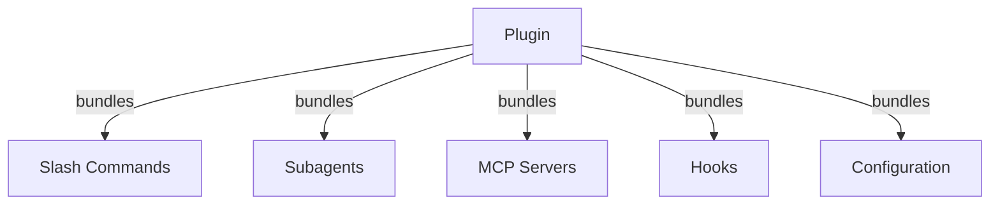
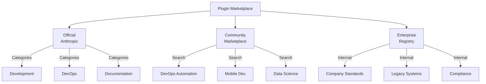
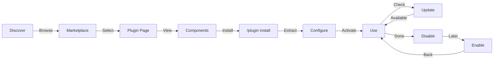

# Claude Code Plugins

This folder contains complete plugin examples that bundle multiple Claude Code features into cohesive, installable packages.

## Overview

Claude Code Plugins are bundled collections of customizations (slash commands, subagents, MCP servers, and hooks) that install with a single command. They represent the highest-level extension mechanism—combining multiple features into cohesive, shareable packages.

## Plugin Architecture



## Plugin Loading Process

```mermaid
sequenceDiagram
    participant User
    participant Claude as Claude Code
    participant Plugin as Plugin Marketplace
    participant Install as Installation
    participant SlashCmds as Slash Commands
    participant Subagents
    participant MCPServers as MCP Servers
    participant Hooks
    participant Tools as Configured Tools

    User->>Claude: /plugin install pr-review
    Claude->>Plugin: Download plugin manifest
    Plugin-->>Claude: Return plugin definition
    Claude->>Install: Extract components
    Install->>SlashCmds: Configure
    Install->>Subagents: Configure
    Install->>MCPServers: Configure
    Install->>Hooks: Configure
    SlashCmds-->>Tools: Ready to use
    Subagents-->>Tools: Ready to use
    MCPServers-->>Tools: Ready to use
    Hooks-->>Tools: Ready to use
    Tools-->>Claude: Plugin installed ✅
```



## Plugin Types & Distribution

| Type | Scope | Shared | Authority | Examples |
|------|-------|--------|-----------|----------|
| Official | Global | All users | Anthropic | PR Review, Security Guidance |
| Community | Public | All users | Community | DevOps, Data Science |
| Organization | Internal | Team members | Company | Internal standards, tools |
| Personal | Individual | Single user | Developer | Custom workflows |

## Plugin Definition Structure

```yaml
---
name: plugin-name
version: "1.0.0"
description: "What this plugin does"
author: "Your Name"
license: MIT

# Plugin metadata
tags:
  - category
  - use-case

# Requirements
requires:
  - claude-code: ">=1.0.0"

# Components bundled
components:
  - type: commands
    path: commands/
  - type: agents
    path: agents/
  - type: mcp
    path: mcp/
  - type: hooks
    path: hooks/

# Configuration
config:
  auto_load: true
  enabled_by_default: true
---
```

## Plugin Structure Example

```
my-plugin/
├── plugin.yaml
├── commands/
│   ├── task-1.md
│   ├── task-2.md
│   └── workflows/
├── agents/
│   ├── specialist-1.md
│   ├── specialist-2.md
│   └── configs/
├── mcp/
│   ├── mcp-config.json
│   └── servers/
├── hooks/
│   ├── pre-deploy.js
│   └── post-merge.js
├── templates/
│   └── issue-template.md
├── scripts/
│   ├── helper-1.sh
│   └── helper-2.py
├── docs/
│   ├── README.md
│   └── USAGE.md
└── tests/
    └── plugin.test.js
```

## Practical Examples

### Example 1: PR Review Plugin

**File:** `plugin.yaml`

```yaml
---
name: pr-review
version: "1.0.0"
description: Complete PR review workflow with security, testing, and docs
author: Anthropic
tags:
  - code-review
  - quality
  - security

components:
  - type: commands
    path: commands/
  - type: agents
    path: agents/
  - type: mcp
    path: mcp/
  - type: hooks
    path: hooks/
---
```

**File:** `commands/review-pr.md`

```markdown
---
name: Review PR
description: Start comprehensive PR review with security and testing checks
---

# PR Review

This command initiates a complete pull request review including:

1. Security analysis
2. Test coverage verification
3. Documentation updates
4. Code quality checks
5. Performance impact assessment
```

**File:** `agents/security-reviewer.md`

```yaml
---
name: security-reviewer
description: Security-focused code review
tools: read, grep, diff
---

# Security Reviewer

Specializes in finding security vulnerabilities:
- Authentication/authorization issues
- Data exposure
- Injection attacks
- Secure configuration
```

**Installation:**

```bash
/plugin install pr-review

# Result:
# ✅ 3 slash commands installed
# ✅ 3 subagents configured
# ✅ 2 MCP servers connected
# ✅ 4 hooks registered
# ✅ Ready to use!
```

### Example 2: DevOps Plugin

**Components:**

```
devops-automation/
├── commands/
│   ├── deploy.md
│   ├── rollback.md
│   ├── status.md
│   └── incident.md
├── agents/
│   ├── deployment-specialist.md
│   ├── incident-commander.md
│   └── alert-analyzer.md
├── mcp/
│   ├── github-config.json
│   ├── kubernetes-config.json
│   └── prometheus-config.json
├── hooks/
│   ├── pre-deploy.js
│   ├── post-deploy.js
│   └── on-error.js
└── scripts/
    ├── deploy.sh
    ├── rollback.sh
    └── health-check.sh
```

### Example 3: Documentation Plugin

**Bundled Components:**

```
documentation/
├── commands/
│   ├── generate-api-docs.md
│   ├── generate-readme.md
│   ├── sync-docs.md
│   └── validate-docs.md
├── agents/
│   ├── api-documenter.md
│   ├── code-commentator.md
│   └── example-generator.md
├── mcp/
│   ├── github-docs-config.json
│   └── slack-announce-config.json
└── templates/
    ├── api-endpoint.md
    ├── function-docs.md
    └── adr-template.md
```

## Plugin Marketplace



## Plugin Installation & Lifecycle



## Plugin Features Comparison

| Feature | Slash Command | Skill | Subagent | Plugin |
|---------|---------------|-------|----------|--------|
| **Installation** | Manual copy | Manual copy | Manual config | One command |
| **Setup Time** | 5 minutes | 10 minutes | 15 minutes | 2 minutes |
| **Bundling** | Single file | Single file | Single file | Multiple |
| **Versioning** | Manual | Manual | Manual | Automatic |
| **Team Sharing** | Copy file | Copy file | Copy file | Install ID |
| **Updates** | Manual | Manual | Manual | Auto-available |
| **Dependencies** | None | None | None | May include |
| **Marketplace** | No | No | No | Yes |
| **Distribution** | Repository | Repository | Repository | Marketplace |

## Installation Methods

### Official Plugin
```bash
/plugin install plugin-name
```

### Local Plugin (for development)
```bash
/plugin install ./path/to/plugin
```

### From Git Repository
```bash
/plugin install github:username/repo
```

## When to Create a Plugin

```mermaid
graph TD
    A["Should I create a plugin?"]
    A -->|Need multiple components| B{"Multiple commands<br/>or subagents<br/>or MCPs?"}
    B -->|Yes| C["✅ Create Plugin"]
    B -->|No| D["Use Individual Feature"]
    A -->|Team workflow| E{"Share with<br/>team?"}
    E -->|Yes| C
    E -->|No| F["Keep as Local Setup"]
    A -->|Complex setup| G{"Needs auto<br/>configuration?"}
    G -->|Yes| C
    G -->|No| D
```



### Plugin Use Cases

| Use Case | Recommendation | Why |
|----------|-----------------|-----|
| **Team Onboarding** | ✅ Use Plugin | Instant setup, all configurations |
| **Framework Setup** | ✅ Use Plugin | Bundles framework-specific commands |
| **Enterprise Standards** | ✅ Use Plugin | Central distribution, version control |
| **Quick Task Automation** | ❌ Use Command | Overkill complexity |
| **Single Domain Expertise** | ❌ Use Skill | Too heavy, use skill instead |
| **Specialized Analysis** | ❌ Use Subagent | Create manually or use skill |
| **Live Data Access** | ❌ Use MCP | Standalone, don't bundle |

## Publishing a Plugin

**Steps to publish:**

1. Create plugin structure with all components
2. Write `plugin.yaml` manifest
3. Create `README.md` with documentation
4. Test locally with `/plugin install ./my-plugin`
5. Submit to plugin marketplace
6. Get reviewed and approved
7. Published on marketplace
8. Users can install with one command

**Example submission:**

```markdown
# PR Review Plugin

## Description
Complete PR review workflow with security, testing, and documentation checks.

## What's Included
- 3 slash commands for different review types
- 3 specialized subagents
- GitHub and CodeQL MCP integration
- Automated security scanning hooks

## Installation
```bash
/plugin install pr-review
```

## Features
✅ Security analysis
✅ Test coverage checking
✅ Documentation verification
✅ Code quality assessment
✅ Performance impact analysis

## Usage
```bash
/review-pr
/check-security
/check-tests
```

## Requirements
- Claude Code 1.0+
- GitHub access
- CodeQL (optional)
```

## Plugin vs Manual Configuration

**Manual Setup (2+ hours):**
- Install slash commands one by one
- Create subagents individually
- Configure MCPs separately
- Set up hooks manually
- Document everything
- Share with team (hope they configure correctly)

**With Plugin (2 minutes):**
```bash
/plugin install pr-review
# ✅ Everything installed and configured
# ✅ Ready to use immediately
# ✅ Team can reproduce exact setup
```

## Best Practices

### Do's ✅
- Use clear, descriptive plugin names
- Include comprehensive README
- Version your plugin properly (semver)
- Test all components together
- Document requirements clearly
- Provide usage examples
- Include error handling
- Tag appropriately for discovery
- Maintain backward compatibility
- Keep plugins focused and cohesive
- Include comprehensive tests
- Document all dependencies

### Don'ts ❌
- Don't bundle unrelated features
- Don't hardcode credentials
- Don't skip testing
- Don't forget documentation
- Don't create redundant plugins
- Don't ignore versioning
- Don't overcomplicate component dependencies
- Don't forget to handle errors gracefully

## Installation Instructions

### Installing from Marketplace

1. **Browse available plugins:**
   ```bash
   /plugin list
   ```

2. **View plugin details:**
   ```bash
   /plugin info plugin-name
   ```

3. **Install a plugin:**
   ```bash
   /plugin install plugin-name
   ```

### Installing from Local Path

```bash
/plugin install ./path/to/plugin-directory
```

### Installing from GitHub

```bash
/plugin install github:username/repo
```

### Listing Installed Plugins

```bash
/plugin list --installed
```

### Updating a Plugin

```bash
/plugin update plugin-name
```

### Disabling/Enabling a Plugin

```bash
# Temporarily disable
/plugin disable plugin-name

# Re-enable
/plugin enable plugin-name
```

### Uninstalling a Plugin

```bash
/plugin uninstall plugin-name
```

## Related Concepts

The following Claude Code features work together with plugins:

- **[Slash Commands](../01-slash-commands/)** - Individual commands bundled in plugins
- **[Memory](../02-memory/)** - Persistent context for plugins
- **[Skills](../03-skills/)** - Domain expertise that can be wrapped into plugins
- **[Subagents](../04-subagents/)** - Specialized agents included as plugin components
- **[MCP Servers](../05-mcp/)** - Model Context Protocol integrations bundled in plugins
- **[Hooks](../06-hooks/)** - Event handlers that trigger plugin workflows

## Complete Example Workflow

### PR Review Plugin Full Workflow

```
1. User: /review-pr

2. Plugin executes:
   ├── pre-review.js hook validates git repo
   ├── GitHub MCP fetches PR data
   ├── security-reviewer subagent analyzes security
   ├── test-checker subagent verifies coverage
   └── performance-analyzer subagent checks performance

3. Results synthesized and presented:
   ✅ Security: No critical issues
   ⚠️  Testing: Coverage 65% (recommend 80%+)
   ✅ Performance: No significant impact
   📝 12 recommendations provided
```

## Troubleshooting

### Plugin Won't Install
- Check Claude Code version compatibility: `/version`
- Verify `plugin.yaml` syntax with `yaml` validator
- Check internet connection (for remote plugins)
- Review permissions: `ls -la plugin/`

### Components Not Loading
- Verify paths in `plugin.yaml` match actual directory structure
- Check file permissions: `chmod +x scripts/`
- Review component file syntax
- Check logs: `/plugin debug plugin-name`

### MCP Connection Failed
- Verify environment variables are set correctly
- Check MCP server installation and health
- Test MCP connection independently with `/mcp test`
- Review MCP configuration in `mcp/` directory

### Commands Not Available After Install
- Ensure plugin was installed successfully: `/plugin list --installed`
- Check if plugin is enabled: `/plugin status plugin-name`
- Restart Claude Code: `exit` and reopen
- Check for naming conflicts with existing commands

### Hook Execution Issues
- Verify hook files have correct permissions
- Check hook syntax and event names
- Review hook logs for error details
- Test hooks manually if possible

## Additional Resources

- [Claude Code Documentation](https://docs.claude.com/claude-code)
- [Plugin Marketplace](https://plugins.claude.com)
- [Official Plugin Examples](https://github.com/anthropic/claude-plugins)
- [Plugin Development Guide](https://docs.claude.com/plugins/development)
- [MCP Server Reference](https://spec.modelcontextprotocol.io/)
- [Subagent Configuration Guide](../04-subagents/README.md)
- [Hook System Reference](../06-hooks/README.md)
