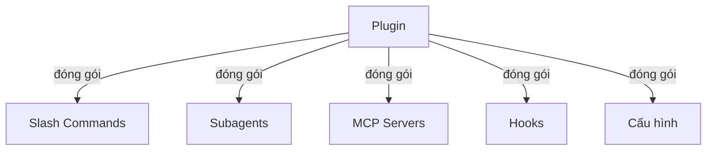
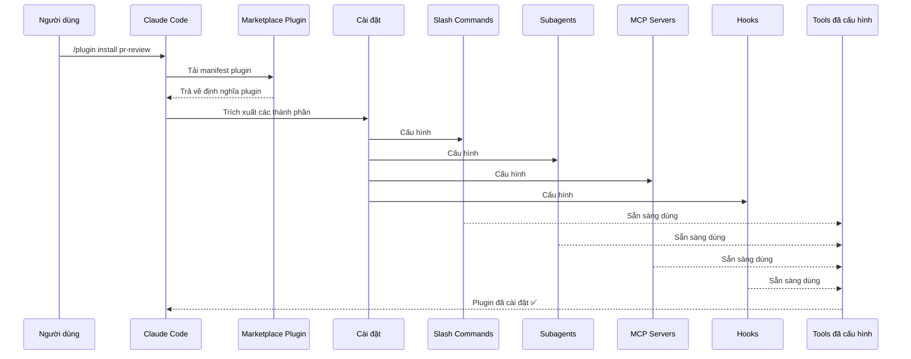
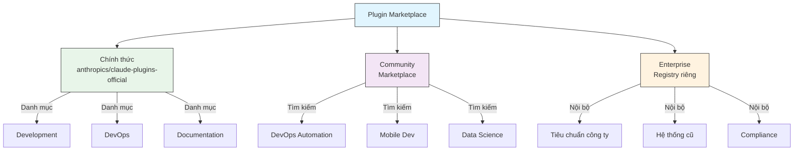
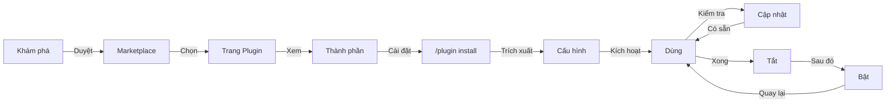
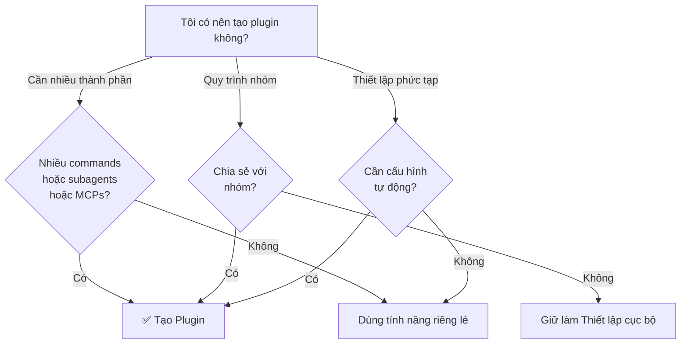

<picture>
  <source media="(prefers-color-scheme: dark)" srcset="../resources/logos/claude-howto-logo-dark.svg">
  
</picture>

# Claude Code Plugins

Thư mục này chứa các ví dụ plugin hoàn chỉnh kết hợp nhiều tính năng Claude Code thành các gói có thể cài đặt nhất quán.

## Tổng quan

Claude Code Plugins là các bộ tùy chỉnh được đóng gói (slash commands, subagents, MCP servers và hooks) được cài đặt bằng một lệnh duy nhất. Chúng đại diện cho cơ chế mở rộng cao nhất — kết hợp nhiều tính năng thành các gói có thể chia sẻ nhất quán.

## Kiến trúc Plugin



## Quy trình tải Plugin



## Loại & Phân phối Plugin

| Loại | Phạm vi | Chia sẻ | Thẩm quyền | Ví dụ |
|------|---------|---------|-----------|-------|
| Official | Toàn cầu | Tất cả user | Anthropic | PR Review, Security Guidance |
| Community | Công khai | Tất cả user | Cộng đồng | DevOps, Data Science |
| Organization | Nội bộ | Thành viên nhóm | Công ty | Tiêu chuẩn nội bộ, tools |
| Personal | Cá nhân | Người dùng đơn | Developer | Quy trình tùy chỉnh |

## Cấu trúc định nghĩa Plugin

Manifest plugin dùng định dạng JSON trong `.claude-plugin/plugin.json`:

```json
{
  "name": "my-first-plugin",
  "description": "Plugin chào hỏi",
  "version": "1.0.0",
  "author": {
    "name": "Tên của bạn"
  },
  "homepage": "https://example.com",
  "repository": "https://github.com/user/repo",
  "license": "MIT"
}
```

## Ví dụ cấu trúc Plugin

```
my-plugin/
├── .claude-plugin/
│   └── plugin.json       # Manifest (name, description, version, author)
├── commands/             # Skills dạng file Markdown
│   ├── task-1.md
│   ├── task-2.md
│   └── workflows/
├── agents/               # Định nghĩa agent tùy chỉnh
│   ├── specialist-1.md
│   ├── specialist-2.md
│   └── configs/
├── skills/               # Agent Skills với file SKILL.md
│   ├── skill-1.md
│   └── skill-2.md
├── hooks/                # Event handlers trong hooks.json
│   └── hooks.json
├── .mcp.json             # Cấu hình MCP server
├── .lsp.json             # Cấu hình LSP server
├── settings.json         # Cài đặt mặc định
├── templates/
│   └── issue-template.md
├── scripts/
│   ├── helper-1.sh
│   └── helper-2.py
├── docs/
│   ├── README.md
│   └── USAGE.md
└── tests/
    └── plugin.test.js
```

### Cấu hình LSP server

Plugins có thể bao gồm hỗ trợ Language Server Protocol (LSP) để cung cấp thông tin code thời gian thực. LSP servers cung cấp diagnostics, điều hướng code và thông tin symbol khi bạn làm việc.

**Vị trí cấu hình**:
- File `.lsp.json` trong thư mục gốc plugin
- Khóa `lsp` nội tuyến trong `plugin.json`

#### Tham chiếu trường

| Trường | Bắt buộc | Mô tả |
|--------|----------|-------|
| `command` | Có | Binary LSP server (phải ở trong PATH) |
| `extensionToLanguage` | Có | Ánh xạ phần mở rộng file sang language IDs |
| `args` | Không | Đối số dòng lệnh cho server |
| `transport` | Không | Phương thức giao tiếp: `stdio` (mặc định) hoặc `socket` |
| `env` | Không | Biến môi trường cho tiến trình server |
| `initializationOptions` | Không | Tùy chọn gửi trong quá trình khởi tạo LSP |
| `settings` | Không | Cấu hình workspace truyền cho server |
| `workspaceFolder` | Không | Ghi đè đường dẫn workspace folder |
| `startupTimeout` | Không | Thời gian tối đa (ms) chờ server khởi động |
| `shutdownTimeout` | Không | Thời gian tối đa (ms) để tắt nhẹ nhàng |
| `restartOnCrash` | Không | Tự động khởi động lại nếu server bị crash |
| `maxRestarts` | Không | Số lần khởi động lại tối đa trước khi từ bỏ |

#### Ví dụ cấu hình

**Go (gopls)**:

```json
{
  "go": {
    "command": "gopls",
    "args": ["serve"],
    "extensionToLanguage": {
      ".go": "go"
    }
  }
}
```

**Python (pyright)**:

```json
{
  "python": {
    "command": "pyright-langserver",
    "args": ["--stdio"],
    "extensionToLanguage": {
      ".py": "python",
      ".pyi": "python"
    }
  }
}
```

**TypeScript**:

```json
{
  "typescript": {
    "command": "typescript-language-server",
    "args": ["--stdio"],
    "extensionToLanguage": {
      ".ts": "typescript",
      ".tsx": "typescriptreact",
      ".js": "javascript",
      ".jsx": "javascriptreact"
    }
  }
}
```

#### LSP plugins có sẵn

Marketplace chính thức bao gồm các LSP plugin được cấu hình sẵn:

| Plugin | Ngôn ngữ | Binary Server | Lệnh cài đặt |
|--------|---------|---------------|-------------|
| `pyright-lsp` | Python | `pyright-langserver` | `pip install pyright` |
| `typescript-lsp` | TypeScript/JavaScript | `typescript-language-server` | `npm install -g typescript-language-server typescript` |
| `rust-lsp` | Rust | `rust-analyzer` | Cài qua `rustup component add rust-analyzer` |

#### Khả năng LSP

Khi được cấu hình, LSP servers cung cấp:

- **Diagnostics tức thì** — lỗi và cảnh báo xuất hiện ngay sau khi chỉnh sửa
- **Điều hướng code** — đi đến định nghĩa, tìm tham chiếu, triển khai
- **Thông tin hover** — chữ ký kiểu và tài liệu khi hover
- **Liệt kê symbol** — duyệt symbols trong file hiện tại hoặc workspace

## Tùy chọn Plugin (v2.1.83+)

Plugins có thể khai báo các tùy chọn có thể cấu hình của người dùng trong manifest qua `userConfig`. Các giá trị được đánh dấu `sensitive: true` được lưu trong keychain hệ thống thay vì file cài đặt văn bản thường:

```json
{
  "name": "my-plugin",
  "version": "1.0.0",
  "userConfig": {
    "apiKey": {
      "description": "API key cho dịch vụ",
      "sensitive": true
    },
    "region": {
      "description": "Vùng deployment",
      "default": "us-east-1"
    }
  }
}
```

## Dữ liệu Plugin liên tục (`${CLAUDE_PLUGIN_DATA}`) (v2.1.78+)

Plugins có quyền truy cập vào thư mục trạng thái liên tục qua biến môi trường `${CLAUDE_PLUGIN_DATA}`. Thư mục này là duy nhất cho mỗi plugin và tồn tại qua các phiên, phù hợp cho caches, databases và trạng thái liên tục khác:

```json
{
  "hooks": {
    "PostToolUse": [
      {
        "command": "node ${CLAUDE_PLUGIN_DATA}/track-usage.js"
      }
    ]
  }
}
```

Thư mục được tạo tự động khi plugin được cài đặt. Các file lưu ở đây tồn tại cho đến khi plugin được gỡ cài đặt.

## Plugin nội tuyến qua Settings (`source: 'settings'`) (v2.1.80+)

Plugins có thể được định nghĩa nội tuyến trong file settings như các mục marketplace dùng trường `source: 'settings'`. Điều này cho phép nhúng định nghĩa plugin trực tiếp mà không cần repository hoặc marketplace riêng:

```json
{
  "pluginMarketplaces": [
    {
      "name": "inline-tools",
      "source": "settings",
      "plugins": [
        {
          "name": "quick-lint",
          "source": "./local-plugins/quick-lint"
        }
      ]
    }
  ]
}
```

## Cài đặt Plugin

Plugins có thể đi kèm file `settings.json` để cung cấp cấu hình mặc định. Hiện tại hỗ trợ khóa `agent`, đặt agent thread chính cho plugin:

```json
{
  "agent": "agents/specialist-1.md"
}
```

Khi plugin bao gồm `settings.json`, các giá trị mặc định của nó được áp dụng khi cài đặt. Người dùng có thể ghi đè các cài đặt này trong cấu hình dự án hoặc người dùng của họ.

## So sánh Standalone vs Plugin

| Cách tiếp cận | Tên lệnh | Cấu hình | Tốt nhất cho |
|--------------|---------|---------|-------------|
| **Standalone** | `/hello` | Thiết lập thủ công trong CLAUDE.md | Cá nhân, theo dự án cụ thể |
| **Plugins** | `/tên-plugin:hello` | Tự động qua plugin.json | Chia sẻ, phân phối, dùng nhóm |

Dùng **slash commands standalone** cho các quy trình cá nhân nhanh. Dùng **plugins** khi bạn muốn đóng gói nhiều tính năng, chia sẻ với nhóm hoặc xuất bản để phân phối.

## Ví dụ thực tế

### Ví dụ 1: Plugin PR Review

**File:** `.claude-plugin/plugin.json`

```json
{
  "name": "pr-review",
  "version": "1.0.0",
  "description": "Quy trình review PR hoàn chỉnh với kiểm tra bảo mật, testing và docs",
  "author": {
    "name": "Anthropic"
  },
  "repository": "https://github.com/anthropic/pr-review",
  "license": "MIT"
}
```

**File:** `commands/review-pr.md`

```markdown
---
name: Review PR
description: Bắt đầu review PR toàn diện với kiểm tra bảo mật và testing
---

# PR Review

Lệnh này bắt đầu review pull request đầy đủ bao gồm:

1. Phân tích bảo mật
2. Xác minh độ phủ test
3. Cập nhật tài liệu
4. Kiểm tra chất lượng code
5. Đánh giá tác động hiệu năng
```

**File:** `agents/security-reviewer.md`

```yaml
---
name: security-reviewer
description: Review code tập trung bảo mật
tools: read, grep, diff
---

# Security Reviewer

Chuyên tìm lỗ hổng bảo mật:
- Vấn đề xác thực/ủy quyền
- Lộ dữ liệu
- Tấn công injection
- Cấu hình bảo mật
```

**Cài đặt:**

```bash
/plugin install pr-review

# Kết quả:
# ✅ 3 slash commands đã cài đặt
# ✅ 3 subagents đã cấu hình
# ✅ 2 MCP servers đã kết nối
# ✅ 4 hooks đã đăng ký
# ✅ Sẵn sàng dùng!
```

### Ví dụ 2: Plugin DevOps

**Các thành phần:**

```
devops-automation/
├── commands/
│   ├── deploy.md
│   ├── rollback.md
│   ├── status.md
│   └── incident.md
├── agents/
│   ├── deployment-specialist.md
│   ├── incident-commander.md
│   └── alert-analyzer.md
├── mcp/
│   ├── github-config.json
│   ├── kubernetes-config.json
│   └── prometheus-config.json
├── hooks/
│   ├── pre-deploy.js
│   ├── post-deploy.js
│   └── on-error.js
└── scripts/
    ├── deploy.sh
    ├── rollback.sh
    └── health-check.sh
```

### Ví dụ 3: Plugin Tài liệu

**Các thành phần được đóng gói:**

```
documentation/
├── commands/
│   ├── generate-api-docs.md
│   ├── generate-readme.md
│   ├── sync-docs.md
│   └── validate-docs.md
├── agents/
│   ├── api-documenter.md
│   ├── code-commentator.md
│   └── example-generator.md
├── mcp/
│   ├── github-docs-config.json
│   └── slack-announce-config.json
└── templates/
    ├── api-endpoint.md
    ├── function-docs.md
    └── adr-template.md
```

## Marketplace Plugin

Thư mục plugin chính thức do Anthropic quản lý là `anthropics/claude-plugins-official`. Quản trị viên doanh nghiệp cũng có thể tạo marketplace plugin riêng để phân phối nội bộ.



### Cấu hình Marketplace

Người dùng doanh nghiệp và nâng cao có thể kiểm soát hành vi marketplace qua cài đặt:

| Cài đặt | Mô tả |
|---------|-------|
| `extraKnownMarketplaces` | Thêm nguồn marketplace bổ sung ngoài mặc định |
| `strictKnownMarketplaces` | Kiểm soát marketplace nào người dùng được phép thêm |
| `deniedPlugins` | Danh sách chặn do admin quản lý để ngăn cài đặt plugin cụ thể |

### Tính năng Marketplace bổ sung

- **Timeout git mặc định**: Tăng từ 30s lên 120s cho các repository plugin lớn
- **npm registry tùy chỉnh**: Plugins có thể chỉ định URL npm registry tùy chỉnh để giải quyết dependency
- **Ghim phiên bản**: Khóa plugins ở phiên bản cụ thể cho môi trường có thể tái tạo

### Schema định nghĩa Marketplace

Plugin marketplaces được định nghĩa trong `.claude-plugin/marketplace.json`:

```json
{
  "name": "my-team-plugins",
  "owner": "my-org",
  "plugins": [
    {
      "name": "code-standards",
      "source": "./plugins/code-standards",
      "description": "Áp đặt tiêu chuẩn coding của nhóm",
      "version": "1.2.0",
      "author": "platform-team"
    },
    {
      "name": "deploy-helper",
      "source": {
        "source": "github",
        "repo": "my-org/deploy-helper",
        "ref": "v2.0.0"
      },
      "description": "Quy trình tự động hóa deployment"
    }
  ]
}
```

| Trường | Bắt buộc | Mô tả |
|--------|----------|-------|
| `name` | Có | Tên marketplace dạng kebab-case |
| `owner` | Có | Tổ chức hoặc người dùng duy trì marketplace |
| `plugins` | Có | Mảng các mục plugin |
| `plugins[].name` | Có | Tên plugin (kebab-case) |
| `plugins[].source` | Có | Nguồn plugin (chuỗi đường dẫn hoặc object nguồn) |
| `plugins[].description` | Không | Mô tả plugin ngắn gọn |
| `plugins[].version` | Không | Chuỗi phiên bản semantic |
| `plugins[].author` | Không | Tên tác giả plugin |

### Loại nguồn Plugin

Plugins có thể được lấy từ nhiều vị trí:

| Nguồn | Cú pháp | Ví dụ |
|-------|---------|-------|
| **Đường dẫn tương đối** | Chuỗi đường dẫn | `"./plugins/my-plugin"` |
| **GitHub** | `{ "source": "github", "repo": "owner/repo" }` | `{ "source": "github", "repo": "acme/lint-plugin", "ref": "v1.0" }` |
| **Git URL** | `{ "source": "url", "url": "..." }` | `{ "source": "url", "url": "https://git.internal/plugin.git" }` |
| **Git subdirectory** | `{ "source": "git-subdir", "url": "...", "path": "..." }` | `{ "source": "git-subdir", "url": "https://github.com/org/monorepo.git", "path": "packages/plugin" }` |
| **npm** | `{ "source": "npm", "package": "..." }` | `{ "source": "npm", "package": "@acme/claude-plugin", "version": "^2.0" }` |
| **pip** | `{ "source": "pip", "package": "..." }` | `{ "source": "pip", "package": "claude-data-plugin", "version": ">=1.0" }` |

Các nguồn GitHub và git hỗ trợ các trường `ref` (branch/tag) và `sha` (commit hash) tùy chọn để ghim phiên bản.

### Phương thức phân phối

**GitHub (khuyến nghị)**:
```bash
# Người dùng thêm marketplace của bạn
/plugin marketplace add owner/repo-name
```

**Các dịch vụ git khác** (yêu cầu URL đầy đủ):
```bash
/plugin marketplace add https://gitlab.com/org/marketplace-repo.git
```

**Repository riêng tư**: Được hỗ trợ qua git credential helpers hoặc environment tokens. Người dùng phải có quyền đọc repository.

**Gửi marketplace chính thức**: Gửi plugins lên marketplace được Anthropic tuyển chọn để phân phối rộng hơn.

### Chế độ Strict

Kiểm soát cách định nghĩa marketplace tương tác với các file `plugin.json` cục bộ:

| Cài đặt | Hành vi |
|---------|---------|
| `strict: true` (mặc định) | `plugin.json` cục bộ là có thẩm quyền; mục marketplace bổ sung nó |
| `strict: false` | Mục marketplace là toàn bộ định nghĩa plugin |

**Hạn chế của tổ chức** với `strictKnownMarketplaces`:

| Giá trị | Hiệu lực |
|---------|---------|
| Chưa đặt | Không hạn chế — người dùng có thể thêm bất kỳ marketplace nào |
| Mảng rỗng `[]` | Khóa — không cho phép marketplace nào |
| Mảng patterns | Whitelist — chỉ marketplace khớp mới được thêm |

```json
{
  "strictKnownMarketplaces": [
    "my-org/*",
    "github.com/trusted-vendor/*"
  ]
}
```

> **Cảnh báo**: Trong chế độ strict với `strictKnownMarketplaces`, người dùng chỉ có thể cài plugins từ marketplaces được whitelist. Hữu ích cho môi trường doanh nghiệp yêu cầu phân phối plugin được kiểm soát.

## Cài đặt & Vòng đời Plugin



## So sánh tính năng Plugin

| Tính năng | Slash Command | Skill | Subagent | Plugin |
|-----------|---------------|-------|----------|--------|
| **Cài đặt** | Sao chép thủ công | Sao chép thủ công | Cấu hình thủ công | Một lệnh |
| **Thời gian thiết lập** | 5 phút | 10 phút | 15 phút | 2 phút |
| **Đóng gói** | File đơn | File đơn | File đơn | Nhiều file |
| **Versioning** | Thủ công | Thủ công | Thủ công | Tự động |
| **Chia sẻ nhóm** | Sao chép file | Sao chép file | Sao chép file | ID cài đặt |
| **Cập nhật** | Thủ công | Thủ công | Thủ công | Tự động |
| **Dependencies** | Không | Không | Không | Có thể có |
| **Marketplace** | Không | Không | Không | Có |
| **Phân phối** | Repository | Repository | Repository | Marketplace |

## Lệnh CLI Plugin

Tất cả thao tác plugin có sẵn dưới dạng lệnh CLI:

```bash
claude plugin install <tên>@<marketplace>   # Cài từ marketplace
claude plugin uninstall <tên>               # Xóa plugin
claude plugin list                          # Liệt kê plugins đã cài
claude plugin enable <tên>                  # Bật plugin đã tắt
claude plugin disable <tên>                 # Tắt plugin
claude plugin validate                      # Xác thực cấu trúc plugin
```

## Phương thức cài đặt

### Từ Marketplace
```bash
/plugin install tên-plugin
# hoặc từ CLI:
claude plugin install tên-plugin@tên-marketplace
```

### Bật / Tắt (với phạm vi tự động phát hiện)
```bash
/plugin enable tên-plugin
/plugin disable tên-plugin
```

### Plugin cục bộ (để phát triển)
```bash
# Cờ CLI để kiểm tra cục bộ (có thể lặp lại cho nhiều plugins)
claude --plugin-dir ./path/to/plugin
claude --plugin-dir ./plugin-a --plugin-dir ./plugin-b
```

### Từ Git Repository
```bash
/plugin install github:username/repo
```

## Khi nào nên tạo Plugin



### Trường hợp dùng Plugin

| Trường hợp dùng | Khuyến nghị | Lý do |
|----------------|-------------|-------|
| **Onboarding nhóm** | ✅ Dùng Plugin | Thiết lập tức thì, tất cả cấu hình |
| **Thiết lập Framework** | ✅ Dùng Plugin | Đóng gói lệnh theo framework cụ thể |
| **Tiêu chuẩn Enterprise** | ✅ Dùng Plugin | Phân phối tập trung, kiểm soát phiên bản |
| **Tự động hóa tác vụ nhanh** | ❌ Dùng Command | Quá phức tạp không cần thiết |
| **Chuyên môn một lĩnh vực** | ❌ Dùng Skill | Quá nặng, dùng skill thay thế |
| **Phân tích chuyên biệt** | ❌ Dùng Subagent | Tạo thủ công hoặc dùng skill |
| **Truy cập dữ liệu trực tiếp** | ❌ Dùng MCP | Độc lập, không đóng gói |

## Kiểm tra Plugin

Trước khi xuất bản, kiểm tra plugin cục bộ bằng cờ `--plugin-dir` CLI (có thể lặp lại cho nhiều plugins):

```bash
claude --plugin-dir ./my-plugin
claude --plugin-dir ./my-plugin --plugin-dir ./another-plugin
```

Điều này khởi động Claude Code với plugin đã tải, cho phép bạn:
- Xác minh tất cả slash commands có sẵn
- Kiểm tra subagents và agents hoạt động đúng
- Xác nhận MCP servers kết nối đúng
- Xác thực thực thi hook
- Kiểm tra cấu hình LSP server
- Kiểm tra bất kỳ lỗi cấu hình nào

## Hot-Reload

Plugins hỗ trợ hot-reload trong quá trình phát triển. Khi bạn sửa đổi file plugin, Claude Code có thể phát hiện thay đổi tự động. Bạn cũng có thể buộc reload bằng:

```bash
/reload-plugins
```

Lệnh này đọc lại tất cả manifests plugin, commands, agents, skills, hooks và cấu hình MCP/LSP mà không cần khởi động lại phiên.

## Cài đặt quản lý cho Plugins

Quản trị viên có thể kiểm soát hành vi plugin trong tổ chức bằng cài đặt quản lý:

| Cài đặt | Mô tả |
|---------|-------|
| `enabledPlugins` | Whitelist plugins được bật theo mặc định |
| `deniedPlugins` | Blacklist plugins không thể cài đặt |
| `extraKnownMarketplaces` | Thêm nguồn marketplace bổ sung ngoài mặc định |
| `strictKnownMarketplaces` | Hạn chế marketplace nào người dùng được phép thêm |
| `allowedChannelPlugins` | Kiểm soát plugins nào được phép theo kênh phát hành |

Các cài đặt này có thể được áp dụng ở cấp tổ chức qua các file cấu hình quản lý và được ưu tiên hơn cài đặt cấp người dùng.

## Bảo mật Plugin

Subagents của plugin chạy trong sandbox bị hạn chế. Các khóa frontmatter sau **không được phép** trong định nghĩa subagent plugin:

- `hooks` -- Subagents không thể đăng ký event handlers
- `mcpServers` -- Subagents không thể cấu hình MCP servers
- `permissionMode` -- Subagents không thể ghi đè mô hình quyền

Điều này đảm bảo plugins không thể leo thang đặc quyền hoặc sửa đổi môi trường host ngoài phạm vi đã khai báo.

## Xuất bản Plugin

**Các bước xuất bản:**

1. Tạo cấu trúc plugin với tất cả thành phần
2. Viết manifest `.claude-plugin/plugin.json`
3. Tạo `README.md` với tài liệu
4. Kiểm tra cục bộ với `claude --plugin-dir ./my-plugin`
5. Gửi lên marketplace plugin
6. Được review và phê duyệt
7. Được xuất bản trên marketplace
8. Người dùng có thể cài đặt bằng một lệnh

**Ví dụ gửi:**

```markdown
# Plugin PR Review

## Mô tả
Quy trình review PR hoàn chỉnh với kiểm tra bảo mật, testing và tài liệu.

## Bao gồm gì
- 3 slash commands cho các loại review khác nhau
- 3 subagents chuyên biệt
- Tích hợp GitHub và CodeQL MCP
- Hooks quét bảo mật tự động

## Cài đặt
\`\`\`bash
/plugin install pr-review
\`\`\`

## Tính năng
✅ Phân tích bảo mật
✅ Kiểm tra độ phủ test
✅ Xác minh tài liệu
✅ Đánh giá chất lượng code
✅ Phân tích tác động hiệu năng

## Cách dùng
\`\`\`bash
/review-pr
/check-security
/check-tests
\`\`\`

## Yêu cầu
- Claude Code 1.0+
- Quyền truy cập GitHub
- CodeQL (tùy chọn)
```

## Plugin vs Cấu hình thủ công

**Thiết lập thủ công (2+ giờ):**
- Cài slash commands từng cái một
- Tạo subagents riêng lẻ
- Cấu hình MCPs riêng
- Thiết lập hooks thủ công
- Ghi lại mọi thứ
- Chia sẻ với nhóm (hy vọng họ cấu hình đúng)

**Với Plugin (2 phút):**
```bash
/plugin install pr-review
# ✅ Mọi thứ đã cài đặt và cấu hình
# ✅ Sẵn sàng dùng ngay
# ✅ Nhóm có thể tái tạo thiết lập chính xác
```

## Thực hành tốt nhất

### Nên làm ✅
- Dùng tên plugin rõ ràng, mô tả
- Bao gồm README toàn diện
- Đặt phiên bản plugin đúng cách (semver)
- Kiểm tra tất cả thành phần cùng nhau
- Ghi lại yêu cầu rõ ràng
- Cung cấp ví dụ sử dụng
- Bao gồm xử lý lỗi
- Tag phù hợp để dễ khám phá
- Duy trì khả năng tương thích ngược
- Giữ plugins tập trung và nhất quán
- Bao gồm tests toàn diện
- Ghi lại tất cả dependencies

### Không nên làm ❌
- Đừng đóng gói các tính năng không liên quan
- Đừng hardcode thông tin xác thực
- Đừng bỏ qua testing
- Đừng quên tài liệu
- Đừng tạo plugins dư thừa
- Đừng bỏ qua versioning
- Đừng làm phức tạp không cần thiết dependencies giữa các thành phần
- Đừng quên xử lý lỗi nhẹ nhàng

## Hướng dẫn cài đặt

### Cài từ Marketplace

1. **Duyệt plugins có sẵn:**
   ```bash
   /plugin list
   ```

2. **Xem chi tiết plugin:**
   ```bash
   /plugin info tên-plugin
   ```

3. **Cài đặt plugin:**
   ```bash
   /plugin install tên-plugin
   ```

### Cài từ đường dẫn cục bộ

```bash
/plugin install ./path/to/plugin-directory
```

### Cài từ GitHub

```bash
/plugin install github:username/repo
```

### Liệt kê Plugins đã cài

```bash
/plugin list --installed
```

### Cập nhật Plugin

```bash
/plugin update tên-plugin
```

### Tắt/Bật Plugin

```bash
# Tắt tạm thời
/plugin disable tên-plugin

# Bật lại
/plugin enable tên-plugin
```

### Gỡ cài đặt Plugin

```bash
/plugin uninstall tên-plugin
```

## Khái niệm liên quan

Các tính năng Claude Code sau hoạt động cùng với plugins:

- **[Slash Commands](../01-slash-commands/)** - Lệnh riêng lẻ được đóng gói trong plugins
- **[Memory](../02-memory/)** - Ngữ cảnh liên tục cho plugins
- **[Skills](../03-skills/)** - Chuyên môn lĩnh vực có thể được bọc thành plugins
- **[Subagents](../04-subagents/)** - Agents chuyên biệt được bao gồm như thành phần plugin
- **[MCP Servers](../05-mcp/)** - Tích hợp Model Context Protocol được đóng gói trong plugins
- **[Hooks](../06-hooks/)** - Event handlers kích hoạt quy trình plugin

## Ví dụ quy trình đầy đủ

### Quy trình đầy đủ Plugin PR Review

```
1. Người dùng: /review-pr

2. Plugin thực thi:
   ├── Hook pre-review.js xác thực git repo
   ├── GitHub MCP lấy dữ liệu PR
   ├── Subagent security-reviewer phân tích bảo mật
   ├── Subagent test-checker xác minh độ phủ
   └── Subagent performance-analyzer kiểm tra hiệu năng

3. Kết quả tổng hợp và trình bày:
   ✅ Bảo mật: Không có vấn đề nghiêm trọng
   ⚠️  Testing: Độ phủ 65% (khuyến nghị 80%+)
   ✅ Hiệu năng: Không tác động đáng kể
   📝 12 khuyến nghị được cung cấp
```

## Xử lý sự cố

### Plugin không cài được
- Kiểm tra khả năng tương thích phiên bản Claude Code: `/version`
- Xác thực cú pháp `plugin.json` bằng JSON validator
- Kiểm tra kết nối internet (cho plugins từ xa)
- Review quyền: `ls -la plugin/`

### Thành phần không tải được
- Xác minh đường dẫn trong `plugin.json` khớp với cấu trúc thư mục thực tế
- Kiểm tra quyền file: `chmod +x scripts/`
- Review cú pháp file thành phần
- Kiểm tra logs: `/plugin debug tên-plugin`

### Kết nối MCP thất bại
- Xác minh biến môi trường được đặt đúng
- Kiểm tra cài đặt và sức khỏe MCP server
- Kiểm tra kết nối MCP độc lập với `/mcp test`
- Review cấu hình MCP trong thư mục `mcp/`

### Lệnh không có sẵn sau khi cài
- Đảm bảo plugin được cài thành công: `/plugin list --installed`
- Kiểm tra plugin có được bật không: `/plugin status tên-plugin`
- Khởi động lại Claude Code: `exit` và mở lại
- Kiểm tra xung đột tên với lệnh hiện có

### Vấn đề thực thi Hook
- Xác minh file hook có quyền đúng
- Kiểm tra cú pháp hook và tên sự kiện
- Review log hook để biết chi tiết lỗi
- Kiểm tra hooks thủ công nếu có thể

## Tài nguyên bổ sung

- [Tài liệu Plugins chính thức](https://code.claude.com/docs/en/plugins)
- [Khám phá Plugins](https://code.claude.com/docs/en/discover-plugins)
- [Plugin Marketplaces](https://code.claude.com/docs/en/plugin-marketplaces)
- [Tài liệu tham chiếu Plugins](https://code.claude.com/docs/en/plugins-reference)
- [Tài liệu tham chiếu MCP Server](https://modelcontextprotocol.io/)
- [Hướng dẫn cấu hình Subagent](../04-subagents/README.md)
- [Tài liệu tham chiếu hệ thống Hook](../06-hooks/README.md)
