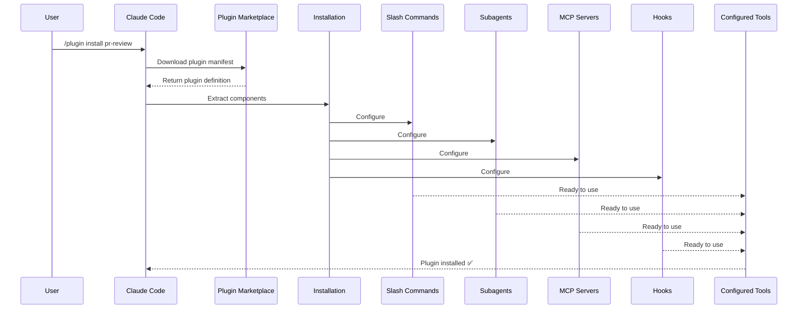
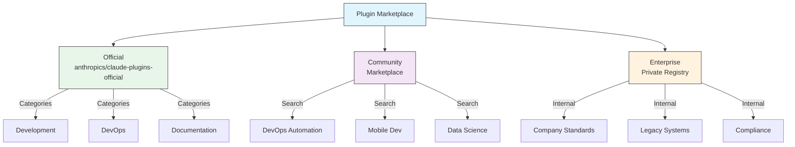
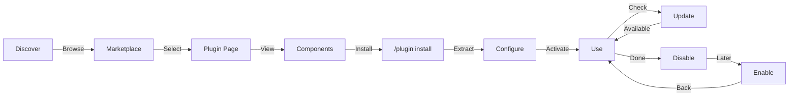
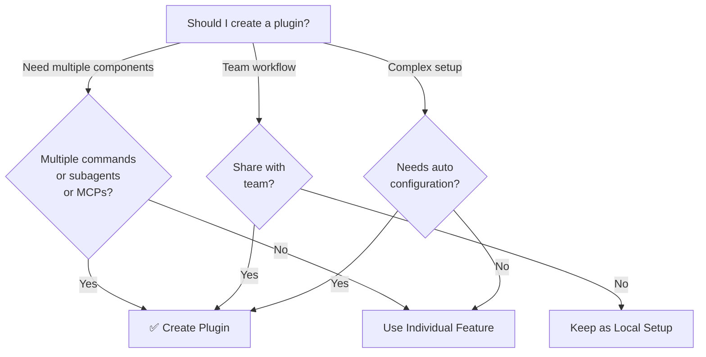

<picture>
  <source media="(prefers-color-scheme: dark)" srcset="../resources/logos/claude-howto-logo-dark.svg">
  
</picture>

# Claude Code Plugins

本目录包含完整的插件示例：把多个 Claude Code 能力打包成一个可安装、可共享的整体。

## Overview

Claude Code 插件是“多能力打包体”：可把 slash commands、subagents、MCP servers、hooks 一次性安装。它是扩展机制中最高层级的形态，适合团队化分发与标准化落地。

## Plugin Architecture

```mermaid
graph TB
    A["Plugin"]
    B["Slash Commands"]
    C["Subagents"]
    D["MCP Servers"]
    E["Hooks"]
    F["Configuration"]

    A -->|bundles| B
    A -->|bundles| C
    A -->|bundles| D
    A -->|bundles| E
    A -->|bundles| F
```



## Plugin Loading Process



## Plugin Types & Distribution

| Type | Scope | Shared | Authority | Examples |
|------|-------|--------|-----------|----------|
| Official | 全局 | 所有用户 | Anthropic | PR Review, Security Guidance |
| Community | 公开 | 所有用户 | 社区 | DevOps, Data Science |
| Organization | 内部 | 团队成员 | 公司 | 内部规范、内部工具 |
| Personal | 个人 | 单用户 | 开发者 | 个性化工作流 |

## Plugin Definition Structure

插件清单使用 `.claude-plugin/plugin.json`：

```json
{
  "name": "my-first-plugin",
  "description": "A greeting plugin",
  "version": "1.0.0",
  "author": {
    "name": "Your Name"
  },
  "homepage": "https://example.com",
  "repository": "https://github.com/user/repo",
  "license": "MIT"
}
```

## Plugin Structure Example

```text
my-plugin/
├── .claude-plugin/
│   └── plugin.json       # Manifest
├── commands/             # Skills/commands markdown files
├── agents/               # Custom agent definitions
├── skills/               # Agent Skills with SKILL.md
├── hooks/
│   └── hooks.json
├── .mcp.json
├── .lsp.json
├── settings.json
├── templates/
├── scripts/
├── docs/
└── tests/
```

### LSP server configuration

插件可内置 LSP（Language Server Protocol）配置，为开发提供实时诊断、跳转与符号能力。

**配置位置：**
- 插件根目录 `.lsp.json`
- 或 `plugin.json` 里的内联 `lsp` 字段

#### Field reference

| Field | Required | Description |
|-------|----------|-------------|
| `command` | Yes | LSP server 可执行文件（需在 PATH） |
| `extensionToLanguage` | Yes | 文件扩展名到语言 ID 映射 |
| `args` | No | 启动参数 |
| `transport` | No | 通信方式：`stdio`（默认）或 `socket` |
| `env` | No | 进程环境变量 |
| `initializationOptions` | No | LSP 初始化选项 |
| `settings` | No | 传给 server 的工作区配置 |
| `workspaceFolder` | No | 覆盖工作区路径 |
| `startupTimeout` | No | 启动超时（ms） |
| `shutdownTimeout` | No | 优雅关闭超时（ms） |
| `restartOnCrash` | No | 崩溃自动重启 |
| `maxRestarts` | No | 最大重启次数 |

#### Example configurations

**Go (gopls):**

```json
{
  "go": {
    "command": "gopls",
    "args": ["serve"],
    "extensionToLanguage": {
      ".go": "go"
    }
  }
}
```

**Python (pyright):**

```json
{
  "python": {
    "command": "pyright-langserver",
    "args": ["--stdio"],
    "extensionToLanguage": {
      ".py": "python",
      ".pyi": "python"
    }
  }
}
```

**TypeScript:**

```json
{
  "typescript": {
    "command": "typescript-language-server",
    "args": ["--stdio"],
    "extensionToLanguage": {
      ".ts": "typescript",
      ".tsx": "typescriptreact",
      ".js": "javascript",
      ".jsx": "javascriptreact"
    }
  }
}
```

#### Available LSP plugins

| Plugin | Language | Server Binary | Install Command |
|--------|----------|---------------|----------------|
| `pyright-lsp` | Python | `pyright-langserver` | `pip install pyright` |
| `typescript-lsp` | TS/JS | `typescript-language-server` | `npm install -g typescript-language-server typescript` |
| `rust-lsp` | Rust | `rust-analyzer` | `rustup component add rust-analyzer` |

#### LSP capabilities

启用后可获得：
- 即时诊断（错误/警告）
- 代码导航（定义/引用/实现）
- 悬浮信息（类型签名与文档）
- 符号浏览（文件级/工作区级）

## Plugin Options (v2.1.83+)

插件可在 manifest 通过 `userConfig` 声明用户可配置项。`sensitive: true` 的值会存入系统 keychain，而非明文配置文件。

```json
{
  "name": "my-plugin",
  "version": "1.0.0",
  "userConfig": {
    "apiKey": {
      "description": "API key for the service",
      "sensitive": true
    },
    "region": {
      "description": "Deployment region",
      "default": "us-east-1"
    }
  }
}
```

## Persistent Plugin Data (`${CLAUDE_PLUGIN_DATA}`) (v2.1.78+)

插件可通过 `${CLAUDE_PLUGIN_DATA}` 访问持久目录（插件独占、跨会话保留），适合缓存与本地数据库等状态存储。

```json
{
  "hooks": {
    "PostToolUse": [
      {
        "command": "node ${CLAUDE_PLUGIN_DATA}/track-usage.js"
      }
    ]
  }
}
```

## Inline Plugin via Settings (`source: 'settings'`) (v2.1.80+)

可在 settings 中内联 marketplace + plugin 定义，不依赖独立仓库：

```json
{
  "pluginMarketplaces": [
    {
      "name": "inline-tools",
      "source": "settings",
      "plugins": [
        {
          "name": "quick-lint",
          "source": "./local-plugins/quick-lint"
        }
      ]
    }
  ]
}
```

## Plugin Settings

插件可附带 `settings.json` 提供默认配置，目前支持 `agent`（主线程 agent）：

```json
{
  "agent": "agents/specialist-1.md"
}
```

## Standalone vs Plugin Approach

| Approach | Command Names | Configuration | Best For |
|----------|---------------|---|---|
| **Standalone** | `/hello` | CLAUDE.md 手动配置 | 个人/项目局部 |
| **Plugins** | `/plugin-name:hello` | plugin.json 自动化 | 团队分发/复用 |

## Practical Examples

### Example 1: PR Review Plugin

**File:** `.claude-plugin/plugin.json`

```json
{
  "name": "pr-review",
  "version": "1.0.0",
  "description": "Complete PR review workflow with security, testing, and docs",
  "author": {
    "name": "Anthropic"
  },
  "repository": "https://github.com/your-org/pr-review",
  "license": "MIT"
}
```

**File:** `commands/review-pr.md`

```markdown
---
name: Review PR
description: Start comprehensive PR review with security and testing checks
---

# PR Review

This command initiates a complete pull request review including:

1. Security analysis
2. Test coverage verification
3. Documentation updates
4. Code quality checks
5. Performance impact assessment
```

**File:** `agents/security-reviewer.md`

```yaml
---
name: security-reviewer
description: Security-focused code review
tools: read, grep, diff
---

# Security Reviewer

Specializes in finding security vulnerabilities:
- Authentication/authorization issues
- Data exposure
- Injection attacks
- Secure configuration
```

**Installation:**

```bash
/plugin install pr-review

# Result:
# ✅ 3 slash commands installed
# ✅ 3 subagents configured
# ✅ 2 MCP servers connected
# ✅ 4 hooks registered
# ✅ Ready to use!
```

### Example 2: DevOps Plugin

```text
devops-automation/
├── commands/
│   ├── deploy.md
│   ├── rollback.md
│   ├── status.md
│   └── incident.md
├── agents/
│   ├── deployment-specialist.md
│   ├── incident-commander.md
│   └── alert-analyzer.md
├── mcp/
│   ├── github-config.json
│   ├── kubernetes-config.json
│   └── prometheus-config.json
├── hooks/
│   ├── pre-deploy.js
│   ├── post-deploy.js
│   └── on-error.js
└── scripts/
    ├── deploy.sh
    ├── rollback.sh
    └── health-check.sh
```

### Example 3: Documentation Plugin

```text
documentation/
├── commands/
│   ├── generate-api-docs.md
│   ├── generate-readme.md
│   ├── sync-docs.md
│   └── validate-docs.md
├── agents/
│   ├── api-documenter.md
│   ├── code-commentator.md
│   └── example-generator.md
├── mcp/
│   ├── github-docs-config.json
│   └── slack-announce-config.json
└── templates/
    ├── api-endpoint.md
    ├── function-docs.md
    └── adr-template.md
```

## Plugin Marketplace

官方 marketplace 目录为 `anthropics/claude-plugins-official`。企业也可搭建私有 marketplace。



### Marketplace Configuration

| Setting | Description |
|---------|-------------|
| `extraKnownMarketplaces` | 添加额外 marketplace 来源 |
| `strictKnownMarketplaces` | 限制允许添加的 marketplace |
| `deniedPlugins` | 管理员插件黑名单 |

### Additional Marketplace Features

- 默认 git timeout 从 30s 提升到 120s（适配大仓库）
- 支持自定义 npm registry
- 支持版本锁定（version pinning）

### Marketplace definition schema

`.claude-plugin/marketplace.json` 示例：

```json
{
  "name": "my-team-plugins",
  "owner": "my-org",
  "plugins": [
    {
      "name": "code-standards",
      "source": "./plugins/code-standards",
      "description": "Enforce team coding standards",
      "version": "1.2.0",
      "author": "platform-team"
    },
    {
      "name": "deploy-helper",
      "source": {
        "source": "github",
        "repo": "my-org/deploy-helper",
        "ref": "v2.0.0"
      },
      "description": "Deployment automation workflows"
    }
  ]
}
```

| Field | Required | Description |
|-------|----------|-------------|
| `name` | Yes | marketplace 名（kebab-case） |
| `owner` | Yes | 维护组织/用户 |
| `plugins` | Yes | 插件数组 |
| `plugins[].name` | Yes | 插件名（kebab-case） |
| `plugins[].source` | Yes | 插件来源（路径字符串或 source 对象） |
| `plugins[].description` | No | 简述 |
| `plugins[].version` | No | semver 版本 |
| `plugins[].author` | No | 作者 |

### Plugin source types

| Source | Syntax | Example |
|--------|--------|---------|
| Relative path | 字符串路径 | `"./plugins/my-plugin"` |
| GitHub | `{ "source": "github", "repo": "owner/repo" }` | `{ "source": "github", "repo": "acme/lint-plugin", "ref": "v1.0" }` |
| Git URL | `{ "source": "url", "url": "..." }` | `{ "source": "url", "url": "https://git.internal/plugin.git" }` |
| Git subdirectory | `{ "source": "git-subdir", "url": "...", "path": "..." }` | `{ "source": "git-subdir", "url": "https://github.com/org/monorepo.git", "path": "packages/plugin" }` |
| npm | `{ "source": "npm", "package": "..." }` | `{ "source": "npm", "package": "@acme/claude-plugin", "version": "^2.0" }` |
| pip | `{ "source": "pip", "package": "..." }` | `{ "source": "pip", "package": "claude-data-plugin", "version": ">=1.0" }` |

### Distribution methods

**GitHub（推荐）**

```bash
/plugin marketplace add owner/repo-name
```

**其他 git 服务（完整 URL）**

```bash
/plugin marketplace add https://gitlab.com/org/marketplace-repo.git
```

### Strict mode

| Setting | Behavior |
|---------|----------|
| `strict: true`（默认） | 本地 `plugin.json` 为主，marketplace 条目补充 |
| `strict: false` | marketplace 条目即完整定义 |

`strictKnownMarketplaces` 组织限制：

| Value | Effect |
|-------|--------|
| 未设置 | 不限来源 |
| `[]` | 全禁用 marketplace |
| 模式数组 | 白名单，仅允许匹配来源 |

```json
{
  "strictKnownMarketplaces": [
    "my-org/*",
    "github.com/trusted-vendor/*"
  ]
}
```

## Plugin Installation & Lifecycle



## Plugin Features Comparison

| Feature | Slash Command | Skill | Subagent | Plugin |
|---------|---------------|-------|----------|--------|
| Installation | 手动复制 | 手动复制 | 手动配置 | 一条命令 |
| Setup Time | 5 分钟 | 10 分钟 | 15 分钟 | 2 分钟 |
| Bundling | 单文件 | 单文件 | 单文件 | 多组件 |
| Versioning | 手工 | 手工 | 手工 | 自动 |
| Team Sharing | 复制文件 | 复制文件 | 复制文件 | 安装 ID |
| Updates | 手工 | 手工 | 手工 | 可自动发现 |
| Marketplace | No | No | No | Yes |

## Plugin CLI Commands

```bash
claude plugin install <name>@<marketplace>
claude plugin uninstall <name>
claude plugin list
claude plugin enable <name>
claude plugin disable <name>
claude plugin validate
```

## Installation Methods

### From Marketplace

```bash
/plugin install plugin-name
# 或：
claude plugin install plugin-name@marketplace-name
```

### Enable / Disable

```bash
/plugin enable plugin-name
/plugin disable plugin-name
```

### Local Plugin (dev)

```bash
claude --plugin-dir ./path/to/plugin
claude --plugin-dir ./plugin-a --plugin-dir ./plugin-b
```

### From Git Repository

```bash
/plugin install github:username/repo
```

## When to Create a Plugin



### Plugin Use Cases

| Use Case | Recommendation | Why |
|----------|-----------------|-----|
| Team Onboarding | ✅ Plugin | 一次安装，统一配置 |
| Framework Setup | ✅ Plugin | 一揽子框架工作流 |
| Enterprise Standards | ✅ Plugin | 集中分发+版本治理 |
| Quick Task Automation | ❌ Command | 插件太重 |
| Single Domain Expertise | ❌ Skill | skill 更合适 |
| Specialized Analysis | ❌ Subagent | 单独配置更轻 |
| Live Data Access | ❌ MCP | 独立 MCP 即可 |

## Testing a Plugin

发布前用本地目录测试：

```bash
claude --plugin-dir ./my-plugin
claude --plugin-dir ./my-plugin --plugin-dir ./another-plugin
```

检查点：
- slash commands 可用
- subagents/agents 可运行
- MCP 连接正常
- hooks 执行正常
- LSP 配置有效

## Hot-Reload

开发期插件支持热重载。也可手动执行：

```bash
/reload-plugins
```

## Managed Settings for Plugins

管理员可用 managed settings 组织级管控插件：

| Setting | Description |
|---------|-------------|
| `enabledPlugins` | 默认启用白名单 |
| `deniedPlugins` | 禁止安装黑名单 |
| `extraKnownMarketplaces` | 额外 marketplace 来源 |
| `strictKnownMarketplaces` | 限制可添加 marketplace |
| `allowedChannelPlugins` | 按 release channel 控制允许插件 |

## Plugin Security

插件 subagent 在受限沙箱中运行。以下 frontmatter key 在插件 subagent 中**不允许**：
- `hooks`
- `mcpServers`
- `permissionMode`

## Publishing a Plugin

流程建议：
1. 准备插件结构
2. 编写 `.claude-plugin/plugin.json`
3. 编写 `README.md`
4. 本地测试 `claude --plugin-dir ./my-plugin`
5. 提交 marketplace
6. 审核通过
7. 发布
8. 用户一条命令安装

**Example submission:**

```markdown
# PR Review Plugin

## Description
Complete PR review workflow with security, testing, and documentation checks.

## What's Included
- 3 slash commands for different review types
- 3 specialized subagents
- GitHub and CodeQL MCP integration
- Automated security scanning hooks

## Installation
`/plugin install pr-review`

## Features
✅ Security analysis
✅ Test coverage checking
✅ Documentation verification
✅ Code quality assessment
✅ Performance impact analysis

## Usage
`/review-pr`
`/check-security`
`/check-tests`

## Requirements
- Claude Code 1.0+
- GitHub access
- CodeQL (optional)
```

## Plugin vs Manual Configuration

**Manual（2+ 小时）**：逐项安装、逐项配置、逐项文档、逐项同步团队。  
**Plugin（2 分钟）**：

```bash
/plugin install pr-review
# ✅ 一次性完成安装与配置
```

## Best Practices

### Do's ✅
- 使用清晰插件名
- 提供完整 README
- 严格 semver
- 联合测试所有组件
- 写清楚依赖和使用示例
- 保持插件聚焦、内聚
- 补齐测试

### Don'ts ❌
- 不要捆绑无关能力
- 不要硬编码凭据
- 不要跳过测试/文档
- 不要忽略版本管理
- 不要让组件依赖过度复杂

## Installation Instructions

### Installing from Marketplace

1. 浏览插件：

```bash
/plugin list
```

2. 查看详情：

```bash
/plugin info plugin-name
```

3. 安装：

```bash
/plugin install plugin-name
```

### Installing from Local Path

```bash
/plugin install ./path/to/plugin-directory
```

### Installing from GitHub

```bash
/plugin install github:username/repo
```

### Listing Installed Plugins

```bash
/plugin list --installed
```

### Updating a Plugin

```bash
/plugin update plugin-name
```

### Disabling/Enabling

```bash
/plugin disable plugin-name
/plugin enable plugin-name
```

### Uninstalling

```bash
/plugin uninstall plugin-name
```

## Related Concepts

- **[Slash Commands](../01-slash-commands/)**
- **[Memory](../02-memory/)**
- **[Skills](../03-skills/)**
- **[Subagents](../04-subagents/)**
- **[MCP Servers](../05-mcp/)**
- **[Hooks](../06-hooks/)**

## Complete Example Workflow

### PR Review Plugin Full Workflow

```text
1. User: /review-pr

2. Plugin executes:
   ├── pre-review.js validates git repo
   ├── GitHub MCP fetches PR data
   ├── security-reviewer checks security
   ├── test-checker verifies coverage
   └── performance-analyzer evaluates impact

3. Synthesis:
   ✅ Security: no critical issues
   ⚠️ Testing: Coverage 65% (recommend 80%+)
   ✅ Performance: no significant impact
   📝 12 recommendations provided
```

## Troubleshooting

### Plugin Won't Install
- 检查版本兼容：`/version`
- 检查 `plugin.json` 语法
- 检查网络（远程安装）
- 检查文件权限

### Components Not Loading
- 核对 `plugin.json` 路径
- 检查脚本权限：`chmod +x scripts/`
- 检查组件文件语法
- 看日志：`/plugin debug plugin-name`

### MCP Connection Failed
- 检查环境变量
- 检查 MCP server 健康状态
- 用 `/mcp test` 独立测试

### Commands Not Available After Install
- ` /plugin list --installed` 确认安装
- ` /plugin status plugin-name` 确认启用
- 重启 Claude Code
- 排查命令名冲突

### Hook Execution Issues
- 检查 hook 文件权限
- 检查事件名与语法
- 查看 hook 日志

## Additional Resources

- [Official Plugins Documentation](https://code.claude.com/docs/en/plugins)
- [Discover Plugins](https://code.claude.com/docs/en/discover-plugins)
- [Plugin Marketplaces](https://code.claude.com/docs/en/plugin-marketplaces)
- [Plugins Reference](https://code.claude.com/docs/en/plugins-reference)
- [MCP Server Reference](https://modelcontextprotocol.io/)
- [Subagent Configuration Guide](../04-subagents/README.md)
- [Hook System Reference](../06-hooks/README.md)
