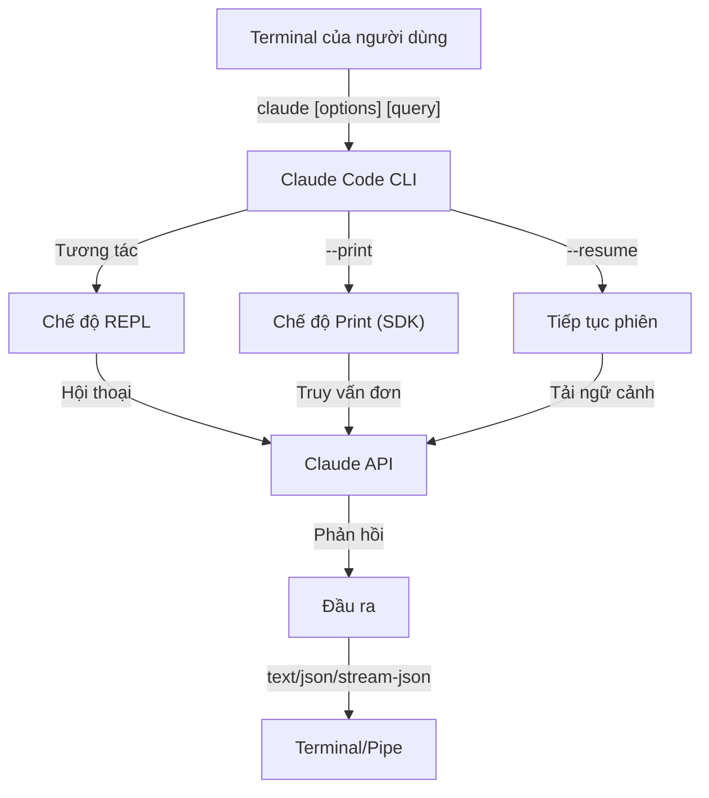
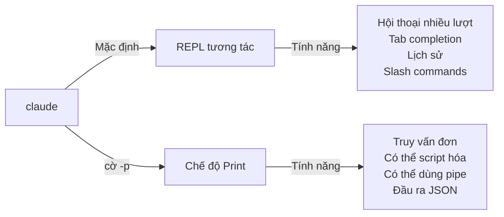

<picture>
  <source media="(prefers-color-scheme: dark)" srcset="../resources/logos/claude-howto-logo-dark.svg">
  
</picture>

# Tham chiếu CLI

## Tổng quan

Claude Code CLI (Command Line Interface — giao diện dòng lệnh) là cách chính để tương tác với Claude Code. CLI cung cấp nhiều tùy chọn mạnh mẽ để chạy truy vấn, quản lý phiên làm việc, cấu hình model, và tích hợp Claude vào quy trình phát triển của bạn.

## Kiến trúc



## Lệnh CLI

| Lệnh | Mô tả | Ví dụ |
|------|-------|-------|
| `claude` | Khởi động REPL tương tác | `claude` |
| `claude "query"` | Khởi động REPL với prompt ban đầu | `claude "explain this project"` |
| `claude -p "query"` | Chế độ Print — truy vấn rồi thoát | `claude -p "explain this function"` |
| `cat file \| claude -p "query"` | Xử lý nội dung qua pipe | `cat logs.txt \| claude -p "explain"` |
| `claude -c` | Tiếp tục hội thoại gần nhất | `claude -c` |
| `claude -c -p "query"` | Tiếp tục trong chế độ print | `claude -c -p "check for type errors"` |
| `claude -r "<session>" "query"` | Tiếp tục phiên theo ID hoặc tên | `claude -r "auth-refactor" "finish this PR"` |
| `claude update` | Cập nhật lên phiên bản mới nhất | `claude update` |
| `claude mcp` | Cấu hình MCP servers | Xem [tài liệu MCP](../05-mcp/) |
| `claude mcp serve` | Chạy Claude Code như một MCP server | `claude mcp serve` |
| `claude agents` | Liệt kê tất cả subagents đã cấu hình | `claude agents` |
| `claude auto-mode defaults` | In các quy tắc mặc định của auto mode dưới dạng JSON | `claude auto-mode defaults` |
| `claude remote-control` | Khởi động Remote Control server | `claude remote-control` |
| `claude plugin` | Quản lý plugin (cài, bật, tắt) | `claude plugin install my-plugin` |
| `claude auth login` | Đăng nhập (hỗ trợ `--email`, `--sso`) | `claude auth login --email user@example.com` |
| `claude auth logout` | Đăng xuất tài khoản hiện tại | `claude auth logout` |
| `claude auth status` | Kiểm tra trạng thái đăng nhập (exit 0 nếu đã đăng nhập, 1 nếu chưa) | `claude auth status` |

## Các cờ cốt lõi

| Cờ | Mô tả | Ví dụ |
|----|-------|-------|
| `-p, --print` | In phản hồi mà không vào chế độ tương tác | `claude -p "query"` |
| `-c, --continue` | Tải hội thoại gần nhất | `claude --continue` |
| `-r, --resume` | Tiếp tục phiên cụ thể theo ID hoặc tên | `claude --resume auth-refactor` |
| `-v, --version` | Hiển thị số phiên bản | `claude -v` |
| `-w, --worktree` | Khởi động trong git worktree cô lập | `claude -w` |
| `-n, --name` | Tên hiển thị cho phiên | `claude -n "auth-refactor"` |
| `--from-pr <number>` | Tiếp tục phiên liên kết với GitHub PR | `claude --from-pr 42` |
| `--remote "task"` | Tạo phiên web trên claude.ai | `claude --remote "implement API"` |
| `--remote-control, --rc` | Phiên tương tác với Remote Control | `claude --rc` |
| `--teleport` | Tiếp tục phiên web cục bộ | `claude --teleport` |
| `--teammate-mode` | Chế độ hiển thị nhóm agent | `claude --teammate-mode tmux` |
| `--bare` | Chế độ tối giản (bỏ qua hooks, skills, plugins, MCP, auto memory, CLAUDE.md) | `claude --bare` |
| `--enable-auto-mode` | Mở khóa chế độ quyền tự động | `claude --enable-auto-mode` |
| `--channels` | Đăng ký MCP channel plugins | `claude --channels discord,telegram` |
| `--chrome` / `--no-chrome` | Bật/tắt tích hợp trình duyệt Chrome | `claude --chrome` |
| `--effort` | Đặt mức độ nỗ lực tư duy | `claude --effort high` |
| `--init` / `--init-only` | Chạy initialization hooks | `claude --init` |
| `--maintenance` | Chạy maintenance hooks rồi thoát | `claude --maintenance` |
| `--disable-slash-commands` | Tắt tất cả skills và slash commands | `claude --disable-slash-commands` |
| `--no-session-persistence` | Tắt lưu phiên (chế độ print) | `claude -p --no-session-persistence "query"` |

### Chế độ tương tác vs Chế độ Print



**Chế độ tương tác** (mặc định):
```bash
# Khởi động phiên tương tác
claude

# Khởi động với prompt ban đầu
claude "explain the authentication flow"
```

**Chế độ Print** (không tương tác):
```bash
# Truy vấn đơn rồi thoát
claude -p "what does this function do?"

# Xử lý nội dung file
cat error.log | claude -p "explain this error"

# Kết hợp với các công cụ khác
claude -p "list todos" | grep "URGENT"
```

## Model & Cấu hình

| Cờ | Mô tả | Ví dụ |
|----|-------|-------|
| `--model` | Chọn model (sonnet, opus, haiku, hoặc tên đầy đủ) | `claude --model opus` |
| `--fallback-model` | Tự động chuyển model khi quá tải | `claude -p --fallback-model sonnet "query"` |
| `--agent` | Chỉ định agent cho phiên | `claude --agent my-custom-agent` |
| `--agents` | Định nghĩa subagents tùy chỉnh qua JSON | Xem [Cấu hình Agents](#cấu-hình-agents) |
| `--effort` | Đặt mức độ nỗ lực (low, medium, high, max) | `claude --effort high` |

### Ví dụ chọn Model

```bash
# Dùng Opus 4.6 cho tác vụ phức tạp
claude --model opus "design a caching strategy"

# Dùng Haiku 4.5 cho tác vụ nhanh
claude --model haiku -p "format this JSON"

# Tên model đầy đủ
claude --model claude-sonnet-4-6-20250929 "review this code"

# Kết hợp fallback để đảm bảo độ tin cậy
claude -p --model opus --fallback-model sonnet "analyze architecture"

# Dùng opusplan (Opus lập kế hoạch, Sonnet thực thi)
claude --model opusplan "design and implement the caching layer"
```

## Tùy chỉnh System Prompt

| Cờ | Mô tả | Ví dụ |
|----|-------|-------|
| `--system-prompt` | Thay thế toàn bộ prompt mặc định | `claude --system-prompt "You are a Python expert"` |
| `--system-prompt-file` | Tải prompt từ file (chế độ print) | `claude -p --system-prompt-file ./prompt.txt "query"` |
| `--append-system-prompt` | Thêm vào sau prompt mặc định | `claude --append-system-prompt "Always use TypeScript"` |

### Ví dụ System Prompt

```bash
# Persona hoàn toàn tùy chỉnh
claude --system-prompt "You are a senior security engineer. Focus on vulnerabilities."

# Thêm hướng dẫn cụ thể
claude --append-system-prompt "Always include unit tests with code examples"

# Tải prompt phức tạp từ file
claude -p --system-prompt-file ./prompts/code-reviewer.txt "review main.py"
```

### So sánh các cờ System Prompt

| Cờ | Hành vi | Tương tác | Print |
|----|---------|-----------|-------|
| `--system-prompt` | Thay thế toàn bộ system prompt mặc định | ✅ | ✅ |
| `--system-prompt-file` | Thay thế bằng prompt từ file | ❌ | ✅ |
| `--append-system-prompt` | Thêm vào sau system prompt mặc định | ✅ | ✅ |

**Chỉ dùng `--system-prompt-file` trong chế độ print. Với chế độ tương tác, dùng `--system-prompt` hoặc `--append-system-prompt`.**

## Quản lý Tool & Quyền

| Cờ | Mô tả | Ví dụ |
|----|-------|-------|
| `--tools` | Giới hạn các built-in tools được phép | `claude -p --tools "Bash,Edit,Read" "query"` |
| `--allowedTools` | Tools thực thi mà không cần hỏi | `"Bash(git log:*)" "Read"` |
| `--disallowedTools` | Tools bị xóa khỏi ngữ cảnh | `"Bash(rm:*)" "Edit"` |
| `--dangerously-skip-permissions` | Bỏ qua tất cả xác nhận quyền | `claude --dangerously-skip-permissions` |
| `--permission-mode` | Bắt đầu ở chế độ quyền chỉ định | `claude --permission-mode auto` |
| `--permission-prompt-tool` | MCP tool để xử lý quyền | `claude -p --permission-prompt-tool mcp_auth "query"` |
| `--enable-auto-mode` | Mở khóa chế độ quyền tự động | `claude --enable-auto-mode` |

### Ví dụ về Quyền

```bash
# Chế độ chỉ đọc để review code
claude --permission-mode plan "review this codebase"

# Giới hạn chỉ dùng tools an toàn
claude --tools "Read,Grep,Glob" -p "find all TODO comments"

# Cho phép các lệnh git cụ thể mà không cần hỏi
claude --allowedTools "Bash(git status:*)" "Bash(git log:*)"

# Chặn các thao tác nguy hiểm
claude --disallowedTools "Bash(rm -rf:*)" "Bash(git push --force:*)"
```

## Đầu ra & Định dạng

| Cờ | Mô tả | Tùy chọn | Ví dụ |
|----|-------|----------|-------|
| `--output-format` | Định dạng đầu ra (chế độ print) | `text`, `json`, `stream-json` | `claude -p --output-format json "query"` |
| `--input-format` | Định dạng đầu vào (chế độ print) | `text`, `stream-json` | `claude -p --input-format stream-json` |
| `--verbose` | Bật ghi log chi tiết | | `claude --verbose` |
| `--include-partial-messages` | Bao gồm các sự kiện streaming | Yêu cầu `stream-json` | `claude -p --output-format stream-json --include-partial-messages "query"` |
| `--json-schema` | Lấy JSON hợp lệ theo schema | | `claude -p --json-schema '{"type":"object"}' "query"` |
| `--max-budget-usd` | Giới hạn chi tiêu tối đa cho chế độ print | | `claude -p --max-budget-usd 5.00 "query"` |

### Ví dụ Định dạng Đầu ra

```bash
# Văn bản thuần (mặc định)
claude -p "explain this code"

# JSON để dùng theo chương trình
claude -p --output-format json "list all functions in main.py"

# JSON streaming để xử lý thời gian thực
claude -p --output-format stream-json "generate a long report"

# Đầu ra có cấu trúc với kiểm tra schema
claude -p --json-schema '{"type":"object","properties":{"bugs":{"type":"array"}}}' \
  "find bugs in this code and return as JSON"
```

## Workspace & Thư mục

| Cờ | Mô tả | Ví dụ |
|----|-------|-------|
| `--add-dir` | Thêm thư mục làm việc bổ sung | `claude --add-dir ../apps ../lib` |
| `--setting-sources` | Nguồn cài đặt phân cách bằng dấu phẩy | `claude --setting-sources user,project` |
| `--settings` | Tải cài đặt từ file hoặc JSON | `claude --settings ./settings.json` |
| `--plugin-dir` | Tải plugins từ thư mục (có thể dùng nhiều lần) | `claude --plugin-dir ./my-plugin` |

### Ví dụ Nhiều thư mục

```bash
# Làm việc trên nhiều thư mục project
claude --add-dir ../frontend ../backend ../shared "find all API endpoints"

# Tải cài đặt tùy chỉnh
claude --settings '{"model":"opus","verbose":true}' "complex task"
```

## Cấu hình MCP

| Cờ | Mô tả | Ví dụ |
|----|-------|-------|
| `--mcp-config` | Tải MCP servers từ JSON | `claude --mcp-config ./mcp.json` |
| `--strict-mcp-config` | Chỉ dùng MCP config đã chỉ định | `claude --strict-mcp-config --mcp-config ./mcp.json` |
| `--channels` | Đăng ký MCP channel plugins | `claude --channels discord,telegram` |

### Ví dụ MCP

```bash
# Tải GitHub MCP server
claude --mcp-config ./github-mcp.json "list open PRs"

# Chế độ strict — chỉ dùng các server đã chỉ định
claude --strict-mcp-config --mcp-config ./production-mcp.json "deploy to staging"
```

## Quản lý Phiên

| Cờ | Mô tả | Ví dụ |
|----|-------|-------|
| `--session-id` | Dùng session ID cụ thể (UUID) | `claude --session-id "550e8400-..."` |
| `--fork-session` | Tạo phiên mới khi tiếp tục | `claude --resume abc123 --fork-session` |

### Ví dụ Phiên

```bash
# Tiếp tục hội thoại gần nhất
claude -c

# Tiếp tục phiên đã đặt tên
claude -r "feature-auth" "continue implementing login"

# Fork phiên để thử hướng khác
claude --resume feature-auth --fork-session "try alternative approach"

# Dùng session ID cụ thể
claude --session-id "550e8400-e29b-41d4-a716-446655440000" "continue"
```

### Fork Phiên

Tạo nhánh từ phiên hiện có để thử nghiệm:

```bash
# Fork phiên để thử hướng tiếp cận khác
claude --resume abc123 --fork-session "try alternative implementation"

# Fork với message tùy chỉnh
claude -r "feature-auth" --fork-session "test with different architecture"
```

**Các trường hợp sử dụng:**
- Thử các cách triển khai khác mà không mất phiên gốc
- Thử nghiệm nhiều hướng song song
- Tạo nhánh từ công việc đã thành công để biến tấu
- Kiểm tra các thay đổi phá vỡ mà không ảnh hưởng phiên chính

Phiên gốc không thay đổi, và fork trở thành phiên độc lập mới.

## Tính năng Nâng cao

| Cờ | Mô tả | Ví dụ |
|----|-------|-------|
| `--chrome` | Bật tích hợp Chrome | `claude --chrome` |
| `--no-chrome` | Tắt tích hợp Chrome | `claude --no-chrome` |
| `--ide` | Tự động kết nối IDE nếu có | `claude --ide` |
| `--max-turns` | Giới hạn số lượt tự động (không tương tác) | `claude -p --max-turns 3 "query"` |
| `--debug` | Bật chế độ debug với bộ lọc | `claude --debug "api,mcp"` |
| `--enable-lsp-logging` | Bật ghi log LSP chi tiết | `claude --enable-lsp-logging` |
| `--betas` | Beta headers cho API requests | `claude --betas interleaved-thinking` |
| `--plugin-dir` | Tải plugins từ thư mục (có thể dùng nhiều lần) | `claude --plugin-dir ./my-plugin` |
| `--enable-auto-mode` | Mở khóa chế độ quyền tự động | `claude --enable-auto-mode` |
| `--effort` | Đặt mức độ nỗ lực tư duy | `claude --effort high` |
| `--bare` | Chế độ tối giản (bỏ qua hooks, skills, plugins, MCP, auto memory, CLAUDE.md) | `claude --bare` |
| `--channels` | Đăng ký MCP channel plugins | `claude --channels discord` |
| `--fork-session` | Tạo session ID mới khi tiếp tục | `claude --resume abc --fork-session` |
| `--max-budget-usd` | Chi tiêu tối đa (chế độ print) | `claude -p --max-budget-usd 5.00 "query"` |
| `--json-schema` | Đầu ra JSON được kiểm tra schema | `claude -p --json-schema '{"type":"object"}' "q"` |

### Ví dụ Nâng cao

```bash
# Giới hạn hành động tự động
claude -p --max-turns 5 "refactor this module"

# Debug API calls
claude --debug "api" "test query"

# Bật tích hợp IDE
claude --ide "help me with this file"
```

## Cấu hình Agents

Cờ `--agents` nhận một JSON object định nghĩa các subagents tùy chỉnh cho phiên.

### Định dạng JSON cho Agents

```json
{
  "agent-name": {
    "description": "Bắt buộc: khi nào gọi agent này",
    "prompt": "Bắt buộc: system prompt cho agent",
    "tools": ["Tùy chọn", "mảng", "tools"],
    "model": "tùy chọn: sonnet|opus|haiku"
  }
}
```

**Các trường bắt buộc:**
- `description` — Mô tả ngôn ngữ tự nhiên về khi nào dùng agent này
- `prompt` — System prompt định nghĩa vai trò và hành vi của agent

**Các trường tùy chọn:**
- `tools` — Mảng các tools được phép (kế thừa tất cả nếu bỏ qua)
  - Định dạng: `["Read", "Grep", "Glob", "Bash"]`
- `model` — Model sử dụng: `sonnet`, `opus`, hoặc `haiku`

### Ví dụ đầy đủ về Agents

```json
{
  "code-reviewer": {
    "description": "Chuyên gia review code. Dùng chủ động sau khi thay đổi code.",
    "prompt": "You are a senior code reviewer. Focus on code quality, security, and best practices.",
    "tools": ["Read", "Grep", "Glob", "Bash"],
    "model": "sonnet"
  },
  "debugger": {
    "description": "Chuyên gia debug cho lỗi và test thất bại.",
    "prompt": "You are an expert debugger. Analyze errors, identify root causes, and provide fixes.",
    "tools": ["Read", "Edit", "Bash", "Grep"],
    "model": "opus"
  },
  "documenter": {
    "description": "Chuyên gia tài liệu để tạo hướng dẫn.",
    "prompt": "You are a technical writer. Create clear, comprehensive documentation.",
    "tools": ["Read", "Write"],
    "model": "haiku"
  }
}
```

### Ví dụ lệnh với Agents

```bash
# Định nghĩa agents tùy chỉnh trực tiếp
claude --agents '{
  "security-auditor": {
    "description": "Chuyên gia bảo mật để phân tích lỗ hổng",
    "prompt": "You are a security expert. Find vulnerabilities and suggest fixes.",
    "tools": ["Read", "Grep", "Glob"],
    "model": "opus"
  }
}' "audit this codebase for security issues"

# Tải agents từ file
claude --agents "$(cat ~/.claude/agents.json)" "review the auth module"

# Kết hợp với các cờ khác
claude -p --agents "$(cat agents.json)" --model sonnet "analyze performance"
```

### Thứ tự ưu tiên Agent

Khi có nhiều định nghĩa agent, chúng được tải theo thứ tự ưu tiên:
1. **Định nghĩa qua CLI** (`--agents`) — Dành cho phiên hiện tại
2. **User-level** (`~/.claude/agents/`) — Tất cả projects
3. **Project-level** (`.claude/agents/`) — Project hiện tại

Agents định nghĩa qua CLI ghi đè cả user lẫn project agents trong phiên đó.

---

## Các trường hợp sử dụng có giá trị cao

### 1. Tích hợp CI/CD

Dùng Claude Code trong CI/CD pipelines để tự động review code, kiểm thử, và tạo tài liệu.

**Ví dụ GitHub Actions:**

```yaml
name: AI Code Review

on: [pull_request]

jobs:
  review:
    runs-on: ubuntu-latest
    steps:
      - uses: actions/checkout@v4

      - name: Install Claude Code
        run: npm install -g @anthropic-ai/claude-code

      - name: Run Code Review
        env:
          ANTHROPIC_API_KEY: ${{ secrets.ANTHROPIC_API_KEY }}
        run: |
          claude -p --output-format json \
            --max-turns 1 \
            "Review the changes in this PR for:
            - Security vulnerabilities
            - Performance issues
            - Code quality
            Output as JSON with 'issues' array" > review.json

      - name: Post Review Comment
        uses: actions/github-script@v7
        with:
          script: |
            const fs = require('fs');
            const review = JSON.parse(fs.readFileSync('review.json', 'utf8'));
            // Xử lý và đăng nhận xét review
```

**Jenkins Pipeline:**

```groovy
pipeline {
    agent any
    stages {
        stage('AI Review') {
            steps {
                sh '''
                    claude -p --output-format json \
                      --max-turns 3 \
                      "Analyze test coverage and suggest missing tests" \
                      > coverage-analysis.json
                '''
            }
        }
    }
}
```

### 2. Pipe dữ liệu qua Script

Xử lý file, log, và dữ liệu qua Claude để phân tích.

**Phân tích Log:**

```bash
# Phân tích error logs
tail -1000 /var/log/app/error.log | claude -p "summarize these errors and suggest fixes"

# Tìm mẫu trong access logs
cat access.log | claude -p "identify suspicious access patterns"

# Phân tích lịch sử git
git log --oneline -50 | claude -p "summarize recent development activity"
```

**Xử lý Code:**

```bash
# Review một file cụ thể
cat src/auth.ts | claude -p "review this authentication code for security issues"

# Tạo tài liệu
cat src/api/*.ts | claude -p "generate API documentation in markdown"

# Tìm TODOs và ưu tiên hóa
grep -r "TODO" src/ | claude -p "prioritize these TODOs by importance"
```

### 3. Workflow Nhiều phiên

Quản lý các dự án phức tạp với nhiều luồng hội thoại.

```bash
# Bắt đầu phiên cho nhánh tính năng
claude -r "feature-auth" "let's implement user authentication"

# Sau đó, tiếp tục phiên
claude -r "feature-auth" "add password reset functionality"

# Fork để thử hướng tiếp cận khác
claude --resume feature-auth --fork-session "try OAuth instead"

# Chuyển giữa các phiên tính năng khác nhau
claude -r "feature-payments" "continue with Stripe integration"
```

### 4. Cấu hình Agent tùy chỉnh

Định nghĩa các agent chuyên biệt cho workflow của nhóm.

```bash
# Lưu cấu hình agents vào file
cat > ~/.claude/agents.json << 'EOF'
{
  "reviewer": {
    "description": "Code reviewer cho PR reviews",
    "prompt": "Review code for quality, security, and maintainability.",
    "model": "opus"
  },
  "documenter": {
    "description": "Chuyên gia tài liệu",
    "prompt": "Generate clear, comprehensive documentation.",
    "model": "sonnet"
  },
  "refactorer": {
    "description": "Chuyên gia refactor code",
    "prompt": "Suggest and implement clean code refactoring.",
    "tools": ["Read", "Edit", "Glob"]
  }
}
EOF

# Dùng agents trong phiên
claude --agents "$(cat ~/.claude/agents.json)" "review the auth module"
```

### 5. Xử lý hàng loạt

Xử lý nhiều truy vấn với cài đặt nhất quán.

```bash
# Xử lý nhiều file
for file in src/*.ts; do
  echo "Processing $file..."
  claude -p --model haiku "summarize this file: $(cat $file)" >> summaries.md
done

# Review code hàng loạt
find src -name "*.py" -exec sh -c '
  echo "## $1" >> review.md
  cat "$1" | claude -p "brief code review" >> review.md
' _ {} \;

# Tạo tests cho tất cả modules
for module in $(ls src/modules/); do
  claude -p "generate unit tests for src/modules/$module" > "tests/$module.test.ts"
done
```

### 6. Phát triển có ý thức về Bảo mật

Dùng kiểm soát quyền để vận hành an toàn.

```bash
# Kiểm tra bảo mật chỉ đọc
claude --permission-mode plan \
  --tools "Read,Grep,Glob" \
  "audit this codebase for security vulnerabilities"

# Chặn các lệnh nguy hiểm
claude --disallowedTools "Bash(rm:*)" "Bash(curl:*)" "Bash(wget:*)" \
  "help me clean up this project"

# Tự động hóa giới hạn
claude -p --max-turns 2 \
  --allowedTools "Read" "Glob" \
  "find all hardcoded credentials"
```

### 7. Tích hợp JSON API

Dùng Claude như một API có thể lập trình được với phân tích `jq`.

```bash
# Lấy phân tích có cấu trúc
claude -p --output-format json \
  --json-schema '{"type":"object","properties":{"functions":{"type":"array"},"complexity":{"type":"string"}}}' \
  "analyze main.py and return function list with complexity rating"

# Kết hợp với jq để xử lý
claude -p --output-format json "list all API endpoints" | jq '.endpoints[]'

# Dùng trong scripts
RESULT=$(claude -p --output-format json "is this code secure? answer with {secure: boolean, issues: []}" < code.py)
if echo "$RESULT" | jq -e '.secure == false' > /dev/null; then
  echo "Security issues found!"
  echo "$RESULT" | jq '.issues[]'
fi
```

### Ví dụ phân tích với jq

Phân tích và xử lý đầu ra JSON của Claude bằng `jq`:

```bash
# Trích xuất các trường cụ thể
claude -p --output-format json "analyze this code" | jq '.result'

# Lọc các phần tử mảng
claude -p --output-format json "list issues" | jq -r '.issues[] | select(.severity=="high")'

# Trích xuất nhiều trường
claude -p --output-format json "describe the project" | jq -r '.{name, version, description}'

# Chuyển đổi sang CSV
claude -p --output-format json "list functions" | jq -r '.functions[] | [.name, .lineCount] | @csv'

# Xử lý có điều kiện
claude -p --output-format json "check security" | jq 'if .vulnerabilities | length > 0 then "UNSAFE" else "SAFE" end'

# Trích xuất giá trị lồng nhau
claude -p --output-format json "analyze performance" | jq '.metrics.cpu.usage'

# Xử lý toàn bộ mảng
claude -p --output-format json "find todos" | jq '.todos | length'

# Biến đổi đầu ra
claude -p --output-format json "list improvements" | jq 'map({title: .title, priority: .priority})'
```

---

## Các Model

Claude Code hỗ trợ nhiều model với các khả năng khác nhau:

| Model | ID | Cửa sổ ngữ cảnh | Ghi chú |
|-------|-----|----------------|---------|
| Opus 4.6 | `claude-opus-4-6` | 1M tokens | Mạnh nhất, hỗ trợ các mức độ nỗ lực thích ứng |
| Sonnet 4.6 | `claude-sonnet-4-6` | 1M tokens | Cân bằng tốc độ và khả năng |
| Haiku 4.5 | `claude-haiku-4-5` | 1M tokens | Nhanh nhất, phù hợp cho tác vụ đơn giản |

### Chọn Model

```bash
# Dùng tên ngắn
claude --model opus "complex architectural review"
claude --model sonnet "implement this feature"
claude --model haiku -p "format this JSON"

# Dùng bí danh opusplan (Opus lập kế hoạch, Sonnet thực thi)
claude --model opusplan "design and implement the API"

# Bật/tắt fast mode trong phiên
/fast
```

### Mức độ nỗ lực (Opus 4.6)

Opus 4.6 hỗ trợ suy luận thích ứng với các mức độ nỗ lực:

```bash
# Đặt mức nỗ lực qua cờ CLI
claude --effort high "complex review"

# Đặt mức nỗ lực qua slash command
/effort high

# Đặt mức nỗ lực qua biến môi trường
export CLAUDE_CODE_EFFORT_LEVEL=high   # low, medium, high, hoặc max (chỉ Opus 4.6)
```

Từ khóa "ultrathink" trong prompt kích hoạt suy luận sâu. Mức `max` chỉ dành riêng cho Opus 4.6.

---

## Biến môi trường quan trọng

| Biến | Mô tả |
|------|-------|
| `ANTHROPIC_API_KEY` | API key để xác thực |
| `ANTHROPIC_MODEL` | Ghi đè model mặc định |
| `ANTHROPIC_CUSTOM_MODEL_OPTION` | Tùy chọn model tùy chỉnh cho API |
| `ANTHROPIC_DEFAULT_OPUS_MODEL` | Ghi đè ID model Opus mặc định |
| `ANTHROPIC_DEFAULT_SONNET_MODEL` | Ghi đè ID model Sonnet mặc định |
| `ANTHROPIC_DEFAULT_HAIKU_MODEL` | Ghi đè ID model Haiku mặc định |
| `MAX_THINKING_TOKENS` | Đặt ngân sách token cho extended thinking |
| `CLAUDE_CODE_EFFORT_LEVEL` | Đặt mức nỗ lực (`low`/`medium`/`high`/`max`) |
| `CLAUDE_CODE_SIMPLE` | Chế độ tối giản, được đặt bởi cờ `--bare` |
| `CLAUDE_CODE_DISABLE_AUTO_MEMORY` | Tắt cập nhật CLAUDE.md tự động |
| `CLAUDE_CODE_DISABLE_BACKGROUND_TASKS` | Tắt thực thi tác vụ nền |
| `CLAUDE_CODE_DISABLE_CRON` | Tắt tác vụ theo lịch/cron |
| `CLAUDE_CODE_DISABLE_GIT_INSTRUCTIONS` | Tắt hướng dẫn liên quan đến git |
| `CLAUDE_CODE_DISABLE_TERMINAL_TITLE` | Tắt cập nhật tiêu đề terminal |
| `CLAUDE_CODE_DISABLE_1M_CONTEXT` | Tắt cửa sổ ngữ cảnh 1M token |
| `CLAUDE_CODE_DISABLE_NONSTREAMING_FALLBACK` | Tắt fallback không streaming |
| `CLAUDE_CODE_ENABLE_TASKS` | Bật tính năng danh sách tác vụ |
| `CLAUDE_CODE_TASK_LIST_ID` | Thư mục tác vụ được đặt tên, dùng chung giữa các phiên |
| `CLAUDE_CODE_ENABLE_PROMPT_SUGGESTION` | Bật/tắt gợi ý prompt (`true`/`false`) |
| `CLAUDE_CODE_EXPERIMENTAL_AGENT_TEAMS` | Bật tính năng nhóm agent thử nghiệm |
| `CLAUDE_CODE_NEW_INIT` | Dùng luồng khởi tạo mới |
| `CLAUDE_CODE_SUBAGENT_MODEL` | Model cho thực thi subagent |
| `CLAUDE_CODE_PLUGIN_SEED_DIR` | Thư mục cho plugin seed files |
| `CLAUDE_CODE_SUBPROCESS_ENV_SCRUB` | Biến môi trường cần xóa khỏi subprocess |
| `CLAUDE_AUTOCOMPACT_PCT_OVERRIDE` | Ghi đè phần trăm auto-compaction |
| `CLAUDE_STREAM_IDLE_TIMEOUT_MS` | Thời gian chờ stream không hoạt động (ms) |
| `SLASH_COMMAND_TOOL_CHAR_BUDGET` | Ngân sách ký tự cho slash command tools |
| `ENABLE_TOOL_SEARCH` | Bật khả năng tìm kiếm tool |
| `MAX_MCP_OUTPUT_TOKENS` | Số token tối đa cho đầu ra MCP tool |

---

## Tham chiếu nhanh

### Các lệnh thường dùng nhất

```bash
# Phiên tương tác
claude

# Câu hỏi nhanh
claude -p "how do I..."

# Tiếp tục hội thoại
claude -c

# Xử lý một file
cat file.py | claude -p "review this"

# Đầu ra JSON cho scripts
claude -p --output-format json "query"
```

### Tổ hợp cờ theo tình huống

| Tình huống | Lệnh |
|-----------|------|
| Review code nhanh | `cat file \| claude -p "review"` |
| Đầu ra có cấu trúc | `claude -p --output-format json "query"` |
| Khám phá an toàn | `claude --permission-mode plan` |
| Tự động với an toàn | `claude --enable-auto-mode --permission-mode auto` |
| Tích hợp CI/CD | `claude -p --max-turns 3 --output-format json` |
| Tiếp tục công việc | `claude -r "session-name"` |
| Model tùy chỉnh | `claude --model opus "complex task"` |
| Chế độ tối giản | `claude --bare "quick query"` |
| Chạy có giới hạn ngân sách | `claude -p --max-budget-usd 2.00 "analyze code"` |

---

## Xử lý sự cố

### Lệnh không tìm thấy

**Vấn đề:** `claude: command not found`

**Giải pháp:**
- Cài Claude Code: `npm install -g @anthropic-ai/claude-code`
- Kiểm tra PATH có bao gồm thư mục npm global bin
- Thử chạy với đường dẫn đầy đủ: `npx claude`

### Vấn đề API Key

**Vấn đề:** Xác thực thất bại

**Giải pháp:**
- Đặt API key: `export ANTHROPIC_API_KEY=your-key`
- Kiểm tra key còn hợp lệ và có đủ credit
- Xác nhận key có quyền với model được yêu cầu

### Không tìm thấy Phiên

**Vấn đề:** Không thể tiếp tục phiên

**Giải pháp:**
- Liệt kê các phiên có sẵn để tìm đúng tên/ID
- Phiên có thể hết hạn sau thời gian không hoạt động
- Dùng `-c` để tiếp tục phiên gần nhất

### Vấn đề Định dạng Đầu ra

**Vấn đề:** Đầu ra JSON bị lỗi định dạng

**Giải pháp:**
- Dùng `--json-schema` để ép cấu trúc
- Thêm hướng dẫn JSON rõ ràng trong prompt
- Dùng `--output-format json` (không chỉ yêu cầu JSON trong prompt)

### Bị từ chối quyền

**Vấn đề:** Thực thi tool bị chặn

**Giải pháp:**
- Kiểm tra cài đặt `--permission-mode`
- Xem lại cờ `--allowedTools` và `--disallowedTools`
- Dùng `--dangerously-skip-permissions` cho tự động hóa (cẩn thận)

---

## Tài nguyên bổ sung

- **[Tài liệu CLI chính thức](https://code.claude.com/docs/en/cli-reference)** — Tham chiếu lệnh đầy đủ
- **[Tài liệu Headless Mode](https://code.claude.com/docs/en/headless)** — Thực thi tự động
- **[Slash Commands](../01-slash-commands/)** — Lệnh tắt tùy chỉnh trong Claude
- **[Hướng dẫn Memory](../02-memory/)** — Ngữ cảnh bền vững qua CLAUDE.md
- **[MCP Protocol](../05-mcp/)** — Tích hợp công cụ bên ngoài
- **[Advanced Features](../09-advanced-features/)** — Chế độ lập kế hoạch, extended thinking
- **[Hướng dẫn Subagents](../04-subagents/)** — Thực thi tác vụ được ủy thác

---

*Thuộc chuỗi hướng dẫn [Claude How To](../)*
