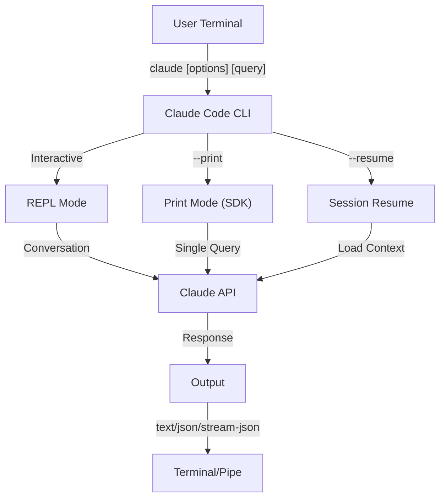
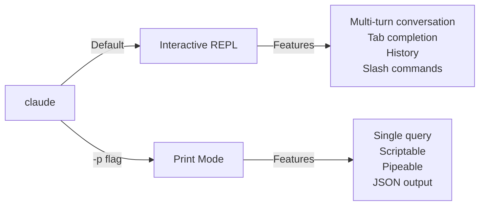

<picture>
  <source media="(prefers-color-scheme: dark)" srcset="../resources/logos/claude-howto-logo-dark.svg">
  
</picture>

# CLI Reference

## 概览

Claude Code CLI（命令行接口）是与 Claude Code 交互的核心方式。它提供了强大的选项来执行查询、管理会话、配置模型，并将 Claude 集成进你的开发工作流。

## 架构



## CLI Commands

| Command | Description | Example |
|---------|-------------|---------|
| `claude` | 启动交互式 REPL | `claude` |
| `claude "query"` | 带初始 prompt 启动 REPL | `claude "explain this project"` |
| `claude -p "query"` | Print mode：执行后退出 | `claude -p "explain this function"` |
| `cat file \| claude -p "query"` | 处理管道输入内容 | `cat logs.txt \| claude -p "explain"` |
| `claude -c` | 继续最近一次对话 | `claude -c` |
| `claude -c -p "query"` | 在 print mode 中继续会话 | `claude -c -p "check for type errors"` |
| `claude -r "<session>" "query"` | 通过 ID 或名称恢复会话 | `claude -r "auth-refactor" "finish this PR"` |
| `claude update` | 更新到最新版本 | `claude update` |
| `claude mcp` | 配置 MCP servers | 见 [MCP documentation](../05-mcp/) |
| `claude mcp serve` | 以 MCP server 方式运行 Claude Code | `claude mcp serve` |
| `claude agents` | 列出已配置 subagents | `claude agents` |
| `claude auto-mode defaults` | 以 JSON 打印 auto mode 默认规则 | `claude auto-mode defaults` |
| `claude remote-control` | 启动 Remote Control server | `claude remote-control` |
| `claude plugin` | 管理插件（安装/启用/禁用） | `claude plugin install my-plugin` |
| `claude auth login` | 登录（支持 `--email`、`--sso`） | `claude auth login --email user@example.com` |
| `claude auth logout` | 退出当前账号 | `claude auth logout` |
| `claude auth status` | 检查登录状态（登录返回 0，未登录返回 1） | `claude auth status` |

## Core Flags

| Flag | Description | Example |
|------|-------------|---------|
| `-p, --print` | 输出响应并退出（非交互） | `claude -p "query"` |
| `-c, --continue` | 加载最近一次对话 | `claude --continue` |
| `-r, --resume` | 按 ID 或名称恢复指定会话 | `claude --resume auth-refactor` |
| `-v, --version` | 输出版本号 | `claude -v` |
| `-w, --worktree` | 在隔离 git worktree 启动 | `claude -w` |
| `-n, --name` | 设置会话显示名称 | `claude -n "auth-refactor"` |
| `--from-pr <number>` | 恢复与 GitHub PR 关联的会话 | `claude --from-pr 42` |
| `--remote "task"` | 在 claude.ai 创建 web session | `claude --remote "implement API"` |
| `--remote-control, --rc` | 启动带 Remote Control 的交互会话 | `claude --rc` |
| `--teleport` | 在本地恢复 web session | `claude --teleport` |
| `--teammate-mode` | agent team 展示模式 | `claude --teammate-mode tmux` |
| `--bare` | 极简模式（跳过 hooks、skills、plugins、MCP、auto memory、CLAUDE.md） | `claude --bare` |
| `--enable-auto-mode` | 解锁自动权限模式 | `claude --enable-auto-mode` |
| `--channels` | 订阅 MCP channel 插件 | `claude --channels discord,telegram` |
| `--chrome` / `--no-chrome` | 启用/禁用 Chrome 集成 | `claude --chrome` |
| `--effort` | 设置推理强度等级 | `claude --effort high` |
| `--init` / `--init-only` | 运行初始化 hooks | `claude --init` |
| `--maintenance` | 运行维护 hooks 后退出 | `claude --maintenance` |
| `--disable-slash-commands` | 禁用所有 skills 和 slash commands | `claude --disable-slash-commands` |
| `--no-session-persistence` | 禁用会话保存（print mode） | `claude -p --no-session-persistence "query"` |

### Interactive vs Print Mode



**Interactive Mode**（默认）：

```bash
# 启动交互式会话
claude

# 带初始 prompt 启动
claude "explain the authentication flow"
```

**Print Mode**（非交互）：

```bash
# 单次查询后退出
claude -p "what does this function do?"

# 处理文件内容
cat error.log | claude -p "explain this error"

# 与其他工具串联
claude -p "list todos" | grep "URGENT"
```

## Model & Configuration

| Flag | Description | Example |
|------|-------------|---------|
| `--model` | 设置模型（sonnet、opus、haiku 或完整名称） | `claude --model opus` |
| `--fallback-model` | 负载拥挤时自动回退模型 | `claude -p --fallback-model sonnet "query"` |
| `--agent` | 为会话指定 agent | `claude --agent my-custom-agent` |
| `--agents` | 通过 JSON 定义自定义 subagents | 见 [Agents Configuration](#agents-configuration) |
| `--effort` | 设置思考强度（low、medium、high、max） | `claude --effort high` |

### Model Selection Examples

```bash
# 复杂任务使用 Opus 4.6
claude --model opus "design a caching strategy"

# 快速任务使用 Haiku 4.5
claude --model haiku -p "format this JSON"

# 使用完整模型名
claude --model claude-sonnet-4-6-20250929 "review this code"

# 配置 fallback 提升可用性
claude -p --model opus --fallback-model sonnet "analyze architecture"

# 使用 opusplan（Opus 规划，Sonnet 执行）
claude --model opusplan "design and implement the caching layer"
```

## System Prompt Customization

| Flag | Description | Example |
|------|-------------|---------|
| `--system-prompt` | 替换默认系统提示词 | `claude --system-prompt "You are a Python expert"` |
| `--system-prompt-file` | 从文件加载系统提示词（仅 print mode） | `claude -p --system-prompt-file ./prompt.txt "query"` |
| `--append-system-prompt` | 在默认提示词后追加内容 | `claude --append-system-prompt "Always use TypeScript"` |

### System Prompt Examples

```bash
# 完整自定义角色
claude --system-prompt "You are a senior security engineer. Focus on vulnerabilities."

# 追加特定约束
claude --append-system-prompt "Always include unit tests with code examples"

# 从文件加载复杂 prompt
claude -p --system-prompt-file ./prompts/code-reviewer.txt "review main.py"
```

### System Prompt Flags Comparison

| Flag | Behavior | Interactive | Print |
|------|----------|-------------|-------|
| `--system-prompt` | 替换默认系统提示词 | ✅ | ✅ |
| `--system-prompt-file` | 用文件内容替换系统提示词 | ❌ | ✅ |
| `--append-system-prompt` | 追加到默认系统提示词 | ✅ | ✅ |

**`--system-prompt-file` 仅用于 print mode。交互模式请使用 `--system-prompt` 或 `--append-system-prompt`。**

## Tool & Permission Management

| Flag | Description | Example |
|------|-------------|---------|
| `--tools` | 限制可用内置工具 | `claude -p --tools "Bash,Edit,Read" "query"` |
| `--allowedTools` | 无需确认即可执行的工具 | `"Bash(git log:*)" "Read"` |
| `--disallowedTools` | 从上下文移除的工具 | `"Bash(rm:*)" "Edit"` |
| `--dangerously-skip-permissions` | 跳过全部权限确认 | `claude --dangerously-skip-permissions` |
| `--permission-mode` | 以指定权限模式启动 | `claude --permission-mode auto` |
| `--permission-prompt-tool` | 用于权限处理的 MCP 工具 | `claude -p --permission-prompt-tool mcp_auth "query"` |
| `--enable-auto-mode` | 解锁自动权限模式 | `claude --enable-auto-mode` |

### Permission Examples

```bash
# 只读代码审查模式
claude --permission-mode plan "review this codebase"

# 仅启用安全工具
claude --tools "Read,Grep,Glob" -p "find all TODO comments"

# 允许特定 git 命令免确认
claude --allowedTools "Bash(git status:*)" "Bash(git log:*)"

# 阻止危险操作
claude --disallowedTools "Bash(rm -rf:*)" "Bash(git push --force:*)"
```

## Output & Format

| Flag | Description | Options | Example |
|------|-------------|---------|---------|
| `--output-format` | 指定输出格式（print mode） | `text`, `json`, `stream-json` | `claude -p --output-format json "query"` |
| `--input-format` | 指定输入格式（print mode） | `text`, `stream-json` | `claude -p --input-format stream-json` |
| `--verbose` | 启用详细日志 | | `claude --verbose` |
| `--include-partial-messages` | 包含流式中间事件 | 需配合 `stream-json` | `claude -p --output-format stream-json --include-partial-messages "query"` |
| `--json-schema` | 输出满足 JSON schema 的结果 | | `claude -p --json-schema '{"type":"object"}' "query"` |
| `--max-budget-usd` | print mode 最大预算 | | `claude -p --max-budget-usd 5.00 "query"` |

### Output Format Examples

```bash
# 纯文本（默认）
claude -p "explain this code"

# 便于程序处理的 JSON
claude -p --output-format json "list all functions in main.py"

# 实时处理流式 JSON
claude -p --output-format stream-json "generate a long report"

# 用 schema 校验结构化输出
claude -p --json-schema '{"type":"object","properties":{"bugs":{"type":"array"}}}' \
  "find bugs in this code and return as JSON"
```

## Workspace & Directory

| Flag | Description | Example |
|------|-------------|---------|
| `--add-dir` | 添加额外工作目录 | `claude --add-dir ../apps ../lib` |
| `--setting-sources` | 逗号分隔的设置来源 | `claude --setting-sources user,project` |
| `--settings` | 从文件或 JSON 加载设置 | `claude --settings ./settings.json` |
| `--plugin-dir` | 从目录加载插件（可重复） | `claude --plugin-dir ./my-plugin` |

### Multi-Directory Example

```bash
# 跨多个项目目录工作
claude --add-dir ../frontend ../backend ../shared "find all API endpoints"

# 加载自定义设置
claude --settings '{"model":"opus","verbose":true}' "complex task"
```

## MCP Configuration

| Flag | Description | Example |
|------|-------------|---------|
| `--mcp-config` | 从 JSON 加载 MCP servers | `claude --mcp-config ./mcp.json` |
| `--strict-mcp-config` | 严格只使用指定 MCP 配置 | `claude --strict-mcp-config --mcp-config ./mcp.json` |
| `--channels` | 订阅 MCP channel 插件 | `claude --channels discord,telegram` |

### MCP Examples

```bash
# 加载 GitHub MCP server
claude --mcp-config ./github-mcp.json "list open PRs"

# 严格模式：只使用指定 servers
claude --strict-mcp-config --mcp-config ./production-mcp.json "deploy to staging"
```

## Session Management

| Flag | Description | Example |
|------|-------------|---------|
| `--session-id` | 指定 session ID（UUID） | `claude --session-id "550e8400-..."` |
| `--fork-session` | 恢复会话时创建新分支会话 | `claude --resume abc123 --fork-session` |

### Session Examples

```bash
# 继续最近对话
claude -c

# 恢复命名会话
claude -r "feature-auth" "continue implementing login"

# fork 会话做实验
claude --resume feature-auth --fork-session "try alternative approach"

# 使用指定 session ID
claude --session-id "550e8400-e29b-41d4-a716-446655440000" "continue"
```

### Session Fork

从已有会话分叉一个新会话用于实验：

```bash
# fork 会话尝试另一种实现
claude --resume abc123 --fork-session "try alternative implementation"

# fork 并附带自定义说明
claude -r "feature-auth" --fork-session "test with different architecture"
```

**Use Cases:**
- 在不影响原会话的前提下尝试备选实现
- 并行探索多个思路
- 从成功会话分支出变体方案
- 测试破坏性改动而不污染主会话

原会话保持不变，fork 后会得到一个新的独立会话。

## Advanced Features

| Flag | Description | Example |
|------|-------------|---------|
| `--chrome` | 启用 Chrome 浏览器集成 | `claude --chrome` |
| `--no-chrome` | 禁用 Chrome 浏览器集成 | `claude --no-chrome` |
| `--ide` | 自动连接 IDE（如可用） | `claude --ide` |
| `--max-turns` | 限制 agentic turns（非交互） | `claude -p --max-turns 3 "query"` |
| `--debug` | 启用可过滤调试模式 | `claude --debug "api,mcp"` |
| `--enable-lsp-logging` | 启用详细 LSP 日志 | `claude --enable-lsp-logging` |
| `--betas` | API 请求使用 beta headers | `claude --betas interleaved-thinking` |
| `--plugin-dir` | 从目录加载插件（可重复） | `claude --plugin-dir ./my-plugin` |
| `--enable-auto-mode` | 解锁自动权限模式 | `claude --enable-auto-mode` |
| `--effort` | 设置思考强度 | `claude --effort high` |
| `--bare` | 极简模式（跳过 hooks、skills、plugins、MCP、auto memory、CLAUDE.md） | `claude --bare` |
| `--channels` | 订阅 MCP channel 插件 | `claude --channels discord` |
| `--fork-session` | 恢复时创建新 session ID | `claude --resume abc --fork-session` |
| `--max-budget-usd` | 最大预算（print mode） | `claude -p --max-budget-usd 5.00 "query"` |
| `--json-schema` | 校验后的 JSON 输出 | `claude -p --json-schema '{"type":"object"}' "q"` |

### Advanced Examples

```bash
# 限制自动执行步数
claude -p --max-turns 5 "refactor this module"

# 调试 API 调用
claude --debug "api" "test query"

# 启用 IDE 集成
claude --ide "help me with this file"
```

## Agents Configuration

`--agents` 参数接收 JSON 对象，用于定义会话级自定义 subagents。

### Agents JSON Format

```json
{
  "agent-name": {
    "description": "Required: when to invoke this agent",
    "prompt": "Required: system prompt for the agent",
    "tools": ["Optional", "array", "of", "tools"],
    "model": "optional: sonnet|opus|haiku"
  }
}
```

**Required Fields:**
- `description` - 说明何时调用该 agent
- `prompt` - 定义角色行为的系统提示词

**Optional Fields:**
- `tools` - 可用工具列表（省略时继承全部）
  - 格式：`["Read", "Grep", "Glob", "Bash"]`
- `model` - 指定模型：`sonnet`、`opus` 或 `haiku`

### Complete Agents Example

```json
{
  "code-reviewer": {
    "description": "Expert code reviewer. Use proactively after code changes.",
    "prompt": "You are a senior code reviewer. Focus on code quality, security, and best practices.",
    "tools": ["Read", "Grep", "Glob", "Bash"],
    "model": "sonnet"
  },
  "debugger": {
    "description": "Debugging specialist for errors and test failures.",
    "prompt": "You are an expert debugger. Analyze errors, identify root causes, and provide fixes.",
    "tools": ["Read", "Edit", "Bash", "Grep"],
    "model": "opus"
  },
  "documenter": {
    "description": "Documentation specialist for generating guides.",
    "prompt": "You are a technical writer. Create clear, comprehensive documentation.",
    "tools": ["Read", "Write"],
    "model": "haiku"
  }
}
```

### Agents Command Examples

```bash
# 内联定义自定义 agents
claude --agents '{
  "security-auditor": {
    "description": "Security specialist for vulnerability analysis",
    "prompt": "You are a security expert. Find vulnerabilities and suggest fixes.",
    "tools": ["Read", "Grep", "Glob"],
    "model": "opus"
  }
}' "audit this codebase for security issues"

# 从文件加载 agents
claude --agents "$(cat ~/.claude/agents.json)" "review the auth module"

# 与其他 flags 组合
claude -p --agents "$(cat agents.json)" --model sonnet "analyze performance"
```

### Agent Priority

当有多个 agent 来源时，优先级如下：
1. **CLI-defined**（`--agents`）- 会话级
2. **User-level**（`~/.claude/agents/`）- 全项目生效
3. **Project-level**（`.claude/agents/`）- 当前项目生效

CLI 定义会覆盖 user/project 级 agent（仅当前会话）。

---

## High-Value Use Cases

### 1. CI/CD Integration

在 CI/CD 中使用 Claude Code 做自动化代码审查、测试建议与文档生成。

**GitHub Actions Example:**

```yaml
name: AI Code Review

on: [pull_request]

jobs:
  review:
    runs-on: ubuntu-latest
    steps:
      - uses: actions/checkout@v4

      - name: Install Claude Code
        run: npm install -g @anthropic-ai/claude-code

      - name: Run Code Review
        env:
          ANTHROPIC_API_KEY: ${{ secrets.ANTHROPIC_API_KEY }}
        run: |
          claude -p --output-format json \
            --max-turns 1 \
            "Review the changes in this PR for:
            - Security vulnerabilities
            - Performance issues
            - Code quality
            Output as JSON with 'issues' array" > review.json

      - name: Post Review Comment
        uses: actions/github-script@v7
        with:
          script: |
            const fs = require('fs');
            const review = JSON.parse(fs.readFileSync('review.json', 'utf8'));
            // Process and post review comments
```

**Jenkins Pipeline:**

```groovy
pipeline {
    agent any
    stages {
        stage('AI Review') {
            steps {
                sh '''
                    claude -p --output-format json \
                      --max-turns 3 \
                      "Analyze test coverage and suggest missing tests" \
                      > coverage-analysis.json
                '''
            }
        }
    }
}
```

### 2. Script Piping

通过管道让 Claude 分析文件、日志和数据。

**Log Analysis:**

```bash
# 分析错误日志
tail -1000 /var/log/app/error.log | claude -p "summarize these errors and suggest fixes"

# 分析访问日志异常模式
cat access.log | claude -p "identify suspicious access patterns"

# 分析 git 历史
git log --oneline -50 | claude -p "summarize recent development activity"
```

**Code Processing:**

```bash
# 审查单个文件
cat src/auth.ts | claude -p "review this authentication code for security issues"

# 生成文档
cat src/api/*.ts | claude -p "generate API documentation in markdown"

# TODO 优先级排序
grep -r "TODO" src/ | claude -p "prioritize these TODOs by importance"
```

### 3. Multi-Session Workflows

通过多会话管理复杂项目。

```bash
# 启动 feature 会话
claude -r "feature-auth" "let's implement user authentication"

# 后续继续该会话
claude -r "feature-auth" "add password reset functionality"

# fork 分支尝试替代方案
claude --resume feature-auth --fork-session "try OAuth instead"

# 切换到另一 feature 会话
claude -r "feature-payments" "continue with Stripe integration"
```

### 4. Custom Agent Configuration

为团队工作流定义专用 agents。

```bash
# 保存 agents 配置
cat > ~/.claude/agents.json << 'EOF'
{
  "reviewer": {
    "description": "Code reviewer for PR reviews",
    "prompt": "Review code for quality, security, and maintainability.",
    "model": "opus"
  },
  "documenter": {
    "description": "Documentation specialist",
    "prompt": "Generate clear, comprehensive documentation.",
    "model": "sonnet"
  },
  "refactorer": {
    "description": "Code refactoring expert",
    "prompt": "Suggest and implement clean code refactoring.",
    "tools": ["Read", "Edit", "Glob"]
  }
}
EOF

# 在会话中使用
claude --agents "$(cat ~/.claude/agents.json)" "review the auth module"
```

### 5. Batch Processing

用一致配置批量处理多个查询。

```bash
# 批量处理文件
for file in src/*.ts; do
  echo "Processing $file..."
  claude -p --model haiku "summarize this file: $(cat $file)" >> summaries.md
done

# 批量代码审查
find src -name "*.py" -exec sh -c '
  echo "## $1" >> review.md
  cat "$1" | claude -p "brief code review" >> review.md
' _ {} \;

# 为所有模块生成测试
for module in $(ls src/modules/); do
  claude -p "generate unit tests for src/modules/$module" > "tests/$module.test.ts"
done
```

### 6. Security-Conscious Development

用权限控制保障安全。

```bash
# 只读安全审计
claude --permission-mode plan \
  --tools "Read,Grep,Glob" \
  "audit this codebase for security vulnerabilities"

# 屏蔽危险命令
claude --disallowedTools "Bash(rm:*)" "Bash(curl:*)" "Bash(wget:*)" \
  "help me clean up this project"

# 受限自动化
claude -p --max-turns 2 \
  --allowedTools "Read" "Glob" \
  "find all hardcoded credentials"
```

### 7. JSON API Integration

将 Claude 作为可编程 API，与 `jq` 配合处理结构化输出。

```bash
# 获取结构化分析
claude -p --output-format json \
  --json-schema '{"type":"object","properties":{"functions":{"type":"array"},"complexity":{"type":"string"}}}' \
  "analyze main.py and return function list with complexity rating"

# 与 jq 组合处理
claude -p --output-format json "list all API endpoints" | jq '.endpoints[]'

# 在脚本中使用
RESULT=$(claude -p --output-format json "is this code secure? answer with {secure: boolean, issues: []}" < code.py)
if echo "$RESULT" | jq -e '.secure == false' > /dev/null; then
  echo "Security issues found!"
  echo "$RESULT" | jq '.issues[]'
fi
```

### jq Parsing Examples

使用 `jq` 解析 Claude JSON 输出：

```bash
# 提取特定字段
claude -p --output-format json "analyze this code" | jq '.result'

# 过滤数组元素
claude -p --output-format json "list issues" | jq -r '.issues[] | select(.severity=="high")'

# 提取多个字段
claude -p --output-format json "describe the project" | jq -r '.{name, version, description}'

# 转 CSV
claude -p --output-format json "list functions" | jq -r '.functions[] | [.name, .lineCount] | @csv'

# 条件处理
claude -p --output-format json "check security" | jq 'if .vulnerabilities | length > 0 then "UNSAFE" else "SAFE" end'

# 提取嵌套值
claude -p --output-format json "analyze performance" | jq '.metrics.cpu.usage'

# 统计数组
claude -p --output-format json "find todos" | jq '.todos | length'

# 输出转换
claude -p --output-format json "list improvements" | jq 'map({title: .title, priority: .priority})'
```

---

## Models

Claude Code 支持多个模型，各有能力侧重：

| Model | ID | Context Window | Notes |
|-------|-----|----------------|-------|
| Opus 4.6 | `claude-opus-4-6` | 1M tokens | 能力最强，支持自适应 effort |
| Sonnet 4.6 | `claude-sonnet-4-6` | 1M tokens | 速度与能力平衡 |
| Haiku 4.5 | `claude-haiku-4-5` | 1M tokens | 最快，适合快速任务 |

### Model Selection

```bash
# 使用短名称
claude --model opus "complex architectural review"
claude --model sonnet "implement this feature"
claude --model haiku -p "format this JSON"

# 使用 opusplan 别名（Opus 规划，Sonnet 执行）
claude --model opusplan "design and implement the API"

# 会话中切换 fast mode
/fast
```

### Effort Levels (Opus 4.6)

Opus 4.6 支持不同推理深度：

```bash
# CLI 设置 effort
claude --effort high "complex review"

# slash command 设置 effort
/effort high

# 环境变量设置 effort
export CLAUDE_CODE_EFFORT_LEVEL=high   # low, medium, high, or max (Opus 4.6 only)
```

在 prompt 中使用 `ultrathink` 可触发深度推理；`max` 仅 Opus 4.6 支持。

---

## Key Environment Variables

| Variable | Description |
|----------|-------------|
| `ANTHROPIC_API_KEY` | 认证 API key |
| `ANTHROPIC_MODEL` | 覆盖默认模型 |
| `ANTHROPIC_CUSTOM_MODEL_OPTION` | API 自定义模型选项 |
| `ANTHROPIC_DEFAULT_OPUS_MODEL` | 覆盖默认 Opus 模型 ID |
| `ANTHROPIC_DEFAULT_SONNET_MODEL` | 覆盖默认 Sonnet 模型 ID |
| `ANTHROPIC_DEFAULT_HAIKU_MODEL` | 覆盖默认 Haiku 模型 ID |
| `MAX_THINKING_TOKENS` | 扩展思考 token 预算 |
| `CLAUDE_CODE_EFFORT_LEVEL` | 设置 effort（`low`/`medium`/`high`/`max`） |
| `CLAUDE_CODE_SIMPLE` | 极简模式（由 `--bare` 设置） |
| `CLAUDE_CODE_DISABLE_AUTO_MEMORY` | 禁用自动 CLAUDE.md 更新 |
| `CLAUDE_CODE_DISABLE_BACKGROUND_TASKS` | 禁用后台任务执行 |
| `CLAUDE_CODE_DISABLE_CRON` | 禁用计划/cron 任务 |
| `CLAUDE_CODE_DISABLE_GIT_INSTRUCTIONS` | 禁用 git 相关指令 |
| `CLAUDE_CODE_DISABLE_TERMINAL_TITLE` | 禁用终端标题更新 |
| `CLAUDE_CODE_DISABLE_1M_CONTEXT` | 禁用 1M 上下文窗口 |
| `CLAUDE_CODE_DISABLE_NONSTREAMING_FALLBACK` | 禁用非流式 fallback |
| `CLAUDE_CODE_ENABLE_TASKS` | 启用任务列表功能 |
| `CLAUDE_CODE_TASK_LIST_ID` | 跨会话共享的命名任务目录 |
| `CLAUDE_CODE_ENABLE_PROMPT_SUGGESTION` | 切换提示建议（`true`/`false`） |
| `CLAUDE_CODE_EXPERIMENTAL_AGENT_TEAMS` | 启用实验性 agent teams |
| `CLAUDE_CODE_NEW_INIT` | 使用新初始化流程 |
| `CLAUDE_CODE_SUBAGENT_MODEL` | subagent 执行模型 |
| `CLAUDE_CODE_PLUGIN_SEED_DIR` | plugin seed 文件目录 |
| `CLAUDE_CODE_SUBPROCESS_ENV_SCRUB` | 子进程需擦除的环境变量 |
| `CLAUDE_AUTOCOMPACT_PCT_OVERRIDE` | 覆盖自动压缩阈值 |
| `CLAUDE_STREAM_IDLE_TIMEOUT_MS` | 流空闲超时（毫秒） |
| `SLASH_COMMAND_TOOL_CHAR_BUDGET` | slash command 工具字符预算 |
| `ENABLE_TOOL_SEARCH` | 启用工具搜索能力 |
| `MAX_MCP_OUTPUT_TOKENS` | MCP 工具输出最大 token |

---

## Quick Reference

### Most Common Commands

```bash
# 交互会话
claude

# 快速问答
claude -p "how do I..."

# 继续会话
claude -c

# 处理文件
cat file.py | claude -p "review this"

# 脚本用 JSON 输出
claude -p --output-format json "query"
```

### Flag Combinations

| Use Case | Command |
|----------|---------|
| 快速代码审查 | `cat file | claude -p "review"` |
| 结构化输出 | `claude -p --output-format json "query"` |
| 安全探索 | `claude --permission-mode plan` |
| 自动化 + 安全 | `claude --enable-auto-mode --permission-mode auto` |
| CI/CD 集成 | `claude -p --max-turns 3 --output-format json` |
| 恢复工作 | `claude -r "session-name"` |
| 自定义模型 | `claude --model opus "complex task"` |
| 极简模式 | `claude --bare "quick query"` |
| 预算上限运行 | `claude -p --max-budget-usd 2.00 "analyze code"` |

---

## Troubleshooting

### Command Not Found

**Problem:** `claude: command not found`

**Solutions:**
- 安装 Claude Code：`npm install -g @anthropic-ai/claude-code`
- 检查 PATH 是否包含 npm 全局 bin
- 尝试完整路径：`npx claude`

### API Key Issues

**Problem:** 认证失败

**Solutions:**
- 设置 API key：`export ANTHROPIC_API_KEY=your-key`
- 确认 key 有效且额度充足
- 确认模型权限满足请求

### Session Not Found

**Problem:** 无法恢复会话

**Solutions:**
- 列出会话确认名称/ID
- 会话可能因长期未使用而失效
- 使用 `-c` 恢复最近会话

### Output Format Issues

**Problem:** JSON 输出格式错误

**Solutions:**
- 使用 `--json-schema` 强制结构
- 在 prompt 中明确 JSON 输出要求
- 使用 `--output-format json`（不要只在 prompt 里口头要求 JSON）

### Permission Denied

**Problem:** 工具执行被拦截

**Solutions:**
- 检查 `--permission-mode`
- 检查 `--allowedTools` / `--disallowedTools`
- 自动化场景可谨慎使用 `--dangerously-skip-permissions`

---

## Additional Resources

- **[Official CLI Reference](https://code.claude.com/docs/en/cli-reference)** - 完整命令参考
- **[Headless Mode Documentation](https://code.claude.com/docs/en/headless)** - 自动化执行
- **[Slash Commands](../01-slash-commands/)** - Claude 内部快捷命令
- **[Memory Guide](../02-memory/)** - 基于 CLAUDE.md 的持久上下文
- **[MCP Protocol](../05-mcp/)** - 外部工具集成
- **[Advanced Features](../09-advanced-features/)** - plan mode、extended thinking
- **[Subagents Guide](../04-subagents/)** - 委派式任务执行

---

*Part of the [Claude How To](../) guide series*
