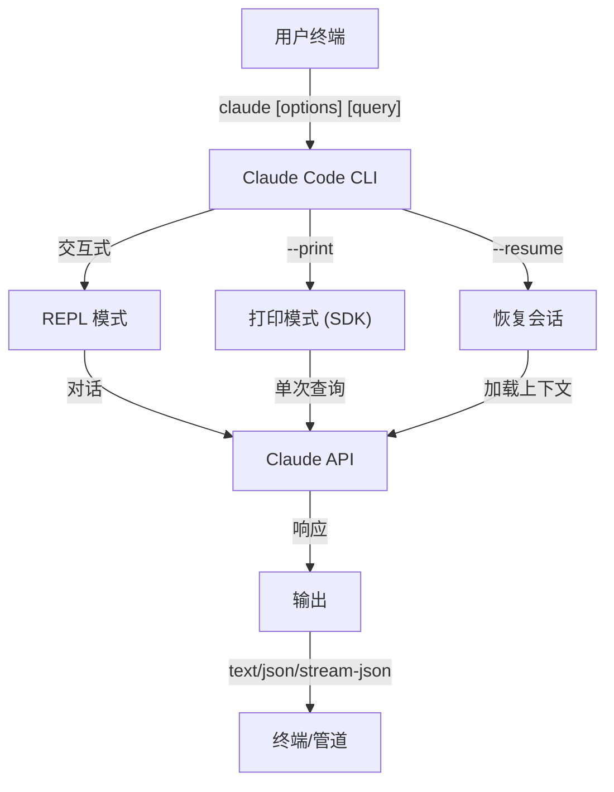
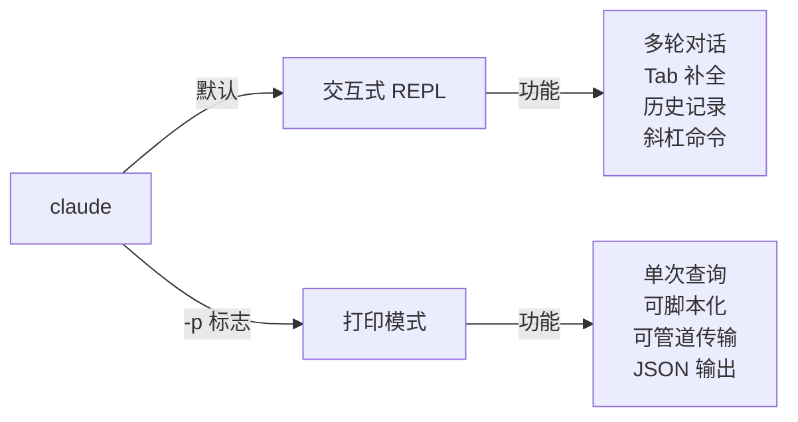

<picture>
  <source media="(prefers-color-scheme: dark)" srcset="../resources/logos/claude-howto-logo-dark.svg">
  
</picture>

# CLI 参考手册

## 概述

Claude Code CLI（命令行界面）是与 Claude Code 交互的主要方式。它提供了强大的选项，用于执行查询、管理会话、配置模型，以及将 Claude 集成到你的开发工作流中。

## 架构



## CLI 命令

| 命令 | 描述 | 示例 |
|---------|-------------|---------|
| `claude` | 启动交互式 REPL | `claude` |
| `claude "query"` | 携带初始提示词启动 REPL | `claude "explain this project"` |
| `claude -p "query"` | 打印模式 - 查询后退出 | `claude -p "explain this function"` |
| `cat file \| claude -p "query"` | 处理管道内容 | `cat logs.txt \| claude -p "explain"` |
| `claude -c` | 继续最近的对话 | `claude -c` |
| `claude -c -p "query"` | 在打印模式下继续对话 | `claude -c -p "check for type errors"` |
| `claude -r "<session>" "query"` | 通过 ID 或名称恢复会话 | `claude -r "auth-refactor" "finish this PR"` |
| `claude update` | 更新到最新版本 | `claude update` |
| `claude mcp` | 配置 MCP 服务器 | 参见 [MCP 文档](../05-mcp/) |
| `claude mcp serve` | 将 Claude Code 作为 MCP 服务器运行 | `claude mcp serve` |
| `claude agents` | 列出所有已配置的子代理 | `claude agents` |
| `claude auto-mode defaults` | 以 JSON 格式打印自动模式默认规则 | `claude auto-mode defaults` |
| `claude remote-control` | 启动远程控制服务器 | `claude remote-control` |
| `claude plugin` | 管理插件（安装、启用、禁用） | `claude plugin install my-plugin` |
| `claude auth login` | 登录（支持 `--email`、`--sso`） | `claude auth login --email user@example.com` |
| `claude auth logout` | 退出当前账户 | `claude auth logout` |
| `claude auth status` | 检查认证状态（已登录返回 0，未登录返回 1） | `claude auth status` |

## 核心标志

| 标志 | 描述 | 示例 |
|------|-------------|---------|
| `-p, --print` | 以非交互模式打印响应 | `claude -p "query"` |
| `-c, --continue` | 加载最近的对话 | `claude --continue` |
| `-r, --resume` | 通过 ID 或名称恢复特定会话 | `claude --resume auth-refactor` |
| `-v, --version` | 输出版本号 | `claude -v` |
| `-w, --worktree` | 在隔离的 git worktree 中启动 | `claude -w` |
| `-n, --name` | 会话显示名称 | `claude -n "auth-refactor"` |
| `--from-pr <number>` | 恢复与 GitHub PR 关联的会话 | `claude --from-pr 42` |
| `--remote "task"` | 在 claude.ai 上创建 Web 会话 | `claude --remote "implement API"` |
| `--remote-control, --rc` | 使用远程控制的交互式会话 | `claude --rc` |
| `--teleport` | 在本地恢复 Web 会话 | `claude --teleport` |
| `--teammate-mode` | 代理团队显示模式 | `claude --teammate-mode tmux` |
| `--bare` | 最简模式（跳过钩子、技能、插件、MCP、自动记忆、CLAUDE.md） | `claude --bare` |
| `--enable-auto-mode` | 解锁自动权限模式 | `claude --enable-auto-mode` |
| `--channels` | 订阅 MCP 频道插件 | `claude --channels discord,telegram` |
| `--chrome` / `--no-chrome` | 启用/禁用 Chrome 浏览器集成 | `claude --chrome` |
| `--effort` | 设置思考努力程度 | `claude --effort high` |
| `--init` / `--init-only` | 运行初始化钩子 | `claude --init` |
| `--maintenance` | 运行维护钩子并退出 | `claude --maintenance` |
| `--disable-slash-commands` | 禁用所有技能和斜杠命令 | `claude --disable-slash-commands` |
| `--no-session-persistence` | 禁用会话保存（打印模式） | `claude -p --no-session-persistence "query"` |

### 交互模式 vs 打印模式



**交互模式**（默认）：
```bash
# 启动交互式会话
claude

# 携带初始提示词启动
claude "explain the authentication flow"
```

**打印模式**（非交互式）：
```bash
# 单次查询后退出
claude -p "what does this function do?"

# 处理文件内容
cat error.log | claude -p "explain this error"

# 与其他工具组合使用
claude -p "list todos" | grep "URGENT"
```

## 模型与配置

| 标志 | 描述 | 示例 |
|------|-------------|---------|
| `--model` | 设置模型（sonnet、opus、haiku 或完整名称） | `claude --model opus` |
| `--fallback-model` | 过载时自动回退模型 | `claude -p --fallback-model sonnet "query"` |
| `--agent` | 为会话指定代理 | `claude --agent my-custom-agent` |
| `--agents` | 通过 JSON 定义自定义子代理 | 参见[代理配置](#代理配置) |
| `--effort` | 设置努力程度（low、medium、high、max） | `claude --effort high` |

### 模型选择示例

```bash
# 使用 Opus 4.6 处理复杂任务
claude --model opus "design a caching strategy"

# 使用 Haiku 4.5 处理快速任务
claude --model haiku -p "format this JSON"

# 完整模型名称
claude --model claude-sonnet-4-6-20250929 "review this code"

# 使用回退模型以提高可靠性
claude -p --model opus --fallback-model sonnet "analyze architecture"

# 使用 opusplan（Opus 规划，Sonnet 执行）
claude --model opusplan "design and implement the caching layer"
```

## 系统提示词定制

| 标志 | 描述 | 示例 |
|------|-------------|---------|
| `--system-prompt` | 替换整个默认提示词 | `claude --system-prompt "You are a Python expert"` |
| `--system-prompt-file` | 从文件加载提示词（打印模式） | `claude -p --system-prompt-file ./prompt.txt "query"` |
| `--append-system-prompt` | 追加到默认提示词 | `claude --append-system-prompt "Always use TypeScript"` |

### 系统提示词示例

```bash
# 完整的自定义角色设定
claude --system-prompt "You are a senior security engineer. Focus on vulnerabilities."

# 追加特定指令
claude --append-system-prompt "Always include unit tests with code examples"

# 从文件加载复杂提示词
claude -p --system-prompt-file ./prompts/code-reviewer.txt "review main.py"
```

### 系统提示词标志对比

| 标志 | 行为 | 交互模式 | 打印模式 |
|------|----------|-------------|-------|
| `--system-prompt` | 替换整个默认系统提示词 | ✅ | ✅ |
| `--system-prompt-file` | 用文件中的提示词替换 | ❌ | ✅ |
| `--append-system-prompt` | 追加到默认系统提示词 | ✅ | ✅ |

**`--system-prompt-file` 仅在打印模式下使用。交互模式请使用 `--system-prompt` 或 `--append-system-prompt`。**

## 工具与权限管理

| 标志 | 描述 | 示例 |
|------|-------------|---------|
| `--tools` | 限制可用的内置工具 | `claude -p --tools "Bash,Edit,Read" "query"` |
| `--allowedTools` | 无需提示即可执行的工具 | `"Bash(git log:*)" "Read"` |
| `--disallowedTools` | 从上下文中移除的工具 | `"Bash(rm:*)" "Edit"` |
| `--dangerously-skip-permissions` | 跳过所有权限提示 | `claude --dangerously-skip-permissions` |
| `--permission-mode` | 以指定权限模式启动 | `claude --permission-mode auto` |
| `--permission-prompt-tool` | 用于权限处理的 MCP 工具 | `claude -p --permission-prompt-tool mcp_auth "query"` |
| `--enable-auto-mode` | 解锁自动权限模式 | `claude --enable-auto-mode` |

### 权限示例

```bash
# 代码审查的只读模式
claude --permission-mode plan "review this codebase"

# 仅限安全工具
claude --tools "Read,Grep,Glob" -p "find all TODO comments"

# 允许特定 git 命令无需提示
claude --allowedTools "Bash(git status:*)" "Bash(git log:*)"

# 阻止危险操作
claude --disallowedTools "Bash(rm -rf:*)" "Bash(git push --force:*)"
```

## 输出与格式

| 标志 | 描述 | 选项 | 示例 |
|------|-------------|---------|---------|
| `--output-format` | 指定输出格式（打印模式） | `text`, `json`, `stream-json` | `claude -p --output-format json "query"` |
| `--input-format` | 指定输入格式（打印模式） | `text`, `stream-json` | `claude -p --input-format stream-json` |
| `--verbose` | 启用详细日志 | | `claude --verbose` |
| `--include-partial-messages` | 包含流式事件 | 需要 `stream-json` | `claude -p --output-format stream-json --include-partial-messages "query"` |
| `--json-schema` | 获取符合 schema 的经验证 JSON | | `claude -p --json-schema '{"type":"object"}' "query"` |
| `--max-budget-usd` | 打印模式的最大花费 | | `claude -p --max-budget-usd 5.00 "query"` |

### 输出格式示例

```bash
# 纯文本（默认）
claude -p "explain this code"

# JSON 用于程序化处理
claude -p --output-format json "list all functions in main.py"

# 流式 JSON 用于实时处理
claude -p --output-format stream-json "generate a long report"

# 带 schema 验证的结构化输出
claude -p --json-schema '{"type":"object","properties":{"bugs":{"type":"array"}}}' \
  "find bugs in this code and return as JSON"
```

## 工作区与目录

| 标志 | 描述 | 示例 |
|------|-------------|---------|
| `--add-dir` | 添加额外的工作目录 | `claude --add-dir ../apps ../lib` |
| `--setting-sources` | 逗号分隔的配置来源 | `claude --setting-sources user,project` |
| `--settings` | 从文件或 JSON 加载配置 | `claude --settings ./settings.json` |
| `--plugin-dir` | 从目录加载插件（可重复） | `claude --plugin-dir ./my-plugin` |

### 多目录示例

```bash
# 跨多个项目目录工作
claude --add-dir ../frontend ../backend ../shared "find all API endpoints"

# 加载自定义配置
claude --settings '{"model":"opus","verbose":true}' "complex task"
```

## MCP 配置

| 标志 | 描述 | 示例 |
|------|-------------|---------|
| `--mcp-config` | 从 JSON 加载 MCP 服务器 | `claude --mcp-config ./mcp.json` |
| `--strict-mcp-config` | 仅使用指定的 MCP 配置 | `claude --strict-mcp-config --mcp-config ./mcp.json` |
| `--channels` | 订阅 MCP 频道插件 | `claude --channels discord,telegram` |

### MCP 示例

```bash
# 加载 GitHub MCP 服务器
claude --mcp-config ./github-mcp.json "list open PRs"

# 严格模式 - 仅使用指定服务器
claude --strict-mcp-config --mcp-config ./production-mcp.json "deploy to staging"
```

## 会话管理

| 标志 | 描述 | 示例 |
|------|-------------|---------|
| `--session-id` | 使用特定会话 ID（UUID） | `claude --session-id "550e8400-..."` |
| `--fork-session` | 恢复时创建新会话 | `claude --resume abc123 --fork-session` |

### 会话示例

```bash
# 继续上次对话
claude -c

# 恢复命名会话
claude -r "feature-auth" "continue implementing login"

# Fork 会话用于实验
claude --resume feature-auth --fork-session "try alternative approach"

# 使用特定会话 ID
claude --session-id "550e8400-e29b-41d4-a716-446655440000" "continue"
```

### 会话 Fork

从现有会话创建分支用于实验：

```bash
# Fork 会话以尝试不同的方案
claude --resume abc123 --fork-session "try alternative implementation"

# 带自定义消息的 Fork
claude -r "feature-auth" --fork-session "test with different architecture"
```

**使用场景：**
- 在不丢失原始会话的情况下尝试替代实现
- 并行实验不同方案
- 从成功的工作创建变体分支
- 在不影响主会话的情况下测试破坏性更改

原始会话保持不变，Fork 成为新的独立会话。

## 高级功能

| 标志 | 描述 | 示例 |
|------|-------------|---------|
| `--chrome` | 启用 Chrome 浏览器集成 | `claude --chrome` |
| `--no-chrome` | 禁用 Chrome 浏览器集成 | `claude --no-chrome` |
| `--ide` | 如果可用则自动连接 IDE | `claude --ide` |
| `--max-turns` | 限制代理轮次（非交互式） | `claude -p --max-turns 3 "query"` |
| `--debug` | 启用带过滤的调试模式 | `claude --debug "api,mcp"` |
| `--enable-lsp-logging` | 启用详细 LSP 日志 | `claude --enable-lsp-logging` |
| `--betas` | API 请求的 Beta 头 | `claude --betas interleaved-thinking` |
| `--plugin-dir` | 从目录加载插件（可重复） | `claude --plugin-dir ./my-plugin` |
| `--enable-auto-mode` | 解锁自动权限模式 | `claude --enable-auto-mode` |
| `--effort` | 设置思考努力程度 | `claude --effort high` |
| `--bare` | 最简模式（跳过钩子、技能、插件、MCP、自动记忆、CLAUDE.md） | `claude --bare` |
| `--channels` | 订阅 MCP 频道插件 | `claude --channels discord` |
| `--fork-session` | 恢复时创建新会话 ID | `claude --resume abc --fork-session` |
| `--max-budget-usd` | 最大花费（打印模式） | `claude -p --max-budget-usd 5.00 "query"` |
| `--json-schema` | 经验证的 JSON 输出 | `claude -p --json-schema '{"type":"object"}' "q"` |

### 高级示例

```bash
# 限制自主操作
claude -p --max-turns 5 "refactor this module"

# 调试 API 调用
claude --debug "api" "test query"

# 启用 IDE 集成
claude --ide "help me with this file"
```

## 代理配置

`--agents` 标志接受一个 JSON 对象，用于为会话定义自定义子代理。

### 代理 JSON 格式

```json
{
  "agent-name": {
    "description": "必填：何时调用此代理",
    "prompt": "必填：代理的系统提示词",
    "tools": ["可选", "工具", "数组"],
    "model": "可选：sonnet|opus|haiku"
  }
}
```

**必填字段：**
- `description` - 自然语言描述，说明何时使用此代理
- `prompt` - 定义代理角色和行为的系统提示词

**可选字段：**
- `tools` - 可用工具数组（省略则继承全部）
  - 格式：`["Read", "Grep", "Glob", "Bash"]`
- `model` - 使用的模型：`sonnet`、`opus` 或 `haiku`

### 完整代理示例

```json
{
  "code-reviewer": {
    "description": "Expert code reviewer. Use proactively after code changes.",
    "prompt": "You are a senior code reviewer. Focus on code quality, security, and best practices.",
    "tools": ["Read", "Grep", "Glob", "Bash"],
    "model": "sonnet"
  },
  "debugger": {
    "description": "Debugging specialist for errors and test failures.",
    "prompt": "You are an expert debugger. Analyze errors, identify root causes, and provide fixes.",
    "tools": ["Read", "Edit", "Bash", "Grep"],
    "model": "opus"
  },
  "documenter": {
    "description": "Documentation specialist for generating guides.",
    "prompt": "You are a technical writer. Create clear, comprehensive documentation.",
    "tools": ["Read", "Write"],
    "model": "haiku"
  }
}
```

### 代理命令示例

```bash
# 内联定义自定义代理
claude --agents '{
  "security-auditor": {
    "description": "Security specialist for vulnerability analysis",
    "prompt": "You are a security expert. Find vulnerabilities and suggest fixes.",
    "tools": ["Read", "Grep", "Glob"],
    "model": "opus"
  }
}' "audit this codebase for security issues"

# 从文件加载代理
claude --agents "$(cat ~/.claude/agents.json)" "review the auth module"

# 与其他标志组合使用
claude -p --agents "$(cat agents.json)" --model sonnet "analyze performance"
```

### 代理优先级

当存在多个代理定义时，按以下优先级顺序加载：
1. **CLI 定义**（`--agents` 标志）- 会话专用
2. **用户级别**（`~/.claude/agents/`）- 适用于所有项目
3. **项目级别**（`.claude/agents/`）- 仅当前项目

CLI 定义的代理在会话中会覆盖用户级和项目级代理。

---

## 高价值使用场景

### 1. CI/CD 集成

在 CI/CD 流水线中使用 Claude Code 进行自动代码审查、测试和文档生成。

**GitHub Actions 示例：**

```yaml
name: AI Code Review

on: [pull_request]

jobs:
  review:
    runs-on: ubuntu-latest
    steps:
      - uses: actions/checkout@v4

      - name: Install Claude Code
        run: npm install -g @anthropic-ai/claude-code

      - name: Run Code Review
        env:
          ANTHROPIC_API_KEY: ${{ secrets.ANTHROPIC_API_KEY }}
        run: |
          claude -p --output-format json \
            --max-turns 1 \
            "Review the changes in this PR for:
            - Security vulnerabilities
            - Performance issues
            - Code quality
            Output as JSON with 'issues' array" > review.json

      - name: Post Review Comment
        uses: actions/github-script@v7
        with:
          script: |
            const fs = require('fs');
            const review = JSON.parse(fs.readFileSync('review.json', 'utf8'));
            // Process and post review comments
```

**Jenkins Pipeline：**

```groovy
pipeline {
    agent any
    stages {
        stage('AI Review') {
            steps {
                sh '''
                    claude -p --output-format json \
                      --max-turns 3 \
                      "Analyze test coverage and suggest missing tests" \
                      > coverage-analysis.json
                '''
            }
        }
    }
}
```

### 2. 脚本管道

通过 Claude 处理文件、日志和数据以进行分析。

**日志分析：**

```bash
# 分析错误日志
tail -1000 /var/log/app/error.log | claude -p "summarize these errors and suggest fixes"

# 查找访问日志中的模式
cat access.log | claude -p "identify suspicious access patterns"

# 分析 git 历史
git log --oneline -50 | claude -p "summarize recent development activity"
```

**代码处理：**

```bash
# 审查特定文件
cat src/auth.ts | claude -p "review this authentication code for security issues"

# 生成文档
cat src/api/*.ts | claude -p "generate API documentation in markdown"

# 查找 TODO 并排优先级
grep -r "TODO" src/ | claude -p "prioritize these TODOs by importance"
```

### 3. 多会话工作流

使用多个对话线程管理复杂项目。

```bash
# 启动功能分支会话
claude -r "feature-auth" "let's implement user authentication"

# 稍后继续该会话
claude -r "feature-auth" "add password reset functionality"

# Fork 以尝试替代方案
claude --resume feature-auth --fork-session "try OAuth instead"

# 在不同功能会话之间切换
claude -r "feature-payments" "continue with Stripe integration"
```

### 4. 自定义代理配置

为团队工作流定义专用代理。

```bash
# 将代理配置保存到文件
cat > ~/.claude/agents.json << 'EOF'
{
  "reviewer": {
    "description": "Code reviewer for PR reviews",
    "prompt": "Review code for quality, security, and maintainability.",
    "model": "opus"
  },
  "documenter": {
    "description": "Documentation specialist",
    "prompt": "Generate clear, comprehensive documentation.",
    "model": "sonnet"
  },
  "refactorer": {
    "description": "Code refactoring expert",
    "prompt": "Suggest and implement clean code refactoring.",
    "tools": ["Read", "Edit", "Glob"]
  }
}
EOF

# 在会话中使用代理
claude --agents "$(cat ~/.claude/agents.json)" "review the auth module"
```

### 5. 批量处理

使用一致的配置处理多个查询。

```bash
# 处理多个文件
for file in src/*.ts; do
  echo "Processing $file..."
  claude -p --model haiku "summarize this file: $(cat $file)" >> summaries.md
done

# 批量代码审查
find src -name "*.py" -exec sh -c '
  echo "## $1" >> review.md
  cat "$1" | claude -p "brief code review" >> review.md
' _ {} \;

# 为所有模块生成测试
for module in $(ls src/modules/); do
  claude -p "generate unit tests for src/modules/$module" > "tests/$module.test.ts"
done
```

### 6. 安全意识开发

使用权限控制进行安全操作。

```bash
# 只读安全审计
claude --permission-mode plan \
  --tools "Read,Grep,Glob" \
  "audit this codebase for security vulnerabilities"

# 阻止危险命令
claude --disallowedTools "Bash(rm:*)" "Bash(curl:*)" "Bash(wget:*)" \
  "help me clean up this project"

# 受限自动化
claude -p --max-turns 2 \
  --allowedTools "Read" "Glob" \
  "find all hardcoded credentials"
```

### 7. JSON API 集成

使用 Claude 作为工具的可编程 API，结合 `jq` 解析。

```bash
# 获取结构化分析
claude -p --output-format json \
  --json-schema '{"type":"object","properties":{"functions":{"type":"array"},"complexity":{"type":"string"}}}' \
  "analyze main.py and return function list with complexity rating"

# 与 jq 集成进行处理
claude -p --output-format json "list all API endpoints" | jq '.endpoints[]'

# 在脚本中使用
RESULT=$(claude -p --output-format json "is this code secure? answer with {secure: boolean, issues: []}" < code.py)
if echo "$RESULT" | jq -e '.secure == false' > /dev/null; then
  echo "Security issues found!"
  echo "$RESULT" | jq '.issues[]'
fi
```

### jq 解析示例

使用 `jq` 解析和处理 Claude 的 JSON 输出：

```bash
# 提取特定字段
claude -p --output-format json "analyze this code" | jq '.result'

# 过滤数组元素
claude -p --output-format json "list issues" | jq -r '.issues[] | select(.severity=="high")'

# 提取多个字段
claude -p --output-format json "describe the project" | jq -r '.{name, version, description}'

# 转换为 CSV
claude -p --output-format json "list functions" | jq -r '.functions[] | [.name, .lineCount] | @csv'

# 条件处理
claude -p --output-format json "check security" | jq 'if .vulnerabilities | length > 0 then "UNSAFE" else "SAFE" end'

# 提取嵌套值
claude -p --output-format json "analyze performance" | jq '.metrics.cpu.usage'

# 处理完整数组
claude -p --output-format json "find todos" | jq '.todos | length'

# 转换输出
claude -p --output-format json "list improvements" | jq 'map({title: .title, priority: .priority})'
```

---

## 模型

Claude Code 支持多种具有不同能力的模型：

| 模型 | ID | 上下文窗口 | 备注 |
|-------|-----|----------------|-------|
| Opus 4.6 | `claude-opus-4-6` | 1M tokens | 能力最强，支持自适应努力程度 |
| Sonnet 4.6 | `claude-sonnet-4-6` | 1M tokens | 速度与能力均衡 |
| Haiku 4.5 | `claude-haiku-4-5` | 1M tokens | 最快，最适合快速任务 |

### 模型选择

```bash
# 使用短名称
claude --model opus "complex architectural review"
claude --model sonnet "implement this feature"
claude --model haiku -p "format this JSON"

# 使用 opusplan 别名（Opus 规划，Sonnet 执行）
claude --model opusplan "design and implement the API"

# 在会话中切换快速模式
/fast
```

### 努力程度（Opus 4.6）

Opus 4.6 支持自适应推理，具有不同的努力程度：

```bash
# 通过 CLI 标志设置努力程度
claude --effort high "complex review"

# 通过斜杠命令设置努力程度
/effort high

# 通过环境变量设置努力程度
export CLAUDE_CODE_EFFORT_LEVEL=high   # low、medium、high 或 max（仅 Opus 4.6）
```

提示词中的 "ultrathink" 关键字会激活深度推理。`max` 努力程度仅限 Opus 4.6 使用。

---

## 关键环境变量

| 变量 | 描述 |
|----------|-------------|
| `ANTHROPIC_API_KEY` | 用于认证的 API 密钥 |
| `ANTHROPIC_MODEL` | 覆盖默认模型 |
| `ANTHROPIC_CUSTOM_MODEL_OPTION` | API 的自定义模型选项 |
| `ANTHROPIC_DEFAULT_OPUS_MODEL` | 覆盖默认 Opus 模型 ID |
| `ANTHROPIC_DEFAULT_SONNET_MODEL` | 覆盖默认 Sonnet 模型 ID |
| `ANTHROPIC_DEFAULT_HAIKU_MODEL` | 覆盖默认 Haiku 模型 ID |
| `MAX_THINKING_TOKENS` | 设置扩展思考的 token 预算 |
| `CLAUDE_CODE_EFFORT_LEVEL` | 设置努力程度（`low`/`medium`/`high`/`max`） |
| `CLAUDE_CODE_SIMPLE` | 最简模式，由 `--bare` 标志设置 |
| `CLAUDE_CODE_DISABLE_AUTO_MEMORY` | 禁用自动 CLAUDE.md 更新 |
| `CLAUDE_CODE_DISABLE_BACKGROUND_TASKS` | 禁用后台任务执行 |
| `CLAUDE_CODE_DISABLE_CRON` | 禁用定时/cron 任务 |
| `CLAUDE_CODE_DISABLE_GIT_INSTRUCTIONS` | 禁用 git 相关指令 |
| `CLAUDE_CODE_DISABLE_TERMINAL_TITLE` | 禁用终端标题更新 |
| `CLAUDE_CODE_DISABLE_1M_CONTEXT` | 禁用 1M token 上下文窗口 |
| `CLAUDE_CODE_DISABLE_NONSTREAMING_FALLBACK` | 禁用非流式回退 |
| `CLAUDE_CODE_ENABLE_TASKS` | 启用任务列表功能 |
| `CLAUDE_CODE_TASK_LIST_ID` | 跨会话共享的命名任务目录 |
| `CLAUDE_CODE_ENABLE_PROMPT_SUGGESTION` | 切换提示词建议（`true`/`false`） |
| `CLAUDE_CODE_EXPERIMENTAL_AGENT_TEAMS` | 启用实验性代理团队 |
| `CLAUDE_CODE_NEW_INIT` | 使用新的初始化流程 |
| `CLAUDE_CODE_SUBAGENT_MODEL` | 子代理执行的模型 |
| `CLAUDE_CODE_PLUGIN_SEED_DIR` | 插件种子文件目录 |
| `CLAUDE_CODE_SUBPROCESS_ENV_SCRUB` | 从子进程中清除的环境变量 |
| `CLAUDE_AUTOCOMPACT_PCT_OVERRIDE` | 覆盖自动压缩百分比 |
| `CLAUDE_STREAM_IDLE_TIMEOUT_MS` | 流空闲超时（毫秒） |
| `SLASH_COMMAND_TOOL_CHAR_BUDGET` | 斜杠命令工具的字符预算 |
| `ENABLE_TOOL_SEARCH` | 启用工具搜索功能 |
| `MAX_MCP_OUTPUT_TOKENS` | MCP 工具输出的最大 token 数 |

---

## 快速参考

### 最常用命令

```bash
# 交互式会话
claude

# 快速提问
claude -p "how do I..."

# 继续对话
claude -c

# 处理文件
cat file.py | claude -p "review this"

# 脚本用 JSON 输出
claude -p --output-format json "query"
```

### 标志组合

| 使用场景 | 命令 |
|----------|---------|
| 快速代码审查 | `cat file | claude -p "review"` |
| 结构化输出 | `claude -p --output-format json "query"` |
| 安全探索 | `claude --permission-mode plan` |
| 带安全保障的自主模式 | `claude --enable-auto-mode --permission-mode auto` |
| CI/CD 集成 | `claude -p --max-turns 3 --output-format json` |
| 恢复工作 | `claude -r "session-name"` |
| 自定义模型 | `claude --model opus "complex task"` |
| 最简模式 | `claude --bare "quick query"` |
| 预算上限运行 | `claude -p --max-budget-usd 2.00 "analyze code"` |

---

## 故障排除

### 找不到命令

**问题：** `claude: command not found`

**解决方案：**
- 安装 Claude Code：`npm install -g @anthropic-ai/claude-code`
- 检查 PATH 是否包含 npm 全局 bin 目录
- 尝试使用完整路径运行：`npx claude`

### API 密钥问题

**问题：** 认证失败

**解决方案：**
- 设置 API 密钥：`export ANTHROPIC_API_KEY=your-key`
- 检查密钥是否有效且有足够额度
- 验证密钥对所请求模型的权限

### 找不到会话

**问题：** 无法恢复会话

**解决方案：**
- 列出可用会话以查找正确的名称/ID
- 会话可能在不活动一段时间后过期
- 使用 `-c` 继续最近的会话

### 输出格式问题

**问题：** JSON 输出格式错误

**解决方案：**
- 使用 `--json-schema` 强制结构
- 在提示词中添加明确的 JSON 指令
- 使用 `--output-format json`（而不仅仅是在提示词中要求 JSON）

### 权限被拒绝

**问题：** 工具执行被阻止

**解决方案：**
- 检查 `--permission-mode` 设置
- 审查 `--allowedTools` 和 `--disallowedTools` 标志
- 自动化时使用 `--dangerously-skip-permissions`（谨慎使用）

---

## 其他资源

- **[官方 CLI 参考](https://code.claude.com/docs/en/cli-reference)** - 完整命令参考
- **[无头模式文档](https://code.claude.com/docs/en/headless)** - 自动化执行
- **[斜杠命令](../01-slash-commands/)** - Claude 内的自定义快捷方式
- **[记忆指南](../02-memory/)** - 通过 CLAUDE.md 实现持久化上下文
- **[MCP 协议](../05-mcp/)** - 外部工具集成
- **[高级功能](../09-advanced-features/)** - 规划模式、扩展思考
- **[子代理指南](../04-subagents/)** - 委托任务执行

---

*[Claude How To](../) 指南系列的一部分*
