# 📚 Claude Code Learning Roadmap

**New to Claude Code?** This comprehensive guide will help you master Claude Code features progressively, starting with the simplest and most frequently used capabilities.

---

## 🎯 Learning Philosophy

The folders in this repository are numbered in **recommended learning order** based on three key principles:

1. **Dependencies** - Foundational concepts come first
2. **Complexity** - Easier features before advanced ones
3. **Frequency of Use** - Most common features taught early

This approach ensures you build a solid foundation while gaining immediate productivity benefits.

---

## 🗺️ Your Learning Path

```mermaid
graph TD
    A[1. Slash Commands<br/>⭐ START HERE] --> B[2. Memory<br/>Essential Foundation]
    B --> C[3. Skills<br/>Auto-invoked Capabilities]
    C --> D[4. Subagents<br/>Task Delegation]
    D --> E[5. MCP<br/>External Integration]
    E --> F[6. Hooks<br/>Event Automation]
    F --> G[7. Plugins<br/>Bundled Solutions]
    G --> H[8. Checkpoints<br/>Safe Experimentation]
    H --> I[9. Advanced Features<br/>Power User Tools]

    style A fill:#90EE90
    style B fill:#87CEEB
    style C fill:#87CEEB
    style D fill:#FFD700
    style E fill:#FFD700
    style F fill:#FFA500
    style G fill:#FF6347
    style H fill:#FF6347
    style I fill:#8B0000,color:#fff
```



**Color Legend:**
- 🟢 Green: Beginner - Start here!
- 🔵 Light Blue: Beginner+ - Essential foundations
- 🟡 Gold: Intermediate - Common usage
- 🟠 Orange: Intermediate-Advanced - Specialized
- 🔴 Red: Advanced - Power user features
- 🔴 Dark Red: Most Advanced - Expert territory

---

## 📊 Complete Roadmap Table

| Step | Feature | Complexity | Time | Dependencies | Why Learn This | Key Benefits |
|------|---------|-----------|------|--------------|----------------|--------------|
| **1** | [Slash Commands](01-slash-commands/) | ⭐ Beginner | 30 min | None | Quick productivity wins | Instant automation, team standards |
| **2** | [Memory](02-memory/) | ⭐⭐ Beginner+ | 45 min | None | Essential for all features | Persistent context, preferences |
| **3** | [Skills](03-skills/) | ⭐⭐ Intermediate | 1 hour | Slash Commands | Automatic expertise | Reusable capabilities, consistency |
| **4** | [Subagents](04-subagents/) | ⭐⭐⭐ Intermediate+ | 1.5 hours | Memory, Commands | Complex task handling | Delegation, specialized expertise |
| **5** | [MCP](05-mcp/) | ⭐⭐⭐ Intermediate+ | 1 hour | Configuration | Live data access | Real-time integration, APIs |
| **6** | [Hooks](06-hooks/) | ⭐⭐ Intermediate | 1 hour | Tools, Commands | Workflow automation | Validation, quality gates |
| **7** | [Plugins](07-plugins/) | ⭐⭐⭐⭐ Advanced | 2 hours | All previous | Complete solutions | Team onboarding, distribution |
| **8** | [Checkpoints](08-checkpoints/) | ⭐⭐ Intermediate | 45 min | Session management | Safe exploration | Experimentation, recovery |
| **9** | [Advanced Features](09-advanced-features/) | ⭐⭐⭐⭐⭐ Advanced | 2-3 hours | All previous | Power user tools | Planning, headless, permissions |

**Total Learning Time**: ~10-12 hours (spread across 4-5 weeks recommended)

---

## 🎯 Learning Milestones

### Milestone 1: Essential Productivity (Week 1)

**Topics**: Slash Commands + Memory
**Time**: 1-2 hours
**Complexity**: ⭐ Beginner
**Goal**: Immediate productivity boost with custom commands and persistent context

#### What You'll Achieve
✅ Create custom slash commands for repetitive tasks
✅ Set up project memory for team standards
✅ Configure personal preferences
✅ Understand how Claude loads context automatically

#### Hands-on Exercises

```bash
# Exercise 1: Install your first slash command
mkdir -p .claude/commands
cp 01-slash-commands/optimize.md .claude/commands/

# Exercise 2: Create project memory
cp 02-memory/project-CLAUDE.md ./CLAUDE.md

# Exercise 3: Try it out
# In Claude Code, type: /optimize
```

#### Success Criteria
- [ ] Successfully invoke `/optimize` command
- [ ] Claude remembers your project standards from CLAUDE.md
- [ ] You understand when to use slash commands vs. memory

#### Next Steps
Once comfortable, read:
- [01-slash-commands/README.md](01-slash-commands/README.md)
- [02-memory/README.md](02-memory/README.md)

---

### Milestone 2: Automation (Week 2)

**Topics**: Skills + Hooks
**Time**: 2-3 hours
**Complexity**: ⭐⭐ Intermediate
**Goal**: Automate common workflows and quality checks

#### What You'll Achieve
✅ Auto-invoke specialized capabilities
✅ Set up event-driven automation
✅ Enforce code quality standards
✅ Create custom hooks for your workflow

#### Hands-on Exercises

```bash
# Exercise 1: Install a skill
cp -r 03-skills/code-review ~/.claude/skills/

# Exercise 2: Set up hooks
mkdir -p ~/.claude/hooks
cp 06-hooks/pre-commit.sh ~/.claude/hooks/
chmod +x ~/.claude/hooks/pre-commit.sh

# Exercise 3: Configure hooks in settings
# Add to ~/.claude/config.json:
{
  "hooks": {
    "PreCommit": "~/.claude/hooks/pre-commit.sh"
  }
}
```

#### Success Criteria
- [ ] Code review skill automatically invoked when relevant
- [ ] Pre-commit hook runs before git commits
- [ ] You understand skill auto-invocation vs. hook triggers

#### Next Steps
- Create your own custom skill
- Set up additional hooks for your workflow
- Read: [03-skills/README.md](03-skills/README.md)
- Read: [06-hooks/README.md](06-hooks/README.md)

---

### Milestone 3: Advanced Integration (Week 3-4)

**Topics**: Subagents + MCP + Plugins
**Time**: 4-5 hours
**Complexity**: ⭐⭐⭐ Intermediate-Advanced
**Goal**: Integrate external services and delegate complex tasks

#### What You'll Achieve
✅ Delegate work to specialized AI agents
✅ Access live data from GitHub, databases, etc.
✅ Install complete bundled solutions
✅ Understand when to use each integration type

#### Hands-on Exercises

```bash
# Exercise 1: Set up GitHub MCP
export GITHUB_TOKEN="your_github_token"
cp 05-mcp/github-mcp.json ~/.claude/mcp.json

# Exercise 2: Test MCP integration
# In Claude Code: /mcp__github__list_prs

# Exercise 3: Install subagents
mkdir -p .claude/agents
cp 04-subagents/*.md .claude/agents/

# Exercise 4: Install a complete plugin
# In Claude Code: /plugin install pr-review
```

#### Success Criteria
- [ ] Successfully query GitHub data via MCP
- [ ] Claude delegates complex tasks to subagents
- [ ] You've installed and used a plugin
- [ ] You understand the difference between MCP, subagents, and plugins

#### Integration Exercise
Try this complete workflow:
1. Use MCP to fetch a GitHub PR
2. Let Claude delegate review to code-reviewer subagent
3. Use hooks to run tests automatically
4. See how the plugin bundles everything together

#### Next Steps
- Set up additional MCP servers (database, Slack, etc.)
- Create custom subagents for your domain
- Read: [04-subagents/README.md](04-subagents/README.md)
- Read: [05-mcp/README.md](05-mcp/README.md)
- Read: [07-plugins/README.md](07-plugins/README.md)

---

### Milestone 4: Power User (Week 5+)

**Topics**: Checkpoints + Advanced Features
**Time**: 3-4 hours
**Complexity**: ⭐⭐⭐⭐⭐ Advanced
**Goal**: Master advanced workflows and experimentation

#### What You'll Achieve
✅ Safe experimentation with checkpoints
✅ Planning mode for complex features
✅ Headless mode for CI/CD
✅ Fine-grained permission control
✅ Background task management

#### Hands-on Exercises

```bash
# Exercise 1: Try checkpoint workflow
# In Claude Code:
/checkpoint save "Before experiment"
# ... make experimental changes ...
/checkpoint rewind "Before experiment"

# Exercise 2: Use planning mode
/plan Implement user authentication system

# Exercise 3: Try headless mode
claude-code --headless --task "Run all tests and generate report"

# Exercise 4: Configure advanced features
# See 09-advanced-features/config-examples.json
```

#### Success Criteria
- [ ] Created and reverted to a checkpoint
- [ ] Used planning mode for a complex feature
- [ ] Ran Claude Code in headless mode
- [ ] Configured permission modes
- [ ] Used background tasks for long operations

#### Advanced Exercise
Complete this end-to-end workflow:
1. Create checkpoint "Clean state"
2. Use planning mode to design a feature
3. Implement with subagent delegation
4. Run tests in background
5. If tests fail, rewind to checkpoint
6. Try alternative approach
7. Use headless mode in CI/CD

#### Next Steps
- Set up CI/CD integration
- Create custom configuration for your team
- Read: [08-checkpoints/README.md](08-checkpoints/README.md)
- Read: [09-advanced-features/README.md](09-advanced-features/README.md)

---

## ⚡ Quick Start Paths

### If You Only Have 15 Minutes
**Goal**: Get your first win

1. Copy one slash command: `cp 01-slash-commands/optimize.md .claude/commands/`
2. Try it in Claude Code: `/optimize`
3. Read: [01-slash-commands/README.md](01-slash-commands/README.md)

**Outcome**: You'll have a working slash command and understand the basics

---

### If You Have 1 Hour
**Goal**: Set up essential productivity tools

1. **Slash commands** (15 min): Copy and test `/optimize` and `/pr`
2. **Project memory** (15 min): Create CLAUDE.md with your project standards
3. **Install a skill** (15 min): Set up code-review skill
4. **Try them together** (15 min): See how they work in harmony

**Outcome**: Basic productivity boost with commands, memory, and auto-skills

---

### If You Have a Weekend
**Goal**: Become proficient with most features

**Saturday Morning** (3 hours):
- Complete Milestone 1: Slash Commands + Memory
- Complete Milestone 2: Skills + Hooks

**Saturday Afternoon** (3 hours):
- Complete Milestone 3: Subagents + MCP
- Install and explore plugins

**Sunday** (4 hours):
- Complete Milestone 4: Checkpoints + Advanced Features
- Build a custom plugin for your team
- Set up complete CI/CD workflow

**Outcome**: You'll be a Claude Code power user ready to train others

---

## 💡 Learning Tips

### ✅ Do

- **Follow the numbered order** (01 → 02 → 03...)
- **Complete hands-on exercises** for each topic
- **Start simple** and add complexity gradually
- **Test each feature** before moving to the next
- **Take notes** on what works for your workflow
- **Refer back** to earlier concepts as you learn advanced topics
- **Experiment safely** using checkpoints
- **Share knowledge** with your team

### ❌ Don't

- **Skip directly to advanced features** - you'll miss foundations
- **Try to learn everything at once** - it's overwhelming
- **Copy configurations without understanding them** - you won't know how to debug
- **Forget to test** - always verify features work
- **Rush through milestones** - take time to understand
- **Ignore the documentation** - each README has valuable details
- **Work in isolation** - discuss with teammates

---

## 🎓 Learning Styles

### Visual Learners
- Study the mermaid diagrams in each README
- Watch the command execution flow
- Draw your own workflow diagrams
- Use the visual learning path above

### Hands-on Learners
- Complete every hands-on exercise
- Experiment with variations
- Break things and fix them
- Create your own examples

### Reading Learners
- Read each README thoroughly
- Study the code examples
- Review the comparison tables
- Read the blog posts linked in resources

### Social Learners
- Set up pair programming sessions
- Teach concepts to teammates
- Join Claude Code community discussions
- Share your custom configurations

---

## 📈 Progress Tracking

Use this checklist to track your progress:

### Week 1: Foundations
- [ ] Completed 01-slash-commands
- [ ] Completed 02-memory
- [ ] Created first custom slash command
- [ ] Set up project memory
- [ ] Milestone 1 achieved

### Week 2: Automation
- [ ] Completed 03-skills
- [ ] Completed 06-hooks
- [ ] Installed first skill
- [ ] Set up pre-commit hook
- [ ] Milestone 2 achieved

### Week 3-4: Integration
- [ ] Completed 04-subagents
- [ ] Completed 05-mcp
- [ ] Completed 07-plugins
- [ ] Connected GitHub MCP
- [ ] Created custom subagent
- [ ] Installed plugin
- [ ] Milestone 3 achieved

### Week 5+: Mastery
- [ ] Completed 08-checkpoints
- [ ] Completed 09-advanced-features
- [ ] Used planning mode successfully
- [ ] Set up headless CI/CD
- [ ] Created team plugin
- [ ] Milestone 4 achieved

---

## 🆘 Common Learning Challenges

### Challenge 1: "Too many concepts at once"
**Solution**: Focus on one milestone at a time. Complete all exercises before moving forward.

### Challenge 2: "Don't know which feature to use when"
**Solution**: Refer to the [Use Case Matrix](README.md#use-case-matrix) in the main README.

### Challenge 3: "Configuration not working"
**Solution**: Check the [Troubleshooting](README.md#troubleshooting) section and verify file locations.

### Challenge 4: "Concepts seem to overlap"
**Solution**: Review the [Feature Comparison](README.md#feature-comparison) table to understand differences.

### Challenge 5: "Hard to remember everything"
**Solution**: Create your own cheat sheet. Use checkpoints to experiment safely.

---

## 🎯 What's Next After Completion?

Once you've completed all milestones:

1. **Create team documentation** - Document your team's Claude Code setup
2. **Build custom plugins** - Package your team's workflows
3. **Contribute examples** - Share with the community
4. **Mentor others** - Help teammates learn
5. **Optimize workflows** - Continuously improve based on usage
6. **Stay updated** - Follow Claude Code releases and new features

---

## 📚 Additional Resources

### Official Documentation
- [Claude Code Documentation](https://docs.claude.com/en/docs/claude-code)
- [MCP Protocol Specification](https://modelcontextprotocol.io)
- [Plugin Marketplace](https://plugins.claude.com)

### Blog Posts
- [Discovering Claude Code Slash Commands](https://medium.com/@luongnv89/discovering-claude-code-slash-commands-cdc17f0dfb29)

### Community
- [Claude Code Examples](https://github.com/anthropic/claude-examples)
- [MCP Servers Repository](https://github.com/modelcontextprotocol/servers)

---

## 💬 Feedback & Support

- **Found an issue?** Create an issue in the repository
- **Have a suggestion?** Submit a pull request
- **Need help?** Check the documentation or ask the community

---

**Last Updated**: November 2025
**Maintained by**: Claude How-To Contributors
**License**: Educational purposes, free to use and adapt

---

[← Back to Main README](README.md)
