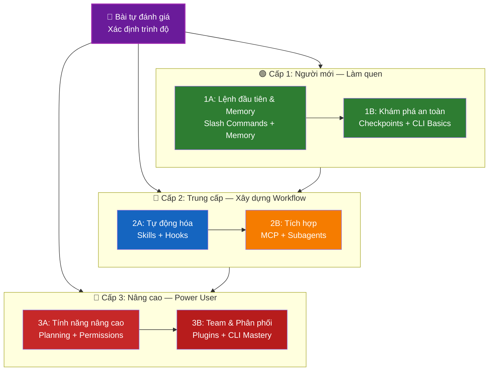

<picture>
  <source media="(prefers-color-scheme: dark)" srcset="resources/logos/claude-howto-logo-dark.svg">
  
</picture>

# 📚 Lộ trình học Claude Code

**Mới làm quen với Claude Code?** Hướng dẫn này giúp bạn làm chủ từng tính năng theo tốc độ của riêng bạn. Dù bạn là người mới hoàn toàn hay lập trình viên có kinh nghiệm, hãy bắt đầu bằng bài tự đánh giá dưới đây để tìm ra điểm xuất phát phù hợp.

---

## 🧭 Xác định trình độ của bạn

Mỗi người bắt đầu từ một vị trí khác nhau. Làm bài tự đánh giá nhanh này để chọn đúng điểm vào.

**Trả lời thật lòng:**

- [ ] Tôi có thể khởi động Claude Code và chat (`claude`)
- [ ] Tôi đã tạo hoặc chỉnh sửa file CLAUDE.md
- [ ] Tôi đã dùng ít nhất 3 slash command có sẵn (ví dụ: /help, /compact, /model)
- [ ] Tôi đã tạo slash command tùy chỉnh hoặc skill (SKILL.md)
- [ ] Tôi đã cấu hình một MCP server (ví dụ: GitHub, database)
- [ ] Tôi đã thiết lập hooks trong ~/.claude/settings.json
- [ ] Tôi đã tạo hoặc dùng subagent tùy chỉnh (.claude/agents/)
- [ ] Tôi đã dùng print mode (`claude -p`) cho scripting hoặc CI/CD

**Trình độ của bạn:**

| Số ô đã check | Trình độ | Bắt đầu tại | Thời gian hoàn thành |
|---------------|---------|-------------|----------------------|
| 0–2 | **Cấp 1: Người mới** — Làm quen | [Milestone 1A](#milestone-1a-lệnh-đầu-tiên--memory) | ~3 giờ |
| 3–5 | **Cấp 2: Trung cấp** — Xây dựng Workflow | [Milestone 2A](#milestone-2a-tự-động-hóa-skills--hooks) | ~5 giờ |
| 6–8 | **Cấp 3: Nâng cao** — Power User & Team Lead | [Milestone 3A](#milestone-3a-tính-năng-nâng-cao) | ~5 giờ |

> **Mẹo**: Nếu bạn không chắc, hãy bắt đầu thấp hơn một cấp. Ôn lại kiến thức đã biết chỉ mất ít thời gian, nhưng bỏ qua nền tảng thì sẽ bị vấp sau này.

> **Phiên bản tương tác**: Chạy `/self-assessment` trong Claude Code để làm quiz có hướng dẫn, chấm điểm kỹ năng trên cả 10 tính năng và tạo lộ trình học cá nhân hóa.

---

## 🎯 Triết lý học tập

Các thư mục trong repo này được đánh số theo **thứ tự học khuyến nghị** dựa trên ba nguyên tắc:

1. **Phụ thuộc** — Các khái niệm nền tảng học trước
2. **Độ phức tạp** — Tính năng dễ học trước tính năng khó
3. **Tần suất sử dụng** — Tính năng dùng nhiều nhất học sớm nhất

Cách tiếp cận này giúp bạn xây dựng nền tảng vững chắc trong khi vẫn tăng năng suất ngay lập tức.

---

## 🗺️ Lộ trình học của bạn



**Chú thích màu sắc:**
- 💜 Tím: Bài tự đánh giá
- 🟢 Xanh lá: Cấp 1 — Người mới
- 🔵 Xanh dương / 🟡 Vàng: Cấp 2 — Trung cấp
- 🔴 Đỏ: Cấp 3 — Nâng cao

---

## 📊 Bảng lộ trình đầy đủ

| Bước | Tính năng | Độ khó | Thời gian | Cấp | Yêu cầu trước | Tại sao học | Lợi ích chính |
|------|-----------|--------|-----------|-----|---------------|-------------|---------------|
| **1** | [Slash Commands](01-slash-commands/README.vi.md) | ⭐ Người mới | 30 phút | Cấp 1 | Không có | Tăng năng suất ngay (55+ lệnh có sẵn + 5 skill đi kèm) | Tự động hóa tức thì, chuẩn hóa cho team |
| **2** | [Memory](02-memory/README.vi.md) | ⭐⭐ Người mới+ | 45 phút | Cấp 1 | Không có | Nền tảng cho mọi tính năng khác | Ngữ cảnh lâu dài, lưu tùy chỉnh |
| **3** | [Checkpoints](08-checkpoints/README.vi.md) | ⭐⭐ Trung cấp | 45 phút | Cấp 1 | Quản lý phiên | Khám phá an toàn | Thử nghiệm, phục hồi |
| **4** | [CLI Basics](10-cli/README.vi.md) | ⭐⭐ Người mới+ | 30 phút | Cấp 1 | Không có | Dùng CLI cơ bản | Interactive & print mode |
| **5** | [Skills](03-skills/README.vi.md) | ⭐⭐ Trung cấp | 1 giờ | Cấp 2 | Slash Commands | Kỹ năng tự động kích hoạt | Khả năng tái sử dụng, nhất quán |
| **6** | [Hooks](06-hooks/README.vi.md) | ⭐⭐ Trung cấp | 1 giờ | Cấp 2 | Tools, Commands | Tự động hóa workflow (25 sự kiện, 4 loại) | Kiểm tra, cổng kiểm soát chất lượng |
| **7** | [MCP](05-mcp/README.vi.md) | ⭐⭐⭐ Trung cấp+ | 1 giờ | Cấp 2 | Cấu hình | Truy cập dữ liệu thời gian thực | Tích hợp real-time, APIs |
| **8** | [Subagents](04-subagents/README.vi.md) | ⭐⭐⭐ Trung cấp+ | 1.5 giờ | Cấp 2 | Memory, Commands | Xử lý nhiệm vụ phức tạp (6 agent có sẵn gồm Bash) | Ủy quyền, chuyên môn hóa |
| **9** | [Advanced Features](09-advanced-features/README.vi.md) | ⭐⭐⭐⭐⭐ Nâng cao | 2–3 giờ | Cấp 3 | Tất cả phần trước | Công cụ power user | Planning, Auto Mode, Channels, Voice Dictation, permissions |
| **10** | [Plugins](07-plugins/README.vi.md) | ⭐⭐⭐⭐ Nâng cao | 2 giờ | Cấp 3 | Tất cả phần trước | Giải pháp hoàn chỉnh | Onboarding team, phân phối |
| **11** | [CLI Mastery](10-cli/README.vi.md) | ⭐⭐⭐ Nâng cao | 1 giờ | Cấp 3 | Khuyến nghị: Tất cả | Thành thạo command-line | Scripting, CI/CD, tự động hóa |

**Tổng thời gian học**: ~11–13 giờ (hoặc nhảy thẳng vào cấp của bạn để tiết kiệm thời gian)

---

## 🟢 Cấp 1: Người mới — Làm quen

**Dành cho**: Người check được 0–2 ô
**Thời gian**: ~3 giờ
**Trọng tâm**: Tăng năng suất ngay, hiểu các khái niệm căn bản
**Kết quả**: Dùng thoải mái hàng ngày, sẵn sàng lên Cấp 2

### Milestone 1A: Lệnh đầu tiên & Memory

**Chủ đề**: Slash Commands + Memory
**Thời gian**: 1–2 giờ
**Độ khó**: ⭐ Người mới
**Mục tiêu**: Tăng năng suất ngay với lệnh tùy chỉnh và ngữ cảnh lâu dài

#### Bạn sẽ đạt được gì
✅ Tạo slash command tùy chỉnh cho các việc lặp đi lặp lại
✅ Thiết lập project memory để lưu chuẩn của team
✅ Cấu hình tùy chỉnh cá nhân
✅ Hiểu cách Claude tự động tải ngữ cảnh

#### Bài tập thực hành

```bash
# Bài tập 1: Cài slash command đầu tiên
mkdir -p .claude/commands
cp 01-slash-commands/optimize.md .claude/commands/

# Bài tập 2: Tạo project memory
cp 02-memory/project-CLAUDE.md ./CLAUDE.md

# Bài tập 3: Thử dùng
# Trong Claude Code, gõ: /optimize
```

#### Tiêu chí hoàn thành
- [ ] Gọi thành công lệnh `/optimize`
- [ ] Claude nhớ chuẩn dự án của bạn từ CLAUDE.md
- [ ] Bạn hiểu khi nào dùng slash commands, khi nào dùng memory

#### Bước tiếp theo
Sau khi quen rồi, đọc thêm:
- [01-slash-commands/README.vi.md](01-slash-commands/README.vi.md)
- [02-memory/README.vi.md](02-memory/README.vi.md)

> **Kiểm tra mức hiểu**: Chạy `/lesson-quiz slash-commands` hoặc `/lesson-quiz memory` trong Claude Code để kiểm tra kiến thức vừa học.

---

### Milestone 1B: Khám phá an toàn

**Chủ đề**: Checkpoints + CLI Basics
**Thời gian**: 1 giờ
**Độ khó**: ⭐⭐ Người mới+
**Mục tiêu**: Học cách thử nghiệm an toàn và dùng các lệnh CLI cơ bản

> **Ghi chú**: Checkpoints giống như nút "lưu game" — bạn có thể thử nghiệm mạnh tay mà không sợ mất dữ liệu, vì có thể quay lại bất kỳ lúc nào.

#### Bạn sẽ đạt được gì
✅ Tạo và khôi phục checkpoint để thử nghiệm an toàn
✅ Hiểu sự khác biệt giữa interactive mode và print mode
✅ Dùng các flags và tùy chọn CLI cơ bản
✅ Xử lý file qua piping (truyền nội dung file vào Claude)

#### Bài tập thực hành

```bash
# Bài tập 1: Thực hành checkpoint
# Trong Claude Code:
# Thực hiện một số thay đổi thử nghiệm, rồi nhấn Esc+Esc hoặc dùng /rewind
# Chọn checkpoint trước khi thử nghiệm
# Chọn "Restore code and conversation" để quay lại

# Bài tập 2: Interactive vs Print mode
claude "explain this project"           # Interactive mode — có hội thoại
claude -p "explain this function"       # Print mode — chỉ in kết quả, không hội thoại

# Bài tập 3: Truyền nội dung file vào Claude (piping)
cat error.log | claude -p "explain this error"
```

#### Tiêu chí hoàn thành
- [ ] Đã tạo và quay lại một checkpoint
- [ ] Đã dùng cả interactive mode và print mode
- [ ] Đã pipe một file để Claude phân tích
- [ ] Hiểu khi nào nên dùng checkpoint để thử nghiệm an toàn

#### Bước tiếp theo
- Đọc: [08-checkpoints/README.vi.md](08-checkpoints/README.vi.md)
- Đọc: [10-cli/README.vi.md](10-cli/README.vi.md)
- **Sẵn sàng lên Cấp 2!** Tiếp tục với [Milestone 2A](#milestone-2a-tự-động-hóa-skills--hooks)

> **Kiểm tra mức hiểu**: Chạy `/lesson-quiz checkpoints` hoặc `/lesson-quiz cli` để xác nhận bạn sẵn sàng lên Cấp 2.

---

## 🔵 Cấp 2: Trung cấp — Xây dựng Workflow

**Dành cho**: Người check được 3–5 ô
**Thời gian**: ~5 giờ
**Trọng tâm**: Tự động hóa, tích hợp, ủy quyền nhiệm vụ
**Kết quả**: Workflow tự động, tích hợp dịch vụ ngoài, sẵn sàng lên Cấp 3

### Kiểm tra điều kiện tiên quyết

Trước khi bắt đầu Cấp 2, hãy đảm bảo bạn đã nắm vững các khái niệm Cấp 1:

- [ ] Có thể tạo và dùng slash commands ([01-slash-commands/](01-slash-commands/README.vi.md))
- [ ] Đã thiết lập project memory qua CLAUDE.md ([02-memory/](02-memory/README.vi.md))
- [ ] Biết cách tạo và khôi phục checkpoint ([08-checkpoints/](08-checkpoints/README.vi.md))
- [ ] Có thể dùng `claude` và `claude -p` từ command line ([10-cli/](10-cli/README.vi.md))

> **Còn thiếu?** Xem lại các hướng dẫn được liên kết ở trên trước khi tiếp tục.

---

### Milestone 2A: Tự động hóa (Skills + Hooks)

**Chủ đề**: Skills + Hooks
**Thời gian**: 2–3 giờ
**Độ khó**: ⭐⭐ Trung cấp
**Mục tiêu**: Tự động hóa các workflow thông thường và kiểm soát chất lượng

> **Ghi chú**: Skills là "kỹ năng" bạn trang bị cho Claude — cài một lần, Claude tự biết khi nào nên dùng. Hooks là "bẫy sự kiện" — mỗi khi có điều gì đó xảy ra (như Claude chuẩn bị chạy lệnh), hook tự động kích hoạt.

#### Bạn sẽ đạt được gì
✅ Tự động kích hoạt khả năng chuyên biệt với YAML frontmatter (bao gồm các trường `effort` và `shell`)
✅ Thiết lập tự động hóa theo sự kiện với 25 loại hook event
✅ Dùng cả 4 loại hook (command, http, prompt, agent)
✅ Áp dụng chuẩn chất lượng code tự động
✅ Tạo hook tùy chỉnh cho workflow của bạn

#### Bài tập thực hành

```bash
# Bài tập 1: Cài một skill
cp -r 03-skills/code-review ~/.claude/skills/

# Bài tập 2: Thiết lập hook
mkdir -p ~/.claude/hooks
cp 06-hooks/pre-tool-check.sh ~/.claude/hooks/
chmod +x ~/.claude/hooks/pre-tool-check.sh

# Bài tập 3: Cấu hình hook trong settings
# Thêm vào ~/.claude/settings.json:
{
  "hooks": {
    "PreToolUse": [
      {
        "matcher": "Bash",
        "hooks": [
          {
            "type": "command",
            "command": "~/.claude/hooks/pre-tool-check.sh"
          }
        ]
      }
    ]
  }
}
```

#### Tiêu chí hoàn thành
- [ ] Skill code review tự động kích hoạt khi phù hợp
- [ ] Hook PreToolUse chạy trước khi tool thực thi
- [ ] Bạn hiểu sự khác nhau giữa skill auto-invocation và hook event trigger

#### Bước tiếp theo
- Tạo skill tùy chỉnh của riêng bạn
- Thiết lập thêm hook cho workflow của bạn
- Đọc: [03-skills/README.vi.md](03-skills/README.vi.md)
- Đọc: [06-hooks/README.vi.md](06-hooks/README.vi.md)

> **Kiểm tra mức hiểu**: Chạy `/lesson-quiz skills` hoặc `/lesson-quiz hooks` trước khi tiếp tục.

---

### Milestone 2B: Tích hợp (MCP + Subagents)

**Chủ đề**: MCP + Subagents
**Thời gian**: 2–3 giờ
**Độ khó**: ⭐⭐⭐ Trung cấp+
**Mục tiêu**: Kết nối dịch vụ bên ngoài và ủy quyền nhiệm vụ phức tạp

> **Ghi chú**: MCP (Model Context Protocol) là cầu nối cho phép Claude lấy dữ liệu thực từ GitHub, database, API... Subagents là "nhân viên" chuyên biệt — Claude chính sẽ giao việc cho họ thay vì tự làm một mình.

#### Bạn sẽ đạt được gì
✅ Truy cập dữ liệu thời gian thực từ GitHub, database, v.v.
✅ Ủy quyền công việc cho AI agent chuyên biệt
✅ Hiểu khi nào dùng MCP, khi nào dùng subagent
✅ Xây dựng workflow tích hợp hoàn chỉnh

#### Bài tập thực hành

```bash
# Bài tập 1: Thiết lập GitHub MCP
export GITHUB_TOKEN="your_github_token"
claude mcp add github -- npx -y @modelcontextprotocol/server-github

# Bài tập 2: Kiểm tra MCP integration
# Trong Claude Code: /mcp__github__list_prs

# Bài tập 3: Cài subagents
mkdir -p .claude/agents
cp 04-subagents/*.md .claude/agents/
```

#### Bài tập tích hợp
Thử workflow hoàn chỉnh này:
1. Dùng MCP để lấy một GitHub PR
2. Để Claude ủy quyền review cho subagent code-reviewer
3. Dùng hooks để tự động chạy tests

#### Tiêu chí hoàn thành
- [ ] Truy vấn thành công dữ liệu GitHub qua MCP
- [ ] Claude ủy quyền nhiệm vụ phức tạp cho subagent
- [ ] Bạn hiểu sự khác biệt giữa MCP và subagent
- [ ] Đã kết hợp MCP + subagent + hooks trong một workflow

#### Bước tiếp theo
- Thiết lập thêm MCP server (database, Slack, v.v.)
- Tạo subagent tùy chỉnh cho lĩnh vực của bạn
- Đọc: [05-mcp/README.vi.md](05-mcp/README.vi.md)
- Đọc: [04-subagents/README.vi.md](04-subagents/README.vi.md)
- **Sẵn sàng lên Cấp 3!** Tiếp tục với [Milestone 3A](#milestone-3a-tính-năng-nâng-cao)

> **Kiểm tra mức hiểu**: Chạy `/lesson-quiz mcp` hoặc `/lesson-quiz subagents` để xác nhận sẵn sàng lên Cấp 3.

---

## 🔴 Cấp 3: Nâng cao — Power User & Team Lead

**Dành cho**: Người check được 6–8 ô
**Thời gian**: ~5 giờ
**Trọng tâm**: Công cụ cho team, CI/CD, tính năng doanh nghiệp, phát triển plugin
**Kết quả**: Power user, có thể thiết lập workflow cho cả team và tích hợp CI/CD

### Kiểm tra điều kiện tiên quyết

Trước khi bắt đầu Cấp 3, hãy đảm bảo bạn nắm vững các khái niệm Cấp 2:

- [ ] Có thể tạo và dùng skills với auto-invocation ([03-skills/](03-skills/README.vi.md))
- [ ] Đã thiết lập hooks cho tự động hóa theo sự kiện ([06-hooks/](06-hooks/README.vi.md))
- [ ] Có thể cấu hình MCP server để truy cập dữ liệu ngoài ([05-mcp/](05-mcp/README.vi.md))
- [ ] Biết cách dùng subagent để ủy quyền nhiệm vụ ([04-subagents/](04-subagents/README.vi.md))

> **Còn thiếu?** Xem lại các hướng dẫn được liên kết ở trên trước khi tiếp tục.

---

### Milestone 3A: Tính năng nâng cao

**Chủ đề**: Advanced Features (Planning, Permissions, Extended Thinking, Auto Mode, Channels, Voice Dictation, Remote/Desktop/Web)
**Thời gian**: 2–3 giờ
**Độ khó**: ⭐⭐⭐⭐⭐ Nâng cao
**Mục tiêu**: Làm chủ workflow nâng cao và công cụ power user

#### Bạn sẽ đạt được gì
✅ Planning mode cho các tính năng phức tạp (lập kế hoạch trước khi thực thi)
✅ Kiểm soát quyền chi tiết với 6 chế độ (default, acceptEdits, plan, auto, dontAsk, bypassPermissions)
✅ Extended thinking qua phím tắt Alt+T / Option+T
✅ Quản lý background task (tác vụ chạy nền)
✅ Auto Memory — Claude tự học từ thói quen của bạn
✅ Auto Mode với bộ phân loại an toàn chạy nền
✅ Channels để tổ chức workflow đa phiên có cấu trúc
✅ Voice Dictation — nhập liệu bằng giọng nói
✅ Remote control, desktop app và web session
✅ Agent Teams để nhiều agent cộng tác với nhau

#### Bài tập thực hành

```bash
# Bài tập 1: Dùng planning mode
/plan Implement user authentication system

# Bài tập 2: Thử các permission mode (6 loại: default, acceptEdits, plan, auto, dontAsk, bypassPermissions)
claude --permission-mode plan "analyze this codebase"
claude --permission-mode acceptEdits "refactor the auth module"
claude --permission-mode auto "implement the feature"

# Bài tập 3: Bật extended thinking
# Nhấn Alt+T (Option+T trên macOS) trong phiên làm việc để bật/tắt

# Bài tập 4: Workflow checkpoint nâng cao
# 1. Tạo checkpoint "Clean state"
# 2. Dùng planning mode để thiết kế tính năng
# 3. Triển khai với subagent delegation
# 4. Chạy tests trong background
# 5. Nếu tests thất bại, tua lại checkpoint
# 6. Thử hướng tiếp cận khác

# Bài tập 5: Thử auto mode (có bộ phân loại an toàn nền)
claude --permission-mode auto "implement user settings page"

# Bài tập 6: Bật agent teams
export CLAUDE_AGENT_TEAMS=1
# Hỏi Claude: "Implement feature X using a team approach"

# Bài tập 7: Tác vụ theo lịch
/loop 5m /check-status
# Hoặc dùng CronCreate cho tác vụ lặp lâu dài

# Bài tập 8: Channels cho workflow đa phiên
# Dùng channels để tổ chức công việc xuyên phiên

# Bài tập 9: Voice Dictation
# Dùng giọng nói để tương tác tay-free với Claude Code
```

#### Tiêu chí hoàn thành
- [ ] Đã dùng planning mode cho một tính năng phức tạp
- [ ] Đã cấu hình permission mode (plan, acceptEdits, auto, dontAsk)
- [ ] Đã bật/tắt extended thinking bằng Alt+T / Option+T
- [ ] Đã dùng auto mode với background safety classifier
- [ ] Đã dùng background task cho tác vụ chạy lâu
- [ ] Đã khám phá Channels cho workflow đa phiên
- [ ] Đã thử Voice Dictation nhập liệu không cần tay
- [ ] Hiểu Remote Control, Desktop App và Web sessions
- [ ] Đã bật và dùng Agent Teams cho tác vụ cộng tác
- [ ] Đã dùng `/loop` cho tác vụ lặp lại hoặc giám sát định kỳ

#### Bước tiếp theo
- Đọc: [09-advanced-features/README.vi.md](09-advanced-features/README.vi.md)

> **Kiểm tra mức hiểu**: Chạy `/lesson-quiz advanced` để kiểm tra mức độ thành thạo tính năng power user.

---

### Milestone 3B: Team & Phân phối (Plugins + CLI Mastery)

**Chủ đề**: Plugins + CLI Mastery + CI/CD
**Thời gian**: 2–3 giờ
**Độ khó**: ⭐⭐⭐⭐ Nâng cao
**Mục tiêu**: Xây dựng công cụ cho team, tạo plugin, thành thạo tích hợp CI/CD

#### Bạn sẽ đạt được gì
✅ Cài đặt và tạo plugin đóng gói hoàn chỉnh
✅ Thành thạo CLI cho scripting và tự động hóa
✅ Thiết lập tích hợp CI/CD với `claude -p`
✅ Xuất JSON output cho pipeline tự động
✅ Quản lý phiên và xử lý batch

#### Bài tập thực hành

```bash
# Bài tập 1: Cài một plugin hoàn chỉnh
# Trong Claude Code: /plugin install pr-review

# Bài tập 2: Print mode cho CI/CD
claude -p "Run all tests and generate report"

# Bài tập 3: JSON output cho scripts
claude -p --output-format json "list all functions"

# Bài tập 4: Quản lý và tiếp tục phiên
claude -r "feature-auth" "continue implementation"

# Bài tập 5: Tích hợp CI/CD với giới hạn
claude -p --max-turns 3 --output-format json "review code"

# Bài tập 6: Xử lý batch
for file in *.md; do
  claude -p --output-format json "summarize this: $(cat $file)" > ${file%.md}.summary.json
done
```

#### Bài tập tích hợp CI/CD
Tạo một CI/CD script đơn giản:
1. Dùng `claude -p` để review các file đã thay đổi
2. Xuất kết quả dạng JSON
3. Xử lý với `jq` để lọc các vấn đề cụ thể
4. Tích hợp vào GitHub Actions workflow

#### Tiêu chí hoàn thành
- [ ] Đã cài và dùng một plugin
- [ ] Đã xây dựng hoặc chỉnh sửa plugin cho team
- [ ] Đã dùng print mode (`claude -p`) trong CI/CD
- [ ] Đã tạo JSON output cho scripting
- [ ] Đã tiếp tục thành công một phiên trước đó
- [ ] Đã tạo batch processing script
- [ ] Đã tích hợp Claude vào CI/CD workflow

#### Các trường hợp thực tế khi dùng CLI
- **Tự động hóa Code Review**: Chạy code review trong CI/CD pipeline
- **Phân tích Log**: Phân tích error log và system output
- **Tạo tài liệu hàng loạt**: Tạo tài liệu theo batch
- **Insights từ Tests**: Phân tích test failures
- **Phân tích hiệu năng**: Xem xét performance metrics
- **Xử lý dữ liệu**: Chuyển đổi và phân tích data file

#### Bước tiếp theo
- Đọc: [07-plugins/README.vi.md](07-plugins/README.vi.md)
- Đọc: [10-cli/README.vi.md](10-cli/README.vi.md)
- Tạo phím tắt CLI và plugin dùng chung cho cả team
- Thiết lập các batch processing script

> **Kiểm tra mức hiểu**: Chạy `/lesson-quiz plugins` hoặc `/lesson-quiz cli` để xác nhận mức độ thành thạo.

---

## 🧪 Kiểm tra kiến thức

Repo này có hai skill tương tác bạn có thể dùng bất kỳ lúc nào trong Claude Code để tự đánh giá:

| Skill | Lệnh | Mục đích |
|-------|------|---------|
| **Self-Assessment** | `/self-assessment` | Đánh giá toàn diện kỹ năng trên cả 10 tính năng. Chọn Quick (2 phút) hoặc Deep (5 phút) để nhận hồ sơ kỹ năng và lộ trình học cá nhân hóa. |
| **Lesson Quiz** | `/lesson-quiz [bài học]` | Kiểm tra hiểu biết về một bài học cụ thể với 10 câu hỏi. Dùng trước bài học (pre-test), trong khi học (kiểm tra tiến độ), hoặc sau khi học (xác nhận đã nắm). |

**Ví dụ:**
```
/self-assessment                  # Xác định trình độ tổng thể
/lesson-quiz hooks                # Quiz bài 06: Hooks
/lesson-quiz 03                   # Quiz bài 03: Skills
/lesson-quiz advanced-features    # Quiz bài 09
```

---

## ⚡ Lộ trình bắt đầu nhanh

### Nếu bạn chỉ có 15 phút
**Mục tiêu**: Có kết quả đầu tiên ngay

1. Copy một slash command: `cp 01-slash-commands/optimize.md .claude/commands/`
2. Thử trong Claude Code: `/optimize`
3. Đọc: [01-slash-commands/README.vi.md](01-slash-commands/README.vi.md)

**Kết quả**: Bạn sẽ có một slash command hoạt động và hiểu cơ bản

---

### Nếu bạn có 1 giờ
**Mục tiêu**: Thiết lập công cụ năng suất thiết yếu

1. **Slash commands** (15 phút): Copy và thử `/optimize` và `/pr`
2. **Project memory** (15 phút): Tạo CLAUDE.md với chuẩn dự án của bạn
3. **Cài một skill** (15 phút): Thiết lập skill code-review
4. **Thử kết hợp chúng** (15 phút): Xem cách chúng hoạt động hài hòa với nhau

**Kết quả**: Tăng năng suất cơ bản với lệnh, memory và skill tự động

---

### Nếu bạn có một cuối tuần
**Mục tiêu**: Thành thạo hầu hết các tính năng

**Sáng thứ Bảy** (3 giờ):
- Hoàn thành Milestone 1A: Slash Commands + Memory
- Hoàn thành Milestone 1B: Checkpoints + CLI Basics

**Chiều thứ Bảy** (3 giờ):
- Hoàn thành Milestone 2A: Skills + Hooks
- Hoàn thành Milestone 2B: MCP + Subagents

**Chủ Nhật** (4 giờ):
- Hoàn thành Milestone 3A: Advanced Features
- Hoàn thành Milestone 3B: Plugins + CLI Mastery + CI/CD
- Xây dựng một plugin tùy chỉnh cho team của bạn

**Kết quả**: Bạn sẽ là Claude Code power user, sẵn sàng đào tạo người khác và tự động hóa workflow phức tạp

---

## 💡 Mẹo học tập

### ✅ Nên làm

- **Làm quiz trước** để xác định điểm xuất phát
- **Hoàn thành bài tập thực hành** cho mỗi milestone
- **Bắt đầu đơn giản** rồi dần thêm độ phức tạp
- **Kiểm tra từng tính năng** trước khi học tính năng tiếp theo
- **Ghi chú** những gì phù hợp với workflow của bạn
- **Quay lại** các khái niệm trước khi học chủ đề nâng cao
- **Thử nghiệm an toàn** bằng cách dùng checkpoints
- **Chia sẻ kiến thức** với team của bạn

### ❌ Không nên làm

- **Bỏ qua kiểm tra điều kiện tiên quyết** khi nhảy lên cấp cao hơn
- **Cố học tất cả cùng một lúc** — sẽ bị quá tải
- **Copy config mà không hiểu** — bạn sẽ không biết debug khi có vấn đề
- **Quên kiểm tra** — luôn xác nhận tính năng hoạt động đúng
- **Vội vàng qua các milestone** — dành thời gian để hiểu thật sự
- **Bỏ qua tài liệu** — mỗi README đều có thông tin quan trọng
- **Làm việc một mình** — thảo luận với đồng nghiệp

---

## 🎓 Phong cách học tập

### Người học qua hình ảnh
- Nghiên cứu kỹ các sơ đồ Mermaid trong từng README
- Quan sát luồng thực thi lệnh
- Tự vẽ sơ đồ workflow của bạn
- Dùng lộ trình học trực quan ở trên

### Người học qua thực hành
- Hoàn thành mọi bài tập thực hành
- Thử nghiệm các biến thể
- Làm hỏng rồi sửa (dùng checkpoints!)
- Tự tạo ví dụ của riêng bạn

### Người học qua đọc
- Đọc kỹ từng README
- Nghiên cứu các đoạn code ví dụ
- Xem xét các bảng so sánh
- Đọc các bài blog được liên kết trong resources

### Người học qua tương tác xã hội
- Lập các buổi pair programming
- Giải thích khái niệm cho đồng đội
- Tham gia thảo luận cộng đồng Claude Code
- Chia sẻ cấu hình tùy chỉnh của bạn

---

## 📈 Theo dõi tiến độ

Dùng các checklist này để theo dõi tiến độ theo cấp. Chạy `/self-assessment` bất kỳ lúc nào để nhận hồ sơ kỹ năng cập nhật, hoặc `/lesson-quiz [bài học]` sau mỗi tutorial để xác nhận mức hiểu.

### 🟢 Cấp 1: Người mới
- [ ] Hoàn thành [01-slash-commands](01-slash-commands/README.vi.md)
- [ ] Hoàn thành [02-memory](02-memory/README.vi.md)
- [ ] Đã tạo slash command tùy chỉnh đầu tiên
- [ ] Đã thiết lập project memory
- [ ] **Milestone 1A đạt được**
- [ ] Hoàn thành [08-checkpoints](08-checkpoints/README.vi.md)
- [ ] Hoàn thành cơ bản [10-cli](10-cli/README.vi.md)
- [ ] Đã tạo và quay lại checkpoint
- [ ] Đã dùng interactive mode và print mode
- [ ] **Milestone 1B đạt được**

### 🔵 Cấp 2: Trung cấp
- [ ] Hoàn thành [03-skills](03-skills/README.vi.md)
- [ ] Hoàn thành [06-hooks](06-hooks/README.vi.md)
- [ ] Đã cài skill đầu tiên
- [ ] Đã thiết lập PreToolUse hook
- [ ] **Milestone 2A đạt được**
- [ ] Hoàn thành [05-mcp](05-mcp/README.vi.md)
- [ ] Hoàn thành [04-subagents](04-subagents/README.vi.md)
- [ ] Đã kết nối GitHub MCP
- [ ] Đã tạo subagent tùy chỉnh
- [ ] Đã kết hợp các tích hợp trong một workflow
- [ ] **Milestone 2B đạt được**

### 🔴 Cấp 3: Nâng cao
- [ ] Hoàn thành [09-advanced-features](09-advanced-features/README.vi.md)
- [ ] Đã dùng planning mode thành công
- [ ] Đã cấu hình permission mode (6 chế độ kể cả auto)
- [ ] Đã dùng auto mode với safety classifier
- [ ] Đã dùng extended thinking toggle
- [ ] Đã khám phá Channels và Voice Dictation
- [ ] **Milestone 3A đạt được**
- [ ] Hoàn thành [07-plugins](07-plugins/README.vi.md)
- [ ] Hoàn thành [10-cli](10-cli/README.vi.md) nâng cao
- [ ] Đã thiết lập print mode (`claude -p`) CI/CD
- [ ] Đã tạo JSON output cho tự động hóa
- [ ] Đã tích hợp Claude vào CI/CD pipeline
- [ ] Đã tạo plugin cho team
- [ ] **Milestone 3B đạt được**

---

## 🆘 Các thách thức học tập thường gặp

### Thách thức 1: "Quá nhiều khái niệm cùng một lúc"
**Giải pháp**: Tập trung vào một milestone tại một thời điểm. Hoàn thành tất cả bài tập trước khi tiến lên.

### Thách thức 2: "Không biết nên dùng tính năng nào khi nào"
**Giải pháp**: Tham khảo bảng [So sánh tính năng](README.vi.md) trong README để hiểu sự khác biệt.

### Thách thức 3: "Cấu hình không hoạt động"
**Giải pháp**: Kiểm tra phần Troubleshooting và xác nhận lại vị trí file.

### Thách thức 4: "Các khái niệm có vẻ chồng chéo nhau"
**Giải pháp**: Xem lại bảng So sánh tính năng để hiểu rõ sự khác biệt.

### Thách thức 5: "Khó nhớ mọi thứ"
**Giải pháp**: Tạo cheat sheet của riêng bạn. Dùng checkpoints để thử nghiệm an toàn.

### Thách thức 6: "Tôi có kinh nghiệm nhưng không biết bắt đầu từ đâu"
**Giải pháp**: Làm [bài Tự đánh giá](#-xác-định-trình-độ-của-bạn) ở trên. Nhảy thẳng vào cấp của bạn và dùng phần kiểm tra điều kiện tiên quyết để xác định còn thiếu gì.

---

## 🎯 Làm gì sau khi hoàn thành?

Sau khi hoàn thành tất cả các milestone:

1. **Tạo tài liệu cho team** — Ghi lại cách team bạn cài đặt Claude Code
2. **Xây dựng plugin tùy chỉnh** — Đóng gói workflow của team
3. **Khám phá Remote Control** — Điều khiển phiên Claude Code lập trình từ công cụ bên ngoài
4. **Thử Web Sessions** — Dùng Claude Code qua giao diện browser cho remote development
5. **Dùng Desktop App** — Truy cập tính năng Claude Code qua ứng dụng desktop native
6. **Dùng Auto Mode** — Để Claude làm việc tự động với background safety classifier
7. **Tận dụng Auto Memory** — Để Claude tự học từ thói quen của bạn
8. **Thiết lập Agent Teams** — Điều phối nhiều agent cho các nhiệm vụ phức tạp, đa mặt
9. **Dùng Channels** — Tổ chức công việc qua các workflow đa phiên có cấu trúc
10. **Thử Voice Dictation** — Dùng giọng nói tay-free để tương tác với Claude Code
11. **Dùng Scheduled Tasks** — Tự động hóa các kiểm tra định kỳ với `/loop` và cron tools
12. **Đóng góp ví dụ** — Chia sẻ với cộng đồng
13. **Hướng dẫn người khác** — Giúp đồng đội học
14. **Tối ưu workflow** — Liên tục cải thiện dựa trên kinh nghiệm thực tế
15. **Cập nhật thường xuyên** — Theo dõi các bản phát hành và tính năng mới của Claude Code

---

## 📚 Tài nguyên bổ sung

### Tài liệu chính thức
- [Claude Code Documentation](https://code.claude.com/docs/en/overview)
- [Anthropic Documentation](https://docs.anthropic.com)
- [MCP Protocol Specification](https://modelcontextprotocol.io)

### Blog Posts
- [Discovering Claude Code Slash Commands](https://medium.com/@luongnv89/discovering-claude-code-slash-commands-cdc17f0dfb29)

### Cộng đồng
- [Anthropic Cookbook](https://github.com/anthropics/anthropic-cookbook)
- [MCP Servers Repository](https://github.com/modelcontextprotocol/servers)

---

## 💬 Phản hồi & Hỗ trợ

- **Phát hiện lỗi?** Tạo issue trong repository
- **Có góp ý?** Gửi pull request
- **Cần giúp đỡ?** Xem tài liệu hoặc hỏi cộng đồng

---

**Cập nhật lần cuối**: Tháng 3/2026
**Duy trì bởi**: Claude How-To Contributors
**Giấy phép**: Dùng cho mục đích giáo dục, miễn phí sử dụng và chỉnh sửa

---

[← Quay lại README chính](README.vi.md)

---

> **Ghi chú cho bản dịch tiếng Việt:** File này được dịch bởi cộng đồng. Bản gốc tiếng Anh luôn là nguồn chính xác nhất: [LEARNING-ROADMAP.md](LEARNING-ROADMAP.md).
