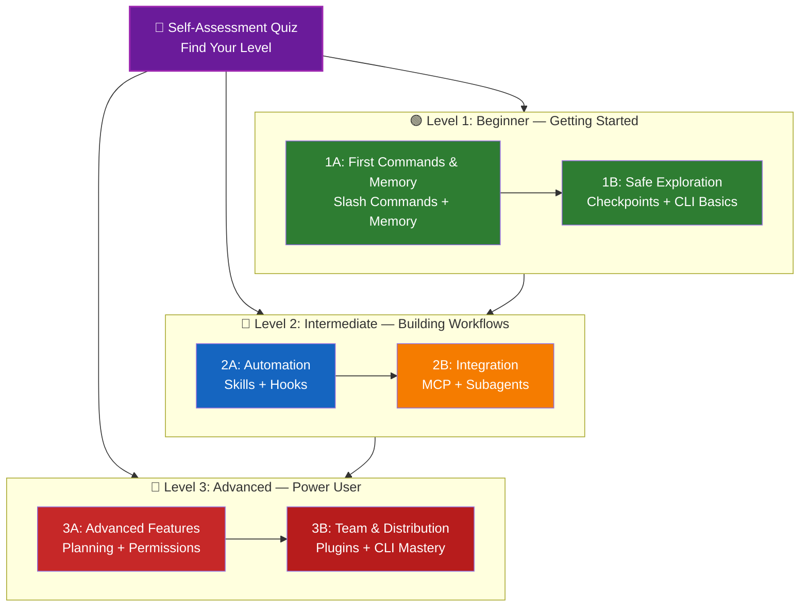

<picture>
  <source media="(prefers-color-scheme: dark)" srcset="resources/logos/claude-howto-logo-dark.svg">
  
</picture>

# 📚 Claude Code 学习路线图（Learning Roadmap）

**刚开始使用 Claude Code？** 本指南会帮助你按自己的节奏掌握 Claude Code。无论你是完全新手还是有经验的开发者，建议先做下面的自测，再进入最适合你的学习路径。

---

## 🧭 先定位你的水平

每个人起点都不同。先做这个快速自测，找到合适入口。

**请如实勾选：**

- [ ] 我可以启动 Claude Code 并正常对话（`claude`）
- [ ] 我创建或编辑过 `CLAUDE.md`
- [ ] 我至少使用过 3 个内置 slash 命令（例如 `/help`、`/compact`、`/model`）
- [ ] 我创建过自定义 slash 命令或 skill（`SKILL.md`）
- [ ] 我配置过 MCP server（如 GitHub、数据库）
- [ ] 我在 `~/.claude/settings.json` 配置过 hooks
- [ ] 我创建或使用过自定义 subagents（`.claude/agents/`）
- [ ] 我用过 print mode（`claude -p`）做脚本或 CI/CD

**你的级别：**

| Checks | Level | Start At | Time to Complete |
|--------|-------|----------|------------------|
| 0-2 | **Level 1: Beginner** — Getting Started | [Milestone 1A](#milestone-1a第一批命令--memory) | ~3 hours |
| 3-5 | **Level 2: Intermediate** — Building Workflows | [Milestone 2A](#milestone-2a自动化skills--hooks) | ~5 hours |
| 6-8 | **Level 3: Advanced** — Power User & Team Lead | [Milestone 3A](#milestone-3a高级特性) | ~5 hours |

> **Tip**：如果不确定，先从低一级开始。快速复习熟悉内容，比跳过基础导致后续卡住更稳。

> **交互版本**：在 Claude Code 中运行 `/self-assessment`，可获得覆盖 10 个能力域的评分与个性化学习建议。

---

## 🎯 学习方法论

本仓库目录按**推荐学习顺序**编号，遵循三个原则：

1. **依赖关系优先**：先学基础能力
2. **复杂度递进**：先易后难
3. **使用频率优先**：高频能力先掌握

这样你既能打好底层认知，也能尽快获得生产力提升。

---

## 🗺️ 你的学习路径



**颜色说明：**
- 💜 Purple：自测
- 🟢 Green：Level 1（入门）
- 🔵 Blue / 🟡 Gold：Level 2（中级）
- 🔴 Red：Level 3（高级）

---

## 📊 完整路线表

| Step | Feature | Complexity | Time | Level | Dependencies | Why Learn This | Key Benefits |
|------|---------|-----------|------|-------|--------------|----------------|--------------|
| **1** | [Slash Commands](01-slash-commands/README.zh-CN.md) | ⭐ Beginner | 30 min | Level 1 | None | 快速获得生产力收益（55+ built-in + 5 bundled skills） | 即时自动化、团队标准化 |
| **2** | [Memory](02-memory/README.zh-CN.md) | ⭐⭐ Beginner+ | 45 min | Level 1 | None | 所有能力的上下文基础 | 持久上下文、偏好记忆 |
| **3** | [Checkpoints](08-checkpoints/README.zh-CN.md) | ⭐⭐ Intermediate | 45 min | Level 1 | Session management | 安全探索 | 实验、回退、恢复 |
| **4** | [CLI Basics](10-cli/README.zh-CN.md) | ⭐⭐ Beginner+ | 30 min | Level 1 | None | 命令行核心能力 | Interactive & print mode |
| **5** | [Skills](03-skills/README.zh-CN.md) | ⭐⭐ Intermediate | 1 hour | Level 2 | Slash Commands | 自动化专业能力 | 可复用、稳定一致 |
| **6** | [Hooks](06-hooks/README.zh-CN.md) | ⭐⭐ Intermediate | 1 hour | Level 2 | Tools, Commands | 事件驱动自动化（25 events, 4 types） | 校验、质量门禁 |
| **7** | [MCP](05-mcp/README.zh-CN.md) | ⭐⭐⭐ Intermediate+ | 1 hour | Level 2 | Configuration | 外部实时数据接入 | API 集成、实时联动 |
| **8** | [Subagents](04-subagents/README.zh-CN.md) | ⭐⭐⭐ Intermediate+ | 1.5 hours | Level 2 | Memory, Commands | 处理复杂任务（含 6 个 built-in） | 委派、专长分工 |
| **9** | [Advanced Features](09-advanced-features/README.zh-CN.md) | ⭐⭐⭐⭐⭐ Advanced | 2-3 hours | Level 3 | All previous | 高阶能力 | Planning、Auto Mode、Channels、Voice Dictation、permissions |
| **10** | [Plugins](07-plugins/README.zh-CN.md) | ⭐⭐⭐⭐ Advanced | 2 hours | Level 3 | All previous | 方案打包与分发 | 团队上手、能力复用 |
| **11** | [CLI Mastery](10-cli/README.zh-CN.md) | ⭐⭐⭐ Advanced | 1 hour | Level 3 | Recommended: All | 命令行高阶实践 | 脚本化、CI/CD、自动化 |

**Total Learning Time**: ~11-13 hours（也可按级别跳学）

---

## 🟢 Level 1：Beginner — 入门

**适用人群**：自测 0-2 项  
**耗时**：~3 小时  
**重点**：快速上手 + 基础认知  
**结果**：可稳定日常使用，进入 Level 2

### Milestone 1A：第一批命令 + Memory

**Topics**: Slash Commands + Memory  
**Time**: 1-2 hours  
**Complexity**: ⭐ Beginner  
**Goal**: 用自定义命令与持久上下文获得首轮效率提升

#### 你会达成
✅ 创建用于重复任务的自定义 slash command  
✅ 配置项目 memory 用于团队标准  
✅ 配置个人偏好  
✅ 理解 Claude 的上下文自动加载方式

#### 动手练习

```bash
# Exercise 1: Install your first slash command
mkdir -p .claude/commands
cp 01-slash-commands/optimize.md .claude/commands/

# Exercise 2: Create project memory
cp 02-memory/project-CLAUDE.md ./CLAUDE.md

# Exercise 3: Try it out
# In Claude Code, type: /optimize
```

#### 验收标准
- [ ] 成功调用 `/optimize`
- [ ] Claude 能依据 `CLAUDE.md` 记住项目标准
- [ ] 你理解 slash commands 与 memory 的边界

#### 下一步
- [01-slash-commands/README.md](01-slash-commands/README.zh-CN.md)
- [02-memory/README.md](02-memory/README.zh-CN.md)

> **学习检测**：运行 `/lesson-quiz slash-commands` 或 `/lesson-quiz memory`。

---

### Milestone 1B：安全探索

**Topics**: Checkpoints + CLI Basics  
**Time**: 1 hour  
**Complexity**: ⭐⭐ Beginner+  
**Goal**: 学会安全试验与 CLI 基础操作

#### 你会达成
✅ 用 checkpoints 安全实验并可回退  
✅ 理解 interactive vs print mode  
✅ 掌握基础 CLI 参数  
✅ 使用管道处理文件内容

#### 动手练习

```bash
# Exercise 1: Try checkpoint workflow
# In Claude Code:
# Make some experimental changes, then press Esc+Esc or use /rewind
# Select the checkpoint before your experiment
# Choose "Restore code and conversation" to go back

# Exercise 2: Interactive vs Print mode
claude "explain this project"           # Interactive mode
claude -p "explain this function"       # Print mode (non-interactive)

# Exercise 3: Process file content via piping
cat error.log | claude -p "explain this error"
```

#### 验收标准
- [ ] 成功创建并回退 checkpoint
- [ ] 使用过 interactive 与 print mode
- [ ] 能通过管道把文件交给 Claude 分析
- [ ] 理解 checkpoint 在安全实验中的价值

#### 下一步
- [08-checkpoints/README.md](08-checkpoints/README.zh-CN.md)
- [10-cli/README.md](10-cli/README.zh-CN.md)
- **准备进入 Level 2**：前往 [Milestone 2A](#milestone-2a自动化skills--hooks)

> **学习检测**：运行 `/lesson-quiz checkpoints` 或 `/lesson-quiz cli`。

---

## 🔵 Level 2：Intermediate — 构建工作流

**适用人群**：自测 3-5 项  
**耗时**：~5 小时  
**重点**：自动化、集成、任务委派  
**结果**：可构建自动化流程并接入外部系统

### 先决条件检查

开始前请确认你已掌握 Level 1：

- [ ] 能创建并使用 slash commands（[01-slash-commands/](01-slash-commands/README.zh-CN.md)）
- [ ] 已通过 CLAUDE.md 配置项目 memory（[02-memory/](02-memory/README.zh-CN.md)）
- [ ] 会创建和恢复 checkpoint（[08-checkpoints/](08-checkpoints/README.zh-CN.md)）
- [ ] 会使用 `claude` 与 `claude -p`（[10-cli/](10-cli/README.zh-CN.md)）

> 若有空缺，建议先回看对应模块。

---

### Milestone 2A：自动化（Skills + Hooks）

**Topics**: Skills + Hooks  
**Time**: 2-3 hours  
**Complexity**: ⭐⭐ Intermediate  
**Goal**: 把常见流程与质量检查自动化

#### 你会达成
✅ 使用 YAML frontmatter（含 `effort`、`shell`）配置 auto-invoke 能力  
✅ 使用 25 个 hook events 形成事件驱动自动化  
✅ 掌握 4 种 hook type（command、http、prompt、agent）  
✅ 执行代码质量门禁  
✅ 构建自定义 hooks

#### 动手练习

```bash
# Exercise 1: Install a skill
cp -r 03-skills/code-review ~/.claude/skills/

# Exercise 2: Set up hooks
mkdir -p ~/.claude/hooks
cp 06-hooks/pre-tool-check.sh ~/.claude/hooks/
chmod +x ~/.claude/hooks/pre-tool-check.sh

# Exercise 3: Configure hooks in settings
# Add to ~/.claude/settings.json:
{
  "hooks": {
    "PreToolUse": [
      {
        "matcher": "Bash",
        "hooks": [
          {
            "type": "command",
            "command": "~/.claude/hooks/pre-tool-check.sh"
          }
        ]
      }
    ]
  }
}
```

#### 验收标准
- [ ] 代码评审 skill 能在相关场景自动触发
- [ ] `PreToolUse` hook 能在工具执行前触发
- [ ] 理解 skill 自动触发与 hook 事件触发的差异

#### 下一步
- 自己写一个 custom skill
- 为团队工作流补充更多 hooks
- [03-skills/README.md](03-skills/README.zh-CN.md)
- [06-hooks/README.md](06-hooks/README.zh-CN.md)

> **学习检测**：运行 `/lesson-quiz skills` 或 `/lesson-quiz hooks`。

---

### Milestone 2B：集成（MCP + Subagents）

**Topics**: MCP + Subagents  
**Time**: 2-3 hours  
**Complexity**: ⭐⭐⭐ Intermediate+  
**Goal**: 接入外部系统并委派复杂任务

#### 你会达成
✅ 从 GitHub、数据库等获取实时数据  
✅ 将工作委派给专用 agents  
✅ 理解 MCP 与 subagents 的边界  
✅ 构建组合工作流

#### 动手练习

```bash
# Exercise 1: Set up GitHub MCP
export GITHUB_TOKEN="your_github_token"
claude mcp add github -- npx -y @modelcontextprotocol/server-github

# Exercise 2: Test MCP integration
# In Claude Code: /mcp__github__list_prs

# Exercise 3: Install subagents
mkdir -p .claude/agents
cp 04-subagents/*.md .claude/agents/
```

#### 组合练习
尝试以下完整链路：
1. 用 MCP 拉取 GitHub PR
2. 让 Claude 委派给 code-reviewer subagent
3. 用 hooks 自动触发测试

#### 验收标准
- [ ] 能通过 MCP 查询 GitHub 数据
- [ ] Claude 可委派复杂任务给 subagents
- [ ] 理解 MCP 与 subagents 的职责差异
- [ ] 能完成 MCP + subagents + hooks 组合流

#### 下一步
- 接更多 MCP servers（DB、Slack 等）
- 为业务域设计 custom subagents
- [05-mcp/README.md](05-mcp/README.zh-CN.md)
- [04-subagents/README.md](04-subagents/README.zh-CN.md)
- **准备进入 Level 3**：前往 [Milestone 3A](#milestone-3a高级特性)

> **学习检测**：运行 `/lesson-quiz mcp` 或 `/lesson-quiz subagents`。

---

## 🔴 Level 3：Advanced — 高阶用户 / 团队负责人

**适用人群**：自测 6-8 项  
**耗时**：~5 小时  
**重点**：团队化、CI/CD、插件化与企业能力  
**结果**：可主导团队工作流建设

### 先决条件检查

开始前请确认你已掌握 Level 2：

- [ ] 会创建/使用 skills（[03-skills/](03-skills/README.zh-CN.md)）
- [ ] 会配置 hooks 自动化（[06-hooks/](06-hooks/README.zh-CN.md)）
- [ ] 会配置 MCP servers（[05-mcp/](05-mcp/README.zh-CN.md)）
- [ ] 会使用 subagents 委派任务（[04-subagents/](04-subagents/README.zh-CN.md)）

> 若有空缺，请先补齐再进入高级模块。

---

### Milestone 3A：高级特性

**Topics**: Advanced Features（Planning、Permissions、Extended Thinking、Auto Mode、Channels、Voice Dictation、Remote/Desktop/Web）  
**Time**: 2-3 hours  
**Complexity**: ⭐⭐⭐⭐⭐ Advanced  
**Goal**: 掌握复杂场景下的高阶能力

#### 你会达成
✅ 用 planning mode 处理复杂实现  
✅ 掌握 6 种 permission modes（`default`, `acceptEdits`, `plan`, `auto`, `dontAsk`, `bypassPermissions`）  
✅ 用 `Alt+T` / `Option+T` 切换 extended thinking  
✅ 使用 background tasks 管理长任务  
✅ 使用 Auto Memory 自动沉淀偏好  
✅ 使用 Auto Mode 背景安全分类器  
✅ 使用 Channels 组织多会话流程  
✅ 使用 Voice Dictation 实现免手输入  
✅ 理解 Remote Control、Desktop App、Web Sessions  
✅ 使用 Agent Teams 多代理协作

#### 动手练习

```bash
# Exercise 1: Use planning mode
/plan Implement user authentication system

# Exercise 2: Try permission modes (6 available: default, acceptEdits, plan, auto, dontAsk, bypassPermissions)
claude --permission-mode plan "analyze this codebase"
claude --permission-mode acceptEdits "refactor the auth module"
claude --permission-mode auto "implement the feature"

# Exercise 3: Enable extended thinking
# Press Alt+T (Option+T on macOS) during a session to toggle

# Exercise 4: Advanced checkpoint workflow
# 1. Create checkpoint "Clean state"
# 2. Use planning mode to design a feature
# 3. Implement with subagent delegation
# 4. Run tests in background
# 5. If tests fail, rewind to checkpoint
# 6. Try alternative approach

# Exercise 5: Try auto mode (background safety classifier)
claude --permission-mode auto "implement user settings page"

# Exercise 6: Enable agent teams
export CLAUDE_AGENT_TEAMS=1
# Ask Claude: "Implement feature X using a team approach"

# Exercise 7: Scheduled tasks
/loop 5m /check-status
# Or use CronCreate for persistent scheduled tasks

# Exercise 8: Channels for multi-session workflows
# Use channels to organize work across sessions

# Exercise 9: Voice Dictation
# Use voice input for hands-free interaction with Claude Code
```

#### 验收标准
- [ ] 用 planning mode 完成过复杂特性设计
- [ ] 配置并使用过多种 permission modes
- [ ] 用快捷键切换过 extended thinking
- [ ] 在 auto mode 下跑过任务
- [ ] 使用 background tasks 跑过长任务
- [ ] 体验 Channels 与 Voice Dictation
- [ ] 理解 Remote/Desktop/Web 三种形态
- [ ] 开启并使用过 Agent Teams
- [ ] 使用 `/loop` 或 cron 工具执行周期任务

#### 下一步
- [09-advanced-features/README.md](09-advanced-features/README.zh-CN.md)

> **学习检测**：运行 `/lesson-quiz advanced`。

---

### Milestone 3B：团队与分发（Plugins + CLI Mastery）

**Topics**: Plugins + CLI Mastery + CI/CD  
**Time**: 2-3 hours  
**Complexity**: ⭐⭐⭐⭐ Advanced  
**Goal**: 形成团队化工具链与 CI/CD 自动化能力

#### 你会达成
✅ 安装并构建完整 plugins  
✅ 熟练使用 CLI 做脚本与自动化  
✅ 用 `claude -p` 打通 CI/CD  
✅ 产出 JSON 供流水线消费  
✅ 管理会话与批处理执行

#### 动手练习

```bash
# Exercise 1: Install a complete plugin
# In Claude Code: /plugin install pr-review

# Exercise 2: Print mode for CI/CD
claude -p "Run all tests and generate report"

# Exercise 3: JSON output for scripts
claude -p --output-format json "list all functions"

# Exercise 4: Session management and resumption
claude -r "feature-auth" "continue implementation"

# Exercise 5: CI/CD integration with constraints
claude -p --max-turns 3 --output-format json "review code"

# Exercise 6: Batch processing
for file in *.md; do
  claude -p --output-format json "summarize this: $(cat $file)" > ${file%.md}.summary.json
done
```

#### CI/CD 练习
构建一个最小 CI/CD 脚本：
1. 用 `claude -p` 审查变更文件
2. 输出 JSON
3. 用 `jq` 过滤关键问题
4. 接入 GitHub Actions

#### 验收标准
- [ ] 安装并实际使用过 plugin
- [ ] 为团队改造或新建过 plugin
- [ ] 在 CI/CD 中使用过 print mode
- [ ] 产出并消费 JSON 输出
- [ ] 成功恢复历史会话
- [ ] 构建过批处理脚本
- [ ] Claude 能接入你的流水线

#### CLI 典型场景
- **Code Review Automation**：CI 中自动评审
- **Log Analysis**：错误日志分析
- **Documentation Generation**：批量文档生成
- **Testing Insights**：测试失败分析
- **Performance Analysis**：性能指标评审
- **Data Processing**：数据处理与转换

#### 下一步
- [07-plugins/README.md](07-plugins/README.zh-CN.md)
- [10-cli/README.md](10-cli/README.zh-CN.md)
- 建立团队级 CLI 快捷命令与 plugins
- 建立稳定批处理脚本

> **学习检测**：运行 `/lesson-quiz plugins` 或 `/lesson-quiz cli`。

---

## 🧪 知识检测

本仓库提供两个可交互技能，可在 Claude Code 中随时使用：

| Skill | Command | Purpose |
|-------|---------|---------|
| **Self-Assessment** | `/self-assessment` | 评估你在 10 个能力域的综合熟练度，支持 Quick（2 min）或 Deep（5 min）模式，输出个性化学习路径。 |
| **Lesson Quiz** | `/lesson-quiz [lesson]` | 针对单模块进行 10 题测验，可用于课前预检、课中校准、课后验收。 |

**示例：**
```text
/self-assessment                  # 综合水平定位
/lesson-quiz hooks                # 06 Hooks 测验
/lesson-quiz 03                   # 03 Skills 测验
/lesson-quiz advanced-features    # 09 高级特性测验
```

---

## ⚡ 快速路径

### 只有 15 分钟
**目标**：先拿到第一笔收益

1. 复制命令：`cp 01-slash-commands/optimize.md .claude/commands/`
2. 在 Claude Code 输入：`/optimize`
3. 阅读：[01-slash-commands/README.md](01-slash-commands/README.zh-CN.md)

**结果**：你会有一个可用命令并理解基本机制。

---

### 有 1 小时
**目标**：搭建最小生产力套件

1. **Slash commands**（15 min）：跑通 `/optimize`、`/pr`
2. **Project memory**（15 min）：创建 CLAUDE.md 团队规范
3. **Install a skill**（15 min）：安装 code-review skill
4. **组合演练**（15 min）：观察协同效果

**结果**：命令 + memory + auto-skill 的基础闭环。

---

### 有一个周末
**目标**：覆盖大多数核心能力

**Saturday Morning（3h）**
- 完成 Milestone 1A
- 完成 Milestone 1B

**Saturday Afternoon（3h）**
- 完成 Milestone 2A
- 完成 Milestone 2B

**Sunday（4h）**
- 完成 Milestone 3A
- 完成 Milestone 3B
- 为团队做一个 custom plugin

**结果**：达到高阶使用水平，可带团队推广。

---

## 💡 学习建议

### ✅ 建议做

- 先做自测再开始
- 每个里程碑都做动手练习
- 先简单后复杂
- 每学一项先验证再继续
- 记录对你有效的模式
- 学高级内容时回看基础概念
- 用 checkpoints 安全实验
- 与团队共享经验

### ❌ 不建议做

- 跳级但不做先决条件检查
- 一次性学全部内容
- 不理解就直接复制配置
- 不验证就投入生产
- 只追进度不求理解
- 忽略每个 README 的细节
- 单兵作战不做团队对齐

---

## 🎓 按学习风格学习

### Visual Learners
- 重点看每个 README 里的 Mermaid 图
- 观察命令执行流
- 自己画工作流图
- 用上面的路径图做节奏管理

### Hands-on Learners
- 全量完成实践练习
- 尝试变体
- 故意打破再修复（配合 checkpoints）
- 写自己的示例

### Reading Learners
- 逐节通读 README
- 深读代码示例
- 对照对比表
- 阅读资源中的博客

### Social Learners
- 结对学习
- 教别人巩固自己
- 参与社区讨论
- 分享团队配置模板

---

## 📈 进度追踪

可用以下清单跟踪进度；也可随时运行 `/self-assessment` 或 `/lesson-quiz [lesson]`。

### 🟢 Level 1: Beginner
- [ ] 完成 [01-slash-commands](01-slash-commands/README.zh-CN.md)
- [ ] 完成 [02-memory](02-memory/README.zh-CN.md)
- [ ] 创建第一个 custom slash command
- [ ] 配置项目 memory
- [ ] **Milestone 1A 达成**
- [ ] 完成 [08-checkpoints](08-checkpoints/README.zh-CN.md)
- [ ] 完成 [10-cli](10-cli/README.zh-CN.md) 基础部分
- [ ] 创建并回退 checkpoint
- [ ] 使用 interactive 与 print mode
- [ ] **Milestone 1B 达成**

### 🔵 Level 2: Intermediate
- [ ] 完成 [03-skills](03-skills/README.zh-CN.md)
- [ ] 完成 [06-hooks](06-hooks/README.zh-CN.md)
- [ ] 安装第一个 skill
- [ ] 配置 PreToolUse hook
- [ ] **Milestone 2A 达成**
- [ ] 完成 [05-mcp](05-mcp/README.zh-CN.md)
- [ ] 完成 [04-subagents](04-subagents/README.zh-CN.md)
- [ ] 接入 GitHub MCP
- [ ] 创建 custom subagent
- [ ] 在同一流程中组合集成能力
- [ ] **Milestone 2B 达成**

### 🔴 Level 3: Advanced
- [ ] 完成 [09-advanced-features](09-advanced-features/README.zh-CN.md)
- [ ] 成功使用 planning mode
- [ ] 配置 permission modes（含 auto）
- [ ] 使用 auto mode + safety classifier
- [ ] 使用 extended thinking toggle
- [ ] 体验 Channels 与 Voice Dictation
- [ ] **Milestone 3A 达成**
- [ ] 完成 [07-plugins](07-plugins/README.zh-CN.md)
- [ ] 完成 [10-cli](10-cli/README.zh-CN.md) 高阶部分
- [ ] 在 CI/CD 使用 `claude -p`
- [ ] 用 JSON 输出做自动化处理
- [ ] 把 Claude 接入 CI/CD
- [ ] 创建团队 plugin
- [ ] **Milestone 3B 达成**

---

## 🆘 常见学习卡点

### Challenge 1: “概念太多一次吸收不了”
**Solution**：按里程碑推进，每个里程碑先完成练习再前进。

### Challenge 2: “不知道该用哪个功能”
**Solution**：查看主 README 的 [Use Case Matrix](README.zh-CN.md#你可以用它构建什么)。

### Challenge 3: “配置不起作用”
**Solution**：先核对故障排查章节与文件位置。

### Challenge 4: “概念边界重叠”
**Solution**：看 [Feature Comparison](README.zh-CN.md#claude-how-to-如何解决这些问题) 对比表。

### Challenge 5: “学完容易忘”
**Solution**：自己写一页 cheat sheet，并用 checkpoints 反复演练。

### Challenge 6: “我有经验但不知道从哪跳入”
**Solution**：先做 [Self-Assessment Quiz](#-先定位你的水平)，再按结果跳学。

---

## 🎯 全部完成后做什么？

1. 编写团队 Claude Code 使用手册
2. 把团队流程打包成 plugins
3. 探索 Remote Control（编程式会话控制）
4. 体验 Web Sessions（浏览器环境）
5. 使用 Desktop App（原生桌面体验）
6. 实战 Auto Mode（自治执行）
7. 利用 Auto Memory（长期偏好沉淀）
8. 构建 Agent Teams（多代理协作）
9. 用 Channels 做多会话编排
10. 体验 Voice Dictation（免手输入）
11. 用 `/loop` 做周期任务自动化
12. 向社区贡献示例
13. 在团队内做培训
14. 基于使用数据持续优化流程
15. 持续关注版本更新与新能力

---

## 📚 额外资源

### 官方文档
- [Claude Code Documentation](https://code.claude.com/docs/en/overview)
- [Anthropic Documentation](https://docs.anthropic.com)
- [MCP Protocol Specification](https://modelcontextprotocol.io)

### 博客
- [Discovering Claude Code Slash Commands](https://medium.com/@luongnv89/discovering-claude-code-slash-commands-cdc17f0dfb29)

### 社区资源
- [Anthropic Cookbook](https://github.com/anthropics/anthropic-cookbook)
- [MCP Servers Repository](https://github.com/modelcontextprotocol/servers)

---

## 💬 反馈与支持

- **发现问题**：在仓库提 issue
- **有改进建议**：提交 PR
- **需要帮助**：先查文档，再向社区求助

---

**Last Updated**: March 2026  
**Maintained by**: Claude How-To Contributors  
**License**: Educational purposes, free to use and adapt

---

[← 返回主 README](README.zh-CN.md)
