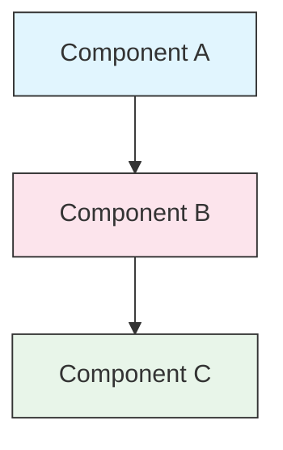

<picture>
  <source media="(prefers-color-scheme: dark)" srcset="resources/logos/claude-howto-logo-dark.svg">
  
</picture>

# Style Guide

> 为 `Claude How To` 贡献内容时的规范与格式指南。遵循本指南可保持内容一致、专业、易维护。

---

## Table of Contents

- [File and Folder Naming](#file-and-folder-naming)
- [Document Structure](#document-structure)
- [Headings](#headings)
- [Text Formatting](#text-formatting)
- [Lists](#lists)
- [Tables](#tables)
- [Code Blocks](#code-blocks)
- [Links and Cross-References](#links-and-cross-references)
- [Diagrams](#diagrams)
- [Emoji Usage](#emoji-usage)
- [YAML Frontmatter](#yaml-frontmatter)
- [Images and Media](#images-and-media)
- [Tone and Voice](#tone-and-voice)
- [Commit Messages](#commit-messages)
- [Checklist for Authors](#checklist-for-authors)

---

## File and Folder Naming

### Lesson Folders

课程目录采用 **两位数字前缀** + **kebab-case 描述名**：

```
01-slash-commands/
02-memory/
03-skills/
04-subagents/
05-mcp/
```

数字表示从入门到进阶的学习顺序。

### File Names

| Type | Convention | Examples |
|------|-----------|----------|
| **Lesson README** | `README.md` | `01-slash-commands/README.md` |
| **Feature file** | Kebab-case `.md` | `code-reviewer.md`, `generate-api-docs.md` |
| **Shell script** | Kebab-case `.sh` | `format-code.sh`, `validate-input.sh` |
| **Config file** | Standard names | `.mcp.json`, `settings.json` |
| **Memory file** | Scope-prefixed | `project-CLAUDE.md`, `personal-CLAUDE.md` |
| **Top-level docs** | UPPER_CASE `.md` | `CATALOG.md`, `QUICK_REFERENCE.md`, `CONTRIBUTING.md` |
| **Image assets** | Kebab-case | `pr-slash-command.png`, `claude-howto-logo.svg` |

### Rules

- 所有文件与目录优先使用 **小写**（顶层文档如 `README.md`、`CATALOG.md` 除外）
- 单词分隔统一使用 **连字符**（`-`），不要使用下划线或空格
- 名称要语义清晰且尽量简洁

---

## Document Structure

### Root README

根目录 `README.md` 采用以下顺序：

1. Logo（含明暗主题的 `\<picture\>` 元素）
2. H1 标题
3. 引导性 blockquote（一句话价值主张）
4. “Why This Guide?” 章节（含对比表）
5. 分割线（`---`）
6. 目录（Table of Contents）
7. Feature Catalog
8. Quick Navigation
9. Learning Path
10. 各功能章节
11. Getting Started
12. Best Practices / Troubleshooting
13. Contributing / License

### Lesson README

每个课程 `README.md` 建议顺序：

1. H1 标题（如 `# Slash Commands`）
2. 简要概述段落
3. 快速参考表（可选）
4. 架构图（Mermaid）
5. 详细章节（H2）
6. 实践示例（编号列表，4-6 个）
7. 最佳实践（Do / Don't 表格）
8. 故障排查
9. 相关指南 / 官方文档
10. 文档元信息页脚

### Feature/Example File

独立功能文件（如 `optimize.md`、`pr.md`）建议顺序：

1. YAML frontmatter（如适用）
2. H1 标题
3. 目的 / 描述
4. 使用说明
5. 代码示例
6. 自定义建议

### Section Separators

使用分割线（`---`）分隔文档中的主要区域：

```markdown
---

## New Major Section
```

建议放在引导 blockquote 之后，以及逻辑上明显分区之间。

---

## Headings

### Hierarchy

| Level | Use | Example |
|-------|-----|---------|
| `#` H1 | 页面标题（每文档仅一个） | `# Slash Commands` |
| `##` H2 | 主要章节 | `## Best Practices` |
| `###` H3 | 子章节 | `### Adding a Skill` |
| `####` H4 | 更细子章节（少用） | `#### Configuration Options` |

### Rules

- **每个文档仅一个 H1** —— 只用于页面标题
- **不要跳级** —— 不要从 H2 直接跳到 H4
- **标题保持简洁** —— 推荐 2-5 个词
- **使用 sentence case** —— 仅首词和专有名词大写（功能名按原样保留）
- 仅根 README 的章节标题可加 emoji 前缀（见 [Emoji Usage](#emoji-usage)）

---

## Text Formatting

### Emphasis

| Style | When to Use | Example |
|-------|------------|---------|
| **Bold** (`**text**`) | 关键术语、表格标签、重点概念 | `**Installation**:` |
| *Italic* (`*text*`) | 技术术语首次出现、书名/文档名 | `*frontmatter*` |
| `Code` (`` `text` ``) | 文件名、命令、配置值、代码引用 | `` `CLAUDE.md` `` |

### Blockquotes for Callouts

使用 blockquote + 粗体前缀表达提示信息：

```markdown
> **Note**: Custom slash commands have been merged into skills since v2.0.

> **Important**: Never commit API keys or credentials.

> **Tip**: Combine memory with skills for maximum effectiveness.
```

支持的提示类型：**Note**、**Important**、**Tip**、**Warning**。

### Paragraphs

- 段落尽量短（2-4 句）
- 段落之间留空行
- 先给结论，再补上下文
- 解释“为什么”，而不仅是“做什么”

---

## Lists

### Unordered Lists

无序列表使用短横线（`-`），嵌套缩进 2 空格：

```markdown
- First item
- Second item
  - Nested item
  - Another nested item
    - Deep nested (avoid going deeper than 3 levels)
- Third item
```

### Ordered Lists

有序列表用于步骤、流程和排序项：

```markdown
1. First step
2. Second step
   - Sub-point detail
   - Another sub-point
3. Third step
```

### Descriptive Lists

键值型列表可用粗体标签：

```markdown
- **Performance bottlenecks** - identify O(n^2) operations, inefficient loops
- **Memory leaks** - find unreleased resources, circular references
- **Algorithm improvements** - suggest better algorithms or data structures
```

### Rules

- 保持一致缩进（每层 2 空格）
- 列表前后留空行
- 保持列表项结构平行（都以动词开头，或都以名词开头）
- 嵌套层级建议不超过 3 层

---

## Tables

### Standard Format

```markdown
| Column 1 | Column 2 | Column 3 |
|----------|----------|----------|
| Data     | Data     | Data     |
```

### Common Table Patterns

**功能对比（3-4 列）：**

```markdown
| Feature | Invocation | Persistence | Best For |
|---------|-----------|------------|----------|
| **Slash Commands** | Manual (`/cmd`) | Session only | Quick shortcuts |
| **Memory** | Auto-loaded | Cross-session | Long-term learning |
```

**Do / Don't：**

```markdown
| Do | Don't |
|----|-------|
| Use descriptive names | Use vague names |
| Keep files focused | Overload a single file |
```

**快速参考：**

```markdown
| Aspect | Details |
|--------|---------|
| **Purpose** | Generate API documentation |
| **Scope** | Project-level |
| **Complexity** | Intermediate |
```

### Rules

- 当第一列是“行标签”时，使用 **粗体** 强调
- 源码中建议对齐竖线，便于维护（可选但推荐）
- 单元格内容尽量简洁；细节用链接承载
- 表格内的命令和路径使用 `code formatting`

---

## Code Blocks

### Language Tags

代码块必须带语言标签（语法高亮）：

| Language | Tag | Use For |
|----------|-----|---------|
| Shell | `bash` | CLI 命令、脚本 |
| Python | `python` | Python 代码 |
| JavaScript | `javascript` | JS 代码 |
| TypeScript | `typescript` | TS 代码 |
| JSON | `json` | 配置文件 |
| YAML | `yaml` | Frontmatter、配置 |
| Markdown | `markdown` | Markdown 示例 |
| SQL | `sql` | 数据库查询 |
| Plain text | (no tag) | 预期输出、目录树 |

### Conventions

```bash
# Comment explaining what the command does
claude mcp add notion --transport http https://mcp.notion.com/mcp
```

- 对不直观的命令，前面先加 **注释行**
- 示例要 **可复制即运行**
- 合适时同时给出 **简单版与进阶版**
- 如有助理解，可补充 **预期输出**（用无语言标签代码块）

### Installation Blocks

安装说明建议使用以下模式：

```bash
# Copy files to your project
cp 01-slash-commands/*.md .claude/commands/
```

### Multi-step Workflows

```bash
# Step 1: Create the directory
mkdir -p .claude/commands

# Step 2: Copy the templates
cp 01-slash-commands/*.md .claude/commands/

# Step 3: Verify installation
ls .claude/commands/
```

---

## Links and Cross-References

### Internal Links (Relative)

所有内部链接使用相对路径：

```markdown
[Slash Commands](01-slash-commands/)
[Skills Guide](03-skills/)
[Memory Architecture](02-memory/#memory-architecture)
```

从课程目录返回根目录或跳转到同级目录：

```markdown
[Back to main guide](../README.md)
[Related: Skills](../03-skills/)
```

### External Links (Absolute)

外部链接使用完整 URL，且锚文本需具备语义：

```markdown
[Anthropic's official documentation](https://code.claude.com/docs/en/overview)
```

- 不要使用 “click here” 或 “this link” 作为锚文本
- 锚文本要脱离上下文也能表达含义

### Section Anchors

同文档内章节跳转使用 GitHub 风格锚点：

```markdown
[Feature Catalog](#-feature-catalog)
[Best Practices](#best-practices)
```

### Related Guides Pattern

课程文档结尾建议增加 related guides：

```markdown
## Related Guides

- [Slash Commands](../01-slash-commands/) - Quick shortcuts
- [Memory](../02-memory/) - Persistent context
- [Skills](../03-skills/) - Reusable capabilities
```

---

## Diagrams

### Mermaid

统一使用 Mermaid 绘图，支持类型：

- `graph TB` / `graph LR` —— 架构、层级、流程
- `sequenceDiagram` —— 交互时序
- `timeline` —— 时间线

### Style Conventions

使用统一配色风格：



**Color palette:**

| Color | Hex | Use For |
|-------|-----|---------|
| Light blue | `#e1f5fe` | 主组件、输入 |
| Light pink | `#fce4ec` | 处理过程、中间层 |
| Light green | `#e8f5e9` | 输出、结果 |
| Light yellow | `#fff9c4` | 配置、可选项 |
| Light purple | `#f3e5f5` | 面向用户、UI |

### Rules

- 节点文本使用 `["Label text"]`（支持特殊字符）
- 节点内换行使用 `\<br/\>`
- 图尽量简洁（最多 10-12 个节点）
- 图下方补一段简短文字描述，提升可访问性
- 层级结构用 `TB`，流程结构优先用 `LR`

---

## Emoji Usage

### Where Emojis Are Used

Emoji 应当 **节制且有语义**，仅在特定场景使用：

| Context | Emojis | Example |
|---------|--------|---------|
| Root README section headers | Category icons | `## 📚 Learning Path` |
| Skill level indicators | Colored circles | 🟢 Beginner, 🔵 Intermediate, 🔴 Advanced |
| Do's and Don'ts | Check/cross marks | ✅ Do this, ❌ Don't do this |
| Complexity ratings | Stars | ⭐⭐⭐ |

### Standard Emoji Set

| Emoji | Meaning |
|-------|---------|
| 📚 | 学习、指南、文档 |
| ⚡ | 快速开始、速查 |
| 🎯 | 功能、快速索引 |
| 🎓 | 学习路径 |
| 📊 | 统计、对比 |
| 🚀 | 安装、快速命令 |
| 🟢 | 入门级 |
| 🔵 | 中级 |
| 🔴 | 高级 |
| ✅ | 推荐做法 |
| ❌ | 避免做法 / 反模式 |
| ⭐ | 复杂度单位 |

### Rules

- **不要在正文段落中使用 emoji**
- **emoji 仅用于根 README 的章节标题**（课程 README 不使用）
- **不要为了装饰而使用 emoji** —— 每个 emoji 都应传达信息
- 使用范围与含义必须与上表保持一致

---

## YAML Frontmatter

### Feature Files (Skills, Commands, Agents)

```yaml
---
name: unique-identifier
description: What this feature does and when to use it
allowed-tools: Bash, Read, Grep
---
```

### Optional Fields

```yaml
---
name: my-feature
description: Brief description
argument-hint: "[file-path] [options]"
allowed-tools: Bash, Read, Grep, Write, Edit
model: opus                        # opus, sonnet, or haiku
disable-model-invocation: true     # User-only invocation
user-invocable: false              # Hidden from user menu
context: fork                      # Run in isolated subagent
agent: Explore                     # Agent type for context: fork
---
```

### Rules

- frontmatter 必须位于文件最顶部
- `name` 字段使用 **kebab-case**
- `description` 控制在一句话内
- 仅保留必要字段，避免冗余

---

## Images and Media

### Logo Pattern

文档开头如果需要 logo，使用 `\<picture\>` 支持明暗主题：

```html
<picture>
  <source media="(prefers-color-scheme: dark)" srcset="resources/logos/claude-howto-logo-dark.svg">
  
</picture>
```

### Screenshots

- 截图文件存放在对应课程目录（例如 `01-slash-commands/pr-slash-command.png`）
- 文件名使用 kebab-case
- 必须提供可读的 alt 文本
- 图表优先 SVG，截图优先 PNG

### Rules

- 图片必须提供 alt 文本
- 控制图片体积（PNG 建议 < 500KB）
- 图片引用统一使用相对路径
- 图片放在引用它的文档同级目录；共享资源可放在 `assets/`

---

## Tone and Voice

### Writing Style

- **专业且易懂** —— 技术准确，但不过度堆术语
- **主动语态** —— 用 “Create a file”，而不是 “A file should be created”
- **直接指令** —— 用 “Run this command”，而不是 “You might want to run...”
- **对初学者友好** —— 假设读者是 Claude Code 新手，而不是编程新手

### Content Principles

| Principle | Example |
|-----------|---------|
| **Show, don't tell** | 给可运行示例，不给抽象空话 |
| **Progressive complexity** | 先简单，再逐步加深 |
| **Explain the "why"** | 不仅说“怎么做”，还说明“为什么这样做” |
| **Copy-paste ready** | 每段代码都可直接复制运行 |
| **Real-world context** | 用真实场景，不用刻意构造案例 |

### Vocabulary

- 使用 “Claude Code”（不要写 “Claude CLI” 或 “the tool”）
- 使用 “skill”（不要使用旧称 “custom command”）
- 对编号章节使用 “lesson” 或 “guide”
- 对独立功能文件使用 “example”

---

## Commit Messages

遵循 [Conventional Commits](https://www.conventionalcommits.org/)：

```
type(scope): description
```

### Types

| Type | Use For |
|------|---------|
| `feat` | 新功能、新示例、新指南 |
| `fix` | Bug 修复、错误更正、坏链路修复 |
| `docs` | 文档改进 |
| `refactor` | 不改变行为的结构调整 |
| `style` | 仅格式化调整 |
| `test` | 测试新增或变更 |
| `chore` | 构建、依赖、CI 等杂务 |

### Scopes

scope 使用课程名或文件区域：

```
feat(slash-commands): Add API documentation generator
docs(memory): Improve personal preferences example
fix(README): Correct table of contents link
docs(skills): Add comprehensive code review skill
```

---

## Document Metadata Footer

课程 README 结尾使用元信息块：

```markdown
---
**Last Updated**: March 2026
**Claude Code Version**: 2.1+
**Compatible Models**: Claude Sonnet 4.6, Claude Opus 4.6, Claude Haiku 4.5
```

- 日期格式统一为 “Month Year”（例如 `March 2026`）
- 功能变化时同步更新版本信息
- 列出全部兼容模型

---

## Checklist for Authors

提交前请逐项确认：

- [ ] 文件/目录命名符合 kebab-case
- [ ] 文档仅有一个 H1 标题
- [ ] 标题层级正确（无跳级）
- [ ] 所有代码块都有语言标签
- [ ] 代码示例可复制即运行
- [ ] 内部链接使用相对路径
- [ ] 外部链接锚文本有语义
- [ ] 表格格式正确
- [ ] 如使用 emoji，符合标准集合
- [ ] Mermaid 图使用标准配色
- [ ] 不包含敏感信息（API key、凭据）
- [ ] YAML frontmatter 合法（如适用）
- [ ] 图片提供 alt 文本
- [ ] 段落简短且聚焦
- [ ] 相关指南链接完整
- [ ] Commit message 符合 conventional commits
