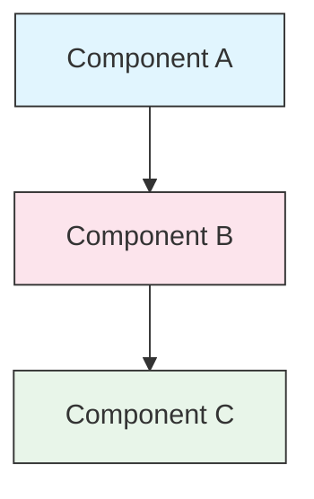

<picture>
  <source media="(prefers-color-scheme: dark)" srcset="resources/logos/claude-howto-logo-dark.svg">
  
</picture>

# 风格指南

> 贡献 Claude How To 的规范与格式规则。遵循本指南可保持内容一致、专业且易于维护。

---

## 目录

- [文件与文件夹命名](#文件与文件夹命名)
- [文档结构](#文档结构)
- [标题](#标题)
- [文本格式](#文本格式)
- [列表](#列表)
- [表格](#表格)
- [代码块](#代码块)
- [链接与交叉引用](#链接与交叉引用)
- [图表](#图表)
- [Emoji 使用](#emoji-使用)
- [YAML Frontmatter](#yaml-frontmatter)
- [图片与媒体](#图片与媒体)
- [语气与风格](#语气与风格)
- [提交信息](#提交信息)
- [作者检查清单](#作者检查清单)

---

## 文件与文件夹命名

### 课程文件夹

课程文件夹使用**两位数字前缀**加**kebab-case** 描述符：

```
01-slash-commands/
02-memory/
03-skills/
04-subagents/
05-mcp/
```

编号反映从入门到进阶的学习路径顺序。

### 文件名

| 类型 | 命名规范 | 示例 |
|------|-----------|----------|
| **课程 README** | `README.md` | `01-slash-commands/README.md` |
| **功能文件** | Kebab-case `.md` | `code-reviewer.md`, `generate-api-docs.md` |
| **Shell 脚本** | Kebab-case `.sh` | `format-code.sh`, `validate-input.sh` |
| **配置文件** | 标准命名 | `.mcp.json`, `settings.json` |
| **Memory 文件** | 范围前缀 | `project-CLAUDE.md`, `personal-CLAUDE.md` |
| **顶层文档** | UPPER_CASE `.md` | `CATALOG.md`, `QUICK_REFERENCE.md`, `CONTRIBUTING.md` |
| **图片资源** | Kebab-case | `pr-slash-command.png`, `claude-howto-logo.svg` |

### 规则

- 所有文件和文件夹名使用**小写**（顶层文档如 `README.md`、`CATALOG.md` 除外）
- 使用**连字符**（`-`）作为单词分隔符，不使用下划线或空格
- 命名要具有描述性，同时保持简洁

---

## 文档结构

### 根目录 README

根目录 `README.md` 按以下顺序组织：

1. Logo（`<picture>` 元素，含深色/浅色变体）
2. H1 标题
3. 介绍性引用块（一行价值主张）
4. "为什么选择本指南？"部分，含对比表格
5. 水平分隔线（`---`）
6. 目录
7. 功能目录
8. 快速导航
9. 学习路径
10. 功能章节
11. 快速入门
12. 最佳实践 / 故障排除
13. 贡献 / 许可证

### 课程 README

每个课程的 `README.md` 按以下顺序组织：

1. H1 标题（例如：`# Slash Commands`）
2. 简短概述段落
3. 快速参考表格（可选）
4. 架构图（Mermaid）
5. 详细章节（H2）
6. 实践示例（编号，4-6 个示例）
7. 最佳实践（推荐与不推荐表格）
8. 故障排除
9. 相关指南 / 官方文档
10. 文档元数据页脚

### 功能/示例文件

单个功能文件（例如 `optimize.md`、`pr.md`）：

1. YAML frontmatter（如适用）
2. H1 标题
3. 用途 / 描述
4. 使用说明
5. 代码示例
6. 自定义提示

### 章节分隔符

使用水平分隔线（`---`）分隔文档的主要区域：

```markdown
---

## 新的主要章节
```

在介绍性引用块之后以及文档逻辑上不同的部分之间添加分隔线。

---

## 标题

### 层级

| 级别 | 用途 | 示例 |
|-------|-----|---------|
| `#` H1 | 页面标题（每个文档仅一个） | `# Slash Commands` |
| `##` H2 | 主要章节 | `## Best Practices` |
| `###` H3 | 子章节 | `### Adding a Skill` |
| `####` H4 | 子子章节（少用） | `#### Configuration Options` |

### 规则

- **每个文档只有一个 H1** — 仅用于页面标题
- **不跳级** — 不要从 H2 直接跳到 H4
- **标题简洁** — 目标 2-5 个词
- **使用句子大小写** — 仅首词和专有名词大写（功能名称保持原样为例外）
- **仅在根目录 README 的章节标题上添加 emoji 前缀**（参见 [Emoji 使用](#emoji-使用)）

---

## 文本格式

### 强调

| 样式 | 使用场景 | 示例 |
|-------|------------|---------|
| **粗体** (`**text**`) | 关键术语、表格中的标签、重要概念 | `**Installation**:` |
| *斜体* (`*text*`) | 技术术语首次出现、书籍/文档标题 | `*frontmatter*` |
| `代码` (`` `text` ``) | 文件名、命令、配置值、代码引用 | `` `CLAUDE.md` `` |

### 引用块用于提示

使用带粗体前缀的引用块表示重要说明：

```markdown
> **Note**: Custom slash commands have been merged into skills since v2.0.

> **Important**: Never commit API keys or credentials.

> **Tip**: Combine memory with skills for maximum effectiveness.
```

支持的提示类型：**Note（注意）**、**Important（重要）**、**Tip（提示）**、**Warning（警告）**。

### 段落

- 段落保持简短（2-4 句）
- 段落之间添加空行
- 以关键点开头，再提供上下文
- 解释"为什么"，而不仅仅是"是什么"

---

## 列表

### 无序列表

使用破折号（`-`）并以 2 空格缩进嵌套：

```markdown
- 第一项
- 第二项
  - 嵌套项
  - 另一个嵌套项
    - 深度嵌套（避免超过 3 层）
- 第三项
```

### 有序列表

使用编号列表表示顺序步骤、说明和排名项目：

```markdown
1. 第一步
2. 第二步
   - 子要点详情
   - 另一个子要点
3. 第三步
```

### 描述性列表

使用粗体标签表示键值样式列表：

```markdown
- **Performance bottlenecks** - identify O(n^2) operations, inefficient loops
- **Memory leaks** - find unreleased resources, circular references
- **Algorithm improvements** - suggest better algorithms or data structures
```

### 规则

- 保持一致的缩进（每级 2 空格）
- 列表前后各添加一个空行
- 列表项在结构上保持平行（都以动词开头，或都是名词等）
- 避免嵌套超过 3 层

---

## 表格

### 标准格式

```markdown
| 列1 | 列2 | 列3 |
|----------|----------|----------|
| 数据     | 数据     | 数据     |
```

### 常见表格模式

**功能对比（3-4 列）：**

```markdown
| Feature | Invocation | Persistence | Best For |
|---------|-----------|------------|----------|
| **Slash Commands** | Manual (`/cmd`) | Session only | Quick shortcuts |
| **Memory** | Auto-loaded | Cross-session | Long-term learning |
```

**推荐与不推荐：**

```markdown
| Do | Don't |
|----|-------|
| Use descriptive names | Use vague names |
| Keep files focused | Overload a single file |
```

**快速参考：**

```markdown
| Aspect | Details |
|--------|---------|
| **Purpose** | Generate API documentation |
| **Scope** | Project-level |
| **Complexity** | Intermediate |
```

### 规则

- 当行标签位于第一列时，**使用粗体表头**
- 在源码中对齐竖线以提高可读性（可选，但建议这样做）
- 单元格内容简洁；详细内容使用链接
- 单元格内的命令和文件路径使用 `代码格式`

---

## 代码块

### 语言标签

始终指定语言标签以启用语法高亮：

| 语言 | 标签 | 适用场景 |
|----------|-----|---------|
| Shell | `bash` | CLI 命令、脚本 |
| Python | `python` | Python 代码 |
| JavaScript | `javascript` | JS 代码 |
| TypeScript | `typescript` | TS 代码 |
| JSON | `json` | 配置文件 |
| YAML | `yaml` | Frontmatter、配置 |
| Markdown | `markdown` | Markdown 示例 |
| SQL | `sql` | 数据库查询 |
| 纯文本 | （无标签） | 预期输出、目录树 |

### 规范

```bash
# 说明该命令用途的注释
claude mcp add notion --transport http https://mcp.notion.com/mcp
```

- 在不明显的命令前添加**注释行**
- 所有示例**可直接复制粘贴使用**
- 在相关时展示**简单版本和高级版本**
- 在有助于理解时包含**预期输出**（使用无标签代码块）

### 安装代码块

安装说明使用以下模式：

```bash
# 将文件复制到您的项目
cp 01-slash-commands/*.md .claude/commands/
```

### 多步骤工作流

```bash
# 第一步：创建目录
mkdir -p .claude/commands

# 第二步：复制模板
cp 01-slash-commands/*.md .claude/commands/

# 第三步：验证安装
ls .claude/commands/
```

---

## 链接与交叉引用

### 内部链接（相对路径）

所有内部链接使用相对路径：

```markdown
[Slash Commands](01-slash-commands/)
[Skills Guide](03-skills/)
[Memory Architecture](02-memory/#memory-architecture)
```

从课程文件夹链接回根目录或兄弟目录：

```markdown
[Back to main guide](../README.md)
[Related: Skills](../03-skills/)
```

### 外部链接（绝对路径）

使用完整 URL 并配以描述性锚文本：

```markdown
[Anthropic's official documentation](https://code.claude.com/docs/en/overview)
```

- 不要使用"点击这里"或"此链接"作为锚文本
- 使用在脱离上下文情况下仍有意义的描述性文本

### 章节锚点

使用 GitHub 风格的锚点链接到同一文档的章节：

```markdown
[Feature Catalog](#-feature-catalog)
[Best Practices](#best-practices)
```

### 相关指南模式

课程末尾添加相关指南部分：

```markdown
## Related Guides

- [Slash Commands](../01-slash-commands/) - Quick shortcuts
- [Memory](../02-memory/) - Persistent context
- [Skills](../03-skills/) - Reusable capabilities
```

---

## 图表

### Mermaid

所有图表使用 Mermaid。支持的类型：

- `graph TB` / `graph LR` — 架构图、层级图、流程图
- `sequenceDiagram` — 交互流程图
- `timeline` — 时间顺序图

### 样式规范

使用样式块应用统一颜色：



**色彩调色板：**

| 颜色 | 十六进制 | 适用场景 |
|-------|-----|---------|
| 浅蓝色 | `#e1f5fe` | 主要组件、输入 |
| 浅粉色 | `#fce4ec` | 处理、中间件 |
| 浅绿色 | `#e8f5e9` | 输出、结果 |
| 浅黄色 | `#fff9c4` | 配置、可选项 |
| 浅紫色 | `#f3e5f5` | 面向用户、UI |

### 规则

- 节点标签使用 `["标签文本"]`（支持特殊字符）
- 标签内换行使用 `<br/>`
- 图表保持简洁（最多 10-12 个节点）
- 在图表下方添加简短文字说明以提高可访问性
- 层级结构使用从上到下（`TB`），工作流使用从左到右（`LR`）

---

## Emoji 使用

### Emoji 的使用场景

Emoji **谨慎且有目的地使用** — 仅在特定场景中：

| 场景 | Emoji | 示例 |
|---------|--------|---------|
| 根目录 README 章节标题 | 分类图标 | `## 📚 Learning Path` |
| 技能级别指示器 | 彩色圆圈 | 🟢 初级, 🔵 中级, 🔴 高级 |
| 推荐与不推荐 | 对勾/叉号 | ✅ 推荐, ❌ 不推荐 |
| 复杂度评级 | 星星 | ⭐⭐⭐ |

### 标准 Emoji 集

| Emoji | 含义 |
|-------|---------|
| 📚 | 学习、指南、文档 |
| ⚡ | 快速入门、快速参考 |
| 🎯 | 功能、快速参考 |
| 🎓 | 学习路径 |
| 📊 | 统计、对比 |
| 🚀 | 安装、快速命令 |
| 🟢 | 初级 |
| 🔵 | 中级 |
| 🔴 | 高级 |
| ✅ | 推荐做法 |
| ❌ | 避免 / 反模式 |
| ⭐ | 复杂度评级单位 |

### 规则

- **永远不要在正文或段落中使用 Emoji**
- **仅在根目录 README 的标题中使用 Emoji**（课程 README 中不使用）
- **不添加装饰性 Emoji** — 每个 Emoji 都应传达含义
- 保持 Emoji 使用与上表一致

---

## YAML Frontmatter

### 功能文件（Skills、Commands、Agents）

```yaml
---
name: unique-identifier
description: What this feature does and when to use it
allowed-tools: Bash, Read, Grep
---
```

### 可选字段

```yaml
---
name: my-feature
description: Brief description
argument-hint: "[file-path] [options]"
allowed-tools: Bash, Read, Grep, Write, Edit
model: opus                        # opus、sonnet 或 haiku
disable-model-invocation: true     # 仅用户调用
user-invocable: false              # 对用户菜单隐藏
context: fork                      # 在隔离的子 agent 中运行
agent: Explore                     # context: fork 的 Agent 类型
---
```

### 规则

- 将 frontmatter 放在文件最顶部
- `name` 字段使用 **kebab-case**
- `description` 保持在一句话以内
- 仅包含必要的字段

---

## 图片与媒体

### Logo 模式

所有以 Logo 开头的文档使用 `<picture>` 元素以支持深色/浅色模式：

```html
<picture>
  <source media="(prefers-color-scheme: dark)" srcset="resources/logos/claude-howto-logo-dark.svg">
  
</picture>
```

### 截图

- 存放在相关课程文件夹中（例如 `01-slash-commands/pr-slash-command.png`）
- 使用 kebab-case 文件名
- 提供描述性 alt 文本
- 图表优先使用 SVG，截图使用 PNG

### 规则

- 始终为图片提供 alt 文本
- 保持图片文件大小合理（PNG 小于 500KB）
- 图片引用使用相对路径
- 将图片存放在引用它的文档所在目录，或存放在 `assets/` 中用于共享图片

---

## 语气与风格

### 写作风格

- **专业而平易近人** — 技术准确，但不过度堆砌术语
- **主动语态** — "创建文件"而非"文件应该被创建"
- **直接指令** — "运行此命令"而非"您可能需要运行此命令"
- **对初学者友好** — 假设读者是 Claude Code 新手，而非编程新手

### 内容原则

| 原则 | 示例 |
|-----------|---------|
| **展示，而非描述** | 提供可运行的示例，而非抽象描述 |
| **渐进式复杂度** | 从简单开始，在后续章节中增加深度 |
| **解释"为什么"** | "使用 memory 是因为……"而非仅仅"使用 memory……" |
| **可直接复制粘贴** | 每个代码块直接粘贴后应可正常运行 |
| **真实世界场景** | 使用实际应用场景，而非人为构造的示例 |

### 词汇

- 使用 "Claude Code"（不使用 "Claude CLI" 或 "the tool"）
- 使用 "skill"（不使用 "custom command" — 已废弃术语）
- 使用 "lesson" 或 "guide" 表示编号章节
- 使用 "example" 表示单个功能文件

---

## 提交信息

遵循 [Conventional Commits](https://www.conventionalcommits.org/) 规范：

```
type(scope): description
```

### 类型

| 类型 | 用途 |
|------|---------|
| `feat` | 新功能、示例或指南 |
| `fix` | 错误修复、更正、失效链接 |
| `docs` | 文档改进 |
| `refactor` | 不改变行为的重构 |
| `style` | 仅格式更改 |
| `test` | 测试添加或修改 |
| `chore` | 构建、依赖、CI |

### 作用域

使用课程名称或文件区域作为作用域：

```
feat(slash-commands): Add API documentation generator
docs(memory): Improve personal preferences example
fix(README): Correct table of contents link
docs(skills): Add comprehensive code review skill
```

---

## 文档元数据页脚

课程 README 以元数据块结尾：

```markdown
---
**Last Updated**: March 2026
**Claude Code Version**: 2.1+
**Compatible Models**: Claude Sonnet 4.6, Claude Opus 4.6, Claude Haiku 4.5
```

- 使用月份 + 年份格式（例如："March 2026"）
- 当功能发生变化时更新版本
- 列出所有兼容的模型

---

## 作者检查清单

提交内容前，请验证：

- [ ] 文件/文件夹名使用 kebab-case
- [ ] 文档以 H1 标题开头（每个文件仅一个）
- [ ] 标题层级正确（没有跳级）
- [ ] 所有代码块都有语言标签
- [ ] 代码示例可直接复制粘贴使用
- [ ] 内部链接使用相对路径
- [ ] 外部链接有描述性锚文本
- [ ] 表格格式正确
- [ ] Emoji 遵循标准集（如果使用的话）
- [ ] Mermaid 图表使用标准色彩调色板
- [ ] 没有敏感信息（API 密钥、凭据）
- [ ] YAML frontmatter 有效（如适用）
- [ ] 图片有 alt 文本
- [ ] 段落简短且重点突出
- [ ] 相关指南部分链接到相关课程
- [ ] 提交信息遵循 Conventional Commits 格式
