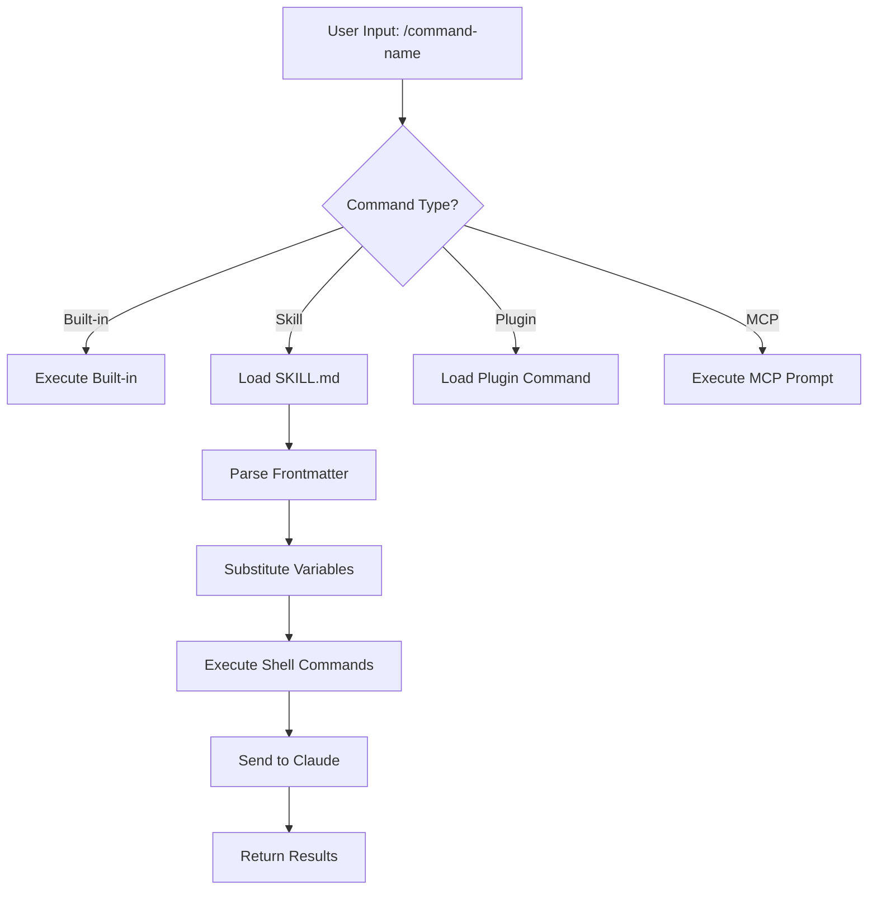
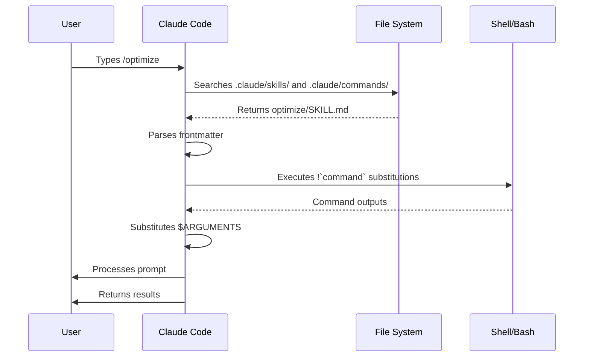

<picture>
  <source media="(prefers-color-scheme: dark)" srcset="../resources/logos/claude-howto-logo-dark.svg">
  
</picture>

# 슬래시 명령어

## 개요

슬래시 명령어는 대화형 세션 동안 Claude의 동작을 제어하는 단축키입니다. 여러 유형이 있습니다:

- **내장 명령어**: Claude Code에서 제공합니다 (`/help`, `/clear`, `/model`)
- **스킬**: `SKILL.md` 파일로 생성된 사용자 정의 명령어입니다 (`/optimize`, `/pr`)
- **플러그인 명령어**: 설치된 플러그인에서 제공하는 명령어입니다 (`/frontend-design:frontend-design`)
- **MCP 프롬프트**: MCP 서버에서 제공하는 명령어입니다 (`/mcp__github__list_prs`)

> **참고**: 사용자 정의 슬래시 명령어는 스킬로 통합되었습니다. `.claude/commands/`에 있는 파일은 여전히 작동하지만, 스킬 (`.claude/skills/`)이 이제 권장되는 접근 방식입니다. 두 가지 모두 `/command-name` 단축키를 생성합니다. 전체 참조는 [스킬 가이드](../03-skills/)를 참조하십시오.

## 내장 명령어 참조

내장 명령어는 일반적인 작업을 위한 단축키입니다. **60개 이상의 내장 명령어**와 **5개의 번들 스킬**이 제공됩니다. Claude Code에서 `/`를 입력하여 전체 목록을 보거나, `/` 뒤에 글자를 입력하여 필터링할 수 있습니다.

| Command | 목적 |
|---------|---------|
| `/add-dir <path>` | 작업 디렉터리 추가 |
| `/agents` | 에이전트 구성 관리 |
| `/branch [name]` | 대화를 새 세션으로 분기합니다 (별칭: `/fork`). 참고: v2.1.77에서 `/fork`가 `/branch`로 이름이 변경되었습니다 |
| `/btw <question>` | Claude가 주 작업을 수행하는 동안 임시 보조 질문을 합니다; 주 대화 컨텍스트를 오염시키지 않습니다 |
| `/cd <path>` | 프롬프트 캐시를 손상시키지 않고 세션을 새 작업 디렉터리로 이동합니다 (v2.1.169에 추가) |
| `/chrome` | Chrome 브라우저 통합 구성 |
| `/clear` | 대화 지우기 (별칭: `/reset`, `/new`) |
| `/color [color\|default]` | 프롬프트 바 색상을 설정합니다. 인자 없이 `/color`를 사용하면 임의의 세션 색상을 선택합니다 (v2.1.128+); 색상 이름 또는 16진수를 전달하여 명시적으로 설정합니다. |
| `/compact [instructions]` | 선택적 포커스 지침을 사용하여 대화를 압축합니다 |
| `/config` | 설정 열기 (별칭: `/settings`) |
| `/context` | 컨텍스트 사용량을 컬러 그리드로 시각화합니다 |
| `/copy [N]` | 보조자의 응답을 클립보드에 복사합니다; `w`는 파일에 씁니다 |
| `/cost` | `/usage`의 타이핑 단축키 별칭 — 비용 탭을 엽니다 (v2.1.118+) |
| `/desktop` | 데스크톱 앱에서 계속 (별칭: `/app`) |
| `/diff` | 커밋되지 않은 변경 사항에 대한 대화형 Diff 뷰어 |
| `/doctor` | 설치 상태를 진단합니다 — Claude가 응답 중일 때 열 수 있습니다; 상태 아이콘을 표시합니다; `f`를 눌러 문제를 자동 수정합니다 (v2.1.116에서 향상; v2.1.178에서 더 명확한 아이콘이 있는 평면 트리로 레이아웃 새로 고침) |
| `/effort [low\|medium\|high\|xhigh\|max\|auto]` | 대화형 화살표 키 슬라이더를 통해 노력 수준을 설정합니다. 수준: `low` → `medium` → `high` → `xhigh` (v2.1.111에 새로 추가) → `max`. Opus 4.8의 기본값은 `high`입니다 (Opus 4.7의 경우 `xhigh`); `xhigh`는 Opus 4.8 또는 4.7이 필요합니다; `max`는 Opus 4.8/4.7/4.6 및 Sonnet 4.6에서 작동합니다. 메뉴는 또한 `ultracode`를 제공합니다 (모델 노력 수준은 아니지만 `xhigh`를 보내고 Claude가 동적 워크플로우를 조정하도록 합니다; 세션 전용) |
| `/exit` | REPL 종료 (별칭: `/quit`) |
| `/export [filename]` | 현재 대화를 파일 또는 클립보드로 내보냅니다 |
| `/usage-credits` | 속도 제한을 위한 추가 사용량 구성 (v2.1.144에서 `/extra-usage`에서 이름 변경; `/extra-usage`는 여전히 별칭으로 작동합니다) |
| `/fast [on\|off]` | 빠른 모드 전환 |
| `/feedback` | 피드백 제출 (별칭: `/bug`). v2.1.141부터 최근 세션 (지난 24시간 또는 7일)을 첨부할 수 있으므로 여러 세션에 걸친 보고서에 컨텍스트가 포함됩니다. v2.1.178부터 `/bug`는 제출 전에 설명이 필요합니다. |
| `/focus` | 포커스 뷰 전환 (v2.1.110에 추가; 포커스 토글을 위한 `Ctrl+O`를 대체) |
| `/goal <statement>` | 세션 수준 완료 조건을 등록합니다; Claude는 목표가 달성될 때까지 계속 작업합니다. `/goal clear`는 이를 제거합니다. 활성 목표는 상태 표시줄에 나타나며, 경과 시간, 턴 수, 토큰 사용량을 보여주는 라이브 오버레이 패널이 함께 표시됩니다 (v2.1.139에 추가). |
| `/help` | 도움말 표시 |
| `/hooks` | 후크 구성 보기 |
| `/ide` | IDE 통합 관리 |
| `/init` | `CLAUDE.md` 초기화. 대화형 흐름을 위해 `CLAUDE_CODE_NEW_INIT=1` 설정 |
| `/insights` | 세션 분석 보고서 생성 |
| `/install-github-app` | GitHub Actions 앱 설정 |
| `/install-slack-app` | Slack 앱 설치 |
| `/keybindings` | 키 바인딩 구성 열기 |
| `/less-permission-prompts` | 최근 Bash/MCP 도구 호출을 분석하고 권한 프롬프트 감소를 위해 `.claude/settings.json`에 우선순위가 지정된 허용 목록을 추가합니다 (v2.1.111에 추가) |
| `/login` | Anthropic 계정 전환 |
| `/logout` | Anthropic 계정에서 로그아웃 |
| `/mcp` | MCP 서버 및 OAuth 관리 |
| `/memory` | `CLAUDE.md` 편집, 자동 메모리 전환 |
| `/mobile` | 모바일 앱용 QR 코드 (별칭: `/ios`, `/android`) |
| `/model [model]` | 왼쪽/오른쪽 화살표로 노력에 따라 모델을 선택합니다. v2.1.153부터 선택은 새 세션의 **기본값으로 저장됩니다** (IDE와 일치); 선택 후 `s`를 눌러 현재 세션에만 적용합니다. (`modelPicker:setAsDefault` 키 바인딩이 `modelPicker:thisSessionOnly`로 이름이 변경되었습니다; 이전 `d` 액션은 이제 `s`입니다.) |
| `/passes` | Claude Code 무료 주 공유 |
| `/permissions` | 권한 보기/업데이트 (별칭: `/allowed-tools`) |
| `/plan [description]` | 계획 모드 진입 |
| `/plugin` | 플러그인 관리 |
| `/proactive` | `/loop`의 별칭 (v2.1.105에 추가) |
| `/powerup` | 애니메이션 데모가 있는 대화형 레슨을 통해 기능 발견 |
| `/privacy-settings` | 개인 정보 설정 (Pro/Max 전용) |
| `/release-notes` | 변경 로그 보기 |
| `/recap` | 세션으로 돌아올 때 세션 요약 / 요약 표시 (v2.1.108에 추가) |
| `/reload-plugins` | 활성 플러그인 다시 로드 |
| `/reload-skills` | 세션을 다시 시작하지 않고 스킬 디렉터리 다시 스캔 (v2.1.152에 추가) |
| `/remote-control` | claude.ai에서 원격 제어 (별칭: `/rc`) |
| `/remote-env` | 기본 원격 환경 구성 |
| `/rename [name]` | 세션 이름 변경 |
| `/resume [session]` | 대화 재개 (별칭: `/continue`) |
| `/review <pr>` | GitHub PR을 검토합니다. v2.1.186부터 `/code-review medium`과 동일한 검토 엔진에서 실행됩니다. 로컬 작업 Diff를 검토하려면 `/code-review`를 사용하십시오 |
| `/rewind` | 대화 및/또는 코드 되감기 (별칭: `/checkpoint`) |
| `/sandbox` | 샌드박스 모드 전환 |
| `/schedule [description]` | 클라우드 예약 작업 생성/관리 |
| `/scroll-speed <+N\|-N>` | 라이브 미리보기를 통해 TUI 라이브 미리보기 창의 마우스 휠 스크롤 속도를 조정합니다. `~/.claude/preferences.json`에 머신별로 유지됩니다 (v2.1.139에 추가). |
| `/security-review` | 보안 취약점 여부를 위해 브랜치 분석 |
| `/skills` | 사용 가능한 스킬 나열 |
| `/stats` | `/usage`의 타이핑 단축키 별칭 — 통계 탭을 엽니다 (일일 사용량, 세션, 연속 기록) (v2.1.118+) |
| `/stickers` | Claude Code 스티커 주문 |
| `/status` | 버전, 모델, 계정 표시 |
| `/statusline` | 상태 표시줄 구성 |
| `/tasks` | 백그라운드 작업 나열/관리 |
| `/team-onboarding` | 프로젝트의 Claude Code 설정에서 팀원 온보딩 가이드를 생성합니다 (v2.1.101에 새로 추가) |
| `/terminal-setup` | 터미널 키 바인딩 구성 |
| `/theme` | 테마 선택기 열기 / 사용자 정의 테마 관리 (v2.1.118). `~/.claude/themes/<name>.json`의 JSON을 통해 사용자 정의 테마 정의 |
| `/tui` | 깜박임 없는 렌더링을 제공하는 전체 화면 TUI (텍스트 사용자 인터페이스) 모드 전환 (v2.1.110에 추가) |
| `/ultraplan <prompt>` | 울트라플랜 세션에서 계획 초안 작성, 브라우저에서 검토 |
| `/ultrareview` | 다중 에이전트 분석을 통한 포괄적인 클라우드 기반 코드 검토 (v2.1.111에 추가) |
| `/undo` | `/rewind`의 별칭 (v2.1.108에 추가) |
| `/upgrade` | 상위 플랜 티어 업그레이드 페이지 열기 |
| `/usage` | 표준 사용량 대시보드 (v2.1.118) — 플랜 사용량 제한, 속도 제한, 비용 및 일일 세션 통계를 결합합니다. `/cost` 및 `/stats`는 특정 탭을 여는 타이핑 단축키 별칭입니다 |
| `/voice` | 눌러서 말하기 음성 받아쓰기 전환 |
| `/workflows` | 실행 중이거나 완료된 동적 워크플로우 실행 보기 (v2.1.154에 추가). [동적 워크플로우](../09-advanced-features/README.md#dynamic-workflows) 참조 |

> **`/cd`가 중요한 이유:** 디렉터리를 변경하면 캐시 워밍이 손실되어 다음 턴이 느려지고 비용이 많이 들 수 있었습니다; `/cd`는 전환 시 프롬프트 캐시를 보존합니다.

### 번들 스킬

이러한 스킬은 Claude Code와 함께 제공되며 슬래시 명령어처럼 호출됩니다.

| Skill | 목적 |
|-------|---------|
| `/batch <instruction>` | 워크트리를 사용하여 대규모 병렬 변경을 조정합니다 |
| `/claude-api` | 프로젝트 언어에 대한 Claude API 참조 로드 |
| `/debug [description]` | 디버그 로깅 활성화 |
| `/loop [interval] <prompt>` | 지정된 간격으로 프롬프트를 반복적으로 실행합니다 |
| `/code-review [effort]` | 선택한 노력 수준(예: `/code-review high`)으로 현재 Diff에서 정확성 버그를 검토합니다. 원래 v2.1.146에서 `/simplify`를 흡수했지만, v2.1.154에서 `/simplify`는 별도의 명령어로 돌아왔습니다 |
| `/simplify` | 정리 전용 검토(재사용 / 단순화 / 효율성 / 고도)를 실행하고 수정 사항을 적용합니다; 버그를 찾지 **않습니다** — 버그를 찾으려면 `/code-review`를 사용하십시오. 잠시 `/code-review --fix`의 별칭이었지만 (v2.1.152), v2.1.154에서 정리 전용이 되었습니다 |

### 사용되지 않는 명령어

| Command | 상태 |
|---------|--------|
| `/output-style` | v2.1.73부터 사용되지 않음 |
| `/fork` | `/branch`로 이름 변경됨 (별칭은 여전히 작동, v2.1.77) |
| `/pr-comments` | v2.1.91에서 제거됨 — PR 댓글을 보려면 Claude에게 직접 문의하십시오 |
| `/vim` | v2.1.92에서 제거됨 — `/config` → 편집기 모드를 사용하십시오 |

### 최근 변경 사항

- `/fork`가 `/branch`로 이름이 변경되었으며 `/fork`는 별칭으로 유지됩니다 (v2.1.77)
- `/output-style`이 사용되지 않습니다 (v2.1.73)
- `/review <pr>`는 이제 `/code-review medium`과 동일한 검토 엔진을 사용합니다 (v2.1.186)
- `/effort` 명령어가 추가되었습니다; `max` 수준은 Opus 4.6+에서 사용할 수 있습니다 (원래 Opus 4.6 전용)
- `/voice` 명령어가 눌러서 말하기 음성 받아쓰기를 위해 추가되었습니다
- `/schedule` 명령어가 예약 작업을 생성/관리하기 위해 추가되었습니다
- `/color` 명령어가 프롬프트 바 사용자 정의를 위해 추가되었습니다
- `/pr-comments`가 v2.1.91에서 제거됨 — PR 댓글을 보려면 Claude에게 직접 문의하십시오
- `/vim`이 v2.1.92에서 제거됨 — 대신 `/config` → 편집기 모드를 사용하십시오
- `/ultraplan`이 브라우저 기반 계획 검토 및 실행을 위해 추가되었습니다
- `/powerup`이 대화형 기능 레슨을 위해 추가되었습니다
- `/sandbox`가 샌드박스 모드 전환을 위해 추가되었습니다
- `/model` 선택기는 이제 원시 모델 ID 대신 사람이 읽을 수 있는 레이블 (예: "Sonnet 4.6")을 표시합니다
- `/resume`는 `/continue` 별칭을 지원합니다
- MCP 프롬프트는 `/mcp__<server>__<prompt>` 명령어 ( [MCP 프롬프트를 명령어로](#mcp-프롬프트를-명령어로) 참조)로 사용할 수 있습니다
- `/team-onboarding`이 팀원 온보딩 가이드를 자동 생성하기 위해 추가되었습니다 (v2.1.101)
- `/tui` 명령어가 깜박임 없는 전체 화면 TUI 렌더링을 위해 추가되었습니다 (v2.1.110)
- `/focus` 명령어가 포커스 뷰 전환을 위해 추가되었습니다; `Ctrl+O`는 이제 자세한 대화록만 전환합니다 (v2.1.110)
- `/recap` 명령어가 세션 컨텍스트 요약을 수동으로 트리거하기 위해 추가되었습니다 (v2.1.108)
- `/undo`가 `/rewind`의 별칭으로 추가되었습니다 (v2.1.108)
- `/proactive`가 `/loop`의 별칭으로 추가되었습니다 (v2.1.105)
- `/effort`는 대화형 화살표 키 슬라이더와 `high`와 `max` 사이의 새로운 `xhigh` 수준을 얻었습니다; Opus 4.7 플랜의 기본 노력은 `xhigh`로 상향 조정되었습니다 (v2.1.111). Opus 4.8의 기본값은 `high`입니다 (v2.1.154)
- `/ultrareview`가 포괄적인 클라우드 기반 다중 에이전트 코드 검토를 위해 추가되었습니다 (v2.1.111)
- `/less-permission-prompts`가 Bash/MCP 도구 호출을 분석하고 `.claude/settings.json`의 허용 목록을 통해 권한 프롬프트를 줄이기 위해 추가되었습니다 (v2.1.111)
- 자동 모드는 Opus 4.7의 Max 구독자에게 `--enable-auto-mode` 플래그가 더 이상 필요하지 않습니다 (v2.1.112)
- `/goal`이 추가됨 — Claude가 여러 턴에 걸쳐 목표를 달성하기 위해 노력하는 세션 수준 완료 조건; 실시간 오버레이는 경과 시간, 턴 수, 토큰 사용량을 보여줍니다 (v2.1.139)
- `/scroll-speed`가 추가됨 — TUI 라이브 미리보기 창의 마우스 휠 스크롤 속도를 조정합니다; 머신별로 유지됩니다 (v2.1.139)
- `/reload-skills`가 추가됨 — 세션을 다시 시작하지 않고 스킬 디렉터리를 다시 스캔합니다 (v2.1.152)
- `/model`은 이제 선택한 모델을 새 세션의 기본값으로 저장합니다; 세션 전용으로 `s`를 누르십시오 (키 바인딩 `modelPicker:setAsDefault` → `modelPicker:thisSessionOnly`) (v2.1.153)
- `/workflows`가 추가됨 — 실행 중이거나 완료된 동적 워크플로우 실행을 봅니다 (v2.1.154)
- `/simplify`가 `/code-review`의 버그 찾기와는 별개로 별도의 정리 전용 검토 명령어 (재사용 / 단순화 / 효율성 / 고도)로 돌아왔습니다 (v2.1.154)

### `/goal` — 세션 수준 완료 조건

> **v2.1.139에 새로 추가**

`/goal`을 사용하여 현재 세션의 완료 조건을 등록하십시오. Claude는 여러 턴에 걸쳐 이를 달성하기 위해 노력하며, 오버레이 패널은 경과 시간, 턴 수, 사용된 토큰을 보여줍니다. `/goal clear`로 지울 수 있습니다. 대화형 모드, `claude -p`, 원격 제어에서 작동합니다.

```
User: /goal Migrate the payments service from REST to gRPC and get the integration tests passing.
Claude: Goal registered. I'll work toward this until you clear it.
[Goal panel: ⏱ 0s · turns 0 · tokens 0]

User: start by listing the REST endpoints
Claude: [does the work, panel updates]
```

### `/team-onboarding` — 팀원 온보딩 가이드

> **v2.1.101에 새로 추가**

`/team-onboarding`을 사용하여 프로젝트의 로컬 Claude Code 사용량에서 팀원 온보딩 가이드를 생성하십시오. 이 명령어는 `CLAUDE.md`, 설치된 스킬, 서브 에이전트, 후크 및 최근 워크플로우를 검사한 다음, 신규 개발자가 빠르게 생산성을 높일 수 있도록 돕는 온보딩 문서를 생성합니다.

이것은 내장 명령어이므로 설치할 필요가 없습니다.

**사용법:**

```bash
claude /team-onboarding
```

생성된 가이드는 다음을 요약합니다:

- [`CLAUDE.md`](../02-memory/README.md)의 프로젝트 목적 및 주요 규칙
- 사용 가능한 [스킬](../03-skills/README.md) 및 자동 호출 시기
- 구성된 [서브 에이전트](../04-subagents/README.md) 및 그 책임
- 일반적인 이벤트에서 실행되는 [후크](../06-hooks/README.md)
- 신규 사용자가 알아야 할 일반적인 워크플로우

**가용성:** Claude Code v2.1.101 (2026년 4월 11일)에 출시되었습니다.

## 사용자 정의 명령어 (이제 스킬)

사용자 정의 슬래시 명령어는 **스킬로 통합**되었습니다. 두 가지 접근 방식 모두 `/command-name`으로 호출할 수 있는 명령어를 생성합니다:

| 접근 방식 | 위치 | 상태 |
|----------|----------|--------|
| **스킬 (권장)** | `.claude/skills/<name>/SKILL.md` | 현재 표준 |
| **레거시 명령어** | `.claude/commands/<name>.md` | 여전히 작동 |

스킬과 명령어가 같은 이름을 공유하는 경우, **스킬이 우선합니다**. 예를 들어, `.claude/commands/review.md`와 `.claude/skills/review/SKILL.md`가 모두 존재하는 경우, 스킬 버전이 사용됩니다.

### 마이그레이션 경로

기존 `.claude/commands/` 파일은 변경 없이 계속 작동합니다. 스킬로 마이그레이션하려면:

**이전 (명령어):**
```
.claude/commands/optimize.md
```

**이후 (스킬):**
```
.claude/skills/optimize/SKILL.md
```

### 왜 스킬인가?

스킬은 레거시 명령어에 비해 추가 기능을 제공합니다:

- **디렉터리 구조**: 스크립트, 템플릿 및 참조 파일 번들
- **자동 호출**: Claude는 관련성이 있을 때 스킬을 자동으로 트리거할 수 있습니다
- **호출 제어**: 사용자, Claude 또는 둘 다 호출할 수 있는지 선택
- **서브 에이전트 실행**: `context: fork`로 격리된 컨텍스트에서 스킬 실행
- **점진적 공개**: 필요할 때만 추가 파일 로드

### 스킬로 사용자 정의 명령어 생성하기

`SKILL.md` 파일이 있는 디렉터리를 생성하십시오:

```bash
mkdir -p .claude/skills/my-command
```

**파일:** `.claude/skills/my-command/SKILL.md`

```yaml
---
name: my-command
description: What this command does and when to use it
---

# My Command

Instructions for Claude to follow when this command is invoked.

1. First step
2. Second step
3. Third step
```

### 프론트매터 참조

| 필드 | 목적 | 기본값 |
|-------|---------|---------|
| `name` | 명령어 이름 ( `/name`이 됨) | 디렉터리 이름 |
| `description` | 간략한 설명 (Claude가 언제 사용해야 할지 아는 데 도움이 됨) | 첫 번째 단락 |
| `argument-hint` | 자동 완성을 위한 예상 인수 | 없음 |
| `allowed-tools` | 명령어가 권한 없이 사용할 수 있는 도구 | 상속됨 |
| `model` | 사용할 특정 모델 | 상속됨 |
| `disable-model-invocation` | `true`인 경우, 사용자만 호출할 수 있습니다 (Claude는 아님) | `false` |
| `user-invocable` | `false`인 경우, `/` 메뉴에서 숨깁니다 | `true` |
| `context` | `fork`로 설정하면 격리된 서브 에이전트에서 실행됩니다 | 없음 |
| `agent` | `context: fork`를 사용할 때의 에이전트 유형 | `general-purpose` |
| `hooks` | 스킬 범위 후크 (PreToolUse, PostToolUse, Stop) | 없음 |

### 인수

명령어는 인수를 받을 수 있습니다:

**`$ARGUMENTS`를 사용한 모든 인수:**

```yaml
---
name: fix-issue
description: Fix a GitHub issue by number
---

Fix issue #$ARGUMENTS following our coding standards
```

사용법: `/fix-issue 123` → `$ARGUMENTS`가 "123"이 됩니다

**`$0`, `$1` 등을 사용한 개별 인수:**

```yaml
---
name: review-pr
description: Review a PR with priority
---

Review PR #$0 with priority $1
```

사용법: `/review-pr 456 high` → `$0`="456", `$1`="high"

### 쉘 명령어를 통한 동적 컨텍스트

`` !`command` ``를 사용하여 프롬프트 전에 bash 명령어를 실행하십시오:

```yaml
---
name: commit
description: Create a git commit with context
allowed-tools: Bash(git *)
---

## Context

- Current git status: !`git status`
- Current git diff: !`git diff HEAD`
- Current branch: !`git branch --show-current`
- Recent commits: !`git log --oneline -5`

## Your task

Based on the above changes, create a single git commit.
```

### 파일 참조

`@`를 사용하여 파일 내용을 포함하십시오:

```markdown
Review the implementation in @src/utils/helpers.js
Compare @src/old-version.js with @src/new-version.js
```

## 플러그인 명령어

플러그인은 사용자 정의 명령어를 제공할 수 있습니다:

```
/plugin-name:command-name
```

또는 이름 충돌이 없는 경우 단순히 `/command-name`입니다.

**예시:**
```bash
/frontend-design:frontend-design
/commit-commands:commit
```

## MCP 프롬프트를 명령어로

MCP 서버는 프롬프트를 슬래시 명령어로 노출할 수 있습니다:

```
/mcp__<server-name>__<prompt-name> [arguments]
```

**예시:**
```bash
/mcp__github__list_prs
/mcp__github__pr_review 456
/mcp__jira__create_issue "Bug title" high
```

### MCP 권한 구문

권한에서 MCP 서버 액세스를 제어합니다:

- `mcp__github` - 전체 GitHub MCP 서버 액세스
- `mcp__github__*` - 모든 도구에 대한 와일드카드 액세스
- `mcp__github__get_issue` - 특정 도구 액세스

## 명령어 아키텍처



## 명령어 수명 주기



## 이 폴더에서 사용 가능한 명령어

이 예시 명령어는 스킬 또는 레거시 명령어로 설치할 수 있습니다.

### 1. `/optimize` - 코드 최적화

성능 문제, 메모리 누수 및 최적화 기회를 위해 코드를 분석합니다.

**사용법:**
```
/optimize
[Paste your code]
```

### 2. `/pr` - Pull Request 준비

린팅, 테스트, 커밋 형식 지정을 포함한 PR 준비 체크리스트를 안내합니다.

**사용법:**
```
/pr
```

**스크린샷:**


### 3. `/generate-api-docs` - API 문서 생성기

소스 코드에서 포괄적인 API 문서를 생성합니다.

**사용법:**
```
/generate-api-docs
```

### 4. `/commit` - 컨텍스트가 있는 Git 커밋

리포지토리의 동적 컨텍스트를 사용하여 Git 커밋을 생성합니다.

**사용법:**
```
/commit [optional message]
```

### 5. `/push-all` - 스테이지, 커밋 및 푸시

모든 변경 사항을 스테이징하고, 커밋을 생성하며, 안전 검사를 통해 원격으로 푸시합니다.

**사용법:**
```
/push-all
```

**안전 검사:**
- 시크릿: `.env*`, `*.key`, `*.pem`, `credentials.json`
- API 키: 실제 키와 플레이스홀더 감지
- 대용량 파일: Git LFS 없이 `>10MB`
- 빌드 아티팩트: `node_modules/`, `dist/`, `__pycache__/`

### 6. `/doc-refactor` - 문서 재구성

명확성과 접근성을 위해 프로젝트 문서를 재구성합니다.

**사용법:**
```
/doc-refactor
```

### 7. `/setup-ci-cd` - CI/CD 파이프라인 설정

품질 보증을 위해 Pre-commit Hook 및 GitHub Actions를 구현합니다.

**사용법:**
```
/setup-ci-cd
```

### 8. `/unit-test-expand` - 테스트 커버리지 확장

테스트되지 않은 분기 및 엣지 케이스를 대상으로 하여 테스트 커버리지를 증가시킵니다.

**사용법:**
```
/unit-test-expand
```

## 설치

### 스킬로 (권장)

스킬 디렉터리에 복사합니다:

```bash
# Create skills directory
mkdir -p .claude/skills

# For each command file, create a skill directory
for cmd in optimize pr commit; do
  mkdir -p .claude/skills/$cmd
  cp 01-slash-commands/$cmd.md .claude/skills/$cmd/SKILL.md
done
```

### 레거시 명령어로

명령어 디렉터리에 복사합니다:

```bash
# Project-wide (team)
mkdir -p .claude/commands
cp 01-slash-commands/*.md .claude/commands/

# Personal use
mkdir -p ~/.claude/commands
cp 01-slash-commands/*.md ~/.claude/commands/
```

## 나만의 명령어 생성

### 스킬 템플릿 (권장)

`.claude/skills/my-command/SKILL.md`를 생성하십시오:

```yaml
---
name: my-command
description: What this command does. Use when [trigger conditions].
argument-hint: [optional-args]
allowed-tools: Bash(npm *), Read, Grep
---

# Command Title

## Context

- Current branch: !`git branch --show-current`
- Related files: @package.json

## Instructions

1. First step
2. Second step with argument: $ARGUMENTS
3. Third step

## Output Format

- How to format the response
- What to include
```

### 사용자 전용 명령어 (자동 호출 없음)

Claude가 자동으로 트리거해서는 안 되는 부작용이 있는 명령어의 경우:

```yaml
---
name: deploy
description: Deploy to production
disable-model-invocation: true
allowed-tools: Bash(npm *), Bash(git *)
---

Deploy the application to production:

1. Run tests
2. Build application
3. Push to deployment target
4. Verify deployment
```

## 모범 사례

| 권장 사항 | 비권장 사항 |
|------|---------|
| 명확하고 행동 지향적인 이름을 사용하십시오 | 일회성 작업을 위한 명령어를 생성하십시오 |
| 트리거 조건이 있는 `description`을 포함하십시오 | 명령어에 복잡한 논리를 구축하십시오 |
| 명령어를 단일 작업에 집중하십시오 | 민감한 정보를 하드코딩하십시오 |
| 부작용이 있는 경우 `disable-model-invocation`을 사용하십시오 | 설명 필드를 건너뛰십시오 |
| 동적 컨텍스트에 `!` 접두사를 사용하십시오 | Claude가 현재 상태를 안다고 가정하십시오 |
| 관련 파일을 스킬 디렉터리에 정리하십시오 | 모든 것을 하나의 파일에 넣으십시오 |

## 문제 해결

### 명령어를 찾을 수 없음

**해결책:**
- 파일이 `.claude/skills/<name>/SKILL.md` 또는 `.claude/commands/<name>.md`에 있는지 확인하십시오
- 프론트매터의 `name` 필드가 예상 명령어 이름과 일치하는지 확인하십시오
- Claude Code 세션을 다시 시작하십시오
- `/help`를 실행하여 사용 가능한 명령어를 확인하십시오

### 명령어가 예상대로 실행되지 않음

**해결책:**
- 더 구체적인 지침을 추가하십시오
- 스킬 파일에 예시를 포함하십시오
- bash 명령어를 사용하는 경우 `allowed-tools`를 확인하십시오
- 먼저 간단한 입력으로 테스트하십시오

### 스킬과 명령어 충돌

같은 이름의 스킬과 명령어가 모두 존재하는 경우, **스킬이 우선합니다**. 둘 중 하나를 제거하거나 이름을 변경하십시오.

## 관련 가이드

- **[스킬](../03-skills/)** - 스킬(자동 호출 가능한 기능)에 대한 전체 참조
- **[메모리](../02-memory/)** - CLAUDE.md를 사용한 영구 컨텍스트
- **[서브 에이전트](../04-subagents/)** - 위임된 AI 에이전트
- **[플러그인](../07-plugins/)** - 번들 명령어 컬렉션
- **[후크](../06-hooks/)** - 이벤트 기반 자동화

## 추가 자료

- [공식 대화형 모드 문서](https://code.claude.com/docs/en/interactive-mode) - 내장 명령어 참조
- [공식 스킬 문서](https://code.claude.com/docs/en/skills) - 완전한 스킬 참조
- [CLI 참조](https://code.claude.com/docs/en/cli-reference) - 명령줄 옵션

---

**최종 업데이트**: 2026년 6월 24일
**Claude Code 버전**: 2.1.187
**출처**:
- https://code.claude.com/docs/en/slash-commands
- https://code.claude.com/docs/en/interactive-mode
- https://code.claude.com/docs/en/changelog
- https://code.claude.com/docs/en/commands
- https://code.claude.com/docs/en/model-config
- https://github.com/anthropics/claude-code/blob/main/CHANGELOG.md
- https://docs.anthropic.com/en/docs/claude-code/slash-commands
- https://github.com/anthropics/claude-code/releases/tag/v2.1.139
- https://github.com/anthropics/claude-code/releases/tag/v2.1.144
- https://github.com/anthropics/claude-code/releases/tag/v2.1.152
- https://github.com/anthropics/claude-code/releases/tag/v2.1.153
- https://github.com/anthropics/claude-code/releases/tag/v2.1.154
**호환 모델**: Claude Sonnet 4.6, Claude Opus 4.8, Claude Haiku 4.5

* [Claude How To](../) 가이드 시리즈의 일부입니다*
