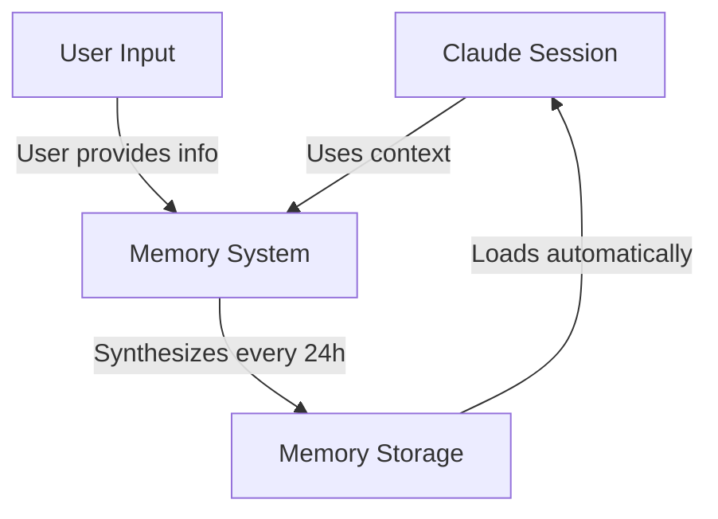
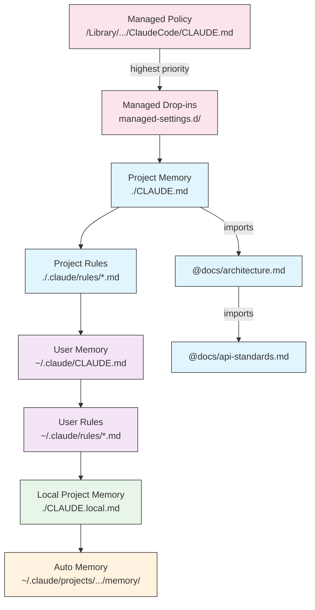
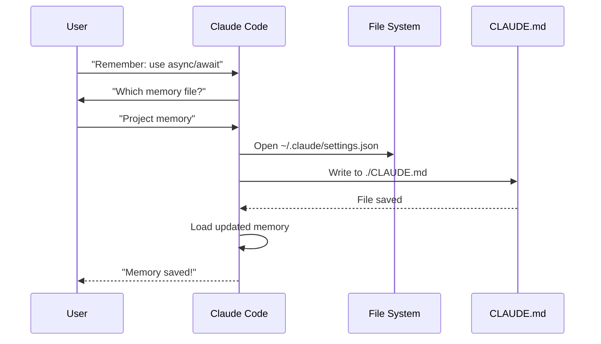
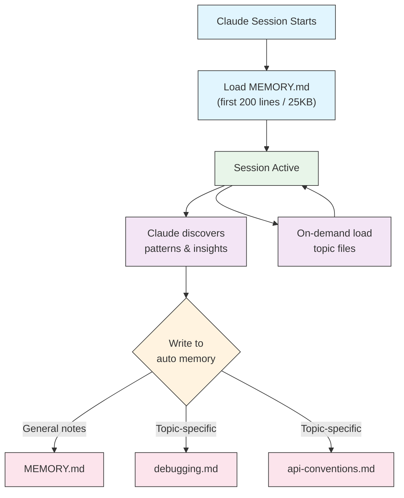
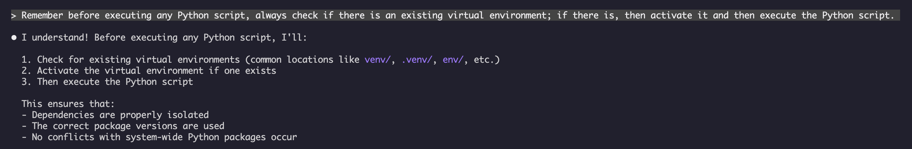

<picture>
  <source media="(prefers-color-scheme: dark)" srcset="../resources/logos/claude-howto-logo-dark.svg">
  
</picture>

# 메모리 가이드

메모리는 Claude가 세션과 대화 전반에 걸쳐 컨텍스트를 유지할 수 있도록 합니다. 이는 claude.ai의 자동 합성, 그리고 Claude Code의 파일 시스템 기반 CLAUDE.md라는 두 가지 형태로 존재합니다.

## 개요

Claude Code의 메모리는 여러 세션과 대화에 걸쳐 지속적인 컨텍스트를 제공합니다. 임시 컨텍스트 창과 달리 메모리 파일을 사용하면 다음을 수행할 수 있습니다.

- 팀 전체에 프로젝트 표준 공유
- 개인 개발 환경 설정 저장
- 디렉터리별 규칙 및 구성 유지
- 외부 문서 가져오기
- 프로젝트의 일부로 메모리를 버전 관리

메모리 시스템은 전역 개인 환경 설정부터 특정 하위 디렉터리에 이르기까지 여러 수준에서 작동하여, Claude가 무엇을 기억하고 해당 지식을 어떻게 적용하는지에 대한 세밀한 제어를 가능하게 합니다.

## 메모리 명령어 빠른 참조

| 명령어 | 목적 | 사용법 | 사용 시점 |
|---------|---------|-------|-------------|
| `/init` | 프로젝트 메모리 초기화 | `/init` | 새 프로젝트 시작, CLAUDE.md 첫 설정 시 |
| `/memory` | 편집기에서 메모리 파일 편집 | `/memory` | 광범위한 업데이트, 재구성, 내용 검토 시 |
| `#` 접두사 | ~~빠른 한 줄 메모리 추가~~ **중단됨** | — | 대신 `/memory`를 사용하거나 대화식으로 요청 |
| `@path/to/file` | 외부 콘텐츠 가져오기 | `@README.md` 또는 `@docs/api.md` | CLAUDE.md에서 기존 문서를 참조할 때 |

## 빠른 시작: 메모리 초기화

### `/init` 명령어

`/init` 명령어는 Claude Code에서 프로젝트 메모리를 설정하는 가장 빠른 방법입니다. 이 명령어는 프로젝트의 기본 문서를 포함하는 CLAUDE.md 파일을 초기화합니다.

**사용법:**

```bash
/init
```

**수행하는 작업:**

- 프로젝트 내에 새 CLAUDE.md 파일을 생성합니다 (일반적으로 `./CLAUDE.md` 또는 `./.claude/CLAUDE.md`에 생성됨)
- 프로젝트 규칙 및 지침을 설정합니다
- 세션 전반에 걸쳐 컨텍스트 지속성을 위한 기반을 마련합니다
- 프로젝트 표준을 문서화하기 위한 템플릿 구조를 제공합니다

**강화된 대화형 모드:** `CLAUDE_CODE_NEW_INIT=1`로 설정하여 프로젝트 설정을 단계별로 안내하는 다단계 대화형 흐름을 활성화할 수 있습니다.

```bash
CLAUDE_CODE_NEW_INIT=1 claude
/init
```

**`/init` 사용 시점:**

- Claude Code로 새 프로젝트를 시작할 때
- 팀 코딩 표준 및 규칙을 설정할 때
- 코드베이스 구조에 대한 문서를 작성할 때
- 협업 개발을 위한 메모리 계층 구조를 설정할 때

**예시 워크플로우:**

```markdown
# In your project directory
/init

# Claude creates CLAUDE.md with structure like:
# Project Configuration
## Project Overview
- Name: Your Project
- Tech Stack: [Your technologies]
- Team Size: [Number of developers]

## Development Standards
- Code style preferences
- Testing requirements
- Git workflow conventions
```

### 빠른 메모리 업데이트

> **참고**: 인라인 메모리를 위한 `#` 단축키는 중단되었습니다. `/memory`를 사용하여 메모리 파일을 직접 편집하거나, Claude에게 대화식으로 무언가를 기억하도록 요청하세요 (예: "우리는 항상 TypeScript strict mode를 사용한다는 것을 기억해줘").

메모리에 정보를 추가하는 권장 방법은 다음과 같습니다.

**옵션 1: `/memory` 명령어 사용**

```bash
/memory
```

시스템 편집기에서 메모리 파일을 열어 직접 편집할 수 있습니다.

**옵션 2: 대화식으로 요청**

```
Remember that we always use TypeScript strict mode in this project.
Please add to memory: prefer async/await over promise chains.
```

Claude는 요청에 따라 적절한 CLAUDE.md 파일을 업데이트합니다.

**과거 참조** (더 이상 작동하지 않음):

이전에는 `#` 접두사 단축키를 사용하여 인라인으로 규칙을 추가할 수 있었습니다.

```markdown
# Always use TypeScript strict mode in this project  ← no longer works
```

이 패턴에 의존했다면 `/memory` 명령어 또는 대화식 요청으로 전환하십시오.

### `/memory` 명령어

`/memory` 명령어는 Claude Code 세션 내에서 CLAUDE.md 메모리 파일을 직접 편집할 수 있도록 합니다. 이 명령어는 시스템 편집기에서 메모리 파일을 열어 포괄적인 편집을 가능하게 합니다.

**사용법:**

```bash
/memory
```

**수행하는 작업:**

- 시스템의 기본 편집기에서 메모리 파일을 엽니다
- 광범위한 추가, 수정 및 재구성을 허용합니다
- 계층 구조 내의 모든 메모리 파일에 직접 접근을 제공합니다
- 세션 전반에 걸쳐 지속적인 컨텍스트를 관리할 수 있습니다

**`/memory` 사용 시점:**

- 기존 메모리 콘텐츠를 검토할 때
- 프로젝트 표준을 광범위하게 업데이트할 때
- 메모리 구조를 재구성할 때
- 상세한 문서나 지침을 추가할 때
- 프로젝트가 발전함에 따라 메모리를 유지 및 업데이트할 때

**비교: `/memory` vs `/init`**

| 측면 | `/memory` | `/init` |
|--------|-----------|---------|
| **목적** | 기존 메모리 파일 편집 | 새 CLAUDE.md 초기화 |
| **사용 시점** | 프로젝트 컨텍스트 업데이트/수정 | 새 프로젝트 시작 |
| **동작** | 편집기를 열어 변경 | 시작 템플릿 생성 |
| **워크플로우** | 지속적인 유지보수 | 일회성 설정 |

**예시 워크플로우:**

```markdown
# Open memory for editing
/memory

# Claude presents options:
# 1. Managed Policy Memory
# 2. Project Memory (./CLAUDE.md)
# 3. User Memory (~/.claude/CLAUDE.md)
# 4. Local Project Memory

# Choose option 2 (Project Memory)
# Your default editor opens with ./CLAUDE.md content

# Make changes, save, and close editor
# Claude automatically reloads the updated memory
```

**메모리 가져오기 사용:**

CLAUDE.md 파일은 외부 콘텐츠를 포함하기 위해 `@path/to/file` 구문을 지원합니다.

```markdown
# Project Documentation
See @README.md for project overview
See @package.json for available npm commands
See @docs/architecture.md for system design

# Import from home directory using absolute path
@~/.claude/my-project-instructions.md
```

**가져오기 기능:**

- 상대 및 절대 경로 모두 지원됩니다 (예: `@docs/api.md` 또는 `@~/.claude/my-project-instructions.md`)
- 최대 깊이 5까지 재귀적 가져오기가 지원됩니다
- 외부 위치에서 처음 가져올 경우 보안을 위해 승인 대화 상자가 나타납니다
- Markdown 코드 스팬이나 코드 블록 내부에서는 가져오기 지시문이 평가되지 않습니다 (따라서 예시에서 문서화하는 것이 안전합니다)
- 기존 문서를 참조하여 중복을 피하는 데 도움이 됩니다
- 참조된 콘텐츠를 Claude의 컨텍스트에 자동으로 포함합니다

## 메모리 아키텍처

Claude Code의 메모리는 다양한 범위가 다양한 목적을 수행하는 계층적 시스템을 따릅니다.



## Claude Code의 메모리 계층 구조

Claude Code는 다단계 계층적 메모리 시스템을 사용합니다. Claude Code가 시작될 때 메모리 파일이 자동으로 로드되며, 상위 수준 파일이 우선 순위를 갖습니다.

**전체 메모리 계층 구조 (우선 순위 순):**

1. **관리 정책** - 조직 전체 지침
   - macOS: `/Library/Application Support/ClaudeCode/CLAUDE.md`
   - Linux/WSL: `/etc/claude-code/CLAUDE.md`
   - Windows: `C:\Program Files\ClaudeCode\CLAUDE.md`

2. **관리 드롭인** - 알파벳 순으로 병합된 정책 파일 (v2.1.83+)
   - 관리 정책 CLAUDE.md와 함께 있는 `managed-settings.d/` 디렉터리
   - 모듈식 정책 관리를 위해 파일이 알파벳 순으로 병합됩니다

3. **프로젝트 메모리** - 팀 공유 컨텍스트 (버전 관리됨)
   - `./.claude/CLAUDE.md` 또는 `./CLAUDE.md` (저장소 루트에)

4. **프로젝트 규칙** - 모듈식, 주제별 프로젝트 지침
   - `./.claude/rules/*.md`

5. **사용자 메모리** - 개인 환경 설정 (모든 프로젝트)
   - `~/.claude/CLAUDE.md`

6. **사용자 수준 규칙** - 개인 규칙 (모든 프로젝트)
   - `~/.claude/rules/*.md`

7. **로컬 프로젝트 메모리** - 개인 프로젝트별 환경 설정
   - `./CLAUDE.local.md`

> **참고**: `CLAUDE.local.md`는 [공식 문서](https://code.claude.com/docs/en/memory)에서 완전히 지원되고 문서화되어 있습니다. 이는 버전 제어에 커밋되지 않는 개인 프로젝트별 환경 설정을 제공합니다. `CLAUDE.local.md`를 `.gitignore`에 추가하세요.

8. **자동 메모리** - Claude의 자동 기록 및 학습 내용
   - `~/.claude/projects/<project>/memory/`

**메모리 검색 동작:**

Claude는 메모리 파일을 이 순서로 검색하며, 앞선 위치가 우선 순위를 갖습니다.



## `claudeMdExcludes`를 사용하여 CLAUDE.md 파일 제외하기

대규모 모노레포에서 일부 CLAUDE.md 파일은 현재 작업과 관련이 없을 수 있습니다. `claudeMdExcludes` 설정은 특정 CLAUDE.md 파일을 컨텍스트에 로드하지 않도록 건너뛸 수 있게 합니다.

```jsonc
// In ~/.claude/settings.json or .claude/settings.json
{
  "claudeMdExcludes": [
    "packages/legacy-app/CLAUDE.md",
    "vendors/**/CLAUDE.md"
  ]
}
```

패턴은 프로젝트 루트를 기준으로 하는 경로와 일치합니다. 이는 특히 다음 경우에 유용합니다.

- 많은 하위 프로젝트가 있는 모노레포에서 일부만 관련 있는 경우
- 공급업체 또는 타사 CLAUDE.md 파일이 포함된 저장소
- 오래되었거나 관련 없는 지침을 제외하여 Claude의 컨텍스트 창에서 노이즈 감소

## 설정 파일 계층 구조

Claude Code 설정( `autoMemoryDirectory`, `claudeMdExcludes` 및 기타 구성 포함)은 5단계 계층 구조에서 해결되며, 상위 수준이 우선 순위를 갖습니다.

| 수준 | 위치 | 범위 |
|-------|----------|-------|
| 1 (최고) | 관리 정책 (시스템 수준) | 조직 전체 적용 |
| 2 | `managed-settings.d/` (v2.1.83+) | 모듈식 정책 드롭인, 알파벳 순으로 병합됨 |
| 3 | `.claude/settings.local.json` | 로컬 재정의 (git-ignored) |
| 4 | `.claude/settings.json` | 프로젝트 수준 (git에 커밋됨) |
| 5 (최저) | `~/.claude/settings.json` | 사용자 환경 설정 |

**플랫폼별 구성 (v2.1.51+):**

설정은 다음을 통해서도 구성할 수 있습니다.
- **macOS**: 속성 목록(plist) 파일
- **Windows**: Windows 레지스트리

이러한 플랫폼 네이티브 메커니즘은 JSON 설정 파일과 함께 읽히며 동일한 우선 순위 규칙을 따릅니다.

> **참고 (v2.1.119)**: `/config` 변경 사항은 이제 `~/.claude/settings.json`에 유지됩니다. `/config`를 통해 작성된 값은 위에서 설명한 일반적인 정책/로컬/프로젝트 우선 순위 체인에 참여하며, 더 이상 세션 전용이 아닙니다. 대화형 편집에는 `/config`를 사용하고, 스크립트화되거나 관리되는 구성에는 `settings.json` 파일을 직접 편집하세요.

### 보존 및 정리 설정

| 설정 | 유형 | 기본값 | 설명 |
|---------|------|---------|-------------|
| `cleanupPeriodDays` | 정수 (일) | 30 | 디스크 아티팩트 보존 기간. **v2.1.117부터**, 체크포인트 (`~/.claude/checkpoints/`), 작업 (`~/.claude/tasks/`), 셸 스냅샷 (`~/.claude/shell-snapshots/`), 백업 (`~/.claude/backups/`) 등 4가지 모두에 적용됩니다. 기간보다 오래된 파일은 시작 시 정리됩니다. |

```jsonc
// ~/.claude/settings.json
{
  "cleanupPeriodDays": 14
}
```

### 속성, 음성 및 PR URL 설정

| 설정 | 유형 | 설명 |
|---------|------|-------------|
| `attribution.commit` | 부울 | Claude가 생성한 커밋에 `Co-Authored-By: Claude` 트레일러를 추가합니다. 더 이상 사용되지 않는 `includeCoAuthoredBy` 플래그를 대체합니다. |
| `attribution.pr` | 부울 | pull request 설명에 Claude 속성을 추가합니다. PR에 대한 더 이상 사용되지 않는 `includeCoAuthoredBy` 플래그를 대체합니다. |
| `attribution.sessionUrl` | 부울 | 웹 및 원격 제어 세션에서 생성된 커밋 및 PR에서 claude.ai 세션 링크를 생략합니다 (v2.1.183+). |
| `voice.enabled` | 부울 | 푸시 투 토크 음성 받아쓰기 (`/voice`)를 활성화합니다. 더 이상 사용되지 않는 `voiceEnabled` 플래그를 대체합니다. |
| `prUrlTemplate` | 문자열 | **v2.1.119에 새로 추가됨.** 푸터 PR 배지를 위한 사용자 지정 URL 템플릿; GitLab, Bitbucket 또는 내부 코드 검토 플랫폼에 유용합니다. `{{owner}}`, `{{repo}}`, `{{number}}` 플레이스홀더를 지원합니다. |

```jsonc
// ~/.claude/settings.json
{
  "attribution": {
    "commit": false,
    "pr": true
  },
  "voice": {
    "enabled": true
  },
  "prUrlTemplate": "https://gitlab.internal/{{owner}}/{{repo}}/-/merge_requests/{{number}}"
}
```

#### 더 이상 사용되지 않는 설정 이름

다음 레거시 설정 키는 여전히 작동하지만 더 이상 사용되지 않습니다. 위 대체 키를 선호하세요.

| 사용 중단된 키 | 대체 키 | 참고 |
|----------------|-------------|-------|
| `includeCoAuthoredBy` | `attribution.commit` / `attribution.pr` | 기존의 단일 플래그가 별도의 커밋 및 PR 스위치로 분할되었습니다. 이전 설치 사용자는 레거시 키를 유지할 수 있지만, 새 프로젝트는 중첩된 형태를 사용해야 합니다. |
| `voiceEnabled` | `voice.enabled` | 향후 음성 관련 옵션과 함께 `voice` 네임스페이스 아래에 그룹화되었습니다. |

## 모듈식 규칙 시스템

`.claude/rules/` 디렉터리 구조를 사용하여 체계적이고 경로별 규칙을 만드세요. 규칙은 프로젝트 수준과 사용자 수준 모두에서 정의할 수 있습니다.

```
your-project/
├── .claude/
│   ├── CLAUDE.md
│   └── rules/
│       ├── code-style.md
│       ├── testing.md
│       ├── security.md
│       └── api/                  # Subdirectories supported
│           ├── conventions.md
│           └── validation.md

~/.claude/
├── CLAUDE.md
└── rules/                        # User-level rules (all projects)
    ├── personal-style.md
    └── preferred-patterns.md
```

`rules/` 디렉터리 내에서 하위 디렉터리를 포함하여 규칙이 재귀적으로 검색됩니다. `~/.claude/rules/`의 사용자 수준 규칙은 프로젝트 수준 규칙보다 먼저 로드되어, 프로젝트가 재정의할 수 있는 개인 기본값을 허용합니다.

### YAML Frontmatter를 사용한 경로별 규칙

특정 파일 경로에만 적용되는 규칙을 정의합니다.

```markdown
---
paths: src/api/**/*.ts
---

# API Development Rules

- All API endpoints must include input validation
- Use Zod for schema validation
- Document all parameters and response types
- Include error handling for all operations
```

**Glob 패턴 예시:**

- `**/*.ts` - 모든 TypeScript 파일
- `src/**/*` - src/ 아래의 모든 파일
- `src/**/*.{ts,tsx}` - 여러 확장자
- `{src,lib}/**/*.ts, tests/**/*.test.ts` - 여러 패턴

### 하위 디렉터리 및 심볼릭 링크

`.claude/rules/`의 규칙은 두 가지 조직 기능을 지원합니다.

- **하위 디렉터리**: 규칙은 재귀적으로 검색되므로 주제 기반 폴더(예: `rules/api/`, `rules/testing/`, `rules/security/`)로 정리할 수 있습니다.
- **심볼릭 링크**: 여러 프로젝트 간에 규칙을 공유하기 위해 심볼릭 링크가 지원됩니다. 예를 들어, 중앙 위치에서 공유 규칙 파일을 각 프로젝트의 `.claude/rules/` 디렉터리에 심볼릭 링크할 수 있습니다.

## 메모리 위치 표

| 위치 | 범위 | 우선 순위 | 공유 여부 | 접근 방식 | 가장 적합한 경우 |
|----------|-------|----------|--------|--------|----------|
| `/Library/Application Support/ClaudeCode/CLAUDE.md` (macOS) | 관리 정책 | 1 (최고) | 조직 | 시스템 | 회사 전체 정책 |
| `/etc/claude-code/CLAUDE.md` (Linux/WSL) | 관리 정책 | 1 (최고) | 조직 | 시스템 | 조직 표준 |
| `C:\Program Files\ClaudeCode\CLAUDE.md` (Windows) | 관리 정책 | 1 (최고) | 조직 | 시스템 | 기업 지침 |
| `managed-settings.d/*.md` (정책과 함께) | 관리 드롭인 | 1.5 | 조직 | 시스템 | 모듈식 정책 파일 (v2.1.83+) |
| `./CLAUDE.md` 또는 `./.claude/CLAUDE.md` | 프로젝트 메모리 | 2 | 팀 | Git | 팀 표준, 공유 아키텍처 |
| `./.claude/rules/*.md` | 프로젝트 규칙 | 3 | 팀 | Git | 경로별, 모듈식 규칙 |
| `~/.claude/CLAUDE.md` | 사용자 메모리 | 4 | 개인 | 파일 시스템 | 개인 환경 설정 (모든 프로젝트) |
| `~/.claude/rules/*.md` | 사용자 규칙 | 5 | 개인 | 파일 시스템 | 개인 규칙 (모든 프로젝트) |
| `./CLAUDE.local.md` | 로컬 프로젝트 | 6 | 개인 | Git (무시됨) | 개인 프로젝트별 환경 설정 |
| `~/.claude/projects/<project>/memory/` | 자동 메모리 | 7 (최저) | 개인 | 파일 시스템 | Claude의 자동 기록 및 학습 내용 |

## 메모리 업데이트 라이프사이클

Claude Code 세션에서 메모리 업데이트가 어떻게 흐르는지 보여줍니다.



## 자동 메모리

자동 메모리는 Claude가 프로젝트와 작업하면서 학습 내용, 패턴 및 통찰력을 자동으로 기록하는 지속적인 디렉터리입니다. 사용자가 수동으로 작성하고 유지 관리하는 CLAUDE.md 파일과 달리, 자동 메모리는 세션 중에 Claude 자체에 의해 작성됩니다.

### 자동 메모리 작동 방식

- **위치**: `~/.claude/projects/<project>/memory/`
- **시작점**: `MEMORY.md`는 자동 메모리 디렉터리의 주요 파일 역할을 합니다
- **주제 파일**: 특정 주제에 대한 선택적 추가 파일 (예: `debugging.md`, `api-conventions.md`)
- **로드 동작**: 세션 시작 시 `MEMORY.md`의 첫 200줄 (또는 첫 25KB 중 먼저 도달하는 것)이 컨텍스트에 로드됩니다. 주제 파일은 시작 시가 아니라 필요할 때 로드됩니다.
- **읽기/쓰기**: Claude는 패턴과 프로젝트별 지식을 발견함에 따라 세션 중에 메모리 파일을 읽고 씁니다

### 자동 메모리 아키텍처



### 자동 메모리 디렉터리 구조

```
~/.claude/projects/<project>/memory/
├── MEMORY.md              # Entrypoint (first 200 lines / 25KB loaded at startup)
├── debugging.md           # Topic file (loaded on demand)
├── api-conventions.md     # Topic file (loaded on demand)
└── testing-patterns.md    # Topic file (loaded on demand)
```

### 버전 요구 사항

자동 메모리에는 **Claude Code v2.1.59 이상**이 필요합니다. 이전 버전을 사용 중이라면 먼저 업그레이드하세요.

```bash
npm install -g @anthropic-ai/claude-code@latest
```

### 사용자 지정 자동 메모리 디렉터리

기본적으로 자동 메모리는 `~/.claude/projects/<project>/memory/`에 저장됩니다. `autoMemoryDirectory` 설정( **v2.1.74부터 사용 가능**)을 사용하여 이 위치를 변경할 수 있습니다.

```jsonc
// In ~/.claude/settings.json or .claude/settings.local.json (user/local settings only)
{
  "autoMemoryDirectory": "/path/to/custom/memory/directory"
}
```

> **참고**: `autoMemoryDirectory`는 프로젝트 또는 관리 정책 설정이 아닌 사용자 수준(`~/.claude/settings.json`) 또는 로컬 설정(`.claude/settings.local.json`)에서만 설정할 수 있습니다.

이는 다음을 원할 때 유용합니다.

- 자동 메모리를 공유 또는 동기화된 위치에 저장
- 자동 메모리를 기본 Claude 구성 디렉터리에서 분리
- 기본 계층 구조 외부의 프로젝트별 경로 사용

### 워크트리 및 저장소 공유

동일한 Git 저장소 내의 모든 워크트리 및 하위 디렉터리는 단일 자동 메모리 디렉터리를 공유합니다. 이는 워크트리 간을 전환하거나 동일한 저장소의 다른 하위 디렉터리에서 작업할 때 동일한 메모리 파일을 읽고 쓴다는 것을 의미합니다.

### 서브에이전트 메모리

서브에이전트(Task 또는 병렬 실행과 같은 도구를 통해 생성됨)는 자체 메모리 컨텍스트를 가질 수 있습니다. 서브에이전트 정의에서 로드할 메모리 범위를 지정하려면 `memory` 프론트매터 필드를 사용하세요.

```yaml
memory: user      # Load user-level memory only
memory: project   # Load project-level memory only
memory: local     # Load local memory only
```

이를 통해 서브에이전트는 전체 메모리 계층 구조를 상속하는 대신 집중된 컨텍스트로 작동할 수 있습니다.

> **참고**: 서브에이전트도 자체 자동 메모리를 유지할 수 있습니다. 자세한 내용은 [공식 서브에이전트 메모리 문서](https://code.claude.com/docs/en/sub-agents#enable-persistent-memory)를 참조하세요.

### 자동 메모리 제어

자동 메모리는 `CLAUDE_CODE_DISABLE_AUTO_MEMORY` 환경 변수를 통해 제어할 수 있습니다.

| 값 | 동작 |
|-------|----------|
| `0` | 자동 메모리 **강제 활성화** |
| `1` | 자동 메모리 **강제 비활성화** |
| *(설정되지 않음)* | 기본 동작 (자동 메모리 활성화됨) |

```bash
# Disable auto memory for a session
CLAUDE_CODE_DISABLE_AUTO_MEMORY=1 claude

# Force auto memory on explicitly
CLAUDE_CODE_DISABLE_AUTO_MEMORY=0 claude
```

## `--add-dir`을 사용한 추가 디렉터리

`--add-dir` 플래그는 Claude Code가 현재 작업 디렉터리 외의 추가 디렉터리에서 CLAUDE.md 파일을 로드할 수 있도록 합니다. 이는 다른 디렉터리의 컨텍스트가 관련 있는 모노레포 또는 다중 프로젝트 설정에 유용합니다.

이 기능을 활성화하려면 환경 변수를 설정합니다.

```bash
CLAUDE_CODE_ADDITIONAL_DIRECTORIES_CLAUDE_MD=1
```

그런 다음 다음 플래그로 Claude Code를 시작합니다.

```bash
claude --add-dir /path/to/other/project
```

Claude는 현재 작업 디렉터리의 메모리 파일과 함께 지정된 추가 디렉터리에서 CLAUDE.md를 로드합니다.

## 실제 예시

### 예시 1: 프로젝트 메모리 구조

**파일:** `./CLAUDE.md`

```markdown
# Project Configuration

## Project Overview
- **Name**: E-commerce Platform
- **Tech Stack**: Node.js, PostgreSQL, React 18, Docker
- **Team Size**: 5 developers
- **Deadline**: Q4 2025

## Architecture
@docs/architecture.md
@docs/api-standards.md
@docs/database-schema.md

## Development Standards

### Code Style
- Use Prettier for formatting
- Use ESLint with airbnb config
- Maximum line length: 100 characters
- Use 2-space indentation

### Naming Conventions
- **Files**: kebab-case (user-controller.js)
- **Classes**: PascalCase (UserService)
- **Functions/Variables**: camelCase (getUserById)
- **Constants**: UPPER_SNAKE_CASE (API_BASE_URL)
- **Database Tables**: snake_case (user_accounts)

### Git Workflow
- Branch names: `feature/description` or `fix/description`
- Commit messages: Follow conventional commits
- PR required before merge
- All CI/CD checks must pass
- Minimum 1 approval required

### Testing Requirements
- Minimum 80% code coverage
- All critical paths must have tests
- Use Jest for unit tests
- Use Cypress for E2E tests
- Test filenames: `*.test.ts` or `*.spec.ts`

### API Standards
- RESTful endpoints only
- JSON request/response
- Use HTTP status codes correctly
- Version API endpoints: `/api/v1/`
- Document all endpoints with examples

### Database
- Use migrations for schema changes
- Never hardcode credentials
- Use connection pooling
- Enable query logging in development
- Regular backups required

### Deployment
- Docker-based deployment
- Kubernetes orchestration
- Blue-green deployment strategy
- Automatic rollback on failure
- Database migrations run before deploy

## Common Commands

| Command | Purpose |
|---------|---------|
| `npm run dev` | Start development server |
| `npm test` | Run test suite |
| `npm run lint` | Check code style |
| `npm run build` | Build for production |
| `npm run migrate` | Run database migrations |

## Team Contacts
- Tech Lead: Sarah Chen (@sarah.chen)
- Product Manager: Mike Johnson (@mike.j)
- DevOps: Alex Kim (@alex.k)

## Known Issues & Workarounds
- PostgreSQL connection pooling limited to 20 during peak hours
- Workaround: Implement query queuing
- Safari 14 compatibility issues with async generators
- Workaround: Use Babel transpiler

## Related Projects
- Analytics Dashboard: `/projects/analytics`
- Mobile App: `/projects/mobile`
- Admin Panel: `/projects/admin`
```

### 예시 2: 디렉터리별 메모리

**파일:** `./src/api/CLAUDE.md`

````markdown
# API 모듈 표준

이 파일은 /src/api/ 내의 모든 것에 대해 루트 CLAUDE.md를 재정의합니다.

## API-Specific Standards

### Request Validation
- Use Zod for schema validation
- Always validate input
- Return 400 with validation errors
- Include field-level error details

### Authentication
- All endpoints require JWT token
- Token in Authorization header
- Token expires after 24 hours
- Implement refresh token mechanism

### Response Format

All responses must follow this structure:

```json
{
  "success": true,
  "data": { /* actual data */ },
  "timestamp": "2025-11-06T10:30:00Z",
  "version": "1.0"
}
```

Error responses:
```json
{
  "success": false,
  "error": {
    "code": "VALIDATION_ERROR",
    "message": "User message",
    "details": { /* field errors */ }
  },
  "timestamp": "2025-11-06T10:30:00Z"
}
```

### Pagination
- Use cursor-based pagination (not offset)
- Include `hasMore` boolean
- Limit max page size to 100
- Default page size: 20

### Rate Limiting
- 1000 requests per hour for authenticated users
- 100 requests per hour for public endpoints
- Return 429 when exceeded
- Include retry-after header

### Caching
- Use Redis for session caching
- Cache duration: 5 minutes default
- Invalidate on write operations
- Tag cache keys with resource type
````

### 예시 3: 개인 메모리

**파일:** `~/.claude/CLAUDE.md`

```markdown
# 나의 개발 환경 설정

## 나에 대해
- **경험 수준**: 8년 풀스택 개발
- **선호 언어**: TypeScript, Python
- **커뮤니케이션 스타일**: 예시와 함께 직접적
- **학습 스타일**: 코드와 함께 시각적 다이어그램

## 코드 환경 설정

### 오류 처리
명시적인 try-catch 블록과 의미 있는 오류 메시지를 사용한 오류 처리를 선호합니다.
일반적인 오류를 피합니다. 디버깅을 위해 항상 오류를 기록합니다.

### 주석
무엇이 아니라 WHY에 대해 주석을 사용합니다. 코드는 자체 문서화되어야 합니다.
주석은 비즈니스 로직 또는 명확하지 않은 결정을 설명해야 합니다.

### 테스트
TDD(테스트 주도 개발)를 선호합니다.
테스트를 먼저 작성하고 구현을 나중에 합니다.
구현 세부 사항이 아닌 동작에 초점을 맞춥니다.

### 아키텍처
모듈식, 느슨하게 결합된 설계를 선호합니다.
테스트 가능성을 위해 의존성 주입을 사용합니다.
관심사를 분리합니다 (컨트롤러, 서비스, 저장소).

## 디버깅 환경 설정
- `[DEBUG]` 접두사와 함께 console.log 사용
- 컨텍스트 포함: 함수 이름, 관련 변수
- 가능한 경우 스택 트레이스 사용
- 로그에 항상 타임스탬프 포함

## 커뮤니케이션
- 다이어그램으로 복잡한 개념 설명
- 이론 설명 전에 구체적인 예시 보여주기
- 이전/이후 코드 스니펫 포함
- 마지막에 주요 요약 제공

## 프로젝트 구성
내 프로젝트는 다음과 같이 구성합니다.

   project/
   ├── src/
   │   ├── api/
   │   ├── services/
   │   ├── models/
   │   └── utils/
   ├── tests/
   ├── docs/
   └── docker/

## 도구
- **IDE**: vim 키 바인딩이 있는 VS Code
- **터미널**: Oh-My-Zsh가 있는 Zsh
- **형식**: Prettier (100자 줄 길이)
- **린터**: airbnb config가 있는 ESLint
- **테스트 프레임워크**: React Testing Library가 있는 Jest
```

_나의 테스트_
Claude에게 새 규칙을 저장하라고 요청


어떤 `Claude.md` 파일도 없었기 때문에 Claude는 규칙을 저장하지 않았습니다. 그런 다음 Claude에게 위치를 확인해 달라고 요청했습니다.


### 예시 4: 세션 중 메모리 업데이트

활성 Claude Code 세션 중에 메모리에 새 규칙을 추가할 수 있습니다. 이를 수행하는 두 가지 방법이 있습니다.

#### 방법 1: 직접 요청

```markdown
User: Remember that I prefer using React hooks instead of class components
     for all new components.

Claude: I'm adding that to your memory. Which memory file should this go in?
        1. Project memory (./CLAUDE.md)
        2. Personal memory (~/.claude/CLAUDE.md)

User: Project memory

Claude: ✅ Memory saved!

Added to ./CLAUDE.md:
---

### Component Development
- Use functional components with React Hooks
- Prefer hooks over class components
- Custom hooks for reusable logic
- Use useCallback for event handlers
- Use useMemo for expensive computations
```

#### 방법 2: "# new rule into memory" 패턴 사용

"# new rule into memory" 명시적 패턴을 사용하여 메모리 업데이트를 트리거할 수도 있습니다.

```markdown
User: # new rule into memory
      Always validate user input with Zod schemas before processing.

Claude: I'm saving this rule to memory. Which memory file should I use?
        1. Project memory (./CLAUDE.md)
        2. Personal memory (~/.claude/CLAUDE.md)

User: Project memory

Claude: ✅ Memory saved!

Added to ./CLAUDE.md:
---

### Input Validation
- Always validate user input with Zod schemas before processing
- Define schemas at the top of each API handler file
- Return 400 status with validation errors
```

#### 메모리 추가를 위한 팁

- 규칙을 구체적이고 실행 가능하게 만드세요
- 관련 규칙을 섹션 헤더 아래에 함께 그룹화하세요
- 콘텐츠를 중복하지 말고 기존 섹션을 업데이트하세요
- 적절한 메모리 범위(프로젝트 vs. 개인)를 선택하세요

## 메모리 기능 비교

| 기능 | Claude 웹/데스크톱 | Claude Code (CLAUDE.md) |
|---------|-------------------|------------------------|
| 자동 합성 | ✅ 24시간마다 | ✅ 자동 메모리 |
| 교차 프로젝트 | ✅ 공유 프로젝트 | ❌ 프로젝트별 |
| 팀 접근 | ✅ 공유 프로젝트 | ✅ Git 추적 |
| 검색 가능 | ✅ 내장 | ✅ `/memory`를 통해 |
| 편집 가능 | ✅ 채팅 내 | ✅ 직접 파일 편집 |
| 가져오기/내보내기 | ✅ 예 | ✅ 복사/붙여넣기 |
| 영구적 | ✅ 24시간 이상 | ✅ 무기한 |

### Claude 웹/데스크톱의 메모리

#### 메모리 합성 타임라인


**메모리 요약 예시:**

```markdown
## Claude's Memory of User

### Professional Background
- Senior full-stack developer with 8 years experience
- Focus on TypeScript/Node.js backends and React frontends
- Active open source contributor
- Interested in AI and machine learning

### Project Context
- Currently building e-commerce platform
- Tech stack: Node.js, PostgreSQL, React 18, Docker
- Working with team of 5 developers
- Using CI/CD and blue-green deployments

### Communication Preferences
- Prefers direct, concise explanations
- Likes visual diagrams and examples
- Appreciates code snippets
- Explains business logic in comments

### Current Goals
- Improve API performance
- Increase test coverage to 90%
- Implement caching strategy
- Document architecture
```

## 모범 사례

### 해야 할 일 - 포함할 내용

- **구체적이고 상세하게**: 모호한 지침 대신 명확하고 상세한 지침을 사용하세요.
  - ✅ 좋음: "모든 JavaScript 파일에 2칸 들여쓰기를 사용합니다."
  - ❌ 피해야 할 것: "모범 사례를 따릅니다."

- **체계적으로 유지**: 명확한 마크다운 섹션과 제목으로 메모리 파일을 구성하세요.

- **적절한 계층 수준 사용**:
  - **관리 정책**: 회사 전체 정책, 보안 표준, 규정 준수 요구 사항
  - **프로젝트 메모리**: 팀 표준, 아키텍처, 코딩 규칙 (git에 커밋)
  - **사용자 메모리**: 개인 환경 설정, 커뮤니케이션 스타일, 도구 선택
  - **디렉터리 메모리**: 모듈별 규칙 및 재정의

- **가져오기 활용**: `@path/to/file` 구문을 사용하여 기존 문서를 참조하세요.
  - 최대 5단계의 재귀적 중첩을 지원합니다.
  - 메모리 파일 간의 중복을 피합니다.
  - 예: `See @README.md for project overview`

- **자주 사용하는 명령어 문서화**: 시간을 절약하기 위해 반복적으로 사용하는 명령어를 포함하세요.

- **프로젝트 메모리 버전 관리**: 팀의 이점을 위해 프로젝트 수준 CLAUDE.md 파일을 git에 커밋하세요.

- **정기적으로 검토**: 프로젝트가 발전하고 요구 사항이 변경됨에 따라 메모리를 정기적으로 업데이트하세요.

- **구체적인 예시 제공**: 코드 스니펫 및 특정 시나리오를 포함하세요.

### 하지 말아야 할 일 - 피해야 할 내용

- **비밀 저장 금지**: API 키, 비밀번호, 토큰 또는 자격 증명을 절대 포함하지 마세요.

- **민감한 데이터 포함 금지**: 개인 식별 정보(PII), 개인 정보 또는 독점 기밀을 포함하지 마세요.

- **콘텐츠 중복 금지**: 대신 가져오기 (`@path`)를 사용하여 기존 문서를 참조하세요.

- **모호한 표현 금지**: "모범 사례를 따릅니다" 또는 "좋은 코드를 작성합니다"와 같은 일반적인 진술을 피하세요.

- **너무 길게 만들지 마세요**: 개별 메모리 파일은 집중적이고 500줄 미만으로 유지하세요.

- **과도한 정리 금지**: 계층 구조를 전략적으로 사용하고 과도한 하위 디렉터리 재정의를 만들지 마세요.

- **업데이트를 잊지 마세요**: 오래된 메모리는 혼란과 시대에 뒤떨어진 관행을 초래할 수 있습니다.

- **중첩 제한 초과 금지**: 메모리 가져오기는 최대 5단계의 중첩을 지원합니다.

### 메모리 관리 팁

**올바른 메모리 수준 선택:**

| 사용 사례 | 메모리 수준 | 이유 |
|----------|-------------|-----------|
| 회사 보안 정책 | 관리 정책 | 조직 전체의 모든 프로젝트에 적용됨 |
| 팀 코드 스타일 가이드 | 프로젝트 | Git을 통해 팀과 공유됨 |
| 선호하는 편집기 단축키 | 사용자 | 개인 환경 설정, 공유되지 않음 |
| API 모듈 표준 | 디렉터리 | 해당 모듈에만 해당 |

**빠른 업데이트 워크플로우:**

1. 단일 규칙의 경우: `/memory`를 사용하여 편집기를 열거나 대화식으로 요청하세요.
2. 여러 변경 사항의 경우: `/memory`를 사용하여 편집기를 열세요.
3. 초기 설정의 경우: `/init`을 사용하여 템플릿을 만드세요.

**가져오기 모범 사례:**

```markdown
# Good: Reference existing docs
@README.md
@docs/architecture.md
@package.json

# Avoid: Copying content that exists elsewhere
# Instead of copying README content into CLAUDE.md, just import it
```

## 설치 지침

### 프로젝트 메모리 설정

#### 방법 1: `/init` 명령어 사용 (권장)

프로젝트 메모리를 설정하는 가장 빠른 방법입니다.

1. **프로젝트 디렉터리로 이동:**
   ```bash
   cd /path/to/your/project
   ```

2. **Claude Code에서 init 명령 실행:**
   ```bash
   /init
   ```

3. **Claude는 템플릿 구조로 CLAUDE.md를 생성하고 채웁니다.**

4. **생성된 파일을 프로젝트 요구 사항에 맞게 사용자 지정합니다.**

5. **git에 커밋:**
   ```bash
   git add CLAUDE.md
   git commit -m "Initialize project memory with /init"
   ```

#### 방법 2: 수동 생성

수동 설정을 선호하는 경우:

1. **프로젝트 루트에 CLAUDE.md 생성:**
   ```bash
   cd /path/to/your/project
   touch CLAUDE.md
   ```

2. **프로젝트 표준 추가:**
   ```bash
   cat > CLAUDE.md << 'EOF'
   # Project Configuration

   ## Project Overview
   - **Name**: Your Project Name
   - **Tech Stack**: List your technologies
   - **Team Size**: Number of developers

   ## Development Standards
   - Your coding standards
   - Naming conventions
   - Testing requirements
   EOF
   ```

3. **git에 커밋:**
   ```bash
   git add CLAUDE.md
   git commit -m "Add project memory configuration"
   ```

#### 방법 3: `#`를 사용한 빠른 업데이트

CLAUDE.md가 존재하면 대화 중에 빠르게 규칙을 추가할 수 있습니다.

```markdown
# Use semantic versioning for all releases

# Always run tests before committing

# Prefer composition over inheritance
```

Claude는 어떤 메모리 파일을 업데이트할지 선택하라는 메시지를 표시합니다.

### 개인 메모리 설정

1. **`~/.claude` 디렉터리 생성:**
   ```bash
   mkdir -p ~/.claude
   ```

2. **개인 CLAUDE.md 생성:**
   ```bash
   touch ~/.claude/CLAUDE.md
   ```

3. **환경 설정 추가:**
   ```bash
   cat > ~/.claude/CLAUDE.md << 'EOF'
   # My Development Preferences

   ## About Me
   - Experience Level: [Your level]
   - Preferred Languages: [Your languages]
   - Communication Style: [Your style]

   ## Code Preferences
   - [Your preferences]
   EOF
   ```

### 디렉터리별 메모리 설정

1. **특정 디렉터리에 대한 메모리 생성:**
   ```bash
   mkdir -p /path/to/directory/.claude
   touch /path/to/directory/CLAUDE.md
   ```

2. **디렉터리별 규칙 추가:**
   ```bash
   cat > /path/to/directory/CLAUDE.md << 'EOF'
   # [Directory Name] Standards

   This file overrides root CLAUDE.md for this directory.

   ## [Specific Standards]
   EOF
   ```

3. **버전 제어에 커밋:**
   ```bash
   git add /path/to/directory/CLAUDE.md
   git commit -m "Add [directory] memory configuration"
   ```

### 설정 확인

1. **메모리 위치 확인:**
   ```bash
   # Project root memory
   ls -la ./CLAUDE.md

   # Personal memory
   ls -la ~/.claude/CLAUDE.md
   ```

2. **Claude Code는 세션 시작 시 이러한 파일을 자동으로 로드합니다.**

3. **프로젝트에서 새 세션을 시작하여 Claude Code로 테스트합니다.**

## 공식 문서

가장 최신 정보는 Claude Code 공식 문서를 참조하세요.

- **[메모리 문서](https://code.claude.com/docs/en/memory)** - 전체 메모리 시스템 참조
- **[슬래시 명령어 참조](https://code.claude.com/docs/en/interactive-mode)** - `/init` 및 `/memory`를 포함한 모든 내장 명령어
- **[CLI 참조](https://code.claude.com/docs/en/cli-reference)** - 명령줄 인터페이스 문서

### 공식 문서의 주요 기술 세부 정보

**메모리 로딩:**

- 모든 메모리 파일은 Claude Code가 시작될 때 자동으로 로드됩니다.
- Claude는 현재 작업 디렉터리에서 위로 올라가 CLAUDE.md 파일을 검색합니다.
- 하위 트리 파일은 해당 디렉터리에 접근할 때 문맥적으로 검색되고 로드됩니다.

**가져오기 구문:**

- `@path/to/file`을 사용하여 외부 콘텐츠를 포함합니다 (예: `@~/.claude/my-project-instructions.md`).
- 상대 및 절대 경로 모두 지원됩니다.
- 최대 5단계의 재귀적 가져오기가 지원됩니다.
- 외부에서 처음 가져올 경우 승인 대화 상자가 나타납니다.
- Markdown 코드 스팬이나 코드 블록 내부에서는 평가되지 않습니다.
- 참조된 콘텐츠를 Claude의 컨텍스트에 자동으로 포함합니다.

**메모리 계층 우선 순위:**

1. 관리 정책 (가장 높은 우선 순위)
2. 관리 드롭인 (`managed-settings.d/`, v2.1.83+)
3. 프로젝트 메모리
4. 프로젝트 규칙 (`.claude/rules/`)
5. 사용자 메모리
6. 사용자 수준 규칙 (`~/.claude/rules/`)
7. 로컬 프로젝트 메모리
8. 자동 메모리 (가장 낮은 우선 순위)

## 관련 개념 링크

### 통합 지점
- [MCP 프로토콜](../05-mcp/) - 메모리와 함께 실시간 데이터 접근
- [슬래시 명령어](../01-slash-commands/) - 세션별 단축키
- [스킬](../03-skills/) - 메모리 컨텍스트를 사용한 자동화된 워크플로우

### 관련 Claude 기능
- [Claude 웹 메모리](https://claude.ai) - 자동 합성
- [공식 메모리 문서](https://code.claude.com/docs/en/memory) - Anthropic 문서

---
**마지막 업데이트**: 2026년 6월 24일
**Claude Code 버전**: 2.1.187
**출처**:
- https://code.claude.com/docs/en/memory
- https://code.claude.com/docs/en/settings
- https://github.com/anthropics/claude-code/blob/main/CHANGELOG.md
- https://docs.anthropic.com/en/docs/claude-code/settings
- https://code.claude.com/docs/en/cli-reference
- https://github.com/anthropics/claude-code/releases/tag/v2.1.117
- https://github.com/anthropics/claude-code/releases/tag/v2.1.144
- https://github.com/anthropics/claude-code/releases/tag/v2.1.145
**호환 모델**: Claude Sonnet 4.6, Claude Opus 4.8, Claude Haiku 4.5
