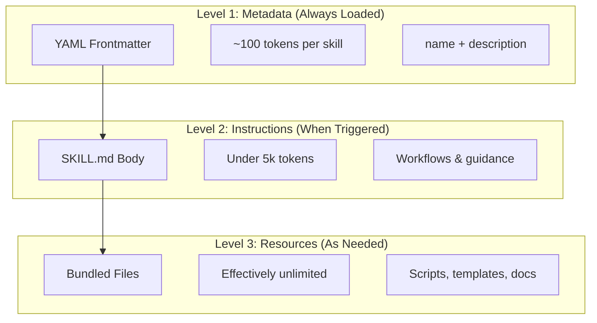
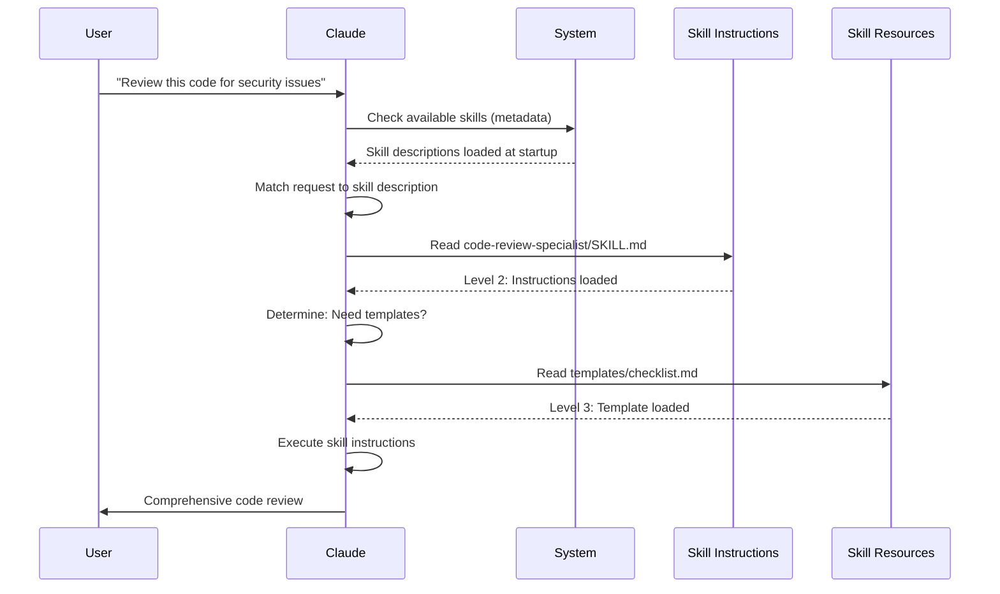

<picture>
  <source media="(prefers-color-scheme: dark)" srcset="../resources/logos/claude-howto-logo-dark.svg">
  
</picture>

# 에이전트 스킬 가이드

에이전트 스킬은 Claude의 기능을 확장하는 재사용 가능한 파일 시스템 기반의 기능입니다. 이 기능은 도메인별 전문 지식, 워크플로 및 모범 사례를 Claude가 관련성이 있을 때 자동으로 사용하는 발견 가능한 구성 요소로 패키징합니다.

## 개요

**에이전트 스킬**은 범용 에이전트를 전문가로 변화시키는 모듈식 기능입니다. 프롬프트(일회성 작업을 위한 대화 수준의 지침)와 달리, 스킬은 온디맨드로 로드되며 여러 대화에 걸쳐 동일한 지침을 반복적으로 제공할 필요가 없습니다.

### 주요 이점

-   **Claude 전문화**: 도메인별 작업에 맞춰 기능 조정
-   **반복 감소**: 한 번 생성하면 여러 대화에서 자동으로 사용
-   **기능 구성**: 스킬을 결합하여 복잡한 워크플로 구축
-   **워크플로 확장**: 여러 프로젝트 및 팀에서 스킬 재사용
-   **품질 유지**: 모범 사례를 워크플로에 직접 내장

스킬은 여러 AI 도구에서 작동하는 [Agent Skills](https://agentskills.io) 공개 표준을 따릅니다. Claude Code는 호출 제어, 서브에이전트 실행 및 동적 컨텍스트 주입과 같은 추가 기능으로 표준을 확장합니다.

> **참고**: 사용자 지정 슬래시 명령은 스킬에 병합되었습니다. `.claude/commands/` 파일은 여전히 작동하며 동일한 프론트매터 필드를 지원합니다. 새로운 개발에는 스킬 사용을 권장합니다. 두 가지가 동일한 경로에 존재하는 경우(예: `.claude/commands/review.md` 및 `.claude/skills/review/SKILL.md`), 스킬이 우선합니다.

## 스킬 작동 방식: 점진적 공개

스킬은 **점진적 공개** 아키텍처를 활용합니다. Claude는 컨텍스트를 미리 소비하는 대신 필요할 때 단계적으로 정보를 로드합니다. 이를 통해 무제한 확장성을 유지하면서 효율적인 컨텍스트 관리가 가능합니다.

### 세 가지 로딩 수준



| Level | When Loaded | Token Cost | Content |
|-------|------------|------------|---------|
| **Level 1: Metadata** | 항상 (시작 시) | 스킬당 ~100 토큰 | YAML 프론트매터의 `name` 및 `description` |
| **Level 2: Instructions** | 스킬이 트리거될 때 | 5k 토큰 미만 | 지침 및 가이드를 포함하는 SKILL.md 본문 |
| **Level 3+: Resources** | 필요에 따라 | 사실상 무제한 | 내용을 컨텍스트에 로드하지 않고 bash를 통해 실행되는 번들 파일 |

이는 컨텍스트 페널티 없이 많은 스킬을 설치할 수 있음을 의미합니다. Claude는 실제로 트리거될 때까지 각 스킬이 존재한다는 것과 언제 사용해야 하는지만 알고 있습니다.

## 스킬 로딩 프로세스



## 스킬 유형 및 위치

| Type | Location | Scope | Shared | Best For |
|------|----------|-------|--------|----------|
| **Enterprise** | 관리 설정 | 모든 조직 사용자 | 예 | 조직 전체 표준 |
| **Personal** | `~/.claude/skills/<skill-name>/SKILL.md` | 개별 | 아니요 | 개인 워크플로 |
| **Project** | `.claude/skills/<skill-name>/SKILL.md` | 팀 | 예 (git을 통해) | 팀 표준 |
| **Plugin** | `<plugin>/skills/<skill-name>/SKILL.md` | 활성화된 경우 | 다름 | 플러그인과 번들됨 |

스킬이 여러 수준에서 동일한 이름을 공유하는 경우, 우선순위가 높은 위치가 이깁니다: **엔터프라이즈 > 개인 > 프로젝트**. 플러그인 스킬은 `plugin-name:skill-name` 네임스페이스를 사용하므로 충돌하지 않습니다.

> **서브에이전트 스킬 검색 (v2.1.133+)**: 서브에이전트는 이제 주요 세션과 동일한 방식으로 Skill 도구를 통해 프로젝트, 사용자 및 플러그인 스킬을 검색합니다. 이전 버전은 서브에이전트를 자체 내장된 세트로 제한하여 스킬+서브에이전트 워크플로가 조용히 저하되었지만, v2.1.133부터는 동일한 스킬 카탈로그가 둘 다에게 표시됩니다.

### 자동 검색

**중첩 디렉터리**: 하위 디렉터리에서 파일 작업을 할 때, Claude Code는 중첩된 `.claude/skills/` 디렉터리에서 스킬을 자동으로 검색합니다. 예를 들어, `packages/frontend/`의 파일을 편집하는 경우, Claude Code는 `packages/frontend/.claude/skills/`에서도 스킬을 찾습니다. 이는 패키지마다 자체 스킬을 갖는 모노레포 설정에 유용합니다. v2.1.178부터 중첩된 `.claude/skills/` 디렉터리에서 스킬 이름이 충돌하는 경우, **현재 작업 디렉터리에서 가장 가까운** 디렉터리가 우선합니다. 즉, 패키지 수준 스킬이 동일한 이름의 리포지토리 루트 스킬을 재정의합니다.

**`--add-dir` 디렉터리**: `--add-dir`을 통해 추가된 디렉터리의 스킬은 라이브 변경 감지와 함께 자동으로 로드됩니다. 해당 디렉터리의 스킬 파일에 대한 모든 편집 내용은 Claude Code를 다시 시작할 필요 없이 즉시 적용됩니다.

**스킬 재로드**: `/reload-skills` 명령(v2.1.152에 추가됨)은 세션을 다시 시작하지 않고 모든 스킬 디렉터리를 다시 스캔합니다. 이는 라이브 감지로 감지되지 않은 스킬을 추가하거나 편집한 후에 유용합니다. `SessionStart` 훅은 `reloadSkills: true`를 반환하여 동일한 재스캔을 트리거할 수 있습니다([Hooks](../06-hooks/README.md) 참조).

**설명 예산**: 스킬 설명(레벨 1 메타데이터)은 **컨텍스트 창의 1%**(대체: **8,000자**)로 제한됩니다. 많은 스킬이 설치된 경우 설명이 단축될 수 있습니다. 모든 스킬 이름은 항상 포함되지만, 설명은 예산에 맞게 잘립니다. 설명에서 핵심 사용 사례를 전면에 배치하십시오. `SLASH_COMMAND_TOOL_CHAR_BUDGET` 환경 변수를 사용하여 예산을 재정의할 수 있습니다.

## 사용자 지정 스킬 생성

### 기본 디렉터리 구조

```
my-skill/
├── SKILL.md           # Main instructions (required)
├── template.md        # Template for Claude to fill in
├── examples/
│   └── sample.md      # Example output showing expected format
└── scripts/
    └── validate.sh    # Script Claude can execute
```

### SKILL.md 형식

```yaml
---
name: your-skill-name
description: 이 스킬이 무엇을 하고 언제 사용해야 하는지에 대한 간략한 설명
---

# 당신의 스킬 이름

## 지침
Claude에게 명확하고 단계별 지침을 제공하세요.

## 예시
이 스킬을 사용하는 구체적인 예시를 보여주세요.
```

### 필수 필드

-   **name**: 소문자, 숫자, 하이픈만 사용 (최대 64자). "anthropic" 또는 "claude"를 포함할 수 없습니다.
-   **description**: 스킬이 무엇을 하는지 그리고 언제 사용해야 하는지 (최대 1024자). 이는 Claude가 스킬을 언제 활성화할지 아는 데 중요합니다.

### 선택적 프론트매터 필드

```yaml
---
name: my-skill
description: 이 스킬이 무엇을 하고 언제 사용해야 하는지
argument-hint: "[filename] [format]"        # 자동 완성 힌트
disable-model-invocation: true              # 사용자만 호출 가능
user-invocable: false                       # 슬래시 메뉴에서 숨김
allowed-tools: Read, Grep, Glob             # 도구 접근 제한
disallowed-tools: Write, Edit               # 활성 상태일 때 특정 도구 제거 (v2.1.152)
model: opus                                 # 사용할 특정 모델
effort: high                                # 노력 수준 재정의 (low, medium, high, xhigh, max)
context: fork                               # 격리된 서브에이전트에서 실행
agent: Explore                              # 컨텍스트가 fork일 때 에이전트 유형
shell: bash                                 # 명령을 위한 셸: bash (기본값) 또는 powershell
hooks:                                      # 스킬 범위 훅
  PreToolUse:
    - matcher: "Bash"
      hooks:
        - type: command
          command: "./scripts/validate.sh"
paths: "src/api/**/*.ts"               # 스킬 활성화 시기를 제한하는 전역 패턴
---
```

| Field | Description |
|-------|-------------|
| `name` | 소문자, 숫자, 하이픈만 사용 (최대 64자). "anthropic" 또는 "claude"를 포함할 수 없습니다. |
| `description` | 스킬이 무엇을 하고 언제 사용해야 하는지 (최대 1024자). 자동 호출 매칭에 중요합니다. |
| `argument-hint` | `/` 자동 완성 메뉴에 표시되는 힌트 (예: `"[filename] [format]"`). |
| `disable-model-invocation` | `true` = 사용자만 `/name`을 통해 호출할 수 있습니다. Claude는 자동 호출하지 않습니다. |
| `user-invocable` | `false` = `/` 메뉴에서 숨겨집니다. Claude만 자동으로 호출할 수 있습니다. |
| `allowed-tools` | 스킬이 권한 프롬프트 없이 사용할 수 있는 도구들의 쉼표로 구분된 목록. |
| `disallowed-tools` | 스킬이 활성 상태일 때 제거할 도구들의 쉼표로 구분된 목록 (`allowed-tools`를 보완합니다). v2.1.152에 추가됨. |
| `model` | 스킬이 활성 상태일 때 모델 재정의 (예: `opus`, `sonnet`). |
| `effort` | 스킬이 활성 상태일 때 노력 수준 재정의: `low`, `medium`, `high`, `xhigh` 또는 `max`. 사용 가능한 수준은 모델에 따라 다릅니다. Opus 4.8의 기본 노력 수준은 `high`이며 (Opus 4.7에서는 `xhigh`). |
| `context` | `fork`는 스킬을 자체 컨텍스트 창을 가진 포크된 서브에이전트 컨텍스트에서 실행합니다. |
| `agent` | `context: fork`일 때 서브에이전트 유형 (예: `Explore`, `Plan`, `general-purpose`). |
| `shell` | `` !`command` `` 대체 및 스크립트에 사용되는 셸: `bash` (기본값) 또는 `powershell`. |
| `hooks` | 이 스킬의 수명 주기에 범위가 지정된 훅 (글로벌 훅과 동일한 형식). |
| `paths` | 스킬이 자동으로 활성화되는 시기를 제한하는 전역 패턴. 쉼표로 구분된 문자열 또는 YAML 목록. 경로별 규칙과 동일한 형식. |

## 스킬 콘텐츠 유형

스킬은 두 가지 유형의 콘텐츠를 포함할 수 있으며, 각 유형은 다른 목적에 적합합니다.

### 참조 콘텐츠

Claude가 현재 작업에 적용하는 지식(규약, 패턴, 스타일 가이드, 도메인 지식)을 추가합니다. 대화 컨텍스트와 함께 인라인으로 실행됩니다.

```yaml
---
name: api-conventions
description: 이 코드베이스를 위한 API 디자인 패턴
---

API 엔드포인트를 작성할 때:
- RESTful 명명 규칙 사용
- 일관된 오류 형식 반환
- 요청 유효성 검사 포함
```

### 작업 콘텐츠

특정 작업에 대한 단계별 지침. 종종 `/skill-name`으로 직접 호출됩니다.

```yaml
---
name: deploy
description: 애플리케이션을 프로덕션에 배포합니다.
context: fork
disable-model-invocation: true
---

애플리케이션 배포:
1. 테스트 스위트 실행
2. 애플리케이션 빌드
3. 배포 대상에 푸시
```

## 스킬 호출 제어

기본적으로 사용자(당신)와 Claude 모두 모든 스킬을 호출할 수 있습니다. 두 가지 프론트매터 필드가 세 가지 호출 모드를 제어합니다.

| Frontmatter | 당신은 호출할 수 있습니다 | Claude는 호출할 수 있습니다 |
|---|---|---|
| (기본값) | 예 | 예 |
| `disable-model-invocation: true` | 예 | 아니요 |
| `user-invocable: false` | 아니요 | 예 |

**부작용이 있는 워크플로에는 `disable-model-invocation: true`를 사용하세요**: `/commit`, `/deploy`, `/send-slack-message`. Claude가 코드가 준비된 것처럼 보여서 배포를 결정하는 것을 원치 않을 것입니다.

**명령으로 실행할 수 없는 배경 지식에는 `user-invocable: false`를 사용하세요**. `legacy-system-context` 스킬은 이전 시스템이 어떻게 작동하는지 설명합니다. 이는 Claude에게는 유용하지만 사용자에게는 의미 있는 작업이 아닙니다.

## 문자열 대체

스킬은 스킬 콘텐츠가 Claude에 도달하기 전에 해결되는 동적 값을 지원합니다.

| Variable | Description |
|----------|-------------|
| `$ARGUMENTS` | 스킬 호출 시 전달된 모든 인수 |
| `$ARGUMENTS[N]` 또는 `$N` | 인덱스(0부터 시작)로 특정 인수에 접근 |
| `${CLAUDE_SESSION_ID}` | 현재 세션 ID |
| `${CLAUDE_SKILL_DIR}` | 스킬의 SKILL.md 파일이 포함된 디렉터리 |
| `${CLAUDE_EFFORT}` | 현재 노력 수준 (`low`, `medium`, `high`, `xhigh` 또는 `max`). 스킬 동작 분기에 유용합니다: 예: `[ "${CLAUDE_EFFORT}" = "max" ] && deep_analysis` (v2.1.120+) |
| `` !`command` `` | 동적 컨텍스트 주입 — 셸 명령을 실행하고 출력을 인라인합니다. |

**예시:**

```yaml
---
name: fix-issue
description: GitHub 이슈 수정
---

코딩 표준에 따라 GitHub 이슈 $ARGUMENTS를 수정합니다.
1. 이슈 설명 읽기
2. 수정 사항 구현
3. 테스트 작성
4. 커밋 생성
```

`/fix-issue 123`을 실행하면 `$ARGUMENTS`가 `123`으로 대체됩니다.

## 동적 컨텍스트 주입

`` !`command` `` 구문은 스킬 콘텐츠가 Claude로 전송되기 전에 셸 명령을 실행합니다.

```yaml
---
name: pr-summary
description: 풀 리퀘스트의 변경 사항 요약
context: fork
agent: Explore
---

## 풀 리퀘스트 컨텍스트
- PR diff: !`gh pr diff`
- PR comments: !`gh pr view --comments`
- Changed files: !`gh pr diff --name-only`

## 당신의 작업
이 풀 리퀘스트를 요약하세요...
```

명령은 즉시 실행되며, Claude는 최종 출력만 봅니다. 기본적으로 명령은 `bash`에서 실행됩니다. `shell: powershell`을 프론트매터에 설정하여 대신 PowerShell을 사용할 수 있습니다.

## 서브에이전트에서 스킬 실행

스킬을 격리된 서브에이전트 컨텍스트에서 실행하려면 `context: fork`를 추가합니다. 스킬 콘텐츠는 전용 서브에이전트의 작업이 되며, 자체 컨텍스트 창을 가져 메인 대화를 깔끔하게 유지합니다.

> **v2.1.145 수정**: `context: fork`를 사용하는 스킬은 이전에 드문 경우에 무한 재호출 루프를 유발할 수 있었습니다. 포킹 스킬을 작성하거나 의존하는 경우 v2.1.145 이상으로 업그레이드하십시오.

`agent` 필드는 사용할 에이전트 유형을 지정합니다.

| Agent Type | Best For |
|---|---|
| `Explore` | 읽기 전용 연구, 코드베이스 분석 |
| `Plan` | 구현 계획 생성 |
| `general-purpose` | 모든 도구가 필요한 광범위한 작업 |
| Custom agents | 구성에 정의된 전문 에이전트 |

**예시 프론트매터:**

```yaml
---
context: fork
agent: Explore
---
```

**전체 스킬 예시:**

```yaml
---
name: deep-research
description: 주제를 철저히 연구합니다.
context: fork
agent: Explore
---

$ARGUMENTS를 철저히 연구하세요:
1. Glob과 Grep을 사용하여 관련 파일 찾기
2. 코드 읽고 분석하기
3. 특정 파일 참조와 함께 결과 요약하기
```

## 실제 예시

### 예시 1: 코드 검토 스킬

**디렉터리 구조:**

```
~/.claude/skills/code-review-specialist/
├── SKILL.md
├── templates/
│   ├── review-checklist.md
│   └── finding-template.md
└── scripts/
    ├── analyze-metrics.py
    └── compare-complexity.py
```

**파일:** `~/.claude/skills/code-review-specialist/SKILL.md`

```yaml
---
name: code-review-specialist
description: 보안, 성능, 품질 분석을 포함하는 종합 코드 검토. 사용자가 코드 검토, 코드 품질 분석, 풀 리퀘스트 평가를 요청하거나 코드 검토, 보안 분석, 성능 최적화를 언급할 때 사용합니다.
---

# 코드 검토 스킬

이 스킬은 다음을 중심으로 한 종합적인 코드 검토 기능을 제공합니다:

1. **보안 분석**
   - 인증/권한 부여 문제
   - 데이터 노출 위험
   - 인젝션 취약성
   - 암호화 약점

2. **성능 검토**
   - 알고리즘 효율성 (빅 O 분석)
   - 메모리 최적화
   - 데이터베이스 쿼리 최적화
   - 캐싱 기회

3. **코드 품질**
   - SOLID 원칙
   - 디자인 패턴
   - 명명 규칙
   - 테스트 커버리지

4. **유지 보수성**
   - 코드 가독성
   - 함수 크기 (50줄 미만이어야 함)
   - 순환 복잡도
   - 타입 안전성

## 검토 템플릿

검토된 각 코드에 대해 다음을 제공합니다:

### 요약
- 전체 품질 평가 (1-5)
- 주요 발견 개수
- 권장 우선순위 영역

### 심각한 문제 (있는 경우)
- **이슈**: 명확한 설명
- **위치**: 파일 및 줄 번호
- **영향**: 이것이 중요한 이유
- **심각도**: 심각/높음/중간
- **수정**: 코드 예시

자세한 체크리스트는 [templates/review-checklist.md](templates/review-checklist.md)를 참조하세요.
```

### 예시 2: 코드베이스 시각화 스킬

대화형 HTML 시각화를 생성하는 스킬입니다.

**디렉터리 구조:**

```
~/.claude/skills/codebase-visualizer/
├── SKILL.md
└── scripts/
    └── visualize.py
```

**파일:** `~/.claude/skills/codebase-visualizer/SKILL.md`

````yaml
---
name: codebase-visualizer
description: 코드베이스의 대화형 접이식 트리 시각화를 생성합니다. 새로운 리포지토리를 탐색하거나, 프로젝트 구조를 이해하거나, 큰 파일을 식별할 때 사용합니다.
allowed-tools: Bash(python *)
---

# 코드베이스 시각화 도구

프로젝트의 파일 구조를 보여주는 대화형 HTML 트리 뷰를 생성합니다.

## 사용법

프로젝트 루트에서 시각화 스크립트를 실행합니다:

```bash
python ~/.claude/skills/codebase-visualizer/scripts/visualize.py .
```

이렇게 하면 `codebase-map.html`이 생성되고 기본 브라우저에서 열립니다.

## 시각화가 보여주는 것

- **접이식 디렉터리**: 폴더를 클릭하여 확장/축소
- **파일 크기**: 각 파일 옆에 표시됨
- **색상**: 다른 파일 유형에 대한 다른 색상
- **디렉터리 총계**: 각 폴더의 총 크기를 표시
````

번들로 제공되는 Python 스크립트가 대부분의 작업을 수행하고 Claude는 오케스트레이션을 처리합니다.

### 예시 3: 배포 스킬 (사용자 호출 전용)

```yaml
---
name: deploy
description: 애플리케이션을 프로덕션에 배포합니다.
disable-model-invocation: true
allowed-tools: Bash(npm *), Bash(git *)
---

$ARGUMENTS를 프로덕션에 배포합니다:

1. 테스트 스위트 실행: `npm test`
2. 애플리케이션 빌드: `npm run build`
3. 배포 대상에 푸시
4. 배포 성공 확인
5. 배포 상태 보고
```

### 예시 4: 브랜드 보이스 스킬 (배경 지식)

```yaml
---
name: brand-voice
description: 모든 커뮤니케이션이 브랜드 보이스 및 톤 가이드라인과 일치하도록 보장합니다. 마케팅 자료, 고객 커뮤니케이션 또는 대중 공개 콘텐츠를 작성할 때 사용합니다.
user-invocable: false
---

## 톤 앤 매너
- **친근하지만 전문적** - 편안하지만 캐주얼하지 않음
- **명확하고 간결함** - 전문 용어 피하기
- **자신감 있는** - 우리가 무엇을 하는지 알고 있음
- **공감하는** - 사용자 요구 이해

## 글쓰기 가이드라인
- 독자를 지칭할 때 "당신" 사용
- 능동태 사용
- 문장을 20단어 미만으로 유지
- 가치 제안으로 시작

템플릿은 [templates/](templates/)를 참조하세요.
```

### 예시 5: CLAUDE.md 생성기 스킬

```yaml
---
name: claude-md
description: 최적의 AI 에이전트 온보딩을 위한 모범 사례에 따라 CLAUDE.md 파일을 생성하거나 업데이트합니다. 사용자가 CLAUDE.md, 프로젝트 문서 또는 AI 온보딩을 언급할 때 사용합니다.
---

## 핵심 원칙

**LLM은 상태 비저장입니다**: CLAUDE.md는 모든 대화에 자동으로 포함되는 유일한 파일입니다.

### 황금률

1. **적을수록 좋다**: 300줄 미만 (이상적으로는 100줄 미만) 유지
2. **범용성**: 모든 세션에 관련된 정보만 포함
3. **Claude를 린터로 사용하지 마세요**: 대신 결정론적 도구 사용
4. **절대 자동 생성하지 마세요**: 신중하게 수동으로 작성

## 필수 섹션

- **프로젝트 이름**: 한 줄 요약
- **기술 스택**: 기본 언어, 프레임워크, 데이터베이스
- **개발 명령**: 설치, 테스트, 빌드 명령
- **중요 규칙**: 명백하지 않고 영향력이 큰 규칙만
- **알려진 문제 / 함정**: 개발자를 혼란스럽게 하는 것들
```

### 예시 6: 스크립트가 있는 리팩토링 스킬

**디렉터리 구조:**

```
refactor/
├── SKILL.md
├── references/
│   ├── code-smells.md
│   └── refactoring-catalog.md
├── templates/
│   └── refactoring-plan.md
└── scripts/
    ├── analyze-complexity.py
    └── detect-smells.py
```

**파일:** `refactor/SKILL.md`

```yaml
---
name: code-refactor
description: 마틴 파울러의 방법론에 기반한 체계적인 코드 리팩토링. 사용자가 코드 리팩토링, 코드 구조 개선, 기술 부채 감소 또는 코드 스멜 제거를 요청할 때 사용합니다.
---

# 코드 리팩토링 스킬

테스트를 기반으로 한 안전하고 점진적인 변경을 강조하는 단계별 접근 방식.

## 워크플로

1단계: 연구 및 분석 → 2단계: 테스트 커버리지 평가 →
3단계: 코드 스멜 식별 → 4단계: 리팩토링 계획 생성 →
5단계: 점진적 구현 → 6단계: 검토 및 반복

## 핵심 원칙

1. **동작 보존**: 외부 동작은 변경되지 않고 유지되어야 합니다.
2. **작은 단계**: 작고 테스트 가능한 변경을 수행합니다.
3. **테스트 주도**: 테스트는 안전망입니다.
4. **지속적**: 리팩토링은 일회성 이벤트가 아니라 지속적인 과정입니다.

코드 스멜 카탈로그는 [references/code-smells.md](references/code-smells.md)를 참조하세요.
리팩토링 기법은 [references/refactoring-catalog.md](references/refactoring-catalog.md)를 참조하세요.
```

## 보조 파일

스킬은 `SKILL.md` 외에도 디렉터리에 여러 파일을 포함할 수 있습니다. 이러한 보조 파일(템플릿, 예제, 스크립트, 참조 문서)을 통해 주요 스킬 파일에 집중하면서 Claude가 필요할 때 로드할 추가 리소스를 제공할 수 있습니다.

```
my-skill/
├── SKILL.md              # 주요 지침 (필수, 500줄 미만으로 유지)
├── templates/            # Claude가 채울 템플릿
│   └── output-format.md
├── examples/             # 예상 형식을 보여주는 예시 출력
│   └── sample-output.md
├── references/           # 도메인 지식 및 사양
│   └── api-spec.md
└── scripts/              # Claude가 실행할 수 있는 스크립트
    └── validate.sh
```

보조 파일에 대한 지침:

-   `SKILL.md`는 **500줄** 미만으로 유지하십시오. 상세한 참조 자료, 큰 예시 및 사양은 별도의 파일로 이동시키십시오.
-   **상대 경로**를 사용하여 `SKILL.md`에서 추가 파일을 참조하십시오 (예: `[API reference](references/api-spec.md)`).
-   보조 파일은 레벨 3(필요할 때)에서 로드되므로 Claude가 실제로 읽을 때까지 컨텍스트를 소비하지 않습니다.

## 스킬 관리

### 사용 가능한 스킬 보기

Claude에게 직접 물어보세요:
```
What Skills are available?
```

또는 파일 시스템에서 확인하세요:
```bash
# 개인 스킬 나열
ls ~/.claude/skills/

# 프로젝트 스킬 나열
ls .claude/skills/
```

> **팁 (v2.1.121+)**: 많은 스킬이 설치된 경우 `/skills` 대화형 메뉴에서 필터링하려면 입력하세요.

### 스킬 테스트

두 가지 테스트 방법:

**Claude가 자동으로 호출하도록 허용**하여 설명과 일치하는 내용을 요청하세요:
```
Can you help me review this code for security issues?
```

**또는 스킬 이름으로 직접 호출하세요**:
```
/code-review-specialist src/auth/login.ts
```

> **참고**: 이 로컬 스킬은 `code-review-specialist`로 설치되어 내장 `/code-review` 명령(Claude Code v2.1.146에서 `/simplify`에서 이름 변경됨)과 충돌하지 **않습니다**. 대신 `~/.claude/skills/code-review/`에 복사하면 내장 스킬을 가리게 되므로, 충돌을 피하려면 `-specialist` 접미사를 유지하십시오.

### 스킬 업데이트

`SKILL.md` 파일을 직접 편집하세요. 변경 사항은 다음 Claude Code 시작 시 적용됩니다.

```bash
# 개인 스킬
code ~/.claude/skills/my-skill/SKILL.md

# 프로젝트 스킬
code .claude/skills/my-skill/SKILL.md
```

### Claude의 스킬 접근 제한

Claude가 호출할 수 있는 스킬을 제어하는 세 가지 방법:

`/permissions`에서 **모든 스킬 비활성화**:
```
# 거부 규칙에 추가:
Skill
```

**특정 스킬 허용 또는 거부**:
```
# 특정 스킬만 허용
Skill(commit)
Skill(review-pr *)

# 특정 스킬 거부
Skill(deploy *)
```

개별 스킬의 프론트매터에 `disable-model-invocation: true`를 추가하여 **개별 스킬 숨기기**.

### 스킬 재정의 동작 제어 (`skillOverrides`)

프로젝트 스킬과 사용자 스킬이 동일한 이름을 공유할 때, 기본적으로 프로젝트가 우선합니다. `skillOverrides` 설정(v2.1.129+)을 통해 이를 조정할 수 있습니다. `~/.claude/settings.json` 또는 프로젝트 `.claude/settings.json`에 추가하세요:

```json
{
  "skillOverrides": "name-only"
}
```

허용되는 값:

| Value | Behavior |
|-------|----------|
| `"on"` (기본값) | 저장소 스킬은 동일한 이름의 사용자 스킬을 재정의할 수 있습니다. |
| `"off"` | 재정의를 완전히 비활성화합니다. 사용자 스킬이 항상 우선합니다. |
| `"name-only"` | 스킬 이름만으로 재정의를 일치시킵니다 (설명/소스 무시). |
| `"user-invocable-only"` | 사용자 호출 가능 스킬만 재정의할 수 있습니다. 모델 호출 스킬은 항상 원래 위치에서 가져옵니다. |

팀 정책이 "사용자 정의 스킬이 항상 우선해야 한다" (`"off"`)거나 "좁은 이름 기반 재정의만 허용해야 한다" (`"name-only"`)고 할 때 유용합니다.

## 모범 사례

### 1. 설명을 구체적으로 작성하기

-   **나쁜 예 (모호함)**: "문서 작성에 도움이 됩니다."
-   **좋은 예 (구체적)**: "PDF 파일에서 텍스트와 테이블을 추출하고, 양식을 채우고, 문서를 병합합니다. PDF 파일 작업 시 또는 사용자가 PDF, 양식 또는 문서 추출을 언급할 때 사용합니다."

### 2. 스킬의 초점 유지

-   하나의 스킬 = 하나의 기능
-   ✅ "PDF 양식 채우기"
-   ❌ "문서 처리" (너무 광범위함)

### 3. 트리거 용어 포함

사용자 요청과 일치하는 키워드를 설명에 추가하세요:
```yaml
description: Excel 스프레드시트를 분석하고, 피벗 테이블을 생성하고, 차트를 만듭니다. Excel 파일, 스프레드시트 또는 .xlsx 파일로 작업할 때 사용합니다.
```

### 4. SKILL.md를 500줄 미만으로 유지

자세한 참조 자료는 Claude가 필요할 때 로드하는 별도의 파일로 이동시키십시오.

### 5. 보조 파일 참조

```markdown
## 추가 자료

- 전체 API 세부 정보는 [reference.md](reference.md)를 참조하세요.
- 사용 예시는 [examples.md](examples.md)를 참조하세요.
```

### 해야 할 일

-   명확하고 설명적인 이름 사용
-   포괄적인 지침 포함
-   구체적인 예시 추가
-   관련 스크립트 및 템플릿 패키징
-   실제 시나리오로 테스트
-   의존성 문서화

### 하지 말아야 할 일

-   일회성 작업을 위한 스킬 생성 금지
-   기존 기능 중복 금지
-   스킬을 너무 광범위하게 만들지 말 것
-   설명 필드를 건너뛰지 말 것
-   감사 없이 신뢰할 수 없는 출처의 스킬 설치 금지

## 문제 해결

### 빠른 참조

| Issue | Solution |
|-------|----------|
| Claude가 스킬을 사용하지 않습니다. | 트리거 용어를 포함하여 설명을 더 구체적으로 만드세요. |
| 스킬 파일을 찾을 수 없습니다. | 경로 확인: `~/.claude/skills/name/SKILL.md` |
| YAML 오류 | `---` 마커, 들여쓰기, 탭 없음 확인 |
| 스킬 충돌 | 설명에 명확히 다른 트리거 용어 사용 |
| 스크립트가 실행되지 않습니다. | 권한 확인: `chmod +x scripts/*.py` |
| Claude가 모든 스킬을 인식하지 못합니다. | 스킬이 너무 많습니다; 경고는 `/context`를 확인하세요. |

### 스킬이 트리거되지 않음

Claude가 예상대로 스킬을 사용하지 않는 경우:

1.  설명에 사용자가 자연스럽게 말할 키워드가 포함되어 있는지 확인하세요.
2.  "What skills are available?"이라고 물었을 때 스킬이 나타나는지 확인하세요.
3.  설명과 일치하도록 요청을 다시 작성해 보세요.
4.  `/skill-name`으로 직접 호출하여 테스트하세요.

### 스킬이 너무 자주 트리거됨

Claude가 원하지 않을 때 스킬을 사용하는 경우:

1.  설명을 더 구체적으로 만드세요.
2.  수동 호출 전용으로 `disable-model-invocation: true`를 추가하세요.

### Claude가 모든 스킬을 인식하지 못함

스킬 설명은 **컨텍스트 창의 1%**(대체: **8,000자**)로 로드됩니다. 각 항목은 예산에 관계없이 250자로 제한됩니다. 제외된 스킬에 대한 경고는 `/context`를 실행하여 확인하세요. `SLASH_COMMAND_TOOL_CHAR_BUDGET` 환경 변수를 사용하여 예산을 재정의할 수 있습니다.

## 보안 고려 사항

**신뢰할 수 있는 소스의 스킬만 사용하세요.** 스킬은 지침과 코드를 통해 Claude에 기능을 제공합니다. 악의적인 스킬은 Claude에게 도구를 호출하거나 코드를 해로운 방식으로 실행하도록 지시할 수 있습니다.

**주요 보안 고려 사항:**

-   **철저히 감사**: 스킬 디렉터리의 모든 파일을 검토하세요.
-   **외부 소스는 위험**: 외부 URL에서 가져오는 스킬은 손상될 수 있습니다.
-   **도구 오용**: 악의적인 스킬은 도구를 해로운 방식으로 호출할 수 있습니다.
-   **소프트웨어 설치처럼 취급**: 신뢰할 수 있는 출처의 스킬만 사용하세요.

### 스킬에서 셸 대체 비활성화

스킬은 `` !`command` `` 구문을 지원하여 Claude가 이를 보기 전에 셸 명령의 출력을 프롬프트에 주입합니다. 보안에 민감한 환경(공유 엔터프라이즈 배포, 잠긴 CI 러너)에서는 `disableSkillShellExecution` 설정을 통해 이 대체를 완전히 비활성화할 수 있습니다(**v2.1.91**에 추가됨).

```jsonc
// ~/.claude/settings.json 또는 관리 정책
{
  "disableSkillShellExecution": true
}
```

`disableSkillShellExecution`이 `true`인 경우, 스킬의 모든 `` !`command` `` 마커는 실행되지 않고 리터럴 텍스트로 남습니다. 이는 스킬 자체를 비활성화하지 않고 스킬 수준 셸 주입 공격 표면을 제거합니다. 심층 방어를 위해 `allowedTools` 허용 목록과 함께 사용하는 것을 고려해 보세요.

### 번들 스킬 숨기기 (`disableBundledSkills`)

`disableBundledSkills` 설정(**v2.1.169**에 추가됨)은 Claude Code와 함께 제공되는 번들 스킬, 워크플로 및 명령을 모델에서 숨깁니다. 특정 프로젝트에 내장 스킬이 불필요하거나 모델의 스킬 표면을 줄이고 싶을 때 사용하세요.

```jsonc
// ~/.claude/settings.json 또는 프로젝트 .claude/settings.json
{
  "disableBundledSkills": true
}
```

동등한 환경 변수 형식은 다음과 같습니다:

```bash
export CLAUDE_CODE_DISABLE_BUNDLED_SKILLS=1
```

## 스킬 대 다른 기능

| Feature | Invocation | Best For |
|---------|------------|----------|
| **Skills** | 자동 또는 `/name` | 재사용 가능한 전문 지식, 워크플로 |
| **Slash Commands** | 사용자 시작 `/name` | 빠른 단축키 (스킬에 병합됨) |
| **Subagents** | 자동 위임 | 격리된 작업 실행 |
| **Memory (CLAUDE.md)** | 항상 로드됨 | 지속적인 프로젝트 컨텍스트 |
| **MCP** | 실시간 | 외부 데이터/서비스 접근 |
| **Hooks** | 이벤트 기반 | 자동화된 부작용 |

## 번들 스킬

Claude Code는 설치 없이 항상 사용할 수 있는 9가지 내장 스킬과 함께 제공됩니다.

| Skill | Description |
|-------|-------------|
| `/batch <instruction>` | git 작업 트리를 사용하여 코드베이스 전반에 걸쳐 대규모 병렬 변경을 조율합니다. |
| `/claude-api` | Claude API/SDK 참조를 로드합니다. `anthropic`/`@anthropic-ai/sdk` 가져오기 시 자동 활성화됩니다. |
| `/debug [description]` | 디버그 로그를 읽어 현재 세션을 문제 해결합니다. |
| `/fewer-permission-prompts` | 대본을 스캔하고 일반적인 읽기 전용 도구에 대한 우선순위 지정된 허용 목록을 제안합니다. |
| `/loop [interval] <prompt>` | 지정된 간격으로 프롬프트를 반복 실행합니다 (예: `/loop 5m check the deploy`). |
| `/run` *(v2.1.145+)* | 이 프로젝트의 앱을 실행하여 변경 사항이 실행되는지 확인합니다. 프로젝트 스킬을 찾고, 그렇지 않으면 프로젝트 유형별 내장 패턴으로 폴백합니다. |
| `/run-skill-generator` *(v2.1.145+)* | 프로젝트별 스킬을 생성하여 `/run`/`/verify`가 특정 프로젝트를 처리하는 방법을 학습시킵니다. |
| `/code-review [effort]` | 선택한 노력 수준에서 현재 diff의 정확성 버그를 검토합니다 (예: `/code-review high`). `--comment`를 전달하여 발견 사항을 인라인 PR 댓글로 게시합니다. v2.1.146에서 `/simplify`에서 이름 변경됨. |
| `/verify` *(v2.1.145+)* | 앱을 빌드, 실행 및 관찰하여 수정 사항이 (테스트 통과뿐만 아니라) 작동하는지 확인합니다. |

이 스킬들은 즉시 사용할 수 있으며 설치하거나 구성할 필요가 없습니다. 이 스킬들도 사용자 지정 스킬과 동일한 SKILL.md 형식을 따릅니다.

## 스킬 공유

### 프로젝트 스킬 (팀 공유)

1.  `.claude/skills/`에 스킬 생성
2.  git에 커밋
3.  팀원들이 변경 사항 풀 — 스킬 즉시 사용 가능

### 개인 스킬

```bash
# 개인 디렉터리로 복사
cp -r my-skill ~/.claude/skills/

# 스크립트 실행 가능하게 만들기
chmod +x ~/.claude/skills/my-skill/scripts/*.py
```

### 플러그인 배포

더 넓은 배포를 위해 플러그인의 `skills/` 디렉터리에 스킬을 패키징하세요.

## 더 나아가기: 스킬 컬렉션 및 스킬 관리자

스킬을 진지하게 구축하기 시작하면 두 가지가 필수적이 됩니다: 검증된 스킬 라이브러리와 이를 관리하는 도구입니다.

**[luongnv89/skills](https://github.com/luongnv89/skills)** — 거의 모든 프로젝트에서 매일 사용하는 스킬 컬렉션입니다. `logo-designer` (온더플라이 프로젝트 로고 생성) 및 `ollama-optimizer` (하드웨어에 맞게 로컬 LLM 성능 튜닝)가 주요 특징입니다. 즉시 사용 가능한 스킬을 원한다면 훌륭한 시작점입니다.

**[luongnv89/asm](https://github.com/luongnv89/asm)** — 에이전트 스킬 관리자입니다. 스킬 개발, 중복 감지 및 테스트를 처리합니다. `asm link` 명령을 사용하면 파일을 복사할 필요 없이 어떤 프로젝트에서든 스킬을 테스트할 수 있습니다. 이는 여러 스킬을 가질 때 필수적입니다.

## 추가 자료

-   [공식 스킬 문서](https://code.claude.com/docs/en/skills)
-   [에이전트 스킬 아키텍처 블로그](https://claude.com/blog/equipping-agents-for-the-real-world-with-agent-skills)
-   [스킬 저장소](https://github.com/luongnv89/skills) - 즉시 사용 가능한 스킬 컬렉션
-   [슬래시 명령 가이드](../01-slash-commands/) - 사용자 시작 단축키
-   [서브에이전트 가이드](../04-subagents/) - 위임된 AI 에이전트
-   [메모리 가이드](../02-memory/) - 지속적인 컨텍스트
-   [MCP (모델 컨텍스트 프로토콜)](../05-mcp/) - 실시간 외부 데이터
-   [훅 가이드](../06-hooks/) - 이벤트 기반 자동화

---
**최종 업데이트**: 2026년 6월 17일
**Claude Code 버전**: 2.1.179
**출처**:
- https://code.claude.com/docs/en/skills
- https://code.claude.com/docs/en/settings
- https://code.claude.com/docs/en/changelog
- https://code.claude.com/docs/en/commands
- https://github.com/anthropics/claude-code/releases/tag/v2.1.152
- https://github.com/anthropics/claude-code/releases/tag/v2.1.154
**호환 모델**: Claude Sonnet 4.6, Claude Opus 4.8, Claude Haiku 4.5
