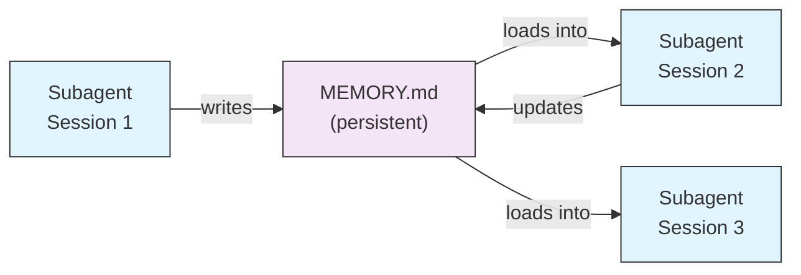
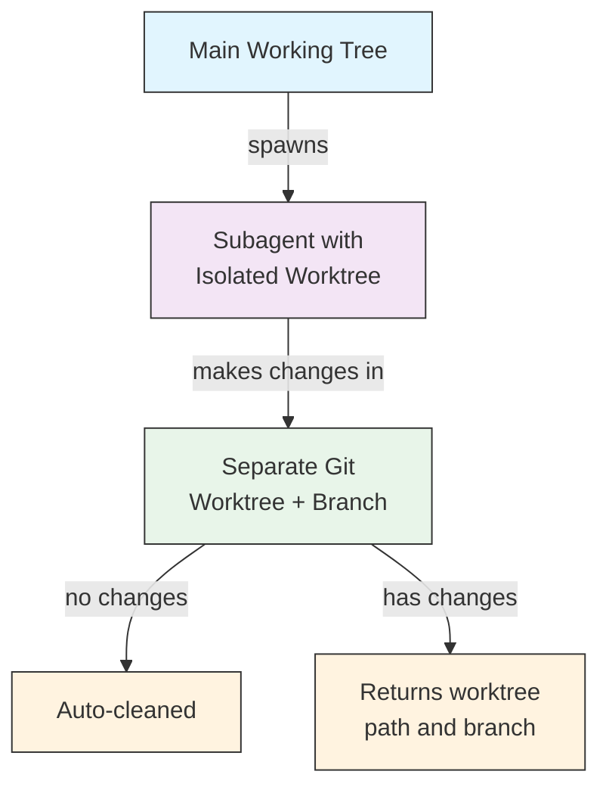
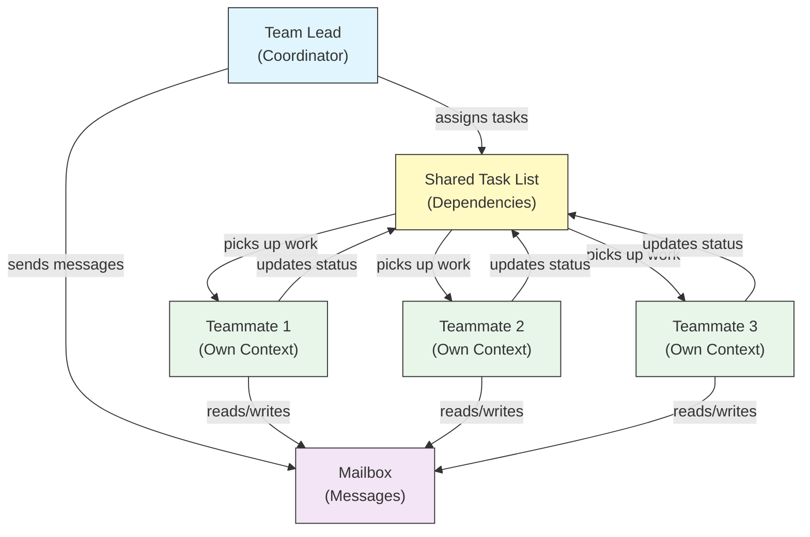
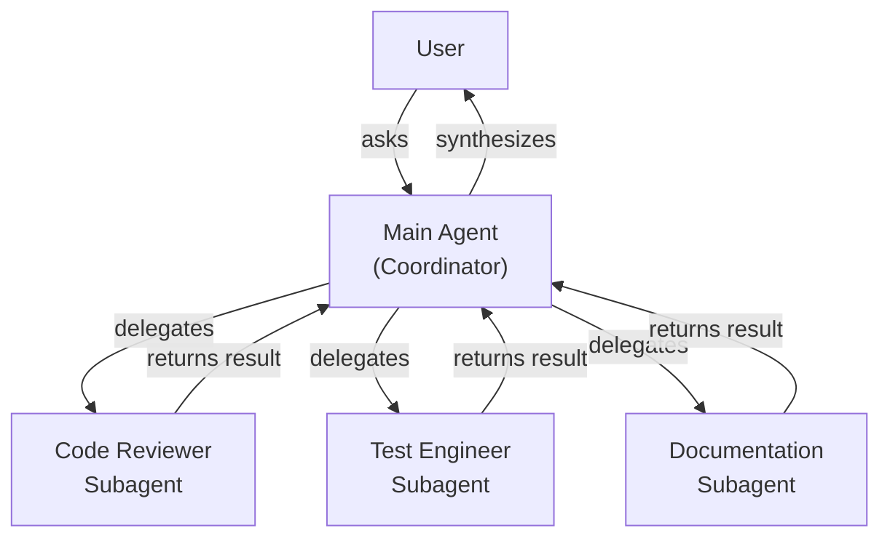
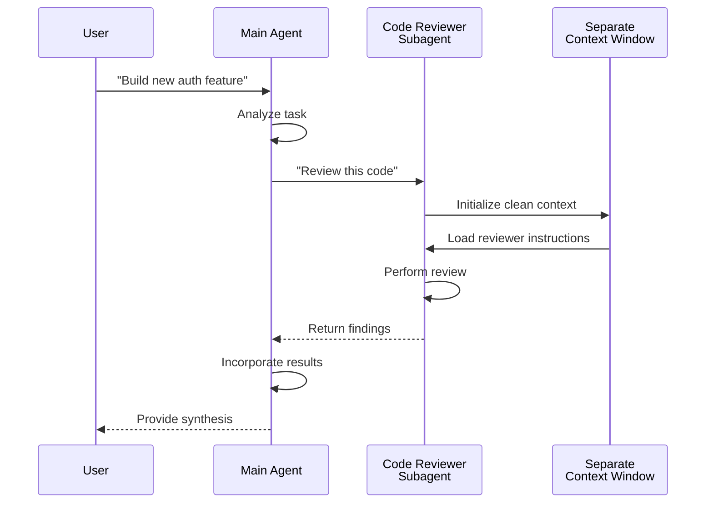
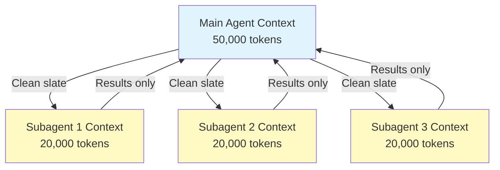
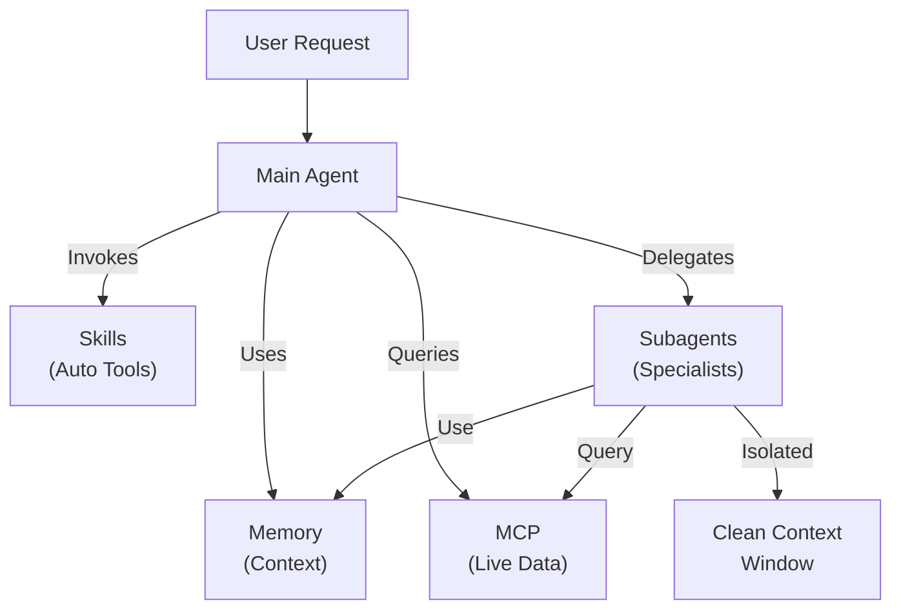

<picture>
  <source media="(prefers-color-scheme: dark)" srcset="../resources/logos/claude-howto-logo-dark.svg">
  
</picture>

# 서브에이전트 - 종합 참조 가이드

서브에이전트는 Claude Code가 작업을 위임할 수 있는 전문화된 AI 어시스턴트입니다. 각 서브에이전트는 특정 목적을 가지며, 주 대화와는 별개의 자체 컨텍스트 창을 사용하고, 특정 도구와 사용자 지정 시스템 프롬프트로 구성할 수 있습니다.

## 목차

1. [개요](#개요)
2. [주요 이점](#주요-이점)
3. [파일 위치](#파일-위치)
4. [구성](#구성)
5. [내장 서브에이전트](#내장-서브에이전트)
6. [서브에이전트 관리](#서브에이전트-관리)
7. [서브에이전트 사용](#서브에이전트-사용)
8. [재개 가능한 에이전트](#재개-가능한-에이전트)
9. [서브에이전트 체이닝](#서브에이전트-체이닝)
10. [서브에이전트용 영구 메모리](#서브에이전트용-영구-메모리)
11. [백그라운드 서브에이전트](#백그라운드-서브에이전트)
12. [워크트리 격리](#워크트리-격리)
13. [생성 가능한 서브에이전트 제한](#생성-가능한-서브에이전트-제한)
14. [`claude agents` CLI 명령](#claude-agents-cli-명령)
15. [에이전트 팀 (실험적)](#에이전트-팀-실험적)
16. [플러그인 서브에이전트 보안](#플러그인-서브에이전트-보안)
17. [아키텍처](#아키텍처)
18. [컨텍스트 관리](#컨텍스트-관리)
19. [서브에이전트 사용 시기](#서브에이전트-사용-시기)
20. [모범 사례](#모범-사례)
21. [이 폴더의 서브에이전트 예시](#이-폴더의-서브에이전트-예시)
22. [설치 안내](#설치-안내)
23. [관련 개념](#관련-개념)

---

## 개요

서브에이전트는 Claude Code에서 다음을 통해 위임된 작업을 실행할 수 있도록 합니다:

- 별도의 컨텍스트 창을 가진 **격리된 AI 어시스턴트** 생성
- 전문 지식을 위한 **맞춤형 시스템 프롬프트** 제공
- 기능 제한을 위한 **도구 접근 제어** 적용
- 복잡한 작업으로 인한 **컨텍스트 오염** 방지
- 여러 전문화된 작업의 **병렬 실행** 활성화

각 서브에이전트는 초기화된 상태에서 독립적으로 작동하며, 자신의 작업에 필요한 특정 컨텍스트만 받고, 그 결과를 주 에이전트에게 반환하여 종합합니다.

**빠른 시작**: `/agents` 명령을 사용하여 서브에이전트를 대화형으로 생성, 확인, 편집 및 관리할 수 있습니다.

---

## 주요 이점

| Benefit | Description |
|---------|-------------|
| **컨텍스트 보존** | 별도의 컨텍스트에서 작동하여 주 대화의 오염을 방지 |
| **전문화된 전문성** | 특정 도메인에 맞게 미세 조정되어 성공률이 높음 |
| **재사용성** | 다양한 프로젝트에서 사용하고 팀과 공유 가능 |
| **유연한 권한** | 서브에이전트 유형에 따라 다른 도구 접근 수준 |
| **확장성** | 여러 에이전트가 여러 측면에서 동시에 작업 |

---

## 파일 위치

서브에이전트 파일은 다양한 범위로 여러 위치에 저장될 수 있습니다.

| Priority | Type | Location | Scope |
|----------|------|----------|-------|
| 1 (최고) | **CLI 정의** | `--agents` 플래그 (JSON)를 통해 | 세션 전용 |
| 2 | **프로젝트 서브에이전트** | `.claude/agents/` | 현재 프로젝트 |
| 3 | **사용자 서브에이전트** | `~/.claude/agents/` | 모든 프로젝트 |
| 4 (최저) | **플러그인 에이전트** | 플러그인 `agents/` 디렉터리 | 플러그인을 통해 |

중복된 이름이 존재하는 경우, 우선순위가 높은 소스가 우선합니다.

> **중첩된 `.claude/` 우선순위 (v2.1.178)**: 동일한 에이전트 이름이 여러 중첩된 `.claude/agents/` 디렉터리(예: 패키지 수준 `.claude/` 폴더를 가진 모노레포)에 정의되어 있을 때, **현재 작업 디렉터리에 가장 가까운** 정의가 우선합니다. 동일한 '가장 가까운 것이 우선' 규칙은 중첩된 워크플로 및 출력 스타일 정의에도 적용됩니다.


---

## 구성

### 파일 형식

서브에이전트는 YAML 프런트매터로 정의되며, 그 뒤에 마크다운 형식의 시스템 프롬프트가 옵니다.

```yaml
---
name: your-sub-agent-name
description: Description of when this subagent should be invoked
tools: tool1, tool2, tool3  # Optional - inherits all tools if omitted
disallowedTools: tool4  # Optional - explicitly disallowed tools
model: sonnet  # Optional - sonnet, opus, haiku, or inherit
permissionMode: default  # Optional - permission mode
maxTurns: 20  # Optional - limit agentic turns
skills: skill1, skill2  # Optional - skills to preload into context
mcpServers: server1  # Optional - MCP servers to make available
memory: user  # Optional - persistent memory scope (user, project, local)
background: false  # Optional - run as background task
effort: high  # Optional - reasoning effort (low, medium, high, max)
isolation: worktree  # Optional - git worktree isolation
initialPrompt: "Start by analyzing the codebase"  # Optional - auto-submitted first turn
hooks:  # Optional - component-scoped hooks
  PreToolUse:
    - matcher: "Bash"
      hooks:
        - type: command
          command: "./scripts/security-check.sh"
---

Your subagent's system prompt goes here. This can be multiple paragraphs
and should clearly define the subagent's role, capabilities, and approach
to solving problems.
```

### 구성 필드
| Field | Required | Description |
|-------|----------|-------------|
| `name` | 예 | 고유 식별자 (소문자와 하이픈) |
| `description` | 예 | 목적에 대한 자연어 설명. 자동 호출을 장려하려면 "use PROACTIVELY"를 포함하세요 |
| `tools` | 아니요 | 특정 도구의 쉼표로 구분된 목록. 생략하면 모든 도구를 상속합니다. 생성 가능한 서브에이전트를 제한하기 위해 `Agent(agent_name)` 구문을 지원합니다 |
| `disallowedTools` | 아니요 | 서브에이전트가 사용해서는 안 되는 도구의 쉼표로 구분된 목록 |
| `model` | 아니요 | 사용할 모델: `sonnet`, `opus`, `haiku`, 전체 모델 ID 또는 `inherit`. 기본값은 구성된 서브에이전트 모델입니다 |
| `permissionMode` | 아니요 | `default`, `acceptEdits`, `dontAsk`, `bypassPermissions`, `plan` |
| `maxTurns` | 아니요 | 서브에이전트가 취할 수 있는 에이전트 턴의 최대 수 |
| `skills` | 아니요 | 미리 로드할 스킬의 쉼표로 구분된 목록. 시작 시 전체 스킬 콘텐츠를 서브에이전트의 컨텍스트에 주입합니다. **v2.1.133+:** 서브에이전트도 Skill 도구를 통해 프로젝트, 사용자 및 플러그인 스킬을 발견합니다. 이는 주 세션과 동일한 카탈로그이며, 더 이상 자체 내장된 세트에 국한되지 않습니다. |
| `mcpServers` | 아니요 | 서브에이전트에서 사용할 수 있도록 할 MCP 서버 |
| `hooks` | 아니요 | 구성 요소 범위 후크 (PreToolUse, PostToolUse, Stop) |
| `memory` | 아니요 | 영구 메모리 디렉터리 범위: `user`, `project` 또는 `local` |
| `background` | 아니요 | 이 서브에이전트를 항상 백그라운드 작업으로 실행하려면 `true`로 설정 |
| `effort` | 아니요 | 추론 노력 수준: `low`, `medium`, `high` 또는 `max` |
| `isolation` | 아니요 | 서브에이전트에 자체 git 워크트리를 제공하려면 `worktree`로 설정 |
| `initialPrompt` | 아니요 | 서브에이전트가 주 에이전트로 실행될 때 자동으로 제출되는 첫 번째 턴 |


### 주 스레드 에이전트 프런트매터 존중 (v2.1.117+/v2.1.119+)

에이전트가 주 스레드 에이전트로 호출될 때 (`claude --agent <name>` 또는 `--print` 모드를 통해), 다음 프런트매터 필드가 존중됩니다.

| Field | Version | Notes |
|-------|---------|-------|
| `mcpServers` | v2.1.117+ | 에이전트가 `claude --agent <name>`을 통해 주 스레드 에이전트로 호출될 때 로드됩니다 |
| `permissionMode` | v2.1.119+ | `--agent <name>`을 통해 내장 에이전트에 대해 존중됩니다 |
| `tools` / `disallowedTools` | v2.1.119+ | `--print` 모드(비대화형/스크립트 사용)에서 존중됩니다 |

**예시 — `mcpServers` 및 `permissionMode`를 사용하는 에이전트:**

```yaml
---
name: secure-researcher
description: Research agent with scoped MCP access and restricted permissions
permissionMode: acceptEdits
mcpServers:
  notion:
    type: http
    url: https://mcp.notion.com/mcp
  github:
    type: http
    url: https://api.github.com/mcp
tools: Read, Grep, Glob
---

You are a research agent. You may query Notion and GitHub through the
configured MCP servers, and read local files, but you cannot write or
execute commands outside of accepted edits.
```

Run with:

```bash
claude --agent secure-researcher
```

### 도구 구성 옵션

**옵션 1: 모든 도구 상속 (필드 생략)**
```yaml
---
name: full-access-agent
description: Agent with all available tools
---
```

**옵션 2: 개별 도구 지정**
```yaml
---
name: limited-agent
description: Agent with specific tools only
tools: Read, Grep, Glob, Bash
---
```

> **Glob/Grep에 대한 참고 (v2.1.113+):** 기본 macOS/Linux 빌드에서는 Glob과 Grep이 별도의 도구가 아닌 Bash 도구를 통해 `bfs`/`ugrep`으로 제공됩니다. Windows 및 npm-JS 빌드에서는 여전히 독립형 도구로 노출됩니다. 작성자는 `allowedTools`에서 Glob/Grep을 계속 참조할 수 있으며, 백엔드 대체는 투명하게 이루어집니다.

**옵션 3: 조건부 도구 접근**
```yaml
---
name: conditional-agent
description: Agent with filtered tool access
tools: Read, Bash(npm:*), Bash(test:*)
---
```

### CLI 기반 구성

단일 세션에 대한 서브에이전트를 JSON 형식의 `--agents` 플래그를 사용하여 정의합니다.

```bash
claude --agents '{
  "code-reviewer": {
    "description": "Expert code reviewer. Use proactively after code changes.",
    "prompt": "You are a senior code reviewer. Focus on code quality, security, and best practices.",
    "tools": ["Read", "Grep", "Glob", "Bash"],
    "model": "sonnet"
  }
}'
```

**`--agents` 플래그용 JSON 형식:**

```json
{
  "agent-name": {
    "description": "Required: when to invoke this agent",
    "prompt": "Required: system prompt for the agent",
    "tools": ["Optional", "array", "of", "tools"],
    "model": "optional: sonnet|opus|haiku"
  }
}
```

**에이전트 정의의 우선순위:**

에이전트 정의는 다음 우선순위 순서로 로드됩니다 (첫 번째 일치 항목이 우선합니다).
2. **CLI 정의** - `--agents` 플래그 (세션 전용, JSON)
4. **프로젝트 수준** - `.claude/agents/` (현재 프로젝트)
6. **사용자 수준** - `~/.claude/agents/` (모든 프로젝트)
8. **플러그인 수준** - 플러그인 `agents/` 디렉터리

이를 통해 CLI 정의는 단일 세션에 대해 다른 모든 소스를 재정의할 수 있습니다.

---

## 내장 서브에이전트

Claude Code에는 항상 사용할 수 있는 여러 내장 서브에이전트가 포함되어 있습니다.
| Agent | Model | Purpose |
|-------|-------|---------|
| **general-purpose** | 상속 | 복잡하고 다단계적인 작업 |
| **Plan** | 상속 | 계획 모드를 위한 연구 |
| **Explore** | Haiku | 읽기 전용 코드베이스 탐색 (빠른/중간/매우 철저한) |
| **Bash** | 상속 | 별도의 컨텍스트에서 터미널 명령 |
| **statusline-setup** | Sonnet | 상태 표시줄 구성 |
| **Claude Code Guide** | Haiku | Claude Code 기능 질문에 답변 |

### 일반 목적 서브에이전트

| Property | Value |
|----------|-------|
| **모델** | 부모로부터 상속 |
| **도구** | 모든 도구 |
| **목적** | 복잡한 연구 작업, 다단계 작업, 코드 수정 |

**사용 시기**: 복잡한 추론을 통해 탐색과 수정이 모두 필요한 작업.

### 계획 서브에이전트

| Property | Value |
|----------|-------|
| **모델** | 부모로부터 상속 |
| **도구** | Read, Glob, Grep, Bash |
| **목적** | 계획 모드에서 코드베이스를 연구하기 위해 자동으로 사용됩니다 |

**사용 시기**: Claude가 계획을 제시하기 전에 코드베이스를 이해해야 할 때.


### 탐색 서브에이전트

| Property | Value |
|----------|-------|
| **모델** | Haiku (빠르고 낮은 지연 시간) |
| **모드** | 엄격히 읽기 전용 |
| **도구** | Glob, Grep, Read, Bash (읽기 전용 명령만) |
| **목적** | 빠른 코드베이스 검색 및 분석 |

**사용 시기**: 코드를 변경하지 않고 검색/이해할 때.

**철저함 수준** - 탐색 깊이를 지정합니다:
- **"quick"** - 최소한의 탐색으로 빠른 검색, 특정 패턴을 찾는 데 유용
- **"medium"** - 적절한 탐색, 속도와 철저함의 균형, 기본 접근 방식
- **"very thorough"** - 여러 위치와 명명 규칙에 걸친 포괄적인 분석, 시간이 더 오래 걸릴 수 있음


### Bash 서브에이전트

| Property | Value |
|----------|-------|
| **모델** | 부모로부터 상속 |
| **도구** | Bash |
| **목적** | 별도의 컨텍스트 창에서 터미널 명령 실행 |

**사용 시기**: 격리된 컨텍스트의 이점을 얻을 수 있는 셸 명령을 실행할 때.

### 상태 표시줄 설정 서브에이전트

| Property | Value |
|----------|-------|
| **모델** | Sonnet |
| **도구** | Read, Write, Bash |
| **목적** | Claude Code 상태 표시줄 디스플레이 구성 |

**사용 시기**: 상태 표시줄을 설정하거나 사용자 지정할 때.

### Claude Code 가이드 서브에이전트

| Property | Value |
|----------|-------|
| **모델** | Haiku (빠르고 낮은 지연 시간) |
| **도구** | 읽기 전용 |
| **목적** | Claude Code 기능 및 사용법에 대한 질문에 답변 |

**사용 시기**: 사용자가 Claude Code 작동 방식이나 특정 기능 사용법에 대해 질문할 때.

---

## 서브에이전트 관리

### `/agents` 명령 사용 (권장)

```bash
/agents
```

이는 다음과 같은 대화형 메뉴를 제공합니다.
- 사용 가능한 모든 서브에이전트 보기 (내장, 사용자, 프로젝트)
- 안내된 설정으로 새 서브에이전트 생성
- 기존 사용자 지정 서브에이전트 및 도구 접근 편집
- 사용자 지정 서브에이전트 삭제
- 중복이 있을 때 어떤 서브에이전트가 활성화되는지 확인

### 직접 파일 관리

```bash
# Create a project subagent
mkdir -p .claude/agents
cat > .claude/agents/test-runner.md << 'EOF'
---
name: test-runner
description: Use proactively to run tests and fix failures
---

You are a test automation expert. When you see code changes, proactively
run the appropriate tests. If tests fail, analyze the failures and fix
them while preserving the original test intent.
EOF

# Create a user subagent (available in all projects)
mkdir -p ~/.claude/agents
```

---

## 서브에이전트 사용

### 자동 위임

Claude는 다음을 기반으로 작업을 선제적으로 위임합니다:
- 요청에 있는 작업 설명
- 서브에이전트 구성의 `description` 필드
- 현재 컨텍스트 및 사용 가능한 도구

선제적인 사용을 장려하려면 `description` 필드에 "use PROACTIVELY" 또는 "MUST BE USED"를 포함하세요.

```yaml
---
name: code-reviewer
description: Expert code review specialist. Use PROACTIVELY after writing or modifying code.
---
```

### 명시적 호출
특정 서브에이전트를 명시적으로 요청할 수 있습니다.

```
> Use the test-runner subagent to fix failing tests
> Have the code-reviewer subagent look at my recent changes
> Ask the debugger subagent to investigate this error
```

> **대소문자 및 구분자 무시 `subagent_type` 일치 (v2.1.140)**: `Agent` 도구 호출 또는 `--agent` 플래그의 `subagent_type`은 대소문자를 무시하고 구분자 스타일을 무시하여 일치시킵니다. 즉, `code-reviewer`, `Code Reviewer`, `code_reviewer`는 모두 동일한 에이전트로 해결됩니다. 이는 사소한 대문자 사용 차이로 인해 기본 에이전트로 자동으로 대체되는 오랜 문제점을 해결합니다.

### @-멘션 호출

`@` 접두사를 사용하여 특정 서브에이전트가 호출되도록 보장합니다 (자동 위임 휴리스틱을 우회합니다):

```
> @"code-reviewer (agent)" review the auth module
```

### 세션 전체 에이전트

특정 에이전트를 주 에이전트로 사용하여 전체 세션을 실행합니다:

```bash
# Via CLI flag
claude --agent code-reviewer

# Via settings.json
{
  "agent": "code-reviewer"
}
```

### 사용 가능한 에이전트 목록

`claude agents` 명령을 사용하여 모든 소스에서 구성된 모든 에이전트를 나열할 수 있습니다:

```bash
claude agents
```

---

## 재개 가능한 에이전트

서브에이전트는 전체 컨텍스트를 보존한 채 이전 대화를 계속할 수 있습니다:

```bash
# Initial invocation
> Use the code-analyzer agent to start reviewing the authentication module
# Returns agentId: "abc123"

# Resume the agent later
> Resume agent abc123 and now analyze the authorization logic as well
```

**사용 사례**:
- 여러 세션에 걸친 장기 실행 연구
- 컨텍스트 손실 없이 반복적인 개선
- 컨텍스트를 유지하는 다단계 워크플로

---

## 서브에이전트 체이닝

여러 서브에이전트를 순서대로 실행합니다:

```bash
> First use the code-analyzer subagent to find performance issues,
  then use the optimizer subagent to fix them
```

이를 통해 한 서브에이전트의 출력이 다른 서브에이전트의 입력으로 사용되는 복잡한 워크플로를 구현할 수 있습니다.

---

## 서브에이전트용 영구 메모리

`memory` 필드는 서브에이전트에게 대화를 넘어서도 유지되는 영구 디렉터리를 제공합니다. 이를 통해 서브에이전트는 시간이 지남에 따라 지식을 축적하고, 세션 간에 지속되는 메모, 발견 사항 및 컨텍스트를 저장할 수 있습니다.

### 메모리 범위

| Scope | Directory | Use Case |
|-------|-----------|----------|
| `user` | `~/.claude/agent-memory/<name>/` | 모든 프로젝트에 걸쳐 개인 메모 및 환경 설정 |
| `project` | `.claude/agent-memory/<name>/` | 팀과 공유되는 프로젝트별 지식 |
| `local` | `.claude/agent-memory-local/<name>/` | 버전 제어에 커밋되지 않는 로컬 프로젝트 지식 |

### 작동 방식

- 메모리 디렉터리의 `MEMORY.md` 파일 첫 200줄이 서브에이전트의 시스템 프롬프트에 자동으로 로드됩니다
- 서브에이전트가 메모리 파일을 관리할 수 있도록 `Read`, `Write`, `Edit` 도구가 자동으로 활성화됩니다
- 서브에이전트는 필요에 따라 메모리 디렉터리에 추가 파일을 생성할 수 있습니다

### 구성 예시

```yaml
---
name: researcher
memory: user
---

You are a research assistant. Use your memory directory to store findings,
track progress across sessions, and build up knowledge over time.

Check your MEMORY.md file at the start of each session to recall previous context.
```



---

## 백그라운드 서브에이전트

서브에이전트는 백그라운드에서 실행될 수 있으며, 주 대화를 다른 작업을 위해 비워둘 수 있습니다.

### 구성

프런트매터에서 `background: true`로 설정하여 서브에이전트를 항상 백그라운드 작업으로 실행합니다:

```yaml
---
name: long-runner
background: true
description: Performs long-running analysis tasks in the background
---
```

### 키보드 단축키

| Shortcut | Action |
|----------|--------|
| `Ctrl+B` | 현재 실행 중인 서브에이전트 작업을 백그라운드로 전환 |
| `Ctrl+F` | 모든 백그라운드 에이전트 종료 (확인을 위해 두 번 누르세요) |

### 백그라운드 작업 비활성화

환경 변수를 설정하여 백그라운드 작업 지원을 완전히 비활성화합니다:

```bash
export CLAUDE_CODE_DISABLE_BACKGROUND_TASKS=1
```

---

## 워크트리 격리

`isolation: worktree` 설정은 서브에이전트에게 자체 git 워크트리를 제공하여, 주 작업 트리에 영향을 주지 않고 독립적으로 변경할 수 있도록 합니다.

### 구성

```yaml
---
name: feature-builder
isolation: worktree
description: Implements features in an isolated git worktree
tools: Read, Write, Edit, Bash, Grep, Glob
---
```

### 작동 방식



- 서브에이전트는 별도의 브랜치에서 자체 git 워크트리에서 작동합니다
- 서브에이전트가 변경 사항을 만들지 않으면 워크트리는 자동으로 정리됩니다
- 변경 사항이 있는 경우, 워크트리 경로와 브랜치 이름이 검토 또는 병합을 위해 주 에이전트로 반환됩니다

---

## 포크된 서브에이전트

포크된 서브에이전트(`context: fork`)는 새롭게 시작하는 대신, 포크 시점에 부모 에이전트의 전체 대화 컨텍스트를 상속합니다. 이는 지금까지 수행한 작업을 잃지 않고 대체 경로를 탐색하는 데 유용합니다.

> **가용성**: v2.1.117에서 GA(General Availability)입니다. 외부 빌드(서드파티 배포)에서는 포크 기능을 활성화하려면 `CLAUDE_CODE_FORK_SUBAGENT=1`로 설정하십시오.

### 구성

```yaml
---
name: alternative-explorer
description: Explore an alternative implementation path while preserving parent context
context: fork
tools: Read, Edit, Bash, Grep, Glob
---

You are a forked subagent. You inherit the parent's full conversation and
may explore an alternative approach. Return your findings and the parent
will decide whether to adopt them.
```

### 외부 빌드에서 활성화

```bash
export CLAUDE_CODE_FORK_SUBAGENT=1
claude
```

### 포크와 클린 컨텍스트 사용 시기

| Scenario | `context: fork` | Clean context (default) |
|----------|-----------------|-------------------------|
| 대체 구현 탐색 | 예 | 아니요 (컨텍스트를 잃게 됨) |
| 기존 컨텍스트를 사용한 장기 연구 | 예 | 아니요 |
| 독립적인 전문화된 작업 | 아니요 | 예 |
| 컨텍스트 오염 방지 | 아니요 | 예 |

---

## 생성 가능한 서브에이전트 제한

`tools` 필드에서 `Agent(agent_type)` 구문을 사용하여 주어진 서브에이전트가 어떤 서브에이전트를 생성할 수 있는지 제어할 수 있습니다. 이는 위임을 위해 특정 서브에이전트를 허용 목록에 추가하는 방법을 제공합니다.

> **참고**: v2.1.63에서 `Task` 도구는 `Agent`로 이름이 변경되었습니다. 기존 `Task(...)` 참조도 여전히 별칭으로 작동합니다.

### 예시

```yaml
---
name: coordinator
description: Coordinates work between specialized agents
tools: Agent(worker, researcher), Read, Bash
---

You are a coordinator agent. You can delegate work to the "worker" and
"researcher" subagents only. Use Read and Bash for your own exploration.
```

이 예시에서 `coordinator` 서브에이전트는 "worker" 및 "researcher" 서브에이전트만 생성할 수 있습니다. 다른 곳에 정의되어 있더라도 다른 서브에이전트는 생성할 수 없습니다.

---

## `claude agents` CLI 명령

`claude agents` 명령은 소스(내장, 사용자 수준, 프로젝트 수준)별로 그룹화된 모든 구성된 에이전트를 나열합니다:

```bash
claude agents
```

이 명령은 다음을 수행합니다:
- 모든 소스의 사용 가능한 모든 에이전트를 표시합니다
- 에이전트를 소스 위치별로 그룹화합니다
- 우선순위가 높은 에이전트가 낮은 수준의 에이전트를 가릴 때(예: 사용자 수준 에이전트와 이름이 같은 프로젝트 수준 에이전트) **재정의**를 나타냅니다

---

## 에이전트 팀 (실험적)

에이전트 팀은 여러 Claude Code 인스턴스가 복잡한 작업을 함께 수행하도록 조정합니다. (결과를 반환하는 위임된 하위 작업인) 서브에이전트와 달리, 팀원은 자체 컨텍스트 창으로 독립적으로 작업하며 공유 사서함 시스템을 통해 서로 직접 메시지를 주고받을 수 있습니다.

> **공식 문서**: [code.claude.com/docs/en/agent-teams](https://code.claude.com/docs/en/agent-teams)

> **참고**: 에이전트 팀은 실험적 기능이며 기본적으로 비활성화되어 있습니다. Claude Code v2.1.32+가 필요합니다. 사용하기 전에 활성화해야 합니다.

### 서브에이전트 vs 에이전트 팀

| Aspect | Subagents | Agent Teams |
|--------|-----------|-------------|
| **위임 모델** | 부모가 하위 작업을 위임하고 결과를 기다립니다 | 팀 리더가 작업을 조정하고, 팀원은 독립적으로 실행합니다 |
| **컨텍스트** | 하위 작업당 새로운 컨텍스트, 결과는 다시 주입 | 각 팀원은 자체 영구 컨텍스트 창을 유지합니다 |
| **조정** | 부모가 관리하는 순차적 또는 병렬 | 자동 종속성 관리가 가능한 공유 작업 목록 |
| **통신** | 결과는 부모에게만 반환 (에이전트 간 메시징 없음) | 팀원은 사서함을 통해 서로 직접 메시지를 주고받을 수 있습니다 |
| **세션 재개** | 지원됨 | 인-프로세스 팀원에서는 지원되지 않음 |
| **최적 사용** | 집중적이고 잘 정의된 하위 작업 | 에이전트 간 통신 및 병렬 실행이 필요한 복잡한 작업 |

### 에이전트 팀 활성화

환경 변수를 설정하거나 `settings.json`에 추가합니다:

```bash
export CLAUDE_CODE_EXPERIMENTAL_AGENT_TEAMS=1
```

Or in `settings.json`:

```json
{
  "env": {
    "CLAUDE_CODE_EXPERIMENTAL_AGENT_TEAMS": "1"
  }
}
```

### 팀 시작

활성화되면 프롬프트에서 Claude에게 팀원과 함께 작업하도록 요청하십시오:

```
User: Build the authentication module. Use a team — one teammate for the API endpoints,
      one for the database schema, and one for the test suite.
```

Claude는 팀을 생성하고 작업을 할당하며 작업을 자동으로 조정합니다.

### 디스플레이 모드

팀원 활동이 표시되는 방식을 제어합니다:

| Mode | Flag | Description |
|------|------|-------------|
| **Auto** | `--teammate-mode auto` | 터미널에 가장 적합한 디스플레이 모드를 자동으로 선택합니다 |
| **In-process** (default) | `--teammate-mode in-process` | 현재 터미널에 팀원 출력을 인라인으로 표시합니다 |
| **Split-panes** | `--teammate-mode tmux` | 각 팀원을 별도의 tmux 또는 iTerm2 창에 엽니다 |
| **iTerm2** | `--teammate-mode iterm2` | (v2.1.186+) 전용 iTerm2 창에 팀원을 생성합니다. `it2` CLI가 필요하며, 자동 모드에서는 찾을 수 없을 때 경고합니다 |

```bash
claude --teammate-mode tmux
```

You can also set the display mode in `settings.json`:

```json
{
  "teammateMode": "tmux"
}
```

> **참고**: 분할 창 모드에는 tmux 또는 iTerm2가 필요합니다. VS Code 터미널, Windows 터미널 또는 Ghostty에서는 사용할 수 없습니다.

### 내비게이션

`Shift+Down`을 사용하여 분할 창 모드에서 팀원 간에 이동합니다.

### 팀 구성

팀 구성은 `~/.claude/teams/{team-name}/config.json`에 저장됩니다.

### 아키텍처



**핵심 구성 요소**:

- **팀 리더**: 팀을 생성하고 작업을 할당하며 조정하는 주 Claude Code 세션
- **공유 작업 목록**: 자동 종속성 추적 기능이 있는 동기화된 작업 목록
- **사서함**: 팀원이 상태를 전달하고 조정할 수 있는 에이전트 간 메시징 시스템
- **팀원**: 자체 컨텍스트 창을 가진 독립적인 Claude Code 인스턴스

### 작업 할당 및 메시징

팀 리더는 작업을 태스크로 나누고 팀원에게 할당합니다. 공유 태스크 목록은 다음을 처리합니다:

- **자동 종속성 관리** — 태스크는 종속 태스크가 완료될 때까지 기다립니다
- **상태 추적** — 팀원은 작업하면서 태스크 상태를 업데이트합니다
- **에이전트 간 메시징** — 팀원은 조정을 위해 사서함을 통해 메시지를 보냅니다 (예: "데이터베이스 스키마가 준비되었으니 쿼리 작성을 시작할 수 있습니다")

### 계획 승인 워크플로

복잡한 작업을 위해 팀 리더는 팀원이 작업을 시작하기 전에 실행 계획을 만듭니다. 사용자는 계획을 검토하고 승인하여, 코드 변경이 이루어지기 전에 팀의 접근 방식이 기대치에 부합하는지 확인합니다.

### 팀을 위한 훅 이벤트

에이전트 팀은 두 가지 추가 [훅 이벤트](../06-hooks/)를 도입합니다:

| Event | Fires When | Use Case |
|-------|------------|----------|
| `TeammateIdle` | 팀원이 현재 작업을 마치고 보류 중인 작업이 없을 때 | 알림 트리거, 후속 작업 할당 |
| `TaskCompleted` | 공유 작업 목록의 태스크가 완료로 표시될 때 | 유효성 검사 실행, 대시보드 업데이트, 종속 작업 체인 |

### 모범 사례

- **팀 규모**: 최적의 조정을 위해 팀을 3-5명의 팀원으로 유지
- **작업 규모**: 각 5-15분 소요되는 작업으로 분할 — 병렬화하기에 충분히 작고, 의미를 가지기에 충분히 큼
- **파일 충돌 방지**: 병합 충돌을 방지하기 위해 다른 파일 또는 디렉터리를 다른 팀원에게 할당
- **간단하게 시작**: 첫 팀에는 인-프로세스 모드를 사용하고, 익숙해지면 분할 창으로 전환
- **명확한 작업 설명**: 팀원이 독립적으로 작업할 수 있도록 구체적이고 실행 가능한 작업 설명을 제공

### 제한 사항

- **실험적**: 기능 동작이 향후 릴리스에서 변경될 수 있습니다
- **세션 재개 불가**: 인-프로세스 팀원은 세션 종료 후 재개할 수 없습니다
- **세션당 하나의 팀**: 단일 세션에서 중첩 팀 또는 여러 팀을 생성할 수 없습니다
- **고정된 리더십**: 팀 리더 역할은 팀원에게 이전될 수 없습니다
- **분할 창 제한**: tmux/iTerm2 필요; VS Code 터미널, Windows 터미널 또는 Ghostty에서는 사용할 수 없습니다
- **세션 간 팀 불가**: 팀원은 현재 세션 내에서만 존재합니다

> **경고**: 에이전트 팀은 실험적 기능입니다. 중요하지 않은 작업으로 먼저 테스트하고, 예기치 않은 동작이 있는지 팀원 조정을 모니터링하십시오.

---

## 플러그인 서브에이전트 보안

플러그인이 제공하는 서브에이전트는 보안을 위해 프런트매터 기능이 제한됩니다. 플러그인 서브에이전트 정의에서는 다음 필드가 **허용되지 않습니다**:

- `hooks` - 라이프사이클 훅을 정의할 수 없습니다
- `mcpServers` - MCP 서버를 구성할 수 없습니다
- `permissionMode` - 권한 설정을 재정의할 수 없습니다

이는 플러그인이 서브에이전트 훅을 통해 권한을 에스컬레이션하거나 임의의 명령을 실행하는 것을 방지합니다.

---

## 아키텍처

### 고수준 아키텍처



### 서브에이전트 생명주기



---

## 컨텍스트 관리



### 주요 사항

- 각 서브에이전트는 주 대화 기록 없이 **새로운 컨텍스트 창**을 얻습니다
- **관련 컨텍스트**만 특정 작업을 위해 서브에이전트에게 전달됩니다
- 결과는 주 에이전트로 **요약되어** 돌아옵니다
- 이는 긴 프로젝트에서 **컨텍스트 토큰 소진**을 방지합니다

### 성능 고려 사항

- **컨텍스트 효율성** - 에이전트가 주 컨텍스트를 보존하여 더 긴 세션을 가능하게 합니다
- **지연 시간** - 서브에이전트는 깨끗한 상태로 시작하며 초기 컨텍스트를 수집하는 데 지연 시간을 추가할 수 있습니다

### 주요 동작

- **중첩 생성 (최대 5단계)** - v2.1.172부터 서브에이전트는 자체 서브에이전트를 최대 5단계 깊이로 중첩하여 생성할 수 있습니다. 이전 버전에서는 중첩이 허용되지 않았습니다. 주어진 서브에이전트가 생성할 수 있는 서브에이전트를 제어하려면 `Agent(agent_type)` 제한 구문(참조: [생성 가능한 서브에이전트 제한](#생성-가능한-서브에이전트-제한))을 사용하십시오
- **백그라운드 권한** - 백그라운드 서브에이전트는 사전 승인되지 않은 모든 권한을 자동으로 거부합니다
- **백그라운드 전환** - `Ctrl+B`를 눌러 현재 실행 중인 작업을 백그라운드로 전환합니다
- **트랜스크립트** - 서브에이전트 트랜스크립트는 `~/.claude/projects/{project}/{sessionId}/subagents/agent-{agentId}.jsonl`에 저장됩니다
- **자동 압축** - 서브에이전트 컨텍스트는 용량의 ~95%에서 자동으로 압축됩니다 (`CLAUDE_AUTOCOMPACT_PCT_OVERRIDE` 환경 변수로 재정의)

---

## 서브에이전트 사용 시기

| Scenario | Use Subagent | Why |
|----------|--------------|-----|
| 여러 단계가 있는 복잡한 기능 | 예 | 관심사 분리, 컨텍스트 오염 방지 |
| 빠른 코드 검토 | 아니요 | 불필요한 오버헤드 |
| 병렬 작업 실행 | 예 | 각 서브에이전트는 자체 컨텍스트를 가집니다 |
| 전문화된 전문 지식 필요 | 예 | 맞춤형 시스템 프롬프트 |
| 장기 실행 분석 | 예 | 주 컨텍스트 소진 방지 |
| 단일 작업 | 아니요 | 불필요하게 지연 시간 추가 |

---

## 모범 사례

### 설계 원칙

**권장 사항:**
- Claude가 생성한 에이전트로 시작 - Claude로 초기 서브에이전트를 생성한 다음 반복하여 사용자 정의
- 집중된 서브에이전트 설계 - 모든 것을 하는 대신 단일하고 명확한 책임
- 자세한 프롬프트 작성 - 특정 지침, 예시 및 제약 조건 포함
- 도구 접근 제한 - 서브에이전트의 목적에 필요한 도구만 부여
- 버전 관리 - 팀 협업을 위해 프로젝트 서브에이전트를 버전 제어에 체크인

**피해야 할 사항:**
- 역할이 중복되는 서브에이전트 생성
- 서브에이전트에 불필요한 도구 접근 권한 부여
- 간단한 단일 단계 작업에 서브에이전트 사용
- 하나의 서브에이전트 프롬프트에 여러 관심사 혼합
- 필요한 컨텍스트 전달을 잊지 마세요

### 시스템 프롬프트 모범 사례

1. **역할에 대해 구체적으로 설명**
   ```
   You are an expert code reviewer specializing in [specific areas]
   ```

2. **우선순위를 명확하게 정의**
   ```
   Review priorities (in order):
   1. Security Issues
   2. Performance Problems
   3. Code Quality
   ```

3. **출력 형식 지정**
   ```
   For each issue provide: Severity, Category, Location, Description, Fix, Impact
   ```

4. **실행 단계 포함**
   ```
   When invoked:
   1. Run git diff to see recent changes
   2. Focus on modified files
   3. Begin review immediately
   ```

### 도구 접근 전략

1. **제한적으로 시작**: 필수 도구만으로 시작
2. **필요할 때만 확장**: 요구 사항에 따라 도구 추가
3. **가능할 때 읽기 전용**: 분석 에이전트에는 Read/Grep 사용
4. **샌드박스 실행**: Bash 명령을 특정 패턴으로 제한

---

## 이 폴더의 서브에이전트 예시

이 폴더에는 바로 사용할 수 있는 서브에이전트 예시가 포함되어 있습니다:

### 1. 코드 리뷰어 (`code-reviewer.md`)

**목적**: 포괄적인 코드 품질 및 유지 보수성 분석

**도구**: Read, Grep, Glob, Bash

**전문 분야**:
- 보안 취약점 감지
- 성능 최적화 식별
- 코드 유지 보수성 평가
- 테스트 커버리지 분석

**사용 시기**: 품질 및 보안에 중점을 둔 자동화된 코드 검토가 필요할 때

---

### 2. 테스트 엔지니어 (`test-engineer.md`)

**목적**: 테스트 전략, 커버리지 분석 및 자동화된 테스트

**도구**: Read, Write, Bash, Grep

**전문 분야**:
- 단위 테스트 생성
- 통합 테스트 설계
- 에지 케이스 식별
- 커버리지 분석 (80% 이상 목표)

**사용 시기**: 포괄적인 테스트 스위트 생성 또는 커버리지 분석이 필요할 때

---

### 3. 문서 작성기 (`documentation-writer.md`)

**목적**: 기술 문서, API 문서 및 사용자 가이드

**도구**: Read, Write, Grep

**전문 분야**:
- API 엔드포인트 문서화
- 사용자 가이드 생성
- 아키텍처 문서화
- 코드 주석 개선

**사용 시기**: 프로젝트 문서를 생성하거나 업데이트해야 할 때

---

### 4. 보안 리뷰어 (`secure-reviewer.md`)

**목적**: 최소한의 권한으로 보안에 중점을 둔 코드 검토

**도구**: Read, Grep

**전문 분야**:
- 보안 취약점 감지
- 인증/권한 부여 문제
- 데이터 노출 위험
- 인젝션 공격 식별

**사용 시기**: 수정 기능 없이 보안 감사만 필요한 경우

---

### 5. 구현 에이전트 (`implementation-agent.md`)

**목적**: 기능 개발을 위한 완전한 구현 기능

**도구**: Read, Write, Edit, Bash, Grep, Glob

**전문 분야**:
- 기능 구현
- 코드 생성
- 빌드 및 테스트 실행
- 코드베이스 수정

**사용 시기**: 기능 구현을 처음부터 끝까지 수행할 서브에이전트가 필요할 때

---

### 6. 디버거 (`debugger.md`)

**목적**: 오류, 테스트 실패 및 예기치 않은 동작을 위한 디버깅 전문가

**도구**: Read, Edit, Bash, Grep, Glob

**전문 분야**:
- 근본 원인 분석
- 오류 조사
- 테스트 실패 해결
- 최소한의 수정 구현

**사용 시기**: 버그, 오류 또는 예기치 않은 동작이 발생할 때

---

### 7. 데이터 과학자 (`data-scientist.md`)

**목적**: SQL 쿼리 및 데이터 통찰력을 위한 데이터 분석 전문가

**도구**: Bash, Read, Write

**전문 분야**:
- SQL 쿼리 최적화
- BigQuery 작업
- 데이터 분석 및 시각화
- 통계적 통찰력

**사용 시기**: 데이터 분석, SQL 쿼리 또는 BigQuery 작업이 필요할 때

---

## 설치 안내

### 방법 1: /agents 명령 사용 (권장)

```bash
/agents
```

그런 다음:
1. '새 에이전트 생성' 선택
2. 프로젝트 수준 또는 사용자 수준 선택
3. 서브에이전트를 자세히 설명
4. 접근 권한을 부여할 도구 선택 (또는 모든 도구를 상속하려면 비워둡니다)
5. 저장 및 사용

### 방법 2: 프로젝트로 복사

에이전트 파일을 프로젝트의 `.claude/agents/` 디렉터리로 복사합니다:

```bash
# Navigate to your project
cd /path/to/your/project

# Create agents directory if it doesn't exist
mkdir -p .claude/agents

# Copy all agent files from this folder
cp /path/to/04-subagents/*.md .claude/agents/

# Remove the README (not needed in .claude/agents)
rm .claude/agents/README.md
```

### 방법 3: 사용자 디렉터리로 복사

모든 프로젝트에서 사용할 수 있는 에이전트의 경우:

```bash
# Create user agents directory
mkdir -p ~/.claude/agents

# Copy agents
cp /path/to/04-subagents/code-reviewer.md ~/.claude/agents/
cp /path/to/04-subagents/debugger.md ~/.claude/agents/
# ... copy others as needed
```

### 확인

설치 후 에이전트가 인식되는지 확인합니다:

```bash
/agents
```

설치된 에이전트가 내장 에이전트와 함께 나열되어 있는 것을 볼 수 있습니다.

---

## 파일 구조

```
project/
├── .claude/
│   └── agents/
│       ├── code-reviewer.md
│       ├── test-engineer.md
│       ├── documentation-writer.md
│       ├── secure-reviewer.md
│       ├── implementation-agent.md
│       ├── debugger.md
│       └── data-scientist.md
└── ...
```

---

## 관련 개념

### 관련 기능

- **[슬래시 명령](../01-slash-commands/)** - 사용자가 빠르게 호출하는 단축키
- **[메모리](../02-memory/)** - 영구적인 세션 간 컨텍스트
- **[스킬](../03-skills/)** - 재사용 가능한 자율 기능
- **[MCP 프로토콜](../05-mcp/)** - 실시간 외부 데이터 접근
- **[훅](../06-hooks/)** - 이벤트 기반 셸 명령 자동화
- **[플러그인](../07-plugins/)** - 번들 확장 패키지

### 다른 기능과의 비교

| Feature | User-Invoked | Auto-Invoked | Persistent | External Access | Isolated Context |
|---------|--------------|--------------|-----------|------------------|------------------|
| **슬래시 명령** | 예 | 아니요 | 아니요 | 아니요 | 아니요 |
| **서브에이전트** | 예 | 예 | 아니요 | 아니요 | 예 |
| **메모리** | 자동 | 자동 | 예 | 아니요 | 아니요 |
| **MCP** | 자동 | 예 | 아니요 | 예 | 아니요 |
| **스킬** | 예 | 예 | 아니요 | 아니요 | 아니요 |

### 통합 패턴



---

## 관측 가능성

> **v2.1.139에 추가됨.**

서브에이전트에서 시작된 API 요청에는 추적 및 로그를 디스패치 세션과 상호 연관시킬 수 있도록 두 개의 추가 HTTP 헤더가 포함됩니다:

| Header | Description |
|--------|-------------|
| `x-claude-code-agent-id` | 요청을 하는 서브에이전트의 UUID입니다. |
| `x-claude-code-parent-agent-id` | 이 서브에이전트를 디스패치한 에이전트 (주 에이전트 또는 체인의 상위 서브에이전트)의 UUID입니다. |

동일한 식별자는 `claude_code.llm_request` OpenTelemetry 스팬에 `claude.code.agent.id` 및 `claude.code.agent.parent_id` 속성으로 노출됩니다. 이를 사용하여 다음을 수행할 수 있습니다:

- API 사용량을 부모 세션 대신 특정 서브에이전트 유형에 할당
- 사후 에이전트 호출 체인 재구성 (parent_id는 트리를 형성)
- 폭주하는 서브에이전트에 대한 경고 (예: 하나의 `agent.id`가 세션 사용량의 50% 이상을 차지)

종단 간 익스포터 설정에 대해서는 [고급 기능 → 텔레메트리](../09-advanced-features/README.md)의 OpenTelemetry 섹션을 참조하십시오.

## 추가 자료

- [공식 서브에이전트 문서](https://code.claude.com/docs/en/sub-agents)
- [CLI 참조](https://code.claude.com/docs/en/cli-reference) - `--agents` 플래그 및 기타 CLI 옵션
- [플러그인 가이드](../07-plugins/) - 다른 기능과 에이전트를 번들링하는 방법
- [스킬 가이드](../03-skills/) - 자동 호출 기능
- [메모리 가이드](../02-memory/) - 영구 컨텍스트
- [훅 가이드](../06-hooks/) - 이벤트 기반 자동화

---

**최종 업데이트**: 2026년 6월 24일
**Claude Code 버전**: 2.1.187
**출처**:
- https://code.claude.com/docs/en/sub-agents
- https://github.com/anthropics/claude-code/blob/main/CHANGELOG.md
- https://code.claude.com/docs/en/agent-teams
- https://code.claude.com/docs/en/changelog#2-1-172
- https://code.claude.com/docs/en/changelog
- https://github.com/anthropics/claude-code/releases/tag/v2.1.117
- https://github.com/anthropics/claude-code/releases/tag/v2.1.131
- https://github.com/anthropics/claude-code/releases/tag/v2.1.138
- https://github.com/anthropics/claude-code/releases/tag/v2.1.139
- https://github.com/anthropics/claude-code/releases/tag/v2.1.140
**호환 모델**: Claude Sonnet 4.6, Claude Opus 4.8, Claude Haiku 4.5
