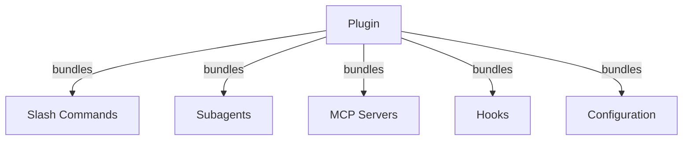
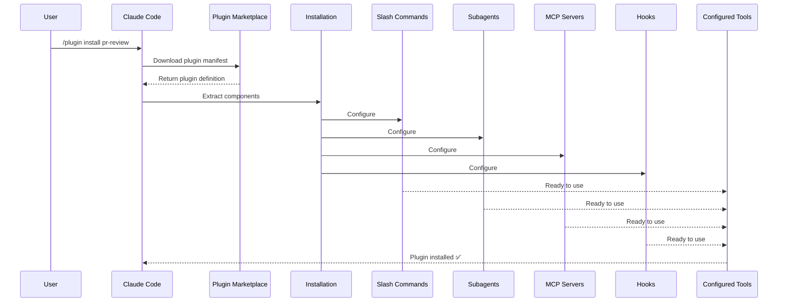
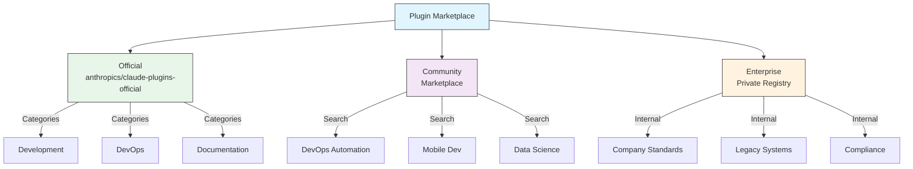
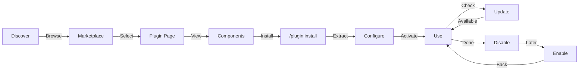
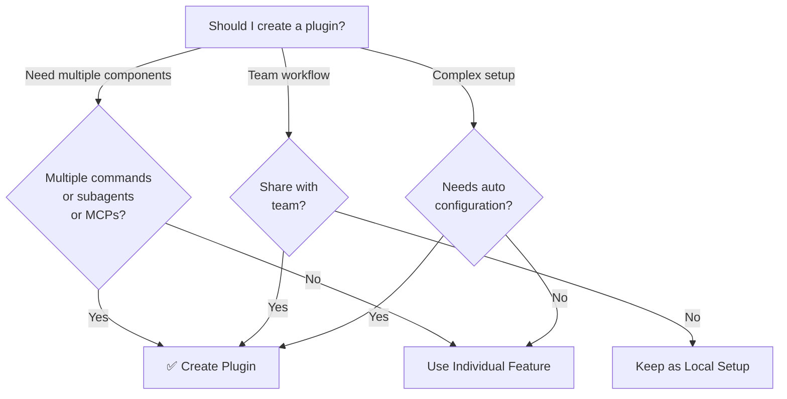

<picture>
  <source media="(prefers-color-scheme: dark)" srcset="../resources/logos/claude-howto-logo-dark.svg">
  
</picture>

# Claude Code 플러그인

이 폴더에는 여러 Claude Code 기능을 하나의 일관되고 설치 가능한 패키지로 묶은 완전한 플러그인 예제가 포함되어 있습니다.

## 개요

Claude Code 플러그인은 하나의 명령으로 설치할 수 있는 사용자 정의 기능(슬래시 명령어, 서브에이전트, MCP 서버, 훅)을 묶어 제공하는 패키지입니다. 이는 여러 기능을 하나의 일관되고 공유 가능한 패키지로 결합하는 가장 상위 수준의 확장 메커니즘입니다.

## 플러그인 아키텍처



## 플러그인 로딩 과정



> **마켓플레이스 불필요(v2.1.157+)**: 이제 `.claude/skills` 디렉터리에 배치된 플러그인은 마켓플레이스 없이 자동으로 로드됩니다. `claude plugin init <name>` 명령으로 새로운 플러그인을 생성할 수 있습니다.

## 플러그인 유형 및 배포

| Type | Scope | Shared | Authority | Examples |
|------|-------|--------|-----------|----------|
| Official | Global | All users | Anthropic | PR Review, Security Guidance |
| Community | Public | All users | Community | DevOps, Data Science |
| Organization | Internal | Team members | Company | Internal standards, tools |
| Personal | Individual | Single user | Developer | Custom workflows |

## 플러그인 정의 구조

플러그인 매니페스트는 `.claude-plugin/plugin.json`에 JSON 형식으로 정의됩니다.

```json
{
  "name": "my-first-plugin",
  "description": "A greeting plugin",
  "version": "1.0.0",
  "author": {
    "name": "Your Name"
  },
  "homepage": "https://example.com",
  "repository": "https://github.com/user/repo",
  "license": "MIT"
}
```

## 플러그인 구조 예시

```
my-plugin/
├── .claude-plugin/
│   └── plugin.json       # Manifest (name, description, version, author)
├── commands/             # Skills as Markdown files
│   ├── task-1.md
│   ├── task-2.md
│   └── workflows/
├── agents/               # Custom agent definitions
│   ├── specialist-1.md
│   ├── specialist-2.md
│   └── configs/
├── skills/               # Agent Skills with SKILL.md files
│   ├── skill-1.md
│   └── skill-2.md
├── hooks/                # Event handlers in hooks.json
│   └── hooks.json
├── .mcp.json             # MCP server configurations
├── .lsp.json             # LSP server configurations for code intelligence
├── bin/                  # Executables added to Bash tool's PATH while plugin is enabled
├── settings.json         # Default settings applied when plugin is enabled (currently only `agent` key supported)
├── themes/               # Optional: ship custom Claude Code themes (v2.1.118+)
├── templates/
│   └── issue-template.md
├── scripts/
│   ├── helper-1.sh
│   └── helper-2.py
├── docs/
│   ├── README.md
│   └── USAGE.md
└── tests/
    └── plugin.test.js
```

### LSP 서버 구성

플러그인은 실시간 코드 인텔리전스를 위한 Language Server Protocol(LSP) 지원을 포함할 수 있습니다. LSP 서버는 작업 중 진단, 코드 탐색, 심볼 정보를 제공합니다.

**구성 위치**:

- 플러그인 루트 디렉터리의 `.lsp.json` 파일
- `plugin.json`의 인라인 `lsp` 키

#### 필드 참조

| Field | Required | Description |
|-------|----------|-------------|
| `command` | Yes | LSP 서버 실행 파일(PATH에 있어야 함) |
| `extensionToLanguage` | Yes | 파일 확장자를 언어 ID에 매핑 |
| `args` | No | 서버 실행 시 사용할 명령줄 인수 |
| `transport` | No | 통신 방식: `stdio`(기본값) 또는 `socket` |
| `env` | No | 서버 프로세스에 전달할 환경 변수 |
| `initializationOptions` | No | LSP 초기화 시 전달되는 옵션 |
| `settings` | No | 워크스페이스 구성 정보 |
| `workspaceFolder` | No | 워크스페이스 폴더 경로 재정의 |
| `startupTimeout` | No | 서버 시작을 기다리는 최대 시간(ms) |
| `shutdownTimeout` | No | 정상 종료를 기다리는 최대 시간(ms) |
| `restartOnCrash` | No | 서버가 비정상 종료되면 자동 재시작 |
| `maxRestarts` | No | 포기하기 전 최대 재시작 횟수 |

#### 구성 예시

**Go (gopls)**:

```json
{
  "go": {
    "command": "gopls",
    "args": ["serve"],
    "extensionToLanguage": {
      ".go": "go"
    }
  }
}
```

**Python (pyright)**:

```json
{
  "python": {
    "command": "pyright-langserver",
    "args": ["--stdio"],
    "extensionToLanguage": {
      ".py": "python",
      ".pyi": "python"
    }
  }
}
```

**TypeScript**:

```json
{
  "typescript": {
    "command": "typescript-language-server",
    "args": ["--stdio"],
    "extensionToLanguage": {
      ".ts": "typescript",
      ".tsx": "typescriptreact",
      ".js": "javascript",
      ".jsx": "javascriptreact"
    }
  }
}
```

#### 사용 가능한 LSP 플러그인

공식 마켓플레이스에는 미리 구성된 LSP 플러그인이 포함되어 있습니다.

| Plugin | Language | Server Binary | Install Command |
|--------|----------|---------------|----------------|
| `pyright-lsp` | Python | `pyright-langserver` | `pip install pyright` |
| `typescript-lsp` | TypeScript/JavaScript | `typescript-language-server` | `npm install -g typescript-language-server typescript` |
| `rust-lsp` | Rust | `rust-analyzer` | Install via `rustup component add rust-analyzer` |

#### LSP 기능

구성이 완료되면 LSP 서버는 다음 기능을 제공합니다.

- **즉각적인 진단** — 편집 후 오류와 경고가 즉시 표시됩니다.
- **코드 탐색** — 정의로 이동, 참조 찾기, 구현 찾기
- **호버 정보** — 마우스를 올리면 타입 시그니처와 문서를 표시
- **심볼 목록** — 현재 파일 또는 워크스페이스의 심볼 탐색

### `bin/` 디렉터리를 `PATH`에 추가

플러그인이 활성화되면 해당 플러그인의 `bin/` 디렉터리가 세션의 `PATH` 앞부분에 추가됩니다. 이 디렉터리에 포함된 실행 파일은 경로를 지정하지 않고도 Bash 도구에서 이름만으로 직접 실행할 수 있습니다.

```bash
# In a plugin layout:
my-plugin/
├── plugin.json
└── bin/
    └── my-tool          # executable file (chmod +x)

# Inside a Claude Code session with the plugin enabled:
$ my-tool --help
```

동일한 플러그인 내부의 훅, 스킬 또는 명령어에서 호출할 CLI 보조 도구를 제공할 때 이 기능을 활용하십시오. 플러그인 저장소에서 파일에 실행 권한(`chmod +x`)을 부여하면 Git이 해당 권한 비트를 유지합니다.

## 플러그인 옵션 (v2.1.83+)

플러그인은 매니페스트의 `userConfig`를 통해 사용자 설정 옵션을 선언할 수 있습니다. `sensitive: true`로 표시된 값은 일반 텍스트 설정 파일이 아니라 시스템 키체인에 저장됩니다.

```json
{
  "name": "my-plugin",
  "version": "1.0.0",
  "userConfig": {
    "apiKey": {
      "description": "API key for the service",
      "sensitive": true
    },
    "region": {
      "description": "Deployment region",
      "default": "us-east-1"
    }
  }
}
```

## 영구 플러그인 데이터 (`${CLAUDE_PLUGIN_DATA}`) (v2.1.78+)

플러그인은 `${CLAUDE_PLUGIN_DATA}` 환경 변수를 통해 영구 상태 디렉터리에 접근할 수 있습니다. 이 디렉터리는 플러그인마다 고유하며 세션이 종료되어도 유지되므로 캐시, 데이터베이스 및 기타 영구 상태 데이터를 저장하는 데 적합합니다.

```json
{
  "hooks": {
    "PostToolUse": [
      {
        "command": "node ${CLAUDE_PLUGIN_DATA}/track-usage.js"
      }
    ]
  }
}
```

이 디렉터리는 플러그인이 설치될 때 자동으로 생성됩니다. 여기에 저장된 파일은 플러그인이 제거될 때까지 유지됩니다.

### 백그라운드 모니터 (v2.1.105)

플러그인은 세션이 시작되거나 플러그인의 스킬이 호출될 때 자동으로 활성화되는 백그라운드 모니터를 등록할 수 있습니다. 플러그인 매니페스트에 최상위 `monitors` 키를 추가하십시오.

```json
{
  "name": "my-plugin",
  "version": "1.0.0",
  "monitors": [
    {
      "command": "tail -f /var/log/app.log",
      "trigger": "session_start"
    }
  ]
}
```
`trigger` 필드는 다음 값을 사용할 수 있습니다.

- `"session_start"` — 세션이 시작될 때 모니터를 자동으로 활성화
- `"skill_invoke"` — 플러그인의 스킬이 호출될 때 모니터를 활성화

모니터는 내부적으로 동일한 Monitor 도구를 사용하며, stdout을 이벤트 스트림으로 전달하여 Claude가 이에 반응할 수 있도록 합니다.

## 설정 파일에서 인라인 플러그인 사용 (`source: 'settings'`) (v2.1.80+)

플러그인은 설정 파일에서 `source: 'settings'` 필드를 사용하여 마켓플레이스 항목으로 인라인 정의할 수 있습니다. 이를 통해 별도의 저장소나 마켓플레이스 없이 플러그인 정의를 직접 포함할 수 있습니다.

```json
{
  "pluginMarketplaces": [
    {
      "name": "inline-tools",
      "source": "settings",
      "plugins": [
        {
          "name": "quick-lint",
          "source": "./local-plugins/quick-lint"
        }
      ]
    }
  ]
}
```

## 플러그인 설정

플러그인은 기본 구성을 제공하기 위해 `settings.json` 파일을 포함할 수 있습니다. 현재는 플러그인의 메인 스레드 에이전트를 지정하는 `agent` 키를 지원합니다.

```json
{
  "agent": "agents/specialist-1.md"
}
```

플러그인에 `settings.json`이 포함되어 있으면 설치 시 해당 기본 설정이 적용됩니다. 사용자는 프로젝트 또는 사용자 설정에서 이를 재정의할 수 있습니다.

## 독립형과 플러그인 방식 비교

| Approach | Command Names | Configuration | Best For |
|----------|---------------|---|---|
| **Standalone** | `/hello` | CLAUDE.md에서 수동 설정 | 개인용, 프로젝트별 사용 |
| **Plugins** | `/plugin-name:hello` | plugin.json을 통한 자동 구성 | 공유, 배포, 팀 사용 |

빠른 개인 워크플로에는 **독립형 슬래시 명령어**를 사용하는 것이 좋습니다. 여러 기능을 하나로 묶거나, 팀과 공유하거나, 배포하려는 경우에는 **플러그인**을 사용하는 것이 적합합니다.

> **공백 구분 호출(v2.1.136+)**: 플러그인 슬래시 명령어는 공백을 사용한 형식도 지원합니다. `/myplugin review`는 정식 형식인 `/myplugin:review`로 해석됩니다. 두 형식 모두 사용할 수 있지만, 스크립트에서는 콜론(`:`) 형식을 권장합니다.

> **`skills/` 자동 검색(v2.1.136+)**: `plugin.json`에 `skills` 항목을 정의해도 플러그인의 기본 `skills/` 디렉터리는 더 이상 숨겨지지 않습니다. 두 위치에 선언된 스킬은 병합되므로, `plugin.json`에는 주요 스킬만 나열하고 나머지는 `skills/` 디렉터리에 그대로 둘 수 있습니다.

> **루트 수준 `SKILL.md` 플러그인(v2.1.142+)**: 최상위에 `SKILL.md`가 있고 **`skills/` 하위 디렉터리가 없는** 플러그인은 하나의 스킬로 노출됩니다. 즉, 플러그인 자체가 하나의 스킬이 됩니다. 이는 `skills/` 디렉터리나 `plugin.json`의 `skills` 항목을 대체하는 것이 아니라 추가적인 패턴이며, 디렉터리 구조가 불필요한 단일 스킬 플러그인에 적합합니다.

## 실용적인 예제

### 예제 1: PR Review 플러그인

**파일:** `.claude-plugin/plugin.json`

```json
{
  "name": "pr-review",
  "version": "1.0.0",
  "description": "Complete PR review workflow with security, testing, and docs",
  "author": {
    "name": "Anthropic"
  },
  "repository": "https://github.com/your-org/pr-review",
  "license": "MIT"
}
```

**파일:** `commands/review-pr.md`

```markdown
---
name: Review PR
description: Start comprehensive PR review with security and testing checks
---

# PR Review

이 명령은 다음을 포함한 전체 풀 리퀘스트 검토를 시작합니다.

1. 보안 분석
2. 테스트 커버리지 검증
3. 문서 업데이트
4. 코드 품질 점검
5. 성능 영향 평가
```

**파일:** `agents/security-reviewer.md`

```yaml
---
name: security-reviewer
description: Security-focused code review
tools: read, grep, diff
---

# Security Reviewer

Specializes in finding security vulnerabilities:
- Authentication/authorization issues
- Data exposure
- Injection attacks
- Secure configuration
```

**설치:**

```bash
/plugin install pr-review

# Result:
# ✅ 3 slash commands installed
# ✅ 3 subagents configured
# ✅ 2 MCP servers connected
# ✅ 4 hooks registered
# ✅ Ready to use!
```

### 예제 2: DevOps 플러그인

**구성 요소:**

```
devops-automation/
├── commands/
│   ├── deploy.md
│   ├── rollback.md
│   ├── status.md
│   └── incident.md
├── agents/
│   ├── deployment-specialist.md
│   ├── incident-commander.md
│   └── alert-analyzer.md
├── mcp/
│   ├── github-config.json
│   ├── kubernetes-config.json
│   └── prometheus-config.json
├── hooks/
│   ├── pre-deploy.js
│   ├── post-deploy.js
│   └── on-error.js
└── scripts/
    ├── deploy.sh
    ├── rollback.sh
    └── health-check.sh
```

### 예제 3: Documentation 플러그인

**포함된 구성 요소:**

```
documentation/
├── commands/
│   ├── generate-api-docs.md
│   ├── generate-readme.md
│   ├── sync-docs.md
│   └── validate-docs.md
├── agents/
│   ├── api-documenter.md
│   ├── code-commentator.md
│   └── example-generator.md
├── mcp/
│   ├── github-docs-config.json
│   └── slack-announce-config.json
└── templates/
    ├── api-endpoint.md
    ├── function-docs.md
    └── adr-template.md
```

## 플러그인 마켓플레이스

공식 Anthropic 관리 플러그인 디렉터리는 `anthropics/claude-plugins-official`입니다. Enterprise 관리자는 내부 배포를 위한 전용 플러그인 마켓플레이스를 생성할 수도 있습니다.



### 마켓플레이스 구성

Enterprise 사용자와 고급 사용자는 설정을 통해 마켓플레이스 동작을 제어할 수 있습니다.

| Setting | Description |
|---------|-------------|
| `extraKnownMarketplaces` | 기본값 외에 추가 마켓플레이스 소스를 등록 |
| `strictKnownMarketplaces` | 사용자가 추가할 수 있는 마켓플레이스를 제한(관리자 전용) |
| `blockedMarketplaces` | 관리자가 차단한 마켓플레이스 목록(v2.1.119부터 `hostPattern` / `pathPattern` 정규식 지원) |
| `deniedPlugins` | 특정 플러그인의 설치를 차단하는 관리자 관리 목록 |

> **적용 범위** (v2.1.117+): `blockedMarketplaces`와 `strictKnownMarketplaces`는 최초 추가 시뿐만 아니라 설치, 업데이트, 새로 고침, 자동 업데이트 등 모든 플러그인 생명주기 이벤트에 적용됩니다. `strictKnownMarketplaces`는 관리자 전용 기능입니다.

호스트/경로 정규식을 사용하는 `blockedMarketplaces` 예시(v2.1.119):

```json
{
  "blockedMarketplaces": [
    {
      "hostPattern": "^evil\\.example\\.com$",
      "pathPattern": "^/marketplaces/.*"
    }
  ]
}
```

### 추가 마켓플레이스 기능

- **마켓플레이스 검색창(v2.1.172)**: `/plugin`에서 마켓플레이스를 탐색할 때 이름이나 키워드로 플러그인을 검색할 수 있는 검색창이 제공됩니다. 플러그인이 많은 마켓플레이스에서 특히 유용합니다.
- **기본 Git 타임아웃**: 대규모 플러그인 저장소를 위해 기본 타임아웃이 30초에서 120초로 증가했습니다.
- **사용자 지정 npm 레지스트리**: 플러그인은 의존성 해결을 위해 사용자 지정 npm 레지스트리 URL을 지정할 수 있습니다.
- **버전 고정(Version pinning)**: 재현 가능한 환경을 위해 특정 플러그인 버전에 고정할 수 있습니다.
- **브라우저 패널의 예상 컨텍스트 비용(v2.1.143)**: `/plugin` 마켓플레이스 브라우저는 각 플러그인의 턴당 예상 컨텍스트 토큰 비용을 표시합니다. 이는 항상 로드되는 스킬, 훅, MCP 서버 설명자의 합계입니다. 설치 전에 플러그인 도입 비용을 예측하는 데 활용할 수 있으며, 설치 후에는 [`claude plugin details <name>`](#claude-plugin-details-name-v21139)에서도 동일한 정보를 확인할 수 있습니다.

비용 열이 포함된 브라우저 표시 예시:

```text
NAME              VERSION   AUTHOR     CTX/TURN   DESCRIPTION
code-reviewer     1.2.0     anthropic  +1,420     Multi-agent PR review
devops-toolkit    0.4.1     acme       +3,180     SRE playbooks, on-call helpers
docs-helper       0.9.0     community  +610       Doc-style guide enforcement
```

### 마켓플레이스 정의 스키마

플러그인 마켓플레이스는 `.claude-plugin/marketplace.json`에 정의됩니다.

```json
{
  "name": "my-team-plugins",
  "owner": "my-org",
  "plugins": [
    {
      "name": "code-standards",
      "source": "./plugins/code-standards",
      "description": "Enforce team coding standards",
      "version": "1.2.0",
      "author": "platform-team"
    },
    {
      "name": "deploy-helper",
      "source": {
        "source": "github",
        "repo": "my-org/deploy-helper",
        "ref": "v2.0.0"
      },
      "description": "Deployment automation workflows"
    }
  ]
}
```

| Field | Required | Description |
|-------|----------|-------------|
| `name` | Yes | kebab-case 형식의 마켓플레이스 이름 |
| `owner` | Yes | 마켓플레이스를 유지 관리하는 조직 또는 사용자 |
| `plugins` | Yes | 플러그인 항목 배열 |
| `plugins[].name` | Yes | 플러그인 이름(kebab-case) |
| `plugins[].source` | Yes | 플러그인 소스(경로 문자열 또는 소스 객체) |
| `plugins[].description` | No | 플러그인에 대한 간단한 설명 |
| `plugins[].version` | No | 시맨틱 버전 문자열 |
| `plugins[].author` | No | 플러그인 작성자 이름 |

### 플러그인 소스 유형

플러그인은 여러 위치에서 가져올 수 있습니다.

| 소스 | 문법 | 예시 |
|--------|--------|---------|
| **상대 경로** | 문자열 경로 | `"./plugins/my-plugin"` |
| **GitHub** | `{ "source": "github", "repo": "owner/repo" }` | `{ "source": "github", "repo": "acme/lint-plugin", "ref": "v1.0" }` |
| **Git URL** | `{ "source": "url", "url": "..." }` | `{ "source": "url", "url": "https://git.internal/plugin.git" }` |
| **Git 하위 디렉터리** | `{ "source": "git-subdir", "url": "...", "path": "..." }` | `{ "source": "git-subdir", "url": "https://github.com/org/monorepo.git", "path": "packages/plugin" }` |
| **npm** | `{ "source": "npm", "package": "..." }` | `{ "source": "npm", "package": "@acme/claude-plugin", "version": "^2.0" }` |
| **pip** | `{ "source": "pip", "package": "..." }` | `{ "source": "pip", "package": "claude-data-plugin", "version": ">=1.0" }` |

GitHub 및 git 소스는 버전 고정을 위해 선택적으로 `ref`(브랜치/태그) 및 `sha`(커밋 해시) 필드를 지원합니다.

### 배포 방법

**GitHub(권장)**:
```bash
# Users add your marketplace
/plugin marketplace add owner/repo-name
```

**기타 git 서비스**(전체 URL 필요):
```bash
/plugin marketplace add https://gitlab.com/org/marketplace-repo.git
```

**비공개 저장소**: git 자격 증명 도우미(git credential helpers) 또는 환경 변수 토큰을 통해 지원됩니다. 사용자는 저장소에 대한 읽기 권한을 가지고 있어야 합니다.

**공식 마켓플레이스 등록**: 더 넓은 배포를 위해 Anthropic에서 큐레이션하는 마켓플레이스에 플러그인을 등록하려면 [claude.ai/settings/plugins/submit](https://claude.ai/settings/plugins/submit) 또는 [platform.claude.com/plugins/submit](https://platform.claude.com/plugins/submit)을 이용하십시오.

### 마켓플레이스 관리

```bash
# Marketplace CLI commands
claude plugin marketplace add <source>       # Add marketplace (GitHub, URL, local)
claude plugin marketplace update [name]      # Refresh catalog index
claude plugin marketplace remove <name>      # Remove marketplace
claude plugin marketplace list               # List configured marketplaces
```

> **중요**: `marketplace update`는 플러그인 카탈로그(설치 가능한 플러그인 목록)만 새로 고칩니다. 설치된 플러그인은 업데이트하지 않습니다. 설치된 특정 플러그인을 업데이트하려면 `plugin update <name>`을 사용하십시오.

### Strict 모드

마켓플레이스 정의가 로컬 `plugin.json` 파일과 상호 작용하는 방식을 제어합니다.

| 설정 | 동작 |
|---------|----------|
| `strict: true` (default) | 로컬 `plugin.json`이 기준이 되며, 마켓플레이스 항목은 이를 보완합니다. |
| `strict: false` | 마켓플레이스 항목이 전체 플러그인 정의가 됩니다. |

**`strictKnownMarketplaces`를 사용한 조직 제한**:

| 값 | 효과 |
|-------|--------|
| 설정되지 않음 | 제한 없음 — 사용자는 어떤 마켓플레이스든 추가할 수 있습니다. |
| 빈 배열 `[]` | 완전 제한 — 어떤 마켓플레이스도 허용되지 않습니다. |
| 패턴 배열 | 허용 목록 — 일치하는 마켓플레이스만 추가할 수 있습니다. |

```json
{
  "strictKnownMarketplaces": [
    "my-org/*",
    "github.com/trusted-vendor/*"
  ]
}
```

> **경고**: `strictKnownMarketplaces`가 적용된 strict 모드에서는 사용자가 허용 목록에 포함된 마켓플레이스의 플러그인만 설치할 수 있습니다. 이는 플러그인 배포를 통제해야 하는 엔터프라이즈 환경에 유용합니다.

## 플러그인 설치 및 수명 주기



## 플러그인 기능 비교

| 기능 | Slash Command | Skill | Subagent | Plugin |
|---------|---------------|-------|----------|--------|
| **Installation** | 수동 복사 | 수동 복사 | 수동 설정 | 명령 한 번 |
| **Setup Time** | 5분 | 10분 | 15분 | 2분 |
| **Bundling** | 단일 파일 | 단일 파일 | 단일 파일 | 여러 파일 |
| **Versioning** | 수동 | 수동 | 수동 | 자동 |
| **Team Sharing** | 파일 복사 | 파일 복사 | 파일 복사 | 설치 ID |
| **Updates** | 수동 | 수동 | 수동 | 자동 제공 |
| **Dependencies** | 없음 | 없음 | 없음 | 포함될 수 있음 |
| **Marketplace** | 아니요 | 아니요 | 아니요 | 예 |
| **Distribution** | 저장소 | 저장소 | 저장소 | 마켓플레이스 |

## 플러그인 CLI 명령

모든 플러그인 작업은 CLI 명령으로 사용할 수 있습니다.

```bash
claude plugin install <name>@<marketplace>   # Install from a marketplace
claude plugin uninstall <name>               # Remove a plugin
claude plugin update <name>                  # Update installed plugin to latest version
claude plugin list                           # List installed plugins
claude plugin enable <name>                  # Enable a disabled plugin
claude plugin disable <name>                 # Disable a plugin
claude plugin validate                       # Validate plugin structure
claude plugin tag <version>                  # Create a release git tag with version validation (v2.1.118+)
claude plugin prune                          # Remove orphaned auto-installed plugin dependencies (v2.1.121+)
claude plugin uninstall <name> --prune       # Uninstall and cascade-clean orphaned dependencies (v2.1.121+)
claude plugin details <name>                 # Show inventory + projected per-turn token cost (v2.1.139+)
```

예시: `claude plugin tag v0.3.0`은 버전 형식을 검증하고, 해당하는 git 태그를 생성하며, 배포를 위한 플러그인 릴리스를 만드는 권장 방법입니다.

`claude plugin prune`은 자체 의존성을 함께 설치한 마켓플레이스 플러그인을 설치하거나 제거한 후 유용합니다. 상위 플러그인이 제거되어 더 이상 필요하지 않은 자동 설치 플러그인을 삭제합니다. `plugin uninstall --prune`은 동일한 정리 작업을 한 번에 수행합니다.

> **의존성 적용(v2.1.143)**: `claude plugin disable <name>`은 다른 활성화된 플러그인이 대상 플러그인에 여전히 의존하고 있는 경우(의존성 그래프가 깨지는 경우) **실행이 거부됩니다**. `claude plugin enable <name>`은 각 의존성을 개별적으로 활성화할 필요 없이 한 번의 확인만으로 **전이 의존성을 모두 강제로 활성화합니다**. 이후 종속 플러그인이 제거되어 더 이상 필요하지 않은 의존성을 정리하려면 `claude plugin prune`을 사용하십시오.

### `claude plugin details <name>` (v2.1.139+)

`claude plugin details <name>`은 플러그인의 전체 구성 요소 목록(스킬, 훅, MCP 서버, LSP 서버, 백그라운드 모니터, 슬래시 명령어)과 **턴당(및 호출당) 예상 토큰 비용**을 출력합니다. 특히 컨텍스트가 제한된 모델에서 플러그인을 도입하기 전에 규모를 파악하는 데 유용합니다.

예시 출력(일부 생략):

```text
plugin: code-reviewer (1.2.0)
skills:        3      hooks: 2      mcp: 1      lsp: 0      monitors: 0
commands:      /review, /security-review
projected ctx: +1,420 tokens per turn  ·  +9,800 tokens per /review invocation
```

LSP 서버는 v2.1.142에서 세부 정보 화면에 추가되었습니다. 또한 [플러그인 마켓플레이스](#플러그인-마켓플레이스)에서 설명하는 마켓플레이스 탐색 화면의 예상 컨텍스트 비용(v2.1.143+)도 참고하십시오.

## 설치 방법

### 마켓플레이스에서 설치

```bash
/plugin install plugin-name
# or from CLI:
claude plugin install plugin-name@marketplace-name
```

### 활성화 / 비활성화(범위 자동 감지)
```bash
/plugin enable plugin-name
/plugin disable plugin-name
```

`/plugin` 인터페이스는 사용하지 않는 플러그인을 표시하여 정리할 수 있도록 지원합니다(v2.1.187+). 또한 플러그인의 `plugin.json`에 있는 `name`이 마켓플레이스 항목 이름과 다른 경우에도 활성화/비활성화가 가능합니다(v2.1.195+).

### 설치된 플러그인 목록 보기(v2.1.163)
현재 세션에서 어떤 플러그인이 활성화되어 있는지 확인합니다.
```bash
/plugin list             # all installed plugins
/plugin list --enabled   # only enabled plugins
/plugin list --disabled  # only disabled plugins
```

### 로컬 플러그인(개발용)
```bash
# CLI flag for local testing (repeatable for multiple plugins)
claude --plugin-dir ./path/to/plugin
claude --plugin-dir ./plugin-a --plugin-dir ./plugin-b

# --plugin-dir also accepts a .zip archive path (v2.1.128+)
claude --plugin-dir ./my-plugin.zip

# Fetch a plugin .zip archive from a URL for the current session (v2.1.129+, repeatable)
claude --plugin-url https://example.com/releases/my-plugin-0.3.0.zip
```

### Git 저장소에서 설치
```bash
/plugin install github:username/repo
```

## 자동 업데이트

Claude Code는 시작 시 마켓플레이스와 설치된 플러그인을 자동으로 업데이트할 수 있습니다.

| 마켓플레이스 유형 | 기본 자동 업데이트 | 변경 방법 |
|------------------|---------------------|---------------|
| 공식 (`claude-plugins-official`) | ✅ 활성화 | `/plugin` → Marketplaces → 선택 |
| 서드파티 / 로컬 | ❌ 비활성화 | 동일한 UI 경로 |

자동 업데이트가 실행되면 Claude Code는 다음 작업을 수행합니다.

1. 마켓플레이스 카탈로그를 새로 고칩니다.
2. 설치된 플러그인을 최신 버전으로 업데이트합니다.
3. `/reload-plugins` 실행을 안내하는 알림을 표시합니다.

### 환경 변수

| 변수 | 효과 |
|----------|--------|
| `DISABLE_AUTOUPDATER=1` | 모든 자동 업데이트 비활성화(Claude Code + 플러그인) |
| `DISABLE_AUTOUPDATER=1` + `FORCE_AUTOUPDATE_PLUGINS=1` | Claude Code 업데이트는 비활성화하고 플러그인 업데이트는 유지 |
| `CLAUDE_CODE_PLUGIN_PREFER_HTTPS=1` | (v2.1.141+) SSH 원격 저장소가 있어도 `claude plugin install`이 GitHub 플러그인 소스를 SSH 대신 HTTPS로 복제하도록 강제합니다. SSH 키가 없는 CI 실행기나 컨테이너에서 사용하십시오. |

```bash
# Disable all auto-updates
export DISABLE_AUTOUPDATER=1

# Keep plugin auto-updates only
export DISABLE_AUTOUPDATER=1
export FORCE_AUTOUPDATE_PLUGINS=1

# CI runner without SSH keys — force HTTPS for plugin installs
export CLAUDE_CODE_PLUGIN_PREFER_HTTPS=1
claude plugin install code-reviewer@anthropic
```

> **원격 세션 플러그인 로딩(v2.1.179)**: v2.1.179에서는 원격 세션의 플러그인 로딩 성능이 개선되어 원격 세션에 연결하면 플러그인을 더 빠르게 사용할 수 있습니다.

## 플러그인을 만들어야 하는 경우



### 플러그인 사용 사례

| Use Case | Recommendation | Why |
|----------|-----------------|-----|
| **Team Onboarding** | ✅ Use Plugin | Instant setup, all configurations |
| **Framework Setup** | ✅ Use Plugin | Bundles framework-specific commands |
| **Enterprise Standards** | ✅ Use Plugin | Central distribution, version control |
| **Quick Task Automation** | ❌ Use Command | Overkill complexity |
| **Single Domain Expertise** | ❌ Use Skill | Too heavy, use skill instead |
| **Specialized Analysis** | ❌ Use Subagent | Create manually or use skill |
| **Live Data Access** | ❌ Use MCP | Standalone, don't bundle |

## 플러그인 테스트

게시하기 전에 `--plugin-dir` CLI 플래그(여러 플러그인 지정 가능)를 사용하여 로컬에서 플러그인을 테스트하십시오.

```bash
claude --plugin-dir ./my-plugin
claude --plugin-dir ./my-plugin --plugin-dir ./another-plugin

# --plugin-dir accepts .zip archives in addition to directories (v2.1.128+)
claude --plugin-dir ./my-plugin.zip

# --plugin-url fetches a plugin .zip from a URL for this session (v2.1.129+, repeatable)
claude --plugin-url https://example.com/releases/my-plugin-0.3.0.zip
```

이렇게 하면 플러그인이 로드된 상태로 Claude Code가 실행되며 다음 사항을 확인할 수 있습니다.

- 모든 슬래시 명령어가 사용 가능한지 확인
- Subagent 및 Agent가 정상적으로 동작하는지 테스트
- MCP 서버가 정상적으로 연결되는지 확인
- Hook 실행 검증
- LSP 서버 구성 확인
- 구성 오류 여부 확인

## Hot-Reload

플러그인은 개발 중 Hot-Reload를 지원합니다. 플러그인 파일을 수정하면 Claude Code가 변경 사항을 자동으로 감지할 수 있습니다. 다음 명령으로 강제로 다시 로드할 수도 있습니다.

```bash
/reload-plugins
```

This re-reads all plugin manifests, commands, agents, skills, hooks, and MCP/LSP configurations without restarting the session.

## 플러그인 관리 설정

관리자는 관리 설정을 사용하여 조직 전체에서 플러그인 동작을 제어할 수 있습니다.

| 설정 | 설명 |
|---------|-------------|
| `enabledPlugins` | 기본적으로 활성화할 플러그인 허용 목록 |
| `deniedPlugins` | 설치를 금지할 플러그인 차단 목록 |
| `extraKnownMarketplaces` | 기본값 외에 추가 마켓플레이스 소스를 등록 |
| `strictKnownMarketplaces` | 사용자가 추가할 수 있는 마켓플레이스를 제한(관리 설정 전용, v2.1.117부터 모든 플러그인 수명 주기 이벤트에서 적용) |
| `blockedMarketplaces` | 마켓플레이스 차단 목록(v2.1.117부터 모든 플러그인 수명 주기 이벤트에서 적용, v2.1.119부터 `hostPattern` / `pathPattern` 정규식 필드 지원) |
| `allowedChannelPlugins` | 릴리스 채널별 허용 플러그인 제어 |

이 설정은 관리 구성 파일을 통해 조직 수준에서 적용할 수 있으며 사용자 수준 설정보다 우선합니다.

## 플러그인 보안

플러그인 Subagent는 제한된 샌드박스에서 실행됩니다. 플러그인 Subagent 정의에서는 다음 frontmatter 키를 **사용할 수 없습니다**.

- `hooks` -- Subagent는 이벤트 핸들러를 등록할 수 없습니다.
- `mcpServers` -- Subagent는 MCP 서버를 구성할 수 없습니다.
- `permissionMode` -- Subagent는 권한 모델을 재정의할 수 없습니다.

이를 통해 플러그인이 선언된 범위를 넘어 권한을 상승시키거나 호스트 환경을 수정하지 못하도록 보장합니다.

## 플러그인 게시

**게시 절차:**

1. 모든 구성 요소를 포함한 플러그인 구조 생성
2. `.claude-plugin/plugin.json` 매니페스트 작성
3. 문서가 포함된 `README.md` 작성
4. `claude --plugin-dir ./my-plugin`으로 로컬 테스트
5. `claude plugin tag v0.3.0`으로 릴리스 태그 생성(v2.1.118+) — 버전 문자열을 검증하고 일치하는 git 태그 생성
6. 플러그인 마켓플레이스에 제출
7. 검토 및 승인
8. 마켓플레이스에 게시
9. 사용자는 명령 한 번으로 설치 가능

**제출 예시:**

```markdown
# PR Review 플러그인

## 설명

보안, 테스트 및 문서화 검사를 포함하는 완전한 PR 검토 워크플로입니다.

## 포함된 구성 요소

- 다양한 검토 유형을 위한 슬래시 명령어 3개
- 특화된 Subagent 3개
- GitHub 및 CodeQL MCP 통합
- 자동화된 보안 스캔 Hook
```

## 설치

```bash
/plugin install pr-review
```

## 기능

✅ 보안 분석
✅ 테스트 커버리지 확인
✅ 문서 검증
✅ 코드 품질 평가
✅ 성능 영향 분석

## 사용 방법

```bash
/review-pr
/check-security
/check-tests
```

## 요구 사항

- Claude Code 1.0+
- GitHub 접근 권한
- CodeQL(선택 사항)

## 플러그인과 수동 구성 비교

**수동 설정(2시간 이상):**

- 슬래시 명령어를 하나씩 설치
- Subagent를 개별적으로 생성
- MCP를 각각 구성
- Hook을 수동으로 설정
- 모든 내용을 문서화
- 팀과 공유(올바르게 구성되기를 기대)

**플러그인 사용(2분):**

```bash
/plugin install pr-review
# ✅ Everything installed and configured
# ✅ Ready to use immediately
# ✅ Team can reproduce exact setup
```

## 모범 사례

### 권장 사항 ✅

- 명확하고 설명적인 플러그인 이름 사용
- 포괄적인 README 포함
- 시맨틱 버전(semver)을 사용하여 버전 관리
- 모든 구성 요소를 함께 테스트
- 요구 사항을 명확하게 문서화
- 사용 예제 제공
- 오류 처리 포함
- 검색이 쉽도록 적절한 태그 사용
- 이전 버전과의 호환성 유지
- 플러그인의 목적을 명확하고 일관되게 유지
- 충분한 테스트 포함
- 모든 의존성 문서화

### 피해야 할 사항 ❌

- 관련 없는 기능을 하나의 플러그인에 묶지 마십시오.
- 자격 증명을 코드에 하드코딩하지 마십시오.
- 테스트를 생략하지 마십시오.
- 문서 작성을 잊지 마십시오.
- 중복되는 플러그인을 만들지 마십시오.
- 버전 관리를 무시하지 마십시오.
- 구성 요소 간 의존성을 불필요하게 복잡하게 만들지 마십시오.
- 오류를 적절하게 처리하는 것을 잊지 마십시오.

## 설치 안내

### 마켓플레이스에서 설치

1. **사용 가능한 플러그인 목록 보기**

   ```bash
   /plugin list
   ```

2. **플러그인 상세 정보 확인**

   ```bash
   /plugin info plugin-name
   ```

3. **플러그인 설치**

   ```bash
   /plugin install plugin-name
   ```

### 로컬 경로에서 설치

```bash
/plugin install ./path/to/plugin-directory
```

### GitHub에서 설치

```bash
/plugin install github:username/repo
```

### 설치된 플러그인 목록 보기

```bash
/plugin list --installed
```

### 플러그인 업데이트

```bash
/plugin update plugin-name
```

### 플러그인 비활성화/활성화

```bash
# Temporarily disable
/plugin disable plugin-name

# Re-enable
/plugin enable plugin-name
```

### 플러그인 제거

```bash
/plugin uninstall plugin-name
```

## 관련 개념

다음 Claude Code 기능은 플러그인과 함께 사용할 수 있습니다.

- **[Slash Commands](../01-slash-commands/)** - 플러그인에 포함되는 개별 명령어
- **[Memory](../02-memory/)** - 플러그인을 위한 영구 컨텍스트
- **[Skills](../03-skills/)** - 플러그인으로 패키징할 수 있는 도메인 전문성
- **[Subagents](../04-subagents/)** - 플러그인 구성 요소로 포함되는 특화된 에이전트
- **[MCP Servers](../05-mcp/)** - 플러그인에 포함되는 Model Context Protocol 통합
- **[Hooks](../06-hooks/)** - 플러그인 워크플로를 실행하는 이벤트 핸들러

## 전체 예제 워크플로

### PR Review 플러그인 전체 워크플로

```
1. 사용자: /review-pr

2. 플러그인 실행:
   ├── pre-review.js Hook이 Git 저장소를 검증
   ├── GitHub MCP가 PR 데이터를 가져옴
   ├── security-reviewer Subagent가 보안을 분석
   ├── test-checker Subagent가 테스트 커버리지를 검증
   └── performance-analyzer Subagent가 성능을 확인

3. 결과를 종합하여 표시:
   ✅ 보안: 심각한 문제 없음
   ⚠️  테스트: 커버리지 65% (80% 이상 권장)
   ✅ 성능: 유의미한 영향 없음
   📝 12개의 권장 사항 제공
```


## 문제 해결

### 플러그인이 설치되지 않는 경우

- Claude Code 버전 호환성 확인: `/version`
- JSON 검증 도구를 사용하여 `plugin.json` 문법 확인
- 인터넷 연결 확인(원격 플러그인인 경우)
- 권한 확인: `ls -la plugin/`

### 구성 요소가 로드되지 않는 경우

- `plugin.json`의 경로가 실제 디렉터리 구조와 일치하는지 확인
- 파일 권한 확인: `chmod +x scripts/`
- 구성 요소 파일의 문법 확인
- 로그 확인: `/plugin debug plugin-name`

### MCP 연결 실패

- 환경 변수가 올바르게 설정되었는지 확인
- MCP 서버가 정상적으로 설치 및 실행 중인지 확인
- `/mcp test`로 MCP 연결을 독립적으로 테스트
- `mcp/` 디렉터리의 MCP 구성 확인

### 설치 후 명령어를 사용할 수 없는 경우

- 플러그인이 정상적으로 설치되었는지 확인: `/plugin list --installed`
- 플러그인이 활성화되어 있는지 확인: `/plugin status plugin-name`
- Claude Code를 종료(`exit`)한 후 다시 실행
- 기존 명령어와 이름이 충돌하는지 확인

### Hook 실행 문제

- Hook 파일의 권한이 올바른지 확인
- Hook 문법과 이벤트 이름 확인
- Hook 로그에서 오류 세부 정보 확인
- 가능하면 Hook을 수동으로 테스트

## 추가 자료

- [Official Plugins Documentation](https://code.claude.com/docs/en/plugins)
- [Discover Plugins](https://code.claude.com/docs/en/discover-plugins)
- [Plugin Marketplaces](https://code.claude.com/docs/en/plugin-marketplaces)
- [Plugins Reference](https://code.claude.com/docs/en/plugins-reference)
- [MCP Server Reference](https://modelcontextprotocol.io/)
- [Subagent Configuration Guide](../04-subagents/README.md)
- [Hook System Reference](../06-hooks/README.md)

---

**마지막 업데이트**: 2026년 6월 28일
**Claude Code 버전**: 2.1.195
**출처**:
- https://code.claude.com/docs/en/plugins
- https://code.claude.com/docs/en/changelog#2-1-172
- https://code.claude.com/docs/en/changelog
- https://code.claude.com/docs/en/slash-commands
- https://code.claude.com/docs/en/plugin-marketplaces
- https://github.com/anthropics/claude-code/releases/tag/v2.1.117
- https://github.com/anthropics/claude-code/releases/tag/v2.1.118
- https://github.com/anthropics/claude-code/releases/tag/v2.1.131
- https://github.com/anthropics/claude-code/releases/tag/v2.1.138
- https://github.com/anthropics/claude-code/releases/tag/v2.1.139
- https://github.com/anthropics/claude-code/releases/tag/v2.1.141
- https://github.com/anthropics/claude-code/releases/tag/v2.1.142
- https://github.com/anthropics/claude-code/releases/tag/v2.1.143
- https://code.claude.com/docs/en/cli-reference
**호환 모델**: Claude Sonnet 4.6, Claude Opus 4.8, Claude Haiku 4.5
