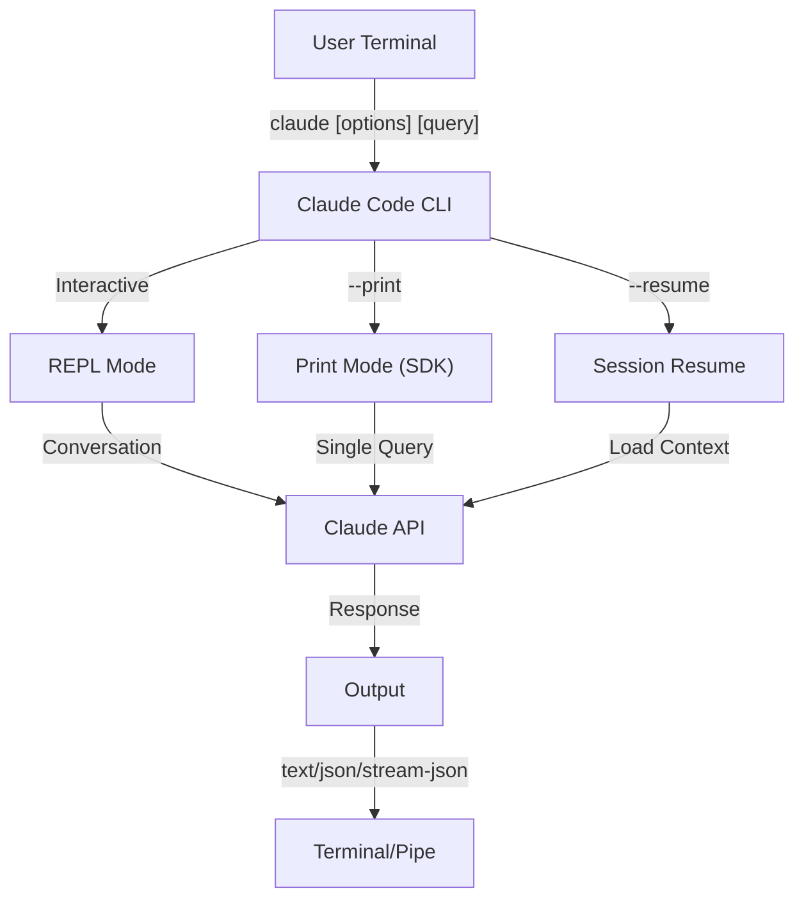
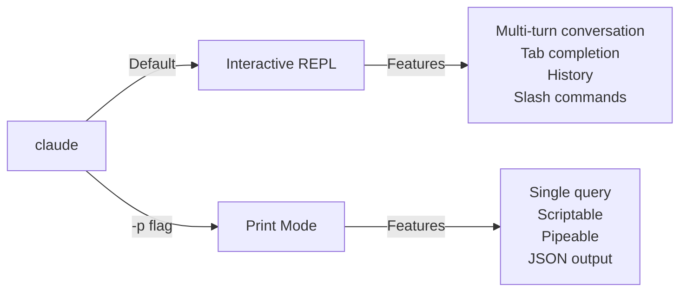

<picture>
  <source media="(prefers-color-scheme: dark)" srcset="../resources/logos/claude-howto-logo-dark.svg">
  
</picture>

# CLI 참조

## 개요

Claude Code CLI(명령줄 인터페이스)는 Claude Code와 상호 작용하는 주요 방법입니다. 이 CLI는 쿼리를 실행하고, 세션을 관리하며, 모델을 구성하고, Claude를 개발 워크플로에 통합하기 위한 강력한 옵션을 제공합니다.

## 아키텍처



## 런타임 및 패키징

**v2.1.113**부터 Claude Code CLI는 선택적 npm 종속성을 통해 **플랫폼별 네이티브 바이너리**(macOS, Linux, Windows)를 시작합니다. 이 바이너리는 설치 시 운영체제 및 아키텍처에 맞춰지며, 이전 번들 JavaScript 런타임은 더 이상 macOS 또는 Linux의 기본값이 아닙니다.

**사용자 대상 설치는 변경되지 않았습니다**: `npm install -g @anthropic-ai/claude-code`는 여전히 작동하며 권장 경로로 남아 있습니다. 내부적으로 npm은 사용자의 플랫폼에 맞는 올바른 네이티브 바이너리를 가져옵니다.

**다운로드 호스트** (v2.1.116+): 네이티브 바이너리 아티팩트는 `https://downloads.claude.ai/claude-code-releases`에서 제공됩니다.

> **기업 / 프록시 사용자**: 네트워크에서 명시적인 허용 목록이 필요한 경우, `downloads.claude.ai` (및 `https://downloads.claude.ai/claude-code-releases`)를 프록시 egress 규칙에 추가하십시오. 이전에 `storage.googleapis.com` 또는 npm 레지스트리만 허용 목록에 추가했던 환경은 업데이트해야 하며, 그렇지 않으면 `claude update` 및 초기 설치가 실패합니다.

이전 JavaScript 번들은 Windows 및 해당 번들에 고정된 환경을 위해 여전히 생성됩니다. 이러한 설치는 Glob 및 Grep을 일등 도구로 계속 제공합니다([도구 및 권한 관리](#도구-및-권한-관리) 섹션의 Glob/Grep 각주 참조).

## CLI 명령

| Command | Description | Example |
|---------|-------------|---------|
| `claude` | 대화형 REPL을 시작합니다 | `claude` |
| `claude "query"` | 초기 프롬프트로 REPL을 시작합니다 | `claude "explain this project"` |
| `claude -p "query"` | 인쇄 모드 - 쿼리 후 종료합니다 | `claude -p "explain this function"` |
| `cat file \| claude -p "query"` | 파이프된 콘텐츠를 처리합니다 | `cat logs.txt \| claude -p "explain"` |
| `claude -c` | 가장 최근 대화를 계속합니다 | `claude -c` |
| `claude -c -p "query"` | 인쇄 모드에서 계속합니다 | `claude -c -p "check for type errors"` |
| `claude -r "<session>" "query"` | ID 또는 이름으로 세션을 재개합니다 | `claude -r "auth-refactor" "finish this PR"` |
| `claude update` | 최신 버전으로 업데이트합니다 | `claude update` |
| `/doctor` (slash command) | 설치, 구성 및 플러그인 상태를 진단합니다. v2.1.116부터 Claude가 응답 중일 때도 열 수 있으며, 상태 아이콘을 인라인으로 표시하고, 감지된 문제를 자동으로 해결하기 위해 `f` 키 입력을 받습니다. v2.1.178에서는 레이아웃이 더 명확한 상태 아이콘과 강조된 명령이 있는 평면 트리로 새로 고쳐졌습니다 | REPL 내에서 `/doctor`를 실행합니다 |
| `claude mcp` | MCP 서버를 구성합니다 (인증을 위한 `login`/`logout` 포함, v2.1.186+). | [MCP 문서](../05-mcp/)를 참조하십시오 |
| `claude mcp serve` | Claude Code를 MCP 서버로 실행합니다 | `claude mcp serve` |
| `claude agents` | **에이전트 뷰**를 엽니다 (연구 미리보기, v2.1.139+) — 모든 Claude Code 세션을 상태와 함께 나열하는 다중 세션 관리자입니다. 아래 [에이전트 뷰](#에이전트-뷰-claude-agents-v21139)를 참조하십시오. | `claude agents` |
| `claude auto-mode defaults` | 자동 모드 기본 규칙을 JSON으로 출력합니다 | `claude auto-mode defaults` |
| `claude remote-control` | 원격 제어 서버를 시작합니다 | `claude remote-control` |
| `claude plugin` | 플러그인을 관리합니다 (설치, 활성화, 비활성화) | `claude plugin install my-plugin` |
| `claude plugin init <name>` | `.claude/skills`에 새 플러그인을 스캐폴딩합니다 — 마켓플레이스 없이 자동 로드됩니다 (v2.1.157+) | `claude plugin init my-plugin` |
| `claude plugin tag <version>` | 버전 유효성 검사로 플러그인의 릴리스 git 태그를 생성합니다 (v2.1.118+) | `claude plugin tag v0.3.0` |
| `claude install [version]` | 특정 네이티브 바이너리 버전을 설치합니다. `stable`, `latest` 또는 명시적인 버전 문자열을 받습니다 | `claude install 2.1.131` |
| `claude project purge [path]` | 프로젝트의 모든 로컬 Claude Code 상태를 삭제합니다 (대본, 작업, 디버그 로그, 파일 편집 기록, 프롬프트 기록 및 `~/.claude.json` 항목). 상호 작용 선택기를 사용하려면 `[path]`를 생략하십시오. 플래그: `--dry-run`으로 미리보기, `-y/--yes`로 확인 건너뛰기, `-i/--interactive`로 각 항목 확인, `--all`로 모든 프로젝트 (v2.1.126+) | `claude project purge ~/work/repo --dry-run` |
| `claude plugin prune` | 고아 상태의 자동 설치 플러그인 종속성을 제거합니다 (부모 플러그인 없음). `plugin uninstall --prune`은 대상 제거 후 동일한 연쇄 제거를 수행합니다 (v2.1.121+) | `claude plugin prune` |
| `claude ultrareview [target]` | `/ultrareview`를 비대화형으로 실행합니다. 결과를 표준 출력으로 출력하고, 성공 시 0, 실패 시 1을 반환합니다. 원시 페이로드를 위해서는 `--json`을, 30분 기본값을 재정의하려면 `--timeout <minutes>`를 사용하십시오 (v2.1.120+) | `claude ultrareview 1234 --json` |
| `claude auth login` | 로그인합니다 (`--email`, `--sso` 지원). v2.1.126부터 브라우저 콜백이 로컬호스트에 도달할 수 없을 때 (WSL2, SSH, 컨테이너) 터미널에 붙여넣은 OAuth 코드를 폴백으로 받습니다 | `claude auth login --email user@example.com` |
| `claude auth logout` | 현재 계정에서 로그아웃합니다 | `claude auth logout` |
| `claude auth status` | 인증 상태를 확인합니다 (로그인되어 있으면 0, 아니면 1을 반환) | `claude auth status` |

## 핵심 플래그

| Flag | Description | Example |
|------|-------------|---------|
| `-p, --print` | 대화형 모드 없이 응답을 출력합니다 | `claude -p "query"` |
| `-c, --continue` | 가장 최근 대화를 로드합니다 | `claude --continue` |
| `-r, --resume` | ID 또는 이름으로 특정 세션을 재개합니다 | `claude --resume auth-refactor` |
| `-v, --version` | 버전 번호를 출력합니다 | `claude -v` |
| `-w, --worktree` | 고립된 Git 워크트리에서 시작합니다 | `claude -w` |
| `-n, --name` | 세션 표시 이름 | `claude -n "auth-refactor"` |
| `--from-pr <url-or-number>` | 풀/머지 요청에 연결된 세션을 재개합니다. v2.1.119부터 GitHub (클라우드 + 엔터프라이즈), GitLab MR, Bitbucket PR URL을 받습니다; 이전에는 GitHub.com만 가능했습니다 | `claude --from-pr 42` or `claude --from-pr https://gitlab.example.com/org/repo/-/merge_requests/17` |
| `--remote "task"` | claude.ai에서 웹 세션을 생성합니다 | `claude --remote "implement API"` |
| `--remote-control, --rc` | 원격 제어를 통한 대화형 세션 | `claude --rc` |
| `--teleport` | 웹 세션을 로컬에서 재개합니다 | `claude --teleport` |
| `--teammate-mode` | 에이전트 팀 표시 모드 | `claude --teammate-mode tmux` |
| `--bare` | 최소 모드 (훅, 스킬, 플러그인, MCP, 자동 메모리, CLAUDE.md 건너뛰기) | `claude --bare` |
| `--safe-mode` | 모든 사용자 정의를 비활성화한 상태로 시작하여 (CLAUDE.md, 플러그인, 스킬, 훅, MCP) 구성 문제를 격리합니다; `CLAUDE_CODE_SAFE_MODE=1`도 가능합니다 (v2.1.169) | `claude --safe-mode` |
| `--enable-auto-mode` | 자동 권한 모드를 잠금 해제합니다 (Opus 4.7의 Max 구독자에게는 더 이상 필요하지 않음) | `claude --enable-auto-mode` |
| `--channels` | MCP 채널 플러그인을 구독합니다 | `claude --channels discord,telegram` |
| `--chrome` / `--no-chrome` | Chrome 브라우저 통합을 활성화/비활성화합니다 | `claude --chrome` |
| `--effort` | 사고 노력 수준을 설정합니다 | `claude --effort high` |
| `--init` / `--init-only` | 초기화 훅을 실행합니다 | `claude --init` |
| `--maintenance` | 유지보수 훅을 실행하고 종료합니다 | `claude --maintenance` |
| `--disable-slash-commands` | 모든 스킬과 슬래시 명령을 비활성화합니다 | `claude --disable-slash-commands` |
| `--no-session-persistence` | 세션 저장을 비활성화합니다 (인쇄 모드) | `claude -p --no-session-persistence "query"` |
| `--exclude-dynamic-system-prompt-sections` | 더 나은 프롬프트 캐시 적중률을 위해 시스템 프롬프트에서 동적 섹션을 제외합니다 | `claude -p --exclude-dynamic-system-prompt-sections "query"` |

### 대화형 모드 vs 인쇄 모드



**대화형 모드** (기본값):
```bash
# 대화형 세션을 시작합니다
claude

# 초기 프롬프트로 시작합니다
claude "explain the authentication flow"
```

**인쇄 모드** (비대화형):
```bash
# 단일 쿼리 후 종료합니다
claude -p "what does this function do?"

# 파일 콘텐츠를 처리합니다
cat error.log | claude -p "explain this error"

# 다른 도구와 연결합니다
claude -p "list todos" | grep "URGENT"
```

## 모델 및 구성

| Flag | Description | Example |
|------|-------------|---------|
| `--model` | 모델을 설정합니다 (sonnet, opus, haiku 또는 전체 이름) | `claude --model opus` |
| `--fallback-model` | 기본 모델이 과부하되거나 사용 불가능할 때 자동 모델 폴백; `fallbackModel` 설정을 통해 최대 3개까지 구성할 수 있습니다. v2.1.166부터 대화형 세션에도 적용됩니다 (이전에는 인쇄 모드 전용) | `claude -p --fallback-model sonnet "query"` |
| `--agent` | 세션에 사용할 에이전트를 지정합니다 | `claude --agent my-custom-agent` |
| `--agents` | JSON을 통해 사용자 정의 서브에이전트를 정의합니다 | [에이전트 구성](#에이전트-구성) 참조 |
| `--effort` | 노력 수준을 설정합니다 (low, medium, high, xhigh, max) | `claude --effort xhigh` |

### 모델 선택 예시

```bash
# 복잡한 작업을 위해 Opus 4.8을 사용합니다
claude --model opus "design a caching strategy"

# 빠른 작업을 위해 Haiku 4.5를 사용합니다
claude --model haiku -p "format this JSON"

# 전체 모델 이름
claude --model claude-sonnet-4-6-20250929 "review this code"

# 안정성을 위한 폴백 사용
claude -p --model opus --fallback-model sonnet "analyze architecture"

# opusplan 사용 (Opus가 계획하고 Sonnet이 실행합니다)
claude --model opusplan "design and implement the caching layer"
```

> **게이트웨이 모델 탐색 (v2.1.129+, 선택 사항)**: `ANTHROPIC_BASE_URL`이 Anthropic 호환 게이트웨이를 가리킬 때, `CLAUDE_CODE_ENABLE_GATEWAY_MODEL_DISCOVERY=1`을 설정하여 게이트웨이의 `/v1/models` 엔드포인트에서 `/model`을 채웁니다. 환경 변수가 없으면 `/model`은 내장된 정적 목록으로 폴백합니다. 이 플래그는 사용자가 사용할 권한이 없는 모델을 발견할 수 있기 때문에 선택 사항입니다 (v2.1.129에서 변경됨). v2.1.126에서는 암묵적이었으며 해당 동작은 되돌려졌습니다.

## 시스템 프롬프트 사용자 정의

| Flag | Description | Example |
|------|-------------|---------|
| `--system-prompt` | 전체 기본 프롬프트를 대체합니다 | `claude --system-prompt "You are a Python expert"` |
| `--system-prompt-file` | 파일에서 프롬프트를 로드합니다 (인쇄 모드) | `claude -p --system-prompt-file ./prompt.txt "query"` |
| `--append-system-prompt` | 기본 프롬프트에 추가합니다 | `claude --append-system-prompt "Always use TypeScript"` |

### 시스템 프롬프트 예시

```bash
# 완전한 사용자 정의 페르소나
claude --system-prompt "You are a senior security engineer. Focus on vulnerabilities."

# 특정 지시사항 추가
claude --append-system-prompt "Always include unit tests with code examples"

# 파일에서 복잡한 프롬프트 로드
claude -p --system-prompt-file ./prompts/code-reviewer.txt "review main.py"
```

### 시스템 프롬프트 플래그 비교

| Flag | Behavior | Interactive | Print |
|------|----------|-------------|-------|
| `--system-prompt` | 전체 기본 시스템 프롬프트를 대체합니다 | ✅ | ✅ |
| `--system-prompt-file` | 파일의 프롬프트로 대체합니다 | ❌ | ✅ |
| `--append-system-prompt` | 기본 시스템 프롬프트에 추가합니다 | ✅ | ✅ |

**`--system-prompt-file`은 인쇄 모드에서만 사용하십시오. 대화형 모드에서는 `--system-prompt` 또는 `--append-system-prompt`를 사용하십시오.**

## 도구 및 권한 관리

| Flag | Description | Example |
|------|-------------|---------|
| `--tools` | 사용 가능한 내장 도구를 제한합니다 | `claude -p --tools "Bash,Edit,Read" "query"` |
| `--allowedTools` | 프롬프트 없이 실행되는 도구 | `"Bash(git log:*)" "Read"` |
| `--disallowedTools` | 컨텍스트에서 제거된 도구 | `"Bash(rm:*)" "Edit"` |
| `--dangerously-skip-permissions` | 모든 권한 프롬프트를 건너뜁니다 | `claude --dangerously-skip-permissions` |
| `--permission-mode` | 지정된 권한 모드에서 시작합니다 | `claude --permission-mode auto` |
| `--permission-prompt-tool` | 권한 처리를 위한 MCP 도구 | `claude -p --permission-prompt-tool mcp_auth "query"` |
| `--enable-auto-mode` | 자동 권한 모드를 잠금 해제합니다 | `claude --enable-auto-mode` |

> **Glob / Grep 각주 (v2.1.113+)**: 네이티브 macOS/Linux 빌드에서는 `Glob` 및 `Grep`이 별도의 일등 도구가 아닌 Bash 도구를 통해 호출되는 내장 `bfs` 및 `ugrep` 바이너리로 제공됩니다. Windows 및 npm 번들(JS) 설치는 여전히 이를 독립형 도구로 노출합니다. 서브에이전트 `allowedTools` / `disallowedTools` 목록의 경우 백엔드 대체는 투명합니다. 모든 플랫폼에서 `Glob` / `Grep`을 구성에서 계속 참조할 수 있습니다.

> **PowerShell 자동 승인 (v2.1.119)**: PowerShell 도구 명령은 Bash 명령과 동일한 방식으로 권한 모드에서 자동 승인될 수 있습니다. `Bash(...)` 규칙에 이미 사용하고 있는 것과 동일한 매처 구문을 사용하여 PowerShell 권한의 범위를 지정하십시오. 예를 들어, `PowerShell(Get-ChildItem:*)`과 같습니다.

> **재개 시 `--permission-mode` 적용 (v2.1.132+)**: `claude -p --continue --permission-mode plan` (및 `--resume`)은 이제 이 플래그를 존중합니다. 이전 버전에서는 세션을 재개할 때 `--permission-mode`를 자동으로 삭제하여, 플래그를 다시 전달하지 않고 재개된 계획 모드 세션이 자동으로 다운그레이드되는 문제가 있었는데, 이는 해결되었습니다.

### 권한 예시

```bash
# 코드 검토를 위한 읽기 전용 모드
claude --permission-mode plan "review this codebase"

# 안전한 도구로만 제한
claude --tools "Read,Grep,Glob" -p "find all TODO comments"

# 프롬프트 없이 특정 git 명령 허용
claude --allowedTools "Bash(git status:*)" "Bash(git log:*)"

# 위험한 작업 차단
claude --disallowedTools "Bash(rm -rf:*)" "Bash(git push --force:*)"
```

> **매개변수 일치 `Tool(param:value)` (v2.1.178)**: 권한 규칙은 `Tool` (모든 사용) 또는 `Tool(specifier)` 형식을 따릅니다. v2.1.178부터 지정자는 명령 또는 경로 패턴뿐만 아니라 와일드카드 지원을 통해 도구의 입력 **매개변수**와도 일치할 수 있습니다(`Tool(param:value)` 형식 사용). 이는 `Bash(...)` 명령 접두사(예: `Bash(npm run test *)`) 및 `Read(...)` 경로 glob(예: `Read(./.env.*)`)에 이미 사용하는 일치 방식을 일반화하여 다른 도구도 인수에 따라 범위가 지정될 수 있도록 합니다. 규칙을 작성하기 전에 도구별 예시 문자열은 정확한 매개변수 이름이 도구마다 다르므로 [권한 참조](https://code.claude.com/docs/en/settings)를 확인하십시오.

## 출력 및 형식

| Flag | Description | Options | Example |
|------|-------------|---------|---------|
| `--output-format` | 출력 형식을 지정합니다 (인쇄 모드) | `text`, `json`, `stream-json` | `claude -p --output-format json "query"` |
| `--input-format` | 입력 형식을 지정합니다 (인쇄 모드) | `text`, `stream-json` | `claude -p --input-format stream-json` |
| `--verbose` | 상세 로깅을 활성화합니다 | | `claude --verbose` |
| `--include-partial-messages` | 스트리밍 이벤트를 포함합니다 | `stream-json` 필요 | `claude -p --output-format stream-json --include-partial-messages "query"` |
| `--json-schema` | 스키마와 일치하는 유효성 검사된 JSON을 가져옵니다 | | `claude -p --json-schema '{"type":"object"}' "query"` |
| `--max-budget-usd` | 인쇄 모드에 대한 최대 지출 | | `claude -p --max-budget-usd 5.00 "query"` |

### 출력 형식 예시

```bash
# 일반 텍스트 (기본값)
claude -p "explain this code"

# 프로그래밍 사용을 위한 JSON
claude -p --output-format json "list all functions in main.py"

# 실시간 처리를 위한 스트리밍 JSON
claude -p --output-format stream-json "generate a long report"

# 스키마 유효성 검사를 통한 구조화된 출력
claude -p --json-schema '{"type":"object","properties":{"bugs":{"type":"array"}}}' \
  "find bugs in this code and return as JSON"
```

## 작업 공간 및 디렉토리

| Flag | Description | Example |
|------|-------------|---------|
| `--add-dir` | 추가 작업 디렉토리를 추가합니다 | `claude --add-dir ../apps ../lib` |
| `--setting-sources` | 쉼표로 구분된 설정 소스 | `claude --setting-sources user,project` |

> **`/config` 영속성 (v2.1.119)**: `/config` 명령을 통해 대화형으로 변경된 사항은 이제 `~/.claude/settings.json`에 기록되며 일반적인 우선 순위 체인(정책 → 로컬 → 프로젝트 → 사용자)에 참여합니다. v2.1.119 이전에는 일부 `/config` 변경 사항이 세션 전용이었습니다. 전체 우선 순위 순서는 [메모리 및 설정](../02-memory/README.md)을 참조하십시오.
| `--settings` | 파일 또는 JSON에서 설정을 로드합니다 | `claude --settings ./settings.json` |
| `--plugin-dir` | 디렉토리에서 플러그인을 로드합니다 (반복 가능) | `claude --plugin-dir ./my-plugin` |

### 다중 디렉토리 예시

```bash
# 여러 프로젝트 디렉토리에서 작업합니다
claude --add-dir ../frontend ../backend ../shared "find all API endpoints"

# 사용자 정의 설정 로드
claude --settings '{"model":"opus","verbose":true}' "complex task"
```

## MCP 구성

| Flag | Description | Example |
|------|-------------|---------|
| `--mcp-config` | JSON에서 MCP 서버를 로드합니다 | `claude --mcp-config ./mcp.json` |
| `--strict-mcp-config` | 지정된 MCP 구성만 사용합니다 | `claude --strict-mcp-config --mcp-config ./mcp.json` |
| `--channels` | MCP 채널 플러그인을 구독합니다 | `claude --channels discord,telegram` |

### MCP 예시

```bash
# GitHub MCP 서버 로드
claude --mcp-config ./github-mcp.json "list open PRs"

# 엄격 모드 - 지정된 서버만 사용
claude --strict-mcp-config --mcp-config ./production-mcp.json "deploy to staging"
```

## 세션 관리

| Flag | Description | Example |
|------|-------------|---------|
| `--session-id` | 특정 세션 ID (UUID)를 사용합니다 | `claude --session-id "550e8400-..."` |
| `--fork-session` | 재개 시 새 세션을 생성합니다 | `claude --resume abc123 --fork-session` |

### 세션 예시

```bash
# 마지막 대화를 계속합니다
claude -c

# 이름이 지정된 세션을 재개합니다
claude -r "feature-auth" "continue implementing login"

# 실험을 위해 세션을 포크합니다
claude --resume feature-auth --fork-session "try OAuth instead"

# 다른 기능 세션 간 전환
claude -r "feature-payments" "continue with Stripe integration"
```

### 세션 포크

기존 세션에서 브랜치를 생성하여 실험합니다:

```bash
# 다른 접근 방식을 시도하기 위해 세션을 포크합니다
claude --resume abc123 --fork-session "try alternative implementation"

# 사용자 정의 메시지로 포크합니다
claude -r "feature-auth" --fork-session "test with different architecture"
```

**사용 사례:**
- 원본 세션을 잃지 않고 다른 구현을 시도합니다
- 다른 접근 방식을 병렬로 실험합니다
- 성공적인 작업에서 브랜치를 생성하여 변형을 만듭니다
- 주요 세션에 영향을 주지 않고 변경 사항을 테스트합니다

원본 세션은 변경되지 않고, 포크는 새로운 독립적인 세션이 됩니다.

### 프로젝트 상태 정리 (v2.1.126+)

`claude project purge`는 프로젝트의 모든 로컬 Claude Code 상태를 삭제합니다 — 대본, 작업 목록, 디버그 로그, 파일 편집 기록, 프롬프트 기록 줄, 그리고 프로젝트의 `~/.claude.json` 항목. 삭제를 미리 보려면 먼저 `--dry-run`을 사용하십시오. `--all`은 시스템의 모든 프로젝트를 탐색합니다.

```bash
# 삭제될 내용을 미리 봅니다 (안전)
claude project purge ~/work/repo --dry-run

# 특정 프로젝트의 상태를 프롬프트 없이 삭제합니다
claude project purge ~/work/repo --yes

# 모든 프로젝트를 대화형으로 탐색합니다
claude project purge --all --interactive
```

## 고급 기능

| Flag | Description | Example |
|------|-------------|---------|
| `--chrome` | Chrome 브라우저 통합을 활성화합니다 | `claude --chrome` |
| `--no-chrome` | Chrome 브라우저 통합을 비활성화합니다 | `claude --no-chrome` |
| `--ide` | 사용 가능한 경우 IDE에 자동 연결합니다 | `claude --ide` |
| `--max-turns` | 에이전트 턴을 제한합니다 (비대화형) | `claude -p --max-turns 3 "query"` |
| `--debug` | 필터링으로 디버그 모드를 활성화합니다 | `claude --debug "api,mcp"` |
| `--enable-lsp-logging` | 상세 LSP 로깅을 활성화합니다 | `claude --enable-lsp-logging` |
| `--betas` | API 요청을 위한 베타 헤더 | `claude --betas interleaved-thinking` |
| `--plugin-dir` | 디렉토리에서 플러그인을 로드합니다 (반복 가능) | `claude --plugin-dir ./my-plugin` |
| `--enable-auto-mode` | 자동 권한 모드를 잠금 해제합니다 | `claude --enable-auto-mode` |
| `--effort` | 사고 노력 수준을 설정합니다 | `claude --effort high` |
| `--bare` | 최소 모드 (훅, 스킬, 플러그인, MCP, 자동 메모리, CLAUDE.md 건너뛰기) | `claude --bare` |
| `--channels` | MCP 채널 플러그인을 구독합니다 | `claude --channels discord` |
| `--tmux` | 워크트리를 위한 tmux 세션을 생성합니다 | `claude --tmux` |
| `--fork-session` | 재개 시 새 세션 ID를 생성합니다 | `claude --resume abc --fork-session` |
| `--max-budget-usd` | 최대 지출 (인쇄 모드) | `claude -p --max-budget-usd 5.00 "query"` |
| `--json-schema` | 유효성 검사된 JSON 출력 | `claude -p --json-schema '{"type":"object"}' "q"` |

### 플랫폼 및 테마 참고 사항 (v2.1.112)

- **Windows의 PowerShell 도구**: Windows에 전용 PowerShell 도구가 출시되고 있으며 환경 변수를 통해 제어할 수 있습니다.
- **자동 (터미널 일치) 테마**: 새로운 "자동 (터미널 일치)" 테마는 Claude Code의 밝기/어둡기 외관을 터미널과 동기화합니다.
- **더 조용한 권한 프롬프트**: 읽기 전용 `Bash` 호출 및 `Glob` 패턴은 더 이상 권한 프롬프트를 트리거하지 않습니다.

### 고급 예시

```bash
# 자율 행동을 제한합니다
claude -p --max-turns 5 "refactor this module"

# API 호출 디버그
claude --debug "api" "test query"

# IDE 통합 활성화
claude --ide "help me with this file"
```

## 에이전트 구성

`--agents` 플래그는 세션을 위한 사용자 정의 서브에이전트를 정의하는 JSON 객체를 받습니다.

### 에이전트 JSON 형식

```json
{
  "agent-name": {
    "description": "Required: when to invoke this agent",
    "prompt": "Required: system prompt for the agent",
    "tools": ["Optional", "array", "of", "tools"],
    "model": "optional: sonnet|opus|haiku"
  }
}
```

**필수 필드:**
- `description` - 이 에이전트를 언제 호출할지 설명하는 자연어 설명
- `prompt` - 에이전트의 역할과 동작을 정의하는 시스템 프롬프트

**선택 필드:**
- `tools` - 사용 가능한 도구 배열 (생략 시 모든 도구 상속)
  - 형식: `["Read", "Grep", "Glob", "Bash"]`
- `model` - 사용할 모델: `sonnet`, `opus`, 또는 `haiku`

### 완전한 에이전트 예시

```json
{
  "code-reviewer": {
    "description": "Expert code reviewer. Use proactively after code changes.",
    "prompt": "You are a senior code reviewer. Focus on code quality, security, and best practices.",
    "tools": ["Read", "Grep", "Glob", "Bash"],
    "model": "sonnet"
  },
  "debugger": {
    "description": "Debugging specialist for errors and test failures.",
    "prompt": "You are an expert debugger. Analyze errors, identify root causes, and provide fixes.",
    "tools": ["Read", "Edit", "Bash", "Grep"],
    "model": "opus"
  },
  "documenter": {
    "description": "Documentation specialist for generating guides.",
    "prompt": "You are a technical writer. Create clear, comprehensive documentation.",
    "tools": ["Read", "Write"],
    "model": "haiku"
  }
}
```

### 에이전트 명령 예시

```bash
# 인라인으로 사용자 정의 에이전트 정의
claude --agents '{
  "security-auditor": {
    "description": "Security specialist for vulnerability analysis",
    "prompt": "You are a security expert. Find vulnerabilities and suggest fixes.",
    "tools": ["Read", "Grep", "Glob"],
    "model": "opus"
  }
}' "audit this codebase for security issues"

# 파일에서 에이전트 로드
claude --agents "$(cat ~/.claude/agents.json)" "review the auth module"

# 다른 플래그와 결합
claude -p --agents "$(cat agents.json)" --model sonnet "analyze performance"
```

### 에이전트 우선순위

여러 에이전트 정의가 존재하는 경우 다음 우선순위 순서로 로드됩니다:
1. **CLI 정의** (`--agents` 플래그) - 세션별
2. **프로젝트 수준** (`.claude/agents/`) - 현재 프로젝트
3. **사용자 수준** (`~/.claude/agents/`) - 모든 프로젝트

CLI 정의 에이전트는 세션에 대해 프로젝트 및 사용자 에이전트 모두를 재정의합니다. 프로젝트 수준 에이전트는 이름이 충돌할 때 사용자 수준 에이전트를 재정의합니다. 플러그인 수준 에이전트를 포함한 전체 우선순위 표는 [레슨 04 — 서브에이전트](../04-subagents/README.md#file-locations)를 참조하십시오.

### 에이전트 뷰 (`claude agents`, v2.1.139+)

> **연구 미리보기** — 기능은 일상적인 사용에 충분히 안정적이지만 변경될 수 있습니다.

`claude agents`는 **에이전트 뷰**를 엽니다. 이 뷰는 현재 상태(`running`, `blocked on you`, `done`)와 함께 시스템의 모든 Claude Code 세션 목록을 한눈에 볼 수 있도록 합니다. 이는 백그라운드 에이전트, 예약된 작업 또는 `--bg`로 시작된 세션을 실행할 때 여러 터미널 탭을 관리하는 번거로움을 대체합니다.

```bash
# 에이전트 뷰를 엽니다
claude agents
```

뷰에서 세션을 디스패치할 때 (또는 `claude --bg <prompt>`를 통해) `claude` 자체에 전달하는 것과 동일한 구성 플래그를 전달할 수 있습니다. 에이전트 뷰 디스패스 경로를 위해 도입된 플래그:

| Flag | Since | Description |
|------|-------|-------------|
| `--cwd <path>` | v2.1.141 | 세션 목록 (또는 새 세션)의 범위를 특정 작업 디렉토리로 지정합니다 |
| `--add-dir <path>` | v2.1.142 | 디스패치된 세션의 작업 공간에 디렉토리를 추가합니다 |
| `--settings <path>` | v2.1.142 | 디스패치된 세션에 특정 `settings.json`을 사용합니다 |
| `--mcp-config <path>` | v2.1.142 | 디스패치된 세션에 특정 MCP 구성을 사용합니다 |
| `--plugin-dir <path>` | v2.1.142 | 디스패치된 세션에 특정 플러그인 디렉토리를 사용합니다 |
| `--permission-mode <mode>` | v2.1.142 | 디스패치된 세션에 권한 모드 (`plan`, `acceptEdits`, `auto` 등)를 설정합니다 |
| `--model <model>` | v2.1.142 | 디스패치된 세션에 모델을 고정합니다 |
| `--effort <level>` | v2.1.142 | 노력 수준 (`low`/`medium`/`high`/`xhigh`/`max`)을 고정합니다 |
| `--dangerously-skip-permissions` | v2.1.142 | 권한 프롬프트 없이 디스패치된 세션을 실행합니다 (샌드박스에서만 사용) |
| `--json` | v2.1.145 | 스크립트 작성 (상태 표시줄, 세션 선택기, tmux-resurrect 통합)을 위해 에이전트 목록을 기계가 읽을 수 있는 JSON으로 출력합니다 |

작업을 완료했지만 백그라운드 쉘을 열어둔 세션은 "Working"에서 "Completed"로 이동합니다 (v2.1.141 수정). 연결된 에이전트 세션 내에서 `Shift+Tab`은 자동 모드를 포함한 권한 모드를 순환합니다 (v2.1.143).

**세션 고정** — `claude agents`의 세션에서 `Ctrl+T`를 눌러 세션을 고정합니다 (v2.1.147). 고정된 백그라운드 세션은 유휴 상태일 때도 활성 상태를 유지하고, Claude Code 업데이트를 적용하기 위해 제자리에서 다시 시작되며, 고정되지 않은 세션 이후에만 메모리 부족 시 해제됩니다. (이 `Ctrl+T`는 에이전트 뷰에 범위가 지정됩니다; 주 세션에서는 작업 목록 뷰를 전환합니다.)

---

## 고가치 사용 사례

### 1. CI/CD 통합

CI/CD 파이프라인에서 Claude Code를 사용하여 자동화된 코드 검토, 테스트 및 문서화를 수행합니다.

**GitHub Actions 예시:**

```yaml
name: AI Code Review

on: [pull_request]

jobs:
  review:
    runs-on: ubuntu-latest
    steps:
      - uses: actions/checkout@v4

      - name: Install Claude Code
        run: npm install -g @anthropic-ai/claude-code

      - name: Run Code Review
        env:
          ANTHROPIC_API_KEY: ${{ secrets.ANTHROPIC_API_KEY }}
        run: |
          claude -p --output-format json \
            --max-turns 1 \
            "Review the changes in this PR for:
            - Security vulnerabilities
            - Performance issues
            - Code quality
            Output as JSON with 'issues' array" > review.json

      - name: Post Review Comment
        uses: actions/github-script@v7
        with:
          script: |
            const fs = require('fs');
            const review = JSON.parse(fs.readFileSync('review.json', 'utf8'));
            // Process and post review comments
```

**Jenkins 파이프라인:**

```groovy
pipeline {
    agent any
    stages {
        stage('AI Review') {
            steps {
                sh '''
                    claude -p --output-format json \
                      --max-turns 3 \
                      "Analyze test coverage and suggest missing tests" \
                      > coverage-analysis.json
                '''
            }
        }
    }
}
```

**헤드리스 `ultrareview` (v2.1.120+):**

```yaml
# .github/workflows/ultrareview.yml
- name: Claude ultrareview
  run: claude ultrareview ${{ github.event.pull_request.number }} --json > review.json
```

`claude ultrareview`는 깨끗한 검토 시 0을 반환하고, 발견 사항이 보고될 때 1을 반환하므로 즉시 PR 게이트로 사용할 수 있습니다. 30분 기본값을 재정의하려면 `--timeout <minutes>`를 사용하십시오.

### 2. 스크립트 파이프라인

분석을 위해 파일, 로그 및 데이터를 Claude를 통해 처리합니다.

**로그 분석:**

```bash
# 오류 로그 분석
tail -1000 /var/log/app/error.log | claude -p "summarize these errors and suggest fixes"

# 액세스 로그에서 패턴 찾기
cat access.log | claude -p "identify suspicious access patterns"

# Git 기록 분석
git log --oneline -50 | claude -p "summarize recent development activity"
```

**코드 처리:**

```bash
# 특정 파일 검토
cat src/auth.ts | claude -p "review this authentication code for security issues"

# 문서 생성
cat src/api/*.ts | claude -p "generate API documentation in markdown"

# TODO 찾기 및 우선순위 지정
grep -r "TODO" src/ | claude -p "prioritize these TODOs by importance"
```

### 3. 다중 세션 워크플로

여러 대화 스레드로 복잡한 프로젝트를 관리합니다.

```bash
# 기능 브랜치 세션 시작
claude -r "feature-auth" "let's implement user authentication"

# 나중에 세션 계속
claude -r "feature-auth" "add password reset functionality"

# 다른 접근 방식을 시도하기 위해 포크
claude --resume feature-auth --fork-session "try OAuth instead"

# 다른 기능 세션 간 전환
claude -r "feature-payments" "continue with Stripe integration"
```

### 4. 사용자 정의 에이전트 구성

팀의 워크플로에 맞는 전문 에이전트를 정의합니다.

```bash
# 에이전트 구성을 파일에 저장
cat > ~/.claude/agents.json << 'EOF'
{
  "reviewer": {
    "description": "Code reviewer for PR reviews",
    "prompt": "Review code for quality, security, and maintainability.",
    "model": "opus"
  },
  "documenter": {
    "description": "Documentation specialist",
    "prompt": "Generate clear, comprehensive documentation.",
    "model": "sonnet"
  },
  "refactorer": {
    "description": "Code refactoring expert",
    "prompt": "Suggest and implement clean code refactoring.",
    "tools": ["Read", "Edit", "Glob"]
  }
}
EOF

# 세션에서 에이전트 사용
claude --agents "$(cat ~/.claude/agents.json)" "review the auth module"
```

### 5. 배치 처리

일관된 설정으로 여러 쿼리를 처리합니다.

```bash
# 여러 파일 처리
for file in src/*.ts; do
  echo "Processing $file..."
  claude -p --model haiku "summarize this file: $(cat $file)" >> summaries.md
done

# 배치 코드 검토
find src -name "*.py" -exec sh -c '
  echo "## $1" >> review.md
  cat "$1" | claude -p "brief code review" >> review.md
' _ {} \;

# 모든 모듈에 대한 테스트 생성
for module in $(ls src/modules/); do
  claude -p "generate unit tests for src/modules/$module" > "tests/$module.test.ts"
done
```

### 6. 보안 인식 개발

안전한 작업을 위해 권한 제어를 사용합니다.

```bash
# 읽기 전용 보안 감사
claude --permission-mode plan \
  --tools "Read,Grep,Glob" \
  "audit this codebase for security vulnerabilities"

# 위험한 명령 차단
claude --disallowedTools "Bash(rm:*)" "Bash(curl:*)" "Bash(wget:*)" \
  "help me clean up this project"

# 제한된 자동화
claude -p --max-turns 2 \
  --allowedTools "Read" "Glob" \
  "find all hardcoded credentials"
```

### 7. JSON API 통합

`jq` 파싱을 사용하여 Claude를 도구용 프로그래밍 가능 API로 사용합니다.

```bash
# 구조화된 분석 가져오기
claude -p --output-format json \
  --json-schema '{"type":"object","properties":{"functions":{"type":"array"},"complexity":{"type":"string"}}}' \
  "analyze main.py and return function list with complexity rating"

# 처리를 위해 jq와 통합
claude -p --output-format json "list all API endpoints" | jq '.endpoints[]'

# 스크립트에서 사용
RESULT=$(claude -p --output-format json "is this code secure? answer with {secure: boolean, issues: []}" < code.py)
if echo "$RESULT" | jq -e '.secure == false' > /dev/null; then
  echo "Security issues found!"
  echo "$RESULT" | jq '.issues[]'
fi
```

### jq 파싱 예시

`jq`를 사용하여 Claude의 JSON 출력을 파싱하고 처리합니다:

```bash
# 특정 필드 추출
claude -p --output-format json "analyze this code" | jq '.result'

# 배열 요소 필터링
claude -p --output-format json "list issues" | jq -r '.issues[] | select(.severity=="high")'

# 여러 필드 추출
claude -p --output-format json "describe the project" | jq -r '.{name, version, description}'

# CSV로 변환
claude -p --output-format json "list functions" | jq -r '.functions[] | [.name, .lineCount] | @csv'

# 조건부 처리
claude -p --output-format json "check security" | jq 'if .vulnerabilities | length > 0 then "UNSAFE" else "SAFE" end'

# 중첩 값 추출
claude -p --output-format json "analyze performance" | jq '.metrics.cpu.usage'

# 전체 배열 처리
claude -p --output-format json "find todos" | jq '.todos | length'

# 출력 변환
claude -p --output-format json "list improvements" | jq 'map({title: .title, priority: .priority})'
```

---

## 모델

Claude Code는 다양한 기능을 가진 여러 모델을 지원합니다:

| Model | ID | Context Window | Notes |
|-------|-----|----------------|-------|
| Opus 4.8 | `claude-opus-4-8` | 1M 토큰 | 가장 유능함; 적응형 노력 수준 `low → max`; 기본 노력 `high` (v2.1.154) |
| Sonnet 4.6 | `claude-sonnet-4-6` | 1M 토큰 | 균형 잡힌 속도와 기능; Pro/Max 구독자의 기본 노력은 v2.1.117에서 `medium`에서 `high`로 상향 조정됨 |
| Haiku 4.5 | `claude-haiku-4-5` | 200K 토큰 | 가장 빠르고, 빠른 작업에 최적; 노력 수준 없음 |
| Fable 5 | `claude-fable-5` | — | Mythos 등급 모델, 일반적인 사용에 안전하게 만들어짐 (v2.1.170) |

### 모델 선택

```bash
# 짧은 이름 사용
claude --model opus "complex architectural review"
claude --model sonnet "implement this feature"
claude --model haiku -p "format this JSON"

# opusplan 별칭 사용 (Opus가 계획하고 Sonnet이 실행합니다)
claude --model opusplan "design and implement the API"

# 세션 중 빠른 모드 전환
/fast
```

> **빠른 모드는 이제 Opus 4.8에서 실행됩니다 (v2.1.154)**: v2.1.154부터 `/fast`는 연구 미리보기로 기본적으로 **Opus 4.8**에서 실행됩니다. 이는 표준 속도의 약 2배이며 출력 속도는 약 2.5배입니다. 이전에는 v2.1.142에서 Opus 4.6에서 Opus 4.7로 전환되었습니다. `CLAUDE_CODE_OPUS_4_6_FAST_MODE_OVERRIDE` 환경 변수는 **v2.1.154에서 더 이상 사용되지 않으며 2026-06-01에 제거되었습니다**. 현재 Opus 4.6에서 빠른 모드를 사용하려면 `/model claude-opus-4-6[1m]`을 실행한 다음 `/fast on`을 실행하십시오.

### 노력 수준 (Opus 4.8 / Opus 4.7)

Opus 4.8 및 Opus 4.7은 가장 가벼운 것부터 가장 무거운 것까지 `low` (○), `medium` (◐), `high` (●), `xhigh`, `max` 순서로 노력 수준을 가진 적응형 추론을 지원합니다. **기본값**은 Opus 4.8 (v2.1.154부터), Opus 4.6, Sonnet 4.6에서는 `high`이고, Opus 4.7에서는 `xhigh`입니다. `xhigh`는 Opus 4.8 및 Opus 4.7에서 사용할 수 있습니다. `max`는 Opus 4.8/4.7/4.6 및 Sonnet 4.6 (세션 전용)에서 작동합니다. Haiku 4.5에는 노력 수준이 없습니다. Opus 4.6 / Sonnet 4.6의 경우 Pro/Max 구독자의 기본 노력은 v2.1.117에서 `medium`에서 `high`로 상향 조정되었습니다.

```bash
# CLI 플래그를 통해 노력 수준 설정
claude --effort high "complex review"

# 슬래시 명령을 통해 노력 수준 설정
/effort high

# 환경 변수를 통해 노력 수준 설정
export CLAUDE_CODE_EFFORT_LEVEL=high   # low, medium, high, xhigh (Opus 4.8/4.7), 또는 max — 기본값은 Opus 4.8에서 high
```

프롬프트의 "ultrathink" 키워드는 깊은 추론을 활성화합니다. `/effort` 메뉴는 또한 **모델 노력 수준이 아닌** `ultracode`를 제공합니다. 이는 `xhigh`를 보내고 Claude가 동적 워크플로를 오케스트레이션하도록 합니다 (세션 전용).

---

## 주요 환경 변수

| Variable | Description |
|----------|-------------|
| `ANTHROPIC_API_KEY` | 인증을 위한 API 키 |
| `ANTHROPIC_MODEL` | 기본 모델 재정의 |
| `ANTHROPIC_CUSTOM_MODEL_OPTION` | API를 위한 사용자 정의 모델 옵션 |
| `ANTHROPIC_DEFAULT_OPUS_MODEL` | 기본 Opus 모델 ID 재정의 |
| `ANTHROPIC_DEFAULT_SONNET_MODEL` | 기본 Sonnet 모델 ID 재정의 |
| `ANTHROPIC_DEFAULT_HAIKU_MODEL` | 기본 Haiku 모델 ID 재정의 |
| `MAX_THINKING_TOKENS` | 확장된 사고 토큰 예산 설정 |
| `CLAUDE_CODE_EFFORT_LEVEL` | 노력 수준 설정 (`low`/`medium`/`high`/`xhigh`/`max`) — 기본값은 Opus 4.8에서 `high` (Opus 4.7에서 `xhigh`); `xhigh`는 Opus 4.8/4.7 필요; `max`는 Opus 4.8/4.7/4.6 및 Sonnet 4.6에서 작동 |
| `CLAUDE_CODE_SIMPLE` | `--bare` 플래그로 설정되는 최소 모드 |
| `CLAUDE_CODE_SAFE_MODE` | 모든 사용자 정의를 비활성화한 상태로 시작하려면 `1`로 설정합니다 (CLAUDE.md, 플러그인, 스킬, 훅, MCP) — 구성 문제 격리를 위한 `--safe-mode`의 환경 변수 형식 (v2.1.169) |
| `CLAUDE_CODE_DISABLE_BUNDLED_SKILLS` | 모델에서 번들된 스킬, 워크플로, 명령을 숨기려면 `1`로 설정합니다 (v2.1.169) |
| `CLAUDE_CODE_DISABLE_AUTO_MEMORY` | 자동 CLAUDE.md 업데이트를 비활성화합니다 |
| `CLAUDE_CODE_DISABLE_BACKGROUND_TASKS` | 백그라운드 작업 실행을 비활성화합니다 |
| `CLAUDE_CODE_DISABLE_CRON` | 예약/크론 작업을 비활성화합니다 |
| `CLAUDE_CODE_DISABLE_GIT_INSTRUCTIONS` | Git 관련 지침을 비활성화합니다 |
| `CLAUDE_CODE_DISABLE_TERMINAL_TITLE` | 터미널 제목 업데이트를 비활성화합니다 |
| `CLAUDE_CODE_DISABLE_1M_CONTEXT` | 1M 토큰 컨텍스트 창을 비활성화합니다 |
| `CLAUDE_CODE_DISABLE_MOUSE_CLICKS` | 전체 화면 모드에서 마우스 클릭/드래그/호버를 비활성화합니다; 휠 스크롤은 여전히 작동합니다 (v2.1.195+) |
| `CLAUDE_CODE_DISABLE_NONSTREAMING_FALLBACK` | 비스트리밍 폴백을 비활성화합니다 |
| `CLAUDE_CODE_ENABLE_TASKS` | 작업 목록 기능을 활성화합니다 |
| `CLAUDE_CODE_TASK_LIST_ID` | 세션 간에 공유되는 이름 지정된 작업 디렉토리 |
| `CLAUDE_CODE_ENABLE_PROMPT_SUGGESTION` | 프롬프트 제안을 전환합니다 (`true`/`false`) |
| `CLAUDE_CODE_EXPERIMENTAL_AGENT_TEAMS` | 실험적인 에이전트 팀을 활성화합니다 |
| `CLAUDE_CODE_NEW_INIT` | 새로운 초기화 흐름을 사용합니다 |
| `CLAUDE_CODE_SUBAGENT_MODEL` | 서브에이전트 실행을 위한 모델 |
| `CLAUDE_CODE_PLUGIN_SEED_DIR` | 플러그인 시드 파일 디렉토리 |
| `CLAUDE_CODE_SUBPROCESS_ENV_SCRUB` | 서브프로세스에서 제거할 환경 변수 |
| `CLAUDE_AUTOCOMPACT_PCT_OVERRIDE` | 자동 압축 백분율을 재정의합니다 |
| `CLAUDE_STREAM_IDLE_TIMEOUT_MS` | 스트림 유휴 시간 초과 (밀리초) |
| `SLASH_COMMAND_TOOL_CHAR_BUDGET` | 슬래시 명령 도구의 문자 예산 |
| `ENABLE_TOOL_SEARCH` | 도구 검색 기능을 활성화합니다 |
| `MAX_MCP_OUTPUT_TOKENS` | MCP 도구 출력의 최대 토큰 |
| `CLAUDE_CODE_PERFORCE_MODE` | Perforce 모드를 활성화하려면 `1`로 설정합니다 — 파일을 기본적으로 읽기 전용으로 처리합니다 (Perforce/P4 버전 제어 워크플로용) (v2.1.98에 추가됨) |
| `DISABLE_UPDATES` | 수동 `claude update`를 포함한 모든 업데이트 경로를 차단합니다. 백그라운드 자동 업데이트만 차단하는 `DISABLE_AUTOUPDATER`보다 엄격합니다 (v2.1.118+) |
| `CLAUDE_CODE_HIDE_CWD` | `1`로 설정하면 시작 로고에 현재 작업 디렉토리를 숨깁니다 (개인 정보 보호 / 화면 공유 사용) (v2.1.119+) |
| `CLAUDE_CODE_FORK_SUBAGENT` | 외부 빌드 (Bedrock, Vertex, Foundry)에서 포크된 서브에이전트를 활성화하려면 `1`로 설정합니다. 포크된 서브에이전트가 GA인 Anthropic API에는 영향을 미치지 않습니다 (v2.1.117+) |
| `CLAUDE_CODE_DISABLE_ALTERNATE_SCREEN` | 전체 화면 대체 화면 렌더러를 사용하지 않으려면 `1`로 설정합니다. 세션은 일반 터미널 스크롤백에 유지됩니다. 대본을 로그로 파이프하거나 `script(1)`와 페어링할 때 유용합니다 (v2.1.132+). |
| `CLAUDE_CODE_SESSION_ID` | Claude Code가 시작한 모든 Bash 도구 서브프로세스에 설정됩니다. 훅 입력 JSON의 `session_id`와 같습니다. Bash 로그를 훅 원격 측정과 연관시키는 데 사용합니다 (v2.1.132+). |
| `CLAUDE_CODE_ENABLE_FEEDBACK_SURVEY_FOR_OTEL` | OpenTelemetry 데이터를 캡처하는 조직을 위해 Anthropic의 세션 품질 설문조사를 다시 활성화하려면 `1`로 설정합니다. OTEL 배포에서는 기본적으로 꺼져 있습니다 (v2.1.136+). |
| `OTEL_LOG_TOOL_DETAILS` | OpenTelemetry 이벤트에서 사용자 정의 및 MCP 명령 이름을 비표시 처리 해제하려면 `1`로 설정합니다 (v2.1.117+). 비표시 처리는 기본값으로 유지됩니다. |
| `ANTHROPIC_BEDROCK_SERVICE_TIER` | Bedrock 서비스 티어를 선택합니다: `default`, `flex`, 또는 `priority` (v2.1.122+) |
| `AI_AGENT` | 서브프로세스에 자동으로 설정되므로 외부 CLI (예: `gh`)가 트래픽을 Claude Code에 귀속시킬 수 있습니다 (v2.1.120+) |
| `CLAUDE_CODE_FORCE_SYNC_OUTPUT` | 자동 감지가 실패하는 터미널 (예: Emacs `eat`)의 동기 출력을 강제하려면 `1`로 설정합니다 (v2.1.129+) |
| `CLAUDE_CODE_PACKAGE_MANAGER_AUTO_UPDATE` | Homebrew/WinGet 설치 (일반적으로 자동 업데이트되지 않음)의 백그라운드 업그레이드를 활성화하려면 `1`로 설정합니다 (v2.1.129+) |
| `CLAUDE_CODE_ENABLE_GATEWAY_MODEL_DISCOVERY` | `ANTHROPIC_BASE_URL`이 설정되어 있을 때 게이트웨이 `/v1/models` 검색을 선택하려면 `1`로 설정합니다. 없으면 `/model`은 내장된 정적 목록을 보여줍니다 (v2.1.129+) |
| `CLAUDE_CODE_ENABLE_AUTO_MODE` | Bedrock, Vertex, Foundry에서 Opus 4.7/4.8의 자동 모드를 선택하려면 `1`로 설정합니다 (v2.1.158+) |
| `CLAUDE_CLIENT_PRESENCE_FILE` | 기계에 있을 때 모바일 푸시 알림을 억제하는 마커 파일을 가리킵니다 (v2.1.181+). 참고: 이름은 `CLAUDE_CLIENT_PRESENCE_FILE`이며 `CLAUDE_CODE_CLIENT_PRESENCE_FILE`이 아닙니다. |
| `CLAUDE_CODE_MAX_RETRIES` | API 재시도 최대 횟수. v2.1.186부터 15회로 제한됩니다. |
| `CLAUDE_CODE_RETRY_WATCHDOG` | `CLAUDE_CODE_MAX_RETRIES`를 올리는 대안으로, 무인 세션에 권장되는 재시도 제어입니다 (v2.1.186+). |
| `CLAUDE_CODE_MCP_TOOL_IDLE_TIMEOUT` | 응답 없이 지연되는 원격 MCP 도구 호출의 5분 유휴 중단 시간을 재정의합니다 (v2.1.187+). |
| `CLAUDE_CODE_OPUS_4_6_FAST_MODE_OVERRIDE` | **제거됨 (v2.1.160부터 작동 안 함).** 이전에는 빠른 모드 (`/fast`)를 Opus 4.6에 고정했습니다. 현재 Opus 4.6에서 빠른 모드를 사용하려면 `/model claude-opus-4-6[1m]`을 실행한 다음 `/fast on`을 실행하십시오. |

> **Vertex AI의 `ENABLE_TOOL_SEARCH` (v2.1.119+)**: 도구 검색은 **Google Cloud Vertex AI 배포에서는 기본적으로 비활성화**되어 있습니다. Vertex에서 도구 검색 기능을 원하는 사용자는 `export ENABLE_TOOL_SEARCH=true`를 사용하여 명시적으로 선택해야 합니다. 직접 Anthropic API에서는 기본적으로 활성화되어 있습니다.

---

## Settings.json 키

이러한 키는 플래그나 환경 변수로 전달되는 대신 `settings.json` 파일 (사용자 범위의 경우 `~/.claude/settings.json`, 프로젝트 범위의 경우 `.claude/settings.json`)에 있습니다. 아래 표는 최근 추가된 몇 가지 UI/UX 키를 다루며, 관리되는 `enforceAvailableModels` 키에 대해서는 [고급 기능 → 관리되는 설정](../09-advanced-features/README.md#available-managed-settings)을 참조하십시오.

| Key | Description |
|-----|-------------|
| `respondToBashCommands` | (v2.1.186) `!` bash 명령의 출력에 자동으로 응답합니다. 기본값은 `true`입니다. 컨텍스트 전용 (v2.1.186 이전) 동작을 위해서는 `false`로 설정하십시오. [고급 기능 → Bash 모드](../09-advanced-features/README.md#bash-mode)를 참조하십시오. |
| `wheelScrollAccelerationEnabled` | (v2.1.174) 전체 화면 렌더러에서 마우스 휠 스크롤 가속을 비활성화하려면 `false`로 설정하십시오. 빠른 휠 움직임이 너무 많이 지나칠 때 유용합니다. |
| `footerLinksRegexes` | (v2.1.176) 일치하는 링크를 바닥글 행에 배지로 렌더링하는 정규식 배열입니다. 사용자 또는 관리 설정에서 구성 가능합니다. |
| `language` | Claude의 선호 응답 언어와 음성 받아쓰기 언어를 설정합니다 (예: `"french"`, `"japanese"`). **v2.1.176**부터 자동 생성되는 세션 제목에 사용되는 언어도 고정합니다. |

```json
{
  "wheelScrollAccelerationEnabled": false,
  "language": "french",
  "footerLinksRegexes": ["https://jira\\.example\\.com/.*"]
}
```

---

## 빠른 참조

### 가장 일반적인 명령

```bash
# 대화형 세션
claude

# 간단한 질문
claude -p "how do I..."

# 대화 계속
claude -c

# 파일 처리
cat file.py | claude -p "review this"

# 스크립트용 JSON 출력
claude -p --output-format json "query"
```

### 플래그 조합

| Use Case | Command |
|----------|---------|
| 빠른 코드 검토 | `cat file \| claude -p "review"` |
| 구조화된 출력 | `claude -p --output-format json "query"` |
| 안전한 탐색 | `claude --permission-mode plan` |
| 안전한 자율 모드 | `claude --enable-auto-mode --permission-mode auto` |
| CI/CD 통합 | `claude -p --max-turns 3 --output-format json` |
| 작업 재개 | `claude -r "session-name"` |
| 사용자 정의 모델 | `claude --model opus "complex task"` |
| 최소 모드 | `claude --bare "quick query"` |
| 예산 제한 실행 | `claude -p --max-budget-usd 2.00 "analyze code"` |

---

## 문제 해결

### 명령을 찾을 수 없음

**문제:** `claude: command not found`

**해결책:**
- Claude Code 설치: `npm install -g @anthropic-ai/claude-code`
- PATH에 npm 전역 bin 디렉토리가 포함되어 있는지 확인
- 전체 경로로 실행 시도: `npx claude`

### API 키 문제

**문제:** 인증 실패

**해결책:**
- API 키 설정: `export ANTHROPIC_API_KEY=your-key`
- 키가 유효하고 충분한 크레딧이 있는지 확인
- 요청된 모델에 대한 키 권한 확인

### 세션을 찾을 수 없음

**문제:** 세션을 재개할 수 없음

**해결책:**
- 사용 가능한 세션 목록을 확인하여 올바른 이름/ID 찾기
- 세션은 비활동 기간 후 만료될 수 있음
- `-c`를 사용하여 가장 최근 세션 계속

### 출력 형식 문제

**문제:** JSON 출력이 잘못됨

**해결책:**
- `--json-schema`를 사용하여 구조 강제 적용
- 프롬프트에 명시적인 JSON 지침 추가
- `--output-format json` 사용 (프롬프트에서 JSON을 요청하는 것만으로는 부족)

### 권한 거부

**문제:** 도구 실행이 차단됨

**해결책:**
- `--permission-mode` 설정 확인
- `--allowedTools` 및 `--disallowedTools` 플래그 검토
- 자동화를 위해 `--dangerously-skip-permissions` 사용 (주의 요망)

---

## 추가 자료

- **[공식 CLI 참조](https://code.claude.com/docs/en/cli-reference)** - 전체 명령 참조
- **[헤드리스 모드 문서](https://code.claude.com/docs/en/headless)** - 자동화된 실행
- **[슬래시 명령](../01-slash-commands/)** - Claude 내의 사용자 정의 단축키
- **[메모리 가이드](../02-memory/)** - CLAUDE.md를 통한 영구 컨텍스트
- **[MCP 프로토콜](../05-mcp/)** - 외부 도구 통합
- **[고급 기능](../09-advanced-features/)** - 계획 모드, 확장된 사고
- **[서브에이전트 가이드](../04-subagents/)** - 위임된 작업 실행

---

* [Claude 사용법](../) 가이드 시리즈의 일부입니다 *

---

**최종 업데이트**: 2026년 6월 28일
**Claude Code 버전**: 2.1.195
**출처**:
- https://code.claude.com/docs/en/cli-reference
- https://code.claude.com/docs/en/env-vars
- https://code.claude.com/docs/en/changelog#2-1-174
- https://code.claude.com/docs/en/changelog#2-1-176
- https://code.claude.com/docs/en/changelog
- https://code.claude.com/docs/en/settings
- https://github.com/anthropics/claude-code/blob/main/CHANGELOG.md
- https://docs.anthropic.com/en/docs/claude-code/cli-reference
- https://code.claude.com/docs/en/troubleshooting
- https://code.claude.com/docs/en/slash-commands
- https://code.claude.com/docs/en/model-config
- https://platform.claude.com/docs/en/about-claude/models/overview
- https://www.anthropic.com/news/claude-opus-4-8
- https://github.com/anthropics/claude-code/releases/tag/v2.1.117
- https://github.com/anthropics/claude-code/releases/tag/v2.1.139
- https://github.com/anthropics/claude-code/releases/tag/v2.1.142
- https://github.com/anthropics/claude-code/releases/tag/v2.1.154
- https://code.claude.com/docs/en/plugins
- https://code.claude.com/docs/en/overview
**호환 모델**: Claude Sonnet 4.6, Claude Opus 4.8, Claude Haiku 4.5
