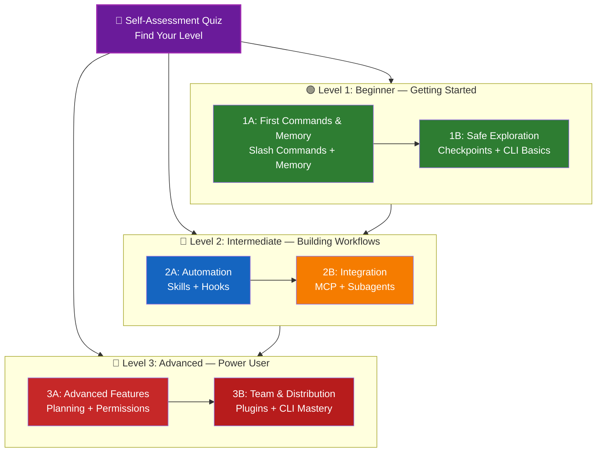

<picture>
  <source media="(prefers-color-scheme: dark)" srcset="resources/logos/claude-howto-logo-dark.svg">
  
</picture>

# 📚 Claude Code 학습 로드맵

**Claude Code가 처음이신가요?** 이 가이드는 자신에게 맞는 속도로 Claude Code의 기능을 마스터하는 데 도움을 줍니다. 완전히 초보자든 숙련된 개발자든, 아래 자기 평가 퀴즈를 통해 자신에게 적합한 경로를 찾아보세요.

---

## 🧭 수준 확인하기

모든 사람이 같은 출발점에서 시작하는 것은 아닙니다. 이 간단한 자기 평가를 통해 적절한 시작 지점을 찾아보세요.

**다음 질문에 솔직하게 답하십시오:**

- [ ] `claude`를 실행하여 Claude Code와 대화를 시작할 수 있습니다.
- [ ] `CLAUDE.md` 파일을 생성하거나 수정했습니다.
- [ ] 기본 제공 슬래시 명령어를 3개 이상 사용했습니다(예: `/help`, `/compact`, `/model`).
- [ ] 사용자 정의 슬래시 명령어 또는 Skill(`SKILL.md`)을 만들었습니다.
- [ ] MCP 서버(예: GitHub, 데이터베이스)를 구성했습니다.
- [ ] `~/.claude/settings.json`에 Hook을 설정했습니다.
- [ ] 사용자 정의 Subagent(`.claude/agents/`)를 만들거나 사용했습니다.
- [ ] 스크립팅 또는 CI/CD를 위해 출력 모드(`claude -p`)를 사용했습니다.

**당신의 레벨:**

| Checks | Level | Start At | Time to Complete |
|--------|-------|----------|------------------|
| 0-2 | **레벨 1: 초급** — 시작하기 | [마일스톤 1A: 첫 명령어 및 메모리](#마일스톤-1a-첫-명령어-및-메모리) | ~3 hours |
| 3-5 | **레벨 2: 중급** — 워크플로우 구축 | [마일스톤 2A: 자동화 (기술 + 훅)](#마일스톤-2a-자동화-기술--훅) | ~5 hours |
| 6-8 | **레벨 3: 고급** — 파워 유저 및 팀 리더 | [마일스톤 3A: 고급 기능](#마일스톤-3a-고급-기능) | ~5 hours |

> **팁**: 확실하지 않다면 한 단계 낮게 시작하세요. 기초 개념을 놓치는 것보다 익숙한 내용을 빠르게 복습하는 것이 낫습니다.

> **대화형 버전**: Claude Code에서 `/self-assessment`를 실행하면 10가지 기능 영역 전반에 걸쳐 숙련도를 측정하고 개인화된 학습 경로를 생성하는 안내형 대화식 퀴즈를 풀 수 있습니다.

---

## 🎯 학습 철학

이 저장소의 폴더는 세 가지 핵심 원칙에 따라 **권장 학습 순서**로 번호가 지정되어 있습니다.

1. **종속성** - 기초 개념이 먼저 나옵니다.
2. **복잡성** - 고급 기능보다 쉬운 기능이 먼저 나옵니다.
3. **사용 빈도** - 가장 일반적인 기능은 초기에 학습합니다.

이 접근 방식은 즉각적인 생산성 향상을 얻으면서 견고한 기반을 구축하도록 보장합니다.

---

## 🗺️ 학습 경로



**색상 범례:**
- 💜 보라색: 자기 평가 퀴즈
- 🟢 녹색: 레벨 1 — 초급 경로
- 🔵 파란색 / 🟡 금색: 레벨 2 — 중급 경로
- 🔴 빨간색: 레벨 3 — 고급 경로

---

## 📊 전체 로드맵 표

| Step | Feature | Complexity | Time | Level | Dependencies | Why Learn This | Key Benefits |
|------|---------|-----------|------|-------|--------------|----------------|--------------|
| **1** | [슬래시 명령어](01-slash-commands/) | ⭐ 초급 | 30 min | 레벨 1 | None | 빠른 생산성 향상 (60개 이상의 내장 명령어 + 5개 번들 기술) | 즉각적인 자동화, 팀 표준 |
| **2** | [메모리](02-memory/) | ⭐⭐ 초급+ | 45 min | 레벨 1 | None | 모든 기능에 필수적 | 지속적인 컨텍스트, 환경 설정 |
| **3** | [체크포인트](08-checkpoints/) | ⭐⭐ 중급 | 45 min | 레벨 1 | 세션 관리 | 안전한 탐색 | 실험, 복구 |
| **4** | [CLI 기본 사항](10-cli/) | ⭐⭐ 초급+ | 30 min | 레벨 1 | None | 핵심 CLI 사용법 | 대화형 및 인쇄 모드 |
| **5** | [기술](03-skills/) | ⭐⭐ 중급 | 1 hour | 레벨 2 | 슬래시 명령어 | 자동화된 전문성 | 재사용 가능한 기능, 일관성 |
| **6** | [훅](06-hooks/) | ⭐⭐ 중급 | 1 hour | 레벨 2 | 도구, 명령어 | 워크플로우 자동화 (29개 이벤트, 5가지 유형) | 유효성 검사, 품질 게이트 |
| **7** | [MCP](05-mcp/) | ⭐⭐⭐ 중급+ | 1 hour | 레벨 2 | 구성 | 실시간 데이터 접근 | 실시간 통합, API |
| **8** | [서브 에이전트](04-subagents/) | ⭐⭐⭐ 중급+ | 1.5 hours | 레벨 2 | 메모리, 명령어 | 복잡한 작업 처리 (Bash 포함 6개 내장) | 위임, 전문화된 전문성 |
| **9** | [고급 기능](09-advanced-features/) | ⭐⭐⭐⭐⭐ 고급 | 2-3 hours | 레벨 3 | 모든 이전 내용 | 파워 유저 도구 | 계획, 자동 모드, 채널, 음성 받아쓰기, 권한 |
| **10** | [플러그인](07-plugins/) | ⭐⭐⭐⭐ 고급 | 2 hours | 레벨 3 | 모든 이전 내용 | 완벽한 솔루션 | 팀 온보딩, 배포 |
| **11** | [CLI 마스터리](10-cli/) | ⭐⭐⭐ 고급 | 1 hour | 레벨 3 | 권장: 모든 내용 | 명령줄 사용 마스터 | 스크립팅, CI/CD, 자동화 |

**총 학습 시간**: ~11-13시간 (또는 자신의 레벨로 건너뛰어 시간을 절약하세요)

---

## 🟢 레벨 1: 초급 — 시작하기

**대상**: 퀴즈 체크 0-2개인 사용자
**시간**: ~3시간
**초점**: 즉각적인 생산성, 기본 이해
**결과**: 매일 편안하게 사용하는 사용자, 레벨 2 준비 완료

### 마일스톤 1A: 첫 명령어 및 메모리

**주제**: 슬래시 명령어 + 메모리
**시간**: 1-2시간
**복잡성**: ⭐ 초급
**목표**: 사용자 지정 명령어 및 영구 컨텍스트를 통한 즉각적인 생산성 향상

#### 달성할 내용
✅ 반복 작업을 위한 사용자 지정 슬래시 명령어 생성
✅ 팀 표준을 위한 프로젝트 메모리 설정
✅ 개인 환경 설정 구성
✅ Claude가 컨텍스트를 자동으로 로드하는 방법 이해

#### 실습 과제

```bash
# Exercise 1: Install your first slash command
mkdir -p .claude/commands
cp 01-slash-commands/optimize.md .claude/commands/

# Exercise 2: Create project memory
cp 02-memory/project-CLAUDE.md ./CLAUDE.md

# Exercise 3: Try it out
# In Claude Code, type: /optimize
```

#### 성공 기준
- [ ] `/optimize` 명령어를 성공적으로 호출함
- [ ] Claude가 CLAUDE.md에서 프로젝트 표준을 기억함
- [ ] 슬래시 명령어와 메모리를 언제 사용해야 하는지 이해함

#### 다음 단계
편안해지면 다음을 읽어보세요:
- [01-slash-commands/README.md](01-slash-commands/README.md)
- [02-memory/README.md](02-memory/README.md)

> **이해 확인**: Claude Code에서 `/lesson-quiz slash-commands` 또는 `/lesson-quiz memory`를 실행하여 학습한 내용을 테스트하세요.

---

### 마일스톤 1B: 안전한 탐색

**주제**: 체크포인트 + CLI 기본 사항
**시간**: 1시간
**복잡성**: ⭐⭐ 초급+
**목표**: 안전하게 실험하고 핵심 CLI 명령어를 사용하는 방법 학습

#### 달성할 내용
✅ 안전한 실험을 위한 체크포인트 생성 및 복원
✅ 대화형 모드와 인쇄 모드 이해
✅ 기본 CLI 플래그 및 옵션 사용
✅ 파이핑을 통한 파일 처리

#### 실습 과제

```bash
# Exercise 1: Try checkpoint workflow
# In Claude Code:
# Make some experimental changes, then press Esc+Esc or use /rewind
# Select the checkpoint before your experiment
# Choose "Restore code and conversation" to go back

# Exercise 2: Interactive vs Print mode
claude "explain this project"           # Interactive mode
claude -p "explain this function"       # Print mode (non-interactive)

# Exercise 3: Process file content via piping
cat error.log | claude -p "explain this error"
```

#### 성공 기준
- [ ] 체크포인트를 생성하고 이전 상태로 되돌림
- [ ] 대화형 및 인쇄 모드를 모두 사용함
- [ ] 분석을 위해 파일을 Claude로 파이프함
- [ ] 안전한 실험을 위해 체크포인트를 언제 사용해야 하는지 이해함

#### 다음 단계
- 읽기: [08-checkpoints/README.md](08-checkpoints/README.md)
- 읽기: [10-cli/README.md](10-cli/README.md)
- **레벨 2 준비 완료!** [마일스톤 2A: 자동화 (기술 + 훅)](#마일스톤-2a-자동화-기술--훅)로 진행하세요.

> **이해 확인**: `/lesson-quiz checkpoints` 또는 `/lesson-quiz cli`를 실행하여 레벨 2 준비가 되었는지 확인하세요.

---

## 🔵 레벨 2: 중급 — 워크플로우 구축

**대상**: 퀴즈 체크 3-5개인 사용자
**시간**: ~5시간
**초점**: 자동화, 통합, 작업 위임
**결과**: 자동화된 워크플로우, 외부 통합, 레벨 3 준비 완료

### 필수 전제 조건 확인

레벨 2를 시작하기 전에 다음 레벨 1 개념에 익숙한지 확인하세요:

- [ ] 슬래시 명령어를 생성하고 사용할 수 있음 ([01-slash-commands/](01-slash-commands/))
- [ ] CLAUDE.md를 통해 프로젝트 메모리를 설정했음 ([02-memory/](02-memory/))
- [ ] 체크포인트를 생성하고 복원하는 방법을 알고 있음 ([08-checkpoints/](08-checkpoints/))
- [ ] 명령줄에서 `claude` 및 `claude -p`를 사용할 수 있음 ([10-cli/](10-cli/))

> **누락된 부분?** 계속하기 전에 위에 연결된 튜토리얼을 검토하세요.

---

### 마일스톤 2A: 자동화 (기술 + 훅)

**주제**: 기술 + 훅
**시간**: 2-3시간
**복잡성**: ⭐⭐ 중급
**목표**: 일반적인 워크플로우 및 품질 검사 자동화

#### 달성할 내용
✅ YAML 프런트매터( `effort` 및 `shell` 필드 포함)를 사용하여 특수 기능 자동 호출
✅ 29개 훅 이벤트 전반에 걸쳐 이벤트 기반 자동화 설정
✅ 5가지 훅 유형(command, http, mcp_tool, prompt, agent) 모두 사용
✅ 코드 품질 표준 시행
✅ 워크플로우를 위한 사용자 지정 훅 생성

#### 실습 과제

```bash
# Exercise 1: Install a skill
cp -r 03-skills/code-review-specialist ~/.claude/skills/

# Exercise 2: Set up hooks
mkdir -p ~/.claude/hooks
cp 06-hooks/pre-tool-check.sh ~/.claude/hooks/
chmod +x ~/.claude/hooks/pre-tool-check.sh

# Exercise 3: Configure hooks in settings
# Add to ~/.claude/settings.json:
{
  "hooks": {
    "PreToolUse": [
      {
        "matcher": "Bash",
        "hooks": [
          {
            "type": "command",
            "command": "~/.claude/hooks/pre-tool-check.sh"
          }
        ]
      }
    ]
  }
}
```

#### 성공 기준
- [ ] 관련성이 있을 때 코드 검토 기술이 자동으로 호출됨
- [ ] PreToolUse 훅이 도구 실행 전에 실행됨
- [ ] 기술 자동 호출과 훅 이벤트 트리거의 차이를 이해함

#### 다음 단계
- 자신만의 사용자 지정 기술 생성
- 워크플로우를 위한 추가 훅 설정
- 읽기: [03-skills/README.md](03-skills/README.md)
- 읽기: [06-hooks/README.md](06-hooks/README.md)

> **이해 확인**: `/lesson-quiz skills` 또는 `/lesson-quiz hooks`를 실행하여 다음 단계로 넘어가기 전에 지식을 테스트하세요.

---

### 마일스톤 2B: 통합 (MCP + 서브 에이전트)

**주제**: MCP + 서브 에이전트
**시간**: 2-3시간
**복잡성**: ⭐⭐⭐ 중급+
**목표**: 외부 서비스 통합 및 복잡한 작업 위임

#### 달성할 내용
✅ GitHub, 데이터베이스 등에서 실시간 데이터에 액세스
✅ 특수 AI 에이전트에게 작업 위임
✅ MCP와 서브 에이전트를 언제 사용해야 하는지 이해
✅ 통합 워크플로우 구축

#### 실습 과제

```bash
# Exercise 1: Set up GitHub MCP
export GITHUB_TOKEN="your_github_token"
claude mcp add github -- npx -y @modelcontextprotocol/server-github

# Exercise 2: Test MCP integration
# In Claude Code: /mcp__github__list_prs

# Exercise 3: Install subagents
mkdir -p .claude/agents
cp 04-subagents/*.md .claude/agents/
```

#### 통합 과제
이 완전한 워크플로우를 시도해 보세요:
1. MCP를 사용하여 GitHub PR 가져오기
2. Claude가 코드 검토 서브 에이전트에 검토를 위임하도록 하기
3. 훅을 사용하여 자동으로 테스트 실행

#### 성공 기준
- [ ] MCP를 통해 GitHub 데이터를 성공적으로 쿼리함
- [ ] Claude가 복잡한 작업을 서브 에이전트에 위임함
- [ ] MCP와 서브 에이전트의 차이를 이해함
- [ ] 워크플로우에서 MCP + 서브 에이전트 + 훅을 결합함

#### 다음 단계
- 추가 MCP 서버 설정 (데이터베이스, Slack 등)
- 도메인에 맞는 사용자 지정 서브 에이전트 생성
- 읽기: [05-mcp/README.md](05-mcp/README.md)
- 읽기: [04-subagents/README.md](04-subagents/README.md)
- **레벨 3 준비 완료!** [마일스톤 3A: 고급 기능](#마일스톤-3a-고급-기능)로 진행하세요.

> **이해 확인**: `/lesson-quiz mcp` 또는 `/lesson-quiz subagents`를 실행하여 레벨 3 준비가 되었는지 확인하세요.

---

## 🔴 레벨 3: 고급 — 파워 유저 및 팀 리더

**대상**: 퀴즈 체크 6-8개인 사용자
**시간**: ~5시간
**초점**: 팀 도구, CI/CD, 엔터프라이즈 기능, 플러그인 개발
**결과**: 파워 유저, 팀 워크플로우 및 CI/CD 설정 가능

### 필수 전제 조건 확인

레벨 3을 시작하기 전에 다음 레벨 2 개념에 익숙한지 확인하세요:

- [ ] 자동 호출을 사용하여 기술을 생성하고 사용할 수 있음 ([03-skills/](03-skills/))
- [ ] 이벤트 기반 자동화를 위한 훅을 설정했음 ([06-hooks/](06-hooks/))
- [ ] 외부 데이터를 위한 MCP 서버를 구성할 수 있음 ([05-mcp/](05-mcp/))
- [ ] 작업 위임을 위해 서브 에이전트를 사용하는 방법을 알고 있음 ([04-subagents/](04-subagents/))

> **누락된 부분?** 계속하기 전에 위에 연결된 튜토리얼을 검토하세요.

---

### 마일스톤 3A: 고급 기능

**주제**: 고급 기능 (계획, 권한, 확장된 사고, 자동 모드, 채널, 음성 받아쓰기, 원격/데스크톱/웹)
**시간**: 2-3시간
**복잡성**: ⭐⭐⭐⭐⭐ 고급
**목표**: 고급 워크플로우 및 파워 유저 도구 마스터

#### 달성할 내용
✅ 복잡한 기능을 위한 계획 모드
✅ 6가지 모드(default, acceptEdits, plan, auto, dontAsk, bypassPermissions)를 통한 세분화된 권한 제어
✅ Alt+T / Option+T 토글을 통한 확장된 사고
✅ 백그라운드 작업 관리
✅ 학습된 환경 설정을 위한 자동 메모리
✅ 백그라운드 안전 분류기가 있는 자동 모드
✅ 구조화된 다중 세션 워크플로우를 위한 채널
✅ 핸즈프리 상호 작용을 위한 음성 받아쓰기
✅ 원격 제어, 데스크톱 앱 및 웹 세션
✅ 다중 에이전트 협업을 위한 에이전트 팀

#### 실습 과제

```bash
# Exercise 1: Use planning mode
/plan Implement user authentication system

# Exercise 2: Try permission modes (6 available: default, acceptEdits, plan, auto, dontAsk, bypassPermissions)
claude --permission-mode plan "analyze this codebase"
claude --permission-mode acceptEdits "refactor the auth module"
claude --permission-mode auto "implement the feature"

# Exercise 3: Enable extended thinking
# Press Alt+T (Option+T on macOS) during a session to toggle

# Exercise 4: Advanced checkpoint workflow
# 1. Create checkpoint "Clean state"
# 2. Use planning mode to design a feature
# 3. Implement with subagent delegation
# 4. Run tests in background
# 5. If tests fail, rewind to checkpoint
# 6. Try alternative approach

# Exercise 5: Try auto mode (background safety classifier)
claude --permission-mode auto "implement user settings page"

# Exercise 6: Enable agent teams
export CLAUDE_AGENT_TEAMS=1
# Ask Claude: "Implement feature X using a team approach"

# Exercise 7: Scheduled tasks
/loop 5m /check-status
# Or use CronCreate for persistent scheduled tasks

# Exercise 8: Channels for multi-session workflows
# Use channels to organize work across sessions

# Exercise 9: Voice Dictation
# Use voice input for hands-free interaction with Claude Code
```

#### 성공 기준
- [ ] 복잡한 기능을 위해 계획 모드를 사용함
- [ ] 권한 모드(plan, acceptEdits, auto, dontAsk)를 구성함
- [ ] Alt+T / Option+T로 확장된 사고를 토글함
- [ ] 백그라운드 안전 분류기가 있는 자동 모드를 사용함
- [ ] 긴 작업을 위해 백그라운드 작업을 사용함
- [ ] 다중 세션 워크플로우를 위해 채널을 탐색함
- [ ] 핸즈프리 입력을 위해 음성 받아쓰기를 시도함
- [ ] 원격 제어, 데스크톱 앱 및 웹 세션을 이해함
- [ ] 협업 작업을 위해 에이전트 팀을 활성화하고 사용함
- [ ] 반복 작업 또는 예약된 모니터링을 위해 `/loop`를 사용함

#### 다음 단계
- 읽기: [09-advanced-features/README.md](09-advanced-features/README.md)

> **이해 확인**: `/lesson-quiz advanced`를 실행하여 파워 유저 기능 숙련도를 테스트하세요.

---

### 마일스톤 3B: 팀 및 배포 (플러그인 + CLI 마스터리)

**주제**: 플러그인 + CLI 마스터리 + CI/CD
**시간**: 2-3시간
**복잡성**: ⭐⭐⭐⭐ 고급
**목표**: 팀 도구 구축, 플러그인 생성, CI/CD 통합 마스터

#### 달성할 내용
✅ 완전한 번들 플러그인 설치 및 생성
✅ 스크립팅 및 자동화를 위한 CLI 마스터
✅ `claude -p`를 통한 CI/CD 통합 설정
✅ 자동화된 파이프라인을 위한 JSON 출력
✅ 세션 관리 및 일괄 처리

#### 실습 과제

```bash
# Exercise 1: Install a complete plugin
# In Claude Code: /plugin install pr-review

# Exercise 2: Print mode for CI/CD
claude -p "Run all tests and generate report"

# Exercise 3: JSON output for scripts
claude -p --output-format json "list all functions"

# Exercise 4: Session management and resumption
claude -r "feature-auth" "continue implementation"

# Exercise 5: CI/CD integration with constraints
claude -p --max-turns 3 --output-format json "review code"

# Exercise 6: Batch processing
for file in *.md; do
  claude -p --output-format json "summarize this: $(cat $file)" > ${file%.md}.summary.json
done
```

#### CI/CD 통합 과제
간단한 CI/CD 스크립트를 생성합니다:
1. `claude -p`를 사용하여 변경된 파일 검토
2. 결과를 JSON으로 출력
3. `jq`로 특정 문제 처리
4. GitHub Actions 워크플로우에 통합

#### 성공 기준
- [ ] 플러그인을 설치하고 사용함
- [ ] 팀을 위한 플러그인을 구축하거나 수정함
- [ ] CI/CD에서 인쇄 모드 (`claude -p`)를 사용함
- [ ] 스크립팅을 위해 JSON 출력을 생성함
- [ ] 이전 세션을 성공적으로 재개함
- [ ] 일괄 처리 스크립트를 생성함
- [ ] Claude를 CI/CD 워크플로우에 통합함

#### CLI의 실제 사용 사례
- **코드 검토 자동화**: CI/CD 파이프라인에서 코드 검토 실행
- **로그 분석**: 오류 로그 및 시스템 출력 분석
- **문서 생성**: 문서 일괄 생성
- **테스트 인사이트**: 테스트 실패 분석
- **성능 분석**: 성능 지표 검토
- **데이터 처리**: 데이터 파일 변환 및 분석

#### 다음 단계
- 읽기: [07-plugins/README.md](07-plugins/README.md)
- 읽기: [10-cli/README.md](10-cli/README.md)
- 팀 전체 CLI 단축키 및 플러그인 생성
- 일괄 처리 스크립트 설정

> **이해 확인**: `/lesson-quiz plugins` 또는 `/lesson-quiz cli`를 실행하여 숙련도를 확인하세요.

---

## 🧪 지식 테스트하기

이 저장소에는 Claude Code에서 언제든지 사용하여 이해도를 평가할 수 있는 두 가지 대화형 기술이 포함되어 있습니다.

| Skill | Command | Purpose |
|-------|---------|---------|
| **자기 평가** | `/self-assessment` | 10가지 기능 전반에 걸친 전반적인 숙련도를 평가합니다. Quick (2분) 또는 Deep (5분) 모드를 선택하여 개인화된 기술 프로필 및 학습 경로를 얻으세요. |
| **레슨 퀴즈** | `/lesson-quiz [lesson]` | 10가지 질문으로 특정 레슨에 대한 이해도를 테스트합니다. 레슨 전(사전 테스트), 도중(진행 상황 확인) 또는 후(숙련도 확인)에 사용하세요. |

**예시:**
```
/self-assessment                  # Find your overall level
/lesson-quiz hooks                # Quiz on Lesson 06: Hooks
/lesson-quiz 03                   # Quiz on Lesson 03: Skills
/lesson-quiz advanced-features    # Quiz on Lesson 09
```

---

## ⚡ 빠른 시작 경로

### 15분만 있다면
**목표**: 첫 번째 성공 경험 얻기

1. 슬래시 명령어 하나 복사: `cp 01-slash-commands/optimize.md .claude/commands/`
2. Claude Code에서 시도: `/optimize`
3. 읽기: [01-slash-commands/README.md](01-slash-commands/README.md)

**결과**: 작동하는 슬래시 명령어를 가지고 기본 사항을 이해하게 됩니다.

---

### 1시간이 있다면
**목표**: 필수 생산성 도구 설정

1. **슬래시 명령어** (15분): `/optimize` 및 `/pr` 복사 및 테스트
2. **프로젝트 메모리** (15분): 프로젝트 표준으로 CLAUDE.md 생성
3. **기술 설치** (15분): 코드 검토 전문가 기술 설정
4. **함께 시도** (15분): 이들이 어떻게 조화롭게 작동하는지 확인

**결과**: 명령어, 메모리 및 자동 기술을 통한 기본 생산성 향상

---

### 주말이 있다면
**목표**: 대부분의 기능에 능숙해지기

**토요일 오전** (3시간):
- 마일스톤 1A 완료: 슬래시 명령어 + 메모리
- 마일스톤 1B 완료: 체크포인트 + CLI 기본 사항

**토요일 오후** (3시간):
- 마일스톤 2A 완료: 기술 + 훅
- 마일스톤 2B 완료: MCP + 서브 에이전트

**일요일** (4시간):
- 마일스톤 3A 완료: 고급 기능
- 마일스톤 3B 완료: 플러그인 + CLI 마스터리 + CI/CD
- 팀을 위한 사용자 지정 플러그인 구축

**결과**: Claude Code 파워 유저가 되어 다른 사람을 교육하고 복잡한 워크플로우를 자동화할 준비가 됩니다.

---

## 💡 학습 팁

### ✅ 해야 할 일

- 시작 지점을 찾기 위해 **먼저 퀴즈를 푸세요**
- 각 마일스톤에 대한 **실습 과제를 완료하세요**
- **간단하게 시작**하고 점진적으로 복잡성을 추가하세요
- 다음으로 넘어가기 전에 **각 기능을 테스트하세요**
- 워크플로우에 작동하는 내용에 대해 **메모를 작성하세요**
- 고급 주제를 학습할 때 **이전 개념을 다시 참조하세요**
- 체크포인트를 사용하여 **안전하게 실험하세요**
- 팀과 **지식을 공유하세요**

### ❌ 하지 말아야 할 일

- 더 높은 레벨로 건너뛸 때 **전제 조건 확인을 건너뛰지 마세요**
- **모든 것을 한 번에 배우려 하지 마세요** - 압도적일 수 있습니다.
- **이해 없이 구성을 복사하지 마세요** - 디버그 방법을 알 수 없습니다.
- **테스트하는 것을 잊지 마세요** - 항상 기능이 작동하는지 확인하세요.
- **마일스톤을 서두르지 마세요** - 이해하는 데 시간을 들이세요.
- **문서를 무시하지 마세요** - 각 README에는 귀중한 세부 정보가 있습니다.
- **혼자 작업하지 마세요** - 팀원들과 논의하세요.

---

## 🎓 학습 스타일

### 시각 학습자
- 각 README의 머메이드 다이어그램을 연구하세요
- 명령어 실행 흐름을 관찰하세요
- 자신만의 워크플로우 다이어그램을 그리세요
- 위 시각 학습 경로를 사용하세요

### 실습 학습자
- 모든 실습 과제를 완료하세요
- 다양한 변형으로 실험하세요
- 고장 내고 고쳐보세요 (체크포인트를 사용하세요!)
- 자신만의 예시를 만드세요

### 독서 학습자
- 각 README를 철저히 읽으세요
- 코드 예제를 연구하세요
- 비교 표를 검토하세요
- 자료에 연결된 블로그 게시물을 읽으세요

### 사회적 학습자
- 페어 프로그래밍 세션을 설정하세요
- 팀원들에게 개념을 가르치세요
- Claude Code 커뮤니티 토론에 참여하세요
- 자신만의 사용자 지정 구성을 공유하세요

---

## 📈 진행 상황 추적

이 체크리스트를 사용하여 레벨별 진행 상황을 추적하세요. 언제든지 `/self-assessment`를 실행하여 업데이트된 기술 프로필을 얻거나, 각 튜토리얼 후에 `/lesson-quiz [lesson]`을 실행하여 이해도를 확인하세요.

### 🟢 레벨 1: 초급
- [ ] [01-slash-commands](01-slash-commands/) 완료
- [ ] [02-memory](02-memory/) 완료
- [ ] 첫 번째 사용자 지정 슬래시 명령어 생성
- [ ] 프로젝트 메모리 설정
- [ ] **마일스톤 1A 달성**
- [ ] [08-checkpoints](08-checkpoints/) 완료
- [ ] [10-cli](10-cli/) 기본 사항 완료
- [ ] 체크포인트를 생성하고 이전 상태로 되돌림
- [ ] 대화형 및 인쇄 모드를 사용함
- [ ] **마일스톤 1B 달성**

### 🔵 레벨 2: 중급
- [ ] [03-skills](03-skills/) 완료
- [ ] [06-hooks](06-hooks/) 완료
- [ ] 첫 번째 기술 설치
- [ ] PreToolUse 훅 설정
- [ ] **마일스톤 2A 달성**
- [ ] [05-mcp](05-mcp/) 완료
- [ ] [04-subagents](04-subagents/) 완료
- [ ] GitHub MCP 연결
- [ ] 사용자 지정 서브 에이전트 생성
- [ ] 워크플로우에 통합을 결합함
- [ ] **마일스톤 2B 달성**

### 🔴 레벨 3: 고급
- [ ] [09-advanced-features](09-advanced-features/) 완료
- [ ] 계획 모드를 성공적으로 사용함
- [ ] 권한 모드(자동 포함 6가지 모드)를 구성함
- [ ] 안전 분류기가 있는 자동 모드를 사용함
- [ ] 확장된 사고 토글을 사용함
- [ ] 채널 및 음성 받아쓰기를 탐색함
- [ ] **마일스톤 3A 달성**
- [ ] [07-plugins](07-plugins/) 완료
- [ ] [10-cli](10-cli/) 고급 사용법 완료
- [ ] 인쇄 모드 (`claude -p`) CI/CD 설정
- [ ] 자동화를 위한 JSON 출력 생성
- [ ] Claude를 CI/CD 파이프라인에 통합함
- [ ] 팀 플러그인 생성
- [ ] **마일스톤 3B 달성**

---

## 🆘 일반적인 학습 과제

### 과제 1: "동시에 너무 많은 개념"
**해결책**: 한 번에 하나의 마일스톤에 집중하세요. 다음으로 넘어가기 전에 모든 과제를 완료하세요.

### 과제 2: "언제 어떤 기능을 사용해야 할지 모르겠음"
**해결책**: 메인 README의 [사용 사례 매트릭스](README.md#use-case-matrix)를 참조하세요.

### 과제 3: "구성 작동 불능"
**해결책**: [문제 해결](README.md#troubleshooting) 섹션을 확인하고 파일 위치를 확인하세요.

### 과제 4: "개념이 중복되는 것 같음"
**해결책**: [기능 비교](README.md#feature-comparison) 표를 검토하여 차이점을 이해하세요.

### 과제 5: "모든 것을 기억하기 어려움"
**해결책**: 자신만의 요약본을 만드세요. 체크포인트를 사용하여 안전하게 실험하세요.

### 과제 6: "경험이 있지만 어디서부터 시작해야 할지 모르겠음"
**해결책**: 위에 있는 [수준 확인하기](#-수준-확인하기)를 풀어보세요. 자신의 레벨로 건너뛰고 전제 조건 확인을 사용하여 누락된 부분을 파악하세요.

---

## 🎯 완료 후 다음 단계는?

모든 마일스톤을 완료한 후:

1. **팀 문서 생성** - 팀의 Claude Code 설정 문서화
2. **사용자 지정 플러그인 구축** - 팀의 워크플로우 패키징
3. **원격 제어 탐색** - 외부 도구에서 Claude Code 세션을 프로그래밍 방식으로 제어
4. **웹 세션 시도** - 브라우저 기반 인터페이스를 통해 Claude Code를 사용하여 원격 개발
5. **데스크톱 앱 사용** - 네이티브 데스크톱 애플리케이션을 통해 Claude Code 기능에 액세스
6. **자동 모드 사용** - 백그라운드 안전 분류기로 Claude가 자율적으로 작업하도록 허용
7. **자동 메모리 활용** - Claude가 시간이 지남에 따라 환경 설정을 자동으로 학습하도록 허용
8. **에이전트 팀 설정** - 복잡하고 다면적인 작업에서 여러 에이전트 조정
9. **채널 사용** - 구조화된 다중 세션 워크플로우 전반에 걸쳐 작업 구성
10. **음성 받아쓰기 시도** - Claude Code와 핸즈프리 상호 작용을 위해 음성 입력 사용
11. **예약된 작업 사용** - `/loop` 및 cron 도구를 사용하여 반복 확인 자동화
12. **예시 기여** - 커뮤니티와 공유
13. **다른 사람 멘토링** - 팀원의 학습 지원
14. **워크플로우 최적화** - 사용량에 따라 지속적으로 개선
15. **최신 정보 유지** - Claude Code 릴리스 및 새로운 기능 팔로우

---

## 📚 추가 자료

### 공식 문서
- [Claude Code 문서](https://code.claude.com/docs/en/overview)
- [Anthropic 문서](https://docs.anthropic.com)
- [MCP 프로토콜 사양](https://modelcontextprotocol.io)

### 블로그 게시물
- [Claude Code 슬래시 명령어 발견하기](https://medium.com/@luongnv89/discovering-claude-code-slash-commands-cdc17f0dfb29)

### 커뮤니티
- [Anthropic 쿡북](https://github.com/anthropics/anthropic-cookbook)
- [MCP 서버 저장소](https://github.com/modelcontextprotocol/servers)

---

## 💬 피드백 및 지원

- **문제 발견?** 저장소에 이슈 생성
- **제안 사항?** 풀 리퀘스트 제출
- **도움이 필요하세요?** 문서를 확인하거나 커뮤니티에 문의

---

**최종 업데이트**: 2026년 6월 2일
**Claude Code 버전**: 2.1.160
**출처**:
- https://code.claude.com/docs/en/overview
- https://code.claude.com/docs/en/hooks
- https://github.com/anthropics/claude-code/releases/tag/v2.1.144
- https://github.com/anthropics/claude-code/releases/tag/v2.1.145
**호환 모델**: Claude Sonnet 4.6, Claude Opus 4.8, Claude Haiku 4.5
**유지보수**: Claude How-To 기여자
**라이선스**: 교육 목적, 자유롭게 사용 및 개작 가능

---

[← 메인 README로 돌아가기](README.md)
