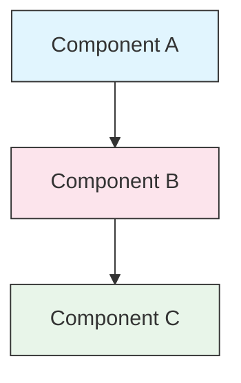

<picture>
  <source media="(prefers-color-scheme: dark)" srcset="resources/logos/claude-howto-logo-dark.svg">
  
</picture>

# 스타일 가이드

> Claude How To에 기여하기 위한 규칙과 서식 지침입니다. 콘텐츠의 일관성, 전문성, 유지보수성을 유지하기 위해 이 가이드를 따르십시오.

---

## 목차

- [파일 및 폴더 명명 규칙](#파일-및-폴더-명명-규칙)
- [문서 구조](#문서-구조)
- [제목](#제목)
- [텍스트 서식](#텍스트-서식)
- [목록](#목록)
- [표](#표)
- [코드 블록](#코드-블록)
- [링크 및 상호 참조](#링크-및-상호-참조)
- [다이어그램](#다이어그램)
- [이모지 사용](#이모지-사용)
- [YAML 프런트매터](#yaml-프런트매터)
- [이미지 및 미디어](#이미지-및-미디어)
- [톤과 문체](#톤과-문체)
- [커밋 메시지](#커밋-메시지)
- [작성자 체크리스트](#작성자-체크리스트)


---

## 파일 및 폴더 명명 규칙

### 강의 폴더

강의 폴더는 **두 자리 숫자 접두사** 뒤에 **kebab-case** 설명자를 사용합니다.


```
01-slash-commands/
02-memory/
03-skills/
04-subagents/
05-mcp/
```

숫자는 초급부터 고급까지의 학습 순서를 나타냅니다.

### 파일 이름

| Type | Convention | Examples |
|------|-----------|----------|
| **Lesson README** | `README.md` | `01-slash-commands/README.md` |
| **Feature file** | Kebab-case `.md` | `code-reviewer.md`, `generate-api-docs.md` |
| **Shell script** | Kebab-case `.sh` | `format-code.sh`, `validate-input.sh` |
| **Config file** | Standard names | `.mcp.json`, `settings.json` |
| **Memory file** | Scope-prefixed | `project-CLAUDE.md`, `personal-CLAUDE.md` |
| **Top-level docs** | UPPER_CASE `.md` | `CATALOG.md`, `QUICK_REFERENCE.md`, `CONTRIBUTING.md` |
| **Image assets** | Kebab-case | `pr-slash-command.png`, `claude-howto-logo.svg` |

### 규칙

- 모든 파일 및 폴더 이름은 **소문자**를 사용합니다(단, `README.md`, `CATALOG.md`와 같은 최상위 문서는 예외).
- 단어 구분자는 하이픈(`-`)을 사용하며, 언더스코어(`_`)나 공백은 사용하지 않습니다.
- 이름은 설명적이면서도 간결하게 유지합니다.


---

## 문서 구조

### 루트 README

루트 `README.md`는 다음 순서를 따릅니다.

1. 로고(다크/라이트 버전을 포함한 `<picture>` 요소)
2. H1 제목
3. 소개용 인용문 블록(한 줄 가치 제안)
4. 비교 표가 포함된 "Why This Guide?" 섹션
5. 구분선(`---`)
6. 목차
7. 기능 카탈로그
8. 빠른 이동
9. 학습 경로
10. 기능 섹션
11. 시작하기
12. 모범 사례 / 문제 해결
13. 기여 방법 / 라이선스


### 강의 README

각 강의 `README.md`는 다음 순서를 따릅니다.

1. H1 제목(예: `# Slash Commands`)
2. 간단한 개요 문단
3. 빠른 참조 표(선택 사항)
4. 아키텍처 다이어그램(Mermaid)
5. 상세 섹션(H2)
6. 실습 예제(번호 목록, 4~6개 예제)
7. 모범 사례(Do's 및 Don'ts 표)
8. 문제 해결
9. 관련 가이드 / 공식 문서
10. 문서 메타데이터 푸터


### 기능/예제 파일

개별 기능 파일(예: `optimize.md`, `pr.md`)은 다음 순서를 따릅니다.

1. YAML 프런트매터(필요한 경우)
2. H1 제목
3. 목적 / 설명
4. 사용 방법
5. 코드 예제
6. 사용자 정의 팁


### 섹션 구분선

주요 문서 영역을 구분할 때는 구분선(`---`)을 사용합니다.


```markdown
---

## New Major Section
```

소개용 인용문 뒤와 논리적으로 구분되는 주요 섹션 사이에 배치합니다.

---

## 제목

### 계층 구조

| Level     | Use              | Example                      |
| --------- | ---------------- | ---------------------------- |
| `#` H1    | 문서 제목(문서당 하나)    | `# Slash Commands`           |
| `##` H2   | 주요 섹션            | `## Best Practices`          |
| `###` H3  | 하위 섹션            | `### Adding a Skill`         |
| `####` H4 | 하위-하위 섹션(드물게 사용) | `#### Configuration Options` |

### 규칙

- **문서당 H1은 하나만 사용** — 페이지 제목 전용
- **단계를 건너뛰지 마십시오** — H2 다음에 바로 H4를 사용하지 마십시오
- **제목은 간결하게 유지** — 2~5단어 권장
- **문장형 대소문자 사용** — 첫 단어와 고유명사만 대문자 사용(단, 기능 이름은 원문 유지)
- **이모지 접두사는 루트 README 섹션 제목에서만 사용**([이모지 사용](#이모지-사용) 참고)


---

## 텍스트 서식

### 강조

| Style                 | When to Use           | Example             |
| --------------------- | --------------------- | ------------------- |
| **Bold** (`**text**`) | 핵심 용어, 표의 레이블, 중요한 개념 | `**Installation**:` |
| *Italic* (`*text*`)   | 기술 용어의 첫 등장, 서적/문서 제목 | `*frontmatter*`     |
| `Code` (`` `text` ``) | 파일명, 명령어, 설정 값, 코드 참조 | `` `CLAUDE.md` ``   |

### 안내용 블록 인용문

중요한 안내 사항에는 굵은 접두사가 포함된 인용문 블록을 사용합니다.

```markdown
> **Note**: Custom slash commands have been merged into skills since v2.0.

> **Important**: Never commit API keys or credentials.

> **Tip**: Combine memory with skills for maximum effectiveness.
```

지원되는 안내 유형: **Note**, **Important**, **Tip**, **Warning**

### 문단

- 문단은 짧게 유지합니다(2~4문장).
- 문단 사이에는 빈 줄을 추가합니다.
- 핵심 내용을 먼저 제시한 뒤 맥락을 설명합니다.
- "무엇(what)"뿐 아니라 "왜(why)"도 설명합니다.

---

## 목록

### 순서 없는 목록

중첩 시 2칸 들여쓰기를 사용하며 대시(`-`)를 사용합니다.

```markdown
- First item
- Second item
  - Nested item
  - Another nested item
    - Deep nested (avoid going deeper than 3 levels)
- Third item
```

### 순서 있는 목록

순차적인 단계, 사용 방법, 순위가 있는 항목에는 번호 목록을 사용합니다.

```markdown
1. First step
2. Second step
   - Sub-point detail
   - Another sub-point
3. Third step
```

### 설명형 목록

키-값 형태의 목록에는 굵은 레이블을 사용합니다.

```markdown
- **Performance bottlenecks** - identify O(n^2) operations, inefficient loops
- **Memory leaks** - find unreleased resources, circular references
- **Algorithm improvements** - suggest better algorithms or data structures
```

### 규칙


- 일관된 들여쓰기를 유지합니다(단계당 공백 2칸).
- 목록 전후에 빈 줄을 추가합니다.
- 목록 항목의 구조를 일관되게 유지합니다(모두 동사로 시작하거나 모두 명사로 시작하는 등).
- 3단계 이상 중첩하지 않습니다.


---

## 표

### 기본 형식

```markdown
| Column 1 | Column 2 | Column 3 |
|----------|----------|----------|
| Data     | Data     | Data     |
```

### 자주 사용하는 표 패턴

**기능 비교(3~4개 열):**

```markdown
| Feature | Invocation | Persistence | Best For |
|---------|-----------|------------|----------|
| **Slash Commands** | Manual (`/cmd`) | Session only | Quick shortcuts |
| **Memory** | Auto-loaded | Cross-session | Long-term learning |
```

**권장 사항과 금지 사항:**

```markdown
| Do | Don't |
|----|-------|
| Use descriptive names | Use vague names |
| Keep files focused | Overload a single file |
```

**빠른 참조:**

```markdown
| Aspect | Details |
|--------|---------|
| **Purpose** | Generate API documentation |
| **Scope** | Project-level |
| **Complexity** | Intermediate |
```

### 규칙

- 첫 번째 열이 행 레이블인 경우 **굵게 표시**합니다.
- 원본 소스의 가독성을 위해 파이프(`|`) 정렬을 권장합니다.
- 셀 내용은 간결하게 유지하고, 자세한 내용은 링크를 사용합니다.
- 셀 내부의 명령어 및 파일 경로에는 `코드 서식`을 사용합니다.

---

## 코드 블록

### 언어 태그

구문 강조를 위해 항상 언어 태그를 지정합니다.

| Language   | Tag          | Use For        |
| ---------- | ------------ | -------------- |
| Shell      | `bash`       | CLI 명령어, 스크립트  |
| Python     | `python`     | Python 코드      |
| JavaScript | `javascript` | JS 코드          |
| TypeScript | `typescript` | TS 코드          |
| JSON       | `json`       | 설정 파일          |
| YAML       | `yaml`       | 프런트매터, 설정      |
| Markdown   | `markdown`   | Markdown 예제    |
| SQL        | `sql`        | 데이터베이스 쿼리      |


### 규칙

```bash
# Comment explaining what the command does
claude mcp add notion --transport http https://mcp.notion.com/mcp
```

- 명확하지 않은 명령어 앞에는 **주석 줄**을 추가합니다.
- 모든 예제는 **복사 후 바로 사용할 수 있는 상태**로 제공합니다.
- 관련이 있다면 **기본 버전과 고급 버전 모두** 제공합니다.
- 이해에 도움이 된다면 **예상 출력**을 포함합니다(언어 태그 없는 코드 블록 사용).

### 설치 블록

설치 안내에는 다음 패턴을 사용합니다.

```bash
# Copy files to your project
cp 01-slash-commands/*.md .claude/commands/
```

### 다단계 워크플로우

```bash
# Step 1: Create the directory
mkdir -p .claude/commands

# Step 2: Copy the templates
cp 01-slash-commands/*.md .claude/commands/

# Step 3: Verify installation
ls .claude/commands/
```

---

## 링크 및 상호 참조

### 내부 링크(상대 경로)

모든 내부 링크에는 상대 경로를 사용합니다.

```markdown
[Slash Commands](01-slash-commands/)
[Skills Guide](03-skills/)
[Memory Architecture](02-memory/#memory-architecture)
```

강의 폴더에서 루트 또는 다른 강의 폴더로 이동할 때:

```markdown
[Back to main guide](../README.md)
[Related: Skills](../03-skills/)
```

### 외부 링크(절대 경로)

설명적인 앵커 텍스트와 함께 전체 URL을 사용합니다.

```markdown
[Anthropic's official documentation](https://code.claude.com/docs/en/overview)
```

- 앵커 텍스트로 "click here" 또는 "this link"를 사용하지 않습니다.
- 문맥 없이도 의미가 전달되는 설명적인 텍스트를 사용합니다.

### 섹션 앵커

동일 문서 내 섹션 링크에는 GitHub 스타일 앵커를 사용합니다.

```markdown
[Feature Catalog](#-feature-catalog)
[Best Practices](#best-practices)
```

### 관련 가이드 패턴

각 강의는 관련 가이드 섹션으로 마무리합니다.

```markdown
## Related Guides

- [Slash Commands](../01-slash-commands/) - Quick shortcuts
- [Memory](../02-memory/) - Persistent context
- [Skills](../03-skills/) - Reusable capabilities
```

---

## 다이어그램

### Mermaid

모든 다이어그램에는 Mermaid를 사용합니다. 지원되는 유형은 다음과 같습니다.

- `graph TB` / `graph LR` — 아키텍처, 계층 구조, 흐름
- `sequenceDiagram` — 상호작용 흐름
- `timeline` — 시간 순서 흐름

### 스타일 규칙

스타일 블록을 사용하여 일관된 색상을 적용합니다.



**색상 팔레트:**

| Color | Hex | Use For |
|-------|-----|---------|
| Light blue | `#e1f5fe` | Primary components, inputs |
| Light pink | `#fce4ec` | Processing, middleware |
| Light green | `#e8f5e9` | Outputs, results |
| Light yellow | `#fff9c4` | Configuration, optional |
| Light purple | `#f3e5f5` | User-facing, UI |

### 규칙

- 노드 레이블에는 `["Label text"]` 형식을 사용합니다(특수 문자 사용 가능).
- 레이블 내 줄바꿈에는 `<br/>`를 사용합니다.
- 다이어그램은 단순하게 유지합니다(최대 10~12개 노드).
- 접근성을 위해 다이어그램 아래에 간단한 설명을 추가합니다.
- 계층 구조에는 위에서 아래 방향(`TB`), 워크플로우에는 왼쪽에서 오른쪽 방향(`LR`)을 사용합니다.

---

## 이모지 사용

### 이모지를 사용하는 위치

이모지는 **신중하고 목적에 맞게** 사용합니다. 다음과 같은 특정 상황에서만 사용합니다.

| Context         | Emojis    | Example                                   |
| --------------- | --------- | ----------------------------------------- |
| 루트 README 섹션 제목 | 카테고리 아이콘  | `## 📚 Learning Path`                     |
| 숙련도 표시          | 색상 원형 아이콘 | 🟢 Beginner, 🔵 Intermediate, 🔴 Advanced |
| 권장 사항 및 금지 사항   | 체크/엑스 표시  | ✅ Do this, ❌ Don't do this                |
| 복잡도 등급          | 별표        | ⭐⭐⭐                                       |

### 표준 이모지 세트

| Emoji | Meaning         |
| ----- | --------------- |
| 📚    | 학습, 가이드, 문서     |
| ⚡     | 시작하기, 빠른 참조     |
| 🎯    | 기능, 빠른 참조       |
| 🎓    | 학습 경로           |
| 📊    | 통계, 비교          |
| 🚀    | 설치, 빠른 명령어      |
| 🟢    | 초급 수준           |
| 🔵    | 중급 수준           |
| 🔴    | 고급 수준           |
| ✅     | 권장되는 방식         |
| ❌     | 피해야 할 방식 / 안티패턴 |
| ⭐     | 복잡도 등급 단위       |

### 규칙

- **본문이나 문단에는 이모지를 사용하지 않습니다.**
- **이모지는 루트 README의 제목에서만 사용합니다.** (강의 README에서는 사용하지 않음)
- **장식용 이모지를 추가하지 않습니다.** 모든 이모지는 의미를 전달해야 합니다.
- 위 표에 정의된 사용 방식을 일관되게 유지합니다.

---

## YAML 프런트매터

### 기능 파일(Skills, Commands, Agents)

```yaml
---
name: unique-identifier
description: What this feature does and when to use it
allowed-tools: Bash, Read, Grep
---
```

### 선택 필드

```yaml
---
name: my-feature
description: Brief description
argument-hint: "[file-path] [options]"
allowed-tools: Bash, Read, Grep, Write, Edit
model: opus                        # opus, sonnet, or haiku
disable-model-invocation: true     # User-only invocation
user-invocable: false              # Hidden from user menu
context: fork                      # Run in isolated subagent
agent: Explore                     # Agent type for context: fork
---
```

### 규칙

- 프런트매터는 항상 파일 최상단에 배치합니다.
- `name` 필드에는 **kebab-case**를 사용합니다.
- `description`은 한 문장으로 작성합니다.
- 필요한 필드만 포함합니다.

---

## 이미지 및 미디어

### 로고 패턴

로고로 시작하는 모든 문서는 다크 모드와 라이트 모드 지원을 위해 `<picture>` 요소를 사용합니다:


```html
<picture>
  <source media="(prefers-color-scheme: dark)" srcset="resources/logos/claude-howto-logo-dark.svg">
  
</picture>
```

### 스크린샷

- 관련 강의 폴더에 저장합니다(예: `01-slash-commands/pr-slash-command.png`).
- 파일 이름은 kebab-case를 사용합니다.
- 설명이 포함된 alt 텍스트를 추가합니다.
- 다이어그램에는 SVG, 스크린샷에는 PNG를 우선 사용합니다.

### 규칙

- 모든 이미지에 alt 텍스트를 제공합니다.
- 이미지 파일 크기는 적절하게 유지합니다(PNG 기준 500KB 이하 권장).
- 이미지 참조에는 상대 경로를 사용합니다.
- 이미지는 해당 문서와 같은 디렉터리 또는 공용 이미지용 `assets/` 디렉터리에 저장합니다.

---

## 톤과 문체

### 작성 스타일

- **전문적이지만 친근하게** — 기술적 정확성을 유지하되 과도한 전문 용어 사용은 피합니다.
- **능동형 문장 사용** — "A file should be created" 대신 "Create a file" 형태를 사용합니다.
- **직접적인 지시문 사용** — "You might want to run this command" 대신 "Run this command"를 사용합니다.
- **초보자 친화적** — 독자가 Claude Code에는 익숙하지 않지만 프로그래밍은 알고 있다고 가정하지 않습니다.

### 콘텐츠 원칙

| Principle                  | Example                                                        |
| -------------------------- | -------------------------------------------------------------- |
| **Show, don't tell**       | 추상적인 설명보다 동작하는 예제를 제공합니다                                       |
| **Progressive complexity** | 간단한 내용으로 시작하여 이후 섹션에서 심화 내용을 추가합니다                             |
| **Explain the "why"**      | "Use memory for..."가 아니라 "Use memory for... because..."를 설명합니다 |
| **Copy-paste ready**       | 모든 코드 블록은 그대로 복사하여 실행 가능해야 합니다                                 |
| **Real-world context**     | 인위적인 예제가 아닌 실제 상황을 사용합니다                                       |

### 용어 사용

- "Claude Code"를 사용합니다("Claude CLI" 또는 "the tool" 사용 금지).
- "skill"을 사용합니다("custom command"는 과거 용어).
- 번호가 있는 섹션에는 "lesson" 또는 "guide"를 사용합니다.
- 개별 기능 파일에는 "example"을 사용합니다.


---

## 커밋 메시지

[Conventional Commits](https://www.conventionalcommits.org/) 규칙을 따릅니다.

```
type(scope): description
```

### 타입

| Type       | Use For                |
| ---------- | ---------------------- |
| `feat`     | 새로운 기능, 예제 또는 가이드      |
| `fix`      | 버그 수정, 오류 정정, 깨진 링크 수정 |
| `docs`     | 문서 개선                  |
| `refactor` | 동작 변경 없는 구조 개선         |
| `style`    | 서식 변경만 수행              |
| `test`     | 테스트 추가 또는 수정           |
| `chore`    | 빌드, 의존성, CI 관련 작업      |

### 스코프

강의 이름 또는 파일 영역을 스코프로 사용합니다.

```
feat(slash-commands): Add API documentation generator
docs(memory): Improve personal preferences example
fix(README): Correct table of contents link
docs(skills): Add comprehensive code review skill
```

---

## 문서 메타데이터 푸터

강의 README는 다음 메타데이터 블록으로 마무리합니다.

```markdown
---
**Last Updated**: May 29, 2026
**Claude Code Version**: 2.1.156
**Compatible Models**: Claude Sonnet 4.6, Claude Opus 4.8, Claude Haiku 4.5
```

- 날짜는 월 + 일 + 연도 형식을 사용합니다(예: "May 20, 2026").
- 기능이 변경되면 버전을 업데이트합니다.
- 모든 호환 모델을 나열합니다.


---

## 작성자 체크리스트

콘텐츠 제출 전에 다음 사항을 확인하십시오.

- [ ] 파일/폴더 이름이 kebab-case를 사용하는가
- [ ] 문서가 H1 제목으로 시작하는가(파일당 1개)
- [ ] 제목 계층 구조가 올바른가(단계 생략 없음)
- [ ] 모든 코드 블록에 언어 태그가 있는가
- [ ] 코드 예제가 바로 복사하여 사용할 수 있는 상태인가
- [ ] 내부 링크가 상대 경로를 사용하는가
- [ ] 외부 링크에 설명적인 앵커 텍스트가 있는가
- [ ] 표 형식이 올바른가
- [ ] 이모지가 표준 규칙을 따르는가(사용한 경우)
- [ ] Mermaid 다이어그램이 표준 색상 팔레트를 사용하는가
- [ ] 민감한 정보(API 키, 자격 증명)가 포함되지 않았는가
- [ ] YAML 프런트매터가 유효한가(해당하는 경우)
- [ ] 이미지에 alt 텍스트가 있는가
- [ ] 문단이 짧고 핵심에 집중되어 있는가
- [ ] 관련 가이드 섹션이 적절한 강의를 링크하는가
- [ ] 커밋 메시지가 Conventional Commits 형식을 따르는가


---

**최종 업데이트**: 2026년 5월 29일
**Claude Code 버전**: 2.1.156
**출처**:
- https://code.claude.com/docs/en/overview
- https://code.claude.com/docs/en/changelog
- https://www.anthropic.com/news/claude-opus-4-8
- https://github.com/anthropics/claude-code/releases/tag/v2.1.154
**호환 모델**: Claude Sonnet 4.6, Claude Opus 4.8, Claude Haiku 4.5
