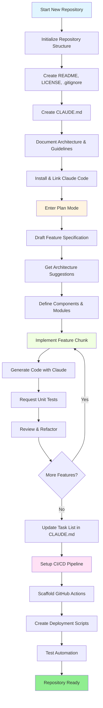
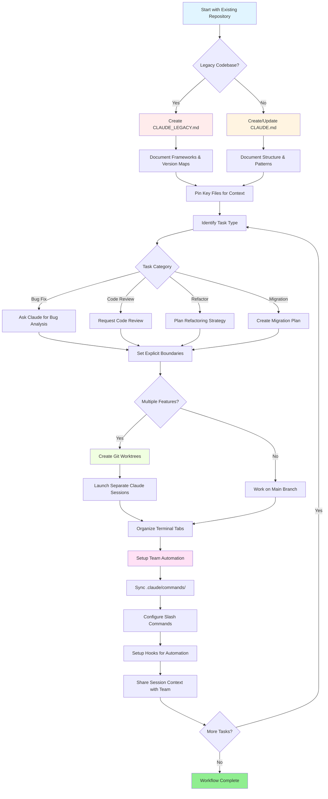

<picture>
  <source media="(prefers-color-scheme: dark)" srcset="resources/logos/claude-howto-logo-dark.svg">
  
</picture>

# 유용한 리소스 목록

## 공식 문서

| Resource | Description | Link |
|----------|-------------|------|
| Claude Code Docs | 공식 Claude Code 문서 | [code.claude.com/docs/en/overview](https://code.claude.com/docs/en/overview) |
| Anthropic Docs | Anthropic 전체 문서 | [docs.anthropic.com](https://docs.anthropic.com) |
| MCP Protocol | Model Context Protocol 명세 | [modelcontextprotocol.io](https://modelcontextprotocol.io) |
| MCP Servers | 공식 MCP 서버 구현체 | [github.com/modelcontextprotocol/servers](https://github.com/modelcontextprotocol/servers) |
| Anthropic Cookbook | 코드 예제 및 튜토리얼 | [github.com/anthropics/anthropic-cookbook](https://github.com/anthropics/anthropic-cookbook) |
| Claude Code Skills | 커뮤니티 스킬 저장소 | [github.com/anthropics/skills](https://github.com/anthropics/skills) |
| Agent Teams | 멀티 에이전트 조정 및 협업 | [code.claude.com/docs/en/agent-teams](https://code.claude.com/docs/en/agent-teams) |
| Scheduled Tasks | /loop 및 cron을 활용한 반복 작업 | [code.claude.com/docs/en/scheduled-tasks](https://code.claude.com/docs/en/scheduled-tasks) |
| Chrome Integration | 브라우저 자동화 | [code.claude.com/docs/en/chrome](https://code.claude.com/docs/en/chrome) |
| Keybindings | 키보드 단축키 사용자 정의 | [code.claude.com/docs/en/keybindings](https://code.claude.com/docs/en/keybindings) |
| Desktop App | 네이티브 데스크톱 애플리케이션 | [code.claude.com/docs/en/desktop](https://code.claude.com/docs/en/desktop) |
| Remote Control | 원격 세션 제어 | [code.claude.com/docs/en/remote-control](https://code.claude.com/docs/en/remote-control) |
| Auto Mode | 자동 권한 관리 | [code.claude.com/docs/en/permissions](https://code.claude.com/docs/en/permissions) |
| Channels | 멀티 채널 통신 | [code.claude.com/docs/en/channels](https://code.claude.com/docs/en/channels) |
| Voice Dictation | Claude Code를 위한 음성 입력 | [code.claude.com/docs/en/voice-dictation](https://code.claude.com/docs/en/voice-dictation) |

## Anthropic 엔지니어링 블로그

| Article | Description | Link |
|---------|-------------|------|
| Code Execution with MCP | 코드 실행을 활용하여 MCP 컨텍스트 팽창 문제를 해결하는 방법 — 토큰 사용량 98.7% 감소 | [anthropic.com/engineering/code-execution-with-mcp](https://www.anthropic.com/engineering/code-execution-with-mcp) |

---

## 30분 만에 Claude Code 마스터하기

_Video_: https://www.youtube.com/watch?v=6eBSHbLKuN0

_**모든 팁**_
- **고급 기능 및 단축키 활용하기**
  - 릴리스 노트를 정기적으로 확인하여 Claude의 새로운 코드 편집 및 컨텍스트 기능을 파악하세요.
  - 키보드 단축키를 익혀 채팅, 파일, 에디터 화면을 빠르게 전환하세요.

- **효율적인 설정**
  - 프로젝트별 세션을 명확한 이름과 설명으로 생성하여 쉽게 찾을 수 있도록 하세요.
  - 자주 사용하는 파일이나 폴더를 고정하여 Claude가 언제든 접근할 수 있도록 하세요.
  - GitHub, 주요 IDE 등 Claude의 연동 기능을 설정해 개발 과정을 간소화하세요.

- **효과적인 코드베이스 질의응답**
  - 아키텍처, 디자인 패턴, 특정 모듈에 대해 Claude에게 구체적으로 질문하세요.
  - 질문 시 파일 및 라인 번호를 함께 제공하세요(예: `app/models/user.py`의 로직은 무엇을 수행하나요?).
  - 대규모 코드베이스에서는 요약본이나 매니페스트를 제공해 Claude가 핵심에 집중할 수 있도록 하세요.
  - **예시 프롬프트**: _"src/auth/AuthService.ts:45-120에 구현된 인증 흐름을 설명해 주세요. 이 로직이 src/middleware/auth.ts의 미들웨어와 어떻게 통합되는지도 알려주세요."_

- **코드 편집 및 리팩터링**
  - 코드 블록 내 인라인 주석이나 요청을 사용해 원하는 수정만 집중적으로 수행하도록 하세요("가독성을 위해 이 함수를 리팩터링해 주세요").
  - 수정 전후 비교를 요청하세요.
  - 주요 수정 이후에는 테스트 코드나 문서를 생성하도록 요청해 품질을 확보하세요.
  - **예시 프롬프트**: _"api/users.js의 getUserData 함수를 Promise 대신 async/await를 사용하도록 리팩터링해 주세요. 수정 전후 비교를 보여주고, 리팩터링된 버전에 대한 단위 테스트도 생성해 주세요."_

- **컨텍스트 관리**
  - 현재 작업과 관련된 코드와 컨텍스트만 제공하세요.
  - "파일 A가 있고, 함수 B가 있으며, 질문은 X입니다"와 같은 구조화된 프롬프트를 사용하세요.
  - 컨텍스트 한도를 초과하지 않도록 큰 파일은 제거하거나 축약하세요.
  - **예시 프롬프트**: _"models/User.js의 User 모델과 utils/validation.js의 validateUser 함수입니다. 이메일 검증 기능을 추가하면서도 기존 호환성을 유지하려면 어떻게 해야 하나요?"_

- **팀 도구 통합**
  - Claude 세션을 팀의 저장소 및 문서와 연결하세요.
  - 반복적인 엔지니어링 작업을 위해 기본 템플릿을 사용하거나 사용자 정의 템플릿을 만드세요.
  - 세션 기록과 프롬프트를 팀원들과 공유하여 협업하세요.

- **성능 향상**
  - Claude에게 명확하고 목표 지향적인 지시를 제공하세요(예: "이 클래스를 다섯 개의 핵심 항목으로 요약해 주세요").
  - 불필요한 주석과 보일러플레이트 코드를 컨텍스트에서 제거하세요.
  - 결과가 기대와 다를 경우 컨텍스트를 초기화하거나 질문을 다시 표현하세요.
  - **예시 프롬프트**: _"src/db/Manager.ts의 DatabaseManager 클래스를 주요 책임과 핵심 메서드 중심으로 다섯 개 항목으로 요약해 주세요."_

- **실전 활용 사례**
  - 디버깅: 오류 메시지와 스택 트레이스를 붙여 넣고 원인과 해결 방법을 요청하세요.
  - 테스트 생성: 복잡한 로직에 대해 속성 기반 테스트, 단위 테스트, 통합 테스트를 요청하세요.
  - 코드 리뷰: 위험한 변경 사항, 예외 상황, 코드 스멜을 찾아달라고 요청하세요.
  - **예시 프롬프트**
    - _"components/UserList.jsx의 42번째 줄에서 'TypeError: Cannot read property 'map' of undefined' 오류가 발생합니다. 스택 트레이스와 관련 코드는 다음과 같습니다. 원인과 해결 방법을 알려주세요."_
    - _"PaymentProcessor 클래스에 대한 포괄적인 단위 테스트를 생성해 주세요. 실패한 거래, 타임아웃, 잘못된 입력 등 예외 상황도 포함해 주세요."_
    - _"이 Pull Request diff를 검토하고 잠재적인 보안 문제, 성능 병목, 코드 스멜을 찾아주세요."_

- **워크플로 자동화**
  - Claude 프롬프트를 활용해 포맷팅, 정리 작업, 반복적인 이름 변경 등의 작업을 자동화하세요.
  - Git diff를 기반으로 PR 설명, 릴리스 노트, 문서를 작성하도록 Claude를 활용하세요.
  - **예시 프롬프트**: _"git diff를 기반으로 변경 사항 요약, 수정된 파일 목록, 테스트 절차, 잠재적 영향을 포함한 상세한 PR 설명을 작성해 주세요. 또한 2.3.0 버전에 대한 릴리스 노트도 생성해 주세요."_

**팁**: 최상의 결과를 위해 여러 방법을 함께 활용하세요. 중요한 파일을 고정하고 목표를 요약하는 것부터 시작한 후, 집중적인 프롬프트와 Claude의 리팩터링 기능을 활용하여 코드베이스와 자동화를 점진적으로 개선하세요.

**Claude Code 추천 워크플로**

### Claude Code 추천 워크플로

#### 새로운 저장소의 경우

1. **저장소 및 Claude 연동 초기화**
   - 새로운 저장소에 README, LICENSE, .gitignore, 루트 설정 파일 등 기본 구조를 구성합니다.
   - 아키텍처, 상위 수준 목표, 코딩 가이드라인을 설명하는 `CLAUDE.md` 파일을 작성합니다.
   - Claude Code를 설치하고 저장소와 연결하여 코드 제안, 테스트 스캐폴딩, 워크플로 자동화를 활용합니다.

2. **계획 모드와 명세 활용**
   - 계획 모드(`shift-tab` 또는 `/plan`)를 사용해 기능 구현 전에 상세한 명세를 작성합니다.
   - 아키텍처 제안과 초기 프로젝트 구조를 Claude에게 요청합니다.
   - 명확하고 목표 지향적인 프롬프트 흐름을 유지하며 컴포넌트 구조, 주요 모듈, 책임 범위를 정의합니다.

3. **반복 개발 및 검토**
   - 핵심 기능을 작은 단위로 구현하면서 Claude에게 코드 생성, 리팩터링, 문서화를 요청합니다.
   - 각 단계마다 단위 테스트와 예제를 생성하도록 요청합니다.
   - `CLAUDE.md`에 지속적으로 작업 목록을 관리합니다.

4. **CI/CD 및 배포 자동화**
   - Claude를 활용하여 GitHub Actions, npm/yarn 스크립트 또는 배포 워크플로를 자동 생성합니다.
   - `CLAUDE.md`를 업데이트하고 관련 명령어나 스크립트 생성을 요청하여 파이프라인을 쉽게 수정할 수 있습니다.

#### 기존 저장소의 경우

1. **저장소 및 컨텍스트 설정**
   - 저장소 구조, 코딩 패턴, 핵심 파일을 문서화하기 위해 `CLAUDE.md`를 추가하거나 업데이트합니다.
   - 레거시 저장소의 경우 프레임워크, 버전 매핑, 작업 지침, 알려진 버그, 업그레이드 노트를 포함한 `CLAUDE_LEGACY.md`를 작성합니다.
   - Claude가 컨텍스트로 활용해야 할 주요 파일을 고정하거나 강조 표시합니다.

2. **컨텍스트 기반 코드 질의응답**
   - 특정 파일이나 함수를 참조하여 코드 리뷰, 버그 분석, 리팩터링 또는 마이그레이션 계획을 Claude에게 요청합니다.
   - "이 파일만 수정", "새로운 의존성 추가 금지"와 같이 명확한 작업 범위를 지정합니다.

3. **브랜치, 워크트리 및 멀티 세션 관리**
   - 기능 개발이나 버그 수정을 분리하기 위해 여러 Git 워크트리를 사용하고, 각 워크트리마다 별도의 Claude 세션을 실행합니다.
   - 병렬 작업을 위해 터미널 탭이나 창을 브랜치 또는 기능 단위로 정리합니다.

4. **팀 도구 및 자동화**
   - `.claude/commands/`를 통해 사용자 정의 명령어를 동기화하여 팀 전체의 일관성을 유지합니다.
   - Claude의 슬래시 명령어 또는 훅을 활용하여 반복 작업, PR 생성, 코드 포맷팅을 자동화합니다.
   - 협업 디버깅 및 리뷰를 위해 세션과 컨텍스트를 팀원들과 공유합니다.

**Tips**:**팁**:- Start each new feature or fix with a spec and plan mode prompt.
- 새로운 기능 개발이나 버그 수정은 항상 명세(Spec)와 계획 모드 프롬프트로 시작하세요.
- 레거시 저장소나 복잡한 저장소의 경우 상세한 가이드를 `CLAUDE.md` 또는 `CLAUDE_LEGACY.md`에 기록해 두세요.
- 명확하고 집중된 지시를 제공하고, 복잡한 작업은 여러 단계의 계획으로 나누어 진행하세요.
- 세션을 정기적으로 정리하고, 불필요한 컨텍스트를 제거하며, 완료된 워크트리를 삭제해 작업 환경을 깔끔하게 유지하세요.

위 단계들은 신규 코드베이스와 기존 코드베이스 모두에서 Claude Code를 효율적으로 활용하기 위한 핵심 권장 사항을 담고 있습니다.

---

## 새로운 기능 및 기능 향상 (2026년 5월)

### 주요 기능 리소스

| Feature | Description | Learn More |
|---------|-------------|------------|
| **Auto Memory** | Claude가 세션 간 사용자 선호도를 자동으로 학습하고 기억 | [Memory Guide](02-memory/) |
| **Remote Control** | 외부 도구 및 스크립트에서 Claude Code 세션을 프로그래밍 방식으로 제어 | [Advanced Features](09-advanced-features/) |
| **Web Sessions** | 브라우저 기반 인터페이스를 통해 원격 개발 환경에서 Claude Code 사용 | [CLI Reference](10-cli/) |
| **Desktop App** | 향상된 UI를 제공하는 Claude Code 네이티브 데스크톱 애플리케이션 | [Claude Code Docs](https://code.claude.com/docs/en/desktop) |
| **Extended Thinking** | `Alt+T`/`Option+T` 또는 `MAX_THINKING_TOKENS` 환경 변수를 통한 심층 추론 모드 | [Advanced Features](09-advanced-features/) |
| **Permission Modes** | default, acceptEdits, plan, auto, dontAsk, bypassPermissions 등 세밀한 권한 제어 | [Advanced Features](09-advanced-features/) |
| **7-Tier Memory** | Managed Policy, Project, Project Rules, User, User Rules, Local, Auto Memory로 구성된 7단계 메모리 구조 | [Memory Guide](02-memory/) |
| **Hook Events** | PreToolUse, PostToolUse, PostToolUseFailure, Stop, StopFailure, SubagentStart, SubagentStop, Notification, Elicitation 등 29개 이벤트 지원 | [Hooks Guide](06-hooks/) |
| **Agent Teams** | 복잡한 작업을 위해 여러 에이전트를 조정하고 협업 | [Subagents Guide](04-subagents/) |
| **Scheduled Tasks** | `/loop` 및 cron 도구를 사용한 반복 작업 설정 | [Advanced Features](09-advanced-features/) |
| **Chrome Integration** | Headless Chromium을 활용한 브라우저 자동화 | [Advanced Features](09-advanced-features/) |
| **Keyboard Customization** | 키 조합(Chord Sequence)을 포함한 단축키 사용자 정의 | [Advanced Features](09-advanced-features/) |
| **Monitor Tool** | 폴링 대신 백그라운드 명령의 stdout 스트림을 모니터링하고 이벤트에 반응 (v2.1.98+) | [Advanced Features](09-advanced-features/) |
| **/goal mode** | 세션 단위 완료 조건을 등록하면 달성될 때까지 Claude가 작업을 계속 수행 (v2.1.139+) | [Slash Commands](01-slash-commands/) |
| **claude agents (Agent View)** | 터미널에서 백그라운드 에이전트 조회, 확인 및 재개 가능. 기계 판독용 출력은 `--json` 사용 (v2.1.139+, `--json`은 v2.1.145 추가) | [code.claude.com/docs/en/agent-view](https://code.claude.com/docs/en/agent-view) |
| **/run, /verify, /run-skill-generator** | 프로젝트 실행, 수정 사항 검증, 프로젝트별 run/verify 스킬 생성 기능 제공 (v2.1.145+) | [Skills Guide](03-skills/) |

---
**최종 업데이트**: 2026년 6월 2일
**Claude Code 버전**: 2.1.160
**출처**:
- https://code.claude.com/docs/en/overview
- https://code.claude.com/docs/en/changelog
- https://code.claude.com/docs/en/agent-view
- https://github.com/anthropics/claude-code/releases/tag/v2.1.144
- https://github.com/anthropics/claude-code/releases/tag/v2.1.145
**호환 모델**: Claude Sonnet 4.6, Claude Opus 4.8, Claude Haiku 4.5
