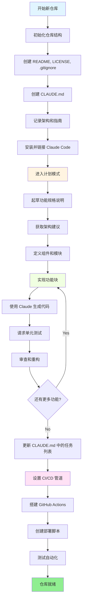
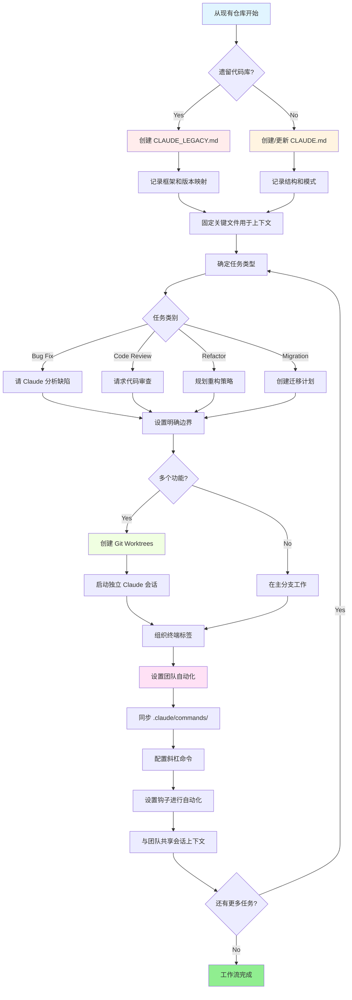

<picture>
  <source media="(prefers-color-scheme: dark)" srcset="resources/logos/claude-howto-logo-dark.svg">
  
</picture>

# 优质资源列表

## 官方文档

| 资源 | 描述 | 链接 |
|----------|-------------|------|
| Claude Code Docs | Claude Code 官方文档 | [code.claude.com/docs/en/overview](https://code.claude.com/docs/en/overview) |
| Anthropic Docs | Anthropic 完整文档 | [docs.anthropic.com](https://docs.anthropic.com) |
| MCP Protocol | Model Context Protocol 规范 | [modelcontextprotocol.io](https://modelcontextprotocol.io) |
| MCP Servers | 官方 MCP 服务器实现 | [github.com/modelcontextprotocol/servers](https://github.com/modelcontextprotocol/servers) |
| Anthropic Cookbook | 代码示例与教程 | [github.com/anthropics/anthropic-cookbook](https://github.com/anthropics/anthropic-cookbook) |
| Claude Code Skills | 社区技能仓库 | [github.com/anthropics/skills](https://github.com/anthropics/skills) |
| Agent Teams | 多智能体协调与协作 | [code.claude.com/docs/en/agent-teams](https://code.claude.com/docs/en/agent-teams) |
| Scheduled Tasks | 使用 /loop 和 cron 的定期任务 | [code.claude.com/docs/en/scheduled-tasks](https://code.claude.com/docs/en/scheduled-tasks) |
| Chrome Integration | 浏览器自动化 | [code.claude.com/docs/en/chrome](https://code.claude.com/docs/en/chrome) |
| Keybindings | 键盘快捷键自定义 | [code.claude.com/docs/en/keybindings](https://code.claude.com/docs/en/keybindings) |
| Desktop App | 原生桌面应用程序 | [code.claude.com/docs/en/desktop](https://code.claude.com/docs/en/desktop) |
| Remote Control | 远程会话控制 | [code.claude.com/docs/en/remote-control](https://code.claude.com/docs/en/remote-control) |
| Auto Mode | 自动权限管理 | [code.claude.com/docs/en/auto-mode](https://code.claude.com/docs/en/auto-mode) |
| Channels | 多渠道通信 | [code.claude.com/docs/en/channels](https://code.claude.com/docs/en/channels) |
| Voice Dictation | Claude Code 语音输入 | [code.claude.com/docs/en/voice-dictation](https://code.claude.com/docs/en/voice-dictation) |

## Anthropic 工程博客

| 文章 | 描述 | 链接 |
|---------|-------------|------|
| Code Execution with MCP | 如何使用代码执行解决 MCP 上下文膨胀问题 —— 减少 98.7% 的 token 用量 | [anthropic.com/engineering/code-execution-with-mcp](https://www.anthropic.com/engineering/code-execution-with-mcp) |

---

## 30 分钟精通 Claude Code

_视频_：https://www.youtube.com/watch?v=6eBSHbLKuN0

_**所有技巧**_
- **探索高级功能和快捷键**
  - 定期查看 Claude 发布说明中的新代码编辑和上下文功能。
  - 学习键盘快捷键，快速在聊天、文件和编辑器视图之间切换。

- **高效设置**
  - 创建有清晰名称/描述的项目专属会话，便于检索。
  - 固定最常用的文件或文件夹，以便 Claude 随时访问。
  - 设置 Claude 的集成（如 GitHub、流行 IDE），简化编码流程。

- **高效的代码库问答**
  - 向 Claude 提出关于架构、设计模式和具体模块的详细问题。
  - 在问题中使用文件和行引用（如"app/models/user.py 中的逻辑实现了什么？"）。
  - 对于大型代码库，提供摘要或清单以帮助 Claude 聚焦。
  - **示例提示**：_"你能解释一下 src/auth/AuthService.ts:45-120 中实现的身份验证流程吗？它是如何与 src/middleware/auth.ts 中的中间件集成的？"_

- **代码编辑与重构**
  - 使用内联注释或代码块中的请求获取有针对性的编辑（"重构此函数以提高清晰度"）。
  - 要求前后对比。
  - 在重大编辑后让 Claude 生成测试或文档以确保质量。
  - **示例提示**：_"重构 api/users.js 中的 getUserData 函数，使用 async/await 替代 promise。给我看修改前后的对比，并为重构后的版本生成单元测试。"_

- **上下文管理**
  - 将粘贴的代码/上下文限制在当前任务相关的内容上。
  - 使用结构化提示（"这是文件 A，这是函数 B，我的问题是 X"）以获得最佳性能。
  - 在提示窗口中删除或折叠大文件，以避免超出上下文限制。
  - **示例提示**：_"这是 models/User.js 中的 User 模型和 utils/validation.js 中的 validateUser 函数。我的问题是：如何在保持向后兼容性的同时添加电子邮件验证？"_

- **集成团队工具**
  - 将 Claude 会话连接到团队的仓库和文档。
  - 使用内置模板或为重复的工程任务创建自定义模板。
  - 通过分享会话记录和提示与队友协作。

- **提升性能**
  - 给 Claude 清晰、以目标为导向的指令（如"用五个要点总结这个类"）。
  - 从上下文窗口中删除不必要的注释和样板代码。
  - 如果 Claude 的输出偏离轨道，重置上下文或重新表述问题以获得更好的对齐。
  - **示例提示**：_"用五个要点总结 src/db/Manager.ts 中的 DatabaseManager 类，重点关注其主要职责和关键方法。"_

- **实际使用示例**
  - 调试：粘贴错误和堆栈跟踪，然后询问可能的原因和修复方法。
  - 测试生成：为复杂逻辑请求基于属性、单元或集成测试。
  - 代码审查：让 Claude 识别有风险的变更、边界情况或代码坏味道。
  - **示例提示**：
    - _"我在 components/UserList.jsx 第 42 行遇到这个错误：'TypeError: Cannot read property 'map' of undefined'。这是堆栈跟踪和相关代码。是什么原因，如何修复？"_
    - _"为 PaymentProcessor 类生成全面的单元测试，包括失败交易、超时和无效输入的边界情况。"_
    - _"审查这个 pull request 的 diff，识别潜在的安全问题、性能瓶颈和代码坏味道。"_

- **工作流自动化**
  - 使用 Claude 提示脚本化重复任务（如格式化、清理和重复重命名）。
  - 使用 Claude 根据代码 diff 起草 PR 描述、发布说明或文档。
  - **示例提示**：_"根据 git diff，创建详细的 PR 描述，包括变更摘要、修改文件列表、测试步骤和潜在影响。同时为版本 2.3.0 生成发布说明。"_

**提示**：为获得最佳结果，结合以上几种实践——从固定关键文件和总结目标开始，然后使用聚焦的提示和 Claude 的重构工具，逐步改善你的代码库和自动化。

**Claude Code 推荐工作流**

### Claude Code 推荐工作流

#### 新仓库

1. **初始化仓库和 Claude 集成**
   - 使用基本结构设置新仓库：README、LICENSE、.gitignore、根目录配置。
   - 创建 `CLAUDE.md` 文件，描述架构、高层目标和编码指南。
   - 安装 Claude Code 并将其链接到你的仓库，用于代码建议、测试脚手架和工作流自动化。

2. **使用计划模式和规格说明**
   - 在实现功能前，使用计划模式（`shift-tab` 或 `/plan`）起草详细规格说明。
   - 向 Claude 寻求架构建议和初始项目布局。
   - 保持清晰、以目标为导向的提示顺序——询问组件概述、主要模块和职责。

3. **迭代开发和审查**
   - 分小块实现核心功能，提示 Claude 进行代码生成、重构和文档编写。
   - 每次增量后请求单元测试和示例。
   - 在 CLAUDE.md 中维护运行中的任务列表。

4. **自动化 CI/CD 和部署**
   - 使用 Claude 搭建 GitHub Actions、npm/yarn 脚本或部署工作流。
   - 通过更新 CLAUDE.md 并请求相应命令/脚本，轻松调整管道。

#### 现有仓库

1. **仓库和上下文设置**
   - 添加或更新 `CLAUDE.md` 以记录仓库结构、编码模式和关键文件。对于遗留仓库，使用 `CLAUDE_LEGACY.md` 涵盖框架、版本映射、说明、缺陷和升级说明。
   - 固定或突出显示 Claude 应用于上下文的主要文件。

2. **上下文代码问答**
   - 请 Claude 进行代码审查、缺陷解释、重构或引用特定文件/函数的迁移计划。
   - 给 Claude 明确的边界（如"仅修改这些文件"或"不引入新依赖"）。

3. **分支、Worktree 和多会话管理**
   - 使用多个 git worktree 进行隔离的功能开发或缺陷修复，并为每个 worktree 启动独立的 Claude 会话。
   - 按分支或功能组织终端标签/窗口，实现并行工作流。

4. **团队工具和自动化**
   - 通过 `.claude/commands/` 同步自定义命令，实现跨团队一致性。
   - 通过 Claude 的斜杠命令或钩子自动化重复任务、PR 创建和代码格式化。
   - 与团队成员共享会话和上下文，用于协作排障和审查。

**提示**：
- 每个新功能或修复都从规格说明和计划模式提示开始。
- 对于遗留和复杂仓库，在 CLAUDE.md/CLAUDE_LEGACY.md 中存储详细指南。
- 给出清晰、聚焦的指令，将复杂工作分解为多阶段计划。
- 定期清理会话、修剪上下文、删除已完成的 worktree，以避免混乱。

这些步骤涵盖了在新旧代码库中使用 Claude Code 实现顺畅工作流的核心建议。

---

## 新功能和能力（2026 年 3 月）

### 关键功能资源

| 功能 | 描述 | 了解更多 |
|---------|-------------|------------|
| **Auto Memory（自动记忆）** | Claude 自动学习并跨会话记住你的偏好 | [记忆指南](02-memory/) |
| **Remote Control（远程控制）** | 通过外部工具和脚本以编程方式控制 Claude Code 会话 | [高级功能](09-advanced-features/) |
| **Web Sessions（Web 会话）** | 通过基于浏览器的界面访问 Claude Code 进行远程开发 | [CLI 参考](10-cli/) |
| **Desktop App（桌面应用）** | 具有增强 UI 的 Claude Code 原生桌面应用程序 | [Claude Code 文档](https://code.claude.com/docs/en/desktop) |
| **Extended Thinking（扩展思考）** | 通过 `Alt+T`/`Option+T` 或 `MAX_THINKING_TOKENS` 环境变量切换深度推理 | [高级功能](09-advanced-features/) |
| **Permission Modes（权限模式）** | 精细控制：default、acceptEdits、plan、auto、dontAsk、bypassPermissions | [高级功能](09-advanced-features/) |
| **7-Tier Memory（7 层记忆）** | 托管策略、项目、项目规则、用户、用户规则、本地、自动记忆 | [记忆指南](02-memory/) |
| **Hook Events（钩子事件）** | 25 个事件：PreToolUse、PostToolUse、PostToolUseFailure、Stop、StopFailure、SubagentStart、SubagentStop、Notification、Elicitation 等 | [钩子指南](06-hooks/) |
| **Agent Teams（智能体团队）** | 协调多个智能体共同完成复杂任务 | [子智能体指南](04-subagents/) |
| **Scheduled Tasks（定时任务）** | 使用 `/loop` 和 cron 工具设置定期任务 | [高级功能](09-advanced-features/) |
| **Chrome Integration（Chrome 集成）** | 使用无头 Chromium 实现浏览器自动化 | [高级功能](09-advanced-features/) |
| **Keyboard Customization（键盘自定义）** | 自定义键绑定，包括和弦序列 | [高级功能](09-advanced-features/) |
