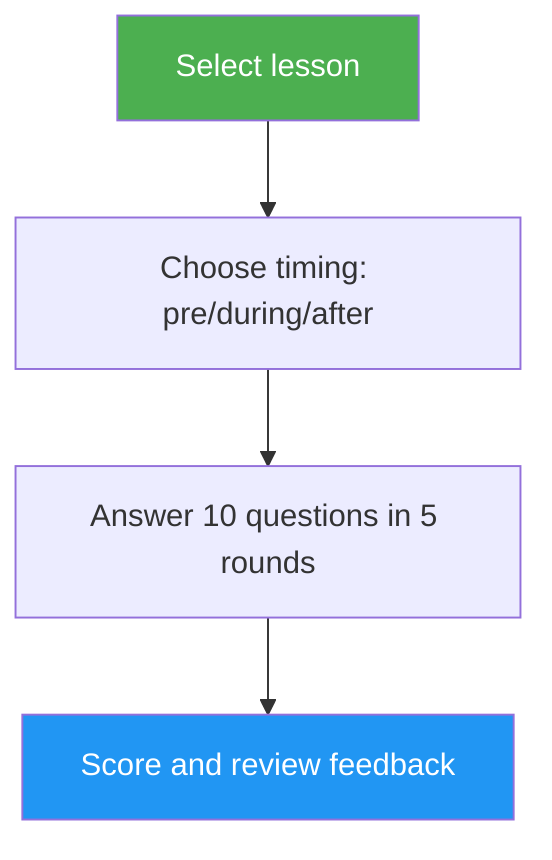

<!-- i18n-source: .claude/skills/lesson-quiz/README.md -->
<!-- i18n-date: 2026-07-16 -->
# Lesson Quiz

> แบบทดสอบเชิงโต้ตอบที่ทดสอบความเข้าใจของคุณต่อบทเรียน Claude Code เฉพาะบท ด้วยคำถาม 10 ข้อ พร้อม feedback รายข้อ และคำแนะนำการทบทวนแบบเจาะจง

## จุดเด่น

- คำถาม 10 ข้อต่อบทเรียน ผสมผสานความเข้าใจเชิงแนวคิดและการประยุกต์ใช้จริง
- ครอบคลุมทั้ง 10 บทเรียน (01-Slash Commands จนถึง 10-CLI)
- โหมดจับเวลาสามแบบ: pre-test, ตรวจสอบความคืบหน้า หรือยืนยันความเชี่ยวชาญ
- feedback รายข้อพร้อมคำตอบที่ถูกต้องและคำอธิบาย
- คำแนะนำการทบทวนแบบเจาะจงที่ชี้ไปยังหัวข้อเฉพาะของบทเรียน
- คลังคำถาม 100 ข้อครอบคลุมทุกบทเรียนใน `references/question-bank.md`

## เมื่อใดควรใช้

| พูดแบบนี้... | Skill จะ... |
|---|---|
| "quiz me on hooks" | รันแบบทดสอบ 10 ข้อของบทเรียน 06: Hooks |
| "lesson quiz 03" | ทดสอบความรู้ของคุณเกี่ยวกับบทเรียน 03: Skills |
| "do I understand MCP" | ประเมินความเข้าใจของคุณเกี่ยวกับบทเรียน 05: MCP |
| "practice quiz" | ให้คุณเลือกบทเรียน แล้วจึงทดสอบคุณ |

## วิธีการทำงาน



## การใช้งาน

```
/lesson-quiz [lesson-name-or-number]
```

ตัวอย่าง:
```
/lesson-quiz hooks
/lesson-quiz 03
/lesson-quiz advanced-features
/lesson-quiz           # (prompts for lesson selection)
```

## ผลลัพธ์

### รายงานคะแนน
- คะแนนรวมจากเต็ม 10 พร้อมเกรด (Mastered / Proficient / Developing / Beginning)
- การแยกแยะตามหมวดหมู่คำถาม (เชิงแนวคิด vs. เชิงปฏิบัติ)

### feedback รายข้อ
สำหรับคำตอบที่ผิดแต่ละข้อ:
- สิ่งที่คุณตอบ vs. คำตอบที่ถูกต้อง
- คำอธิบายว่าทำไมคำตอบที่ถูกต้องจึงถูก
- หัวข้อเฉพาะของบทเรียนที่ควรทบทวน

### คำแนะนำที่คำนึงถึงช่วงเวลา
- **Pre-test**: สร้างเส้นฐาน เน้นย้ำจุดที่ควรโฟกัสระหว่างการเรียน
- **During**: ระบุสิ่งที่คุณเข้าใจแล้วและสิ่งที่ควรกลับไปทบทวน
- **After**: ยืนยันความเชี่ยวชาญหรือชี้จุดช่องว่างที่ยังเหลืออยู่

## ทรัพยากร

| Path | คำอธิบาย |
|---|---|
| `references/question-bank.md` | คำถามที่เขียนไว้ล่วงหน้า 100 ข้อ (10 ข้อต่อบทเรียน) พร้อมคำตอบ คำอธิบาย และตัวชี้การทบทวน |
