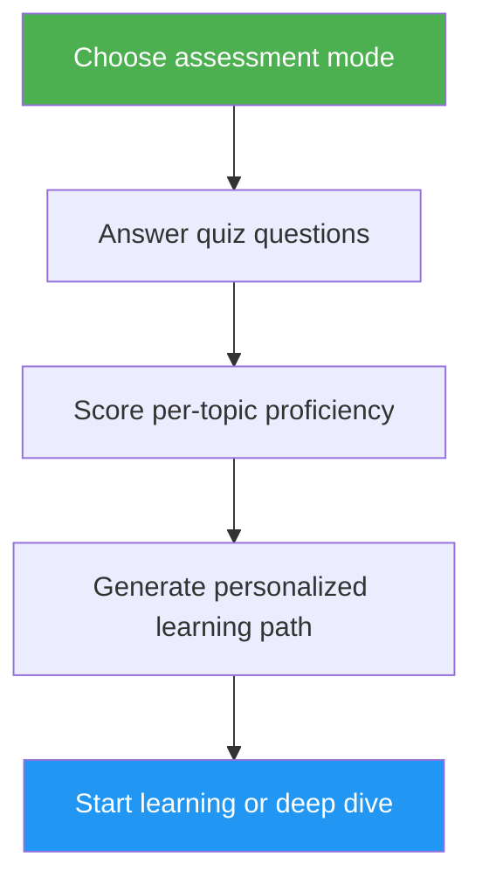

<!-- i18n-source: .claude/skills/self-assessment/README.md -->
<!-- i18n-date: 2026-07-16 -->
# Self-Assessment & Learning Path Advisor

> การประเมินความเชี่ยวชาญ Claude Code แบบครอบคลุมที่ประเมิน 10 ด้านฟีเจอร์ ระบุช่องว่างทักษะ และสร้างเส้นทางการเรียนรู้เฉพาะบุคคลเพื่อยกระดับ

## จุดเด่น

- โหมดการประเมินสองแบบ: Quick (8 คำถาม, 2 นาที) และ Deep (5 รอบ, 5 นาที)
- ประเมิน 10 ด้านฟีเจอร์: Slash Commands, Memory, Skills, Hooks, MCP, Subagents, Checkpoints, Advanced Features, Plugins, CLI
- การให้คะแนนรายหัวข้อพร้อมระดับความเชี่ยวชาญ (None / Basic / Proficient)
- การวิเคราะห์ช่องว่างพร้อมการจัดลำดับความสำคัญที่คำนึงถึง dependency
- เส้นทางการเรียนรู้เฉพาะบุคคลพร้อมแบบฝึกหัดเฉพาะและเกณฑ์ความสำเร็จ
- การดำเนินการต่อ: เริ่มเรียนรู้, เจาะลึก, โปรเจกต์ฝึกฝน หรือทำแบบประเมินใหม่

## เมื่อใดควรใช้

| พูดแบบนี้... | Skill จะ... |
|---|---|
| "assess my level" | รันแบบทดสอบประเมินและกำหนดระดับของคุณ |
| "where should I start" | ประเมินประสบการณ์ของคุณและแนะนำจุดเริ่มต้น |
| "check my skills" | สร้างโปรไฟล์ทักษะโดยละเอียดครอบคลุมทั้ง 10 ด้าน |
| "what should I learn next" | ระบุช่องว่างและสร้างเส้นทางการเรียนรู้ที่จัดลำดับความสำคัญ |

## วิธีการทำงาน



## โหมดการประเมิน

### Quick Assessment (~2 นาที)
- คำถามประสบการณ์แบบ ใช่/ไม่ใช่ 8 ข้อ ใน 2 รอบ
- กำหนดระดับโดยรวม: Beginner / Intermediate / Advanced
- แสดงรายการช่องว่างเฉพาะพร้อมลิงก์บทเรียน
- เหมาะสำหรับ: ผู้ใช้ครั้งแรก, การตรวจสอบอย่างรวดเร็ว

### Deep Assessment (~5 นาที)
- คำถาม 5 รอบครอบคลุม 10 ด้านฟีเจอร์ (2 หัวข้อต่อรอบ)
- การให้คะแนนรายหัวข้อ (0-2 คะแนนต่อหัวข้อ รวม 20 คะแนน)
- ตารางความเชี่ยวชาญพร้อมด้านที่แข็งแกร่ง ช่องว่างสำคัญ และรายการที่ควรทบทวน
- เส้นทางการเรียนรู้ที่คำนึงถึง dependency พร้อมเฟสและการประมาณเวลา
- โปรเจกต์ฝึกฝนที่แนะนำซึ่งรวมหัวข้อที่เป็นช่องว่าง
- เหมาะสำหรับ: ผู้ใช้ที่มีประสบการณ์ที่ต้องการยกระดับ, การทบทวนทักษะเป็นระยะ

## การใช้งาน

```
/self-assessment
```

## ผลลัพธ์

### ตารางโปรไฟล์ทักษะ
แสดงคะแนนรายหัวข้อ ระดับความเชี่ยวชาญ และสถานะ (Learn / Review / Mastered)

### เส้นทางการเรียนรู้เฉพาะบุคคล
- จัดระเบียบเป็นเฟสตามลำดับ dependency
- แต่ละหัวข้อประกอบด้วย: ลิงก์บทเรียน, จุดที่ควรโฟกัส, แบบฝึกหัดสำคัญ, เกณฑ์ความสำเร็จ
- การประมาณเวลาที่ปรับตามหัวข้อที่เชี่ยวชาญแล้ว
- โปรเจกต์ฝึกฝนที่รวมหลายด้านที่เป็นช่องว่าง

### การดำเนินการต่อ
หลังจากได้ผลลัพธ์ เลือกที่จะ:
- เริ่มบทเรียนช่องว่างแรกพร้อมแบบฝึกหัดแบบมีคำแนะนำ
- เจาะลึกด้านที่เป็นช่องว่างเฉพาะ
- ตั้งค่าโปรเจกต์ฝึกฝนที่ครอบคลุมช่องว่างของคุณ
- ทำแบบประเมินใหม่ในโหมดที่ต่างออกไป
