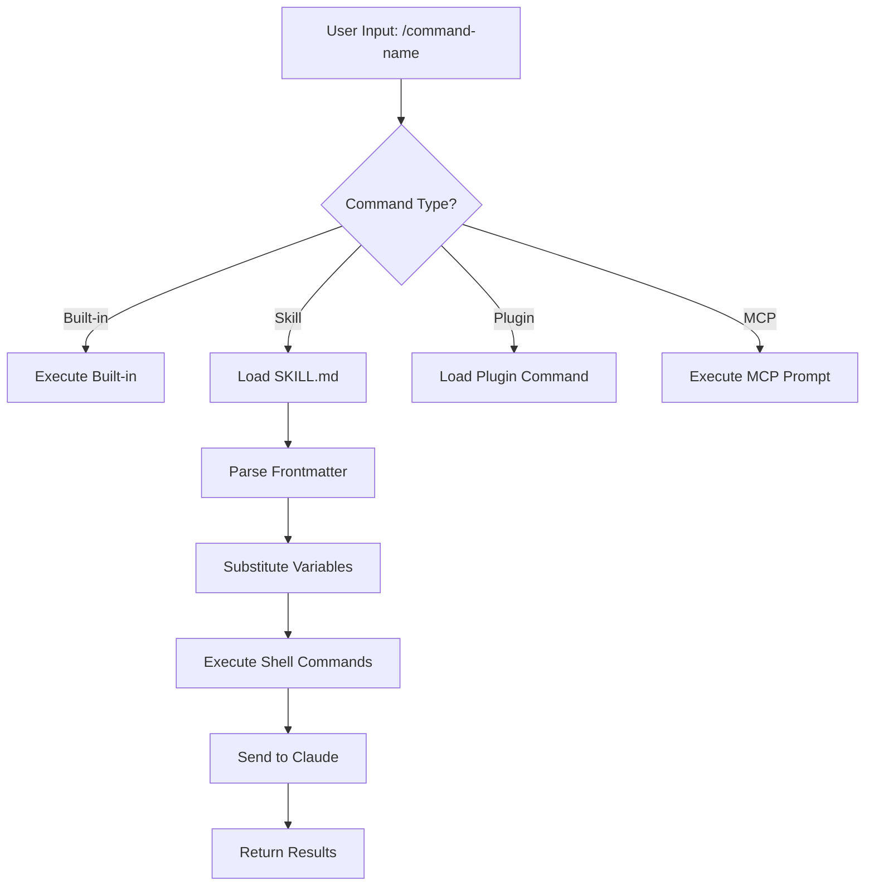
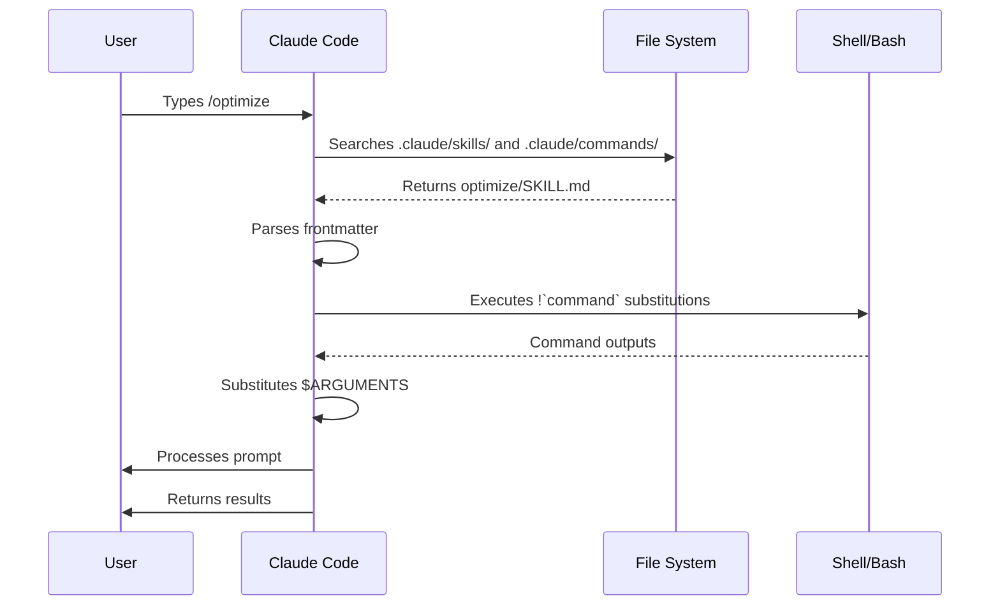

<!-- i18n-source: 01-slash-commands/README.md -->
<!-- i18n-date: 2026-05-08 -->
<picture>
  <source media="(prefers-color-scheme: dark)" srcset="../resources/logos/claude-howto-logo-dark.svg">
  
</picture>

# Slash Commands

## ภาพรวม

Slash commands คือทางลัดที่ควบคุมพฤติกรรมของ Claude ระหว่าง interactive session โดยแบ่งออกเป็นหลายประเภท:

- **คำสั่งในตัว**: จัดเตรียมโดย Claude Code (`/help`, `/clear`, `/model`)
- **Skills**: คำสั่งที่ผู้ใช้กำหนดเองโดยสร้างเป็นไฟล์ `SKILL.md` (`/optimize`, `/pr`)
- **คำสั่งจาก plugin**: คำสั่งจาก plugin ที่ติดตั้งไว้ (`/frontend-design:frontend-design`)
- **MCP prompts**: คำสั่งจาก MCP servers (`/mcp__github__list_prs`)

> **หมายเหตุ**: slash commands แบบกำหนดเองได้ถูกรวมเข้ากับ skills แล้ว ไฟล์ใน `.claude/commands/` ยังใช้งานได้ แต่ skills (`.claude/skills/`) เป็นแนวทางที่แนะนำในปัจจุบัน ทั้งสองวิธีสร้างทางลัด `/command-name` ดูรายละเอียดทั้งหมดใน [Skills Guide](../03-skills/)

## ข้อมูลอ้างอิงคำสั่งในตัว

คำสั่งในตัวคือทางลัดสำหรับการดำเนินการทั่วไป มี **คำสั่งในตัวมากกว่า 60 คำสั่ง** และ **skills ที่รวมมา 5 รายการ** พิมพ์ `/` ใน Claude Code เพื่อดูรายการทั้งหมด หรือพิมพ์ `/` ตามด้วยตัวอักษรใดก็ได้เพื่อกรอง

| คำสั่ง | วัตถุประสงค์ |
|---------|---------|
| `/add-dir <path>` | เพิ่มไดเรกทอรีทำงาน |
| `/agents` | จัดการการกำหนดค่า agent |
| `/branch [name]` | แตก conversation เป็น session ใหม่ (alias: `/fork`) หมายเหตุ: `/fork` เปลี่ยนชื่อเป็น `/branch` ใน v2.1.77 |
| `/btw <question>` | ถามคำถามชั่วคราวขณะที่ Claude กำลังทำงานในงานหลัก ไม่กระทบ context ของ conversation หลัก |
| `/chrome` | กำหนดค่าการรวม Chrome browser |
| `/clear` | ล้าง conversation (aliases: `/reset`, `/new`) |
| `/color [color\|default]` | ตั้งค่าสีของ prompt bar การใช้ `/color` โดยไม่มี args จะเลือกสีแบบสุ่ม (v2.1.128+) ส่งชื่อสีหรือ hex เพื่อตั้งค่าอย่างชัดเจน |
| `/compact [instructions]` | บีบอัด conversation พร้อม focus instructions เพิ่มเติม |
| `/config` | เปิดการตั้งค่า (alias: `/settings`) |
| `/context` | แสดง context usage เป็น colored grid |
| `/copy [N]` | คัดลอกการตอบสนองของ assistant ไปยัง clipboard; `w` เขียนไปยังไฟล์ |
| `/cost` | alias สำหรับ `/usage` — เปิดแท็บ cost (v2.1.118+) |
| `/desktop` | ต่อเนื่องใน Desktop app (alias: `/app`) |
| `/diff` | โปรแกรมดู diff แบบ interactive สำหรับการเปลี่ยนแปลงที่ยังไม่ได้ commit |
| `/doctor` | วินิจฉัยสุขภาพการติดตั้ง สามารถเปิดได้ขณะที่ Claude กำลังตอบสนอง แสดงไอคอนสถานะ กด `f` เพื่อแก้ไขปัญหาอัตโนมัติ (ปรับปรุงใน v2.1.116) |
| `/effort [low\|medium\|high\|xhigh\|max\|auto]` | ตั้งค่าระดับความพยายามผ่าน slider แบบ interactive ด้วยปุ่มลูกศร ระดับ: `low` → `medium` → `high` → `xhigh` (ใหม่ใน v2.1.111) → `max` ค่าเริ่มต้นคือ `xhigh` บน Opus 4.7; `max` ต้องใช้ Opus 4.7 |
| `/exit` | ออกจาก REPL (alias: `/quit`) |
| `/export [filename]` | ส่งออก conversation ปัจจุบันไปยังไฟล์หรือ clipboard |
| `/extra-usage` | กำหนดค่า extra usage สำหรับ rate limits |
| `/fast [on\|off]` | สลับ fast mode |
| `/feedback` | ส่ง feedback (alias: `/bug`) |
| `/focus` | สลับ focus view (เพิ่มใน v2.1.110 แทนที่ `Ctrl+O` สำหรับ focus toggle) |
| `/help` | แสดงความช่วยเหลือ |
| `/hooks` | ดูการกำหนดค่า hook |
| `/ide` | จัดการการรวม IDE |
| `/init` | เริ่มต้น `CLAUDE.md` ตั้งค่า `CLAUDE_CODE_NEW_INIT=1` สำหรับ interactive flow |
| `/insights` | สร้างรายงานวิเคราะห์ session |
| `/install-github-app` | ติดตั้ง GitHub Actions app |
| `/install-slack-app` | ติดตั้ง Slack app |
| `/keybindings` | เปิดการกำหนดค่า keybindings |
| `/less-permission-prompts` | วิเคราะห์การเรียก Bash/MCP tool ล่าสุดและเพิ่ม allowlist ที่มีลำดับความสำคัญใน `.claude/settings.json` เพื่อลดการแจ้งเตือนสิทธิ์ (เพิ่มใน v2.1.111) |
| `/login` | สลับบัญชี Anthropic |
| `/logout` | ออกจากบัญชี Anthropic |
| `/mcp` | จัดการ MCP servers และ OAuth |
| `/memory` | แก้ไข `CLAUDE.md` สลับ auto-memory |
| `/mobile` | QR code สำหรับ mobile app (aliases: `/ios`, `/android`) |
| `/model [model]` | เลือก model ด้วยปุ่มลูกศรซ้าย/ขวาสำหรับ effort |
| `/passes` | แบ่งปัน Claude Code สัปดาห์ฟรี |
| `/permissions` | ดู/อัปเดตสิทธิ์ (alias: `/allowed-tools`) |
| `/plan [description]` | เข้าสู่ plan mode |
| `/plugin` | จัดการ plugins |
| `/proactive` | Alias สำหรับ `/loop` (เพิ่มใน v2.1.105) |
| `/powerup` | ค้นพบฟีเจอร์ผ่านบทเรียนแบบ interactive พร้อม animated demos |
| `/privacy-settings` | การตั้งค่าความเป็นส่วนตัว (Pro/Max เท่านั้น) |
| `/release-notes` | ดู changelog |
| `/recap` | แสดงสรุป session เมื่อกลับมาที่ session (เพิ่มใน v2.1.108) |
| `/reload-plugins` | โหลด plugins ที่ใช้งานอยู่ใหม่ |
| `/remote-control` | ควบคุมระยะไกลจาก claude.ai (alias: `/rc`) |
| `/remote-env` | กำหนดค่า remote environment เริ่มต้น |
| `/rename [name]` | เปลี่ยนชื่อ session |
| `/resume [session]` | กลับมา conversation (alias: `/continue`) |
| `/review` | **เลิกใช้แล้ว** — ติดตั้ง plugin `code-review` แทน |
| `/rewind` | ย้อนกลับ conversation และ/หรือโค้ด (alias: `/checkpoint`) |
| `/sandbox` | สลับ sandbox mode |
| `/schedule [description]` | สร้าง/จัดการงานตามกำหนดเวลาบน Cloud |
| `/security-review` | วิเคราะห์ branch เพื่อหาช่องโหว่ความปลอดภัย |
| `/skills` | แสดงรายการ skills ที่มีอยู่ |
| `/stats` | alias สำหรับ `/usage` — เปิดแท็บ stats (การใช้งานรายวัน sessions streaks) (v2.1.118+) |
| `/stickers` | สั่งซื้อสติกเกอร์ Claude Code |
| `/status` | แสดงเวอร์ชัน model บัญชี |
| `/statusline` | กำหนดค่า status line |
| `/tasks` | แสดงรายการ/จัดการงานเบื้องหลัง |
| `/team-onboarding` | สร้างคู่มือการเริ่มต้นสำหรับเพื่อนร่วมทีมจากการตั้งค่า Claude Code ของโครงการ (ใหม่ใน v2.1.101) |
| `/terminal-setup` | กำหนดค่า keybindings ของ terminal |
| `/theme` | เปิด theme picker / จัดการ custom themes (v2.1.118) กำหนด custom themes ผ่าน JSON ใน `~/.claude/themes/<name>.json` |
| `/tui` | สลับ fullscreen TUI (text user interface) mode พร้อม flicker-free rendering (เพิ่มใน v2.1.110) |
| `/ultraplan <prompt>` | ร่างแผนใน ultraplan session ตรวจสอบใน browser |
| `/ultrareview` | การ code review บน cloud ที่ครอบคลุมด้วยการวิเคราะห์ multi-agent (เพิ่มใน v2.1.111) |
| `/undo` | Alias สำหรับ `/rewind` (เพิ่มใน v2.1.108) |
| `/upgrade` | เปิดหน้า upgrade สำหรับแผนระดับสูงขึ้น |
| `/usage` | แดชบอร์ด usage หลัก (v2.1.118) — รวมขีดจำกัดการใช้งานตามแผน rate limits cost และสถิติ session รายวัน `/cost` และ `/stats` เป็น alias ทางลัดที่เปิดแท็บเฉพาะ |
| `/voice` | สลับ push-to-talk voice dictation |

### Skills ที่รวมมา

Skills เหล่านี้มาพร้อมกับ Claude Code และเรียกใช้เหมือน slash commands:

| Skill | วัตถุประสงค์ |
|-------|---------|
| `/batch <instruction>` | จัดการการเปลี่ยนแปลงขนาดใหญ่แบบขนานโดยใช้ worktrees |
| `/claude-api` | โหลด Claude API reference สำหรับภาษาของโครงการ |
| `/debug [description]` | เปิดใช้งาน debug logging |
| `/loop [interval] <prompt>` | รัน prompt ซ้ำตามช่วงเวลา |
| `/simplify [focus]` | ตรวจสอบไฟล์ที่เปลี่ยนแปลงเพื่อคุณภาพโค้ด |

### คำสั่งที่เลิกใช้แล้ว

| คำสั่ง | สถานะ |
|---------|--------|
| `/review` | เลิกใช้แล้ว — แทนที่ด้วย plugin `code-review` |
| `/output-style` | เลิกใช้แล้วตั้งแต่ v2.1.73 |
| `/fork` | เปลี่ยนชื่อเป็น `/branch` (alias ยังใช้งานได้ v2.1.77) |
| `/pr-comments` | ลบออกใน v2.1.91 — ถามโดยตรงกับ Claude เพื่อดู PR comments |
| `/vim` | ลบออกใน v2.1.92 — ใช้ /config → Editor mode |

### การเปลี่ยนแปลงล่าสุด

- `/fork` เปลี่ยนชื่อเป็น `/branch` โดยคง `/fork` ไว้เป็น alias (v2.1.77)
- `/output-style` เลิกใช้แล้ว (v2.1.73)
- `/review` เลิกใช้แล้วเพื่อใช้ plugin `code-review` แทน
- เพิ่มคำสั่ง `/effort` พร้อมระดับ `max` ที่ต้องใช้ Opus 4.7
- เพิ่มคำสั่ง `/voice` สำหรับ push-to-talk voice dictation
- เพิ่มคำสั่ง `/schedule` สำหรับสร้าง/จัดการงานตามกำหนดเวลา
- เพิ่มคำสั่ง `/color` สำหรับการปรับแต่ง prompt bar
- ลบ /pr-comments ใน v2.1.91 — ถามโดยตรงกับ Claude เพื่อดู PR comments
- ลบ /vim ใน v2.1.92 — ใช้ /config → Editor mode แทน
- เพิ่ม /ultraplan สำหรับการวางแผนและการรันใน browser
- เพิ่ม /powerup สำหรับบทเรียนฟีเจอร์แบบ interactive
- เพิ่ม /sandbox สำหรับการสลับ sandbox mode
- ตัวเลือก `/model` แสดงป้ายกำกับที่อ่านได้ (เช่น "Sonnet 4.6") แทน model ID แบบดิบ
- `/resume` รองรับ alias `/continue`
- MCP prompts ใช้งานได้เป็นคำสั่ง `/mcp__<server>__<prompt>` (ดู [MCP Prompts as Commands](#mcp-prompts-เป็นคำสั่ง))
- เพิ่ม `/team-onboarding` สำหรับสร้างคู่มือการเริ่มต้นสำหรับเพื่อนร่วมทีมอัตโนมัติ (v2.1.101)
- เพิ่มคำสั่ง `/tui` สำหรับ flicker-free fullscreen TUI rendering (v2.1.110)
- เพิ่มคำสั่ง `/focus` สำหรับ focus view toggle; `Ctrl+O` ตอนนี้สลับเฉพาะ verbose transcript (v2.1.110)
- เพิ่มคำสั่ง `/recap` เพื่อเปิดใช้งาน session context recap ด้วยตนเอง (v2.1.108)
- เพิ่ม `/undo` เป็น alias สำหรับ `/rewind` (v2.1.108)
- เพิ่ม `/proactive` เป็น alias สำหรับ `/loop` (v2.1.105)
- `/effort` ได้รับ slider แบบ interactive ด้วยปุ่มลูกศรและระดับ `xhigh` ใหม่ระหว่าง `high` และ `max`; ค่าเริ่มต้นยกระดับเป็น `xhigh` สำหรับแผน Opus 4.7 (v2.1.111)
- เพิ่ม `/ultrareview` สำหรับ code review แบบ multi-agent บน cloud (v2.1.111)
- เพิ่ม `/less-permission-prompts` เพื่อวิเคราะห์การเรียก Bash/MCP tool และลดการแจ้งเตือนสิทธิ์ผ่าน allowlist ใน `.claude/settings.json` (v2.1.111)
- Auto mode ไม่ต้องใช้ flag `--enable-auto-mode` อีกต่อไปสำหรับสมาชิก Max บน Opus 4.7 (v2.1.112)

### `/team-onboarding` — คู่มือการเริ่มต้นสำหรับเพื่อนร่วมทีม

> **ใหม่ใน v2.1.101**

ใช้ `/team-onboarding` เพื่อสร้างคู่มือการเริ่มต้นสำหรับเพื่อนร่วมทีมจากการใช้งาน Claude Code ในโครงการของคุณ คำสั่งนี้ตรวจสอบ `CLAUDE.md`, skills ที่ติดตั้ง, subagents, hooks และ workflows ล่าสุด จากนั้นสร้างเอกสาร onboarding ที่ช่วยให้นักพัฒนาใหม่เริ่มต้นได้อย่างรวดเร็ว

เป็นคำสั่งในตัว ไม่ต้องติดตั้งอะไรเพิ่มเติม

**การใช้งาน:**

```bash
claude /team-onboarding
```

คู่มือที่สร้างขึ้นสรุป:

- วัตถุประสงค์ของโครงการและกฎเกณฑ์หลักจาก [`CLAUDE.md`](../02-memory/README.md)
- [skills](../03-skills/README.md) ที่มีอยู่และเมื่อใดที่เรียกใช้อัตโนมัติ
- [subagents](../04-subagents/README.md) ที่กำหนดค่าและความรับผิดชอบ
- [Hooks](../06-hooks/README.md) ที่รันบน events ทั่วไป
- Workflows ทั่วไปที่ผู้มาใหม่ควรรู้

**ความพร้อมใช้งาน:** มาพร้อมกับ Claude Code v2.1.101 (11 เมษายน 2026)

## Custom Commands (ปัจจุบันเป็น Skills)

slash commands แบบกำหนดเองได้ **ถูกรวมเข้ากับ skills** แล้ว ทั้งสองแนวทางสร้างคำสั่งที่เรียกใช้ด้วย `/command-name`:

| แนวทาง | ตำแหน่ง | สถานะ |
|----------|----------|--------|
| **Skills (แนะนำ)** | `.claude/skills/<name>/SKILL.md` | มาตรฐานปัจจุบัน |
| **Legacy Commands** | `.claude/commands/<name>.md` | ยังใช้งานได้ |

หากมีทั้ง skill และ command ที่มีชื่อเดียวกัน **skill จะมีความสำคัญกว่า** ตัวอย่างเช่น เมื่อมีทั้ง `.claude/commands/review.md` และ `.claude/skills/review/SKILL.md` เวอร์ชัน skill จะถูกใช้

### เส้นทางการย้าย

ไฟล์ `.claude/commands/` ที่มีอยู่ยังคงทำงานได้โดยไม่ต้องเปลี่ยนแปลง การย้ายไปใช้ skills:

**ก่อน (Command):**
```
.claude/commands/optimize.md
```

**หลัง (Skill):**
```
.claude/skills/optimize/SKILL.md
```

### เหตุใดจึงใช้ Skills?

Skills มีฟีเจอร์เพิ่มเติมเหนือ legacy commands:

- **โครงสร้างไดเรกทอรี**: รวม scripts, templates และ reference files
- **Auto-invocation**: Claude สามารถเรียกใช้ skills อัตโนมัติเมื่อเกี่ยวข้อง
- **การควบคุมการเรียกใช้**: เลือกว่าผู้ใช้ Claude หรือทั้งคู่สามารถเรียกใช้ได้
- **การรัน subagent**: รัน skills ใน context ที่แยกออกด้วย `context: fork`
- **Progressive disclosure**: โหลดไฟล์เพิ่มเติมเฉพาะเมื่อต้องการ

### การสร้าง Custom Command เป็น Skill

สร้างไดเรกทอรีพร้อมไฟล์ `SKILL.md`:

```bash
mkdir -p .claude/skills/my-command
```

**ไฟล์:** `.claude/skills/my-command/SKILL.md`

```yaml
---
name: my-command
description: สิ่งที่คำสั่งนี้ทำและเมื่อใดควรใช้
---

# My Command

คำแนะนำสำหรับ Claude ให้ปฏิบัติตามเมื่อเรียกใช้คำสั่งนี้

1. ขั้นตอนแรก
2. ขั้นตอนที่สอง
3. ขั้นตอนที่สาม
```

### ข้อมูลอ้างอิง Frontmatter

| ฟิลด์ | วัตถุประสงค์ | ค่าเริ่มต้น |
|-------|---------|---------|
| `name` | ชื่อคำสั่ง (กลายเป็น `/name`) | ชื่อไดเรกทอรี |
| `description` | คำอธิบายสั้น (ช่วย Claude รู้ว่าเมื่อใดควรใช้) | ย่อหน้าแรก |
| `argument-hint` | arguments ที่คาดหวังสำหรับ auto-completion | ไม่มี |
| `allowed-tools` | เครื่องมือที่คำสั่งสามารถใช้โดยไม่ต้องขอสิทธิ์ | สืบทอด |
| `model` | model เฉพาะที่จะใช้ | สืบทอด |
| `disable-model-invocation` | ถ้า `true` เฉพาะผู้ใช้เท่านั้นที่เรียกใช้ได้ (ไม่ใช่ Claude) | `false` |
| `user-invocable` | ถ้า `false` ซ่อนจากเมนู `/` | `true` |
| `context` | ตั้งเป็น `fork` เพื่อรันใน subagent ที่แยกออก | ไม่มี |
| `agent` | ประเภท agent เมื่อใช้ `context: fork` | `general-purpose` |
| `hooks` | hooks ที่กำหนดขอบเขตใน skill (PreToolUse, PostToolUse, Stop) | ไม่มี |

### Arguments

คำสั่งสามารถรับ arguments ได้:

**Arguments ทั้งหมดด้วย `$ARGUMENTS`:**

```yaml
---
name: fix-issue
description: แก้ไข GitHub issue ตามหมายเลข
---

แก้ไข issue #$ARGUMENTS ตามมาตรฐานการเขียนโค้ดของเรา
```

การใช้งาน: `/fix-issue 123` → `$ARGUMENTS` กลายเป็น "123"

**Arguments แต่ละตัวด้วย `$0`, `$1`, ฯลฯ:**

```yaml
---
name: review-pr
description: ตรวจสอบ PR พร้อมระดับความสำคัญ
---

ตรวจสอบ PR #$0 ด้วยระดับความสำคัญ $1
```

การใช้งาน: `/review-pr 456 high` → `$0`="456", `$1`="high"

### Dynamic Context ด้วย Shell Commands

รัน bash commands ก่อน prompt โดยใช้ `` !`command` ``:

```yaml
---
name: commit
description: สร้าง git commit พร้อม context
allowed-tools: Bash(git *)
---

## Context

- สถานะ git ปัจจุบัน: !`git status`
- git diff ปัจจุบัน: !`git diff HEAD`
- branch ปัจจุบัน: !`git branch --show-current`
- commits ล่าสุด: !`git log --oneline -5`

## งานของคุณ

จากการเปลี่ยนแปลงข้างต้น ให้สร้าง git commit เดียว
```

### File References

รวมเนื้อหาไฟล์โดยใช้ `@`:

```markdown
ตรวจสอบการ implement ใน @src/utils/helpers.js
เปรียบเทียบ @src/old-version.js กับ @src/new-version.js
```

## Plugin Commands

Plugins สามารถให้คำสั่งแบบกำหนดเองได้:

```
/plugin-name:command-name
```

หรือ `/command-name` เมื่อไม่มีความขัดแย้งในการตั้งชื่อ

**ตัวอย่าง:**
```bash
/frontend-design:frontend-design
/commit-commands:commit
```

## MCP Prompts เป็นคำสั่ง

MCP servers สามารถเปิดเผย prompts เป็น slash commands:

```
/mcp__<server-name>__<prompt-name> [arguments]
```

**ตัวอย่าง:**
```bash
/mcp__github__list_prs
/mcp__github__pr_review 456
/mcp__jira__create_issue "Bug title" high
```

### MCP Permission Syntax

ควบคุมการเข้าถึง MCP server ในสิทธิ์:

- `mcp__github` - เข้าถึง GitHub MCP server ทั้งหมด
- `mcp__github__*` - เข้าถึงเครื่องมือทั้งหมดด้วย wildcard
- `mcp__github__get_issue` - เข้าถึงเครื่องมือเฉพาะ

## สถาปัตยกรรมคำสั่ง



## วงจรชีวิตคำสั่ง



## คำสั่งที่มีในโฟลเดอร์นี้

คำสั่งตัวอย่างเหล่านี้สามารถติดตั้งเป็น skills หรือ legacy commands ได้

### 1. `/optimize` - การปรับปรุงประสิทธิภาพโค้ด

วิเคราะห์โค้ดเพื่อหาปัญหาด้านประสิทธิภาพ การรั่วไหลของ memory และโอกาสในการปรับปรุง

**การใช้งาน:**
```
/optimize
[วางโค้ดของคุณ]
```

### 2. `/pr` - การเตรียม Pull Request

แนะนำผ่านรายการตรวจสอบการเตรียม PR รวมถึง linting การทดสอบ และการจัดรูปแบบ commit

**การใช้งาน:**
```
/pr
```

**ภาพหน้าจอ:**


### 3. `/generate-api-docs` - ตัวสร้างเอกสาร API

สร้างเอกสาร API ครอบคลุมจาก source code

**การใช้งาน:**
```
/generate-api-docs
```

### 4. `/commit` - Git Commit พร้อม Context

สร้าง git commit พร้อม dynamic context จาก repository

**การใช้งาน:**
```
/commit [ข้อความเพิ่มเติม]
```

### 5. `/push-all` - จัดระเบียบ Commit และ Push

จัดระเบียบการเปลี่ยนแปลงทั้งหมด สร้าง commit และ push ไปยัง remote พร้อมการตรวจสอบความปลอดภัย

**การใช้งาน:**
```
/push-all
```

**การตรวจสอบความปลอดภัย:**
- ความลับ: `.env*`, `*.key`, `*.pem`, `credentials.json`
- API Keys: ตรวจจับ key จริงกับ placeholders
- ไฟล์ขนาดใหญ่: `>10MB` โดยไม่มี Git LFS
- Build artifacts: `node_modules/`, `dist/`, `__pycache__/`

### 6. `/doc-refactor` - การปรับโครงสร้างเอกสาร

ปรับโครงสร้างเอกสารโครงการเพื่อความชัดเจนและการเข้าถึง

**การใช้งาน:**
```
/doc-refactor
```

### 7. `/setup-ci-cd` - การติดตั้ง CI/CD Pipeline

ติดตั้ง pre-commit hooks และ GitHub Actions สำหรับการประกันคุณภาพ

**การใช้งาน:**
```
/setup-ci-cd
```

### 8. `/unit-test-expand` - การขยายความครอบคลุมของ Test

เพิ่มความครอบคลุมของ test โดยมุ่งเป้าที่ branch และ edge cases ที่ยังไม่ได้ทดสอบ

**การใช้งาน:**
```
/unit-test-expand
```

## การติดตั้ง

### เป็น Skills (แนะนำ)

คัดลอกไปยังไดเรกทอรี skills:

```bash
# สร้างไดเรกทอรี skills
mkdir -p .claude/skills

# สำหรับแต่ละไฟล์คำสั่ง สร้างไดเรกทอรี skill
for cmd in optimize pr commit; do
  mkdir -p .claude/skills/$cmd
  cp 01-slash-commands/$cmd.md .claude/skills/$cmd/SKILL.md
done
```

### เป็น Legacy Commands

คัดลอกไปยังไดเรกทอรี commands:

```bash
# ทั่วทั้งโครงการ (ทีม)
mkdir -p .claude/commands
cp 01-slash-commands/*.md .claude/commands/

# การใช้งานส่วนตัว
mkdir -p ~/.claude/commands
cp 01-slash-commands/*.md ~/.claude/commands/
```

## การสร้างคำสั่งของคุณเอง

### Skill Template (แนะนำ)

สร้าง `.claude/skills/my-command/SKILL.md`:

```yaml
---
name: my-command
description: สิ่งที่คำสั่งนี้ทำ ใช้เมื่อ [เงื่อนไขการเรียกใช้]
argument-hint: [optional-args]
allowed-tools: Bash(npm *), Read, Grep
---

# หัวข้อคำสั่ง

## Context

- branch ปัจจุบัน: !`git branch --show-current`
- ไฟล์ที่เกี่ยวข้อง: @package.json

## คำแนะนำ

1. ขั้นตอนแรก
2. ขั้นตอนที่สองพร้อม argument: $ARGUMENTS
3. ขั้นตอนที่สาม

## รูปแบบผลลัพธ์

- วิธีจัดรูปแบบการตอบสนอง
- สิ่งที่ควรรวม
```

### คำสั่งสำหรับผู้ใช้เท่านั้น (ไม่มี Auto-Invocation)

สำหรับคำสั่งที่มี side effects ที่ Claude ไม่ควรเรียกใช้อัตโนมัติ:

```yaml
---
name: deploy
description: Deploy ไปยัง production
disable-model-invocation: true
allowed-tools: Bash(npm *), Bash(git *)
---

Deploy แอปพลิเคชันไปยัง production:

1. รัน tests
2. Build แอปพลิเคชัน
3. Push ไปยัง deployment target
4. ตรวจสอบ deployment
```

## แนวปฏิบัติที่ดี

| ควรทำ | ไม่ควรทำ |
|------|---------|
| ใช้ชื่อที่ชัดเจนและเน้นการดำเนินการ | สร้างคำสั่งสำหรับงานครั้งเดียว |
| รวม `description` พร้อมเงื่อนไขการเรียกใช้ | สร้าง logic ซับซ้อนในคำสั่ง |
| เก็บคำสั่งให้มุ่งเน้นงานเดียว | Hardcode ข้อมูลสำคัญ |
| ใช้ `disable-model-invocation` สำหรับ side effects | ข้ามฟิลด์ description |
| ใช้คำนำหน้า `!` สำหรับ dynamic context | สมมติว่า Claude รู้สถานะปัจจุบัน |
| จัดระเบียบไฟล์ที่เกี่ยวข้องในไดเรกทอรี skill | ใส่ทุกอย่างในไฟล์เดียว |

## การแก้ปัญหา

### ไม่พบคำสั่ง

**วิธีแก้ไข:**
- ตรวจสอบว่าไฟล์อยู่ใน `.claude/skills/<name>/SKILL.md` หรือ `.claude/commands/<name>.md`
- ตรวจสอบว่าฟิลด์ `name` ใน frontmatter ตรงกับชื่อคำสั่งที่คาดหวัง
- รีสตาร์ท Claude Code session
- รัน `/help` เพื่อดูคำสั่งที่มีอยู่

### คำสั่งไม่ทำงานตามที่คาดหวัง

**วิธีแก้ไข:**
- เพิ่มคำแนะนำที่เฉพาะเจาะจงมากขึ้น
- รวมตัวอย่างในไฟล์ skill
- ตรวจสอบ `allowed-tools` หากใช้ bash commands
- ทดสอบด้วย input ง่าย ๆ ก่อน

### ความขัดแย้ง Skill กับ Command

หากมีทั้งสองอย่างที่มีชื่อเดียวกัน **skill จะมีความสำคัญกว่า** ลบอันใดอันหนึ่งหรือเปลี่ยนชื่อ

## คู่มือที่เกี่ยวข้อง

- **[Skills](../03-skills/)** - ข้อมูลอ้างอิงทั้งหมดสำหรับ skills (ความสามารถที่เรียกใช้อัตโนมัติ)
- **[Memory](../02-memory/)** - context ถาวรด้วย CLAUDE.md
- **[Subagents](../04-subagents/)** - AI agents ที่ได้รับมอบหมาย
- **[Plugins](../07-plugins/)** - คอลเล็กชั่นคำสั่งที่รวมไว้
- **[Hooks](../06-hooks/)** - automation ที่ขับเคลื่อนด้วย event

## แหล่งข้อมูลเพิ่มเติม

- [เอกสาร Interactive Mode อย่างเป็นทางการ](https://code.claude.com/docs/en/interactive-mode) - ข้อมูลอ้างอิงคำสั่งในตัว
- [เอกสาร Skills อย่างเป็นทางการ](https://code.claude.com/docs/en/skills) - ข้อมูลอ้างอิง skills ครอบคลุม
- [CLI Reference](https://code.claude.com/docs/en/cli-reference) - ตัวเลือก command-line

---

**อัปเดตล่าสุด**: 6 พฤษภาคม 2026
**Claude Code Version**: 2.1.131
**แหล่งที่มา**:
- https://code.claude.com/docs/en/slash-commands
- https://code.claude.com/docs/en/interactive-mode
- https://code.claude.com/docs/en/changelog
- https://github.com/anthropics/claude-code/releases/tag/v2.1.118
- https://github.com/anthropics/claude-code/releases/tag/v2.1.116
**โมเดลที่รองรับ**: Claude Sonnet 4.6, Claude Opus 4.7, Claude Haiku 4.5

*ส่วนหนึ่งของชุด [Claude How To](../) guide*
