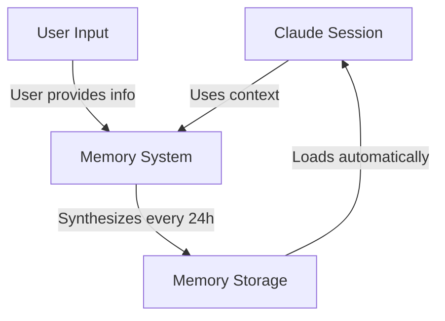
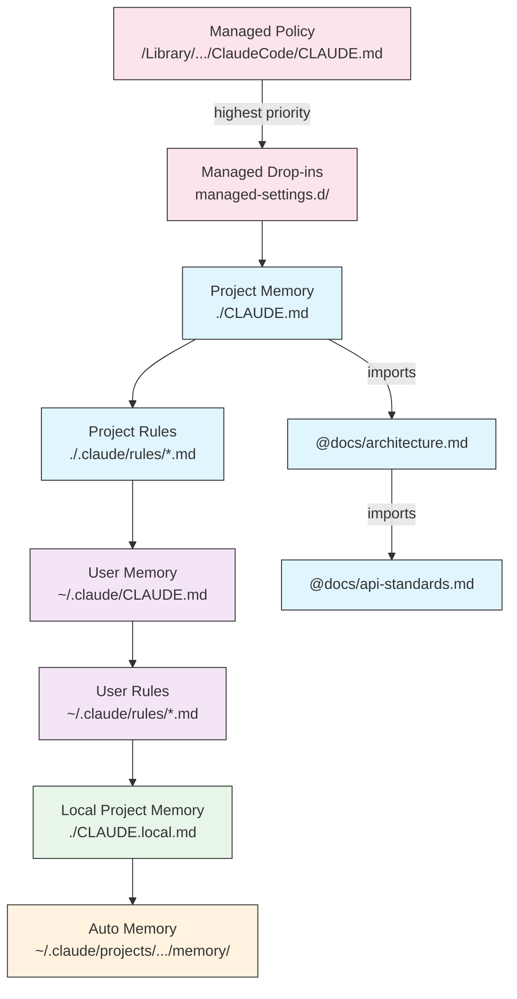
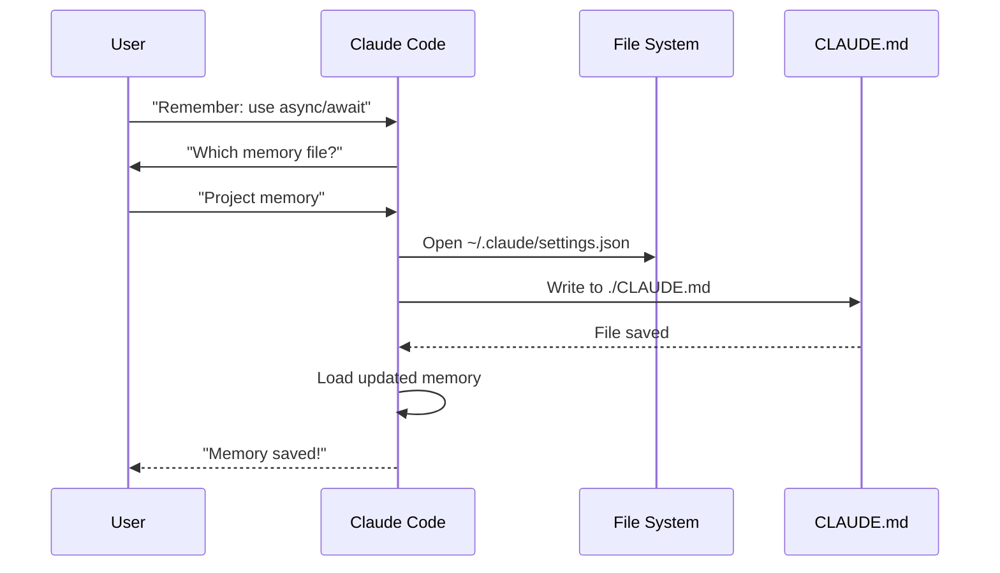
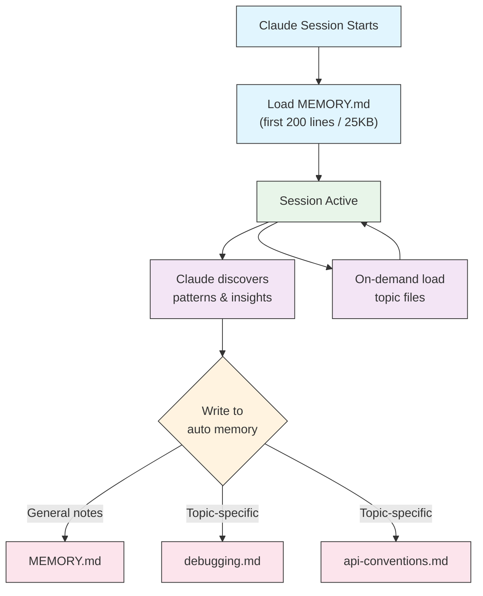

<!-- i18n-source: 02-memory/README.md -->
<!-- i18n-date: 2026-07-15 -->
<picture>
  <source media="(prefers-color-scheme: dark)" srcset="../resources/logos/claude-howto-logo-dark.svg">
  
</picture>

# คู่มือ Memory

Memory ช่วยให้ Claude สามารถรักษา context ข้ามระหว่าง session และการสนทนาได้ มีอยู่สองรูปแบบ ได้แก่ การสังเคราะห์อัตโนมัติใน claude.ai และ CLAUDE.md ที่อ้างอิงจาก filesystem ใน Claude Code

## ภาพรวม

Memory ใน Claude Code ให้ context แบบถาวรที่คงอยู่ข้ามหลาย session และการสนทนา ต่างจาก context window ชั่วคราว ไฟล์ memory ช่วยให้คุณสามารถ:

- แชร์มาตรฐานโปรเจกต์ให้กับทีมของคุณ
- จัดเก็บความต้องการด้านการพัฒนาส่วนบุคคล
- รักษา rules และการกำหนดค่าเฉพาะไดเรกทอรี
- นำเข้าเอกสารภายนอก
- ควบคุมเวอร์ชันของ memory เป็นส่วนหนึ่งของโปรเจกต์

ระบบ memory ทำงานในหลายระดับ ตั้งแต่ความต้องการส่วนบุคคลระดับ global ลงไปจนถึงไดเรกทอรีย่อยเฉพาะ ทำให้ควบคุมได้อย่างละเอียดว่า Claude จะจดจำสิ่งใดและนำความรู้นั้นไปใช้อย่างไร

## อ้างอิงคำสั่ง Memory อย่างย่อ

| คำสั่ง | วัตถุประสงค์ | การใช้งาน | เมื่อใดควรใช้ |
|---------|---------|-------|-------------|
| `/init` | เริ่มต้น project memory | `/init` | เริ่มโปรเจกต์ใหม่, ตั้งค่า CLAUDE.md ครั้งแรก |
| `/memory` | แก้ไขไฟล์ memory ใน editor | `/memory` | อัปเดตจำนวนมาก, จัดระเบียบใหม่, ตรวจทานเนื้อหา |
| `#` prefix | ~~เพิ่ม memory บรรทัดเดียวอย่างรวดเร็ว~~ **เลิกใช้แล้ว** | — | ใช้ `/memory` หรือขอผ่านการสนทนาแทน |
| `@path/to/file` | นำเข้าเนื้อหาภายนอก | `@README.md` หรือ `@docs/api.md` | อ้างอิงเอกสารที่มีอยู่ใน CLAUDE.md |

## เริ่มต้นอย่างรวดเร็ว: การเริ่มต้น Memory

### คำสั่ง `/init`

คำสั่ง `/init` เป็นวิธีที่เร็วที่สุดในการตั้งค่า project memory ใน Claude Code มันเริ่มต้นไฟล์ CLAUDE.md พร้อมเอกสารพื้นฐานของโปรเจกต์

**การใช้งาน:**

```bash
/init
```

**สิ่งที่มันทำ:**

- สร้างไฟล์ CLAUDE.md ใหม่ในโปรเจกต์ของคุณ (โดยทั่วไปที่ `./CLAUDE.md` หรือ `./.claude/CLAUDE.md`)
- กำหนด convention และแนวทางของโปรเจกต์
- วางรากฐานสำหรับการคงอยู่ของ context ข้าม session
- ให้โครงสร้าง template สำหรับจัดทำเอกสารมาตรฐานโปรเจกต์ของคุณ

**โหมด interactive ขั้นสูง:** ตั้งค่า `CLAUDE_CODE_NEW_INIT=1` เพื่อเปิดใช้งาน flow แบบ interactive หลายเฟสที่จะพาคุณตั้งค่าโปรเจกต์ทีละขั้นตอน:

```bash
CLAUDE_CODE_NEW_INIT=1 claude
/init
```

**เมื่อใดควรใช้ `/init`:**

- เริ่มโปรเจกต์ใหม่ด้วย Claude Code
- กำหนดมาตรฐานและ convention การเขียนโค้ดของทีม
- สร้างเอกสารเกี่ยวกับโครงสร้าง codebase ของคุณ
- ตั้งค่าลำดับชั้น memory สำหรับการพัฒนาร่วมกัน

**ตัวอย่าง workflow:**

```markdown
# In your project directory
/init

# Claude creates CLAUDE.md with structure like:
# Project Configuration
## Project Overview
- Name: Your Project
- Tech Stack: [Your technologies]
- Team Size: [Number of developers]

## Development Standards
- Code style preferences
- Testing requirements
- Git workflow conventions
```

### การอัปเดต Memory อย่างรวดเร็ว

> **หมายเหตุ**: ทางลัด `#` สำหรับ memory แบบ inline ถูกเลิกใช้แล้ว ใช้ `/memory` เพื่อแก้ไขไฟล์ memory โดยตรง หรือขอให้ Claude จดจำบางสิ่งผ่านการสนทนา (เช่น "จดจำไว้ว่าเราใช้ TypeScript strict mode เสมอ")

วิธีที่แนะนำในการเพิ่มข้อมูลลงใน memory มีดังนี้:

**ตัวเลือกที่ 1: ใช้คำสั่ง `/memory`**

```bash
/memory
```

เปิดไฟล์ memory ของคุณใน editor ของระบบเพื่อแก้ไขโดยตรง

**ตัวเลือกที่ 2: ขอผ่านการสนทนา**

```
Remember that we always use TypeScript strict mode in this project.
Please add to memory: prefer async/await over promise chains.
```

Claude จะอัปเดตไฟล์ CLAUDE.md ที่เหมาะสมตามคำขอของคุณ

**การอ้างอิงเชิงประวัติ** (ไม่สามารถใช้งานได้อีกต่อไป):

ทางลัด `#` prefix เคยอนุญาตให้เพิ่ม rules แบบ inline:

```markdown
# Always use TypeScript strict mode in this project  ← no longer works
```

หากคุณเคยพึ่งพารูปแบบนี้ ให้เปลี่ยนไปใช้คำสั่ง `/memory` หรือคำขอผ่านการสนทนาแทน

### คำสั่ง `/memory`

คำสั่ง `/memory` ให้การเข้าถึงโดยตรงเพื่อแก้ไขไฟล์ memory CLAUDE.md ของคุณภายใน session ของ Claude Code มันเปิดไฟล์ memory ของคุณใน editor ของระบบเพื่อการแก้ไขอย่างครอบคลุม

**การใช้งาน:**

```bash
/memory
```

**สิ่งที่มันทำ:**

- เปิดไฟล์ memory ของคุณใน editor เริ่มต้นของระบบ
- อนุญาตให้คุณเพิ่ม แก้ไข และจัดระเบียบใหม่ได้อย่างครอบคลุม
- ให้การเข้าถึงโดยตรงไปยังไฟล์ memory ทั้งหมดในลำดับชั้น
- ช่วยให้คุณจัดการ context แบบถาวรข้าม session

**เมื่อใดควรใช้ `/memory`:**

- ตรวจทานเนื้อหา memory ที่มีอยู่
- อัปเดตมาตรฐานโปรเจกต์จำนวนมาก
- จัดระเบียบโครงสร้าง memory ใหม่
- เพิ่มเอกสารหรือแนวทางโดยละเอียด
- ดูแลและอัปเดต memory เมื่อโปรเจกต์ของคุณพัฒนาไป

**การเปรียบเทียบ: `/memory` กับ `/init`**

| ด้าน | `/memory` | `/init` |
|--------|-----------|---------|
| **วัตถุประสงค์** | แก้ไขไฟล์ memory ที่มีอยู่ | เริ่มต้น CLAUDE.md ใหม่ |
| **เมื่อใดควรใช้** | อัปเดต/แก้ไข context โปรเจกต์ | เริ่มโปรเจกต์ใหม่ |
| **การกระทำ** | เปิด editor เพื่อแก้ไข | สร้าง template เริ่มต้น |
| **Workflow** | การดูแลอย่างต่อเนื่อง | การตั้งค่าครั้งเดียว |

**ตัวอย่าง workflow:**

```markdown
# Open memory for editing
/memory

# Claude presents options:
# 1. Managed Policy Memory
# 2. Project Memory (./CLAUDE.md)
# 3. User Memory (~/.claude/CLAUDE.md)
# 4. Local Project Memory

# Choose option 2 (Project Memory)
# Your default editor opens with ./CLAUDE.md content

# Make changes, save, and close editor
# Claude automatically reloads the updated memory
```

**การใช้ Memory Imports:**

ไฟล์ CLAUDE.md รองรับ syntax `@path/to/file` เพื่อรวมเนื้อหาภายนอก:

```markdown
# Project Documentation
See @README.md for project overview
See @package.json for available npm commands
See @docs/architecture.md for system design

# Import from home directory using absolute path
@~/.claude/my-project-instructions.md
```

**ฟีเจอร์ของ import:**

- รองรับทั้ง relative path และ absolute path (เช่น `@docs/api.md` หรือ `@~/.claude/my-project-instructions.md`)
- รองรับ import แบบ recursive ที่ความลึกสูงสุด 5 ระดับ
- การ import ครั้งแรกจากตำแหน่งภายนอกจะเรียกกล่องโต้ตอบการอนุมัติเพื่อความปลอดภัย
- คำสั่ง import จะไม่ถูกประเมินภายใน markdown code span หรือ code block (ดังนั้นการจัดทำเอกสารในตัวอย่างจึงปลอดภัย)
- ช่วยหลีกเลี่ยงการซ้ำซ้อนโดยการอ้างอิงเอกสารที่มีอยู่
- รวมเนื้อหาที่อ้างอิงเข้าไปใน context ของ Claude โดยอัตโนมัติ

## สถาปัตยกรรม Memory

Memory ใน Claude Code ใช้ระบบลำดับชั้นที่ scope ต่างกันมีวัตถุประสงค์ต่างกัน:



## ลำดับชั้น Memory ใน Claude Code

Claude Code ใช้ระบบ memory แบบลำดับชั้นหลายระดับ ไฟล์ memory จะถูกโหลดโดยอัตโนมัติเมื่อ Claude Code เริ่มทำงาน โดยไฟล์ระดับสูงกว่ามีลำดับความสำคัญเหนือกว่า

**ลำดับชั้น Memory ฉบับสมบูรณ์ (เรียงตามลำดับความสำคัญ):**

1. **Managed Policy** - คำสั่งระดับทั้งองค์กร
   - macOS: `/Library/Application Support/ClaudeCode/CLAUDE.md`
   - Linux/WSL: `/etc/claude-code/CLAUDE.md`
   - Windows: `C:\Program Files\ClaudeCode\CLAUDE.md`

2. **Managed Drop-ins** - ไฟล์ policy ที่ merge ตามลำดับตัวอักษร (v2.1.83+)
   - ไดเรกทอรี `managed-settings.d/` อยู่ข้าง managed policy CLAUDE.md
   - ไฟล์จะถูก merge ตามลำดับตัวอักษรสำหรับการจัดการ policy แบบโมดูลาร์

3. **Project Memory** - context ที่แชร์กับทีม (ควบคุมเวอร์ชัน)
   - `./.claude/CLAUDE.md` หรือ `./CLAUDE.md` (ในรากของ repository)

4. **Project Rules** - คำสั่งโปรเจกต์แบบโมดูลาร์เฉพาะหัวข้อ
   - `./.claude/rules/*.md`

5. **User Memory** - ความต้องการส่วนบุคคล (ทุกโปรเจกต์)
   - `~/.claude/CLAUDE.md`

6. **User-Level Rules** - rules ส่วนบุคคล (ทุกโปรเจกต์)
   - `~/.claude/rules/*.md`

7. **Local Project Memory** - ความต้องการเฉพาะโปรเจกต์ส่วนบุคคล
   - `./CLAUDE.local.md`

> **หมายเหตุ**: `CLAUDE.local.md` ได้รับการรองรับอย่างเต็มที่และมีการจัดทำเอกสารไว้ใน[เอกสารทางการ](https://code.claude.com/docs/en/memory) มันให้ความต้องการเฉพาะโปรเจกต์ส่วนบุคคลที่ไม่ commit เข้าสู่การควบคุมเวอร์ชัน เพิ่ม `CLAUDE.local.md` ลงใน `.gitignore` ของคุณ

8. **Auto Memory** - บันทึกและสิ่งที่ Claude เรียนรู้โดยอัตโนมัติ
   - `~/.claude/projects/<project>/memory/`

**พฤติกรรมการค้นหา Memory:**

Claude ค้นหาไฟล์ memory ตามลำดับนี้ โดยตำแหน่งที่มาก่อนมีลำดับความสำคัญเหนือกว่า:



## การยกเว้นไฟล์ CLAUDE.md ด้วย `claudeMdExcludes`

ใน monorepo ขนาดใหญ่ ไฟล์ CLAUDE.md บางไฟล์อาจไม่เกี่ยวข้องกับงานปัจจุบันของคุณ การตั้งค่า `claudeMdExcludes` ช่วยให้คุณข้ามไฟล์ CLAUDE.md เฉพาะบางไฟล์เพื่อไม่ให้ถูกโหลดเข้า context:

```jsonc
// In ~/.claude/settings.json or .claude/settings.json
{
  "claudeMdExcludes": [
    "packages/legacy-app/CLAUDE.md",
    "vendors/**/CLAUDE.md"
  ]
}
```

Pattern จะถูกจับคู่กับ path ที่สัมพันธ์กับรากของโปรเจกต์ สิ่งนี้มีประโยชน์อย่างยิ่งสำหรับ:

- Monorepo ที่มีโปรเจกต์ย่อยจำนวนมาก ซึ่งมีเพียงบางส่วนที่เกี่ยวข้อง
- Repository ที่มีไฟล์ CLAUDE.md แบบ vendored หรือจากบุคคลที่สาม
- ลดสัญญาณรบกวนใน context window ของ Claude โดยยกเว้นคำสั่งที่ล้าสมัยหรือไม่เกี่ยวข้อง

## ลำดับชั้นไฟล์การตั้งค่า

การตั้งค่า Claude Code (รวมถึง `autoMemoryDirectory`, `claudeMdExcludes` และการกำหนดค่าอื่นๆ) ถูกแก้ไขจากลำดับชั้นห้าระดับ โดยระดับที่สูงกว่ามีลำดับความสำคัญเหนือกว่า:

| ระดับ | ตำแหน่ง | Scope |
|-------|----------|-------|
| 1 (สูงสุด) | Managed policy (ระดับระบบ) | การบังคับใช้ทั้งองค์กร |
| 2 | `managed-settings.d/` (v2.1.83+) | Policy drop-ins แบบโมดูลาร์ merge ตามลำดับตัวอักษร |
| 3 | `~/.claude/settings.json` | ความต้องการของผู้ใช้ |
| 4 | `.claude/settings.json` | ระดับโปรเจกต์ (commit เข้า git) |
| 5 (ต่ำสุด) | `.claude/settings.local.json` | การ override ในเครื่อง (git-ignored) |

**การกำหนดค่าเฉพาะแพลตฟอร์ม (v2.1.51+):**

การตั้งค่ายังสามารถกำหนดค่าได้ผ่าน:
- **macOS**: ไฟล์ Property list (plist)
- **Windows**: Windows Registry

กลไกดั้งเดิมเฉพาะแพลตฟอร์มเหล่านี้จะถูกอ่านควบคู่ไปกับไฟล์การตั้งค่า JSON และเป็นไปตามกฎลำดับความสำคัญเดียวกัน

> **หมายเหตุ (v2.1.119)**: การเปลี่ยนแปลงผ่าน `/config` ตอนนี้จะบันทึกลงใน `~/.claude/settings.json` ค่าที่เขียนผ่าน `/config` มีส่วนร่วมในห่วงโซ่ลำดับความสำคัญ project/local/policy ตามปกติที่อธิบายไว้ข้างต้น — ไม่ได้จำกัดอยู่เฉพาะ session อีกต่อไป ใช้ `/config` สำหรับการแก้ไขแบบ interactive และแก้ไขไฟล์ `settings.json` โดยตรงสำหรับการกำหนดค่าแบบ scripted หรือ managed

### การตั้งค่า Retention และ Cleanup

| การตั้งค่า | ประเภท | ค่าเริ่มต้น | คำอธิบาย |
|---------|------|---------|-------------|
| `cleanupPeriodDays` | integer (วัน) | 30 | หน้าต่างการเก็บรักษาสำหรับ artifact บนดิสก์ **ตั้งแต่ v2.1.117** จะใช้กับทั้งสี่ประเภท ได้แก่ checkpoints (`~/.claude/checkpoints/`), tasks (`~/.claude/tasks/`), shell-snapshots (`~/.claude/shell-snapshots/`) และ backups (`~/.claude/backups/`) ไฟล์ที่เก่ากว่าหน้าต่างนี้จะถูกลบเมื่อเริ่มทำงาน |

```jsonc
// ~/.claude/settings.json
{
  "cleanupPeriodDays": 14
}
```

### การตั้งค่า Attribution, Voice และ PR URL

| การตั้งค่า | ประเภท | คำอธิบาย |
|---------|------|-------------|
| `attribution.commit` | boolean | เพิ่ม trailer `Co-Authored-By: Claude` ให้กับ commit ที่ Claude สร้าง แทนที่ flag `includeCoAuthoredBy` ที่เลิกใช้แล้ว |
| `attribution.pr` | boolean | เพิ่ม attribution ของ Claude ในคำอธิบาย pull request แทนที่ flag `includeCoAuthoredBy` ที่เลิกใช้แล้วสำหรับ PR |
| `voice.enabled` | boolean | เปิดใช้งานการป้อนเสียงแบบ push-to-talk (`/voice`) แทนที่ flag `voiceEnabled` ที่เลิกใช้แล้ว |
| `prUrlTemplate` | string | **ใหม่ใน v2.1.119** template URL แบบกำหนดเองสำหรับ badge PR ที่ footer มีประโยชน์สำหรับ GitLab, Bitbucket หรือแพลตฟอร์ม code-review ภายใน รองรับตัวแทน `{{owner}}`, `{{repo}}` และ `{{number}}` |

```jsonc
// ~/.claude/settings.json
{
  "attribution": {
    "commit": false,
    "pr": true
  },
  "voice": {
    "enabled": true
  },
  "prUrlTemplate": "https://gitlab.internal/{{owner}}/{{repo}}/-/merge_requests/{{number}}"
}
```

#### ชื่อการตั้งค่าที่เลิกใช้แล้ว

คีย์การตั้งค่าดั้งเดิมต่อไปนี้ยังคงใช้งานได้แต่เลิกใช้แล้ว ควรใช้ตัวแทนด้านบนแทน

| คีย์ที่เลิกใช้ | ตัวแทน | หมายเหตุ |
|----------------|-------------|-------|
| `includeCoAuthoredBy` | `attribution.commit` / `attribution.pr` | flag เดี่ยวแบบเก่าถูกแยกเป็นสวิตช์ commit และ PR แยกกัน ผู้ใช้บนการติดตั้งเก่าสามารถคง key ดั้งเดิมไว้ได้ โปรเจกต์ใหม่ควรใช้รูปแบบซ้อน |
| `voiceEnabled` | `voice.enabled` | จัดกลุ่มภายใต้ namespace `voice` ควบคู่ไปกับตัวเลือกที่เกี่ยวข้องกับเสียงในอนาคต |

## ระบบ Rules แบบโมดูลาร์

สร้าง rules เฉพาะ path ที่จัดระเบียบแล้วโดยใช้โครงสร้างไดเรกทอรี `.claude/rules/` Rules สามารถกำหนดได้ทั้งในระดับโปรเจกต์และระดับผู้ใช้:

```
your-project/
├── .claude/
│   ├── CLAUDE.md
│   └── rules/
│       ├── code-style.md
│       ├── testing.md
│       ├── security.md
│       └── api/                  # Subdirectories supported
│           ├── conventions.md
│           └── validation.md

~/.claude/
├── CLAUDE.md
└── rules/                        # User-level rules (all projects)
    ├── personal-style.md
    └── preferred-patterns.md
```

Rules จะถูกค้นพบแบบ recursive ภายในไดเรกทอรี `rules/` รวมถึงไดเรกทอรีย่อยใดๆ Rules ระดับผู้ใช้ที่ `~/.claude/rules/` จะถูกโหลดก่อน rules ระดับโปรเจกต์ ทำให้มีค่าเริ่มต้นส่วนบุคคลที่โปรเจกต์สามารถ override ได้

### Rules เฉพาะ path ด้วย YAML Frontmatter

กำหนด rules ที่ใช้กับ file path เฉพาะเท่านั้น:

```markdown
---
paths: src/api/**/*.ts
---

# API Development Rules

- All API endpoints must include input validation
- Use Zod for schema validation
- Document all parameters and response types
- Include error handling for all operations
```

**ตัวอย่าง Glob Pattern:**

- `**/*.ts` - ไฟล์ TypeScript ทั้งหมด
- `src/**/*` - ไฟล์ทั้งหมดภายใต้ src/
- `src/**/*.{ts,tsx}` - หลายนามสกุล
- `{src,lib}/**/*.ts, tests/**/*.test.ts` - หลาย pattern

### ไดเรกทอรีย่อยและ Symlink

Rules ใน `.claude/rules/` รองรับฟีเจอร์การจัดระเบียบสองอย่าง:

- **ไดเรกทอรีย่อย**: Rules จะถูกค้นพบแบบ recursive ดังนั้นคุณสามารถจัดระเบียบเป็นโฟลเดอร์ตามหัวข้อได้ (เช่น `rules/api/`, `rules/testing/`, `rules/security/`)
- **Symlink**: รองรับ symlink สำหรับการแชร์ rules ข้ามหลายโปรเจกต์ ตัวอย่างเช่น คุณสามารถ symlink ไฟล์ rule ที่แชร์จากตำแหน่งกลางเข้าไปยังไดเรกทอรี `.claude/rules/` ของแต่ละโปรเจกต์

## ตารางตำแหน่ง Memory

| ตำแหน่ง | Scope | ลำดับความสำคัญ | แชร์ | การเข้าถึง | เหมาะสำหรับ |
|----------|-------|----------|--------|--------|----------|
| `/Library/Application Support/ClaudeCode/CLAUDE.md` (macOS) | Managed Policy | 1 (สูงสุด) | องค์กร | ระบบ | policy ทั้งบริษัท |
| `/etc/claude-code/CLAUDE.md` (Linux/WSL) | Managed Policy | 1 (สูงสุด) | องค์กร | ระบบ | มาตรฐานองค์กร |
| `C:\Program Files\ClaudeCode\CLAUDE.md` (Windows) | Managed Policy | 1 (สูงสุด) | องค์กร | ระบบ | แนวทางองค์กร |
| `managed-settings.d/*.md` (อยู่ข้าง policy) | Managed Drop-ins | 1.5 | องค์กร | ระบบ | ไฟล์ policy แบบโมดูลาร์ (v2.1.83+) |
| `./CLAUDE.md` หรือ `./.claude/CLAUDE.md` | Project Memory | 2 | ทีม | Git | มาตรฐานทีม, สถาปัตยกรรมที่แชร์ |
| `./.claude/rules/*.md` | Project Rules | 3 | ทีม | Git | rules เฉพาะ path แบบโมดูลาร์ |
| `~/.claude/CLAUDE.md` | User Memory | 4 | บุคคล | Filesystem | ความต้องการส่วนบุคคล (ทุกโปรเจกต์) |
| `~/.claude/rules/*.md` | User Rules | 5 | บุคคล | Filesystem | rules ส่วนบุคคล (ทุกโปรเจกต์) |
| `./CLAUDE.local.md` | Project Local | 6 | บุคคล | Git (ignored) | ความต้องการเฉพาะโปรเจกต์ส่วนบุคคล |
| `~/.claude/projects/<project>/memory/` | Auto Memory | 7 (ต่ำสุด) | บุคคล | Filesystem | บันทึกและสิ่งที่ Claude เรียนรู้โดยอัตโนมัติ |

## วงจรการอัปเดต Memory

นี่คือวิธีที่การอัปเดต memory ไหลผ่าน session ของ Claude Code:



## Auto Memory

Auto memory คือไดเรกทอรีแบบถาวรที่ Claude บันทึกสิ่งที่เรียนรู้ รูปแบบ และข้อมูลเชิงลึกโดยอัตโนมัติขณะทำงานกับโปรเจกต์ของคุณ ต่างจากไฟล์ CLAUDE.md ที่คุณเขียนและดูแลด้วยตนเอง auto memory ถูกเขียนโดย Claude เองระหว่าง session

### Auto Memory ทำงานอย่างไร

- **ตำแหน่ง**: `~/.claude/projects/<project>/memory/`
- **จุดเริ่มต้น**: `MEMORY.md` ทำหน้าที่เป็นไฟล์หลักในไดเรกทอรี auto memory
- **ไฟล์หัวข้อ**: ไฟล์เพิ่มเติมที่เป็นทางเลือกสำหรับหัวข้อเฉพาะ (เช่น `debugging.md`, `api-conventions.md`)
- **พฤติกรรมการโหลด**: 200 บรรทัดแรกของ `MEMORY.md` (หรือ 25KB แรก แล้วแต่ว่าถึงก่อน) จะถูกโหลดเข้า context ตอนเริ่ม session ไฟล์หัวข้อจะถูกโหลดเมื่อต้องการ ไม่ใช่ตอนเริ่มทำงาน
- **อ่าน/เขียน**: Claude อ่านและเขียนไฟล์ memory ระหว่าง session ขณะที่ค้นพบรูปแบบและความรู้เฉพาะโปรเจกต์

### สถาปัตยกรรม Auto Memory



### โครงสร้างไดเรกทอรี Auto Memory

```
~/.claude/projects/<project>/memory/
├── MEMORY.md              # Entrypoint (first 200 lines / 25KB loaded at startup)
├── debugging.md           # Topic file (loaded on demand)
├── api-conventions.md     # Topic file (loaded on demand)
└── testing-patterns.md    # Topic file (loaded on demand)
```

### ข้อกำหนดด้านเวอร์ชัน

Auto memory ต้องใช้ **Claude Code v2.1.59 หรือใหม่กว่า** หากคุณใช้เวอร์ชันเก่ากว่า ให้อัปเกรดก่อน:

```bash
npm install -g @anthropic-ai/claude-code@latest
```

### ไดเรกทอรี Auto Memory แบบกำหนดเอง

โดยค่าเริ่มต้น auto memory จะถูกจัดเก็บใน `~/.claude/projects/<project>/memory/` คุณสามารถเปลี่ยนตำแหน่งนี้ได้โดยใช้การตั้งค่า `autoMemoryDirectory` (มีให้ตั้งแต่ **v2.1.74**):

```jsonc
// In ~/.claude/settings.json or .claude/settings.local.json (user/local settings only)
{
  "autoMemoryDirectory": "/path/to/custom/memory/directory"
}
```

> **หมายเหตุ**: `autoMemoryDirectory` สามารถตั้งค่าได้เฉพาะในการตั้งค่าระดับผู้ใช้ (`~/.claude/settings.json`) หรือการตั้งค่าในเครื่อง (`.claude/settings.local.json`) เท่านั้น ไม่ใช่ในการตั้งค่าระดับโปรเจกต์หรือ managed policy

สิ่งนี้มีประโยชน์เมื่อคุณต้องการ:

- จัดเก็บ auto memory ในตำแหน่งที่แชร์หรือ sync
- แยก auto memory ออกจากไดเรกทอรีการกำหนดค่า Claude เริ่มต้น
- ใช้ path เฉพาะโปรเจกต์นอกลำดับชั้นเริ่มต้น

### การแชร์ Worktree และ Repository

worktree และไดเรกทอรีย่อยทั้งหมดภายใน git repository เดียวกันจะแชร์ไดเรกทอรี auto memory เดียวกัน หมายความว่าการสลับระหว่าง worktree หรือทำงานในไดเรกทอรีย่อยต่างๆ ของ repo เดียวกันจะอ่านและเขียนไปยังไฟล์ memory เดียวกัน

### Subagent Memory

subagent (ที่สร้างผ่านเครื่องมืออย่าง Task หรือการทำงานแบบขนาน) สามารถมี context memory ของตัวเองได้ ใช้ field `memory` ใน frontmatter ของ subagent definition เพื่อระบุว่าจะโหลด memory scope ใด:

```yaml
memory: user      # Load user-level memory only
memory: project   # Load project-level memory only
memory: local     # Load local memory only
```

สิ่งนี้ช่วยให้ subagent ทำงานด้วย context ที่มุ่งเน้น แทนที่จะสืบทอดลำดับชั้น memory ทั้งหมด

> **หมายเหตุ**: subagent ยังสามารถดูแล auto memory ของตัวเองได้ ดู[เอกสารทางการเรื่อง subagent memory](https://code.claude.com/docs/en/sub-agents#enable-persistent-memory) สำหรับรายละเอียด

### การควบคุม Auto Memory

Auto memory สามารถควบคุมได้ผ่านตัวแปรสภาพแวดล้อม `CLAUDE_CODE_DISABLE_AUTO_MEMORY`:

| ค่า | พฤติกรรม |
|-------|----------|
| `0` | บังคับให้ auto memory **เปิด** |
| `1` | บังคับให้ auto memory **ปิด** |
| *(ไม่ตั้งค่า)* | พฤติกรรมเริ่มต้น (เปิดใช้งาน auto memory) |

```bash
# Disable auto memory for a session
CLAUDE_CODE_DISABLE_AUTO_MEMORY=1 claude

# Force auto memory on explicitly
CLAUDE_CODE_DISABLE_AUTO_MEMORY=0 claude
```

## ไดเรกทอรีเพิ่มเติมด้วย `--add-dir`

flag `--add-dir` ช่วยให้ Claude Code โหลดไฟล์ CLAUDE.md จากไดเรกทอรีเพิ่มเติมนอกเหนือจากไดเรกทอรีการทำงานปัจจุบัน สิ่งนี้มีประโยชน์สำหรับ monorepo หรือการตั้งค่าหลายโปรเจกต์ที่ context จากไดเรกทอรีอื่นมีความเกี่ยวข้อง

เพื่อเปิดใช้งานฟีเจอร์นี้ ให้ตั้งค่าตัวแปรสภาพแวดล้อม:

```bash
CLAUDE_CODE_ADDITIONAL_DIRECTORIES_CLAUDE_MD=1
```

จากนั้นเปิด Claude Code ด้วย flag:

```bash
claude --add-dir /path/to/other/project
```

Claude จะโหลด CLAUDE.md จากไดเรกทอรีเพิ่มเติมที่ระบุควบคู่ไปกับไฟล์ memory จากไดเรกทอรีการทำงานปัจจุบันของคุณ

## ตัวอย่างการใช้งานจริง

### ตัวอย่างที่ 1: โครงสร้าง Project Memory

**ไฟล์:** `./CLAUDE.md`

```markdown
# การกำหนดค่าโปรเจกต์

## ภาพรวมโปรเจกต์
- **ชื่อ**: E-commerce Platform
- **Tech Stack**: Node.js, PostgreSQL, React 18, Docker
- **ขนาดทีม**: นักพัฒนา 5 คน
- **กำหนดส่ง**: Q4 2025

## สถาปัตยกรรม (Architecture)
@docs/architecture.md
@docs/api-standards.md
@docs/database-schema.md

## มาตรฐานการพัฒนา

### รูปแบบโค้ด (Code Style)
- ใช้ Prettier สำหรับการจัดรูปแบบ
- ใช้ ESLint with airbnb config
- ความยาวบรรทัดสูงสุด: 100 ตัวอักษร
- ใช้การเยื้อง 2 space

### รูปแบบการตั้งชื่อ (Naming Conventions)
- **Files**: kebab-case (user-controller.js)
- **Classes**: PascalCase (UserService)
- **Functions/Variables**: camelCase (getUserById)
- **Constants**: UPPER_SNAKE_CASE (API_BASE_URL)
- **Database Tables**: snake_case (user_accounts)

### Git Workflow
- ชื่อ branch: `feature/description` หรือ `fix/description`
- ข้อความ commit: ตาม conventional commits
- ต้องมี PR ก่อน merge
- ต้องผ่านการตรวจสอบ CI/CD ทั้งหมด
- ต้องได้รับอนุมัติอย่างน้อย 1 คน

### ข้อกำหนดด้านการทดสอบ (Testing Requirements)
- ความครอบคลุม code อย่างน้อย 80%
- ทุก critical path ต้องมี test
- ใช้ Jest สำหรับ unit test
- ใช้ Cypress สำหรับ E2E test
- ชื่อไฟล์ test: `*.test.ts` หรือ `*.spec.ts`

### มาตรฐาน API
- RESTful endpoints เท่านั้น
- JSON request/response
- ใช้ HTTP status code อย่างถูกต้อง
- กำหนดเวอร์ชัน API endpoint: `/api/v1/`
- จัดทำเอกสารทุก endpoint พร้อมตัวอย่าง

### ฐานข้อมูล (Database)
- ใช้ migration สำหรับการเปลี่ยน schema
- ห้าม hardcode credentials
- ใช้ connection pooling
- เปิด query logging ใน development
- ต้องสำรองข้อมูลเป็นประจำ

### การ deploy
- deploy แบบ Docker-based
- orchestration ด้วย Kubernetes
- กลยุทธ์ Blue-green deployment
- rollback อัตโนมัติเมื่อเกิดความล้มเหลว
- database migration รันก่อน deploy

## คำสั่งที่ใช้บ่อย

| คำสั่ง | วัตถุประสงค์ |
|---------|---------|
| `npm run dev` | เริ่ม development server |
| `npm test` | รัน test suite |
| `npm run lint` | ตรวจสอบ code style |
| `npm run build` | build สำหรับ production |
| `npm run migrate` | รัน database migration |

## ผู้ติดต่อในทีม
- Tech Lead: Sarah Chen (@sarah.chen)
- Product Manager: Mike Johnson (@mike.j)
- DevOps: Alex Kim (@alex.k)

## ปัญหาที่ทราบและวิธีแก้ไข
- PostgreSQL connection pooling จำกัดที่ 20 ในช่วงเวลา peak
- วิธีแก้: ใช้ query queuing
- Safari 14 มีปัญหากับ async generators
- วิธีแก้: ใช้ Babel transpiler

## โปรเจกต์ที่เกี่ยวข้อง
- Analytics Dashboard: `/projects/analytics`
- Mobile App: `/projects/mobile`
- Admin Panel: `/projects/admin`
```

### ตัวอย่างที่ 2: Memory เฉพาะไดเรกทอรี

**ไฟล์:** `./src/api/CLAUDE.md`

````markdown
# มาตรฐานโมดูล API

ไฟล์นี้แทนที่ CLAUDE.md ระดับรากสำหรับทุกอย่างใน /src/api/

## มาตรฐานเฉพาะ API

### การตรวจสอบคำขอ (Request Validation)
- ใช้ Zod สำหรับการตรวจสอบ schema
- ตรวจสอบ input ทุกครั้ง
- ส่งคืน 400 พร้อมข้อมูลข้อผิดพลาดในการตรวจสอบ
- รวมรายละเอียดข้อผิดพลาดในระดับ field

### การยืนยันตัวตน (Authentication)
- ทุก endpoint ต้องใช้ JWT token
- Token อยู่ใน Authorization header
- Token หมดอายุหลังจาก 24 ชั่วโมง
- ใช้กลไก refresh token

### รูปแบบการตอบกลับ (Response Format)

ทุกการตอบกลับต้องเป็นไปตามโครงสร้างนี้:

```json
{
  "success": true,
  "data": { /* ข้อมูลจริง */ },
  "timestamp": "2025-11-06T10:30:00Z",
  "version": "1.0"
}
```

การตอบกลับเมื่อเกิดข้อผิดพลาด:
```json
{
  "success": false,
  "error": {
    "code": "VALIDATION_ERROR",
    "message": "ข้อความสำหรับผู้ใช้",
    "details": { /* รายละเอียดข้อผิดพลาดแต่ละ field */ }
  },
  "timestamp": "2025-11-06T10:30:00Z"
}
```

### การแบ่งหน้า (Pagination)
- ใช้ cursor-based pagination (ไม่ใช้ offset)
- รวม boolean `hasMore`
- จำกัดขนาดหน้าสูงสุดที่ 100
- ขนาดหน้าเริ่มต้น: 20

### การจำกัดอัตราคำขอ (Rate Limiting)
- 1000 คำขอต่อชั่วโมงสำหรับผู้ใช้ที่ยืนยันตัวตนแล้ว
- 100 คำขอต่อชั่วโมงสำหรับ endpoint สาธารณะ
- ส่งคืน 429 เมื่อเกินขีดจำกัด
- รวม retry-after header

### การแคช (Caching)
- ใช้ Redis สำหรับการแคช session
- ระยะเวลาแคชเริ่มต้น: 5 นาที
- ยกเลิกการแคชเมื่อมีการเขียนข้อมูล
- ติดแท็ก cache key ด้วยประเภทของทรัพยากร
````

### ตัวอย่างที่ 3: Personal Memory

**ไฟล์:** `~/.claude/CLAUDE.md`

```markdown
# ความต้องการด้านการพัฒนาส่วนบุคคล

## เกี่ยวกับฉัน
- **ระดับประสบการณ์**: 8 ปีในการพัฒนา full-stack
- **ภาษาที่ถนัด**: TypeScript, Python
- **รูปแบบการสื่อสาร**: ตรงไปตรงมา พร้อมตัวอย่าง
- **รูปแบบการเรียนรู้**: แผนภาพพร้อมโค้ด

## ความต้องการด้านโค้ด

### การจัดการข้อผิดพลาด (Error Handling)
ต้องการการจัดการข้อผิดพลาดอย่างชัดเจนด้วย try-catch block และข้อความผิดพลาดที่มีความหมาย
หลีกเลี่ยงข้อผิดพลาดทั่วไป บันทึก error ทุกครั้งเพื่อ debugging

### คอมเมนต์
ใช้คอมเมนต์อธิบาย "ทำไม" ไม่ใช่ "ทำอะไร" โค้ดควรอธิบายตัวเองได้
คอมเมนต์ควรอธิบาย business logic หรือการตัดสินใจที่ไม่ชัดเจน

### การทดสอบ (Testing)
ชอบ TDD (test-driven development)
เขียน test ก่อน แล้วค่อยเขียน implementation
มุ่งเน้นที่พฤติกรรม ไม่ใช่รายละเอียดการ implementation

### สถาปัตยกรรม (Architecture)
ชอบการออกแบบแบบ modular ที่มีการ coupling น้อย
ใช้ dependency injection เพื่อให้ทดสอบได้
แยก concerns (Controllers, Services, Repositories)

## ความต้องการด้าน Debugging
- ใช้ console.log พร้อม prefix: `[DEBUG]`
- รวม context: ชื่อ function, ตัวแปรที่เกี่ยวข้อง
- ใช้ stack trace เมื่อมีให้
- รวม timestamp ใน log ทุกครั้ง

## การสื่อสาร
- อธิบายแนวคิดซับซ้อนด้วยแผนภาพ
- แสดงตัวอย่างที่เป็นรูปธรรมก่อนอธิบายทฤษฎี
- รวม code snippet แบบ before/after
- สรุปประเด็นสำคัญท้ายสุด

## การจัดระเบียบโปรเจกต์
ฉันจัดระเบียบโปรเจกต์ดังนี้:

   project/
   ├── src/
   │   ├── api/
   │   ├── services/
   │   ├── models/
   │   └── utils/
   ├── tests/
   ├── docs/
   └── docker/

## เครื่องมือ (Tooling)
- **IDE**: VS Code with vim keybindings
- **Terminal**: Zsh with Oh-My-Zsh
- **Format**: Prettier (100 char line length)
- **Linter**: ESLint with airbnb config
- **Test Framework**: Jest with React Testing Library
```

_การทดสอบของฉัน_
ขอให้ Claude บันทึก rule ใหม่


Claude ไม่ได้บันทึก rule เพราะฉันไม่มีไฟล์ `Claude.md` อยู่ที่ใดเลย จากนั้นจึงขอให้ Claude ยืนยันตำแหน่ง


### ตัวอย่างที่ 4: การอัปเดต Memory ระหว่าง Session

คุณสามารถเพิ่ม rules ใหม่ลงใน memory ระหว่าง session ของ Claude Code ที่กำลังทำงานได้ มีสองวิธีในการทำเช่นนี้:

#### วิธีที่ 1: คำขอโดยตรง

```markdown
User: Remember that I prefer using React hooks instead of class components
     for all new components.

Claude: I'm adding that to your memory. Which memory file should this go in?
        1. Project memory (./CLAUDE.md)
        2. Personal memory (~/.claude/CLAUDE.md)

User: Project memory

Claude: ✅ Memory saved!

Added to ./CLAUDE.md:
---

### Component Development
- Use functional components with React Hooks
- Prefer hooks over class components
- Custom hooks for reusable logic
- Use useCallback for event handlers
- Use useMemo for expensive computations
```

#### วิธีที่ 2: การใช้รูปแบบ "# new rule into memory"

คุณยังสามารถใช้รูปแบบที่ชัดเจน "# new rule into memory" เพื่อเรียกการอัปเดต memory:

```markdown
User: # new rule into memory
      Always validate user input with Zod schemas before processing.

Claude: I'm saving this rule to memory. Which memory file should I use?
        1. Project memory (./CLAUDE.md)
        2. Personal memory (~/.claude/CLAUDE.md)

User: Project memory

Claude: ✅ Memory saved!

Added to ./CLAUDE.md:
---

### Input Validation
- Always validate user input with Zod schemas before processing
- Define schemas at the top of each API handler file
- Return 400 status with validation errors
```

#### เคล็ดลับการเพิ่ม Memory

- เขียน rules ให้เฉพาะเจาะจงและนำไปปฏิบัติได้
- จัดกลุ่ม rules ที่เกี่ยวข้องไว้ด้วยกันภายใต้หัวข้อส่วน
- อัปเดตส่วนที่มีอยู่แทนการทำเนื้อหาซ้ำ
- เลือก memory scope ที่เหมาะสม (project กับ personal)

## การเปรียบเทียบฟีเจอร์ Memory

| ฟีเจอร์ | Claude Web/Desktop | Claude Code (CLAUDE.md) |
|---------|-------------------|------------------------|
| การสังเคราะห์อัตโนมัติ | ✅ ทุก 24 ชม. | ✅ Auto memory |
| ข้ามโปรเจกต์ | ✅ แชร์ | ❌ เฉพาะโปรเจกต์ |
| การเข้าถึงของทีม | ✅ โปรเจกต์ที่แชร์ | ✅ ติดตามด้วย Git |
| ค้นหาได้ | ✅ ในตัว | ✅ ผ่าน `/memory` |
| แก้ไขได้ | ✅ ในแชท | ✅ แก้ไขไฟล์โดยตรง |
| Import/Export | ✅ ได้ | ✅ Copy/paste |
| ถาวร | ✅ 24 ชม.+ | ✅ ไม่จำกัด |

### Memory ใน Claude Web/Desktop

#### ไทม์ไลน์การสังเคราะห์ Memory


**ตัวอย่างสรุป Memory:**

```markdown
## Claude's Memory of User

### Professional Background
- Senior full-stack developer with 8 years experience
- Focus on TypeScript/Node.js backends and React frontends
- Active open source contributor
- Interested in AI and machine learning

### Project Context
- Currently building e-commerce platform
- Tech stack: Node.js, PostgreSQL, React 18, Docker
- Working with team of 5 developers
- Using CI/CD and blue-green deployments

### Communication Preferences
- Prefers direct, concise explanations
- Likes visual diagrams and examples
- Appreciates code snippets
- Explains business logic in comments

### Current Goals
- Improve API performance
- Increase test coverage to 90%
- Implement caching strategy
- Document architecture
```

## แนวปฏิบัติที่ดี

### สิ่งที่ควรทำ - สิ่งที่ควรใส่

- **เฉพาะเจาะจงและมีรายละเอียด**: ใช้คำสั่งที่ชัดเจนและมีรายละเอียดแทนคำแนะนำที่คลุมเครือ
  - ✅ ดี: "Use 2-space indentation for all JavaScript files"
  - ❌ หลีกเลี่ยง: "Follow best practices"

- **จัดระเบียบให้ดี**: จัดโครงสร้างไฟล์ memory ด้วยส่วนและหัวข้อ markdown ที่ชัดเจน

- **ใช้ระดับลำดับชั้นที่เหมาะสม**:
  - **Managed policy**: policy ทั้งบริษัท, มาตรฐานความปลอดภัย, ข้อกำหนดการปฏิบัติตาม
  - **Project memory**: มาตรฐานทีม, สถาปัตยกรรม, convention การเขียนโค้ด (commit เข้า git)
  - **User memory**: ความต้องการส่วนบุคคล, รูปแบบการสื่อสาร, ตัวเลือกเครื่องมือ
  - **Directory memory**: rules และการ override เฉพาะโมดูล

- **ใช้ประโยชน์จาก import**: ใช้ syntax `@path/to/file` เพื่ออ้างอิงเอกสารที่มีอยู่
  - รองรับการซ้อนแบบ recursive สูงสุด 5 ระดับ
  - หลีกเลี่ยงการซ้ำซ้อนข้ามไฟล์ memory
  - ตัวอย่าง: `See @README.md for project overview`

- **จัดทำเอกสารคำสั่งที่ใช้บ่อย**: ใส่คำสั่งที่คุณใช้ซ้ำๆ เพื่อประหยัดเวลา

- **ควบคุมเวอร์ชันของ project memory**: commit ไฟล์ CLAUDE.md ระดับโปรเจกต์เข้า git เพื่อประโยชน์ของทีม

- **ตรวจทานเป็นระยะ**: อัปเดต memory เป็นประจำเมื่อโปรเจกต์พัฒนาไปและข้อกำหนดเปลี่ยนแปลง

- **ให้ตัวอย่างที่เป็นรูปธรรม**: ใส่ code snippet และสถานการณ์เฉพาะ

### สิ่งที่ไม่ควรทำ - สิ่งที่ควรหลีกเลี่ยง

- **อย่าจัดเก็บ secret**: ห้ามใส่ API key, รหัสผ่าน, token หรือ credentials

- **อย่าใส่ข้อมูลอ่อนไหว**: ไม่มี PII, ข้อมูลส่วนตัว หรือความลับที่เป็นกรรมสิทธิ์

- **อย่าทำเนื้อหาซ้ำ**: ใช้ import (`@path`) เพื่ออ้างอิงเอกสารที่มีอยู่แทน

- **อย่าคลุมเครือ**: หลีกเลี่ยงข้อความทั่วไปอย่าง "follow best practices" หรือ "write good code"

- **อย่าทำให้ยาวเกินไป**: ให้ไฟล์ memory แต่ละไฟล์มุ่งเน้นและอยู่ภายใต้ 500 บรรทัด

- **อย่าจัดระเบียบมากเกินไป**: ใช้ลำดับชั้นอย่างมีกลยุทธ์ อย่าสร้างการ override ไดเรกทอรีย่อยมากเกินไป

- **อย่าลืมอัปเดต**: memory ที่ล้าสมัยอาจทำให้เกิดความสับสนและการปฏิบัติที่ล้าสมัย

- **อย่าเกินขีดจำกัดการซ้อน**: memory import รองรับการซ้อนสูงสุด 5 ระดับ

### เคล็ดลับการจัดการ Memory

**เลือกระดับ memory ที่ถูกต้อง:**

| กรณีการใช้งาน | ระดับ Memory | เหตุผล |
|----------|-------------|-----------|
| policy ความปลอดภัยของบริษัท | Managed Policy | ใช้กับทุกโปรเจกต์ทั้งองค์กร |
| คู่มือ code style ของทีม | Project | แชร์กับทีมผ่าน git |
| ทางลัด editor ที่คุณชอบ | User | ความต้องการส่วนบุคคล ไม่แชร์ |
| มาตรฐานโมดูล API | Directory | เฉพาะโมดูลนั้นเท่านั้น |

**Workflow การอัปเดตอย่างรวดเร็ว:**

1. สำหรับ rule เดียว: ใช้ `/memory` เพื่อเปิด editor หรือขอผ่านการสนทนา
2. สำหรับการเปลี่ยนแปลงหลายอย่าง: ใช้ `/memory` เพื่อเปิด editor
3. สำหรับการตั้งค่าเริ่มต้น: ใช้ `/init` เพื่อสร้าง template

**แนวปฏิบัติที่ดีของ import:**

```markdown
# Good: Reference existing docs
@README.md
@docs/architecture.md
@package.json

# Avoid: Copying content that exists elsewhere
# Instead of copying README content into CLAUDE.md, just import it
```

## คำแนะนำการติดตั้ง

### ตั้งค่า Project Memory

#### วิธีที่ 1: ใช้คำสั่ง `/init` (แนะนำ)

วิธีที่เร็วที่สุดในการตั้งค่า project memory:

1. **ไปยังไดเรกทอรีโปรเจกต์ของคุณ:**
   ```bash
   cd /path/to/your/project
   ```

2. **รันคำสั่ง init ใน Claude Code:**
   ```bash
   /init
   ```

3. **Claude จะสร้างและเติมข้อมูล CLAUDE.md** ด้วยโครงสร้าง template

4. **ปรับแต่งไฟล์ที่สร้างขึ้น** ให้ตรงกับความต้องการของโปรเจกต์คุณ

5. **Commit เข้า git:**
   ```bash
   git add CLAUDE.md
   git commit -m "Initialize project memory with /init"
   ```

#### วิธีที่ 2: สร้างด้วยตนเอง

หากคุณต้องการตั้งค่าด้วยตนเอง:

1. **สร้าง CLAUDE.md ในรากของโปรเจกต์:**
   ```bash
   cd /path/to/your/project
   touch CLAUDE.md
   ```

2. **เพิ่มมาตรฐานโปรเจกต์:**
   ```bash
   cat > CLAUDE.md << 'EOF'
   # Project Configuration

   ## Project Overview
   - **Name**: Your Project Name
   - **Tech Stack**: List your technologies
   - **Team Size**: Number of developers

   ## Development Standards
   - Your coding standards
   - Naming conventions
   - Testing requirements
   EOF
   ```

3. **Commit เข้า git:**
   ```bash
   git add CLAUDE.md
   git commit -m "Add project memory configuration"
   ```

#### วิธีที่ 3: การอัปเดตอย่างรวดเร็วด้วย `#`

เมื่อ CLAUDE.md มีอยู่แล้ว ให้เพิ่ม rules อย่างรวดเร็วระหว่างการสนทนา:

```markdown
# Use semantic versioning for all releases

# Always run tests before committing

# Prefer composition over inheritance
```

Claude จะแจ้งให้คุณเลือกว่าจะอัปเดตไฟล์ memory ใด

### ตั้งค่า Personal Memory

1. **สร้างไดเรกทอรี ~/.claude:**
   ```bash
   mkdir -p ~/.claude
   ```

2. **สร้าง CLAUDE.md ส่วนบุคคล:**
   ```bash
   touch ~/.claude/CLAUDE.md
   ```

3. **เพิ่มความต้องการของคุณ:**
   ```bash
   cat > ~/.claude/CLAUDE.md << 'EOF'
   # My Development Preferences

   ## About Me
   - Experience Level: [Your level]
   - Preferred Languages: [Your languages]
   - Communication Style: [Your style]

   ## Code Preferences
   - [Your preferences]
   EOF
   ```

### ตั้งค่า Memory เฉพาะไดเรกทอรี

1. **สร้าง memory สำหรับไดเรกทอรีเฉพาะ:**
   ```bash
   mkdir -p /path/to/directory/.claude
   touch /path/to/directory/CLAUDE.md
   ```

2. **เพิ่ม rules เฉพาะไดเรกทอรี:**
   ```bash
   cat > /path/to/directory/CLAUDE.md << 'EOF'
   # [Directory Name] Standards

   This file overrides root CLAUDE.md for this directory.

   ## [Specific Standards]
   EOF
   ```

3. **Commit เข้าการควบคุมเวอร์ชัน:**
   ```bash
   git add /path/to/directory/CLAUDE.md
   git commit -m "Add [directory] memory configuration"
   ```

### ตรวจสอบการตั้งค่า

1. **ตรวจสอบตำแหน่ง memory:**
   ```bash
   # Project root memory
   ls -la ./CLAUDE.md

   # Personal memory
   ls -la ~/.claude/CLAUDE.md
   ```

2. **Claude Code จะโหลดไฟล์เหล่านี้โดยอัตโนมัติ** เมื่อเริ่ม session

3. **ทดสอบด้วย Claude Code** โดยเริ่ม session ใหม่ในโปรเจกต์ของคุณ

## เอกสารทางการ

สำหรับข้อมูลล่าสุด โปรดดูเอกสารทางการของ Claude Code:

- **[เอกสาร Memory](https://code.claude.com/docs/en/memory)** - คู่มืออ้างอิงระบบ memory ฉบับสมบูรณ์
- **[อ้างอิง Slash Commands](https://code.claude.com/docs/en/interactive-mode)** - คำสั่งในตัวทั้งหมดรวมถึง `/init` และ `/memory`
- **[อ้างอิง CLI](https://code.claude.com/docs/en/cli-reference)** - เอกสาร command-line interface

### รายละเอียดทางเทคนิคสำคัญจากเอกสารทางการ

**การโหลด Memory:**

- ไฟล์ memory ทั้งหมดจะถูกโหลดโดยอัตโนมัติเมื่อ Claude Code เริ่มทำงาน
- Claude ไล่ขึ้นไปจากไดเรกทอรีการทำงานปัจจุบันเพื่อค้นหาไฟล์ CLAUDE.md
- ไฟล์ subtree จะถูกค้นพบและโหลดตาม context เมื่อเข้าถึงไดเรกทอรีเหล่านั้น

**Import Syntax:**

- ใช้ `@path/to/file` เพื่อรวมเนื้อหาภายนอก (เช่น `@~/.claude/my-project-instructions.md`)
- รองรับทั้ง relative path และ absolute path
- รองรับ import แบบ recursive ที่ความลึกสูงสุด 5 ระดับ
- การ import ภายนอกครั้งแรกจะเรียกกล่องโต้ตอบการอนุมัติ
- ไม่ถูกประเมินภายใน markdown code span หรือ code block
- รวมเนื้อหาที่อ้างอิงเข้าไปใน context ของ Claude โดยอัตโนมัติ

**ลำดับความสำคัญของลำดับชั้น Memory:**

1. Managed Policy (ลำดับความสำคัญสูงสุด)
2. Managed Drop-ins (`managed-settings.d/`, v2.1.83+)
3. Project Memory
4. Project Rules (`.claude/rules/`)
5. User Memory
6. User-Level Rules (`~/.claude/rules/`)
7. Local Project Memory
8. Auto Memory (ลำดับความสำคัญต่ำสุด)

## ลิงก์แนวคิดที่เกี่ยวข้อง

### จุดเชื่อมต่อ (Integration Points)
- [MCP Protocol](../05-mcp/) - การเข้าถึงข้อมูลแบบ live ควบคู่กับ memory
- [Slash Commands](../01-slash-commands/) - ทางลัดเฉพาะ session
- [Skills](../03-skills/) - workflow อัตโนมัติพร้อม context ของ memory

### ฟีเจอร์ Claude ที่เกี่ยวข้อง
- [Claude Web Memory](https://claude.ai) - การสังเคราะห์อัตโนมัติ
- [เอกสาร Memory ทางการ](https://code.claude.com/docs/en/memory) - เอกสารของ Anthropic

---
**อัปเดตล่าสุด**: 6 พฤษภาคม 2026
**Claude Code Version**: 2.1.131
**แหล่งที่มา**:
- https://code.claude.com/docs/en/memory
- https://code.claude.com/docs/en/settings
- https://github.com/anthropics/claude-code/releases/tag/v2.1.117
- https://github.com/anthropics/claude-code/releases/tag/v2.1.131
**model ที่รองรับ**: Claude Sonnet 4.6, Claude Opus 4.7, Claude Haiku 4.5
