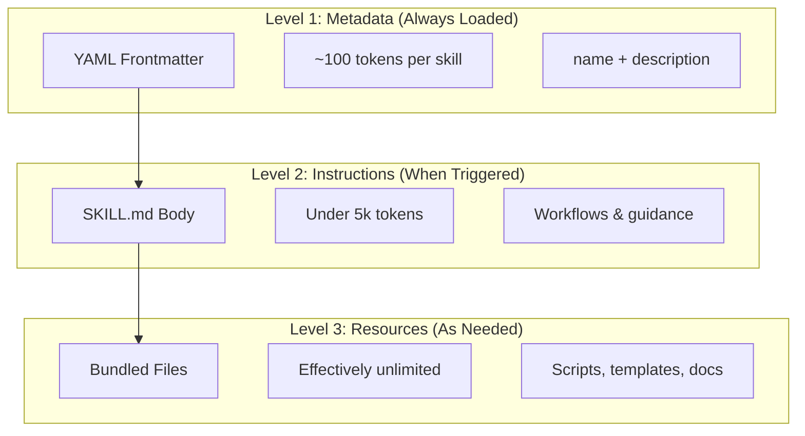
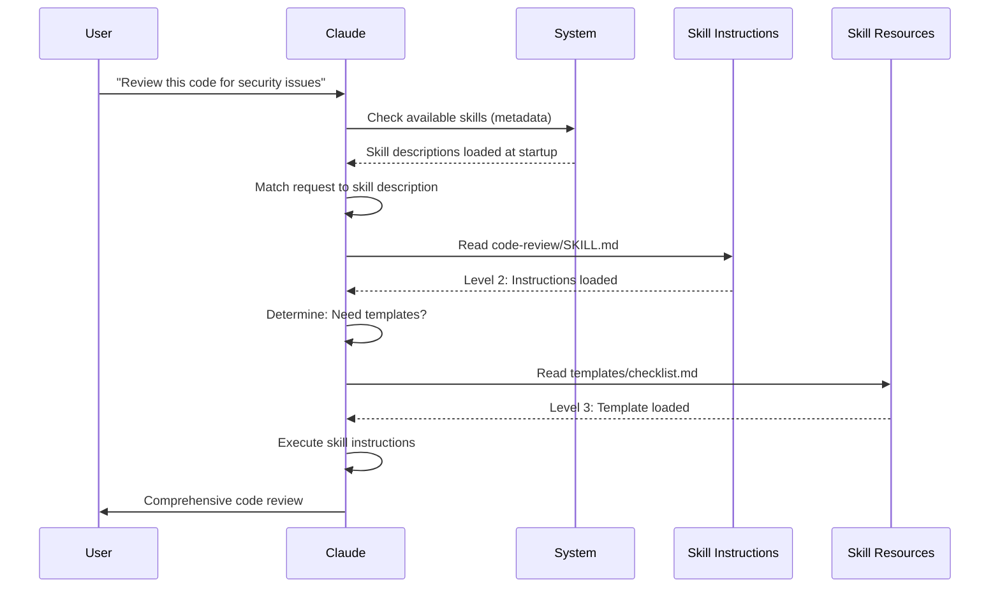

<!-- i18n-source: 03-skills/README.md -->
<!-- i18n-date: 2026-07-15 -->

<picture>
  <source media="(prefers-color-scheme: dark)" srcset="../resources/logos/claude-howto-logo-dark.svg">
  
</picture>

# คู่มือ Agent Skills

Agent Skills คือความสามารถที่นำกลับมาใช้ซ้ำได้ อาศัยระบบไฟล์เป็นฐาน และขยายฟังก์ชันการทำงานของ Claude ออกไป โดยรวบรวมความเชี่ยวชาญเฉพาะด้าน workflow และแนวปฏิบัติที่ดีไว้เป็นส่วนประกอบที่ค้นพบได้ ซึ่ง Claude จะนำมาใช้โดยอัตโนมัติเมื่อเกี่ยวข้อง

## ภาพรวม

**Agent Skills** คือความสามารถแบบโมดูลที่เปลี่ยน agent ทั่วไปให้กลายเป็นผู้เชี่ยวชาญเฉพาะด้าน ต่างจาก prompt (คำสั่งระดับบทสนทนาสำหรับงานครั้งเดียว) skill จะโหลดตามความต้องการและขจัดความจำเป็นในการให้คำแนะนำเดิมซ้ำๆ ข้ามบทสนทนาหลายครั้ง

### ประโยชน์หลัก

- **เพิ่มความเชี่ยวชาญให้ Claude**: ปรับแต่งความสามารถสำหรับงานเฉพาะด้าน
- **ลดการทำซ้ำ**: สร้างครั้งเดียว ใช้งานได้อัตโนมัติข้ามบทสนทนา
- **ประกอบความสามารถ**: รวม skill หลายอย่างเพื่อสร้าง workflow ที่ซับซ้อน
- **ขยายขนาด workflow**: นำ skill กลับมาใช้ซ้ำข้ามหลายโปรเจกต์และหลายทีม
- **รักษาคุณภาพ**: ฝังแนวปฏิบัติที่ดีลงใน workflow ของคุณโดยตรง

Skill เป็นไปตามมาตรฐานเปิด [Agent Skills](https://agentskills.io) ซึ่งทำงานได้กับเครื่องมือ AI หลายตัว Claude Code ขยายมาตรฐานนี้ด้วยฟีเจอร์เพิ่มเติม เช่น การควบคุมการเรียกใช้งาน การรันผ่าน subagent และการฉีด context แบบไดนามิก

> **หมายเหตุ**: slash command แบบกำหนดเองได้ถูกรวมเข้ากับ skill แล้ว ไฟล์ใน `.claude/commands/` ยังคงทำงานได้และรองรับ frontmatter field เดียวกัน skill เป็นตัวเลือกที่แนะนำสำหรับการพัฒนาใหม่ เมื่อทั้งสองมีอยู่ในเส้นทางเดียวกัน (เช่น `.claude/commands/review.md` และ `.claude/skills/review/SKILL.md`) skill จะมีลำดับความสำคัญสูงกว่า

## วิธีการทำงานของ Skill: Progressive Disclosure

Skill ใช้สถาปัตยกรรม **progressive disclosure** — Claude จะโหลดข้อมูลเป็นขั้นๆ ตามความจำเป็น แทนที่จะใช้ context ทั้งหมดตั้งแต่ต้น วิธีนี้ช่วยให้จัดการ context ได้อย่างมีประสิทธิภาพขณะที่ยังคงขยายขนาดได้ไม่จำกัด

### สามระดับของการโหลด



| ระดับ | โหลดเมื่อใด | ต้นทุน Token | เนื้อหา |
|-------|------------|------------|---------|
| **Level 1: Metadata** | เสมอ (ตอนเริ่มต้น) | ~100 tokens ต่อ Skill | `name` และ `description` จาก YAML frontmatter |
| **Level 2: Instructions** | เมื่อ Skill ถูก trigger | ต่ำกว่า 5k tokens | เนื้อหา SKILL.md พร้อมคำแนะนำและแนวทาง |
| **Level 3+: Resources** | ตามความจำเป็น | แทบไม่จำกัด | ไฟล์ที่รวมมาซึ่งรันผ่าน bash โดยไม่โหลดเนื้อหาเข้าสู่ context |

หมายความว่าคุณติดตั้ง Skill ได้จำนวนมากโดยไม่เสีย context — Claude เพียงรับรู้ว่าแต่ละ Skill มีอยู่และควรใช้เมื่อใด จนกว่าจะถูก trigger จริง

## กระบวนการโหลด Skill



## ประเภทและตำแหน่งของ Skill

| ประเภท | ตำแหน่ง | ขอบเขต | แบ่งปัน | เหมาะสำหรับ |
|------|----------|-------|--------|----------|
| **Enterprise** | Managed settings | ผู้ใช้ทั้งองค์กร | ใช่ | มาตรฐานระดับองค์กร |
| **Personal** | `~/.claude/skills/<skill-name>/SKILL.md` | รายบุคคล | ไม่ | workflow ส่วนตัว |
| **Project** | `.claude/skills/<skill-name>/SKILL.md` | ทีม | ใช่ (ผ่าน git) | มาตรฐานของทีม |
| **Plugin** | `<plugin>/skills/<skill-name>/SKILL.md` | ที่ที่เปิดใช้งาน | ขึ้นอยู่กับ | รวมมากับ plugin |

เมื่อ skill ใช้ชื่อเดียวกันข้ามหลายระดับ ตำแหน่งที่มีลำดับความสำคัญสูงกว่าจะชนะ: **enterprise > personal > project** ส่วน plugin skill ใช้ namespace แบบ `plugin-name:skill-name` จึงไม่เกิดความขัดแย้ง

### การค้นพบอัตโนมัติ

**Directory ซ้อนกัน**: เมื่อคุณทำงานกับไฟล์ใน subdirectory Claude Code จะค้นพบ skill จาก directory `.claude/skills/` ที่ซ้อนกันโดยอัตโนมัติ ตัวอย่างเช่น หากคุณกำลังแก้ไขไฟล์ใน `packages/frontend/` Claude Code จะมองหา skill ใน `packages/frontend/.claude/skills/` ด้วย รองรับการตั้งค่าแบบ monorepo ที่แต่ละ package มี skill ของตัวเอง

**Directory จาก `--add-dir`**: skill จาก directory ที่เพิ่มผ่าน `--add-dir` จะถูกโหลดโดยอัตโนมัติพร้อมการตรวจจับการเปลี่ยนแปลงแบบสด การแก้ไขไฟล์ skill ใน directory เหล่านั้นจะมีผลทันทีโดยไม่ต้องรีสตาร์ท Claude Code

**งบประมาณ description**: description ของ skill (Level 1 metadata) ถูกจำกัดไว้ที่ **1% ของ context window** (ค่าสำรอง: **8,000 อักขระ**) หากคุณติดตั้ง skill จำนวนมาก description อาจถูกย่อลง ชื่อ skill ทั้งหมดจะถูกรวมไว้เสมอ แต่ description จะถูกตัดให้พอดี ให้วางกรณีการใช้งานหลักไว้ต้น description ปรับงบประมาณได้ด้วยตัวแปรสภาพแวดล้อม `SLASH_COMMAND_TOOL_CHAR_BUDGET`

## การสร้าง Skill แบบกำหนดเอง

### โครงสร้าง Directory พื้นฐาน

```
my-skill/
├── SKILL.md           # Main instructions (required)
├── template.md        # Template for Claude to fill in
├── examples/
│   └── sample.md      # Example output showing expected format
└── scripts/
    └── validate.sh    # Script Claude can execute
```

### รูปแบบ SKILL.md

```yaml
---
name: your-skill-name
description: Brief description of what this Skill does and when to use it
---

# Your Skill Name

## Instructions
Provide clear, step-by-step guidance for Claude.

## Examples
Show concrete examples of using this Skill.
```

### ฟิลด์ที่จำเป็น

- **name**: ตัวอักษรพิมพ์เล็ก ตัวเลข และขีดกลางเท่านั้น (สูงสุด 64 อักขระ) ห้ามมีคำว่า "anthropic" หรือ "claude"
- **description**: Skill ทำอะไร และเมื่อใดควรใช้ (สูงสุด 1024 อักขระ) ส่วนนี้สำคัญมากในการทำให้ Claude รู้ว่าเมื่อใดควรเปิดใช้งาน skill

### ฟิลด์ Frontmatter ที่เป็นตัวเลือก

```yaml
---
name: my-skill
description: What this skill does and when to use it
argument-hint: "[filename] [format]"        # Hint for autocomplete
disable-model-invocation: true              # Only user can invoke
user-invocable: false                       # Hide from slash menu
allowed-tools: Read, Grep, Glob             # Restrict tool access
model: opus                                 # Specific model to use
effort: high                                # Effort level override (low, medium, high, xhigh, max)
context: fork                               # Run in isolated subagent
agent: Explore                              # Which agent type (with context: fork)
shell: bash                                 # Shell for commands: bash (default) or powershell
hooks:                                      # Skill-scoped hooks
  PreToolUse:
    - matcher: "Bash"
      hooks:
        - type: command
          command: "./scripts/validate.sh"
paths: "src/api/**/*.ts"               # Glob patterns limiting when skill activates
---
```

| ฟิลด์ | คำอธิบาย |
|-------|-------------|
| `name` | ตัวอักษรพิมพ์เล็ก ตัวเลข และขีดกลางเท่านั้น (สูงสุด 64 อักขระ) ห้ามมีคำว่า "anthropic" หรือ "claude" |
| `description` | Skill ทำอะไร และเมื่อใดควรใช้ (สูงสุด 1024 อักขระ) สำคัญต่อการจับคู่เพื่อเรียกใช้อัตโนมัติ |
| `argument-hint` | คำใบ้ที่แสดงในเมนู autocomplete ของ `/` (เช่น `"[filename] [format]"`) |
| `disable-model-invocation` | `true` = เฉพาะผู้ใช้เท่านั้นที่เรียกใช้ผ่าน `/name` ได้ Claude จะไม่เรียกใช้เองโดยอัตโนมัติ |
| `user-invocable` | `false` = ซ่อนจากเมนู `/` มีเพียง Claude เท่านั้นที่เรียกใช้ได้โดยอัตโนมัติ |
| `allowed-tools` | รายการเครื่องมือคั่นด้วยคอมมาที่ skill ใช้ได้โดยไม่ต้องขออนุญาต |
| `model` | override model ขณะที่ skill ทำงานอยู่ (เช่น `opus`, `sonnet`) |
| `effort` | override ระดับ effort ขณะที่ skill ทำงานอยู่: `low`, `medium`, `high`, `xhigh` หรือ `max` ระดับที่ใช้ได้ขึ้นอยู่กับ model — `xhigh` เป็นค่าเริ่มต้นของ Claude Code สำหรับ Opus 4.7 |
| `context` | `fork` เพื่อรัน skill ใน context ของ subagent ที่แยกออกมาพร้อม context window ของตัวเอง |
| `agent` | ประเภท subagent เมื่อใช้ `context: fork` (เช่น `Explore`, `Plan`, `general-purpose`) |
| `shell` | shell ที่ใช้สำหรับการแทนที่ `!`command`` และ script: `bash` (ค่าเริ่มต้น) หรือ `powershell` |
| `hooks` | hook ที่มีขอบเขตอยู่ในวงจรชีวิตของ skill นี้ (รูปแบบเดียวกับ hook ระดับ global) |
| `paths` | glob pattern ที่จำกัดว่าเมื่อใด skill จะถูกเปิดใช้งานอัตโนมัติ เป็นสตริงคั่นด้วยคอมมาหรือ YAML list รูปแบบเดียวกับ path-specific rule |

## ประเภทเนื้อหาของ Skill

Skill สามารถมีเนื้อหาได้สองประเภท แต่ละประเภทเหมาะกับวัตถุประสงค์ที่ต่างกัน:

### เนื้อหาอ้างอิง (Reference Content)

เพิ่มความรู้ที่ Claude นำไปใช้กับงานปัจจุบันของคุณ — convention, pattern, style guide, ความรู้เฉพาะด้าน ทำงานแบบ inline ร่วมกับ context ของบทสนทนา

```yaml
---
name: api-conventions
description: API design patterns for this codebase
---

When writing API endpoints:
- Use RESTful naming conventions
- Return consistent error formats
- Include request validation
```

### เนื้อหางาน (Task Content)

คำแนะนำแบบทีละขั้นตอนสำหรับการดำเนินการเฉพาะ มักถูกเรียกใช้โดยตรงด้วย `/skill-name`

```yaml
---
name: deploy
description: Deploy the application to production
context: fork
disable-model-invocation: true
---

Deploy the application:
1. Run the test suite
2. Build the application
3. Push to the deployment target
```

## การควบคุมการเรียกใช้ Skill

โดยค่าเริ่มต้น ทั้งคุณและ Claude สามารถเรียกใช้ skill ใดก็ได้ frontmatter field สองตัวควบคุมโหมดการเรียกใช้ทั้งสามโหมด:

| Frontmatter | คุณเรียกใช้ได้ | Claude เรียกใช้ได้ |
|---|---|---|
| (ค่าเริ่มต้น) | ใช่ | ใช่ |
| `disable-model-invocation: true` | ใช่ | ไม่ |
| `user-invocable: false` | ไม่ | ใช่ |

**ใช้ `disable-model-invocation: true`** สำหรับ workflow ที่มีผลข้างเคียง: `/commit`, `/deploy`, `/send-slack-message` คุณคงไม่อยากให้ Claude ตัดสินใจ deploy เพราะเห็นว่าโค้ดดูพร้อมแล้ว

**ใช้ `user-invocable: false`** สำหรับความรู้พื้นหลังที่ไม่ใช่การกระทำที่เรียกใช้เป็นคำสั่งได้ เช่น skill `legacy-system-context` ที่อธิบายวิธีการทำงานของระบบเก่า — มีประโยชน์สำหรับ Claude แต่ไม่ใช่การกระทำที่มีความหมายสำหรับผู้ใช้

## การแทนที่สตริง (String Substitutions)

Skill รองรับค่าไดนามิกที่จะถูกแก้ไขก่อนเนื้อหา skill จะไปถึง Claude:

| ตัวแปร | คำอธิบาย |
|----------|-------------|
| `$ARGUMENTS` | อาร์กิวเมนต์ทั้งหมดที่ส่งเข้ามาตอนเรียกใช้ skill |
| `$ARGUMENTS[N]` หรือ `$N` | เข้าถึงอาร์กิวเมนต์ตัวใดตัวหนึ่งด้วย index (เริ่มที่ 0) |
| `${CLAUDE_SESSION_ID}` | session ID ปัจจุบัน |
| `${CLAUDE_SKILL_DIR}` | directory ที่เก็บไฟล์ SKILL.md ของ skill |
| `${CLAUDE_EFFORT}` | ระดับ effort ปัจจุบัน (`low`, `medium`, `high`, `xhigh` หรือ `max`) มีประโยชน์สำหรับการแยกพฤติกรรม skill: เช่น `[ "${CLAUDE_EFFORT}" = "max" ] && deep_analysis` (v2.1.120+) |
| `` !`command` `` | การฉีด context แบบไดนามิก — รันคำสั่ง shell และแทรกผลลัพธ์เข้าไป |

**ตัวอย่าง:**

```yaml
---
name: fix-issue
description: Fix a GitHub issue
---

Fix GitHub issue $ARGUMENTS following our coding standards.
1. Read the issue description
2. Implement the fix
3. Write tests
4. Create a commit
```

การรัน `/fix-issue 123` จะแทนที่ `$ARGUMENTS` ด้วย `123`

## การฉีด Context แบบไดนามิก

ไวยากรณ์ `!`command`` จะรันคำสั่ง shell ก่อนที่เนื้อหา skill จะถูกส่งไปยัง Claude:

```yaml
---
name: pr-summary
description: Summarize changes in a pull request
context: fork
agent: Explore
---

## Pull request context
- PR diff: !`gh pr diff`
- PR comments: !`gh pr view --comments`
- Changed files: !`gh pr diff --name-only`

## Your task
Summarize this pull request...
```

คำสั่งจะทำงานทันที Claude เห็นเพียงผลลัพธ์สุดท้าย โดยค่าเริ่มต้นคำสั่งจะรันใน `bash` ตั้งค่า `shell: powershell` ใน frontmatter เพื่อใช้ PowerShell แทน

## การรัน Skill ใน Subagent

เพิ่ม `context: fork` เพื่อรัน skill ใน context ของ subagent ที่แยกออกมา เนื้อหา skill จะกลายเป็นงานสำหรับ subagent เฉพาะทางที่มี context window ของตัวเอง ช่วยให้บทสนทนาหลักไม่รก

ฟิลด์ `agent` ระบุประเภท agent ที่จะใช้:

| ประเภท Agent | เหมาะสำหรับ |
|---|---|
| `Explore` | การค้นคว้าแบบอ่านอย่างเดียว การวิเคราะห์ codebase |
| `Plan` | การสร้างแผนการ implement |
| `general-purpose` | งานกว้างที่ต้องใช้เครื่องมือทั้งหมด |
| Custom agents | agent เฉพาะทางที่กำหนดไว้ในการกำหนดค่าของคุณ |

**ตัวอย่าง frontmatter:**

```yaml
---
context: fork
agent: Explore
---
```

**ตัวอย่าง skill ฉบับเต็ม:**

```yaml
---
name: deep-research
description: Research a topic thoroughly
context: fork
agent: Explore
---

Research $ARGUMENTS thoroughly:
1. Find relevant files using Glob and Grep
2. Read and analyze the code
3. Summarize findings with specific file references
```

## ตัวอย่างการใช้งานจริง

### ตัวอย่างที่ 1: Code Review Skill

**โครงสร้าง Directory:**

```
~/.claude/skills/code-review/
├── SKILL.md
├── templates/
│   ├── review-checklist.md
│   └── finding-template.md
└── scripts/
    ├── analyze-metrics.py
    └── compare-complexity.py
```

**ไฟล์:** `~/.claude/skills/code-review/SKILL.md`

```yaml
---
name: code-review-specialist
description: Comprehensive code review with security, performance, and quality analysis. Use when users ask to review code, analyze code quality, evaluate pull requests, or mention code review, security analysis, or performance optimization.
---

# Code Review Skill

This skill provides comprehensive code review capabilities focusing on:

1. **Security Analysis**
   - Authentication/authorization issues
   - Data exposure risks
   - Injection vulnerabilities
   - Cryptographic weaknesses

2. **Performance Review**
   - Algorithm efficiency (Big O analysis)
   - Memory optimization
   - Database query optimization
   - Caching opportunities

3. **Code Quality**
   - SOLID principles
   - Design patterns
   - Naming conventions
   - Test coverage

4. **Maintainability**
   - Code readability
   - Function size (should be < 50 lines)
   - Cyclomatic complexity
   - Type safety

## Review Template

For each piece of code reviewed, provide:

### Summary
- Overall quality assessment (1-5)
- Key findings count
- Recommended priority areas

### Critical Issues (if any)
- **Issue**: Clear description
- **Location**: File and line number
- **Impact**: Why this matters
- **Severity**: Critical/High/Medium
- **Fix**: Code example

For detailed checklists, see [templates/review-checklist.md](templates/review-checklist.md).
```

### ตัวอย่างที่ 2: Codebase Visualizer Skill

skill ที่สร้างการแสดงผลแบบ HTML เชิงโต้ตอบ:

**โครงสร้าง Directory:**

```
~/.claude/skills/codebase-visualizer/
├── SKILL.md
└── scripts/
    └── visualize.py
```

**ไฟล์:** `~/.claude/skills/codebase-visualizer/SKILL.md`

````yaml
---
name: codebase-visualizer
description: Generate an interactive collapsible tree visualization of your codebase. Use when exploring a new repo, understanding project structure, or identifying large files.
allowed-tools: Bash(python *)
---

# Codebase Visualizer

Generate an interactive HTML tree view showing your project's file structure.

## Usage

Run the visualization script from your project root:

```bash
python ~/.claude/skills/codebase-visualizer/scripts/visualize.py .
```

This creates `codebase-map.html` and opens it in your default browser.

## What the visualization shows

- **Collapsible directories**: Click folders to expand/collapse
- **File sizes**: Displayed next to each file
- **Colors**: Different colors for different file types
- **Directory totals**: Shows aggregate size of each folder
````

script Python ที่รวมมาจะทำงานหนักส่วนใหญ่ ขณะที่ Claude จัดการการประสานงาน

### ตัวอย่างที่ 3: Deploy Skill (ผู้ใช้เรียกใช้เท่านั้น)

```yaml
---
name: deploy
description: Deploy the application to production
disable-model-invocation: true
allowed-tools: Bash(npm *), Bash(git *)
---

Deploy $ARGUMENTS to production:

1. Run the test suite: `npm test`
2. Build the application: `npm run build`
3. Push to the deployment target
4. Verify the deployment succeeded
5. Report deployment status
```

### ตัวอย่างที่ 4: Brand Voice Skill (ความรู้พื้นหลัง)

```yaml
---
name: brand-voice
description: Ensure all communication matches brand voice and tone guidelines. Use when creating marketing copy, customer communications, or public-facing content.
user-invocable: false
---

## Tone of Voice
- **Friendly but professional** - approachable without being casual
- **Clear and concise** - avoid jargon
- **Confident** - we know what we're doing
- **Empathetic** - understand user needs

## Writing Guidelines
- Use "you" when addressing readers
- Use active voice
- Keep sentences under 20 words
- Start with value proposition

For templates, see [templates/](templates/).
```

### ตัวอย่างที่ 5: CLAUDE.md Generator Skill

```yaml
---
name: claude-md
description: Create or update CLAUDE.md files following best practices for optimal AI agent onboarding. Use when users mention CLAUDE.md, project documentation, or AI onboarding.
---

## Core Principles

**LLMs are stateless**: CLAUDE.md is the only file automatically included in every conversation.

### The Golden Rules

1. **Less is More**: Keep under 300 lines (ideally under 100)
2. **Universal Applicability**: Only include information relevant to EVERY session
3. **Don't Use Claude as a Linter**: Use deterministic tools instead
4. **Never Auto-Generate**: Craft it manually with careful consideration

## Essential Sections

- **Project Name**: Brief one-line description
- **Tech Stack**: Primary language, frameworks, database
- **Development Commands**: Install, test, build commands
- **Critical Conventions**: Only non-obvious, high-impact conventions
- **Known Issues / Gotchas**: Things that trip up developers
```

### ตัวอย่างที่ 6: Refactoring Skill พร้อม Script

**โครงสร้าง Directory:**

```
refactor/
├── SKILL.md
├── references/
│   ├── code-smells.md
│   └── refactoring-catalog.md
├── templates/
│   └── refactoring-plan.md
└── scripts/
    ├── analyze-complexity.py
    └── detect-smells.py
```

**ไฟล์:** `refactor/SKILL.md`

```yaml
---
name: code-refactor
description: Systematic code refactoring based on Martin Fowler's methodology. Use when users ask to refactor code, improve code structure, reduce technical debt, or eliminate code smells.
---

# Code Refactoring Skill

A phased approach emphasizing safe, incremental changes backed by tests.

## Workflow

Phase 1: Research & Analysis → Phase 2: Test Coverage Assessment →
Phase 3: Code Smell Identification → Phase 4: Refactoring Plan Creation →
Phase 5: Incremental Implementation → Phase 6: Review & Iteration

## Core Principles

1. **Behavior Preservation**: External behavior must remain unchanged
2. **Small Steps**: Make tiny, testable changes
3. **Test-Driven**: Tests are the safety net
4. **Continuous**: Refactoring is ongoing, not a one-time event

For code smell catalog, see [references/code-smells.md](references/code-smells.md).
For refactoring techniques, see [references/refactoring-catalog.md](references/refactoring-catalog.md).
```

## ไฟล์สนับสนุน

Skill สามารถมีไฟล์หลายไฟล์ใน directory ของตนนอกเหนือจาก `SKILL.md` ไฟล์สนับสนุนเหล่านี้ (template, ตัวอย่าง, script, เอกสารอ้างอิง) ช่วยให้คุณเก็บไฟล์ skill หลักให้กระชับ ขณะที่จัดเตรียมทรัพยากรเพิ่มเติมให้ Claude โหลดได้ตามความจำเป็น

```
my-skill/
├── SKILL.md              # Main instructions (required, keep under 500 lines)
├── templates/            # Templates for Claude to fill in
│   └── output-format.md
├── examples/             # Example outputs showing expected format
│   └── sample-output.md
├── references/           # Domain knowledge and specifications
│   └── api-spec.md
└── scripts/              # Scripts Claude can execute
    └── validate.sh
```

แนวทางสำหรับไฟล์สนับสนุน:

- เก็บ `SKILL.md` ให้ไม่เกิน **500 บรรทัด** ย้ายเอกสารอ้างอิงที่ละเอียด ตัวอย่างขนาดใหญ่ และข้อกำหนดไปยังไฟล์แยก
- อ้างอิงไฟล์เพิ่มเติมจาก `SKILL.md` โดยใช้ **relative path** (เช่น `[API reference](references/api-spec.md)`)
- ไฟล์สนับสนุนจะถูกโหลดที่ Level 3 (ตามความจำเป็น) จึงไม่ใช้ context จนกว่า Claude จะอ่านจริง

## การจัดการ Skill

### การดู Skill ที่มีอยู่

ถาม Claude โดยตรง:
```
What Skills are available?
```

หรือตรวจสอบระบบไฟล์:
```bash
# List personal Skills
ls ~/.claude/skills/

# List project Skills
ls .claude/skills/
```

> **เคล็ดลับ (v2.1.121+):** พิมพ์เพื่อกรองเมนูโต้ตอบ `/skills` — มีประโยชน์เมื่อติดตั้ง skill จำนวนมาก

### การทดสอบ Skill

ทดสอบได้สองวิธี:

**ให้ Claude เรียกใช้โดยอัตโนมัติ** ด้วยการถามบางอย่างที่ตรงกับ description:
```
Can you help me review this code for security issues?
```

**หรือเรียกใช้โดยตรง** ด้วยชื่อ skill:
```
/code-review src/auth/login.ts
```

### การอัปเดต Skill

แก้ไขไฟล์ `SKILL.md` โดยตรง การเปลี่ยนแปลงจะมีผลเมื่อเริ่มต้น Claude Code ครั้งถัดไป

```bash
# Personal Skill
code ~/.claude/skills/my-skill/SKILL.md

# Project Skill
code .claude/skills/my-skill/SKILL.md
```

### การจำกัดการเข้าถึง Skill ของ Claude

มีสามวิธีในการควบคุมว่า Claude เรียกใช้ skill ใดได้บ้าง:

**ปิด skill ทั้งหมด** ใน `/permissions`:
```
# Add to deny rules:
Skill
```

**อนุญาตหรือปฏิเสธ skill เฉพาะ**:
```
# Allow only specific skills
Skill(commit)
Skill(review-pr *)

# Deny specific skills
Skill(deploy *)
```

**ซ่อน skill รายตัว** โดยเพิ่ม `disable-model-invocation: true` ลงใน frontmatter ของ skill นั้น

### การควบคุมพฤติกรรมการ Override ของ Skill (`skillOverrides`)

เมื่อ project skill และ user skill ใช้ชื่อเดียวกัน project จะชนะโดยค่าเริ่มต้น การตั้งค่า `skillOverrides` (v2.1.129+) ให้คุณปรับพฤติกรรมนี้ได้ เพิ่มลงใน `~/.claude/settings.json` หรือ `.claude/settings.json` ของโปรเจกต์:

```json
{
  "skillOverrides": "name-only"
}
```

ค่าที่ยอมรับได้:

| ค่า | พฤติกรรม |
|-------|----------|
| `"on"` (ค่าเริ่มต้น) | repo skill สามารถ override user skill ที่ชื่อเดียวกันได้ |
| `"off"` | ปิดการ override ทั้งหมด — user skill ชนะเสมอ |
| `"name-only"` | จับคู่การ override ด้วยชื่อ skill เท่านั้น (ไม่สนใจ description / source) |
| `"user-invocable-only"` | เฉพาะ skill ที่ผู้ใช้เรียกใช้ได้เท่านั้นที่ถูก override ได้ — skill ที่ model เรียกใช้จะมาจากตำแหน่งเดิมเสมอ |

มีประโยชน์เมื่อนโยบายของทีมกำหนดว่า "skill ที่ผู้ใช้กำหนดต้องมีลำดับความสำคัญเหนือกว่าเสมอ" (`"off"`) หรือ "อนุญาตเฉพาะการ override แบบแคบตามชื่อเท่านั้น" (`"name-only"`)

## แนวปฏิบัติที่ดี

### 1. เขียน Description ให้เฉพาะเจาะจง

- **แย่ (คลุมเครือ)**: "Helps with documents"
- **ดี (เฉพาะเจาะจง)**: "Extract text and tables from PDF files, fill forms, merge documents. Use when working with PDF files or when the user mentions PDFs, forms, or document extraction."

### 2. ทำให้ Skill มีจุดโฟกัสเดียว

- หนึ่ง Skill = หนึ่งความสามารถ
- ✅ "PDF form filling"
- ❌ "Document processing" (กว้างเกินไป)

### 3. ใส่คำที่เป็น Trigger

เพิ่มคีย์เวิร์ดใน description ที่ตรงกับคำร้องขอของผู้ใช้:
```yaml
description: Analyze Excel spreadsheets, generate pivot tables, create charts. Use when working with Excel files, spreadsheets, or .xlsx files.
```

### 4. เก็บ SKILL.md ให้ไม่เกิน 500 บรรทัด

ย้ายเอกสารอ้างอิงที่ละเอียดไปยังไฟล์แยกที่ Claude โหลดได้ตามความจำเป็น

### 5. อ้างอิงไฟล์สนับสนุน

```markdown
## Additional resources

- For complete API details, see [reference.md](reference.md)
- For usage examples, see [examples.md](examples.md)
```

### สิ่งที่ควรทำ

- ใช้ชื่อที่ชัดเจนและสื่อความหมาย
- ใส่คำแนะนำที่ครอบคลุม
- เพิ่มตัวอย่างที่เป็นรูปธรรม
- รวม script และ template ที่เกี่ยวข้องไว้ด้วยกัน
- ทดสอบด้วยสถานการณ์จริง
- ระบุ dependency ในเอกสาร

### สิ่งที่ไม่ควรทำ

- อย่าสร้าง skill สำหรับงานครั้งเดียว
- อย่าทำซ้ำฟังก์ชันที่มีอยู่แล้ว
- อย่าทำให้ skill กว้างเกินไป
- อย่าละเว้นฟิลด์ description
- อย่าติดตั้ง skill จากแหล่งที่ไม่น่าเชื่อถือโดยไม่ตรวจสอบ

## การแก้ปัญหา

### อ้างอิงอย่างรวดเร็ว

| ปัญหา | วิธีแก้ |
|-------|----------|
| Claude ไม่ใช้ Skill | ทำให้ description เฉพาะเจาะจงมากขึ้นด้วยคำที่เป็น trigger |
| ไม่พบไฟล์ Skill | ตรวจสอบ path: `~/.claude/skills/name/SKILL.md` |
| YAML ผิดพลาด | ตรวจสอบเครื่องหมาย `---`, การเยื้อง, ห้ามมี tab |
| Skill ขัดแย้งกัน | ใช้คำที่เป็น trigger ที่ต่างกันใน description |
| Script ไม่ทำงาน | ตรวจสอบสิทธิ์: `chmod +x scripts/*.py` |
| Claude ไม่เห็น skill ทั้งหมด | skill มากเกินไป ตรวจสอบ `/context` เพื่อดูคำเตือน |

### Skill ไม่ถูก Trigger

หาก Claude ไม่ใช้ skill ของคุณเมื่อคาดหวัง:

1. ตรวจสอบว่า description มีคีย์เวิร์ดที่ผู้ใช้พูดตามธรรมชาติ
2. ยืนยันว่า skill ปรากฏเมื่อถาม "What skills are available?"
3. ลองเปลี่ยนถ้อยคำในคำร้องขอให้ตรงกับ description
4. เรียกใช้โดยตรงด้วย `/skill-name` เพื่อทดสอบ

### Skill ถูก Trigger บ่อยเกินไป

หาก Claude ใช้ skill ของคุณในเวลาที่คุณไม่ต้องการ:

1. ทำให้ description เฉพาะเจาะจงมากขึ้น
2. เพิ่ม `disable-model-invocation: true` เพื่อให้เรียกใช้ด้วยตนเองเท่านั้น

### Claude ไม่เห็น Skill ทั้งหมด

description ของ skill ถูกโหลดที่ **1% ของ context window** (ค่าสำรอง: **8,000 อักขระ**) แต่ละรายการถูกจำกัดที่ 250 อักขระโดยไม่คำนึงถึงงบประมาณ รัน `/context` เพื่อตรวจสอบคำเตือนเกี่ยวกับ skill ที่ถูกยกเว้น ปรับงบประมาณได้ด้วยตัวแปรสภาพแวดล้อม `SLASH_COMMAND_TOOL_CHAR_BUDGET`

## ข้อพิจารณาด้านความปลอดภัย

**ใช้ Skill จากแหล่งที่น่าเชื่อถือเท่านั้น** Skill ให้ความสามารถแก่ Claude ผ่านคำแนะนำและโค้ด — Skill ที่เป็นอันตรายสามารถสั่งให้ Claude เรียกใช้เครื่องมือหรือรันโค้ดในทางที่เป็นอันตรายได้

**ข้อพิจารณาด้านความปลอดภัยหลัก:**

- **ตรวจสอบอย่างละเอียด**: ตรวจสอบไฟล์ทั้งหมดใน directory ของ Skill
- **แหล่งภายนอกมีความเสี่ยง**: Skill ที่ดึงข้อมูลจาก URL ภายนอกอาจถูกเจาะระบบได้
- **การใช้เครื่องมือในทางที่ผิด**: Skill ที่เป็นอันตรายสามารถเรียกใช้เครื่องมือในทางที่เป็นอันตรายได้
- **ปฏิบัติเหมือนการติดตั้งซอฟต์แวร์**: ใช้ Skill จากแหล่งที่น่าเชื่อถือเท่านั้น

### การปิดการแทนที่ Shell ใน Skill

Skill รองรับไวยากรณ์ `` !`command` `` เพื่อฉีดผลลัพธ์ของคำสั่ง shell เข้าไปใน prompt ก่อนที่ Claude จะเห็น ในสภาพแวดล้อมที่ต้องคำนึงถึงความปลอดภัย (การใช้งานร่วมกันระดับ enterprise, CI runner ที่ถูกล็อกไว้) คุณสามารถปิดการแทนที่นี้ได้ทั้งหมดผ่านการตั้งค่า `disableSkillShellExecution` (เพิ่มใน **v2.1.91**):

```jsonc
// ~/.claude/settings.json or managed policy
{
  "disableSkillShellExecution": true
}
```

เมื่อ `disableSkillShellExecution` เป็น `true` เครื่องหมาย `` !`command` `` ใดๆ ใน skill จะถูกทิ้งไว้เป็นข้อความตัวอักษรแทนที่จะถูกรัน — ลดพื้นที่โจมตีแบบ shell-injection ระดับ skill โดยไม่ต้องปิด skill เอง พิจารณาใช้ร่วมกับ allowlist `allowedTools` เพื่อการป้องกันเชิงลึก

## Skill เทียบกับฟีเจอร์อื่นๆ

| ฟีเจอร์ | การเรียกใช้ | เหมาะสำหรับ |
|---------|------------|----------|
| **Skills** | อัตโนมัติหรือ `/name` | ความเชี่ยวชาญและ workflow ที่นำกลับมาใช้ซ้ำได้ |
| **Slash Commands** | ผู้ใช้เริ่มด้วย `/name` | ทางลัดที่รวดเร็ว (รวมเข้ากับ skill แล้ว) |
| **Subagents** | มอบหมายอัตโนมัติ | การดำเนินงานที่แยกออกมา |
| **Memory (CLAUDE.md)** | โหลดเสมอ | context โปรเจกต์ถาวร |
| **MCP** | เรียลไทม์ | การเข้าถึงข้อมูล/บริการภายนอก |
| **Hooks** | ขับเคลื่อนด้วย event | ผลข้างเคียงอัตโนมัติ |

## Skill ที่มาพร้อมกับระบบ

Claude Code มาพร้อม skill ในตัวหลายตัวที่พร้อมใช้งานเสมอโดยไม่ต้องติดตั้ง:

| Skill | คำอธิบาย |
|-------|-------------|
| `/simplify` | ตรวจสอบไฟล์ที่เปลี่ยนแปลงเพื่อการนำกลับมาใช้ซ้ำ คุณภาพ และประสิทธิภาพ; สร้าง review agent แบบขนาน 3 ตัว |
| `/batch <instruction>` | ประสานการเปลี่ยนแปลงแบบขนานขนาดใหญ่ทั่ว codebase โดยใช้ git worktree |
| `/debug [description]` | แก้ปัญหา session ปัจจุบันโดยอ่าน debug log |
| `/loop [interval] <prompt>` | รัน prompt ซ้ำๆ ตามช่วงเวลา (เช่น `/loop 5m check the deploy`) |
| `/claude-api` | โหลดเอกสารอ้างอิง Claude API/SDK; เปิดใช้งานอัตโนมัติเมื่อ import `anthropic`/`@anthropic-ai/sdk` |

skill เหล่านี้พร้อมใช้งานทันทีและไม่จำเป็นต้องติดตั้งหรือกำหนดค่า โดยใช้รูปแบบ SKILL.md เดียวกับ skill แบบกำหนดเอง

## การแบ่งปัน Skill

### Project Skill (การแบ่งปันในทีม)

1. สร้าง Skill ใน `.claude/skills/`
2. commit ไปยัง git
3. สมาชิกทีม pull การเปลี่ยนแปลง — Skill พร้อมใช้งานทันที

### Personal Skill

```bash
# Copy to personal directory
cp -r my-skill ~/.claude/skills/

# Make scripts executable
chmod +x ~/.claude/skills/my-skill/scripts/*.py
```

### การเผยแพร่ผ่าน Plugin

แพ็คเกจ skill ไว้ใน directory `skills/` ของ plugin เพื่อการเผยแพร่ในวงกว้าง

## ก้าวต่อไป: คอลเลกชัน Skill และเครื่องมือจัดการ Skill

เมื่อคุณเริ่มสร้าง skill อย่างจริงจัง มีสองสิ่งที่กลายเป็นสิ่งจำเป็น: ไลบรารีของ skill ที่พิสูจน์แล้ว และเครื่องมือในการจัดการมัน

**[luongnv89/skills](https://github.com/luongnv89/skills)** — คอลเลกชัน skill ที่ผมใช้ทุกวันในเกือบทุกโปรเจกต์ ตัวเด่นได้แก่ `logo-designer` (สร้างโลโก้โปรเจกต์ได้ทันที) และ `ollama-optimizer` (ปรับแต่งประสิทธิภาพ LLM ในเครื่องให้เหมาะกับฮาร์ดแวร์ของคุณ) เป็นจุดเริ่มต้นที่ดีหากคุณต้องการ skill ที่พร้อมใช้งาน

**[luongnv89/asm](https://github.com/luongnv89/asm)** — Agent Skill Manager จัดการการพัฒนา skill การตรวจจับความซ้ำซ้อน และการทดสอบ คำสั่ง `asm link` ช่วยให้คุณทดสอบ skill ในโปรเจกต์ใดก็ได้โดยไม่ต้องคัดลอกไฟล์ไปมา — จำเป็นเมื่อคุณมี skill มากกว่าไม่กี่ตัว

## แหล่งข้อมูลเพิ่มเติม

- [เอกสาร Skills ทางการ](https://code.claude.com/docs/en/skills)
- [บล็อกสถาปัตยกรรม Agent Skills](https://claude.com/blog/equipping-agents-for-the-real-world-with-agent-skills)
- [Skills Repository](https://github.com/luongnv89/skills) - คอลเลกชัน skill ที่พร้อมใช้งาน
- [คู่มือ Slash Commands](../01-slash-commands/) - ทางลัดที่ผู้ใช้เรียกใช้
- [คู่มือ Subagents](../04-subagents/) - AI agent ที่ถูกมอบหมายงาน
- [คู่มือ Memory](../02-memory/) - context ถาวร
- [MCP (Model Context Protocol)](../05-mcp/) - ข้อมูลภายนอกแบบเรียลไทม์
- [คู่มือ Hooks](../06-hooks/) - automation ที่ขับเคลื่อนด้วย event

---
**อัปเดตล่าสุด**: 6 พฤษภาคม 2026
**Claude Code Version**: 2.1.131
**แหล่งที่มา**:
- https://code.claude.com/docs/en/skills
- https://code.claude.com/docs/en/settings
- https://code.claude.com/docs/en/changelog
**model ที่รองรับ**: Claude Sonnet 4.6, Claude Opus 4.7, Claude Haiku 4.5
