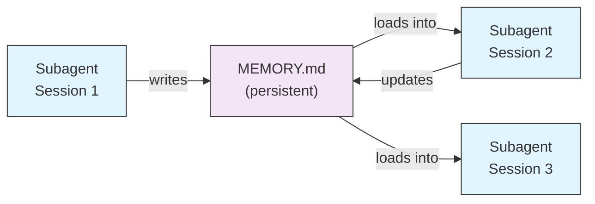
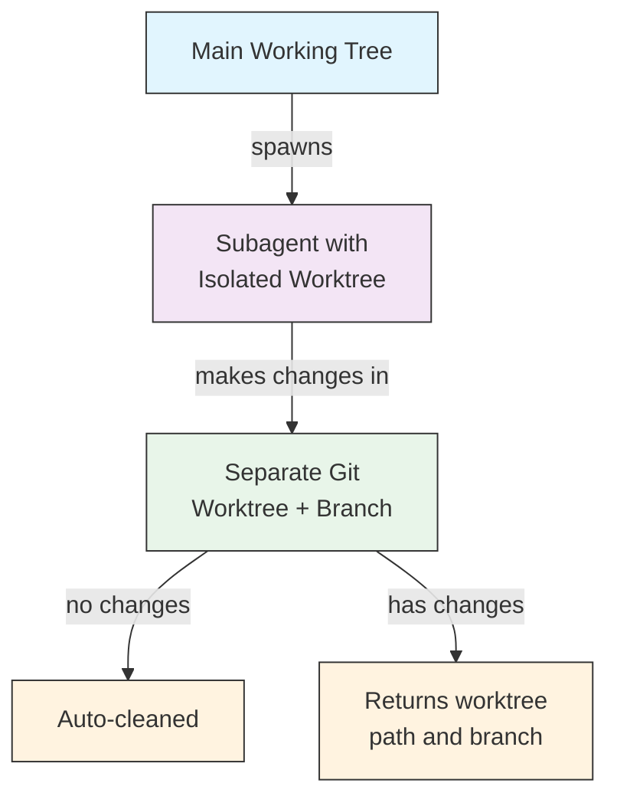
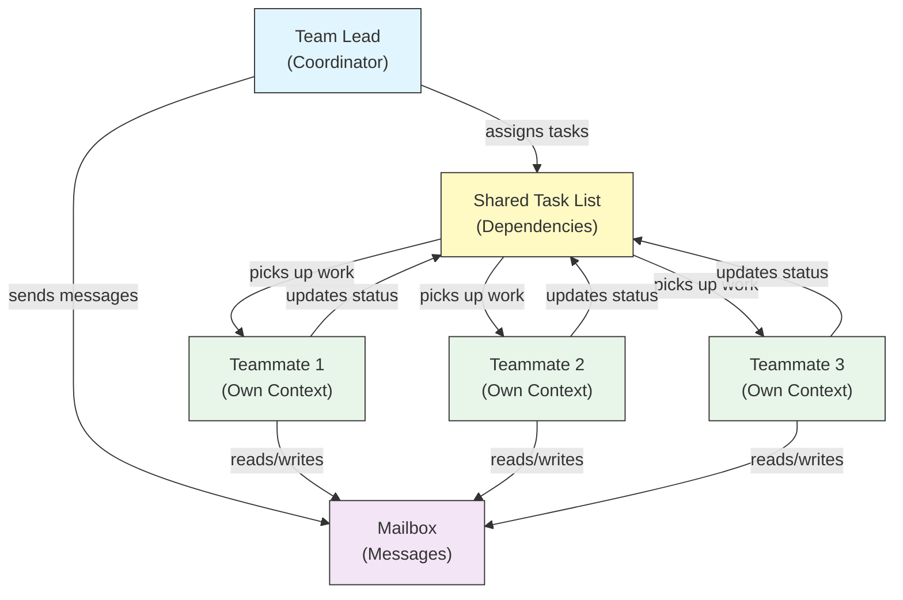
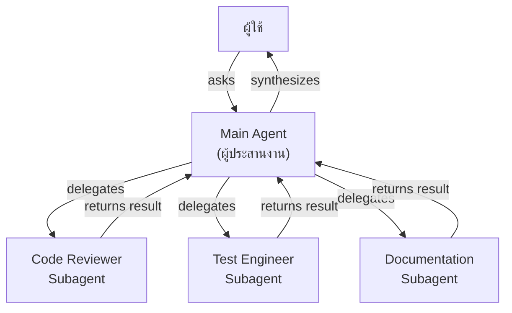
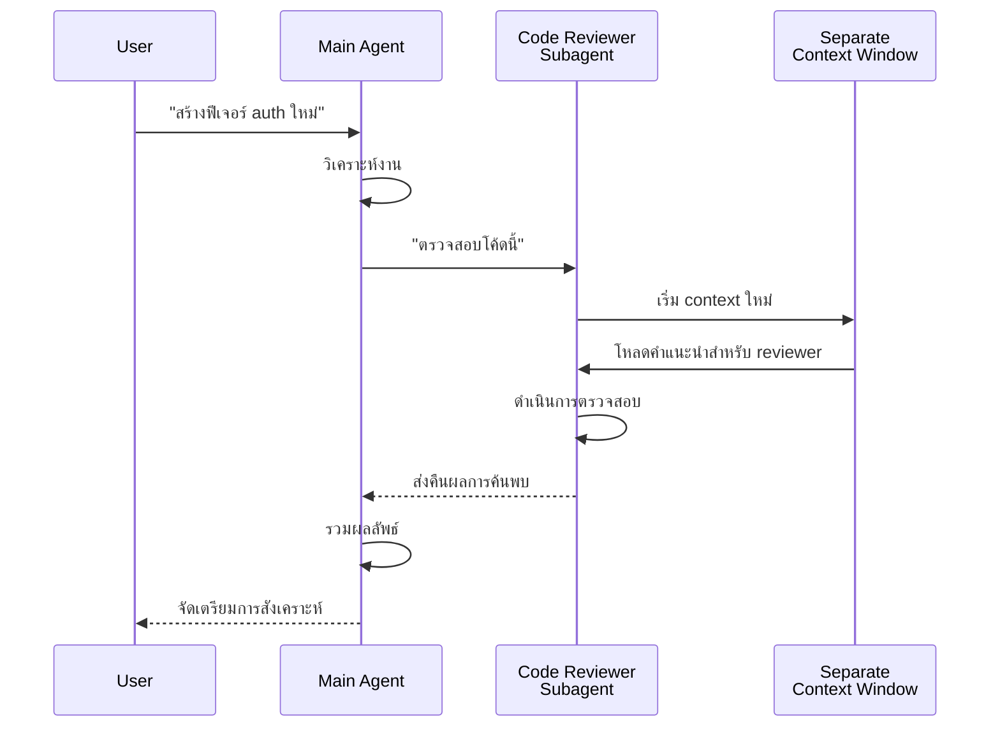
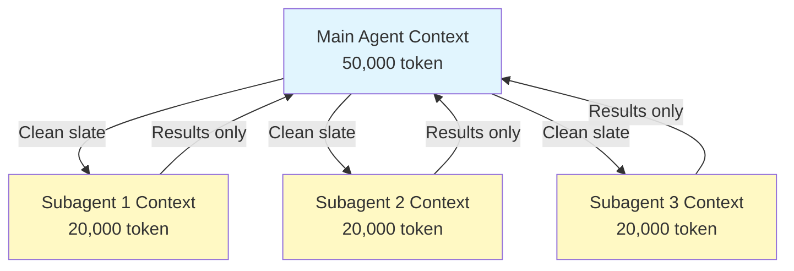
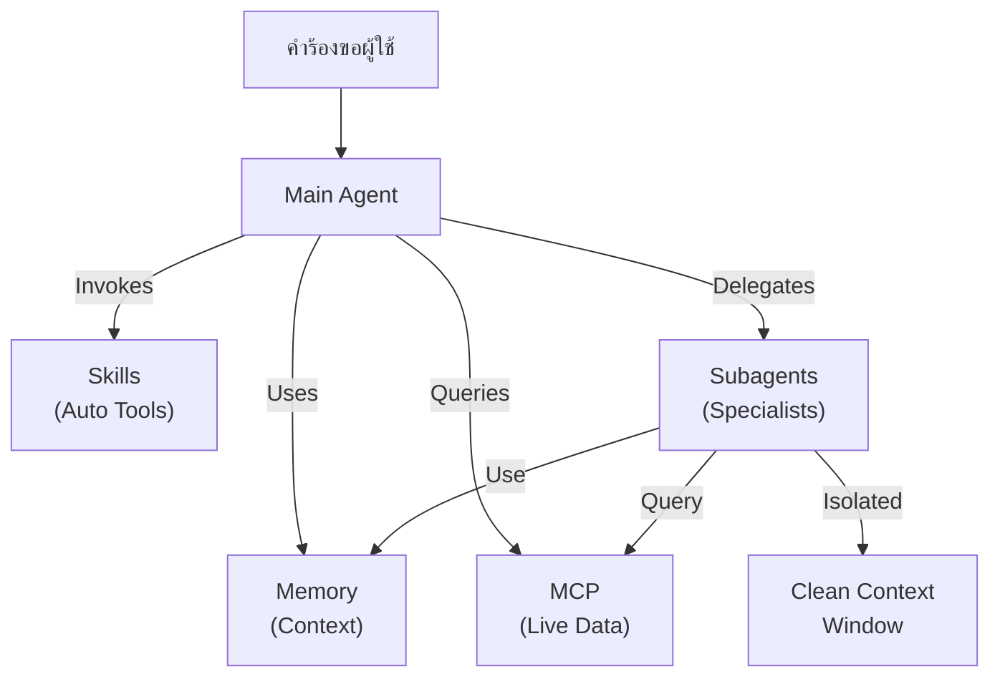

<picture>
  <source media="(prefers-color-scheme: dark)" srcset="../resources/logos/claude-howto-logo-dark.svg">
  
</picture>

<!-- i18n-source: 04-subagents/README.md -->
<!-- i18n-date: 2026-05-09 -->

# Subagents — คู่มืออ้างอิงฉบับสมบูรณ์

subagent คือผู้ช่วย AI เฉพาะทางที่ Claude Code สามารถมอบหมายงานให้ดำเนินการ แต่ละ subagent มีจุดมุ่งหมายเฉพาะ ใช้ context window ของตัวเองแยกจากการสนทนาหลัก และสามารถกำหนดค่าด้วยเครื่องมือเฉพาะและ system prompt ที่กำหนดเอง

## สารบัญ

1. [ภาพรวม](#ภาพรวม)
2. [ประโยชน์หลัก](#ประโยชน์หลัก)
3. [ตำแหน่งไฟล์](#ตำแหน่งไฟล์)
4. [การกำหนดค่า](#การกำหนดค่า)
5. [subagent ในตัว](#subagent-ในตัว)
6. [การจัดการ subagent](#การจัดการ-subagent)
7. [การใช้ subagent](#การใช้-subagent)
8. [Resumable Agent](#resumable-agent)
9. [การเชื่อม subagent](#การเชื่อม-subagent)
10. [Persistent Memory สำหรับ subagent](#persistent-memory-สำหรับ-subagent)
11. [Background subagent](#background-subagent)
12. [Worktree Isolation](#worktree-isolation)
13. [การจำกัด subagent ที่สามารถ spawn ได้](#การจำกัด-subagent-ที่สามารถ-spawn-ได้)
14. [คำสั่ง CLI `claude agents`](#คำสั่ง-cli-claude-agents)
15. [Agent Teams (ทดลอง)](#agent-teams-ทดลอง)
16. [ความปลอดภัยของ plugin subagent](#ความปลอดภัยของ-plugin-subagent)
17. [สถาปัตยกรรม](#สถาปัตยกรรม)
18. [การจัดการ context](#การจัดการ-context)
19. [เมื่อใดควรใช้ subagent](#เมื่อใดควรใช้-subagent)
20. [แนวปฏิบัติที่ดี](#แนวปฏิบัติที่ดี)
21. [ตัวอย่าง subagent ในโฟลเดอร์นี้](#ตัวอย่าง-subagent-ในโฟลเดอร์นี้)
22. [คำแนะนำการติดตั้ง](#คำแนะนำการติดตั้ง)
23. [แนวคิดที่เกี่ยวข้อง](#แนวคิดที่เกี่ยวข้อง)

---

## ภาพรวม

subagent เปิดใช้งานการมอบหมายงานใน Claude Code โดย:

- สร้าง **ผู้ช่วย AI แบบแยกส่วน** พร้อม context window ที่แยกต่างหาก
- จัดเตรียม **system prompt ที่กำหนดเอง** สำหรับความเชี่ยวชาญเฉพาะทาง
- บังคับใช้ **การควบคุมการเข้าถึงเครื่องมือ** เพื่อจำกัดความสามารถ
- ป้องกัน **การปนเปื้อน context** จากงานที่ซับซ้อน
- เปิดใช้งาน **การดำเนินการแบบขนาน** ของงานเฉพาะทางหลายอย่าง

แต่ละ subagent ดำเนินการอย่างอิสระด้วย clean slate รับเฉพาะ context ที่จำเป็นสำหรับงานของตน จากนั้นส่งคืนผลลัพธ์ให้ main agent เพื่อสังเคราะห์

**เริ่มต้นอย่างรวดเร็ว**: ใช้คำสั่ง `/agents` เพื่อสร้าง ดู แก้ไข และจัดการ subagent ของคุณแบบโต้ตอบ

---

## ประโยชน์หลัก

| ประโยชน์ | คำอธิบาย |
|---------|-------------|
| **การรักษา context** | ดำเนินการใน context แยกต่างหาก ป้องกันการปนเปื้อนของการสนทนาหลัก |
| **ความเชี่ยวชาญเฉพาะทาง** | ปรับแต่งสำหรับโดเมนเฉพาะพร้อมอัตราความสำเร็จที่สูงขึ้น |
| **การนำกลับมาใช้ใหม่** | ใช้ข้ามโปรเจกต์ต่างๆ และแชร์กับทีม |
| **สิทธิ์ที่ยืดหยุ่น** | ระดับการเข้าถึงเครื่องมือที่แตกต่างกันสำหรับ subagent ประเภทต่างๆ |
| **ความสามารถในการขยาย** | agent หลายตัวทำงานในด้านต่างๆ พร้อมกัน |

---

## ตำแหน่งไฟล์

ไฟล์ subagent สามารถจัดเก็บในหลายตำแหน่งพร้อมขอบเขตที่แตกต่างกัน:

| ลำดับความสำคัญ | ประเภท | ตำแหน่ง | ขอบเขต |
|----------|------|----------|-------|
| 1 (สูงสุด) | **กำหนดผ่าน CLI** | ผ่าน flag `--agents` (JSON) | เฉพาะ session |
| 2 | **subagent ระดับโปรเจกต์** | `.claude/agents/` | โปรเจกต์ปัจจุบัน |
| 3 | **subagent ระดับผู้ใช้** | `~/.claude/agents/` | ทุกโปรเจกต์ |
| 4 (ต่ำสุด) | **plugin agent** | directory `agents/` ของ plugin | ผ่าน plugin |

เมื่อมีชื่อซ้ำ แหล่งที่มีลำดับความสำคัญสูงกว่าจะมีผลเหนือกว่า

---

## การกำหนดค่า

### รูปแบบไฟล์

subagent ถูกกำหนดใน YAML frontmatter ตามด้วย system prompt ในรูปแบบ markdown:

```yaml
---
name: your-sub-agent-name
description: คำอธิบายว่าควร invoke subagent นี้เมื่อใด
tools: tool1, tool2, tool3  # ไม่บังคับ — รับสืบทอดเครื่องมือทั้งหมดหากละไว้
disallowedTools: tool4  # ไม่บังคับ — เครื่องมือที่ไม่อนุญาตอย่างชัดเจน
model: sonnet  # ไม่บังคับ — sonnet, opus, haiku หรือ inherit
permissionMode: default  # ไม่บังคับ — permission mode
maxTurns: 20  # ไม่บังคับ — จำกัดจำนวน agentic turn
skills: skill1, skill2  # ไม่บังคับ — skill ที่จะ preload เข้า context
mcpServers: server1  # ไม่บังคับ — MCP server ที่จะให้ใช้งาน
memory: user  # ไม่บังคับ — ขอบเขต persistent memory (user, project, local)
background: false  # ไม่บังคับ — รันเป็น background task
effort: high  # ไม่บังคับ — ระดับความพยายามในการใช้เหตุผล (low, medium, high, max)
isolation: worktree  # ไม่บังคับ — git worktree isolation
initialPrompt: "เริ่มต้นด้วยการวิเคราะห์ codebase"  # ไม่บังคับ — turn แรกที่ส่งอัตโนมัติ
hooks:  # ไม่บังคับ — component-scoped hook
  PreToolUse:
    - matcher: "Bash"
      hooks:
        - type: command
          command: "./scripts/security-check.sh"
---

System prompt ของ subagent ของคุณอยู่ที่นี่ ซึ่งสามารถเป็นหลายย่อหน้า
และควรกำหนด role, ความสามารถ และแนวทางการแก้ปัญหาของ subagent อย่างชัดเจน
```

### ฟิลด์การกำหนดค่า

| ฟิลด์ | จำเป็น | คำอธิบาย |
|-------|----------|-------------|
| `name` | ใช่ | identifier ที่ไม่ซ้ำ (ตัวอักษรพิมพ์เล็กและขีดกลาง) |
| `description` | ใช่ | คำอธิบายภาษาธรรมชาติของจุดมุ่งหมาย รวม "use PROACTIVELY" เพื่อส่งเสริมการ invoke อัตโนมัติ |
| `tools` | ไม่ | รายการเครื่องมือที่คั่นด้วยจุลภาค ละไว้เพื่อรับสืบทอดเครื่องมือทั้งหมด รองรับ syntax `Agent(agent_name)` เพื่อจำกัด subagent ที่ spawn ได้ |
| `disallowedTools` | ไม่ | รายการเครื่องมือที่ subagent ต้องไม่ใช้ |
| `model` | ไม่ | model ที่ใช้: `sonnet`, `opus`, `haiku`, model ID เต็ม หรือ `inherit` ค่าเริ่มต้นคือ model subagent ที่กำหนดค่าไว้ |
| `permissionMode` | ไม่ | `default`, `acceptEdits`, `dontAsk`, `bypassPermissions`, `plan` |
| `maxTurns` | ไม่ | จำนวน agentic turn สูงสุดที่ subagent สามารถใช้ |
| `skills` | ไม่ | รายการ skill ที่จะ preload คั่นด้วยจุลภาค inject เนื้อหา skill ทั้งหมดเข้า context ของ subagent เมื่อเริ่มต้น |
| `mcpServers` | ไม่ | MCP server ที่จะให้ subagent ใช้งาน |
| `hooks` | ไม่ | component-scoped hook (PreToolUse, PostToolUse, Stop) |
| `memory` | ไม่ | ขอบเขต directory persistent memory: `user`, `project` หรือ `local` |
| `background` | ไม่ | ตั้งเป็น `true` เพื่อรัน subagent นี้เป็น background task เสมอ |
| `effort` | ไม่ | ระดับความพยายามในการใช้เหตุผล: `low`, `medium`, `high` หรือ `max` |
| `isolation` | ไม่ | ตั้งเป็น `worktree` เพื่อให้ subagent มี git worktree ของตัวเอง |
| `initialPrompt` | ไม่ | turn แรกที่ส่งอัตโนมัติเมื่อ subagent รันเป็น main agent |

### การรองรับ frontmatter ของ Main-Thread Agent (v2.1.117+/v2.1.119+)

เมื่อ agent ถูก invoke เป็น main-thread agent (ผ่าน `claude --agent <name>` หรือ mode `--print`) ฟิลด์ frontmatter เหล่านี้จะได้รับการยอมรับ:

| ฟิลด์ | เวอร์ชัน | หมายเหตุ |
|-------|---------|-------|
| `mcpServers` | v2.1.117+ | โหลดเมื่อ agent ถูก invoke เป็น main-thread agent ผ่าน `claude --agent <name>` |
| `permissionMode` | v2.1.119+ | ยอมรับสำหรับ built-in agent ผ่าน `--agent <name>` |
| `tools` / `disallowedTools` | v2.1.119+ | ยอมรับใน mode `--print` (การใช้งานแบบ non-interactive/scripted) |

**ตัวอย่าง — agent พร้อม `mcpServers` และ `permissionMode`:**

```yaml
---
name: secure-researcher
description: Research agent พร้อมการเข้าถึง MCP แบบ scoped และสิทธิ์ที่จำกัด
permissionMode: acceptEdits
mcpServers:
  notion:
    type: http
    url: https://mcp.notion.com/mcp
  github:
    type: http
    url: https://api.github.com/mcp
tools: Read, Grep, Glob
---

คุณคือ research agent คุณสามารถ query Notion และ GitHub ผ่าน
MCP server ที่กำหนดค่าไว้ และอ่านไฟล์ local ได้ แต่ไม่สามารถเขียนหรือ
รันคำสั่งนอกเหนือจาก edit ที่ได้รับการยอมรับ
```

รันด้วย:

```bash
claude --agent secure-researcher
```

### ตัวเลือกการกำหนดค่าเครื่องมือ

**ตัวเลือกที่ 1: รับสืบทอดเครื่องมือทั้งหมด (ละฟิลด์ไว้)**
```yaml
---
name: full-access-agent
description: Agent ที่มีเครื่องมือทั้งหมด
---
```

**ตัวเลือกที่ 2: ระบุเครื่องมือเฉพาะ**
```yaml
---
name: limited-agent
description: Agent พร้อมเครื่องมือเฉพาะ
tools: Read, Grep, Glob, Bash
---
```

> **หมายเหตุเกี่ยวกับ Glob/Grep (v2.1.113+):** บน native macOS/Linux build, Glob และ Grep จัดเตรียมเป็น `bfs`/`ugrep` ผ่าน Bash tool แทนที่จะเป็นเครื่องมือแยกต่างหาก Windows และ npm-JS build ยังคงเปิดเผย Glob/Grep เป็นเครื่องมือแบบ standalone ผู้สร้างยังสามารถอ้างอิง Glob/Grep ใน `allowedTools` การแทนที่ backend นั้นโปร่งใส

**ตัวเลือกที่ 3: การเข้าถึงเครื่องมือแบบมีเงื่อนไข**
```yaml
---
name: conditional-agent
description: Agent พร้อมการเข้าถึงเครื่องมือที่กรอง
tools: Read, Bash(npm:*), Bash(test:*)
---
```

### การกำหนดค่าผ่าน CLI

กำหนด subagent สำหรับ session เดียวโดยใช้ flag `--agents` ในรูปแบบ JSON:

```bash
claude --agents '{
  "code-reviewer": {
    "description": "ผู้ตรวจสอบโค้ดผู้เชี่ยวชาญ ใช้ PROACTIVELY หลังการเปลี่ยนแปลงโค้ด",
    "prompt": "คุณคือนักตรวจสอบโค้ดอาวุโส มุ่งเน้นคุณภาพโค้ด ความปลอดภัย และแนวปฏิบัติที่ดี",
    "tools": ["Read", "Grep", "Glob", "Bash"],
    "model": "sonnet"
  }
}'
```

**รูปแบบ JSON สำหรับ flag `--agents`:**

```json
{
  "agent-name": {
    "description": "จำเป็น: เมื่อใดควร invoke agent นี้",
    "prompt": "จำเป็น: system prompt สำหรับ agent",
    "tools": ["ไม่บังคับ", "อาร์เรย์", "ของ", "เครื่องมือ"],
    "model": "ไม่บังคับ: sonnet|opus|haiku"
  }
}
```

**ลำดับความสำคัญของนิยาม Agent:**

นิยาม agent ถูกโหลดด้วยลำดับความสำคัญนี้ (match แรกชนะ):
1. **กำหนดผ่าน CLI** — flag `--agents` (เฉพาะ session, JSON)
2. **ระดับโปรเจกต์** — `.claude/agents/` (โปรเจกต์ปัจจุบัน)
3. **ระดับผู้ใช้** — `~/.claude/agents/` (ทุกโปรเจกต์)
4. **ระดับ plugin** — directory `agents/` ของ plugin

ซึ่งอนุญาตให้นิยาม CLI override แหล่งอื่นทั้งหมดสำหรับ session เดียว

---

## subagent ในตัว

Claude Code มี subagent ในตัวหลายตัวที่พร้อมใช้งานเสมอ:

| Agent | Model | จุดมุ่งหมาย |
|-------|-------|---------|
| **general-purpose** | รับสืบทอด | งานซับซ้อน, หลายขั้นตอน |
| **Plan** | รับสืบทอด | การวิจัยสำหรับ plan mode |
| **Explore** | Haiku | การสำรวจ codebase แบบ read-only (ด่วน/ปานกลาง/ละเอียดมาก) |
| **Bash** | รับสืบทอด | คำสั่ง terminal ใน context แยกต่างหาก |
| **statusline-setup** | Sonnet | กำหนดค่า status line |
| **Claude Code Guide** | Haiku | ตอบคำถามเกี่ยวกับฟีเจอร์ Claude Code |

### General-Purpose Subagent

| คุณสมบัติ | ค่า |
|----------|-------|
| **Model** | รับสืบทอดจาก parent |
| **เครื่องมือ** | เครื่องมือทั้งหมด |
| **จุดมุ่งหมาย** | งานวิจัยซับซ้อน, การดำเนินการหลายขั้นตอน, การแก้ไขโค้ด |

**เมื่อใช้**: งานที่ต้องการทั้งการสำรวจและการแก้ไขพร้อมการใช้เหตุผลที่ซับซ้อน

### Plan Subagent

| คุณสมบัติ | ค่า |
|----------|-------|
| **Model** | รับสืบทอดจาก parent |
| **เครื่องมือ** | Read, Glob, Grep, Bash |
| **จุดมุ่งหมาย** | ใช้อัตโนมัติใน plan mode เพื่อวิจัย codebase |

**เมื่อใช้**: เมื่อ Claude ต้องการทำความเข้าใจ codebase ก่อนนำเสนอแผน

### Explore Subagent

| คุณสมบัติ | ค่า |
|----------|-------|
| **Model** | Haiku (เร็ว, latency ต่ำ) |
| **Mode** | Read-only อย่างเคร่งครัด |
| **เครื่องมือ** | Glob, Grep, Read, Bash (คำสั่ง read-only เท่านั้น) |
| **จุดมุ่งหมาย** | การค้นหาและวิเคราะห์ codebase อย่างรวดเร็ว |

**เมื่อใช้**: เมื่อค้นหา/ทำความเข้าใจโค้ดโดยไม่ทำการเปลี่ยนแปลง

**ระดับความละเอียด** — ระบุความลึกของการสำรวจ:
- **"quick"** — การค้นหาด่วนพร้อมการสำรวจน้อยที่สุด เหมาะสำหรับการค้นหา pattern เฉพาะ
- **"medium"** — การสำรวจปานกลาง สมดุลระหว่างความเร็วและความละเอียด แนวทางเริ่มต้น
- **"very thorough"** — การวิเคราะห์ที่ครอบคลุมทั่วหลายตำแหน่งและ naming convention อาจใช้เวลานานกว่า

### Bash Subagent

| คุณสมบัติ | ค่า |
|----------|-------|
| **Model** | รับสืบทอดจาก parent |
| **เครื่องมือ** | Bash |
| **จุดมุ่งหมาย** | รันคำสั่ง shell ใน context window แยกต่างหาก |

**เมื่อใช้**: เมื่อรันคำสั่ง shell ที่ได้ประโยชน์จาก context แบบแยกส่วน

### Statusline Setup Subagent

| คุณสมบัติ | ค่า |
|----------|-------|
| **Model** | Sonnet |
| **เครื่องมือ** | Read, Write, Bash |
| **จุดมุ่งหมาย** | กำหนดค่าการแสดงผล status line ของ Claude Code |

**เมื่อใช้**: เมื่อตั้งค่าหรือกำหนด status line เอง

### Claude Code Guide Subagent

| คุณสมบัติ | ค่า |
|----------|-------|
| **Model** | Haiku (เร็ว, latency ต่ำ) |
| **เครื่องมือ** | Read-only |
| **จุดมุ่งหมาย** | ตอบคำถามเกี่ยวกับฟีเจอร์และการใช้งาน Claude Code |

**เมื่อใช้**: เมื่อผู้ใช้ถามคำถามเกี่ยวกับวิธีการทำงานของ Claude Code หรือวิธีใช้ฟีเจอร์เฉพาะ

---

## การจัดการ subagent

### ใช้คำสั่ง `/agents` (แนะนำ)

```bash
/agents
```

ให้เมนูโต้ตอบเพื่อ:
- ดู subagent ทั้งหมดที่มี (built-in, ผู้ใช้ และโปรเจกต์)
- สร้าง subagent ใหม่พร้อมการตั้งค่าแบบมีคำแนะนำ
- แก้ไข subagent ที่กำหนดเองและการเข้าถึงเครื่องมือ
- ลบ subagent ที่กำหนดเอง
- ดูว่า subagent ใดทำงานอยู่เมื่อมีชื่อซ้ำ

### การจัดการไฟล์โดยตรง

```bash
# สร้าง project subagent
mkdir -p .claude/agents
cat > .claude/agents/test-runner.md << 'EOF'
---
name: test-runner
description: ใช้ PROACTIVELY เพื่อรันการทดสอบและแก้ไขความล้มเหลว
---

คุณคือผู้เชี่ยวชาญด้าน test automation เมื่อเห็นการเปลี่ยนแปลงโค้ด
รันการทดสอบที่เหมาะสมอย่าง PROACTIVELY หากการทดสอบล้มเหลว ให้วิเคราะห์
ความล้มเหลวและแก้ไขโดยรักษาเจตนาการทดสอบเดิม
EOF

# สร้าง user subagent (ใช้ได้ในทุกโปรเจกต์)
mkdir -p ~/.claude/agents
```

---

## การใช้ subagent

### การมอบหมายอัตโนมัติ

Claude มอบหมายงานอย่าง PROACTIVELY ตาม:
- คำอธิบายงานในคำร้องขอของคุณ
- ฟิลด์ `description` ในการกำหนดค่า subagent
- context ปัจจุบันและเครื่องมือที่มี

เพื่อส่งเสริมการใช้งานเชิงรุก ให้รวม "use PROACTIVELY" หรือ "MUST BE USED" ในฟิลด์ `description`:

```yaml
---
name: code-reviewer
description: ผู้เชี่ยวชาญด้านการตรวจสอบโค้ด ใช้ PROACTIVELY หลังการเขียนหรือแก้ไขโค้ด
---
```

### การ invoke อย่างชัดเจน

คุณสามารถร้องขอ subagent เฉพาะอย่างชัดเจน:

```
> ใช้ test-runner subagent เพื่อแก้ไขการทดสอบที่ล้มเหลว
> ให้ code-reviewer subagent ดูการเปลี่ยนแปลงล่าสุดของฉัน
> ขอให้ debugger subagent ตรวจสอบข้อผิดพลาดนี้
```

### การ invoke ผ่าน @-Mention

ใช้ prefix `@` เพื่อรับประกันว่า subagent เฉพาะจะถูก invoke (ข้ามการเลือก heuristic อัตโนมัติ):

```
> @"code-reviewer (agent)" ตรวจสอบ auth module
```

### Session-Wide Agent

รัน session ทั้งหมดโดยใช้ agent เฉพาะเป็น main agent:

```bash
# ผ่าน CLI flag
claude --agent code-reviewer

# ผ่าน settings.json
{
  "agent": "code-reviewer"
}
```

### การแสดงรายการ Agent ที่มี

ใช้คำสั่ง `claude agents` เพื่อแสดงรายการ agent ที่กำหนดค่าทั้งหมดจากทุกแหล่ง:

```bash
claude agents
```

---

## Resumable Agent

subagent สามารถดำเนินการสนทนาก่อนหน้าต่อได้พร้อม context ที่เก็บรักษาไว้ครบถ้วน:

```bash
# การ invoke เริ่มต้น
> ใช้ code-analyzer agent เพื่อเริ่มตรวจสอบ authentication module
# ส่งคืน agentId: "abc123"

# Resume agent ภายหลัง
> Resume agent abc123 และวิเคราะห์ตรรกะ authorization เพิ่มเติมด้วย
```

**กรณีการใช้งาน**:
- การวิจัยระยะยาวข้ามหลาย session
- การปรับปรุงซ้ำๆ โดยไม่สูญเสีย context
- workflow หลายขั้นตอนที่รักษา context

---

## การเชื่อม subagent

รัน subagent หลายตัวตามลำดับ:

```bash
> ก่อนอื่นใช้ code-analyzer subagent เพื่อค้นหาปัญหาประสิทธิภาพ
  จากนั้นใช้ optimizer subagent เพื่อแก้ไข
```

ซึ่งเปิดใช้งาน workflow ซับซ้อนที่ผลลัพธ์ของ subagent หนึ่งส่งเข้าอีก subagent หนึ่ง

---

## Persistent Memory สำหรับ subagent

ฟิลด์ `memory` ให้ directory ถาวรแก่ subagent ที่ยังคงอยู่ข้าม conversation ซึ่งอนุญาตให้ subagent สะสมความรู้ในเวลา เก็บบันทึก ผลการค้นพบ และ context ที่ยังคงอยู่ระหว่าง session

### ขอบเขต Memory

| ขอบเขต | Directory | กรณีการใช้งาน |
|-------|-----------|----------|
| `user` | `~/.claude/agent-memory/<name>/` | บันทึกส่วนตัวและการตั้งค่าทั่วทุกโปรเจกต์ |
| `project` | `.claude/agent-memory/<name>/` | ความรู้เฉพาะโปรเจกต์ที่แชร์กับทีม |
| `local` | `.claude/agent-memory-local/<name>/` | ความรู้โปรเจกต์ local ที่ไม่ commit เข้า version control |

### วิธีการทำงาน

- 200 บรรทัดแรกของ `MEMORY.md` ใน directory memory ถูกโหลดอัตโนมัติเข้า system prompt ของ subagent
- เครื่องมือ `Read`, `Write` และ `Edit` ถูกเปิดใช้งานอัตโนมัติสำหรับ subagent เพื่อจัดการไฟล์ memory
- subagent สามารถสร้างไฟล์เพิ่มเติมใน directory memory ของตัวเองได้ตามต้องการ

### ตัวอย่างการกำหนดค่า

```yaml
---
name: researcher
memory: user
---

คุณคือผู้ช่วยวิจัย ใช้ directory memory ของคุณเพื่อเก็บผลการค้นพบ
ติดตามความก้าวหน้าข้าม session และสะสมความรู้ในเวลา

ตรวจสอบไฟล์ MEMORY.md ของคุณเมื่อเริ่ม session เพื่อระลึก context ก่อนหน้า
```



---

## Background subagent

subagent สามารถรันใน background ทำให้การสนทนาหลักว่างสำหรับงานอื่นๆ

### การกำหนดค่า

ตั้ง `background: true` ใน frontmatter เพื่อรัน subagent เป็น background task เสมอ:

```yaml
---
name: long-runner
background: true
description: ดำเนินการงานวิเคราะห์ระยะยาวใน background
---
```

### แป้นพิมพ์ลัด

| แป้นพิมพ์ลัด | การดำเนินการ |
|----------|--------|
| `Ctrl+B` | background subagent task ที่กำลังรันอยู่ |
| `Ctrl+F` | ยุติ background agent ทั้งหมด (กด 2 ครั้งเพื่อยืนยัน) |

### การปิดใช้งาน Background Task

ตั้งตัวแปร environment เพื่อปิดใช้งาน background task อย่างสมบูรณ์:

```bash
export CLAUDE_CODE_DISABLE_BACKGROUND_TASKS=1
```

---

## Worktree Isolation

การตั้งค่า `isolation: worktree` ให้ git worktree ของตัวเองแก่ subagent ซึ่งอนุญาตให้ทำการเปลี่ยนแปลงอย่างอิสระโดยไม่กระทบ working tree หลัก

### การกำหนดค่า

```yaml
---
name: feature-builder
isolation: worktree
description: ดำเนินการ implement ฟีเจอร์ใน git worktree แบบแยกส่วน
tools: Read, Write, Edit, Bash, Grep, Glob
---
```

### วิธีการทำงาน



- subagent ดำเนินการใน git worktree ของตัวเองบน branch แยกต่างหาก
- หาก subagent ไม่ทำการเปลี่ยนแปลง worktree จะถูกทำความสะอาดอัตโนมัติ
- หากมีการเปลี่ยนแปลง path ของ worktree และชื่อ branch จะถูกส่งคืนไปยัง main agent เพื่อตรวจสอบหรือ merge

---

## Forked Subagent

Forked subagent (`context: fork`) รับสืบทอด context การสนทนาทั้งหมดของ parent agent ณ เวลาที่ fork แทนที่จะเริ่มด้วย clean slate ซึ่งมีประโยชน์สำหรับการสำรวจเส้นทางทางเลือกโดยไม่สูญเสียงานที่ทำไปแล้ว

> **ความพร้อมใช้งาน**: GA ใน v2.1.117 บน external build (ไม่ใช่ first-party distribution) ตั้ง `CLAUDE_CODE_FORK_SUBAGENT=1` เพื่อเปิดใช้งาน forking

### การกำหนดค่า

```yaml
---
name: alternative-explorer
description: สำรวจเส้นทางการ implement ทางเลือกโดยรักษา context ของ parent
context: fork
tools: Read, Edit, Bash, Grep, Glob
---

คุณคือ forked subagent คุณรับสืบทอดการสนทนาทั้งหมดของ parent และ
อาจสำรวจแนวทางทางเลือก ส่งคืนผลการค้นพบของคุณและ parent
จะตัดสินใจว่าจะนำไปใช้หรือไม่
```

### การเปิดใช้งานบน External Build

```bash
export CLAUDE_CODE_FORK_SUBAGENT=1
claude
```

### เมื่อใดควรใช้ Fork เทียบกับ Clean Context

| กรณีการณ์ | `context: fork` | Clean context (ค่าเริ่มต้น) |
|----------|-----------------|-------------------------|
| สำรวจการ implement ทางเลือก | ใช่ | ไม่ (จะสูญเสีย context) |
| การวิจัยระยะยาวพร้อม context ที่มีอยู่ | ใช่ | ไม่ |
| งานเฉพาะทางที่เป็นอิสระ | ไม่ | ใช่ |
| หลีกเลี่ยงการปนเปื้อน context | ไม่ | ใช่ |

---

## การจำกัด subagent ที่สามารถ spawn ได้

คุณสามารถควบคุมว่า subagent ใดที่ subagent ที่กำหนดสามารถ spawn ได้โดยใช้ syntax `Agent(agent_type)` ในฟิลด์ `tools` ซึ่งให้วิธีการสร้าง allowlist สำหรับ subagent เฉพาะสำหรับการมอบหมาย

> **หมายเหตุ**: ใน v2.1.63, Tool `Task` ถูกเปลี่ยนชื่อเป็น `Agent` การอ้างอิง `Task(...)` ที่มีอยู่ยังคงทำงานเป็น alias

### ตัวอย่าง

```yaml
---
name: coordinator
description: ประสานงานระหว่าง agent เฉพาะทาง
tools: Agent(worker, researcher), Read, Bash
---

คุณคือ coordinator agent คุณสามารถมอบหมายงานให้เฉพาะ subagent "worker" และ
"researcher" ใช้ Read และ Bash สำหรับการสำรวจของตัวเอง
```

ในตัวอย่างนี้ `coordinator` subagent สามารถ spawn ได้เฉพาะ subagent `worker` และ `researcher` เท่านั้น ไม่สามารถ spawn subagent อื่นๆ ได้แม้จะมีการกำหนดไว้ที่อื่น

---

## คำสั่ง CLI `claude agents`

คำสั่ง `claude agents` แสดงรายการ agent ที่กำหนดค่าทั้งหมดจัดกลุ่มตามแหล่ง (built-in, ระดับผู้ใช้, ระดับโปรเจกต์):

```bash
claude agents
```

คำสั่งนี้:
- แสดง agent ทั้งหมดที่มีจากทุกแหล่ง
- จัดกลุ่ม agent ตามตำแหน่งแหล่ง
- ระบุ **การ override** เมื่อ agent ในระดับความสำคัญสูงกว่า shadow agent ในระดับต่ำกว่า (เช่น project-level agent ที่มีชื่อเดียวกับ user-level agent)

---

## Agent Teams (ทดลอง)

Agent Teams ประสานงาน instance Claude Code หลายตัวที่ทำงานร่วมกันในงานซับซ้อน ต่างจาก subagent (ที่ได้รับมอบหมาย subtask และส่งคืนผลลัพธ์) teammate ทำงานอย่างอิสระพร้อม context window ของตัวเองและสามารถส่งข้อความถึงกันโดยตรงผ่านระบบ mailbox ที่ใช้ร่วมกัน

> **เอกสารทางการ**: [code.claude.com/docs/en/agent-teams](https://code.claude.com/docs/en/agent-teams)

> **หมายเหตุ**: Agent Teams เป็นการทดลองและปิดใช้งานโดยค่าเริ่มต้น ต้องใช้ Claude Code v2.1.32+ เปิดใช้งานก่อนใช้

### subagent เทียบกับ Agent Teams

| ด้าน | subagent | Agent Teams |
|--------|-----------|-------------|
| **รูปแบบการมอบหมาย** | Parent มอบหมาย subtask รอผลลัพธ์ | Team lead ประสานงาน teammate ดำเนินการอิสระ |
| **Context** | fresh context ต่อ subtask ผลลัพธ์สกัดกลับ | แต่ละ teammate รักษา context window ถาวรของตัวเอง |
| **การประสานงาน** | ลำดับหรือขนาน จัดการโดย parent | รายการงานที่ใช้ร่วมกันพร้อมการจัดการ dependency อัตโนมัติ |
| **การสื่อสาร** | ผลลัพธ์ส่งคืนให้ parent เท่านั้น (ไม่มีการส่งข้อความระหว่าง agent) | teammate สามารถส่งข้อความถึงกันโดยตรงผ่าน mailbox |
| **การ Resume session** | รองรับ | ไม่รองรับกับ in-process teammate |
| **เหมาะสำหรับ** | subtask ที่มีจุดมุ่งหมายชัดเจน | งานซับซ้อนที่ต้องการการสื่อสารระหว่าง agent และการดำเนินการแบบขนาน |

### การเปิดใช้งาน Agent Teams

ตั้งตัวแปร environment หรือเพิ่มใน `settings.json`:

```bash
export CLAUDE_CODE_EXPERIMENTAL_AGENT_TEAMS=1
```

หรือใน `settings.json`:

```json
{
  "env": {
    "CLAUDE_CODE_EXPERIMENTAL_AGENT_TEAMS": "1"
  }
}
```

### การเริ่ม team

เมื่อเปิดใช้งานแล้ว ขอให้ Claude ทำงานกับ teammate ใน prompt:

```
ผู้ใช้: สร้าง authentication module ใช้ team — teammate หนึ่งสำหรับ API endpoint
        หนึ่งสำหรับ database schema และหนึ่งสำหรับ test suite
```

Claude จะสร้าง team มอบหมายงาน และประสานงานอัตโนมัติ

### โหมดการแสดงผล

ควบคุมวิธีแสดงกิจกรรมของ teammate:

| โหมด | Flag | คำอธิบาย |
|------|------|-------------|
| **Auto** | `--teammate-mode auto` | เลือกโหมดการแสดงผลที่ดีที่สุดสำหรับ terminal ของคุณอัตโนมัติ |
| **In-process** (ค่าเริ่มต้น) | `--teammate-mode in-process` | แสดงผลลัพธ์ teammate แบบ inline ใน terminal ปัจจุบัน |
| **Split-panes** | `--teammate-mode tmux` | เปิดแต่ละ teammate ในแผง tmux หรือ iTerm2 แยกต่างหาก |

```bash
claude --teammate-mode tmux
```

คุณยังสามารถตั้งโหมดการแสดงผลใน `settings.json`:

```json
{
  "teammateMode": "tmux"
}
```

> **หมายเหตุ**: โหมด split-pane ต้องใช้ tmux หรือ iTerm2 ไม่สามารถใช้ได้ใน VS Code terminal, Windows Terminal หรือ Ghostty

### การนำทาง

ใช้ `Shift+Down` เพื่อนำทางระหว่าง teammate ในโหมด split-pane

### การกำหนดค่า Team

การกำหนดค่า team จัดเก็บที่ `~/.claude/teams/{team-name}/config.json`

### สถาปัตยกรรม



**ส่วนประกอบหลัก**:

- **Team Lead**: Claude Code session หลักที่สร้าง team มอบหมายงาน และประสานงาน
- **Shared Task List**: รายการงานที่ synchronized พร้อมการติดตาม dependency อัตโนมัติ
- **Mailbox**: ระบบการส่งข้อความระหว่าง agent เพื่อให้ teammate สื่อสารสถานะและประสานงาน
- **Teammate**: instance Claude Code อิสระ แต่ละตัวมี context window ของตัวเอง

### การมอบหมายงานและการส่งข้อความ

Team lead แบ่งงานเป็น task และมอบหมายให้ teammate รายการงานที่ใช้ร่วมกันจัดการ:

- **การจัดการ dependency อัตโนมัติ** — task รอให้ dependency ของตัวเองเสร็จสมบูรณ์
- **การติดตามสถานะ** — teammate อัปเดตสถานะ task ขณะทำงาน
- **การส่งข้อความระหว่าง agent** — teammate ส่งข้อความผ่าน mailbox เพื่อประสานงาน (เช่น "Database schema พร้อมแล้ว คุณสามารถเริ่มเขียน query ได้")

### workflow การอนุมัติแผน

สำหรับงานซับซ้อน team lead สร้างแผนการดำเนินการก่อนที่ teammate จะเริ่มทำงาน ผู้ใช้ตรวจสอบและอนุมัติแผน รับรองว่าแนวทางของ team ตรงกับความคาดหวังก่อนที่จะมีการเปลี่ยนแปลงโค้ดใดๆ

### Hook event สำหรับ team

Agent Teams แนะนำ [hook event](../06-hooks/) เพิ่มเติมสองรายการ:

| Event | เมื่อเกิด | กรณีการใช้งาน |
|-------|-----------|----------|
| `TeammateIdle` | teammate เสร็จสิ้นงานปัจจุบันและไม่มีงานที่รอดำเนินการ | ส่ง notification, มอบหมายงานติดตาม |
| `TaskCompleted` | task ในรายการงานที่ใช้ร่วมกันถูกทำเครื่องหมายว่าสมบูรณ์ | รันการตรวจสอบ, อัปเดต dashboard, เชื่อมงานที่ขึ้นอยู่กัน |

### แนวปฏิบัติที่ดี

- **ขนาด team**: รักษา team ไว้ที่ 3-5 teammate เพื่อการประสานงานที่เหมาะสม
- **ขนาด task**: แบ่งงานเป็น task ที่ใช้เวลา 5-15 นาทีแต่ละอย่าง — เล็กพอที่จะขนานกันได้ ใหญ่พอที่จะมีความหมาย
- **หลีกเลี่ยงการขัดแย้งของไฟล์**: มอบหมายไฟล์หรือ directory ต่างๆ ให้ teammate ต่างๆ เพื่อป้องกัน merge conflict
- **เริ่มต้นอย่างเรียบง่าย**: ใช้ in-process mode สำหรับ team แรกของคุณ สลับไปใช้ split-pane เมื่อชินแล้ว
- **คำอธิบาย task ที่ชัดเจน**: จัดเตรียมคำอธิบาย task ที่เฉพาะเจาะจงและสามารถดำเนินการได้เพื่อให้ teammate ทำงานอิสระได้

### ข้อจำกัด

- **ทดลอง**: พฤติกรรมฟีเจอร์อาจเปลี่ยนแปลงในการ release ในอนาคต
- **ไม่มีการ resume session**: in-process teammate ไม่สามารถ resume ได้หลังจาก session สิ้นสุด
- **Team เดียวต่อ session**: ไม่สามารถสร้าง team ซ้อนกันหรือ team หลายตัวใน session เดียว
- **Leadership คงที่**: บทบาท team lead ไม่สามารถถ่ายโอนให้ teammate ได้
- **ข้อจำกัด split-pane**: ต้องใช้ tmux/iTerm2 ไม่สามารถใช้ได้ใน VS Code terminal, Windows Terminal หรือ Ghostty
- **ไม่มี team ข้าม session**: teammate มีอยู่เฉพาะใน session ปัจจุบันเท่านั้น

> **คำเตือน**: Agent Teams เป็นการทดลอง ทดสอบกับงานที่ไม่สำคัญก่อนและติดตามการประสานงาน teammate เพื่อพฤติกรรมที่ไม่คาดคิด

---

## ความปลอดภัยของ plugin subagent

subagent ที่จัดเตรียมโดย plugin มีความสามารถ frontmatter ที่จำกัดเพื่อความปลอดภัย ฟิลด์ต่อไปนี้ **ไม่อนุญาต** ในนิยาม plugin subagent:

- `hooks` — ไม่สามารถกำหนด lifecycle hook ได้
- `mcpServers` — ไม่สามารถกำหนดค่า MCP server ได้
- `permissionMode` — ไม่สามารถ override การตั้งค่าสิทธิ์ได้

ซึ่งป้องกันไม่ให้ plugin ยกระดับสิทธิ์หรือรันคำสั่งตามอำเภอใจผ่าน hook ของ subagent

---

## สถาปัตยกรรม

### สถาปัตยกรรมระดับสูง



### วงจรชีวิต subagent



---

## การจัดการ context



### ประเด็นสำคัญ

- แต่ละ subagent ได้รับ **context window ใหม่** โดยไม่มีประวัติการสนทนาหลัก
- เฉพาะ **context ที่เกี่ยวข้อง** เท่านั้นที่ถูกส่งให้ subagent สำหรับงานเฉพาะของตน
- ผลลัพธ์ถูก **สกัด** กลับไปยัง main agent
- ซึ่งป้องกัน **การหมด token ของ context** ในโปรเจกต์ระยะยาว

### การพิจารณาประสิทธิภาพ

- **ประสิทธิภาพ context** — Agent รักษา context หลัก ทำให้ session ยาวนานขึ้น
- **Latency** — subagent เริ่มด้วย clean slate และอาจเพิ่ม latency ในการรวบรวม context เริ่มต้น

### พฤติกรรมสำคัญ

- **ไม่มีการ spawn ซ้อนกัน** — subagent ไม่สามารถ spawn subagent อื่นได้
- **สิทธิ์ background** — background subagent ปฏิเสธสิทธิ์ใดๆ โดยอัตโนมัติที่ไม่ได้รับการอนุมัติล่วงหน้า
- **การทำ background** — กด `Ctrl+B` เพื่อทำ background งานที่กำลังรันอยู่
- **Transcript** — transcript ของ subagent ถูกจัดเก็บที่ `~/.claude/projects/{project}/{sessionId}/subagents/agent-{agentId}.jsonl`
- **Auto-compaction** — context ของ subagent จะ compact อัตโนมัติที่ความจุ ~95% (override ด้วยตัวแปร environment `CLAUDE_AUTOCOMPACT_PCT_OVERRIDE`)

---

## เมื่อใดควรใช้ subagent

| กรณีการณ์ | ใช้ subagent | เหตุใด |
|----------|--------------|-----|
| ฟีเจอร์ซับซ้อนที่มีหลายขั้นตอน | ใช่ | แยก concern ป้องกันการปนเปื้อน context |
| การตรวจสอบโค้ดอย่างรวดเร็ว | ไม่ | overhead ที่ไม่จำเป็น |
| การดำเนินการ task แบบขนาน | ใช่ | แต่ละ subagent มี context ของตัวเอง |
| ต้องการความเชี่ยวชาญเฉพาะทาง | ใช่ | system prompt ที่กำหนดเอง |
| การวิเคราะห์ระยะยาว | ใช่ | ป้องกันการหมด context หลัก |
| งานเดียว | ไม่ | เพิ่ม latency โดยไม่จำเป็น |

---

## แนวปฏิบัติที่ดี

### หลักการออกแบบ

**ควรทำ:**
- เริ่มด้วย agent ที่สร้างโดย Claude — สร้าง subagent เริ่มต้นด้วย Claude จากนั้นปรับแต่งซ้ำๆ
- ออกแบบ subagent ที่มีจุดมุ่งหมาย — ความรับผิดชอบเดียวที่ชัดเจนแทนที่จะทำทุกอย่าง
- เขียน prompt ที่ละเอียด — รวมคำแนะนำเฉพาะ ตัวอย่าง และข้อจำกัด
- จำกัดการเข้าถึงเครื่องมือ — ให้เฉพาะเครื่องมือที่จำเป็นสำหรับจุดมุ่งหมายของ subagent
- Version control — ตรวจสอบ project subagent เข้า version control เพื่อการทำงานร่วมกันของทีม

**ไม่ควรทำ:**
- สร้าง subagent ที่ทับซ้อนกันโดยมี role เดียวกัน
- ให้ subagent เข้าถึงเครื่องมือที่ไม่จำเป็น
- ใช้ subagent สำหรับงานที่เรียบง่ายและมีขั้นตอนเดียว
- ผสม concern ต่างๆ ใน prompt ของ subagent เดียว
- ลืมส่ง context ที่จำเป็น

### แนวปฏิบัติที่ดีของ System Prompt

1. **ระบุ Role ให้ชัดเจน**
   ```
   คุณคือนักตรวจสอบโค้ดผู้เชี่ยวชาญที่เชี่ยวชาญใน [พื้นที่เฉพาะ]
   ```

2. **กำหนดลำดับความสำคัญอย่างชัดเจน**
   ```
   ลำดับความสำคัญในการตรวจสอบ (เรียงตามลำดับ):
   1. ปัญหาความปลอดภัย
   2. ปัญหาประสิทธิภาพ
   3. คุณภาพโค้ด
   ```

3. **ระบุรูปแบบผลลัพธ์**
   ```
   สำหรับแต่ละปัญหาให้ระบุ: ความรุนแรง, หมวดหมู่, ตำแหน่ง, คำอธิบาย, การแก้ไข, ผลกระทบ
   ```

4. **รวมขั้นตอนการดำเนินการ**
   ```
   เมื่อถูก invoke:
   1. รัน git diff เพื่อดูการเปลี่ยนแปลงล่าสุด
   2. เน้นที่ไฟล์ที่ถูกแก้ไข
   3. เริ่มการตรวจสอบทันที
   ```

### กลยุทธ์การเข้าถึงเครื่องมือ

1. **เริ่มต้นอย่างจำกัด**: เริ่มด้วยเครื่องมือที่จำเป็นเท่านั้น
2. **ขยายเมื่อจำเป็น**: เพิ่มเครื่องมือเมื่อความต้องการกำหนด
3. **Read-Only เมื่อเป็นไปได้**: ใช้ Read/Grep สำหรับ analysis agent
4. **การรันแบบ sandbox**: จำกัดคำสั่ง Bash ให้กับ pattern เฉพาะ

---

## ตัวอย่าง subagent ในโฟลเดอร์นี้

โฟลเดอร์นี้มี subagent ตัวอย่างที่พร้อมใช้งาน:

### 1. Code Reviewer (`code-reviewer.md`)

**จุดมุ่งหมาย**: การวิเคราะห์คุณภาพโค้ดและความสามารถในการบำรุงรักษาที่ครอบคลุม

**เครื่องมือ**: Read, Grep, Glob, Bash

**ความเชี่ยวชาญ**:
- การตรวจจับช่องโหว่ความปลอดภัย
- การระบุการปรับแต่งประสิทธิภาพ
- การประเมินความสามารถในการบำรุงรักษาโค้ด
- การวิเคราะห์ความครอบคลุมของการทดสอบ

**ใช้เมื่อ**: คุณต้องการการตรวจสอบโค้ดอัตโนมัติที่เน้นคุณภาพและความปลอดภัย

---

### 2. Test Engineer (`test-engineer.md`)

**จุดมุ่งหมาย**: กลยุทธ์การทดสอบ การวิเคราะห์ความครอบคลุม และการทดสอบอัตโนมัติ

**เครื่องมือ**: Read, Write, Bash, Grep

**ความเชี่ยวชาญ**:
- การสร้าง unit test
- การออกแบบ integration test
- การระบุ edge case
- การวิเคราะห์ความครอบคลุม (เป้าหมาย >80%)

**ใช้เมื่อ**: คุณต้องการการสร้าง test suite ที่ครอบคลุมหรือการวิเคราะห์ความครอบคลุม

---

### 3. Documentation Writer (`documentation-writer.md`)

**จุดมุ่งหมาย**: เอกสารทางเทคนิค เอกสาร API และคู่มือผู้ใช้

**เครื่องมือ**: Read, Write, Grep

**ความเชี่ยวชาญ**:
- เอกสาร API endpoint
- การสร้างคู่มือผู้ใช้
- เอกสารสถาปัตยกรรม
- การปรับปรุง comment ในโค้ด

**ใช้เมื่อ**: คุณต้องการสร้างหรืออัปเดตเอกสารโปรเจกต์

---

### 4. Secure Reviewer (`secure-reviewer.md`)

**จุดมุ่งหมาย**: การตรวจสอบโค้ดที่เน้นความปลอดภัยพร้อมสิทธิ์น้อยที่สุด

**เครื่องมือ**: Read, Grep

**ความเชี่ยวชาญ**:
- การตรวจจับช่องโหว่ความปลอดภัย
- ปัญหาการยืนยันตัวตน/การอนุญาต
- ความเสี่ยงการเปิดเผยข้อมูล
- การระบุการโจมตีแบบ injection

**ใช้เมื่อ**: คุณต้องการการตรวจสอบความปลอดภัยโดยไม่มีความสามารถในการแก้ไข

---

### 5. Implementation Agent (`implementation-agent.md`)

**จุดมุ่งหมาย**: ความสามารถการ implement เต็มรูปแบบสำหรับการพัฒนาฟีเจอร์

**เครื่องมือ**: Read, Write, Edit, Bash, Grep, Glob

**ความเชี่ยวชาญ**:
- การ implement ฟีเจอร์
- การสร้างโค้ด
- การ build และการทดสอบ
- การแก้ไข codebase

**ใช้เมื่อ**: คุณต้องการ subagent เพื่อ implement ฟีเจอร์ end-to-end

---

### 6. Debugger (`debugger.md`)

**จุดมุ่งหมาย**: ผู้เชี่ยวชาญด้านการ debug สำหรับข้อผิดพลาด การทดสอบที่ล้มเหลว และพฤติกรรมที่ไม่คาดคิด

**เครื่องมือ**: Read, Edit, Bash, Grep, Glob

**ความเชี่ยวชาญ**:
- การวิเคราะห์สาเหตุหลัก
- การตรวจสอบข้อผิดพลาด
- การแก้ไขการทดสอบที่ล้มเหลว
- การ implement การแก้ไขที่น้อยที่สุด

**ใช้เมื่อ**: คุณพบข้อบกพร่อง ข้อผิดพลาด หรือพฤติกรรมที่ไม่คาดคิด

---

### 7. Data Scientist (`data-scientist.md`)

**จุดมุ่งหมาย**: ผู้เชี่ยวชาญด้านการวิเคราะห์ข้อมูลสำหรับ SQL query และ data insight

**เครื่องมือ**: Bash, Read, Write

**ความเชี่ยวชาญ**:
- การปรับแต่ง SQL query
- การดำเนินการ BigQuery
- การวิเคราะห์และการแสดงผลข้อมูล
- insight เชิงสถิติ

**ใช้เมื่อ**: คุณต้องการการวิเคราะห์ข้อมูล SQL query หรือการดำเนินการ BigQuery

---

## คำแนะนำการติดตั้ง

### วิธีที่ 1: ใช้คำสั่ง /agents (แนะนำ)

```bash
/agents
```

จากนั้น:
1. เลือก 'Create New Agent'
2. เลือกระดับโปรเจกต์หรือระดับผู้ใช้
3. อธิบาย subagent ของคุณอย่างละเอียด
4. เลือกเครื่องมือที่จะให้สิทธิ์เข้าถึง (หรือเว้นว่างเพื่อรับสืบทอดทั้งหมด)
5. บันทึกและใช้งาน

### วิธีที่ 2: คัดลอกไปยังโปรเจกต์

คัดลอกไฟล์ agent ไปยัง directory `.claude/agents/` ของโปรเจกต์:

```bash
# ไปยังโปรเจกต์ของคุณ
cd /path/to/your/project

# สร้าง directory agents หากยังไม่มี
mkdir -p .claude/agents

# คัดลอกไฟล์ agent ทั้งหมดจากโฟลเดอร์นี้
cp /path/to/04-subagents/*.md .claude/agents/

# ลบ README (ไม่จำเป็นใน .claude/agents)
rm .claude/agents/README.md
```

### วิธีที่ 3: คัดลอกไปยัง directory ผู้ใช้

สำหรับ agent ที่ใช้ได้ในทุกโปรเจกต์:

```bash
# สร้าง user agents directory
mkdir -p ~/.claude/agents

# คัดลอก agent
cp /path/to/04-subagents/code-reviewer.md ~/.claude/agents/
cp /path/to/04-subagents/debugger.md ~/.claude/agents/
# ... คัดลอกตามต้องการ
```

### การตรวจสอบ

หลังจากการติดตั้ง ตรวจสอบว่า agent ได้รับการรับรู้:

```bash
/agents
```

คุณควรเห็น agent ที่ติดตั้งของคุณแสดงพร้อมกับ built-in agent

---

## โครงสร้างไฟล์

```
project/
├── .claude/
│   └── agents/
│       ├── code-reviewer.md
│       ├── test-engineer.md
│       ├── documentation-writer.md
│       ├── secure-reviewer.md
│       ├── implementation-agent.md
│       ├── debugger.md
│       └── data-scientist.md
└── ...
```

---

## แนวคิดที่เกี่ยวข้อง

### ฟีเจอร์ที่เกี่ยวข้อง

- **[Slash Commands](../01-slash-commands/)** — ทางลัดที่ผู้ใช้เรียกใช้อย่างรวดเร็ว
- **[Memory](../02-memory/)** — context ถาวรข้าม session
- **[Skills](../03-skills/)** — ความสามารถอัตโนมัติที่นำกลับมาใช้ใหม่ได้
- **[MCP Protocol](../05-mcp/)** — การเข้าถึงข้อมูลภายนอกแบบ real-time
- **[Hooks](../06-hooks/)** — automation shell command ที่ขับเคลื่อนด้วย event
- **[Plugins](../07-plugins/)** — แพ็คเกจ extension ที่รวมไว้

### การเปรียบเทียบกับฟีเจอร์อื่นๆ

| ฟีเจอร์ | ผู้ใช้เรียกใช้ | เรียกใช้อัตโนมัติ | ถาวร | เข้าถึงภายนอก | Context แยกส่วน |
|---------|--------------|--------------|-----------|------------------|------------------|
| **Slash Commands** | ใช่ | ไม่ | ไม่ | ไม่ | ไม่ |
| **subagent** | ใช่ | ใช่ | ไม่ | ไม่ | ใช่ |
| **Memory** | อัตโนมัติ | อัตโนมัติ | ใช่ | ไม่ | ไม่ |
| **MCP** | อัตโนมัติ | ใช่ | ไม่ | ใช่ | ไม่ |
| **Skills** | ใช่ | ใช่ | ไม่ | ไม่ | ไม่ |

### รูปแบบการผสานรวม



---

## แหล่งข้อมูลเพิ่มเติม

- [เอกสาร subagent ทางการ](https://code.claude.com/docs/en/sub-agents)
- [CLI Reference](https://code.claude.com/docs/en/cli-reference) — flag `--agents` และตัวเลือก CLI อื่นๆ
- [คู่มือ Plugin](../07-plugins/) — สำหรับการรวม agent กับฟีเจอร์อื่นๆ
- [คู่มือ Skills](../03-skills/) — สำหรับความสามารถที่เรียกใช้อัตโนมัติ
- [คู่มือ Memory](../02-memory/) — สำหรับ context ถาวร
- [คู่มือ Hooks](../06-hooks/) — สำหรับ automation ที่ขับเคลื่อนด้วย event

---

**อัปเดตล่าสุด**: 6 พฤษภาคม 2026
**Claude Code Version**: 2.1.131
**แหล่งที่มา**:
- https://code.claude.com/docs/en/sub-agents
- https://code.claude.com/docs/en/agent-teams
- https://github.com/anthropics/claude-code/releases/tag/v2.1.117
- https://github.com/anthropics/claude-code/releases/tag/v2.1.131
**model ที่รองรับ**: Claude Sonnet 4.6, Claude Opus 4.7, Claude Haiku 4.5
