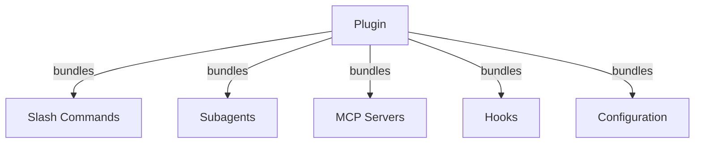
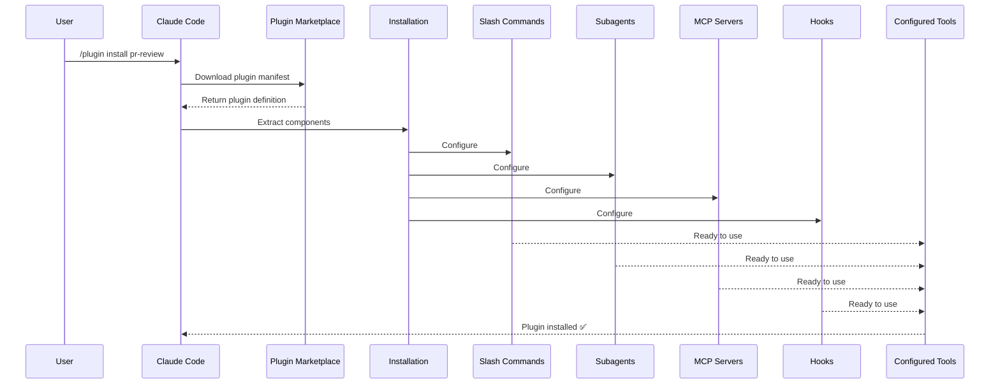
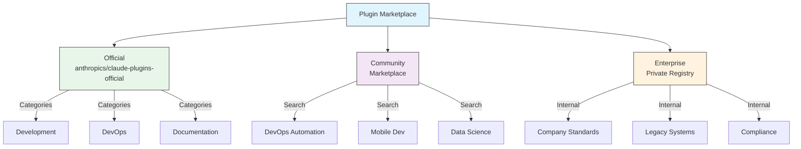
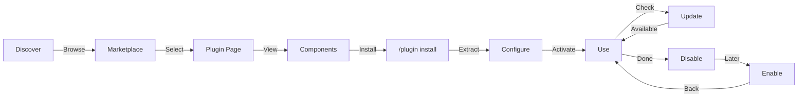
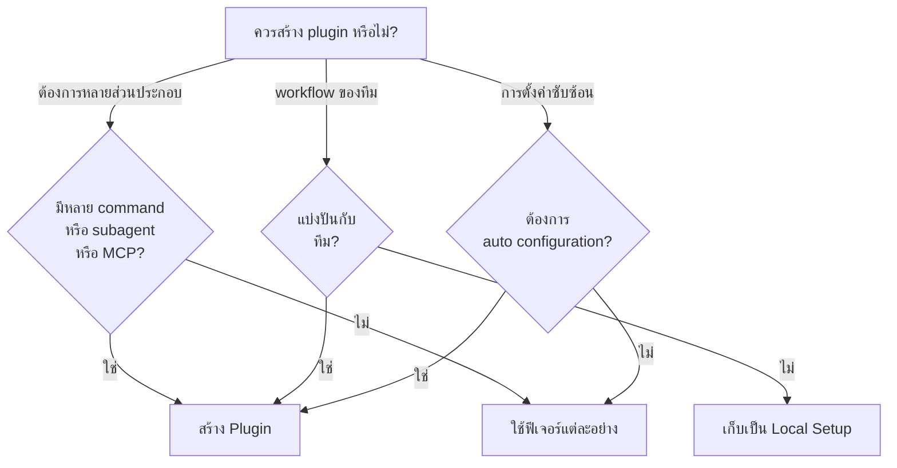

<!-- i18n-source: 07-plugins/README.md -->
<!-- i18n-date: 2026-05-09 -->
<picture>
  <source media="(prefers-color-scheme: dark)" srcset="../resources/logos/claude-howto-logo-dark.svg">
  
</picture>

# Claude Code Plugins

โฟลเดอร์นี้ประกอบด้วยตัวอย่าง plugin ที่สมบูรณ์ ซึ่งรวมฟีเจอร์ต่าง ๆ ของ Claude Code เข้าด้วยกันเป็นแพ็กเกจที่ติดตั้งได้

## ภาพรวม

Claude Code Plugins คือชุดรวมของการปรับแต่ง (slash commands, subagents, MCP servers และ hooks) ที่ติดตั้งได้ด้วยคำสั่งเดียว โดยเป็นกลไกการขยายฟังก์ชันการทำงานระดับสูงสุด ที่รวมฟีเจอร์หลายอย่างเข้าเป็นแพ็กเกจที่เชื่อมโยงกันและแบ่งปันได้

## สถาปัตยกรรม Plugin



## กระบวนการโหลด Plugin



## ประเภทและการกระจาย Plugin

| ประเภท | ขอบเขต | แบ่งปัน | ผู้ดูแล | ตัวอย่าง |
|------|-------|--------|-----------|----------|
| Official | ทั่วไป | ผู้ใช้ทุกคน | Anthropic | PR Review, Security Guidance |
| Community | สาธารณะ | ผู้ใช้ทุกคน | ชุมชน | DevOps, Data Science |
| Organization | ภายใน | สมาชิกทีม | บริษัท | มาตรฐานและเครื่องมือภายใน |
| Personal | บุคคล | ผู้ใช้คนเดียว | นักพัฒนา | workflow เฉพาะตัว |

## โครงสร้างนิยาม Plugin

Plugin manifest ใช้รูปแบบ JSON ใน `.claude-plugin/plugin.json`:

```json
{
  "name": "my-first-plugin",
  "description": "A greeting plugin",
  "version": "1.0.0",
  "author": {
    "name": "Your Name"
  },
  "homepage": "https://example.com",
  "repository": "https://github.com/user/repo",
  "license": "MIT"
}
```

## ตัวอย่างโครงสร้าง Plugin

```
my-plugin/
├── .claude-plugin/
│   └── plugin.json       # Manifest (name, description, version, author)
├── commands/             # Skills เป็นไฟล์ Markdown
│   ├── task-1.md
│   ├── task-2.md
│   └── workflows/
├── agents/               # นิยาม agent เฉพาะทาง
│   ├── specialist-1.md
│   ├── specialist-2.md
│   └── configs/
├── skills/               # Agent Skills พร้อมไฟล์ SKILL.md
│   ├── skill-1.md
│   └── skill-2.md
├── hooks/                # Event handlers ใน hooks.json
│   └── hooks.json
├── .mcp.json             # การกำหนดค่า MCP server
├── .lsp.json             # การกำหนดค่า LSP server สำหรับ code intelligence
├── bin/                  # ไฟล์ปฏิบัติการที่เพิ่มใน PATH ของ Bash tool ขณะเปิดใช้ plugin
├── settings.json         # การตั้งค่าเริ่มต้นเมื่อเปิดใช้ plugin (รองรับเฉพาะ key `agent`)
├── themes/               # ธีม Claude Code เพิ่มเติม (v2.1.118+)
├── templates/
│   └── issue-template.md
├── scripts/
│   ├── helper-1.sh
│   └── helper-2.py
├── docs/
│   ├── README.md
│   └── USAGE.md
└── tests/
    └── plugin.test.js
```

### การกำหนดค่า LSP server

Plugin สามารถรวม Language Server Protocol (LSP) เพื่อรองรับ code intelligence แบบเรียลไทม์ LSP server มอบการวินิจฉัย การนำทางโค้ด และข้อมูล symbol ขณะทำงาน

**ตำแหน่งการกำหนดค่า**:
- ไฟล์ `.lsp.json` ในไดเรกทอรีราก plugin
- key `lsp` แบบ inline ใน `plugin.json`

#### อ้างอิงฟิลด์

| ฟิลด์ | จำเป็น | คำอธิบาย |
|-------|----------|-------------|
| `command` | ใช่ | ไฟล์ไบนารี LSP server (ต้องอยู่ใน PATH) |
| `extensionToLanguage` | ใช่ | แมปนามสกุลไฟล์กับ language ID |
| `args` | ไม่ | อาร์กิวเมนต์บรรทัดคำสั่งสำหรับ server |
| `transport` | ไม่ | วิธีการสื่อสาร: `stdio` (ค่าเริ่มต้น) หรือ `socket` |
| `env` | ไม่ | ตัวแปรสภาพแวดล้อมสำหรับกระบวนการ server |
| `initializationOptions` | ไม่ | ตัวเลือกที่ส่งระหว่างการเริ่มต้น LSP |
| `settings` | ไม่ | การกำหนดค่า workspace ที่ส่งให้ server |
| `workspaceFolder` | ไม่ | กำหนดเส้นทาง workspace folder เอง |
| `startupTimeout` | ไม่ | เวลาสูงสุด (ms) รอการเริ่มต้น server |
| `shutdownTimeout` | ไม่ | เวลาสูงสุด (ms) สำหรับการปิดตัวอย่างสง่างาม |
| `restartOnCrash` | ไม่ | รีสตาร์ทอัตโนมัติหาก server หยุดทำงาน |
| `maxRestarts` | ไม่ | จำนวนครั้งสูงสุดที่รีสตาร์ทก่อนหยุด |

#### ตัวอย่างการกำหนดค่า

**Go (gopls)**:

```json
{
  "go": {
    "command": "gopls",
    "args": ["serve"],
    "extensionToLanguage": {
      ".go": "go"
    }
  }
}
```

**Python (pyright)**:

```json
{
  "python": {
    "command": "pyright-langserver",
    "args": ["--stdio"],
    "extensionToLanguage": {
      ".py": "python",
      ".pyi": "python"
    }
  }
}
```

**TypeScript**:

```json
{
  "typescript": {
    "command": "typescript-language-server",
    "args": ["--stdio"],
    "extensionToLanguage": {
      ".ts": "typescript",
      ".tsx": "typescriptreact",
      ".js": "javascript",
      ".jsx": "javascriptreact"
    }
  }
}
```

#### LSP plugins ที่มีให้ใช้งาน

marketplace อย่างเป็นทางการมี LSP plugins ที่กำหนดค่าไว้ล่วงหน้า:

| Plugin | ภาษา | Server Binary | คำสั่งติดตั้ง |
|--------|----------|---------------|----------------|
| `pyright-lsp` | Python | `pyright-langserver` | `pip install pyright` |
| `typescript-lsp` | TypeScript/JavaScript | `typescript-language-server` | `npm install -g typescript-language-server typescript` |
| `rust-lsp` | Rust | `rust-analyzer` | ติดตั้งผ่าน `rustup component add rust-analyzer` |

#### ความสามารถของ LSP

เมื่อกำหนดค่าแล้ว LSP server มอบ:

- **การวินิจฉัยทันที** — ข้อผิดพลาดและคำเตือนปรากฏทันทีหลังแก้ไข
- **การนำทางโค้ด** — ไปยังนิยาม ค้นหาการอ้างอิง และการใช้งาน
- **ข้อมูล hover** — signature ประเภทและเอกสารเมื่อวางเมาส์
- **รายการ symbol** — เรียกดู symbol ในไฟล์หรือ workspace ปัจจุบัน

## Plugin Options (v2.1.83+)

Plugin สามารถประกาศตัวเลือกที่ผู้ใช้กำหนดได้ใน manifest ผ่าน `userConfig` ค่าที่ทำเครื่องหมาย `sensitive: true` จะถูกเก็บใน system keychain แทนไฟล์การตั้งค่าข้อความธรรมดา:

```json
{
  "name": "my-plugin",
  "version": "1.0.0",
  "userConfig": {
    "apiKey": {
      "description": "API key for the service",
      "sensitive": true
    },
    "region": {
      "description": "Deployment region",
      "default": "us-east-1"
    }
  }
}
```

## ข้อมูล Plugin ถาวร (`${CLAUDE_PLUGIN_DATA}`) (v2.1.78+)

Plugin เข้าถึงไดเรกทอรีสถานะถาวรผ่านตัวแปรสภาพแวดล้อม `${CLAUDE_PLUGIN_DATA}` ไดเรกทอรีนี้ไม่ซ้ำกันต่อ plugin และคงอยู่ข้ามเซสชัน เหมาะสำหรับ cache ฐานข้อมูล และสถานะถาวรอื่น ๆ:

```json
{
  "hooks": {
    "PostToolUse": [
      {
        "command": "node ${CLAUDE_PLUGIN_DATA}/track-usage.js"
      }
    ]
  }
}
```

ไดเรกทอรีถูกสร้างอัตโนมัติเมื่อติดตั้ง plugin ไฟล์ที่เก็บที่นี่จะคงอยู่จนกว่าจะถอนการติดตั้ง plugin

### Background Monitors (v2.1.105)

Plugin สามารถลงทะเบียน background monitor ที่จะเปิดใช้งานอัตโนมัติเมื่อเซสชันเริ่มต้นหรือเมื่อ skill ของ plugin ถูกเรียกใช้ เพิ่ม key `monitors` ระดับบนสุดใน plugin manifest:

```json
{
  "name": "my-plugin",
  "version": "1.0.0",
  "monitors": [
    {
      "command": "tail -f /var/log/app.log",
      "trigger": "session_start"
    }
  ]
}
```

ฟิลด์ `trigger` รับค่า:
- `"session_start"` — เปิดใช้งาน monitor อัตโนมัติเมื่อเซสชันเริ่มต้น
- `"skill_invoke"` — เปิดใช้งาน monitor เมื่อ skill ของ plugin ถูกเรียกใช้

Monitor ใช้ Monitor tool เดิมภายใต้ตัว ส่ง stdout เป็น event ที่ Claude ตอบสนองได้

## Inline Plugin ผ่าน Settings (`source: 'settings'`) (v2.1.80+)

Plugin สามารถนิยามแบบ inline ในไฟล์ settings เป็น marketplace entry โดยใช้ฟิลด์ `source: 'settings'` วิธีนี้ช่วยฝัง plugin โดยตรงโดยไม่ต้องใช้ repository หรือ marketplace แยกต่างหาก:

```json
{
  "pluginMarketplaces": [
    {
      "name": "inline-tools",
      "source": "settings",
      "plugins": [
        {
          "name": "quick-lint",
          "source": "./local-plugins/quick-lint"
        }
      ]
    }
  ]
}
```

## Plugin Settings

Plugin สามารถจัดส่งไฟล์ `settings.json` เพื่อกำหนดค่าเริ่มต้น ปัจจุบันรองรับ key `agent` ซึ่งกำหนด agent หลักสำหรับ plugin:

```json
{
  "agent": "agents/specialist-1.md"
}
```

เมื่อ plugin รวม `settings.json` ค่าเริ่มต้นจะถูกนำไปใช้เมื่อติดตั้ง ผู้ใช้สามารถแทนที่การตั้งค่าเหล่านี้ในการกำหนดค่าระดับโปรเจกต์หรือระดับผู้ใช้

## แนวทางแบบ Standalone เทียบกับ Plugin

| แนวทาง | ชื่อคำสั่ง | การกำหนดค่า | เหมาะสำหรับ |
|----------|---------------|---|---|
| **Standalone** | `/hello` | ตั้งค่าเองใน CLAUDE.md | ส่วนตัว เฉพาะโปรเจกต์ |
| **Plugins** | `/plugin-name:hello` | อัตโนมัติผ่าน plugin.json | การแบ่งปัน การกระจาย การใช้งานในทีม |

ใช้ **standalone slash commands** สำหรับ workflow ส่วนตัวที่รวดเร็ว ใช้ **plugins** เมื่อต้องการรวมฟีเจอร์หลายอย่าง แบ่งปันกับทีม หรือเผยแพร่เพื่อกระจาย

## ตัวอย่างเชิงปฏิบัติ

### ตัวอย่างที่ 1: PR Review Plugin

**ไฟล์:** `.claude-plugin/plugin.json`

```json
{
  "name": "pr-review",
  "version": "1.0.0",
  "description": "Complete PR review workflow with security, testing, and docs",
  "author": {
    "name": "Anthropic"
  },
  "repository": "https://github.com/your-org/pr-review",
  "license": "MIT"
}
```

**ไฟล์:** `commands/review-pr.md`

```markdown
---
name: Review PR
description: Start comprehensive PR review with security and testing checks
---

# PR Review

คำสั่งนี้เริ่มต้นการตรวจสอบ pull request แบบครบวงจร รวมถึง:

1. การวิเคราะห์ความปลอดภัย
2. การตรวจสอบความครอบคลุมของการทดสอบ
3. การอัปเดตเอกสาร
4. การตรวจสอบคุณภาพโค้ด
5. การประเมินผลกระทบด้านประสิทธิภาพ
```

**ไฟล์:** `agents/security-reviewer.md`

```yaml
---
name: security-reviewer
description: Security-focused code review
tools: read, grep, diff
---

# Security Reviewer

เชี่ยวชาญในการค้นหาช่องโหว่ด้านความปลอดภัย:
- ปัญหา authentication/authorization
- การเปิดเผยข้อมูล
- การโจมตีแบบ injection
- การกำหนดค่าที่ปลอดภัย
```

**การติดตั้ง:**

```bash
/plugin install pr-review

# ผลลัพธ์:
# ✅ 3 slash commands ติดตั้งแล้ว
# ✅ 3 subagents กำหนดค่าแล้ว
# ✅ 2 MCP servers เชื่อมต่อแล้ว
# ✅ 4 hooks ลงทะเบียนแล้ว
# ✅ พร้อมใช้งาน!
```

### ตัวอย่างที่ 2: DevOps Plugin

**ส่วนประกอบ:**

```
devops-automation/
├── commands/
│   ├── deploy.md
│   ├── rollback.md
│   ├── status.md
│   └── incident.md
├── agents/
│   ├── deployment-specialist.md
│   ├── incident-commander.md
│   └── alert-analyzer.md
├── mcp/
│   ├── github-config.json
│   ├── kubernetes-config.json
│   └── prometheus-config.json
├── hooks/
│   ├── pre-deploy.js
│   ├── post-deploy.js
│   └── on-error.js
└── scripts/
    ├── deploy.sh
    ├── rollback.sh
    └── health-check.sh
```

### ตัวอย่างที่ 3: Documentation Plugin

**ส่วนประกอบที่รวมไว้:**

```
documentation/
├── commands/
│   ├── generate-api-docs.md
│   ├── generate-readme.md
│   ├── sync-docs.md
│   └── validate-docs.md
├── agents/
│   ├── api-documenter.md
│   ├── code-commentator.md
│   └── example-generator.md
├── mcp/
│   ├── github-docs-config.json
│   └── slack-announce-config.json
└── templates/
    ├── api-endpoint.md
    ├── function-docs.md
    └── adr-template.md
```

## Plugin Marketplace

ไดเรกทอรี plugin ที่ Anthropic บริหารอย่างเป็นทางการคือ `anthropics/claude-plugins-official` ผู้ดูแลระบบองค์กรสามารถสร้าง plugin marketplace ส่วนตัวสำหรับการกระจายภายในได้



### การกำหนดค่า Marketplace

ผู้ใช้องค์กรและผู้ใช้ขั้นสูงสามารถควบคุมพฤติกรรม marketplace ผ่านการตั้งค่า:

| การตั้งค่า | คำอธิบาย |
|---------|-------------|
| `extraKnownMarketplaces` | เพิ่มแหล่ง marketplace เพิ่มเติมนอกเหนือจากค่าเริ่มต้น |
| `strictKnownMarketplaces` | ควบคุม marketplace ที่ผู้ใช้อนุญาตให้เพิ่มได้ (เฉพาะ managed) |
| `blockedMarketplaces` | รายการ marketplace ที่ผู้ดูแลระบบบล็อก (รองรับ regex `hostPattern` / `pathPattern` ตั้งแต่ v2.1.119) |
| `deniedPlugins` | รายการ plugin ที่ผู้ดูแลระบบบล็อก ป้องกันการติดตั้ง plugin เฉพาะ |

> **การบังคับใช้** (v2.1.117+): `blockedMarketplaces` และ `strictKnownMarketplaces` ถูกบังคับใช้ในทุก event ของวงจรชีวิต plugin — ติดตั้ง อัปเดต รีเฟรช และ autoupdate — ไม่ใช่แค่ตอนเพิ่มครั้งแรก `strictKnownMarketplaces` เป็นแบบ managed-only

ตัวอย่าง `blockedMarketplaces` พร้อม regex host/path (v2.1.119):

```json
{
  "blockedMarketplaces": [
    {
      "hostPattern": "^evil\\.example\\.com$",
      "pathPattern": "^/marketplaces/.*"
    }
  ]
}
```

### ฟีเจอร์ Marketplace เพิ่มเติม

- **git timeout เริ่มต้น**: เพิ่มจาก 30 วินาทีเป็น 120 วินาทีสำหรับ plugin repository ขนาดใหญ่
- **npm registry เฉพาะ**: Plugin สามารถระบุ npm registry URL เฉพาะสำหรับการแก้ไข dependency
- **Version pinning**: ล็อก plugin ไว้ที่เวอร์ชันเฉพาะสำหรับสภาพแวดล้อมที่ทำซ้ำได้

### schema นิยาม Marketplace

Plugin marketplace นิยามใน `.claude-plugin/marketplace.json`:

```json
{
  "name": "my-team-plugins",
  "owner": "my-org",
  "plugins": [
    {
      "name": "code-standards",
      "source": "./plugins/code-standards",
      "description": "Enforce team coding standards",
      "version": "1.2.0",
      "author": "platform-team"
    },
    {
      "name": "deploy-helper",
      "source": {
        "source": "github",
        "repo": "my-org/deploy-helper",
        "ref": "v2.0.0"
      },
      "description": "Deployment automation workflows"
    }
  ]
}
```

| ฟิลด์ | จำเป็น | คำอธิบาย |
|-------|----------|-------------|
| `name` | ใช่ | ชื่อ marketplace ในรูปแบบ kebab-case |
| `owner` | ใช่ | องค์กรหรือผู้ใช้ที่ดูแล marketplace |
| `plugins` | ใช่ | อาร์เรย์ของ plugin entry |
| `plugins[].name` | ใช่ | ชื่อ plugin (kebab-case) |
| `plugins[].source` | ใช่ | แหล่งที่มา plugin (string path หรือ source object) |
| `plugins[].description` | ไม่ | คำอธิบาย plugin สั้น ๆ |
| `plugins[].version` | ไม่ | string เวอร์ชัน semantic |
| `plugins[].author` | ไม่ | ชื่อผู้เขียน plugin |

### ประเภทแหล่งที่มา Plugin

Plugin สามารถมาจากหลายแหล่ง:

| แหล่งที่มา | ไวยากรณ์ | ตัวอย่าง |
|--------|--------|---------|
| **Relative path** | String path | `"./plugins/my-plugin"` |
| **GitHub** | `{ "source": "github", "repo": "owner/repo" }` | `{ "source": "github", "repo": "acme/lint-plugin", "ref": "v1.0" }` |
| **Git URL** | `{ "source": "url", "url": "..." }` | `{ "source": "url", "url": "https://git.internal/plugin.git" }` |
| **Git subdirectory** | `{ "source": "git-subdir", "url": "...", "path": "..." }` | `{ "source": "git-subdir", "url": "https://github.com/org/monorepo.git", "path": "packages/plugin" }` |
| **npm** | `{ "source": "npm", "package": "..." }` | `{ "source": "npm", "package": "@acme/claude-plugin", "version": "^2.0" }` |
| **pip** | `{ "source": "pip", "package": "..." }` | `{ "source": "pip", "package": "claude-data-plugin", "version": ">=1.0" }` |

แหล่ง GitHub และ git รองรับฟิลด์ `ref` (branch/tag) และ `sha` (commit hash) เพิ่มเติมสำหรับ version pinning

### วิธีการกระจาย

**GitHub (แนะนำ)**:
```bash
# ผู้ใช้เพิ่ม marketplace ของคุณ
/plugin marketplace add owner/repo-name
```

**บริการ git อื่น ๆ** (ต้องใช้ URL เต็ม):
```bash
/plugin marketplace add https://gitlab.com/org/marketplace-repo.git
```

**Repository ส่วนตัว**: รองรับผ่าน git credential helpers หรือ environment token ผู้ใช้ต้องมีสิทธิ์อ่าน repository

**การส่ง marketplace อย่างเป็นทางการ**: ส่ง plugin ไปยัง marketplace ที่ Anthropic ดูแลเพื่อการกระจายที่กว้างขึ้นผ่าน [claude.ai/settings/plugins/submit](https://claude.ai/settings/plugins/submit) หรือ [platform.claude.com/plugins/submit](https://platform.claude.com/plugins/submit)

### การจัดการ Marketplace

```bash
# คำสั่ง CLI ของ marketplace
claude plugin marketplace add <source>       # เพิ่ม marketplace (GitHub, URL, local)
claude plugin marketplace update [name]      # รีเฟรช catalog index
claude plugin marketplace remove <name>      # ลบ marketplace
claude plugin marketplace list               # แสดงรายการ marketplace ที่กำหนดค่าไว้
```

> **สำคัญ**: `marketplace update` รีเฟรชเฉพาะ plugin catalog (สิ่งที่ติดตั้งได้) ไม่อัปเดต plugin ที่ติดตั้งแล้ว ใช้ `plugin update <name>` เพื่ออัปเดต plugin ที่ติดตั้งไว้เฉพาะตัว

### Strict mode

ควบคุมวิธีที่นิยาม marketplace โต้ตอบกับไฟล์ `plugin.json` ในเครื่อง:

| การตั้งค่า | พฤติกรรม |
|---------|----------|
| `strict: true` (ค่าเริ่มต้น) | `plugin.json` ในเครื่องเป็นหลัก marketplace entry เป็นส่วนเสริม |
| `strict: false` | marketplace entry คือนิยาม plugin ทั้งหมด |

**ข้อจำกัดองค์กร** ด้วย `strictKnownMarketplaces`:

| ค่า | ผล |
|-------|--------|
| ไม่ตั้งค่า | ไม่มีข้อจำกัด — ผู้ใช้เพิ่ม marketplace ใดก็ได้ |
| อาร์เรย์ว่าง `[]` | ล็อกดาวน์ — ไม่อนุญาต marketplace ใด ๆ |
| อาร์เรย์ของ pattern | Allowlist — เฉพาะ marketplace ที่ตรงกันเท่านั้นที่เพิ่มได้ |

```json
{
  "strictKnownMarketplaces": [
    "my-org/*",
    "github.com/trusted-vendor/*"
  ]
}
```

> **คำเตือน**: ใน strict mode พร้อม `strictKnownMarketplaces` ผู้ใช้ติดตั้งได้เฉพาะ plugin จาก marketplace ที่อยู่ใน allowlist เหมาะสำหรับสภาพแวดล้อมองค์กรที่ต้องการการกระจาย plugin ที่ควบคุม

## การติดตั้งและวงจรชีวิต Plugin



## การเปรียบเทียบฟีเจอร์ Plugin

| ฟีเจอร์ | Slash Command | Skill | Subagent | Plugin |
|---------|---------------|-------|----------|--------|
| **การติดตั้ง** | คัดลอกด้วยตนเอง | คัดลอกด้วยตนเอง | กำหนดค่าด้วยตนเอง | คำสั่งเดียว |
| **เวลาตั้งค่า** | 5 นาที | 10 นาที | 15 นาที | 2 นาที |
| **การรวม** | ไฟล์เดียว | ไฟล์เดียว | ไฟล์เดียว | หลายไฟล์ |
| **การกำหนดเวอร์ชัน** | ด้วยตนเอง | ด้วยตนเอง | ด้วยตนเอง | อัตโนมัติ |
| **แบ่งปันในทีม** | คัดลอกไฟล์ | คัดลอกไฟล์ | คัดลอกไฟล์ | Install ID |
| **การอัปเดต** | ด้วยตนเอง | ด้วยตนเอง | ด้วยตนเอง | พร้อมอัตโนมัติ |
| **Dependencies** | ไม่มี | ไม่มี | ไม่มี | อาจมี |
| **Marketplace** | ไม่ | ไม่ | ไม่ | ใช่ |
| **การกระจาย** | Repository | Repository | Repository | Marketplace |

## คำสั่ง CLI ของ Plugin

การดำเนินการ plugin ทั้งหมดพร้อมใช้งานเป็นคำสั่ง CLI:

```bash
claude plugin install <name>@<marketplace>   # ติดตั้งจาก marketplace
claude plugin uninstall <name>               # ลบ plugin
claude plugin update <name>                  # อัปเดต plugin ที่ติดตั้งเป็นเวอร์ชันล่าสุด
claude plugin list                           # แสดงรายการ plugin ที่ติดตั้ง
claude plugin enable <name>                  # เปิดใช้งาน plugin ที่ปิดอยู่
claude plugin disable <name>                 # ปิดใช้งาน plugin
claude plugin validate                       # ตรวจสอบโครงสร้าง plugin
claude plugin tag <version>                  # สร้าง git tag รุ่นพร้อมตรวจสอบเวอร์ชัน (v2.1.118+)
claude plugin prune                          # ลบ plugin dependency ที่ติดตั้งอัตโนมัติแต่ไม่ใช้แล้ว (v2.1.121+)
claude plugin uninstall <name> --prune       # ถอนการติดตั้งและล้าง dependency ที่ไม่ใช้แล้ว (v2.1.121+)
```

ตัวอย่าง: `claude plugin tag v0.3.0` ตรวจสอบรูปแบบเวอร์ชัน สร้าง git tag ที่ตรงกัน และเป็นวิธีที่แนะนำในการสร้าง release ของ plugin เพื่อการกระจาย

`claude plugin prune` มีประโยชน์หลังจากติดตั้งหรือถอนการติดตั้ง marketplace plugin ที่ดึง dependency มา — ลบ plugin ที่ติดตั้งอัตโนมัติซึ่ง parent plugin ถูกลบออกแล้ว `plugin uninstall --prune` ทำแบบเดียวกันในขั้นตอนเดียว

## วิธีการติดตั้ง

### จาก Marketplace
```bash
/plugin install plugin-name
# หรือจาก CLI:
claude plugin install plugin-name@marketplace-name
```

### เปิด / ปิดใช้งาน (พร้อม scope ที่ตรวจจับอัตโนมัติ)
```bash
/plugin enable plugin-name
/plugin disable plugin-name
```

### Plugin ในเครื่อง (สำหรับการพัฒนา)
```bash
# CLI flag สำหรับทดสอบในเครื่อง (ทำซ้ำได้สำหรับหลาย plugin)
claude --plugin-dir ./path/to/plugin
claude --plugin-dir ./plugin-a --plugin-dir ./plugin-b

# --plugin-dir ยังรับ .zip archive path (v2.1.128+)
claude --plugin-dir ./my-plugin.zip

# ดึง plugin .zip archive จาก URL สำหรับเซสชันปัจจุบัน (v2.1.129+, ทำซ้ำได้)
claude --plugin-url https://example.com/releases/my-plugin-0.3.0.zip
```

### จาก Git Repository
```bash
/plugin install github:username/repo
```

## Auto-Update

Claude Code อัปเดต marketplace และ plugin ที่ติดตั้งได้อัตโนมัติเมื่อเริ่มต้น

| ประเภท Marketplace | ค่าเริ่มต้น Auto-Update | วิธีเปลี่ยน |
|------------------|---------------------|---------------|
| Official (`claude-plugins-official`) | เปิดใช้งาน | `/plugin` → Marketplaces → Select |
| Third-party / Local | ปิดใช้งาน | เส้นทาง UI เดียวกัน |

เมื่อ auto-update ทำงาน Claude Code:
1. รีเฟรช marketplace catalog
2. อัปเดต plugin ที่ติดตั้งเป็นเวอร์ชันล่าสุด
3. แสดงการแจ้งเตือนให้รัน `/reload-plugins`

### ตัวแปรสภาพแวดล้อม

| ตัวแปร | ผล |
|----------|--------|
| `DISABLE_AUTOUPDATER=1` | ปิด auto-update ทั้งหมด (Claude Code + plugins) |
| `DISABLE_AUTOUPDATER=1` + `FORCE_AUTOUPDATE_PLUGINS=1` | คง plugin update ไว้ ปิด Claude Code update |

```bash
# ปิด auto-update ทั้งหมด
export DISABLE_AUTOUPDATER=1

# คง plugin auto-update เท่านั้น
export DISABLE_AUTOUPDATER=1
export FORCE_AUTOUPDATE_PLUGINS=1
```

## เมื่อใดควรสร้าง Plugin



### กรณีการใช้งาน Plugin

| กรณีการใช้งาน | คำแนะนำ | เหตุผล |
|----------|-----------------|-----|
| **การ Onboarding ทีม** | ใช้ Plugin | ตั้งค่าทันที ครบทุกการกำหนดค่า |
| **การตั้งค่า Framework** | ใช้ Plugin | รวม command เฉพาะ framework |
| **มาตรฐานองค์กร** | ใช้ Plugin | การกระจายแบบรวมศูนย์ การควบคุมเวอร์ชัน |
| **การ Automate งานด่วน** | ใช้ Command | ซับซ้อนเกินไป |
| **ความเชี่ยวชาญเฉพาะโดเมน** | ใช้ Skill | หนักเกินไป ควรใช้ skill แทน |
| **การวิเคราะห์เฉพาะทาง** | ใช้ Subagent | สร้างด้วยตนเองหรือใช้ skill |
| **การเข้าถึงข้อมูลสด** | ใช้ MCP | แบบ standalone ไม่ควรรวมใน bundle |

## การทดสอบ Plugin

ก่อนเผยแพร่ ทดสอบ plugin ในเครื่องโดยใช้ `--plugin-dir` CLI flag (ทำซ้ำได้สำหรับหลาย plugin):

```bash
claude --plugin-dir ./my-plugin
claude --plugin-dir ./my-plugin --plugin-dir ./another-plugin

# --plugin-dir รับ .zip archive ได้นอกจาก directory (v2.1.128+)
claude --plugin-dir ./my-plugin.zip

# --plugin-url ดึง plugin .zip จาก URL สำหรับเซสชันนี้ (v2.1.129+, ทำซ้ำได้)
claude --plugin-url https://example.com/releases/my-plugin-0.3.0.zip
```

วิธีนี้เปิด Claude Code พร้อม plugin ที่โหลดไว้ ช่วยให้:
- ตรวจสอบว่า slash commands ทั้งหมดพร้อมใช้งาน
- ทดสอบ subagent และ agent ทำงานถูกต้อง
- ยืนยัน MCP server เชื่อมต่อถูกต้อง
- ตรวจสอบการทำงานของ hook
- ตรวจสอบการกำหนดค่า LSP server
- ตรวจสอบข้อผิดพลาดการกำหนดค่า

## Hot-Reload

Plugin รองรับ hot-reload ระหว่างการพัฒนา เมื่อแก้ไขไฟล์ plugin Claude Code ตรวจจับการเปลี่ยนแปลงอัตโนมัติ คุณสามารถบังคับ reload ด้วย:

```bash
/reload-plugins
```

คำสั่งนี้อ่าน plugin manifest คำสั่ง agent skill hook และการกำหนดค่า MCP/LSP ใหม่ทั้งหมดโดยไม่ต้องรีสตาร์ทเซสชัน

## Managed Settings สำหรับ Plugin

ผู้ดูแลระบบควบคุมพฤติกรรม plugin ทั่วทั้งองค์กรโดยใช้ managed settings:

| การตั้งค่า | คำอธิบาย |
|---------|-------------|
| `enabledPlugins` | Allowlist ของ plugin ที่เปิดใช้งานเป็นค่าเริ่มต้น |
| `deniedPlugins` | Blocklist ของ plugin ที่ไม่อนุญาตให้ติดตั้ง |
| `extraKnownMarketplaces` | เพิ่มแหล่ง marketplace เพิ่มเติม |
| `strictKnownMarketplaces` | จำกัด marketplace ที่ผู้ใช้เพิ่มได้ (managed-only บังคับใช้ทุก event ตั้งแต่ v2.1.117) |
| `blockedMarketplaces` | Blocklist ของ marketplace บังคับใช้ทุก event ตั้งแต่ v2.1.117 รองรับ regex ตั้งแต่ v2.1.119 |
| `allowedChannelPlugins` | ควบคุม plugin ที่อนุญาตต่อ release channel |

การตั้งค่าเหล่านี้ใช้ได้ในระดับองค์กรผ่านไฟล์การกำหนดค่า managed และมีความสำคัญเหนือการตั้งค่าระดับผู้ใช้

## ความปลอดภัยของ Plugin

Plugin subagent ทำงานในสภาพแวดล้อม sandbox ที่จำกัด key frontmatter ต่อไปนี้ **ไม่อนุญาต** ในนิยาม plugin subagent:

- `hooks` — Subagent ไม่สามารถลงทะเบียน event handler
- `mcpServers` — Subagent ไม่สามารถกำหนดค่า MCP server
- `permissionMode` — Subagent ไม่สามารถแทนที่ permission model

ซึ่งรับรองว่า plugin ไม่สามารถยกระดับสิทธิ์หรือแก้ไขสภาพแวดล้อมหลักเกินขอบเขตที่ประกาศไว้

## การเผยแพร่ Plugin

**ขั้นตอนการเผยแพร่:**

1. สร้างโครงสร้าง plugin พร้อมส่วนประกอบทั้งหมด
2. เขียน `.claude-plugin/plugin.json` manifest
3. สร้าง `README.md` พร้อมเอกสาร
4. ทดสอบในเครื่องด้วย `claude --plugin-dir ./my-plugin`
5. Tag รุ่นด้วย `claude plugin tag v0.3.0` (v2.1.118+) — ตรวจสอบ string เวอร์ชันและสร้าง git tag ที่ตรงกัน
6. ส่ง plugin ไปยัง marketplace
7. รับการตรวจสอบและอนุมัติ
8. เผยแพร่บน marketplace
9. ผู้ใช้ติดตั้งด้วยคำสั่งเดียว

**ตัวอย่างการส่ง:**

```markdown
# PR Review Plugin

## คำอธิบาย
workflow การตรวจสอบ PR แบบครบวงจร พร้อมการตรวจสอบความปลอดภัย การทดสอบ และเอกสาร

## สิ่งที่รวมอยู่
- 3 slash commands สำหรับการตรวจสอบประเภทต่าง ๆ
- 3 subagent เฉพาะทาง
- GitHub และ CodeQL MCP integration
- hook สำหรับการสแกนความปลอดภัยอัตโนมัติ

## การติดตั้ง
\`\`\`bash
/plugin install pr-review
\`\`\`

## ฟีเจอร์
✅ การวิเคราะห์ความปลอดภัย
✅ การตรวจสอบความครอบคลุมของการทดสอบ
✅ การตรวจสอบเอกสาร
✅ การประเมินคุณภาพโค้ด
✅ การวิเคราะห์ผลกระทบด้านประสิทธิภาพ

## การใช้งาน
\`\`\`bash
/review-pr
/check-security
/check-tests
\`\`\`

## ข้อกำหนด
- Claude Code 1.0+
- GitHub access
- CodeQL (optional)
```

## Plugin เทียบกับการกำหนดค่าด้วยตนเอง

**การตั้งค่าด้วยตนเอง (2+ ชั่วโมง):**
- ติดตั้ง slash command ทีละตัว
- สร้าง subagent แยกกัน
- กำหนดค่า MCP แยกต่างหาก
- ตั้งค่า hook ด้วยตนเอง
- จัดทำเอกสารทุกอย่าง
- แบ่งปันกับทีม (หวังว่าจะกำหนดค่าถูกต้อง)

**ด้วย Plugin (2 นาที):**
```bash
/plugin install pr-review
# ✅ ทุกอย่างติดตั้งและกำหนดค่าแล้ว
# ✅ พร้อมใช้งานทันที
# ✅ ทีมทำซ้ำการตั้งค่าเดิมได้
```

## แนวทางปฏิบัติที่ดีที่สุด

### สิ่งที่ควรทำ
- ใช้ชื่อ plugin ที่ชัดเจนและสื่อความหมาย
- รวม README ที่ครบถ้วน
- กำหนดเวอร์ชัน plugin อย่างถูกต้อง (semver)
- ทดสอบส่วนประกอบทั้งหมดร่วมกัน
- จัดทำเอกสารข้อกำหนดอย่างชัดเจน
- ให้ตัวอย่างการใช้งาน
- รวมการจัดการข้อผิดพลาด
- Tag อย่างเหมาะสมเพื่อการค้นพบ
- รักษา backward compatibility
- ทำให้ plugin มุ่งเน้นและเชื่อมโยงกัน
- รวมการทดสอบที่ครบถ้วน
- จัดทำเอกสาร dependency ทั้งหมด

### สิ่งที่ไม่ควรทำ
- ไม่รวมฟีเจอร์ที่ไม่เกี่ยวข้องกัน
- ไม่ hardcode ข้อมูลรับรอง
- ไม่ข้ามการทดสอบ
- ไม่ลืมเอกสาร
- ไม่สร้าง plugin ที่ซ้ำกัน
- ไม่ละเลยการกำหนดเวอร์ชัน
- ไม่ทำให้ dependency ระหว่างส่วนประกอบซับซ้อนเกินไป
- ไม่ลืมจัดการข้อผิดพลาดอย่างสง่างาม

## คำแนะนำการติดตั้ง

### การติดตั้งจาก Marketplace

1. **เรียกดู plugin ที่มีให้:**
   ```bash
   /plugin list
   ```

2. **ดูรายละเอียด plugin:**
   ```bash
   /plugin info plugin-name
   ```

3. **ติดตั้ง plugin:**
   ```bash
   /plugin install plugin-name
   ```

### การติดตั้งจาก Local Path

```bash
/plugin install ./path/to/plugin-directory
```

### การติดตั้งจาก GitHub

```bash
/plugin install github:username/repo
```

### แสดงรายการ Plugin ที่ติดตั้ง

```bash
/plugin list --installed
```

### การอัปเดต Plugin

```bash
/plugin update plugin-name
```

### การปิด/เปิดใช้งาน Plugin

```bash
# ปิดชั่วคราว
/plugin disable plugin-name

# เปิดใช้งานอีกครั้ง
/plugin enable plugin-name
```

### การถอนการติดตั้ง Plugin

```bash
/plugin uninstall plugin-name
```

## แนวคิดที่เกี่ยวข้อง

ฟีเจอร์ Claude Code ต่อไปนี้ทำงานร่วมกับ plugin:

- **[Slash Commands](../01-slash-commands/)** - คำสั่งแต่ละอย่างที่รวมใน plugin
- **[Memory](../02-memory/)** - บริบทถาวรสำหรับ plugin
- **[Skills](../03-skills/)** - ความเชี่ยวชาญเฉพาะโดเมนที่ห่อหุ้มใน plugin
- **[Subagents](../04-subagents/)** - agent เฉพาะทางที่รวมเป็นส่วนประกอบ plugin
- **[MCP Servers](../05-mcp/)** - MCP integrations ที่รวมใน plugin
- **[Hooks](../06-hooks/)** - Event handler ที่ trigger workflow ของ plugin

## ตัวอย่าง Workflow ที่สมบูรณ์

### PR Review Plugin Full Workflow

```
1. ผู้ใช้: /review-pr

2. Plugin ดำเนินการ:
   ├── hook pre-review.js ตรวจสอบ git repo
   ├── GitHub MCP ดึงข้อมูล PR
   ├── subagent security-reviewer วิเคราะห์ความปลอดภัย
   ├── subagent test-checker ตรวจสอบความครอบคลุม
   └── subagent performance-analyzer ตรวจสอบประสิทธิภาพ

3. ผลลัพธ์สังเคราะห์และนำเสนอ:
   ✅ ความปลอดภัย: ไม่พบปัญหาวิกฤต
   ⚠️  การทดสอบ: ความครอบคลุม 65% (แนะนำ 80%+)
   ✅ ประสิทธิภาพ: ไม่มีผลกระทบที่มีนัยสำคัญ
   📝 ให้คำแนะนำ 12 รายการ
```

## การแก้ปัญหา

### Plugin ติดตั้งไม่ได้
- ตรวจสอบ compatibility เวอร์ชัน Claude Code: `/version`
- ตรวจสอบไวยากรณ์ `plugin.json` ด้วย JSON validator
- ตรวจสอบการเชื่อมต่ออินเทอร์เน็ต (สำหรับ plugin ระยะไกล)
- ตรวจสอบสิทธิ์: `ls -la plugin/`

### ส่วนประกอบไม่โหลด
- ตรวจสอบว่า path ใน `plugin.json` ตรงกับโครงสร้างไดเรกทอรีจริง
- ตรวจสอบสิทธิ์ไฟล์: `chmod +x scripts/`
- ตรวจสอบไวยากรณ์ไฟล์ส่วนประกอบ
- ตรวจสอบ log: `/plugin debug plugin-name`

### MCP Connection ล้มเหลว
- ตรวจสอบตัวแปรสภาพแวดล้อมที่ตั้งค่าถูกต้อง
- ตรวจสอบการติดตั้งและสุขภาพ MCP server
- ทดสอบ MCP connection อิสระด้วย `/mcp test`
- ตรวจสอบการกำหนดค่า MCP ในไดเรกทอรี `mcp/`

### คำสั่งไม่พร้อมใช้งานหลังติดตั้ง
- ตรวจสอบว่า plugin ติดตั้งสำเร็จ: `/plugin list --installed`
- ตรวจสอบว่า plugin เปิดใช้งาน: `/plugin status plugin-name`
- รีสตาร์ท Claude Code: `exit` และเปิดใหม่
- ตรวจสอบการตั้งชื่อที่ขัดแย้งกับคำสั่งที่มีอยู่

### ปัญหาการทำงานของ Hook
- ตรวจสอบว่าไฟล์ hook มีสิทธิ์ถูกต้อง
- ตรวจสอบไวยากรณ์ hook และชื่อ event
- ตรวจสอบ hook log เพื่อดูรายละเอียดข้อผิดพลาด
- ทดสอบ hook ด้วยตนเองหากเป็นไปได้

## แหล่งข้อมูลเพิ่มเติม

- [Official Plugins Documentation](https://code.claude.com/docs/en/plugins)
- [Discover Plugins](https://code.claude.com/docs/en/discover-plugins)
- [Plugin Marketplaces](https://code.claude.com/docs/en/plugin-marketplaces)
- [Plugins Reference](https://code.claude.com/docs/en/plugins-reference)
- [MCP Server Reference](https://modelcontextprotocol.io/)
- [Subagent Configuration Guide](../04-subagents/README.md)
- [Hook System Reference](../06-hooks/README.md)

---

**อัปเดตล่าสุด**: 6 พฤษภาคม 2026
**Claude Code Version**: 2.1.131
**แหล่งที่มา**:
- https://code.claude.com/docs/en/plugins
- https://code.claude.com/docs/en/plugin-marketplaces
- https://github.com/anthropics/claude-code/releases/tag/v2.1.117
- https://github.com/anthropics/claude-code/releases/tag/v2.1.118
- https://github.com/anthropics/claude-code/releases/tag/v2.1.131
**Compatible Models**: Claude Sonnet 4.6, Claude Opus 4.7, Claude Haiku 4.5
