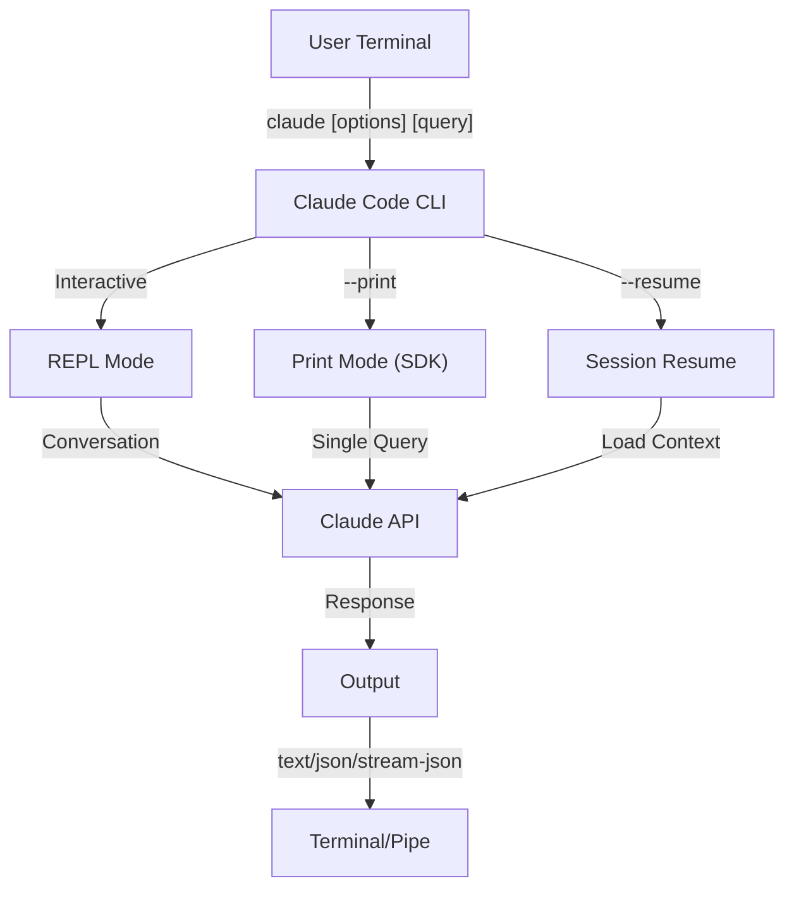
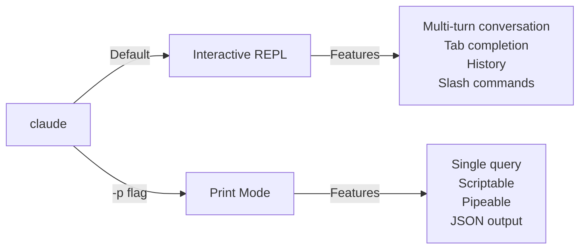

<!-- i18n-source: 10-cli/README.md -->
<!-- i18n-date: 2026-05-09 -->
<picture>
  <source media="(prefers-color-scheme: dark)" srcset="../resources/logos/claude-howto-logo-dark.svg">
  
</picture>

# CLI Reference

## ภาพรวม

Claude Code CLI (Command Line Interface) เป็นวิธีหลักในการ interact กับ Claude Code ให้ option ที่ทรงพลังสำหรับการรัน query การจัดการ session การกำหนดค่า model และการรวม Claude เข้าใน development workflow ของคุณ

## สถาปัตยกรรม



## Runtime & Packaging

ตั้งแต่ **v2.1.113** Claude Code CLI เปิด **native per-platform binary** (macOS, Linux, Windows) ผ่าน optional npm dependency binary ถูก match กับ OS และ architecture ของคุณเมื่อ install

**การ install สำหรับผู้ใช้ยังคงเดิม**: `npm install -g @anthropic-ai/claude-code` ยังทำงานได้และยังเป็น path ที่แนะนำ

> **ผู้ใช้ Corporate/proxy**: หากเครือข่ายของคุณต้องการ allowlist อย่างชัดเจน ให้เพิ่ม `downloads.claude.ai` (และ `https://downloads.claude.ai/claude-code-releases`) ไปยัง proxy egress rules

## CLI Commands

| Command | คำอธิบาย | ตัวอย่าง |
|---------|-------------|---------|
| `claude` | เริ่ม interactive REPL | `claude` |
| `claude "query"` | เริ่ม REPL พร้อม prompt เริ่มต้น | `claude "explain this project"` |
| `claude -p "query"` | Print mode — query แล้วออก | `claude -p "explain this function"` |
| `cat file \| claude -p "query"` | ประมวลผลเนื้อหาที่ pipe | `cat logs.txt \| claude -p "explain"` |
| `claude -c` | ต่อ conversation ล่าสุด | `claude -c` |
| `claude -r "<session>" "query"` | Resume session ตาม ID หรือชื่อ | `claude -r "auth-refactor" "finish this PR"` |
| `claude update` | อัปเดตเป็นเวอร์ชันล่าสุด | `claude update` |
| `/doctor` (slash command) | วินิจฉัย installation, config และสุขภาพ plugin | รัน `/doctor` ใน REPL |
| `claude mcp` | กำหนดค่า MCP server | ดู [MCP documentation](../05-mcp/) |
| `claude agents` | แสดง subagent ที่กำหนดค่าทั้งหมด | `claude agents` |
| `claude auto-mode defaults` | แสดง auto mode default rule เป็น JSON | `claude auto-mode defaults` |
| `claude remote-control` | เริ่ม Remote Control server | `claude remote-control` |
| `claude plugin` | จัดการ plugin (install, enable, disable) | `claude plugin install my-plugin` |
| `claude install [version]` | Install native-binary version เฉพาะ | `claude install 2.1.131` |
| `claude project purge [path]` | ลบ Claude Code state ทั้งหมดสำหรับโครงการ | `claude project purge ~/work/repo --dry-run` |
| `claude auth login` | เข้าสู่ระบบ | `claude auth login --email user@example.com` |
| `claude auth logout` | ออกจากระบบ account ปัจจุบัน | `claude auth logout` |
| `claude auth status` | ตรวจสอบสถานะ auth | `claude auth status` |

## Core Flags

| Flag | คำอธิบาย | ตัวอย่าง |
|------|-------------|---------|
| `-p, --print` | แสดงผลลัพธ์โดยไม่มี interactive mode | `claude -p "query"` |
| `-c, --continue` | โหลด conversation ล่าสุด | `claude --continue` |
| `-r, --resume` | Resume session เฉพาะตาม ID หรือชื่อ | `claude --resume auth-refactor` |
| `-v, --version` | แสดงหมายเลขเวอร์ชัน | `claude -v` |
| `-w, --worktree` | เริ่มใน isolated git worktree | `claude -w` |
| `-n, --name` | ชื่อแสดง session | `claude -n "auth-refactor"` |
| `--from-pr <url-or-number>` | Resume session ที่เชื่อมโยงกับ pull/merge request | `claude --from-pr 42` |
| `--remote "task"` | สร้าง web session บน claude.ai | `claude --remote "implement API"` |
| `--remote-control, --rc` | Interactive session พร้อม Remote Control | `claude --rc` |
| `--teleport` | Resume web session ใน local | `claude --teleport` |
| `--bare` | Minimal mode (ข้าม hook, skill, plugin, MCP, auto memory, CLAUDE.md) | `claude --bare` |
| `--channels` | Subscribe ไปยัง MCP channel plugin | `claude --channels discord,telegram` |
| `--chrome` / `--no-chrome` | เปิด/ปิด Chrome browser integration | `claude --chrome` |
| `--effort` | ตั้งค่า thinking effort level | `claude --effort high` |

### Interactive กับ Print Mode



**Interactive Mode** (default):
```bash
# เริ่ม interactive session
claude

# เริ่มพร้อม initial prompt
claude "explain the authentication flow"
```

**Print Mode** (non-interactive):
```bash
# Query เดียวแล้วออก
claude -p "what does this function do?"

# ประมวลผลเนื้อหาไฟล์
cat error.log | claude -p "explain this error"

# เชื่อมต่อกับ tool อื่น
claude -p "list todos" | grep "URGENT"
```

## Model & Configuration

| Flag | คำอธิบาย | ตัวอย่าง |
|------|-------------|---------|
| `--model` | ตั้งค่า model (sonnet, opus, haiku หรือชื่อเต็ม) | `claude --model opus` |
| `--fallback-model` | Automatic model fallback เมื่อ overload | `claude -p --fallback-model sonnet "query"` |
| `--agent` | ระบุ agent สำหรับ session | `claude --agent my-custom-agent` |
| `--effort` | ตั้งค่า effort level (low, medium, high, xhigh, max) | `claude --effort xhigh` |

### ตัวอย่างการเลือก Model

```bash
# ใช้ Opus 4.7 สำหรับงานซับซ้อน
claude --model opus "design a caching strategy"

# ใช้ Haiku 4.5 สำหรับงานด่วน
claude --model haiku -p "format this JSON"

# ชื่อ model เต็ม
claude --model claude-sonnet-4-6-20250929 "review this code"

# พร้อม fallback สำหรับความน่าเชื่อถือ
claude -p --model opus --fallback-model sonnet "analyze architecture"

# ใช้ opusplan (Opus วางแผน, Sonnet execute)
claude --model opusplan "design and implement the caching layer"
```

## System Prompt Customization

| Flag | คำอธิบาย | ตัวอย่าง |
|------|-------------|---------|
| `--system-prompt` | แทนที่ prompt เริ่มต้นทั้งหมด | `claude --system-prompt "You are a Python expert"` |
| `--system-prompt-file` | โหลด prompt จากไฟล์ (print mode) | `claude -p --system-prompt-file ./prompt.txt "query"` |
| `--append-system-prompt` | เพิ่มต่อท้าย prompt เริ่มต้น | `claude --append-system-prompt "Always use TypeScript"` |

## Tool & Permission Management

| Flag | คำอธิบาย | ตัวอย่าง |
|------|-------------|---------|
| `--tools` | จำกัด built-in tool ที่มี | `claude -p --tools "Bash,Edit,Read" "query"` |
| `--allowedTools` | Tool ที่ execute โดยไม่ต้องถาม | `"Bash(git log:*)" "Read"` |
| `--disallowedTools` | Tool ที่ถูกลบออกจาก context | `"Bash(rm:*)" "Edit"` |
| `--dangerously-skip-permissions` | ข้าม permission prompt ทั้งหมด | `claude --dangerously-skip-permissions` |
| `--permission-mode` | เริ่มต้นใน permission mode ที่ระบุ | `claude --permission-mode auto` |

### ตัวอย่าง Permission

```bash
# Read-only mode สำหรับ code review
claude --permission-mode plan "review this codebase"

# จำกัดเฉพาะ safe tool
claude --tools "Read,Grep,Glob" -p "find all TODO comments"

# อนุญาต git command เฉพาะโดยไม่ต้องถาม
claude --allowedTools "Bash(git status:*)" "Bash(git log:*)"

# บล็อก operation ที่อันตราย
claude --disallowedTools "Bash(rm -rf:*)" "Bash(git push --force:*)"
```

## Output & Format

| Flag | คำอธิบาย | Option | ตัวอย่าง |
|------|-------------|---------|---------|
| `--output-format` | ระบุรูปแบบ output (print mode) | `text`, `json`, `stream-json` | `claude -p --output-format json "query"` |
| `--verbose` | เปิดใช้งาน verbose logging | | `claude --verbose` |
| `--json-schema` | รับ JSON ที่ตรวจสอบกับ schema | | `claude -p --json-schema '{"type":"object"}' "query"` |
| `--max-budget-usd` | การใช้จ่ายสูงสุดสำหรับ print mode | | `claude -p --max-budget-usd 5.00 "query"` |

### ตัวอย่างรูปแบบ Output

```bash
# Plain text (default)
claude -p "explain this code"

# JSON สำหรับการใช้งานแบบ programmatic
claude -p --output-format json "list all functions in main.py"

# Streaming JSON สำหรับการประมวลผล real-time
claude -p --output-format stream-json "generate a long report"

# Structured output พร้อม schema validation
claude -p --json-schema '{"type":"object","properties":{"bugs":{"type":"array"}}}' \
  "find bugs in this code and return as JSON"
```

## MCP Configuration

| Flag | คำอธิบาย | ตัวอย่าง |
|------|-------------|---------|
| `--mcp-config` | โหลด MCP server จาก JSON | `claude --mcp-config ./mcp.json` |
| `--strict-mcp-config` | ใช้เฉพาะ MCP config ที่ระบุ | `claude --strict-mcp-config --mcp-config ./mcp.json` |

## Session Management

| Flag | คำอธิบาย | ตัวอย่าง |
|------|-------------|---------|
| `--session-id` | ใช้ session ID เฉพาะ (UUID) | `claude --session-id "550e8400-..."` |
| `--fork-session` | สร้าง session ใหม่เมื่อ resume | `claude --resume abc123 --fork-session` |

### ตัวอย่าง Session

```bash
# ต่อ conversation ล่าสุด
claude -c

# Resume session ที่ตั้งชื่อ
claude -r "feature-auth" "continue implementing login"

# Fork session สำหรับการทดลอง
claude --resume feature-auth --fork-session "try alternative approach"
```

### Session Fork

สร้าง branch จาก session ที่มีอยู่สำหรับการทดลอง:

**Use Cases:**
- ลองการ implement ทางเลือกโดยไม่สูญเสีย session เดิม
- ทดลองแนวทางต่างกันแบบ parallel
- สร้าง branch จากงานที่สำเร็จแล้วสำหรับการเปลี่ยนแปลง
- ทดสอบการเปลี่ยนแปลงที่ทำลายโดยไม่กระทบ session หลัก

## Advanced Features

| Flag | คำอธิบาย | ตัวอย่าง |
|------|-------------|---------|
| `--chrome` | เปิดใช้งาน Chrome browser integration | `claude --chrome` |
| `--max-turns` | จำกัด agentic turn (non-interactive) | `claude -p --max-turns 3 "query"` |
| `--debug` | เปิดใช้งาน debug mode | `claude --debug "api,mcp"` |
| `--bare` | Minimal mode | `claude --bare "quick query"` |

## Agents Configuration

Flag `--agents` รับ JSON object ที่กำหนด custom subagent สำหรับ session

### รูปแบบ Agents JSON

```json
{
  "agent-name": {
    "description": "Required: เมื่อใดที่จะเรียก agent นี้",
    "prompt": "Required: system prompt สำหรับ agent",
    "tools": ["Optional", "array", "of", "tools"],
    "model": "optional: sonnet|opus|haiku"
  }
}
```

## Use Cases & Examples

### 1. การทบทวนโค้ดพื้นฐาน

```bash
# ตรวจสอบไฟล์เฉพาะ
claude -p "review this code for security issues" < src/auth.ts

# ตรวจสอบหลายไฟล์
cat src/api/*.ts | claude -p "identify potential performance issues"
```

### 2. Integration กับ CI/CD

```bash
# GitHub Actions สำหรับ PR review อัตโนมัติ
claude -p --output-format json \
  --max-turns 3 \
  "Review PR for code quality and security" > review.json
```

### 3. JSON API Integration

```bash
# รับการวิเคราะห์ที่มีโครงสร้าง
claude -p --output-format json \
  --json-schema '{"type":"object","properties":{"functions":{"type":"array"},"complexity":{"type":"string"}}}' \
  "analyze main.py and return function list with complexity rating"

# Integrate กับ jq สำหรับการประมวลผล
claude -p --output-format json "list all API endpoints" | jq '.endpoints[]'
```

## Models

Claude Code รองรับหลาย model ที่มีความสามารถต่างกัน:

| Model | ID | Context Window | หมายเหตุ |
|-------|-----|----------------|-------|
| Opus 4.7 | `claude-opus-4-7` | 1M tokens | ความสามารถสูงสุด adaptive effort level; `xhigh` เป็นค่าเริ่มต้น |
| Sonnet 4.6 | `claude-sonnet-4-6` | 1M tokens | ความสมดุลระหว่างความเร็วและความสามารถ |
| Haiku 4.5 | `claude-haiku-4-5` | 1M tokens | เร็วที่สุด เหมาะสำหรับงานด่วน |

### Effort Levels (Opus 4.7)

Opus 4.7 รองรับ adaptive reasoning พร้อม effort level เรียงจากเบาไปหนัก: `low` (○), `medium` (◐), `high` (●), `xhigh` (ค่าเริ่มต้นบน Opus 4.7) และ `max` (Opus 4.7 เท่านั้น)

```bash
# ตั้งค่า effort level ผ่าน CLI flag
claude --effort xhigh "complex review"

# ตั้งค่าผ่าน slash command
/effort xhigh

# ตั้งค่าผ่าน environment variable
export CLAUDE_CODE_EFFORT_LEVEL=xhigh
```

## Key Environment Variables

| Variable | คำอธิบาย |
|----------|-------------|
| `ANTHROPIC_API_KEY` | API key สำหรับ authentication |
| `ANTHROPIC_MODEL` | Override model เริ่มต้น |
| `MAX_THINKING_TOKENS` | ตั้งค่า extended thinking token budget |
| `CLAUDE_CODE_EFFORT_LEVEL` | ตั้งค่า effort level |
| `CLAUDE_CODE_DISABLE_AUTO_MEMORY` | ปิดใช้งาน automatic CLAUDE.md update |
| `CLAUDE_CODE_DISABLE_BACKGROUND_TASKS` | ปิดใช้งาน background task execution |
| `CLAUDE_CODE_DISABLE_CRON` | ปิดใช้งาน scheduled/cron task |
| `CLAUDE_CODE_ENABLE_TASKS` | เปิดใช้งาน task list feature |
| `CLAUDE_CODE_TASK_LIST_ID` | Named task directory ที่แบ่งปันข้าม session |
| `CLAUDE_CODE_ENABLE_PROMPT_SUGGESTION` | สลับ prompt suggestion (`true`/`false`) |
| `CLAUDE_CODE_EXPERIMENTAL_AGENT_TEAMS` | เปิดใช้งาน experimental agent team |
| `CLAUDE_CODE_SUBAGENT_MODEL` | Model สำหรับ subagent execution |
| `DISABLE_UPDATES` | บล็อก update path ทั้งหมดรวมถึง `claude update` (v2.1.118+) |
| `CLAUDE_CODE_HIDE_CWD` | เมื่อตั้งเป็น `1` จะซ่อน working directory ปัจจุบันใน startup logo (v2.1.119+) |
| `CLAUDE_CODE_FORCE_SYNC_OUTPUT` | ตั้งเป็น `1` เพื่อบังคับ synchronous output (v2.1.129+) |

## Quick Reference

### คำสั่งที่พบบ่อยที่สุด

```bash
# Interactive session
claude

# คำถามด่วน
claude -p "how do I..."

# ต่อการสนทนา
claude -c

# ประมวลผลไฟล์
cat file.py | claude -p "review this"

# JSON output สำหรับ script
claude -p --output-format json "query"
```

### การรวม Flag

| Use Case | Command |
|----------|---------|
| Quick code review | `cat file \| claude -p "review"` |
| Structured output | `claude -p --output-format json "query"` |
| Safe exploration | `claude --permission-mode plan` |
| Autonomous with safety | `claude --enable-auto-mode --permission-mode auto` |
| CI/CD integration | `claude -p --max-turns 3 --output-format json` |
| Resume work | `claude -r "session-name"` |
| Custom model | `claude --model opus "complex task"` |
| Minimal mode | `claude --bare "quick query"` |

## Troubleshooting

### Command Not Found

**ปัญหา:** `claude: command not found`

**วิธีแก้:**
- Install Claude Code: `npm install -g @anthropic-ai/claude-code`
- ตรวจสอบ PATH รวม npm global bin directory
- ลองรันด้วย full path: `npx claude`

### ปัญหา API Key

**ปัญหา:** Authentication failed

**วิธีแก้:**
- ตั้งค่า API key: `export ANTHROPIC_API_KEY=your-key`
- ตรวจสอบว่า key valid และมี credit เพียงพอ
- ยืนยัน key permission สำหรับ model ที่ขอ

### Session Not Found

**ปัญหา:** ไม่สามารถ resume session ได้

**วิธีแก้:**
- แสดงรายการ session ที่มีเพื่อค้นหาชื่อ/ID ที่ถูกต้อง
- Session อาจหมดอายุหลังจากไม่ active ระยะหนึ่ง
- ใช้ `-c` เพื่อต่อ session ล่าสุด

## Additional Resources

- **[Official CLI Reference](https://code.claude.com/docs/en/cli-reference)** — Command reference อย่างสมบูรณ์
- **[Headless Mode Documentation](https://code.claude.com/docs/en/headless)** — การ execute แบบ automated
- **[Slash Commands](../01-slash-commands/)** — Shortcut แบบ custom ภายใน Claude
- **[Memory Guide](../02-memory/)** — Persistent context ผ่าน CLAUDE.md
- **[MCP Protocol](../05-mcp/)** — External tool integration
- **[Advanced Features](../09-advanced-features/)** — Planning mode, extended thinking
- **[Subagents Guide](../04-subagents/)** — Delegated task execution

---

*ส่วนหนึ่งของชุด [Claude How To](../) guide*

---

**Last Updated**: May 6, 2026
**Claude Code Version**: 2.1.131
**Sources**:
- https://code.claude.com/docs/en/cli-reference
- https://code.claude.com/docs/en/settings
- https://code.claude.com/docs/en/changelog
**Compatible Models**: Claude Sonnet 4.6, Claude Opus 4.7, Claude Haiku 4.5
