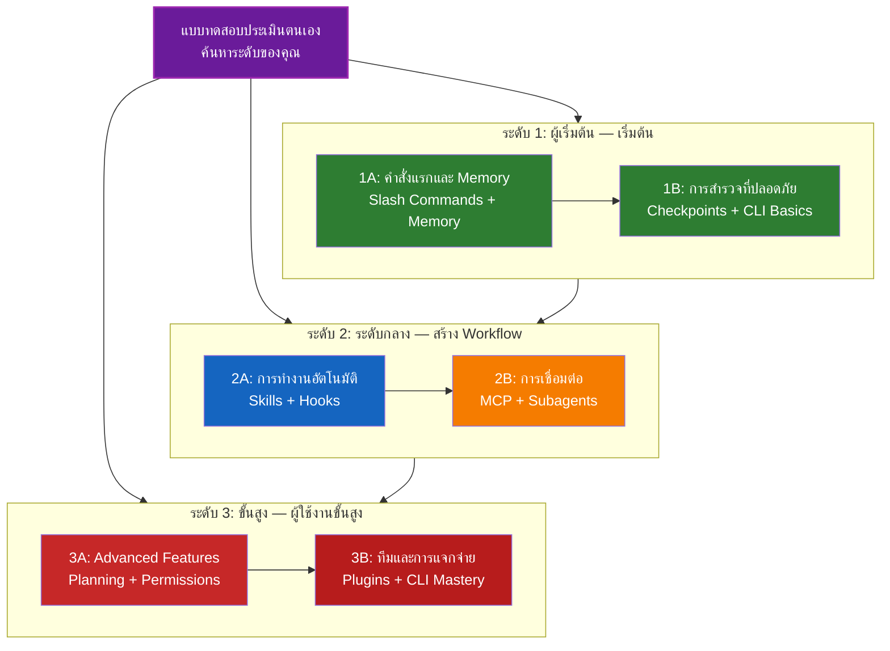

<!-- i18n-source: LEARNING-ROADMAP.md -->
<!-- i18n-date: 2026-07-15 -->
<picture>
  <source media="(prefers-color-scheme: dark)" srcset="resources/logos/claude-howto-logo-dark.svg">
  
</picture>

# แผนการเรียนรู้ Claude Code

**ใหม่กับ Claude Code?** คู่มือนี้ช่วยให้คุณเชี่ยวชาญฟีเจอร์ของ Claude Code ในอัตราที่เหมาะกับตนเอง ไม่ว่าคุณจะเป็นผู้เริ่มต้นหรือนักพัฒนาที่มีประสบการณ์ เริ่มต้นด้วยแบบทดสอบประเมินตนเองด้านล่างเพื่อค้นหาเส้นทางที่เหมาะสม

---

## ค้นหาระดับของคุณ

ทุกคนไม่ได้เริ่มต้นจากจุดเดียวกัน ทำแบบทดสอบประเมินตนเองอย่างรวดเร็วนี้เพื่อค้นหาจุดเริ่มต้นที่เหมาะสม

**ตอบคำถามเหล่านี้อย่างซื่อสัตย์:**

- [ ] ฉันสามารถเริ่ม Claude Code และสนทนาได้ (`claude`)
- [ ] ฉันได้สร้างหรือแก้ไขไฟล์ CLAUDE.md
- [ ] ฉันได้ใช้ slash command ที่ built-in อย่างน้อย 3 รายการ (เช่น /help, /compact, /model)
- [ ] ฉันได้สร้าง slash command หรือ skill แบบกำหนดเอง (SKILL.md)
- [ ] ฉันได้กำหนดค่า MCP server (เช่น GitHub, database)
- [ ] ฉันได้ตั้งค่า hooks ใน ~/.claude/settings.json
- [ ] ฉันได้สร้างหรือใช้ subagents แบบกำหนดเอง (.claude/agents/)
- [ ] ฉันได้ใช้ print mode (`claude -p`) สำหรับ scripting หรือ CI/CD

**ระดับของคุณ:**

| จำนวนที่ทำ | ระดับ | เริ่มที่ | เวลาที่ใช้ |
|--------|-------|----------|------------------|
| 0-2 | **ระดับ 1: ผู้เริ่มต้น** — เริ่มต้น | [Milestone 1A](#milestone-1a-คำสั่งแรกและ-memory) | ~3 ชั่วโมง |
| 3-5 | **ระดับ 2: ระดับกลาง** — สร้าง Workflow | [Milestone 2A](#milestone-2a-การทำงานอัตโนมัติ-skills--hooks) | ~5 ชั่วโมง |
| 6-8 | **ระดับ 3: ขั้นสูง** — ผู้ใช้งานขั้นสูงและหัวหน้าทีม | [Milestone 3A](#milestone-3a-advanced-features) | ~5 ชั่วโมง |

> **เคล็ดลับ**: หากไม่แน่ใจ ให้เริ่มต้นจากระดับที่ต่ำกว่าหนึ่งระดับ การทบทวนเนื้อหาที่คุ้นเคยอย่างรวดเร็วดีกว่าการพลาดแนวคิดพื้นฐาน

> **เวอร์ชันโต้ตอบ**: รัน `/self-assessment` ใน Claude Code สำหรับแบบทดสอบที่โต้ตอบได้ ซึ่งให้คะแนนความสามารถของคุณในฟีเจอร์ทั้ง 10 ด้าน และสร้างเส้นทางการเรียนรู้ส่วนตัว

---

## ปรัชญาการเรียนรู้

โฟลเดอร์ในที่เก็บนี้มีหมายเลขตาม **ลำดับการเรียนรู้ที่แนะนำ** โดยอิงจากหลักการสำคัญสามประการ:

1. **การพึ่งพากัน** — แนวคิดพื้นฐานมาก่อน
2. **ความซับซ้อน** — ฟีเจอร์ที่ง่ายกว่ามาก่อนฟีเจอร์ขั้นสูง
3. **ความถี่ในการใช้งาน** — ฟีเจอร์ที่ใช้บ่อยที่สุดสอนก่อน

แนวทางนี้ช่วยให้คุณสร้างรากฐานที่มั่นคงพร้อมทั้งได้รับประโยชน์ด้านประสิทธิภาพการทำงานทันที

---

## เส้นทางการเรียนรู้



**ตำนานสี:**
- สีม่วง: แบบทดสอบประเมินตนเอง
- สีเขียว: ระดับ 1 — เส้นทางผู้เริ่มต้น
- สีน้ำเงิน / สีทอง: ระดับ 2 — เส้นทางระดับกลาง
- สีแดง: ระดับ 3 — เส้นทางขั้นสูง

---

## ตารางแผนการเรียนรู้สมบูรณ์

| ขั้นตอน | ฟีเจอร์ | ความซับซ้อน | เวลา | ระดับ | การพึ่งพา | เหตุผลที่ควรเรียน | ประโยชน์หลัก |
|------|---------|-----------|------|-------|--------------|----------------|--------------|
| **1** | [Slash Commands](../01-slash-commands/) | ⭐ ผู้เริ่มต้น | 30 นาที | ระดับ 1 | ไม่มี | ประสิทธิภาพที่ได้รับทันที (60+ built-in + 5 bundled skills) | การทำงานอัตโนมัติทันที มาตรฐานทีม |
| **2** | [Memory](../02-memory/) | ⭐⭐ ผู้เริ่มต้น+ | 45 นาที | ระดับ 1 | ไม่มี | จำเป็นสำหรับทุกฟีเจอร์ | บริบทถาวร ความชอบ |
| **3** | [Checkpoints](../08-checkpoints/) | ⭐⭐ ระดับกลาง | 45 นาที | ระดับ 1 | การจัดการ session | การสำรวจที่ปลอดภัย | การทดลอง การกู้คืน |
| **4** | [CLI Basics](../10-cli/) | ⭐⭐ ผู้เริ่มต้น+ | 30 นาที | ระดับ 1 | ไม่มี | การใช้งาน CLI หลัก | โหมดโต้ตอบและ print mode |
| **5** | [Skills](../03-skills/) | ⭐⭐ ระดับกลาง | 1 ชั่วโมง | ระดับ 2 | Slash Commands | ความเชี่ยวชาญอัตโนมัติ | ความสามารถที่นำกลับมาใช้ใหม่ ความสอดคล้อง |
| **6** | [Hooks](../06-hooks/) | ⭐⭐ ระดับกลาง | 1 ชั่วโมง | ระดับ 2 | เครื่องมือ คำสั่ง | การทำงานอัตโนมัติ workflow (28 เหตุการณ์ 5 ประเภท) | การตรวจสอบ quality gates |
| **7** | [MCP](../05-mcp/) | ⭐⭐⭐ ระดับกลาง+ | 1 ชั่วโมง | ระดับ 2 | การกำหนดค่า | การเข้าถึงข้อมูลสด | การเชื่อมต่อแบบเรียลไทม์ API |
| **8** | [Subagents](../04-subagents/) | ⭐⭐⭐ ระดับกลาง+ | 1.5 ชั่วโมง | ระดับ 2 | Memory คำสั่ง | การจัดการงานซับซ้อน (6 built-in รวม Bash) | การมอบหมาย ความเชี่ยวชาญเฉพาะทาง |
| **9** | [Advanced Features](../09-advanced-features/) | ⭐⭐⭐⭐⭐ ขั้นสูง | 2-3 ชั่วโมง | ระดับ 3 | ทุกอย่างก่อนหน้า | เครื่องมือสำหรับผู้ใช้งานขั้นสูง | Planning, Auto Mode, Channels, Voice Dictation, permissions |
| **10** | [Plugins](../07-plugins/) | ⭐⭐⭐⭐ ขั้นสูง | 2 ชั่วโมง | ระดับ 3 | ทุกอย่างก่อนหน้า | โซลูชันครบวงจร | การ onboard ทีม การแจกจ่าย |
| **11** | [CLI Mastery](../10-cli/) | ⭐⭐⭐ ขั้นสูง | 1 ชั่วโมง | ระดับ 3 | แนะนำ: ทุกอย่าง | เชี่ยวชาญการใช้งาน command-line | การเขียน script, CI/CD, การทำงานอัตโนมัติ |

**เวลาการเรียนรู้ทั้งหมด**: ~11-13 ชั่วโมง (หรือข้ามไปยังระดับของคุณเพื่อประหยัดเวลา)

---

## ระดับ 1: ผู้เริ่มต้น — เริ่มต้น

**สำหรับ**: ผู้ใช้ที่ทำแบบทดสอบได้ 0-2 ข้อ
**เวลา**: ~3 ชั่วโมง
**จุดเน้น**: ประสิทธิภาพทันที ความเข้าใจพื้นฐาน
**ผลลัพธ์**: ผู้ใช้ประจำที่มีความสบายใจ พร้อมสำหรับระดับ 2

### Milestone 1A: คำสั่งแรกและ Memory

**หัวข้อ**: Slash Commands + Memory
**เวลา**: 1-2 ชั่วโมง
**ความซับซ้อน**: ⭐ ผู้เริ่มต้น
**เป้าหมาย**: เพิ่มประสิทธิภาพการทำงานทันทีด้วย custom commands และบริบทถาวร

#### สิ่งที่จะบรรลุ
- สร้าง slash commands แบบกำหนดเองสำหรับงานที่ทำซ้ำ
- ตั้งค่า project memory สำหรับมาตรฐานทีม
- กำหนดค่าความชอบส่วนตัว
- เข้าใจวิธีที่ Claude โหลดบริบทโดยอัตโนมัติ

#### แบบฝึกหัดปฏิบัติ

```bash
# แบบฝึกหัดที่ 1: ติดตั้ง slash command แรก
mkdir -p .claude/commands
cp 01-slash-commands/optimize.md .claude/commands/

# แบบฝึกหัดที่ 2: สร้าง project memory
cp 02-memory/project-CLAUDE.md ./CLAUDE.md

# แบบฝึกหัดที่ 3: ทดลองใช้งาน
# ใน Claude Code พิมพ์: /optimize
```

#### เกณฑ์ความสำเร็จ
- [ ] เรียกใช้ command `/optimize` ได้สำเร็จ
- [ ] Claude จำมาตรฐานโครงการจาก CLAUDE.md ได้
- [ ] เข้าใจว่าเมื่อใดควรใช้ slash commands เทียบกับ memory

#### ขั้นตอนถัดไป
เมื่อมีความสบายใจแล้ว อ่าน:
- [01-slash-commands/README.md](../01-slash-commands/README.md)
- [02-memory/README.md](../02-memory/README.md)

> **ตรวจสอบความเข้าใจ**: รัน `/lesson-quiz slash-commands` หรือ `/lesson-quiz memory` ใน Claude Code เพื่อทดสอบสิ่งที่เรียนรู้

---

### Milestone 1B: การสำรวจที่ปลอดภัย

**หัวข้อ**: Checkpoints + CLI Basics
**เวลา**: 1 ชั่วโมง
**ความซับซ้อน**: ⭐⭐ ผู้เริ่มต้น+
**เป้าหมาย**: เรียนรู้การทดลองอย่างปลอดภัยและใช้ CLI commands หลัก

#### สิ่งที่จะบรรลุ
- สร้างและกู้คืน checkpoint เพื่อการทดลองที่ปลอดภัย
- เข้าใจโหมดโต้ตอบเทียบกับ print mode
- ใช้ CLI flags และ options พื้นฐาน
- ประมวลผลไฟล์ผ่าน piping

#### แบบฝึกหัดปฏิบัติ

```bash
# แบบฝึกหัดที่ 1: ลอง checkpoint workflow
# ใน Claude Code:
# ทำการเปลี่ยนแปลงทดลอง จากนั้นกด Esc+Esc หรือใช้ /rewind
# เลือก checkpoint ก่อนการทดลอง
# เลือก "Restore code and conversation" เพื่อย้อนกลับ

# แบบฝึกหัดที่ 2: โหมดโต้ตอบเทียบกับ Print mode
claude "explain this project"           # โหมดโต้ตอบ
claude -p "explain this function"       # Print mode (non-interactive)

# แบบฝึกหัดที่ 3: ประมวลผลเนื้อหาไฟล์ผ่าน piping
cat error.log | claude -p "explain this error"
```

#### เกณฑ์ความสำเร็จ
- [ ] สร้างและย้อนกลับไปยัง checkpoint แล้ว
- [ ] ใช้ทั้งโหมดโต้ตอบและ print mode
- [ ] ส่งไฟล์ไปยัง Claude เพื่อการวิเคราะห์ผ่าน pipe
- [ ] เข้าใจว่าเมื่อใดควรใช้ checkpoint เพื่อการทดลองที่ปลอดภัย

#### ขั้นตอนถัดไป
- อ่าน: [08-checkpoints/README.md](../08-checkpoints/README.md)
- อ่าน: [10-cli/README.md](../10-cli/README.md)
- **พร้อมสำหรับระดับ 2!** ดำเนินต่อไปที่ [Milestone 2A](#milestone-2a-การทำงานอัตโนมัติ-skills--hooks)

> **ตรวจสอบความเข้าใจ**: รัน `/lesson-quiz checkpoints` หรือ `/lesson-quiz cli` เพื่อยืนยันว่าคุณพร้อมสำหรับระดับ 2

---

## ระดับ 2: ระดับกลาง — สร้าง Workflow

**สำหรับ**: ผู้ใช้ที่ทำแบบทดสอบได้ 3-5 ข้อ
**เวลา**: ~5 ชั่วโมง
**จุดเน้น**: การทำงานอัตโนมัติ การเชื่อมต่อ การมอบหมายงาน
**ผลลัพธ์**: workflow อัตโนมัติ การเชื่อมต่อภายนอก พร้อมสำหรับระดับ 3

### การตรวจสอบข้อกำหนดเบื้องต้น

ก่อนเริ่มระดับ 2 ตรวจสอบให้แน่ใจว่าคุณสบายใจกับแนวคิดระดับ 1 เหล่านี้:

- [ ] สร้างและใช้ slash commands ได้ ([01-slash-commands/](../01-slash-commands/))
- [ ] ตั้งค่า project memory ผ่าน CLAUDE.md แล้ว ([02-memory/](../02-memory/))
- [ ] รู้วิธีสร้างและกู้คืน checkpoint ([08-checkpoints/](../08-checkpoints/))
- [ ] ใช้ `claude` และ `claude -p` จาก command line ได้ ([10-cli/](../10-cli/))

> **มีช่องว่าง?** ทบทวนบทเรียนที่ลิงก์ไว้ด้านบนก่อนดำเนินการต่อ

---

### Milestone 2A: การทำงานอัตโนมัติ (Skills + Hooks)

**หัวข้อ**: Skills + Hooks
**เวลา**: 2-3 ชั่วโมง
**ความซับซ้อน**: ⭐⭐ ระดับกลาง
**เป้าหมาย**: ทำให้ workflow และการตรวจสอบคุณภาพทั่วไปเป็นอัตโนมัติ

#### สิ่งที่จะบรรลุ
- เรียกใช้ความสามารถเฉพาะทางโดยอัตโนมัติด้วย YAML frontmatter (รวมถึงฟิลด์ `effort` และ `shell`)
- ตั้งค่าการทำงานอัตโนมัติที่ขับเคลื่อนด้วยเหตุการณ์ผ่าน 28 hook events
- ใช้ hook ทั้ง 5 ประเภท (command, http, mcp_tool, prompt, agent)
- บังคับใช้มาตรฐานคุณภาพโค้ด
- สร้าง hooks แบบกำหนดเองสำหรับ workflow ของคุณ

#### แบบฝึกหัดปฏิบัติ

```bash
# แบบฝึกหัดที่ 1: ติดตั้ง skill
cp -r 03-skills/code-review ~/.claude/skills/

# แบบฝึกหัดที่ 2: ตั้งค่า hooks
mkdir -p ~/.claude/hooks
cp 06-hooks/pre-tool-check.sh ~/.claude/hooks/
chmod +x ~/.claude/hooks/pre-tool-check.sh

# แบบฝึกหัดที่ 3: กำหนดค่า hooks ในการตั้งค่า
# เพิ่มใน ~/.claude/settings.json:
{
  "hooks": {
    "PreToolUse": [
      {
        "matcher": "Bash",
        "hooks": [
          {
            "type": "command",
            "command": "~/.claude/hooks/pre-tool-check.sh"
          }
        ]
      }
    ]
  }
}
```

#### เกณฑ์ความสำเร็จ
- [ ] Code review skill ถูกเรียกใช้โดยอัตโนมัติเมื่อเกี่ยวข้อง
- [ ] PreToolUse hook ทำงานก่อนการดำเนินการเครื่องมือ
- [ ] เข้าใจการเรียกใช้ skill โดยอัตโนมัติเทียบกับ hook event triggers

#### ขั้นตอนถัดไป
- สร้าง skill แบบกำหนดเองของคุณเอง
- ตั้งค่า hooks เพิ่มเติมสำหรับ workflow ของคุณ
- อ่าน: [03-skills/README.md](../03-skills/README.md)
- อ่าน: [06-hooks/README.md](../06-hooks/README.md)

> **ตรวจสอบความเข้าใจ**: รัน `/lesson-quiz skills` หรือ `/lesson-quiz hooks` เพื่อทดสอบความรู้ก่อนดำเนินการต่อ

---

### Milestone 2B: การเชื่อมต่อ (MCP + Subagents)

**หัวข้อ**: MCP + Subagents
**เวลา**: 2-3 ชั่วโมง
**ความซับซ้อน**: ⭐⭐⭐ ระดับกลาง+
**เป้าหมาย**: เชื่อมต่อบริการภายนอกและมอบหมายงานที่ซับซ้อน

#### สิ่งที่จะบรรลุ
- เข้าถึงข้อมูลสดจาก GitHub, database เป็นต้น
- มอบหมายงานให้กับ AI agents เฉพาะทาง
- เข้าใจว่าเมื่อใดควรใช้ MCP เทียบกับ subagents
- สร้าง workflow ที่เชื่อมต่อกัน

#### แบบฝึกหัดปฏิบัติ

```bash
# แบบฝึกหัดที่ 1: ตั้งค่า GitHub MCP
export GITHUB_TOKEN="your_github_token"
claude mcp add github -- npx -y @modelcontextprotocol/server-github

# แบบฝึกหัดที่ 2: ทดสอบการเชื่อมต่อ MCP
# ใน Claude Code: /mcp__github__list_prs

# แบบฝึกหัดที่ 3: ติดตั้ง subagents
mkdir -p .claude/agents
cp 04-subagents/*.md .claude/agents/
```

#### แบบฝึกหัดการเชื่อมต่อ
ลอง workflow ที่สมบูรณ์นี้:
1. ใช้ MCP เพื่อดึง GitHub PR
2. ให้ Claude มอบหมายการรีวิวให้กับ code-reviewer subagent
3. ใช้ hooks เพื่อรันการทดสอบโดยอัตโนมัติ

#### เกณฑ์ความสำเร็จ
- [ ] สืบค้นข้อมูล GitHub ผ่าน MCP ได้สำเร็จ
- [ ] Claude มอบหมายงานซับซ้อนให้กับ subagents
- [ ] เข้าใจความแตกต่างระหว่าง MCP และ subagents
- [ ] รวม MCP + subagents + hooks ใน workflow

#### ขั้นตอนถัดไป
- ตั้งค่า MCP server เพิ่มเติม (database, Slack เป็นต้น)
- สร้าง subagents แบบกำหนดเองสำหรับโดเมนของคุณ
- อ่าน: [05-mcp/README.md](../05-mcp/README.md)
- อ่าน: [04-subagents/README.md](../04-subagents/README.md)
- **พร้อมสำหรับระดับ 3!** ดำเนินต่อไปที่ [Milestone 3A](#milestone-3a-advanced-features)

> **ตรวจสอบความเข้าใจ**: รัน `/lesson-quiz mcp` หรือ `/lesson-quiz subagents` เพื่อยืนยันว่าคุณพร้อมสำหรับระดับ 3

---

## ระดับ 3: ขั้นสูง — ผู้ใช้งานขั้นสูงและหัวหน้าทีม

**สำหรับ**: ผู้ใช้ที่ทำแบบทดสอบได้ 6-8 ข้อ
**เวลา**: ~5 ชั่วโมง
**จุดเน้น**: เครื่องมือสำหรับทีม, CI/CD, ฟีเจอร์ระดับองค์กร, การพัฒนา plugin
**ผลลัพธ์**: ผู้ใช้งานขั้นสูง สามารถตั้งค่า workflow ทีมและ CI/CD

### การตรวจสอบข้อกำหนดเบื้องต้น

ก่อนเริ่มระดับ 3 ตรวจสอบให้แน่ใจว่าคุณสบายใจกับแนวคิดระดับ 2 เหล่านี้:

- [ ] สร้างและใช้ skills พร้อมการเรียกใช้อัตโนมัติได้ ([03-skills/](../03-skills/))
- [ ] ตั้งค่า hooks สำหรับการทำงานอัตโนมัติที่ขับเคลื่อนด้วยเหตุการณ์แล้ว ([06-hooks/](../06-hooks/))
- [ ] กำหนดค่า MCP server สำหรับข้อมูลภายนอกได้ ([05-mcp/](../05-mcp/))
- [ ] รู้วิธีใช้ subagents สำหรับการมอบหมายงาน ([04-subagents/](../04-subagents/))

> **มีช่องว่าง?** ทบทวนบทเรียนที่ลิงก์ไว้ด้านบนก่อนดำเนินการต่อ

---

### Milestone 3A: Advanced Features

**หัวข้อ**: Advanced Features (Planning, Permissions, Extended Thinking, Auto Mode, Channels, Voice Dictation, Remote/Desktop/Web)
**เวลา**: 2-3 ชั่วโมง
**ความซับซ้อน**: ⭐⭐⭐⭐⭐ ขั้นสูง
**เป้าหมาย**: เชี่ยวชาญ workflow ขั้นสูงและเครื่องมือสำหรับผู้ใช้งานขั้นสูง

#### สิ่งที่จะบรรลุ
- Planning mode สำหรับฟีเจอร์ที่ซับซ้อน
- การควบคุม permission แบบละเอียดด้วย 6 โหมด (default, acceptEdits, plan, auto, dontAsk, bypassPermissions)
- Extended thinking ผ่านการสลับ Alt+T / Option+T
- การจัดการ background task
- Auto Memory สำหรับความชอบที่เรียนรู้
- Auto Mode พร้อม background safety classifier
- Channels สำหรับ workflow หลาย session ที่มีโครงสร้าง
- Voice Dictation สำหรับการโต้ตอบแบบ hands-free
- Remote control, desktop app และ web sessions
- Agent Teams สำหรับการทำงานร่วมกันระหว่าง agent หลายตัว

#### แบบฝึกหัดปฏิบัติ

```bash
# แบบฝึกหัดที่ 1: ใช้ planning mode
/plan Implement user authentication system

# แบบฝึกหัดที่ 2: ลอง permission modes (6 โหมดที่มี: default, acceptEdits, plan, auto, dontAsk, bypassPermissions)
claude --permission-mode plan "analyze this codebase"
claude --permission-mode acceptEdits "refactor the auth module"
claude --permission-mode auto "implement the feature"

# แบบฝึกหัดที่ 3: เปิดใช้งาน extended thinking
# กด Alt+T (Option+T บน macOS) ระหว่าง session เพื่อสลับ

# แบบฝึกหัดที่ 4: checkpoint workflow ขั้นสูง
# 1. สร้าง checkpoint "Clean state"
# 2. ใช้ planning mode เพื่อออกแบบฟีเจอร์
# 3. พัฒนาด้วยการมอบหมายให้ subagent
# 4. รันการทดสอบใน background
# 5. หากการทดสอบล้มเหลว ให้ย้อนกลับไปยัง checkpoint
# 6. ลองแนวทางอื่น

# แบบฝึกหัดที่ 5: ลอง auto mode (background safety classifier)
claude --permission-mode auto "implement user settings page"

# แบบฝึกหัดที่ 6: เปิดใช้งาน agent teams
export CLAUDE_AGENT_TEAMS=1
# ถาม Claude: "Implement feature X using a team approach"

# แบบฝึกหัดที่ 7: Scheduled tasks
/loop 5m /check-status
# หรือใช้ CronCreate สำหรับ scheduled tasks ที่ถาวร

# แบบฝึกหัดที่ 8: Channels สำหรับ workflow หลาย session
# ใช้ channels เพื่อจัดระเบียบงานข้าม session

# แบบฝึกหัดที่ 9: Voice Dictation
# ใช้ voice input สำหรับการโต้ตอบแบบ hands-free กับ Claude Code
```

#### เกณฑ์ความสำเร็จ
- [ ] ใช้ planning mode สำหรับฟีเจอร์ที่ซับซ้อน
- [ ] กำหนดค่า permission modes (plan, acceptEdits, auto, dontAsk)
- [ ] สลับ extended thinking ด้วย Alt+T / Option+T
- [ ] ใช้ auto mode พร้อม background safety classifier
- [ ] ใช้ background tasks สำหรับการดำเนินการระยะยาว
- [ ] สำรวจ Channels สำหรับ workflow หลาย session
- [ ] ลอง Voice Dictation สำหรับ input แบบ hands-free
- [ ] เข้าใจ Remote Control, Desktop App และ Web sessions
- [ ] เปิดใช้งานและใช้ Agent Teams สำหรับงานที่ต้องทำงานร่วมกัน
- [ ] ใช้ `/loop` สำหรับงานที่เกิดซ้ำหรือการตรวจสอบที่กำหนดเวลา

#### ขั้นตอนถัดไป
- อ่าน: [09-advanced-features/README.md](../09-advanced-features/README.md)

> **ตรวจสอบความเข้าใจ**: รัน `/lesson-quiz advanced` เพื่อทดสอบความเชี่ยวชาญในฟีเจอร์สำหรับผู้ใช้งานขั้นสูง

---

### Milestone 3B: ทีมและการแจกจ่าย (Plugins + CLI Mastery)

**หัวข้อ**: Plugins + CLI Mastery + CI/CD
**เวลา**: 2-3 ชั่วโมง
**ความซับซ้อน**: ⭐⭐⭐⭐ ขั้นสูง
**เป้าหมาย**: สร้างเครื่องมือสำหรับทีม, สร้าง plugins, เชี่ยวชาญการเชื่อมต่อ CI/CD

#### สิ่งที่จะบรรลุ
- ติดตั้งและสร้าง plugins ที่รวมเป็นชุดสมบูรณ์
- เชี่ยวชาญ CLI สำหรับการเขียน script และการทำงานอัตโนมัติ
- ตั้งค่าการเชื่อมต่อ CI/CD ด้วย `claude -p`
- JSON output สำหรับ pipeline อัตโนมัติ
- การจัดการ session และการประมวลผลแบบกลุ่ม

#### แบบฝึกหัดปฏิบัติ

```bash
# แบบฝึกหัดที่ 1: ติดตั้ง plugin ที่สมบูรณ์
# ใน Claude Code: /plugin install pr-review

# แบบฝึกหัดที่ 2: Print mode สำหรับ CI/CD
claude -p "Run all tests and generate report"

# แบบฝึกหัดที่ 3: JSON output สำหรับ scripts
claude -p --output-format json "list all functions"

# แบบฝึกหัดที่ 4: การจัดการและการต่อ session
claude -r "feature-auth" "continue implementation"

# แบบฝึกหัดที่ 5: การเชื่อมต่อ CI/CD พร้อมข้อจำกัด
claude -p --max-turns 3 --output-format json "review code"

# แบบฝึกหัดที่ 6: การประมวลผลแบบกลุ่ม
for file in *.md; do
  claude -p --output-format json "summarize this: $(cat $file)" > ${file%.md}.summary.json
done
```

#### แบบฝึกหัดการเชื่อมต่อ CI/CD
สร้าง script CI/CD อย่างง่าย:
1. ใช้ `claude -p` เพื่อรีวิวไฟล์ที่เปลี่ยนแปลง
2. ส่งออกผลลัพธ์เป็น JSON
3. ประมวลผลด้วย `jq` สำหรับปัญหาเฉพาะ
4. เชื่อมต่อเข้ากับ workflow ของ GitHub Actions

#### เกณฑ์ความสำเร็จ
- [ ] ติดตั้งและใช้ plugin
- [ ] สร้างหรือแก้ไข plugin สำหรับทีม
- [ ] ใช้ print mode (`claude -p`) ใน CI/CD
- [ ] สร้าง JSON output สำหรับการเขียน script
- [ ] ต่อ session ก่อนหน้าสำเร็จ
- [ ] สร้าง script การประมวลผลแบบกลุ่ม
- [ ] เชื่อมต่อ Claude กับ CI/CD workflow

#### กรณีการใช้งานจริงสำหรับ CLI
- **การรีวิวโค้ดอัตโนมัติ**: รันการรีวิวโค้ดใน CI/CD pipeline
- **การวิเคราะห์ Log**: วิเคราะห์ error log และ system output
- **การสร้างเอกสาร**: สร้างเอกสารแบบกลุ่ม
- **ข้อมูลเชิงลึกด้านการทดสอบ**: วิเคราะห์การทดสอบที่ล้มเหลว
- **การวิเคราะห์ประสิทธิภาพ**: รีวิว metric ด้านประสิทธิภาพ
- **การประมวลผลข้อมูล**: แปลงและวิเคราะห์ไฟล์ข้อมูล

#### ขั้นตอนถัดไป
- อ่าน: [07-plugins/README.md](../07-plugins/README.md)
- อ่าน: [10-cli/README.md](../10-cli/README.md)
- สร้างทางลัด CLI และ plugins สำหรับทั้งทีม
- ตั้งค่า script การประมวลผลแบบกลุ่ม

> **ตรวจสอบความเข้าใจ**: รัน `/lesson-quiz plugins` หรือ `/lesson-quiz cli` เพื่อยืนยันความเชี่ยวชาญของคุณ

---

## ทดสอบความรู้ของคุณ

ที่เก็บนี้รวม 2 skill โต้ตอบที่คุณสามารถใช้ได้ตลอดเวลาใน Claude Code เพื่อประเมินความเข้าใจของคุณ:

| Skill | คำสั่ง | วัตถุประสงค์ |
|-------|---------|---------|
| **Self-Assessment** | `/self-assessment` | ประเมินความสามารถโดยรวมในทุก 10 ฟีเจอร์ เลือกโหมด Quick (2 นาที) หรือ Deep (5 นาที) เพื่อรับโปรไฟล์ทักษะและเส้นทางการเรียนรู้ส่วนตัว |
| **Lesson Quiz** | `/lesson-quiz [lesson]` | ทดสอบความเข้าใจของบทเรียนเฉพาะด้วย 10 คำถาม ใช้ก่อนบทเรียน (pre-test), ระหว่างบทเรียน (ตรวจสอบความก้าวหน้า) หรือหลังบทเรียน (ยืนยันความเชี่ยวชาญ) |

**ตัวอย่าง:**
```
/self-assessment                  # ค้นหาระดับโดยรวม
/lesson-quiz hooks                # ทดสอบบทเรียนที่ 06: Hooks
/lesson-quiz 03                   # ทดสอบบทเรียนที่ 03: Skills
/lesson-quiz advanced-features    # ทดสอบบทเรียนที่ 09
```

---

## เส้นทางเริ่มต้นอย่างรวดเร็ว

### หากมีเวลาเพียง 15 นาที
**เป้าหมาย**: ได้รับชัยชนะแรก

1. คัดลอก slash command หนึ่งรายการ: `cp 01-slash-commands/optimize.md .claude/commands/`
2. ลองใช้ใน Claude Code: `/optimize`
3. อ่าน: [01-slash-commands/README.md](../01-slash-commands/README.md)

**ผลลัพธ์**: คุณจะมี slash command ที่ใช้งานได้และเข้าใจพื้นฐาน

---

### หากมีเวลา 1 ชั่วโมง
**เป้าหมาย**: ตั้งค่าเครื่องมือเพิ่มประสิทธิภาพที่จำเป็น

1. **Slash commands** (15 นาที): คัดลอกและทดสอบ `/optimize` และ `/pr`
2. **Project memory** (15 นาที): สร้าง CLAUDE.md ด้วยมาตรฐานโครงการ
3. **ติดตั้ง skill** (15 นาที): ตั้งค่า code-review skill
4. **ลองร่วมกัน** (15 นาที): ดูวิธีการทำงานร่วมกัน

**ผลลัพธ์**: เพิ่มประสิทธิภาพพื้นฐานด้วย commands, memory และ auto-skills

---

### หากมีเวลาทั้งสุดสัปดาห์
**เป้าหมาย**: มีความสามารถในการใช้ฟีเจอร์ส่วนใหญ่

**เช้าวันเสาร์** (3 ชั่วโมง):
- ทำ Milestone 1A: Slash Commands + Memory ให้เสร็จสมบูรณ์
- ทำ Milestone 1B: Checkpoints + CLI Basics ให้เสร็จสมบูรณ์

**บ่ายวันเสาร์** (3 ชั่วโมง):
- ทำ Milestone 2A: Skills + Hooks ให้เสร็จสมบูรณ์
- ทำ Milestone 2B: MCP + Subagents ให้เสร็จสมบูรณ์

**วันอาทิตย์** (4 ชั่วโมง):
- ทำ Milestone 3A: Advanced Features ให้เสร็จสมบูรณ์
- ทำ Milestone 3B: Plugins + CLI Mastery + CI/CD ให้เสร็จสมบูรณ์
- สร้าง plugin แบบกำหนดเองสำหรับทีม

**ผลลัพธ์**: คุณจะเป็นผู้ใช้งาน Claude Code ขั้นสูงที่พร้อมฝึกสอนผู้อื่นและทำ workflow ที่ซับซ้อนให้เป็นอัตโนมัติ

---

## เคล็ดลับการเรียนรู้

### สิ่งที่ควรทำ

- **ทำแบบทดสอบก่อน** เพื่อค้นหาจุดเริ่มต้น
- **ทำแบบฝึกหัดปฏิบัติ** สำหรับแต่ละ milestone
- **เริ่มต้นง่ายๆ** และเพิ่มความซับซ้อนทีละน้อย
- **ทดสอบแต่ละฟีเจอร์** ก่อนเปลี่ยนไปยังฟีเจอร์ถัดไป
- **บันทึก** สิ่งที่ใช้ได้ผลสำหรับ workflow ของคุณ
- **ย้อนกลับไปดู** แนวคิดก่อนหน้าขณะที่เรียนหัวข้อขั้นสูง
- **ทดลองอย่างปลอดภัย** โดยใช้ checkpoints
- **แบ่งปันความรู้** กับทีมของคุณ

### สิ่งที่ไม่ควรทำ

- **ข้ามการตรวจสอบข้อกำหนดเบื้องต้น** เมื่อข้ามไปยังระดับที่สูงกว่า
- **พยายามเรียนรู้ทุกอย่างพร้อมกัน** — มันจะล้นมือ
- **คัดลอกการกำหนดค่าโดยไม่เข้าใจ** — คุณจะไม่รู้วิธีการดีบัก
- **ลืมทดสอบ** — ตรวจสอบเสมอว่าฟีเจอร์ทำงาน
- **รีบผ่าน milestone** — ใช้เวลาเพื่อทำความเข้าใจ
- **มองข้ามเอกสาร** — แต่ละ README มีรายละเอียดที่มีค่า
- **ทำงานอย่างโดดเดี่ยว** — พูดคุยกับเพื่อนร่วมทีม

---

## รูปแบบการเรียนรู้

### ผู้เรียนแบบเห็นภาพ
- ศึกษา mermaid diagram ในแต่ละ README
- สังเกตลำดับการทำงานของคำสั่ง
- วาด workflow diagram ของคุณเอง
- ใช้เส้นทางการเรียนรู้แบบเห็นภาพด้านบน

### ผู้เรียนแบบลงมือทำ
- ทำแบบฝึกหัดปฏิบัติทุกข้อ
- ทดลองกับรูปแบบต่างๆ
- ทำให้พังแล้วแก้ไข (ใช้ checkpoints!)
- สร้างตัวอย่างของคุณเอง

### ผู้เรียนแบบอ่าน
- อ่านแต่ละ README อย่างละเอียด
- ศึกษาตัวอย่างโค้ด
- ทบทวนตารางเปรียบเทียบ
- อ่าน blog post ที่ลิงก์ไว้ในแหล่งข้อมูล

### ผู้เรียนแบบสังคม
- ตั้งค่า session การเขียนโปรแกรมแบบคู่
- สอนแนวคิดให้เพื่อนร่วมทีม
- เข้าร่วมการสนทนาในชุมชน Claude Code
- แบ่งปันการกำหนดค่าแบบกำหนดเองของคุณ

---

## การติดตามความก้าวหน้า

ใช้ checklist เหล่านี้เพื่อติดตามความก้าวหน้าของคุณตามระดับ รัน `/self-assessment` ได้ตลอดเวลาเพื่อรับโปรไฟล์ทักษะที่อัปเดต หรือ `/lesson-quiz [lesson]` หลังจากแต่ละบทเรียนเพื่อยืนยันความเข้าใจของคุณ

### ระดับ 1: ผู้เริ่มต้น
- [ ] เสร็จสิ้น [01-slash-commands](../01-slash-commands/)
- [ ] เสร็จสิ้น [02-memory](../02-memory/)
- [ ] สร้าง slash command แบบกำหนดเองแรก
- [ ] ตั้งค่า project memory
- [ ] **บรรลุ Milestone 1A**
- [ ] เสร็จสิ้น [08-checkpoints](../08-checkpoints/)
- [ ] เสร็จสิ้น [10-cli](../10-cli/) พื้นฐาน
- [ ] สร้างและย้อนกลับไปยัง checkpoint
- [ ] ใช้โหมดโต้ตอบและ print mode
- [ ] **บรรลุ Milestone 1B**

### ระดับ 2: ระดับกลาง
- [ ] เสร็จสิ้น [03-skills](../03-skills/)
- [ ] เสร็จสิ้น [06-hooks](../06-hooks/)
- [ ] ติดตั้ง skill แรก
- [ ] ตั้งค่า PreToolUse hook
- [ ] **บรรลุ Milestone 2A**
- [ ] เสร็จสิ้น [05-mcp](../05-mcp/)
- [ ] เสร็จสิ้น [04-subagents](../04-subagents/)
- [ ] เชื่อมต่อ GitHub MCP
- [ ] สร้าง subagent แบบกำหนดเอง
- [ ] รวมการเชื่อมต่อใน workflow
- [ ] **บรรลุ Milestone 2B**

### ระดับ 3: ขั้นสูง
- [ ] เสร็จสิ้น [09-advanced-features](../09-advanced-features/)
- [ ] ใช้ planning mode สำเร็จ
- [ ] กำหนดค่า permission modes (6 โหมด รวม auto)
- [ ] ใช้ auto mode พร้อม safety classifier
- [ ] ใช้ extended thinking toggle
- [ ] สำรวจ Channels และ Voice Dictation
- [ ] **บรรลุ Milestone 3A**
- [ ] เสร็จสิ้น [07-plugins](../07-plugins/)
- [ ] เสร็จสิ้น [10-cli](../10-cli/) การใช้งานขั้นสูง
- [ ] ตั้งค่า print mode (`claude -p`) CI/CD
- [ ] สร้าง JSON output สำหรับการทำงานอัตโนมัติ
- [ ] เชื่อมต่อ Claude กับ CI/CD pipeline
- [ ] สร้าง team plugin
- [ ] **บรรลุ Milestone 3B**

---

## ความท้าทายในการเรียนรู้ที่พบบ่อย

### ความท้าทายที่ 1: "แนวคิดมากเกินไปในคราวเดียว"
**วิธีแก้**: มุ่งเน้นทีละ milestone ทำแบบฝึกหัดทั้งหมดให้เสร็จก่อนดำเนินการต่อ

### ความท้าทายที่ 2: "ไม่รู้ว่าเมื่อใดควรใช้ฟีเจอร์ใด"
**วิธีแก้**: ดู [Use Case Matrix](README.md#use-case-matrix) ใน README หลัก

### ความท้าทายที่ 3: "การกำหนดค่าไม่ทำงาน"
**วิธีแก้**: ตรวจสอบส่วน [Troubleshooting](README.md#troubleshooting) และยืนยันตำแหน่งไฟล์

### ความท้าทายที่ 4: "แนวคิดดูเหมือนจะทับซ้อนกัน"
**วิธีแก้**: ทบทวนตาราง [Feature Comparison](README.md#feature-comparison) เพื่อเข้าใจความแตกต่าง

### ความท้าทายที่ 5: "จำทุกอย่างได้ยาก"
**วิธีแก้**: สร้าง cheat sheet ของคุณเอง ใช้ checkpoints เพื่อทดลองอย่างปลอดภัย

### ความท้าทายที่ 6: "ฉันมีประสบการณ์แต่ไม่แน่ใจว่าจะเริ่มตรงไหน"
**วิธีแก้**: ทำ [แบบทดสอบประเมินตนเอง](#ค้นหาระดับของคุณ) ด้านบน ข้ามไปยังระดับของคุณและใช้การตรวจสอบข้อกำหนดเบื้องต้นเพื่อระบุช่องว่าง

---

## ทำอะไรต่อไปหลังจากเรียนจบ?

เมื่อคุณทำครบทุก milestone แล้ว:

1. **สร้างเอกสารสำหรับทีม** — จัดทำเอกสารการตั้งค่า Claude Code ของทีมคุณ
2. **สร้าง plugins แบบกำหนดเอง** — รวม workflow ของทีมเป็นชุด
3. **สำรวจ Remote Control** — ควบคุม session ของ Claude Code แบบ programmatic จากเครื่องมือภายนอก
4. **ลอง Web Sessions** — ใช้ Claude Code ผ่านอินเทอร์เฟซบนเบราว์เซอร์สำหรับการพัฒนาจากระยะไกล
5. **ใช้ Desktop App** — เข้าถึงฟีเจอร์ของ Claude Code ผ่านแอปพลิเคชันเดสก์ท็อป native
6. **ใช้ Auto Mode** — ให้ Claude ทำงานอย่างอิสระด้วย background safety classifier
7. **ใช้ประโยชน์จาก Auto Memory** — ให้ Claude เรียนรู้ความชอบของคุณโดยอัตโนมัติเมื่อเวลาผ่านไป
8. **ตั้งค่า Agent Teams** — ประสานงาน agent หลายตัวในงานที่ซับซ้อนและมีหลายแง่มุม
9. **ใช้ Channels** — จัดระเบียบงานข้าม workflow หลาย session ที่มีโครงสร้าง
10. **ลอง Voice Dictation** — ใช้ voice input แบบ hands-free สำหรับการโต้ตอบกับ Claude Code
11. **ใช้ Scheduled Tasks** — ทำการตรวจสอบที่เกิดซ้ำให้เป็นอัตโนมัติด้วย `/loop` และเครื่องมือ cron
12. **มีส่วนร่วมด้วยตัวอย่าง** — แบ่งปันกับชุมชน
13. **เป็นพี่เลี้ยงให้ผู้อื่น** — ช่วยเพื่อนร่วมทีมเรียนรู้
14. **ปรับปรุง workflow** — พัฒนาอย่างต่อเนื่องตามการใช้งาน
15. **ติดตามข่าวสาร** — ติดตามการเปิดตัวและฟีเจอร์ใหม่ของ Claude Code

---

## แหล่งข้อมูลเพิ่มเติม

### เอกสารทางการ
- [Claude Code Documentation](https://code.claude.com/docs/en/overview)
- [Anthropic Documentation](https://docs.anthropic.com)
- [MCP Protocol Specification](https://modelcontextprotocol.io)

### Blog Posts
- [Discovering Claude Code Slash Commands](https://medium.com/@luongnv89/discovering-claude-code-slash-commands-cdc17f0dfb29)

### ชุมชน
- [Anthropic Cookbook](https://github.com/anthropics/anthropic-cookbook)
- [MCP Servers Repository](https://github.com/modelcontextprotocol/servers)

---

## ข้อเสนอแนะและการสนับสนุน

- **พบปัญหา?** สร้าง issue ในที่เก็บ
- **มีข้อเสนอแนะ?** ส่ง pull request
- **ต้องการความช่วยเหลือ?** ตรวจสอบเอกสารหรือสอบถามชุมชน

---

**อัปเดตล่าสุด**: 6 พฤษภาคม 2569
**Claude Code Version**: 2.1.131
**แหล่งอ้างอิง**:
- https://code.claude.com/docs/en/overview
- https://code.claude.com/docs/en/hooks
- https://github.com/anthropics/claude-code/releases/tag/v2.1.131
**Model ที่รองรับ**: Claude Sonnet 4.6, Claude Opus 4.7, Claude Haiku 4.5
**ดูแลรักษาโดย**: Claude How-To Contributors
**สัญญาอนุญาต**: เพื่อการศึกษา ใช้และปรับแต่งได้อย่างเสรี

---

[← กลับไปยัง README หลัก](README.md)
