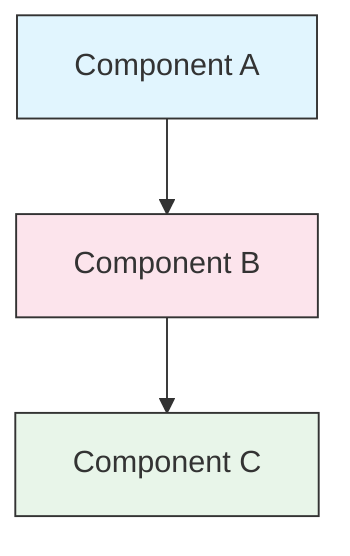

<!-- i18n-source: STYLE_GUIDE.md -->
<!-- i18n-date: 2026-07-15 -->
<picture>
  <source media="(prefers-color-scheme: dark)" srcset="../resources/logos/claude-howto-logo-dark.svg">
  
</picture>

# Style Guide

> แนวทางและกฎการจัดรูปแบบสำหรับการมีส่วนร่วมใน Claude How To ปฏิบัติตามคู่มือนี้เพื่อให้เนื้อหามีความสอดคล้อง เป็นมืออาชีพ และง่ายต่อการบำรุงรักษา

---

## สารบัญ

- [การตั้งชื่อไฟล์และโฟลเดอร์](#การตั้งชื่อไฟล์และโฟลเดอร์)
- [โครงสร้างเอกสาร](#โครงสร้างเอกสาร)
- [หัวข้อ](#หัวข้อ)
- [การจัดรูปแบบข้อความ](#การจัดรูปแบบข้อความ)
- [รายการ](#รายการ)
- [ตาราง](#ตาราง)
- [Code Blocks](#code-blocks)
- [ลิงก์และการอ้างอิงข้าม](#ลิงก์และการอ้างอิงข้าม)
- [แผนภาพ](#แผนภาพ)
- [การใช้ Emoji](#การใช้-emoji)
- [YAML Frontmatter](#yaml-frontmatter)
- [รูปภาพและสื่อ](#รูปภาพและสื่อ)
- [น้ำเสียงและสไตล์การเขียน](#น้ำเสียงและสไตล์การเขียน)
- [Commit Messages](#commit-messages)
- [รายการตรวจสอบสำหรับผู้เขียน](#รายการตรวจสอบสำหรับผู้เขียน)

---

## การตั้งชื่อไฟล์และโฟลเดอร์

### โฟลเดอร์บทเรียน

โฟลเดอร์บทเรียนใช้ **คำนำหน้าตัวเลขสองหลัก** ตามด้วย **ตัวอธิบายแบบ kebab-case**:

```
01-slash-commands/
02-memory/
03-skills/
04-subagents/
05-mcp/
```

หมายเลขสะท้อนลำดับของเส้นทางการเรียนรู้จากระดับเริ่มต้นไปจนถึงระดับสูง

### ชื่อไฟล์

| ประเภท | รูปแบบ | ตัวอย่าง |
|------|-----------|----------|
| **README ของบทเรียน** | `README.md` | `01-slash-commands/README.md` |
| **ไฟล์ฟีเจอร์** | Kebab-case `.md` | `code-reviewer.md`, `generate-api-docs.md` |
| **Shell script** | Kebab-case `.sh` | `format-code.sh`, `validate-input.sh` |
| **ไฟล์ config** | ชื่อมาตรฐาน | `.mcp.json`, `settings.json` |
| **ไฟล์ memory** | นำหน้าด้วย scope | `project-CLAUDE.md`, `personal-CLAUDE.md` |
| **เอกสารระดับบนสุด** | UPPER_CASE `.md` | `CATALOG.md`, `QUICK_REFERENCE.md`, `CONTRIBUTING.md` |
| **ไฟล์รูปภาพ** | Kebab-case | `pr-slash-command.png`, `claude-howto-logo.svg` |

### กฎ

- ใช้ **ตัวพิมพ์เล็ก** สำหรับชื่อไฟล์และโฟลเดอร์ทั้งหมด (ยกเว้นเอกสารระดับบนสุด เช่น `README.md`, `CATALOG.md`)
- ใช้ **เครื่องหมายขีด** (`-`) เป็นตัวคั่นคำ ห้ามใช้ขีดล่างหรือช่องว่าง
- ตั้งชื่อให้สื่อความหมายแต่กระชับ

---

## โครงสร้างเอกสาร

### README ระดับ Root

`README.md` ระดับ root ปฏิบัติตามลำดับนี้:

1. โลโก้ (องค์ประกอบ `<picture>` พร้อมรูปแบบสำหรับโหมดมืด/สว่าง)
2. หัวข้อ H1
3. Blockquote บทนำ (ข้อความคุณค่าหนึ่งบรรทัด)
4. ส่วน "Why This Guide?" พร้อมตารางเปรียบเทียบ
5. เส้นคั่นแนวนอน (`---`)
6. สารบัญ
7. Feature Catalog
8. การนำทางด่วน
9. เส้นทางการเรียนรู้
10. ส่วนของฟีเจอร์
11. การเริ่มต้นใช้งาน
12. แนวปฏิบัติที่ดี / การแก้ไขปัญหา
13. การมีส่วนร่วม / ใบอนุญาต

### README ของบทเรียน

`README.md` ของแต่ละบทเรียนปฏิบัติตามลำดับนี้:

1. หัวข้อ H1 (เช่น `# Slash Commands`)
2. ย่อหน้าภาพรวมโดยสังเขป
3. ตารางอ้างอิงด่วน (ไม่บังคับ)
4. แผนภาพสถาปัตยกรรม (Mermaid)
5. ส่วนรายละเอียด (H2)
6. ตัวอย่างเชิงปฏิบัติ (มีหมายเลข 4-6 ตัวอย่าง)
7. แนวปฏิบัติที่ดี (ตาราง Do's และ Don'ts)
8. การแก้ไขปัญหา
9. คู่มือที่เกี่ยวข้อง / เอกสารทางการ
10. ส่วนท้ายข้อมูลเมตาของเอกสาร

### ไฟล์ฟีเจอร์/ตัวอย่าง

ไฟล์ฟีเจอร์แต่ละไฟล์ (เช่น `optimize.md`, `pr.md`):

1. YAML frontmatter (ถ้ามี)
2. หัวข้อ H1
3. วัตถุประสงค์ / คำอธิบาย
4. คำแนะนำการใช้งาน
5. ตัวอย่างโค้ด
6. เคล็ดลับการปรับแต่ง

### ตัวคั่นส่วน

ใช้เส้นคั่นแนวนอน (`---`) เพื่อแยกส่วนหลักของเอกสาร:

```markdown
---

## New Major Section
```

วางไว้หลัง blockquote บทนำ และระหว่างส่วนที่แยกกันอย่างเป็นเหตุเป็นผลของเอกสาร

---

## หัวข้อ

### ลำดับชั้น

| ระดับ | การใช้งาน | ตัวอย่าง |
|-------|-----|---------|
| `#` H1 | หัวข้อของหน้า (หนึ่งหัวข้อต่อเอกสาร) | `# Slash Commands` |
| `##` H2 | ส่วนหลัก | `## Best Practices` |
| `###` H3 | ส่วนย่อย | `### Adding a Skill` |
| `####` H4 | ส่วนย่อยของส่วนย่อย (พบได้น้อย) | `#### Configuration Options` |

### กฎ

- **หนึ่ง H1 ต่อเอกสาร** — เฉพาะหัวข้อของหน้าเท่านั้น
- **ห้ามข้ามระดับ** — อย่ากระโดดจาก H2 ไป H4
- **ทำให้หัวข้อกระชับ** — ตั้งเป้าที่ 2-5 คำ
- **ใช้ sentence case** — พิมพ์ตัวใหญ่เฉพาะคำแรกและคำเฉพาะเท่านั้น (ข้อยกเว้น: ชื่อฟีเจอร์คงไว้ตามเดิม)
- **เพิ่ม emoji นำหน้าเฉพาะที่หัวข้อส่วนใน README ระดับ root** เท่านั้น (ดู [การใช้ Emoji](#การใช้-emoji))

---

## การจัดรูปแบบข้อความ

### การเน้นข้อความ

| สไตล์ | เมื่อใดควรใช้ | ตัวอย่าง |
|-------|------------|---------|
| **ตัวหนา** (`**text**`) | คำสำคัญ, ป้ายกำกับในตาราง, แนวคิดสำคัญ | `**Installation**:` |
| *ตัวเอียง* (`*text*`) | การใช้คำศัพท์เทคนิคครั้งแรก, ชื่อหนังสือ/เอกสาร | `*frontmatter*` |
| `Code` (`` `text` ``) | ชื่อไฟล์, คำสั่ง, ค่า config, การอ้างอิงโค้ด | `` `CLAUDE.md` `` |

### Blockquote สำหรับ Callout

ใช้ blockquote พร้อมคำนำหน้าตัวหนาสำหรับหมายเหตุสำคัญ:

```markdown
> **Note**: Custom slash commands have been merged into skills since v2.0.

> **Important**: Never commit API keys or credentials.

> **Tip**: Combine memory with skills for maximum effectiveness.
```

ประเภท callout ที่รองรับ: **Note**, **Important**, **Tip**, **Warning**

### ย่อหน้า

- ทำให้ย่อหน้าสั้น (2-4 ประโยค)
- เพิ่มบรรทัดว่างระหว่างย่อหน้า
- ขึ้นต้นด้วยประเด็นสำคัญ จากนั้นจึงให้บริบท
- อธิบาย "ทำไม" ไม่ใช่แค่ "อะไร"

---

## รายการ

### รายการไม่เรียงลำดับ

ใช้เครื่องหมายขีด (`-`) พร้อมการเยื้อง 2 ช่องว่างสำหรับการซ้อน:

```markdown
- First item
- Second item
  - Nested item
  - Another nested item
    - Deep nested (avoid going deeper than 3 levels)
- Third item
```

### รายการเรียงลำดับ

ใช้รายการแบบมีหมายเลขสำหรับขั้นตอนตามลำดับ คำแนะนำ และรายการที่จัดอันดับ:

```markdown
1. First step
2. Second step
   - Sub-point detail
   - Another sub-point
3. Third step
```

### รายการเชิงพรรณนา

ใช้ป้ายกำกับตัวหนาสำหรับรายการแบบ key-value:

```markdown
- **Performance bottlenecks** - identify O(n^2) operations, inefficient loops
- **Memory leaks** - find unreleased resources, circular references
- **Algorithm improvements** - suggest better algorithms or data structures
```

### กฎ

- รักษาการเยื้องให้สอดคล้องกัน (2 ช่องว่างต่อระดับ)
- เพิ่มบรรทัดว่างก่อนและหลังรายการ
- ทำให้รายการมีโครงสร้างขนานกัน (ขึ้นต้นด้วยกริยาทั้งหมด หรือเป็นคำนามทั้งหมด เป็นต้น)
- หลีกเลี่ยงการซ้อนลึกเกิน 3 ระดับ

---

## ตาราง

### รูปแบบมาตรฐาน

```markdown
| Column 1 | Column 2 | Column 3 |
|----------|----------|----------|
| Data     | Data     | Data     |
```

### รูปแบบตารางที่พบบ่อย

**การเปรียบเทียบฟีเจอร์ (3-4 คอลัมน์):**

```markdown
| Feature | Invocation | Persistence | Best For |
|---------|-----------|------------|----------|
| **Slash Commands** | Manual (`/cmd`) | Session only | Quick shortcuts |
| **Memory** | Auto-loaded | Cross-session | Long-term learning |
```

**Do's และ Don'ts:**

```markdown
| Do | Don't |
|----|-------|
| Use descriptive names | Use vague names |
| Keep files focused | Overload a single file |
```

**อ้างอิงด่วน:**

```markdown
| Aspect | Details |
|--------|---------|
| **Purpose** | Generate API documentation |
| **Scope** | Project-level |
| **Complexity** | Intermediate |
```

### กฎ

- **ทำหัวตารางเป็นตัวหนา** เมื่อเป็นป้ายกำกับของแถว (คอลัมน์แรก)
- จัดแนวเครื่องหมาย pipe เพื่อให้อ่านง่ายใน source (ไม่บังคับแต่แนะนำ)
- ทำให้เนื้อหาในเซลล์กระชับ ใช้ลิงก์สำหรับรายละเอียด
- ใช้ `การจัดรูปแบบโค้ด` สำหรับคำสั่งและ file path ภายในเซลล์

---

## Code Blocks

### แท็กภาษา

ระบุแท็กภาษาเสมอเพื่อการเน้นไวยากรณ์ (syntax highlighting):

| ภาษา | แท็ก | ใช้สำหรับ |
|----------|-----|---------|
| Shell | `bash` | คำสั่ง CLI, script |
| Python | `python` | โค้ด Python |
| JavaScript | `javascript` | โค้ด JS |
| TypeScript | `typescript` | โค้ด TS |
| JSON | `json` | ไฟล์ configuration |
| YAML | `yaml` | Frontmatter, config |
| Markdown | `markdown` | ตัวอย่าง Markdown |
| SQL | `sql` | คำสั่งค้นหาฐานข้อมูล |
| ข้อความธรรมดา | (ไม่มีแท็ก) | ผลลัพธ์ที่คาดหวัง, โครงสร้างไดเรกทอรี |

### แนวทางปฏิบัติ

```bash
# Comment explaining what the command does
claude mcp add notion --transport http https://mcp.notion.com/mcp
```

- เพิ่ม **บรรทัด comment** ก่อนคำสั่งที่ไม่ชัดเจน
- ทำให้ทุกตัวอย่าง **พร้อมคัดลอกและวาง**
- แสดง **ทั้งเวอร์ชันแบบง่ายและแบบขั้นสูง** เมื่อเกี่ยวข้อง
- รวม **ผลลัพธ์ที่คาดหวัง** เมื่อช่วยให้เข้าใจได้ดีขึ้น (ใช้ code block แบบไม่มีแท็ก)

### Block การติดตั้ง

ใช้รูปแบบนี้สำหรับคำแนะนำการติดตั้ง:

```bash
# Copy files to your project
cp 01-slash-commands/*.md .claude/commands/
```

### Workflow หลายขั้นตอน

```bash
# Step 1: Create the directory
mkdir -p .claude/commands

# Step 2: Copy the templates
cp 01-slash-commands/*.md .claude/commands/

# Step 3: Verify installation
ls .claude/commands/
```

---

## ลิงก์และการอ้างอิงข้าม

### Internal Link (Relative)

ใช้ relative path สำหรับ internal link ทั้งหมด:

```markdown
[Slash Commands](01-slash-commands/)
[Skills Guide](03-skills/)
[Memory Architecture](02-memory/#memory-architecture)
```

จากโฟลเดอร์บทเรียนกลับไปยัง root หรือโฟลเดอร์ระดับเดียวกัน:

```markdown
[Back to main guide](../README.md)
[Related: Skills](../03-skills/)
```

### External Link (Absolute)

ใช้ URL เต็มพร้อมข้อความ anchor ที่สื่อความหมาย:

```markdown
[Anthropic's official documentation](https://code.claude.com/docs/en/overview)
```

- ห้ามใช้ "click here" หรือ "this link" เป็นข้อความ anchor
- ใช้ข้อความที่สื่อความหมายและเข้าใจได้แม้อยู่นอกบริบท

### Section Anchor

ลิงก์ไปยังส่วนภายในเอกสารเดียวกันโดยใช้ anchor แบบ GitHub:

```markdown
[Feature Catalog](#-feature-catalog)
[Best Practices](#best-practices)
```

### รูปแบบคู่มือที่เกี่ยวข้อง

จบบทเรียนด้วยส่วนคู่มือที่เกี่ยวข้อง:

```markdown
## Related Guides

- [Slash Commands](../01-slash-commands/) - Quick shortcuts
- [Memory](../02-memory/) - Persistent context
- [Skills](../03-skills/) - Reusable capabilities
```

---

## แผนภาพ

### Mermaid

ใช้ Mermaid สำหรับแผนภาพทั้งหมด ประเภทที่รองรับ:

- `graph TB` / `graph LR` — สถาปัตยกรรม, ลำดับชั้น, การไหล
- `sequenceDiagram` — การไหลของการโต้ตอบ
- `timeline` — ลำดับตามเวลา

### แนวทางด้านสไตล์

ใช้สีที่สอดคล้องกันโดยใช้ style block:



**จานสี:**

| สี | Hex | ใช้สำหรับ |
|-------|-----|---------|
| ฟ้าอ่อน | `#e1f5fe` | องค์ประกอบหลัก, input |
| ชมพูอ่อน | `#fce4ec` | การประมวลผล, middleware |
| เขียวอ่อน | `#e8f5e9` | output, ผลลัพธ์ |
| เหลืองอ่อน | `#fff9c4` | configuration, ตัวเลือกเสริม |
| ม่วงอ่อน | `#f3e5f5` | ส่วนที่ผู้ใช้เห็น, UI |

### กฎ

- ใช้ `["Label text"]` สำหรับป้ายกำกับ node (รองรับอักขระพิเศษ)
- ใช้ `<br/>` สำหรับการขึ้นบรรทัดใหม่ภายในป้ายกำกับ
- ทำให้แผนภาพเรียบง่าย (สูงสุด 10-12 node)
- เพิ่มคำอธิบายข้อความสั้นๆ ใต้แผนภาพเพื่อการเข้าถึง (accessibility)
- ใช้จากบนลงล่าง (`TB`) สำหรับลำดับชั้น จากซ้ายไปขวา (`LR`) สำหรับ workflow

---

## การใช้ Emoji

### ที่ใดที่ใช้ Emoji

ใช้ emoji **อย่างประหยัดและมีจุดประสงค์** — เฉพาะในบริบทที่กำหนดเท่านั้น:

| บริบท | Emoji | ตัวอย่าง |
|---------|--------|---------|
| หัวข้อส่วนใน README ระดับ root | ไอคอนหมวดหมู่ | `## 📚 Learning Path` |
| ตัวบ่งชี้ระดับทักษะ | วงกลมสี | 🟢 Beginner, 🔵 Intermediate, 🔴 Advanced |
| Do's และ Don'ts | เครื่องหมายถูก/กากบาท | ✅ Do this, ❌ Don't do this |
| การให้คะแนนความซับซ้อน | ดาว | ⭐⭐⭐ |

### ชุด Emoji มาตรฐาน

| Emoji | ความหมาย |
|-------|---------|
| 📚 | การเรียนรู้, คู่มือ, เอกสาร |
| ⚡ | การเริ่มต้นใช้งาน, อ้างอิงด่วน |
| 🎯 | ฟีเจอร์, อ้างอิงด่วน |
| 🎓 | เส้นทางการเรียนรู้ |
| 📊 | สถิติ, การเปรียบเทียบ |
| 🚀 | การติดตั้ง, คำสั่งด่วน |
| 🟢 | ระดับเริ่มต้น |
| 🔵 | ระดับกลาง |
| 🔴 | ระดับสูง |
| ✅ | แนวปฏิบัติที่แนะนำ |
| ❌ | สิ่งที่ควรหลีกเลี่ยง / anti-pattern |
| ⭐ | หน่วยการให้คะแนนความซับซ้อน |

### กฎ

- **ห้ามใช้ emoji ในเนื้อความ** หรือย่อหน้า
- **ใช้ emoji ในหัวข้อเท่านั้น** ใน README ระดับ root (ไม่ใช่ใน README ของบทเรียน)
- **ห้ามเพิ่ม emoji เพื่อการตกแต่ง** — ทุก emoji ควรสื่อความหมาย
- ใช้ emoji ให้สอดคล้องกับตารางข้างต้น

---

## YAML Frontmatter

### ไฟล์ฟีเจอร์ (Skills, Commands, Agents)

```yaml
---
name: unique-identifier
description: What this feature does and when to use it
allowed-tools: Bash, Read, Grep
---
```

### ฟิลด์ที่ไม่บังคับ

```yaml
---
name: my-feature
description: Brief description
argument-hint: "[file-path] [options]"
allowed-tools: Bash, Read, Grep, Write, Edit
model: opus                        # opus, sonnet, or haiku
disable-model-invocation: true     # User-only invocation
user-invocable: false              # Hidden from user menu
context: fork                      # Run in isolated subagent
agent: Explore                     # Agent type for context: fork
---
```

### กฎ

- วาง frontmatter ไว้ที่ส่วนบนสุดของไฟล์
- ใช้ **kebab-case** สำหรับฟิลด์ `name`
- ทำให้ `description` เป็นหนึ่งประโยค
- ใส่เฉพาะฟิลด์ที่จำเป็นเท่านั้น

---

## รูปภาพและสื่อ

### รูปแบบโลโก้

เอกสารทั้งหมดที่เริ่มต้นด้วยโลโก้ใช้องค์ประกอบ `<picture>` เพื่อรองรับโหมดมืด/สว่าง:

```html
<picture>
  <source media="(prefers-color-scheme: dark)" srcset="resources/logos/claude-howto-logo-dark.svg">
  
</picture>
```

### ภาพหน้าจอ

- จัดเก็บในโฟลเดอร์บทเรียนที่เกี่ยวข้อง (เช่น `01-slash-commands/pr-slash-command.png`)
- ใช้ชื่อไฟล์แบบ kebab-case
- ใส่ข้อความ alt ที่สื่อความหมาย
- เลือกใช้ SVG สำหรับแผนภาพ, PNG สำหรับภาพหน้าจอ

### กฎ

- ใส่ข้อความ alt สำหรับรูปภาพเสมอ
- ควบคุมขนาดไฟล์รูปภาพให้เหมาะสม (< 500KB สำหรับ PNG)
- ใช้ relative path สำหรับการอ้างอิงรูปภาพ
- จัดเก็บรูปภาพในไดเรกทอรีเดียวกับเอกสารที่อ้างอิง หรือใน `assets/` สำหรับรูปภาพที่ใช้ร่วมกัน

---

## น้ำเสียงและสไตล์การเขียน

### สไตล์การเขียน

- **เป็นมืออาชีพแต่เข้าถึงง่าย** — มีความถูกต้องเชิงเทคนิคโดยไม่ใช้ศัพท์เฉพาะมากเกินไป
- **ใช้ active voice** — "Create a file" ไม่ใช่ "A file should be created"
- **คำแนะนำที่ตรงไปตรงมา** — "Run this command" ไม่ใช่ "You might want to run this command"
- **เป็นมิตรกับผู้เริ่มต้น** — สมมติว่าผู้อ่านเพิ่งเริ่มใช้ Claude Code ไม่ใช่เพิ่งเริ่มเขียนโปรแกรม

### หลักการด้านเนื้อหา

| หลักการ | ตัวอย่าง |
|-----------|---------|
| **แสดง อย่าเพียงบอก** | ให้ตัวอย่างที่ใช้งานได้ ไม่ใช่คำอธิบายเชิงนามธรรม |
| **เพิ่มความซับซ้อนตามลำดับ** | เริ่มจากง่าย เพิ่มความลึกในส่วนถัดไป |
| **อธิบาย "ทำไม"** | "Use memory for... because..." ไม่ใช่แค่ "Use memory for..." |
| **พร้อมคัดลอกและวาง** | ทุก code block ควรใช้งานได้เมื่อวางลงไปโดยตรง |
| **บริบทจากโลกจริง** | ใช้สถานการณ์เชิงปฏิบัติ ไม่ใช่ตัวอย่างที่ปรุงแต่ง |

### คำศัพท์

- ใช้ "Claude Code" (ไม่ใช่ "Claude CLI" หรือ "the tool")
- ใช้ "skill" (ไม่ใช่ "custom command" — คำเดิม)
- ใช้ "lesson" หรือ "guide" สำหรับส่วนที่มีหมายเลข
- ใช้ "example" สำหรับไฟล์ฟีเจอร์แต่ละไฟล์

---

## Commit Messages

ปฏิบัติตาม [Conventional Commits](https://www.conventionalcommits.org/):

```
type(scope): description
```

### ประเภท

| ประเภท | ใช้สำหรับ |
|------|---------|
| `feat` | ฟีเจอร์, ตัวอย่าง หรือคู่มือใหม่ |
| `fix` | การแก้ไขบั๊ก, การแก้ไขข้อผิดพลาด, ลิงก์เสีย |
| `docs` | การปรับปรุงเอกสาร |
| `refactor` | การปรับโครงสร้างโดยไม่เปลี่ยนพฤติกรรม |
| `style` | การเปลี่ยนแปลงการจัดรูปแบบเท่านั้น |
| `test` | การเพิ่มหรือเปลี่ยนแปลง test |
| `chore` | การ build, dependencies, CI |

### Scope

ใช้ชื่อบทเรียนหรือพื้นที่ไฟล์เป็น scope:

```
feat(slash-commands): Add API documentation generator
docs(memory): Improve personal preferences example
fix(README): Correct table of contents link
docs(skills): Add comprehensive code review skill
```

---

## ส่วนท้ายข้อมูลเมตาของเอกสาร

README ของบทเรียนจบด้วย block ข้อมูลเมตา:

```markdown
---
**Last Updated**: March 2026
**Claude Code Version**: 2.1.97
**Compatible Models**: Claude Sonnet 4.6, Claude Opus 4.7, Claude Haiku 4.5
```

- ใช้รูปแบบเดือน + ปี (เช่น "March 2026")
- อัปเดตเวอร์ชันเมื่อฟีเจอร์เปลี่ยนแปลง
- ระบุ model ที่รองรับทั้งหมด

---

## รายการตรวจสอบสำหรับผู้เขียน

ก่อนส่งเนื้อหา ให้ตรวจสอบว่า:

- [ ] ชื่อไฟล์/โฟลเดอร์ใช้ kebab-case
- [ ] เอกสารเริ่มต้นด้วยหัวข้อ H1 (หนึ่งหัวข้อต่อไฟล์)
- [ ] ลำดับชั้นของหัวข้อถูกต้อง (ไม่ข้ามระดับ)
- [ ] code block ทั้งหมดมีแท็กภาษา
- [ ] ตัวอย่างโค้ดพร้อมคัดลอกและวาง
- [ ] internal link ใช้ relative path
- [ ] external link มีข้อความ anchor ที่สื่อความหมาย
- [ ] ตารางจัดรูปแบบอย่างถูกต้อง
- [ ] emoji เป็นไปตามชุดมาตรฐาน (หากมีการใช้)
- [ ] แผนภาพ Mermaid ใช้จานสีมาตรฐาน
- [ ] ไม่มีข้อมูลที่ละเอียดอ่อน (API key, credentials)
- [ ] YAML frontmatter ถูกต้อง (ถ้ามี)
- [ ] รูปภาพมีข้อความ alt
- [ ] ย่อหน้าสั้นและมุ่งประเด็น
- [ ] ส่วนคู่มือที่เกี่ยวข้องลิงก์ไปยังบทเรียนที่เกี่ยวข้อง
- [ ] commit message เป็นไปตามรูปแบบ conventional commits

---

**อัปเดตล่าสุด:** May 6, 2026
**เวอร์ชัน Claude Code:** 2.1.131
**แหล่งอ้างอิง:**
- https://code.claude.com/docs/en/overview
- https://code.claude.com/docs/en/changelog
- https://www.anthropic.com/news/claude-opus-4-7
**Model ที่รองรับ:** Claude Sonnet 4.6, Claude Opus 4.7, Claude Haiku 4.5
