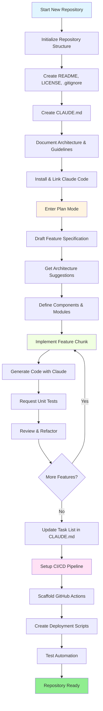
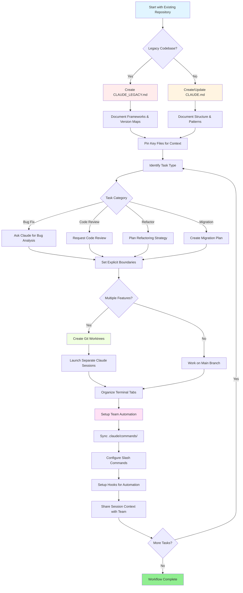

<!-- i18n-source: resources.md -->
<!-- i18n-date: 2026-07-15 -->

<picture>
  <source media="(prefers-color-scheme: dark)" srcset="resources/logos/claude-howto-logo-dark.svg">
  
</picture>

# รายการทรัพยากรที่ดี

## เอกสารอย่างเป็นทางการ

| ทรัพยากร | คำอธิบาย | ลิงก์ |
|----------|-------------|------|
| Claude Code Docs | เอกสาร Claude Code อย่างเป็นทางการ | [code.claude.com/docs/en/overview](https://code.claude.com/docs/en/overview) |
| Anthropic Docs | เอกสาร Anthropic ฉบับเต็ม | [docs.anthropic.com](https://docs.anthropic.com) |
| MCP Protocol | ข้อกำหนด Model Context Protocol | [modelcontextprotocol.io](https://modelcontextprotocol.io) |
| MCP Servers | การพัฒนา MCP server อย่างเป็นทางการ | [github.com/modelcontextprotocol/servers](https://github.com/modelcontextprotocol/servers) |
| Anthropic Cookbook | ตัวอย่างโค้ดและบทเรียน | [github.com/anthropics/anthropic-cookbook](https://github.com/anthropics/anthropic-cookbook) |
| Claude Code Skills | repository skills ของชุมชน | [github.com/anthropics/skills](https://github.com/anthropics/skills) |
| Agent Teams | การประสานงานและการทำงานร่วมกันของ agents หลายตัว | [code.claude.com/docs/en/agent-teams](https://code.claude.com/docs/en/agent-teams) |
| Scheduled Tasks | งานที่ทำซ้ำด้วย /loop และ cron | [code.claude.com/docs/en/scheduled-tasks](https://code.claude.com/docs/en/scheduled-tasks) |
| Chrome Integration | การทำงานอัตโนมัติในเบราว์เซอร์ | [code.claude.com/docs/en/chrome](https://code.claude.com/docs/en/chrome) |
| Keybindings | การปรับแต่งคีย์ลัด | [code.claude.com/docs/en/keybindings](https://code.claude.com/docs/en/keybindings) |
| Desktop App | แอปพลิเคชัน desktop แบบ native | [code.claude.com/docs/en/desktop](https://code.claude.com/docs/en/desktop) |
| Remote Control | การควบคุมเซสชันจากระยะไกล | [code.claude.com/docs/en/remote-control](https://code.claude.com/docs/en/remote-control) |
| Auto Mode | การจัดการสิทธิ์อัตโนมัติ | [code.claude.com/docs/en/permissions](https://code.claude.com/docs/en/permissions) |
| Channels | การสื่อสารหลายช่องทาง | [code.claude.com/docs/en/channels](https://code.claude.com/docs/en/channels) |
| Voice Dictation | การป้อนข้อมูลด้วยเสียงสำหรับ Claude Code | [code.claude.com/docs/en/voice-dictation](https://code.claude.com/docs/en/voice-dictation) |

## Anthropic Engineering Blog

| บทความ | คำอธิบาย | ลิงก์ |
|---------|-------------|------|
| Code Execution with MCP | วิธีแก้ปัญหา MCP context bloat โดยใช้ code execution — ลดปริมาณ token ได้ 98.7% | [anthropic.com/engineering/code-execution-with-mcp](https://www.anthropic.com/engineering/code-execution-with-mcp) |

---

## Mastering Claude Code ใน 30 นาที

_วิดีโอ_: https://www.youtube.com/watch?v=6eBSHbLKuN0

_**เคล็ดลับทั้งหมด**_
- **สำรวจฟีเจอร์ขั้นสูงและคีย์ลัด**
  - ตรวจสอบฟีเจอร์การแก้ไขโค้ดและ context ใหม่ของ Claude ใน release notes อย่างสม่ำเสมอ
  - เรียนรู้คีย์ลัดเพื่อสลับระหว่างมุมมอง chat, ไฟล์, และ editor อย่างรวดเร็ว

- **การตั้งค่าที่มีประสิทธิภาพ**
  - สร้างเซสชันเฉพาะโปรเจกต์พร้อมชื่อ/คำอธิบายที่ชัดเจนเพื่อให้เรียกคืนได้ง่าย
  - Pin ไฟล์หรือโฟลเดอร์ที่ใช้บ่อยที่สุดเพื่อให้ Claude เข้าถึงได้ตลอดเวลา
  - ตั้งค่าการผสานรวมของ Claude (เช่น GitHub, IDE ยอดนิยม) เพื่อทำให้กระบวนการพัฒนาราบรื่นขึ้น

- **การถามตอบ Codebase อย่างมีประสิทธิภาพ**
  - ถาม Claude คำถามละเอียดเกี่ยวกับสถาปัตยกรรม, design patterns, และ modules เฉพาะ
  - ใช้การอ้างอิงไฟล์และบรรทัดในคำถาม (เช่น "โลจิกใน `app/models/user.py` ทำอะไร?")
  - สำหรับ codebase ขนาดใหญ่ ให้สรุปหรือ manifest เพื่อช่วยให้ Claude โฟกัสได้
  - **ตัวอย่าง prompt**: _"คุณช่วยอธิบาย authentication flow ที่พัฒนาใน src/auth/AuthService.ts:45-120 ได้ไหม? มันผสานรวมกับ middleware ใน src/middleware/auth.ts อย่างไร?"_

- **การแก้ไขและ Refactoring โค้ด**
  - ใช้ inline comments หรือคำขอในบล็อกโค้ดเพื่อรับการแก้ไขที่มุ่งเน้น ("Refactor this function for clarity")
  - ขอการเปรียบเทียบก่อน/หลังแบบ side-by-side
  - ให้ Claude สร้าง tests หรือเอกสารหลังการแก้ไขหลักเพื่อประกันคุณภาพ
  - **ตัวอย่าง prompt**: _"Refactor ฟังก์ชัน getUserData ใน api/users.js ให้ใช้ async/await แทน promises แสดงการเปรียบเทียบก่อน/หลัง และสร้าง unit tests สำหรับเวอร์ชันที่ refactor แล้ว"_

- **การจัดการ Context**
  - จำกัดโค้ด/context ที่ paste มาเฉพาะสิ่งที่เกี่ยวข้องกับงานปัจจุบัน
  - ใช้ prompts ที่มีโครงสร้าง ("นี่คือไฟล์ A, นี่คือฟังก์ชัน B, คำถามของฉันคือ X") เพื่อประสิทธิภาพสูงสุด
  - ลบหรือยุบไฟล์ขนาดใหญ่ใน prompt window เพื่อหลีกเลี่ยงการเกินขีดจำกัด context
  - **ตัวอย่าง prompt**: _"นี่คือ User model จาก models/User.js และฟังก์ชัน validateUser จาก utils/validation.js คำถามของฉันคือ: จะเพิ่มการตรวจสอบ email ได้อย่างไรโดยรักษา backward compatibility?"_

- **การผสานรวมเครื่องมือทีม**
  - เชื่อมต่อเซสชัน Claude กับ repositories และเอกสารของทีม
  - ใช้ templates ในตัวหรือสร้าง template ที่กำหนดเองสำหรับงานวิศวกรรมที่ทำซ้ำ
  - ทำงานร่วมกันโดยแชร์ transcript ของเซสชันและ prompts กับเพื่อนร่วมทีม

- **เพิ่มประสิทธิภาพ**
  - ให้คำแนะนำที่ชัดเจนและมุ่งเน้นเป้าหมายแก่ Claude (เช่น "สรุป class นี้ใน 5 bullet points")
  - ตัดความคิดเห็นที่ไม่จำเป็นและ boilerplate ออกจาก context windows
  - ถ้า output ของ Claude หลุดเป้า ให้ reset context หรือ rephrase คำถามเพื่อให้สอดคล้องกันมากขึ้น
  - **ตัวอย่าง prompt**: _"สรุป class DatabaseManager ใน src/db/Manager.ts ใน 5 bullet points โดยเน้นที่ความรับผิดชอบหลักและ methods สำคัญ"_

- **ตัวอย่างการใช้งานจริง**
  - Debugging: Paste ข้อผิดพลาดและ stack traces แล้วขอสาเหตุที่เป็นไปได้และการแก้ไข
  - การสร้าง Test: ขอ property-based, unit, หรือ integration tests สำหรับ logic ที่ซับซ้อน
  - Code Reviews: ขอให้ Claude ระบุการเปลี่ยนแปลงที่มีความเสี่ยง, edge cases, หรือ code smells
  - **ตัวอย่าง prompts**:
    - _"ฉันได้รับข้อผิดพลาดนี้: 'TypeError: Cannot read property 'map' of undefined at line 42 in components/UserList.jsx' นี่คือ stack trace และโค้ดที่เกี่ยวข้อง อะไรทำให้เกิดสิ่งนี้และแก้ไขได้อย่างไร?"_
    - _"สร้าง unit tests ที่ครอบคลุมสำหรับ class PaymentProcessor รวมถึง edge cases สำหรับธุรกรรมที่ล้มเหลว, timeouts, และ inputs ที่ไม่ถูกต้อง"_
    - _"ตรวจสอบ pull request diff นี้และระบุปัญหาความปลอดภัย, จุดคอขวดด้านประสิทธิภาพ, และ code smells ที่อาจเกิดขึ้น"_

- **การทำงานอัตโนมัติของ Workflow**
  - script งานที่ทำซ้ำ (เช่น การจัดรูปแบบ, การล้างข้อมูล, และการเปลี่ยนชื่อที่ทำซ้ำ) โดยใช้ Claude prompts
  - ใช้ Claude ร่างคำอธิบาย PR, release notes, หรือเอกสารตาม code diffs
  - **ตัวอย่าง prompt**: _"จาก git diff สร้างคำอธิบาย PR ละเอียดพร้อมสรุปการเปลี่ยนแปลง, รายการไฟล์ที่แก้ไข, ขั้นตอนการทดสอบ, และผลกระทบที่อาจเกิดขึ้น รวมถึงสร้าง release notes สำหรับเวอร์ชัน 2.3.0"_

**เคล็ดลับ**: สำหรับผลลัพธ์ที่ดีที่สุด ให้รวมแนวปฏิบัติเหล่านี้หลายอย่าง — เริ่มต้นด้วยการ pin ไฟล์สำคัญและสรุปเป้าหมาย จากนั้นใช้ prompts ที่มุ่งเน้นและเครื่องมือ refactoring ของ Claude เพื่อปรับปรุง codebase และระบบอัตโนมัติอย่างค่อยเป็นค่อยไป

**Workflow ที่แนะนำกับ Claude Code**

### Workflow ที่แนะนำกับ Claude Code

#### สำหรับ Repository ใหม่

1. **กำหนดค่า Repository และการผสานรวม Claude**
   - ตั้งค่า repository ใหม่พร้อมโครงสร้างที่จำเป็น: README, LICENSE, .gitignore, การกำหนดค่า root
   - สร้างไฟล์ `CLAUDE.md` ที่อธิบายสถาปัตยกรรม, เป้าหมายระดับสูง, และแนวทางการเขียนโค้ด
   - ติดตั้ง Claude Code และเชื่อมโยงกับ repository ของคุณเพื่อรับคำแนะนำโค้ด, การสร้างโครง test, และการทำงานอัตโนมัติของ workflow

2. **ใช้ Plan Mode และ Specs**
   - ใช้ plan mode (`shift-tab` หรือ `/plan`) เพื่อร่าง specification ละเอียดก่อนพัฒนาฟีเจอร์
   - ขอคำแนะนำสถาปัตยกรรมและ layout โปรเจกต์เริ่มต้นจาก Claude
   - รักษาลำดับ prompt ที่ชัดเจนและมุ่งเน้นเป้าหมาย — ขอโครงร่าง component, modules หลัก, และความรับผิดชอบ

3. **พัฒนาและตรวจสอบแบบ Iterative**
   - พัฒนาฟีเจอร์หลักในชิ้นเล็กๆ โดยขอให้ Claude สร้างโค้ด, refactor, และจัดทำเอกสาร
   - ขอ unit tests และตัวอย่างหลังแต่ละ increment
   - รักษารายการงานที่กำลังดำเนินการใน CLAUDE.md

4. **ทำงานอัตโนมัติ CI/CD และ Deployment**
   - ใช้ Claude เพื่อสร้าง GitHub Actions, npm/yarn scripts, หรือ deployment workflows
   - ปรับ pipelines ได้ง่ายโดยอัปเดต CLAUDE.md และขอคำสั่ง/scripts ที่สอดคล้องกัน

#### สำหรับ Repository ที่มีอยู่แล้ว

1. **ตั้งค่า Repository และ Context**
   - เพิ่มหรืออัปเดต `CLAUDE.md` เพื่อจัดทำเอกสารโครงสร้าง repo, รูปแบบการเขียนโค้ด, และไฟล์สำคัญ สำหรับ repos แบบ legacy ใช้ `CLAUDE_LEGACY.md` ครอบคลุม frameworks, version maps, คำแนะนำ, bugs, และบันทึกการอัปเกรด
   - Pin หรือเน้นไฟล์หลักที่ Claude ควรใช้เป็น context

2. **การถามตอบโค้ดตาม Context**
   - ขอ Claude ตรวจสอบโค้ด, อธิบายปัญหา, refactor, หรือวางแผนการย้ายโดยอ้างอิงไฟล์/ฟังก์ชันเฉพาะ
   - ให้ขอบเขตที่ชัดเจนแก่ Claude (เช่น "แก้ไขเฉพาะไฟล์เหล่านี้" หรือ "ไม่มี dependencies ใหม่")

3. **การจัดการ Branch, Worktree, และ Multi-Session**
   - ใช้ git worktrees หลายตัวสำหรับฟีเจอร์หรือการแก้ไขข้อผิดพลาดที่แยกกัน และเปิดเซสชัน Claude แยกต่อ worktree
   - รักษาแท็บ terminal/หน้าต่างที่จัดระเบียบตาม branch หรือฟีเจอร์สำหรับ workflows แบบขนาน

4. **เครื่องมือทีมและระบบอัตโนมัติ**
   - ซิงค์คำสั่งกำหนดเองผ่าน `.claude/commands/` เพื่อความสอดคล้องทั่วทีม
   - ทำให้งานที่ทำซ้ำเป็นอัตโนมัติ, การสร้าง PR, และการจัดรูปแบบโค้ดผ่าน slash commands หรือ hooks ของ Claude
   - แชร์เซสชันและ context กับสมาชิกในทีมเพื่อการแก้ไขปัญหาและการตรวจสอบร่วมกัน

**เคล็ดลับ**:
- เริ่มต้นแต่ละฟีเจอร์หรือการแก้ไขใหม่ด้วย spec และ prompt ใน plan mode
- สำหรับ repos แบบ legacy และซับซ้อน ให้เก็บคำแนะนำละเอียดใน CLAUDE.md/CLAUDE_LEGACY.md
- ให้คำแนะนำที่ชัดเจนและมุ่งเน้น และแบ่งงานที่ซับซ้อนเป็นแผนหลายเฟส
- ล้างเซสชัน, ตัด context, และลบ worktrees ที่เสร็จสิ้นอย่างสม่ำเสมอเพื่อหลีกเลี่ยงความยุ่งเหยิง

ขั้นตอนเหล่านี้ครอบคลุมคำแนะนำหลักสำหรับ workflows ที่ราบรื่นกับ Claude Code ทั้งใน codebase ใหม่และที่มีอยู่แล้ว

---

## ฟีเจอร์และความสามารถใหม่ (มีนาคม 2026)

### ทรัพยากรฟีเจอร์สำคัญ

| ฟีเจอร์ | คำอธิบาย | เรียนรู้เพิ่มเติม |
|---------|-------------|------------|
| **Auto Memory** | Claude เรียนรู้และจดจำความชอบของคุณอัตโนมัติข้ามเซสชัน | [Memory Guide](../02-memory/) |
| **Remote Control** | ควบคุมเซสชัน Claude Code แบบ programmatic จากเครื่องมือและ scripts ภายนอก | [Advanced Features](../09-advanced-features/) |
| **Web Sessions** | เข้าถึง Claude Code ผ่าน interface บนเบราว์เซอร์สำหรับการพัฒนาระยะไกล | [CLI Reference](../10-cli/) |
| **Desktop App** | แอปพลิเคชัน desktop แบบ native สำหรับ Claude Code พร้อม UI ที่ปรับปรุงแล้ว | [Claude Code Docs](https://code.claude.com/docs/en/desktop) |
| **Extended Thinking** | การสลับ reasoning เชิงลึกผ่าน `Alt+T`/`Option+T` หรือ env var `MAX_THINKING_TOKENS` | [Advanced Features](../09-advanced-features/) |
| **Permission Modes** | การควบคุมแบบ fine-grained: default, acceptEdits, plan, auto, dontAsk, bypassPermissions | [Advanced Features](../09-advanced-features/) |
| **7-Tier Memory** | Managed Policy, Project, Project Rules, User, User Rules, Local, Auto Memory | [Memory Guide](../02-memory/) |
| **Hook Events** | 28 เหตุการณ์: PreToolUse, PostToolUse, PostToolUseFailure, Stop, StopFailure, SubagentStart, SubagentStop, Notification, Elicitation และอื่นๆ | [Hooks Guide](../06-hooks/) |
| **Agent Teams** | ประสานงาน agents หลายตัวที่ทำงานร่วมกันในงานที่ซับซ้อน | [Subagents Guide](../04-subagents/) |
| **Scheduled Tasks** | ตั้งค่างานที่ทำซ้ำด้วย `/loop` และ cron tools | [Advanced Features](../09-advanced-features/) |
| **Chrome Integration** | การทำงานอัตโนมัติในเบราว์เซอร์ด้วย headless Chromium | [Advanced Features](../09-advanced-features/) |
| **Keyboard Customization** | ปรับแต่ง keybindings รวมถึง chord sequences | [Advanced Features](../09-advanced-features/) |
| **Monitor Tool** | ดูสตรีม stdout ของคำสั่งพื้นหลังและตอบสนองต่อเหตุการณ์แทนการ polling (v2.1.98+) | [Advanced Features](../09-advanced-features/) |

---
**อัปเดตล่าสุด**: 6 พฤษภาคม 2026
**Claude Code Version**: 2.1.131
**แหล่งที่มา**:
- https://code.claude.com/docs/en/overview
- https://code.claude.com/docs/en/changelog
- https://github.com/anthropics/claude-code/releases/tag/v2.1.131
**Compatible Models**: Claude Sonnet 4.6, Claude Opus 4.7, Claude Haiku 4.5
