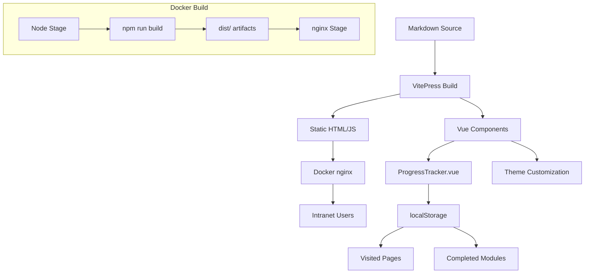

# feat: Convert Documentation Repository to Dockerized Website

## Overview

Convert the claude-howto Chinese documentation repository into a modern, Dockerized static website for intranet deployment. The site will feature learning path progress tracking, built-in search, Mermaid diagram rendering, and a polished UI matching the existing brand design system.

## Problem Statement / Motivation

The current repository is documentation-as-code with markdown files organized into 10 numbered learning modules (01-10). Content is accessible via:
- GitHub repository browsing (not user-friendly for learning)
- EPUB download (offline reading, no interactive features)
- No web interface for guided learning with progress tracking

For intranet/team deployment, a proper documentation website would provide:
- **Guided learning experience** with visual progress tracking
- **Interactive navigation** through 10 modules in intended order
- **Search functionality** for quick content discovery
- **Modern UI** matching established brand identity
- **Self-hosted deployment** via Docker for intranet environments

## Proposed Solution

Build a VitePress static site with:

### Core Stack
- **VitePress** - Vue-based static site generator with built-in Mermaid support (v1.0+)
- **Docker multi-stage build** - Node.js build stage → nginx production stage
- **Custom Vue components** - Progress tracking with localStorage persistence
- **Built-in local search** - MiniSearch with Chinese translations

### Architecture



### Key Features

| Feature | Implementation |
|---------|---------------|
| **Learning Path Progress** | Vue component tracking module completion via localStorage |
| **Mermaid Diagrams** | Client-side rendering via VitePress built-in support |
| **Chinese Content** | Native i18n configuration with Chinese search translations |
| **Dark/Light Mode** | VitePress built-in toggle with custom brand colors |
| **Search** | Built-in MiniSearch (works offline/intranet) |
| **Navigation** | Sidebar preserving 01-10 module ordering |

## Technical Considerations

### Mermaid Rendering Strategy

**Decision**: Client-side rendering (VitePress built-in)

**Rationale**:
- VitePress v1.0+ has built-in Mermaid support via `markdown.mermaid: true`
- Simpler build process (no `mmdc` CLI dependency)
- Interactive diagrams (hover states, click events possible)
- mermaid.js cached after first load (~2MB)

**Alternative considered**: Pre-render to SVG/PNG (matches EPUB approach)
- Rejected: Adds build complexity, loses interactivity

**Risk mitigation**: Test Chinese label rendering in Mermaid diagrams before implementation.

### Progress Tracking Implementation

**Decision**: Explicit user action (click "Mark Complete" button)

**localStorage Schema**:
```json
{
  "learning-progress": {
    "visitedPages": ["path1", "path2"],
    "completedModules": ["01-slash-commands", "02-memory"],
    "lastVisited": "path1",
    "timestamp": "2026-04-07T10:00:00Z"
  }
}
```

**Completion Criteria**: User clicks "Mark Complete" button at module end.

**Progress Calculation**: `(completedModules.length / 10) * 100`

**Limitations**:
- Progress is browser/device specific (localStorage)
- No cross-device sync (intranet auth not in scope)
- User can manually clear progress

### Chinese Content Considerations

| Concern | Solution |
|---------|----------|
| **Font rendering** | System font fallback stack (Noto Sans SC, Source Han Sans) |
| **Search indexing** | VitePress MiniSearch with Chinese translations configured |
| **Anchor links** | Audit existing `<a id="...">` anchors; may need VitePress-compatible conversion |
| **URL encoding** | nginx handles Chinese characters in URLs |

### Design System Integration

Apply colors from `DESIGN-SYSTEM.md`:

| Element | Color | CSS Variable |
|---------|-------|--------------|
| Primary text | `#000000` | `--vp-c-text-1` |
| Accent | `#22C55E` | `--vp-c-brand-1` |
| Secondary | `#6B7280` | `--vp-c-text-2` |
| Dark bg | `#0A0A0A` | `--vp-c-bg` (dark mode) |

### Docker Configuration

```dockerfile
# Stage 1: Build
FROM node:20-alpine AS builder
WORKDIR /app
COPY package*.json ./
RUN npm ci
COPY . .
RUN npm run docs:build

# Stage 2: Production
FROM nginx:alpine
COPY --from=builder /app/docs/.vitepress/dist /usr/share/nginx/html
COPY nginx.conf /etc/nginx/conf.d/default.conf
EXPOSE 80
CMD ["nginx", "-g", "daemon off;"]
```

**nginx.conf** (key sections):
- Gzip compression for performance
- Cache headers for static assets (js, css, images)
- SPA fallback: `try_files $uri $uri/ $uri.html /index.html;`
- Security headers (X-Frame-Options, X-Content-Type-Options)

## System-Wide Impact

### Interaction Graph

```
User visits site → nginx serves static HTML
→ VitePress JS initializes
→ Vue components mount
→ ProgressTracker checks localStorage
→ Mermaid diagrams render client-side
→ Search indexes built from JSON
```

### File Structure Changes

```
zh/
├── .vitepress/
│   ├── config.ts           # VitePress configuration
│   └── theme/
│       ├── index.ts        # Custom theme entry
│       ├── custom.css      # Brand colors, fonts
│       └── components/
│           ├── ProgressTracker.vue
│           └── ModuleBadge.vue
├── package.json            # Node dependencies
├── Dockerfile              # Multi-stage build
├── docker-compose.yml      # Deployment config
├── nginx.conf              # nginx configuration
└── [existing content preserved]
```

### Integration Test Scenarios

1. **Mermaid Chinese labels** - Verify diagrams with Chinese text render correctly
2. **Progress persistence** - Mark complete, close browser, reopen, verify state retained
3. **Search Chinese terms** - Search for "斜杠命令", verify results appear
4. **Dark mode toggle** - Toggle dark/light, verify colors match design system
5. **Module ordering** - Sidebar shows 01-10 in correct sequence, not alphabetical
6. **Cross-reference links** - Click internal link, verify navigation works
7. **Docker build** - Build image, run container, verify site accessible
8. **Offline access** - Disconnect network, verify site still functions (cached)

## Acceptance Criteria

### Functional Requirements

- [ ] Homepage displays learning path overview with progress tracker (empty initially)
- [ ] Sidebar navigation preserves 01-10 module ordering
- [ ] All 42 Mermaid diagrams render correctly with Chinese labels
- [ ] Progress tracker shows percentage complete based on visited/completed modules
- [ ] "Mark Complete" button appears at end of each module page
- [ ] Progress persists across browser sessions (localStorage)
- [ ] Built-in search returns results for Chinese queries
- [ ] Dark/light mode toggle applies brand colors from design system
- [ ] All existing cross-reference links work correctly

### Non-Functional Requirements

- [ ] Docker image size < 50MB (nginx + static files)
- [ ] Page load time < 2s for first visit, < 500ms for cached
- [ ] Works offline after initial load (all assets bundled)
- [ ] Mermaid.js bundle < 2MB (cached after first load)
- [ ] nginx gzip compression enabled for text assets

### Docker Deployment

- [ ] Multi-stage Dockerfile builds successfully
- [ ] Container starts and serves site on port 80
- [ ] nginx SPA fallback handles all routes correctly
- [ ] Container restarts automatically (restart: unless-stopped)
- [ ] Health check endpoint returns 200

### Content Preservation

- [ ] All 100+ markdown files converted to HTML pages
- [ ] Existing `<a id="...">` anchors work (or converted)
- [ ] Logo SVGs display with dark/light variants
- [ ] Badge images handled appropriately for intranet (may need removal)

## Success Metrics

| Metric | Target | Measurement |
|--------|--------|-------------|
| **Build time** | < 60 seconds | Time for `npm run docs:build` |
| **Image size** | < 50MB | `docker images` output |
| **Page load** | < 2s | Lighthouse performance score |
| **Search accuracy** | 90%+ | Manual testing of Chinese queries |
| **Progress tracking** | Working | localStorage persistence verified |

## Dependencies & Risks

### Dependencies

- **Node.js 18+** - VitePress requirement
- **VitePress 1.0+** - Built-in Mermaid support
- **Docker** - For deployment
- **nginx** - Static file serving

### Risks

| Risk | Likelihood | Impact | Mitigation |
|------|------------|--------|------------|
| **Mermaid Chinese labels render poorly** | Medium | High | Test early with sample diagram; consider pre-render fallback |
| **Anchor links break** | Medium | Medium | Audit anchors, convert to VitePress format |
| **External badges fail in intranet** | High | Low | Remove external badges or replace with static text |
| **localStorage quota exceeded** | Low | Low | Schema is minimal (< 1KB) |
| **Chinese font missing on user systems** | Medium | Medium | Bundle Noto Sans SC web font (adds ~5MB) |
| **Build fails due to markdown syntax** | Low | Medium | Pre-commit hooks already validate markdown |

### Blocked By

None - this is a greenfield implementation.

## Implementation Phases

### Phase 1: Foundation (Estimated: 2-3 hours)

1. Initialize VitePress in zh/ directory
2. Create `.vitepress/config.ts` with basic configuration
3. Configure Chinese i18n and search translations
4. Enable Mermaid support (`markdown.mermaid: true`)
5. Test build with subset of content

**Deliverables**: Working VitePress site with basic navigation and Mermaid rendering.

### Phase 2: Theme & Progress (Estimated: 3-4 hours)

1. Create custom theme extending VitePress default
2. Apply design system colors in `custom.css`
3. Build `ProgressTracker.vue` component
4. Implement localStorage progress persistence
5. Add "Mark Complete" button to module pages

**Deliverables**: Polished UI with progress tracking functionality.

### Phase 3: Docker Deployment (Estimated: 1-2 hours)

1. Create multi-stage Dockerfile
2. Write nginx.conf with SPA fallback
3. Create docker-compose.yml
4. Test full build and deployment cycle
5. Document deployment instructions

**Deliverables**: Production-ready Docker image for intranet deployment.

### Phase 4: Polish & Validation (Estimated: 2 hours)

1. Audit and fix anchor links
2. Handle external badges (remove or replace)
3. Test all 42 Mermaid diagrams
4. Test Chinese search functionality
5. Performance optimization (gzip, caching)

**Deliverables**: Production-quality site ready for deployment.

## Sources & References

### Internal References

- Design system: `zh/resources/DESIGN-SYSTEM.md`
- Main entry point: `zh/README.md`
- Learning roadmap: `zh/LEARNING-ROADMAP.md`
- Module index: `zh/INDEX.md`
- EPUB build patterns: `scripts/build_epub.py`
- Pre-commit hooks: `.pre-commit-config.yaml`
- Markdown lint config: `.markdownlint.json`

### External References

- [VitePress Official Documentation](https://vitepress.dev/)
- [VitePress Mermaid Support](https://vitepress.dev/guide/markdown#mermaid)
- [VitePress i18n Guide](https://vitepress.dev/guide/i18n)
- [VitePress Custom Theme](https://vitepress.dev/guide/custom-theme)
- [VitePress Local Search](https://vitepress.dev/reference/default-theme-search#local-search)
- [Docker Multi-stage Builds](https://docs.docker.com/build/building/multi-stage/)

### Open Questions (From SpecFlow Analysis)

1. **Mermaid rendering** - Client-side (default) vs pre-rendered? Client-side selected for simplicity and interactivity.
2. **Progress completion criteria** - Explicit "Mark Complete" button selected.
3. **Progress persistence scope** - localStorage only (no backend auth in scope).
4. **Chinese font strategy** - System fonts fallback; bundle web fonts if rendering issues detected.
5. **Intranet constraints** - Assumed limited internet; external badges removed.

## Files to Create

| File | Purpose |
|------|---------|
| `zh/package.json` | Node dependencies (vitepress) |
| `zh/.vitepress/config.ts` | VitePress configuration (i18n, mermaid, search, nav) |
| `zh/.vitepress/theme/index.ts` | Custom theme entry point |
| `zh/.vitepress/theme/custom.css` | Brand colors, fonts, overrides |
| `zh/.vitepress/theme/components/ProgressTracker.vue` | Progress tracking component |
| `zh/Dockerfile` | Multi-stage build (node -> nginx) |
| `zh/docker-compose.yml` | Deployment configuration |
| `zh/nginx.conf` | nginx configuration (gzip, SPA fallback) |

## Estimated Total Effort

**8-11 hours** across 4 phases:
- Phase 1: 2-3 hours
- Phase 2: 3-4 hours
- Phase 3: 1-2 hours
- Phase 4: 2 hours